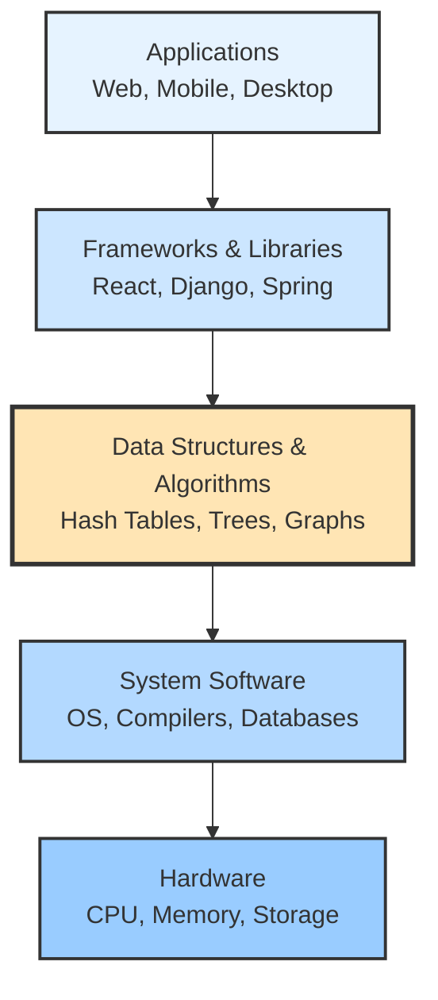

# Chapter 1: Introduction to Data Structures and Algorithms

## 1.1 What Are Data Structures and Algorithms?

### Data Structures
A **data structure** is a way of organizing and storing data in a computer so that it can be accessed and modified efficiently. Think of data structures as containers that hold data in specific arrangements, each optimized for particular types of operations.

For example:
- An **array** stores elements in contiguous memory locations, allowing fast access by index
- A **linked list** connects elements through pointers, enabling efficient insertion and deletion
- A **tree** organizes data hierarchically, facilitating search operations

### Algorithms
An **algorithm** is a step-by-step procedure or set of rules for solving a computational problem. It's a well-defined sequence of instructions that transforms input into the desired output.

Consider searching for a name in a phone book:
- **Linear search**: Check each name from beginning to end
- **Binary search**: Open to the middle, eliminate half, repeat

Both are algorithms, but they have different efficiency characteristics.

## 1.2 Who This Book Is For

This book is written for **software engineers and advanced students** who want to understand data structures not just as abstract concepts, but as tools used in real systems. 

### Target Audience

**Primary Audience:**
- Software engineers preparing for technical interviews
- Computer science students seeking practical understanding
- Developers who want to write efficient, production-ready code
- Engineers who need to make informed decisions about system design

**What This Book Is:**
- A practical guide with real-world implementations
- Focused on understanding *why* and *when* to use each structure
- Emphasizes invariants, failure modes, and system-level considerations
- Provides production-ready C++ code examples

**What This Book Is Not:**
- Not a pure theoretical computer science textbook
- Not a comprehensive reference manual (we focus on commonly used structures)
- Not a beginner's programming tutorial (assumes basic C++ knowledge)
- Not limited to academic exercises (includes real-world pitfalls and optimizations)

### Learning Approach

This book emphasizes:
1. **Invariant-based thinking**: Understanding the core properties that must always hold
2. **Failure modes**: Common pitfalls and how to avoid them
3. **System awareness**: Memory layout, cache behavior, and performance implications
4. **Practical reasoning**: Why certain operations are fast or slow in practice

## 1.3 Why DSA Matters: Real-World Impact

Data structures and algorithms are not just academic exercises—they power the systems we use every day. Understanding them helps you build better software and solve real-world problems.

### Real-World Applications

**Search Engines (Google's PageRank)**:
- Uses graph algorithms to rank web pages
- Hash tables for fast indexing
- Efficient data structures handle billions of web pages
- **Without DSA**: Google search would be impossibly slow

**Social Networks (Facebook, LinkedIn)**:
- Graph algorithms for friend recommendations
- Efficient data structures for billions of users
- Shortest path algorithms for connection suggestions
- **Without DSA**: Social networks couldn't scale

**E-Commerce (Amazon, Netflix)**:
- Recommendation systems use collaborative filtering (matrix operations)
- Hash tables for product lookups
- Sorting algorithms for search results
- **Without DSA**: Recommendations would be inaccurate or too slow

**Navigation Systems (Google Maps, GPS)**:
- Shortest path algorithms (Dijkstra's, A*)
- Graph data structures for road networks
- Efficient routing for millions of users
- **Without DSA**: GPS navigation wouldn't work

**Databases (MySQL, PostgreSQL)**:
- B-trees for indexing
- Hash tables for fast lookups
- Sorting algorithms for queries
- **Without DSA**: Databases would be unusably slow

**Operating Systems**:
- Process scheduling (priority queues)
- Memory management (hash tables, trees)
- File systems (tree structures)
- **Without DSA**: Operating systems couldn't function

### Why Study Data Structures and Algorithms?

#### 1. Problem-Solving Foundation
Data structures and algorithms form the backbone of computer science. They teach you how to:
- Break down complex problems into manageable parts
- Think systematically about solutions
- Optimize for both time and space efficiency

#### 2. Technical Interview Preparation
Most technology companies assess candidates on:
- Algorithm design and analysis
- Data structure selection and implementation
- Problem-solving approach and coding ability

#### 3. Performance Optimization
Understanding algorithms helps you:
- Choose the right data structure for your problem
- Optimize existing code for better performance
- Predict system behavior under different loads

#### 4. Software Engineering Best Practices
- Writing maintainable and efficient code
- Understanding trade-offs between different approaches
- Making informed decisions about system design

### DSA in the Software Stack



**Key Insight**: DSA is the foundation that enables all software layers above it. Understanding DSA helps you make better decisions at every level.

## 1.3 Problem-Solving Methodology

### Step 1: Understand the Problem
Before writing any code, ensure you fully understand:
- What is the input?
- What is the expected output?
- Are there any constraints or edge cases?
- What are the requirements (time/space limits)?

### Step 2: Design the Algorithm
- Break the problem into smaller subproblems
- Identify patterns or similar problems you've seen
- Consider different approaches and their trade-offs
- Choose the most appropriate data structures

### Step 3: Analyze Complexity
- Determine time and space complexity
- Consider best-case, average-case, and worst-case scenarios
- Ensure the solution meets performance requirements

### Step 4: Implement the Solution
- Write clean, readable code
- Handle edge cases appropriately
- Add comments for complex logic
- Test with various inputs

### Step 5: Test and Optimize
- Verify correctness with test cases
- Profile performance if needed
- Optimize if requirements aren't met
- Refactor for better maintainability

## 1.4 How to Use This Book

### Learning Paths

This book is designed to be flexible. Choose the path that matches your goals:

#### Path 1: Interview Preparation (8-12 weeks)
**Focus**: Practical problem-solving for technical interviews

**Chapters to Study**:
- Chapters 3-6: Core data structures (Arrays, Linked Lists, Stacks, Queues, Trees)
- Chapters 9-13: Essential algorithms (Sorting, Searching, Hash Tables, Graphs, DP)
- Chapter 15: Problem-solving strategies
- Chapter 8: Recursion and Backtracking

**Time Commitment**: 10-15 hours/week
**Skip**: Chapters 7, 14, 16-18 (advanced topics)

**Goal**: Be interview-ready with strong problem-solving skills

#### Path 2: Computer Science Student (1 semester)
**Focus**: Comprehensive understanding of DSA fundamentals

**Chapters to Study**: All chapters in order
**Time Commitment**: 6-8 hours/week
**Projects**: Complete projects at end of each part

**Goal**: Solid theoretical and practical foundation

#### Path 3: Working Professional (Self-paced)
**Focus**: Fill knowledge gaps, practical application

**Approach**: 
- Identify gaps in your knowledge
- Deep dive into specific chapters
- Apply concepts to your work projects

**Time Commitment**: 5-10 hours/week (flexible)
**Goal**: Improve code quality and system design skills

### What to Expect

**Book Structure**:
- **Part I: Foundations** (Chapters 1-2): Introduction and complexity analysis
- **Part II: Linear Data Structures** (Chapters 3-5): Arrays, Linked Lists, Stacks, Queues
- **Part III: Non-Linear Data Structures** (Chapters 6-11): Trees, Graphs, Hash Tables, String Algorithms
- **Part IV: Algorithm Design Paradigms** (Chapters 12-17): DP, Greedy, Divide & Conquer
- **Part V: Advanced Topics** (Chapter 18): Modern optimizations

**Each Chapter Includes**:
- Core concepts with clear explanations
- Code implementations in C++
- Complexity analysis
- Real-world applications
- Practice exercises
- Systems perspective (where applicable)

**Learning Progression**:
1. **Understand**: Read explanations and study examples
2. **Implement**: Write code yourself (don't just copy)
3. **Analyze**: Understand time/space complexity
4. **Apply**: Solve exercises and practice problems
5. **Connect**: See how concepts relate across chapters

### Prerequisites

**Required Knowledge**:
- **Programming**: Basic C++ (variables, loops, functions, classes)
- **Mathematics**: Basic algebra, logarithms
- **Computer Science**: Basic understanding of memory and CPU

**Prerequisite Self-Assessment**:

Can you answer these questions? If yes, you're ready!

1. **C++ Basics**:
   - [ ] Can you write a function that takes parameters and returns a value?
   - [ ] Do you understand pointers and references?
   - [ ] Can you use STL containers (vector, map, set)?
   - [ ] Do you understand classes and objects?

2. **Problem-Solving**:
   - [ ] Can you break down a problem into smaller steps?
   - [ ] Can you trace through code execution?
   - [ ] Do you understand basic control flow (if/else, loops)?

3. **Mathematics**:
   - [ ] Can you work with exponents and logarithms?
   - [ ] Do you understand basic functions (linear, quadratic)?
   - [ ] Can you analyze simple mathematical relationships?

**If you answered "No" to 3+ questions**: Consider reviewing C++ basics first. This book assumes familiarity with programming fundamentals.

**If you answered "Yes" to most questions**: You're ready! This book will build on your foundation.

### Visual Roadmap

```mermaid
graph LR
    Start[Start Here] --> Ch1[Ch 1: Introduction]
    Ch1 --> Ch2[Ch 2: Complexity]
    Ch2 --> Ch3[Ch 3: Arrays]
    Ch3 --> Ch4[Ch 4: Linked Lists]
    Ch4 --> Ch5[Ch 5: Stacks/Queues]
    Ch5 --> Ch6[Ch 6: Trees]
    Ch6 --> Ch8[Ch 8: Recursion]
    Ch8 --> Ch9[Ch 9: Sorting]
    Ch9 --> Ch10[Ch 10: Hash Tables]
    Ch10 --> Ch11[Ch 11: Graphs]
    Ch11 --> Ch12[Ch 12: DP]
    Ch12 --> Ch15[Ch 15: Problem Solving]
    Ch15 --> Advanced[Advanced Topics]
    
    style Start fill:#90EE90,stroke:#333,stroke-width:3px
    style Ch1 fill:#E6F3FF,stroke:#333,stroke-width:2px
    style Ch2 fill:#E6F3FF,stroke:#333,stroke-width:2px
    style Ch3 fill:#E6F3FF,stroke:#333,stroke-width:2px
    style Ch4 fill:#E6F3FF,stroke:#333,stroke-width:2px
    style Ch5 fill:#E6F3FF,stroke:#333,stroke-width:2px
    style Ch6 fill:#E6F3FF,stroke:#333,stroke-width:2px
    style Ch8 fill:#E6F3FF,stroke:#333,stroke-width:2px
    style Ch9 fill:#E6F3FF,stroke:#333,stroke-width:2px
    style Ch10 fill:#E6F3FF,stroke:#333,stroke-width:2px
    style Ch11 fill:#E6F3FF,stroke:#333,stroke-width:2px
    style Ch12 fill:#E6F3FF,stroke:#333,stroke-width:2px
    style Ch15 fill:#FFE5B4,stroke:#333,stroke-width:2px
    style Advanced fill:#FFB6C1,stroke:#333,stroke-width:2px
```



## 1.5 Programming Environment Setup

### C++ Compiler Setup
For this book, we'll use modern C++ (C++17/C++20) features. Ensure you have:

#### Option 1: GCC/G++
```bash
# Install on Ubuntu/Debian
sudo apt update
sudo apt install g++

# Install on macOS
brew install gcc

# Check version
g++ --version
```

#### Option 2: Clang
```bash
# Install on macOS (comes with Xcode)
xcode-select --install

# Install on Ubuntu/Debian
sudo apt install clang

# Check version
clang++ --version
```

### Compilation Commands
```bash
# Basic compilation
g++ -std=c++17 -o program source.cpp

# With debugging information
g++ -std=c++17 -g -o program source.cpp

# With optimization
g++ -std=c++17 -O2 -o program source.cpp

# With warnings
g++ -std=c++17 -Wall -Wextra -o program source.cpp
```

### Basic C++ Template
Here's a template we'll use for most examples:

```cpp
#include <iostream>
#include <vector>
#include <algorithm>
#include <string>
#include <unordered_map>
#include <unordered_set>
#include <queue>
#include <stack>
#include <climits>
#include <cmath>

using namespace std;

int main() {
    // Your code here
    return 0;
}
```

## 1.6 Common C++ Data Structures and Libraries

### Standard Template Library (STL) Containers

#### Sequential Containers
```cpp
#include <vector>
#include <array>
#include <deque>
#include <list>

// Dynamic array
vector<int> vec = {1, 2, 3, 4, 5};

// Fixed-size array
array<int, 5> arr = {1, 2, 3, 4, 5};

// Double-ended queue
deque<int> dq = {1, 2, 3, 4, 5};

// Doubly linked list
list<int> lst = {1, 2, 3, 4, 5};
```

#### Associative Containers
```cpp
#include <map>
#include <unordered_map>
#include <set>
#include <unordered_set>

// Ordered map (red-black tree)
map<string, int> mp;
mp["apple"] = 5;

// Hash map
unordered_map<string, int> ump;
ump["apple"] = 5;

// Ordered set
set<int> s;
s.insert(5);

// Hash set
unordered_set<int> us;
us.insert(5);
```

#### Container Adapters
```cpp
#include <stack>
#include <queue>
#include <priority_queue>

// Stack (LIFO)
stack<int> stk;
stk.push(5);
int top = stk.top();
stk.pop();

// Queue (FIFO)
queue<int> q;
q.push(5);
int front = q.front();
q.pop();

// Priority queue (heap)
priority_queue<int> pq;
pq.push(5);
int top = pq.top();
pq.pop();
```

### Common Algorithms
```cpp
#include <algorithm>

vector<int> vec = {5, 2, 8, 1, 9};

// Sorting
sort(vec.begin(), vec.end());

// Binary search
bool found = binary_search(vec.begin(), vec.end(), 5);

// Finding elements
auto it = find(vec.begin(), vec.end(), 8);

// Counting
int count = count(vec.begin(), vec.end(), 5);

// Accumulating
int sum = accumulate(vec.begin(), vec.end(), 0);

// Reversing
reverse(vec.begin(), vec.end());
```

## 1.7 Example: Your First Algorithm

Let's implement a simple algorithm to find the maximum element in an array:

```cpp
#include <iostream>
#include <vector>
#include <algorithm>
using namespace std;

// Method 1: Using STL
int findMaxSTL(const vector<int>& arr) {
    if (arr.empty()) {
        throw invalid_argument("Array is empty");
    }
    return *max_element(arr.begin(), arr.end());
}

// Method 2: Manual implementation
int findMaxManual(const vector<int>& arr) {
    if (arr.empty()) {
        throw invalid_argument("Array is empty");
    }
    
    int maxVal = arr[0];
    for (size_t i = 1; i < arr.size(); ++i) {
        if (arr[i] > maxVal) {
            maxVal = arr[i];
        }
    }
    return maxVal;
}

// Method 3: Using iterator
int findMaxIterator(const vector<int>& arr) {
    if (arr.empty()) {
        throw invalid_argument("Array is empty");
    }
    
    int maxVal = arr[0];
    for (auto it = arr.begin() + 1; it != arr.end(); ++it) {
        if (*it > maxVal) {
            maxVal = *it;
        }
    }
    return maxVal;
}

int main() {
    vector<int> numbers = {3, 7, 2, 9, 1, 5, 8, 4};
    
    cout << "Array: ";
    for (int num : numbers) {
        cout << num << " ";
    }
    cout << endl;
    
    cout << "Maximum (STL): " << findMaxSTL(numbers) << endl;
    cout << "Maximum (Manual): " << findMaxManual(numbers) << endl;
    cout << "Maximum (Iterator): " << findMaxIterator(numbers) << endl;
    
    return 0;
}
```

### Analysis of the Algorithm
- **Time Complexity**: O(n) - We need to examine each element once
- **Space Complexity**: O(1) - We only use a constant amount of extra space
- **Best Case**: O(n) - Even if the maximum is the first element, we still need to verify
- **Worst Case**: O(n) - Same as best case for this algorithm

## 1.8 Key Takeaways

1. **Data structures** organize data for efficient access and modification
2. **Algorithms** are systematic procedures for solving problems
3. **Problem-solving** requires understanding, design, analysis, implementation, and testing
4. **Modern C++** provides powerful tools through the Standard Template Library
5. **Performance analysis** is crucial for choosing the right approach

## 1.9 Exercises

1. Implement a function to find the minimum element in an array using three different approaches.
2. Write a function that counts the number of occurrences of a specific value in an array.
3. Create a function that reverses an array in-place.
4. Implement a function that checks if an array contains duplicate elements.
5. Write a function that finds the second largest element in an array.

## 1.10 Summary

This chapter introduced the fundamental concepts of data structures and algorithms, explained their importance in computer science and software engineering, and provided a foundation for the systematic approach to problem-solving that we'll use throughout this book. We also set up our programming environment and reviewed essential C++ features that will be used in subsequent chapters.

In the next chapter, we'll dive deeper into analyzing the efficiency of algorithms using Big O notation and complexity analysis techniques.
