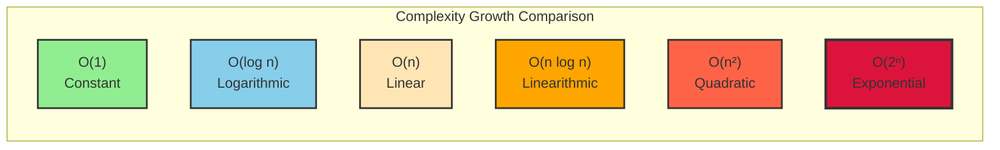
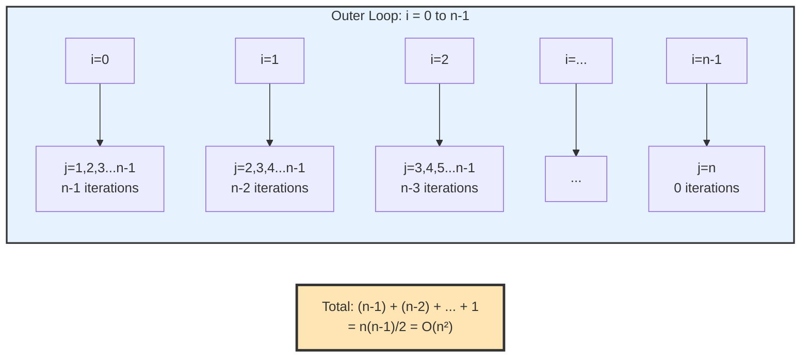
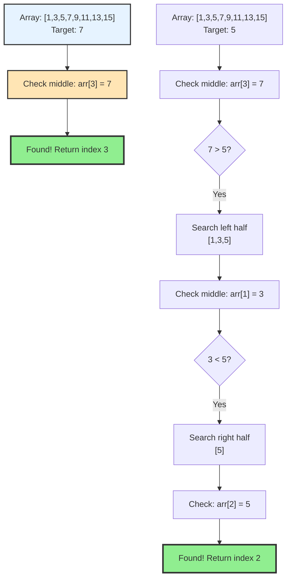

# Chapter 2: Time and Space Complexity Analysis

## 2.1 Introduction to Complexity Analysis

Complexity analysis is the process of determining how the resource requirements (time and space) of an algorithm scale with the input size. This helps us:
- Compare different algorithms for the same problem
- Predict performance on large inputs
- Choose the most appropriate algorithm for our constraints
- Optimize code when performance is critical

## 2.2 Big O Notation

Big O notation describes the upper bound of an algorithm's growth rate. It tells us how an algorithm's performance scales as the input size increases.

### Mathematical Definition
For functions f(n) and g(n), we say f(n) = O(g(n)) if there exist positive constants c and n₀ such that:
```
f(n) ≤ c × g(n) for all n ≥ n₀
```

### Common Big O Notations (from best to worst)

| Notation | Name | Description | Example |
|----------|------|-------------|---------|
| O(1) | Constant | Time/space doesn't change with input | Array access by index |
| O(log n) | Logarithmic | Time/space grows logarithmically | Binary search |
| O(n) | Linear | Time/space grows linearly | Linear search |
| O(n log n) | Linearithmic | Time/space grows as n times log n | Merge sort |
| O(n²) | Quadratic | Time/space grows quadratically | Bubble sort |
| O(n³) | Cubic | Time/space grows cubically | Matrix multiplication |
| O(2ⁿ) | Exponential | Time/space grows exponentially | Brute force subset generation |
| O(n!) | Factorial | Time/space grows factorially | Permutation generation |

### Visual Representation of Growth Rates



**Growth Rate Comparison Table**:

| n     | O(1) | O(log n) | O(n) | O(n log n) | O(n²) | O(2ⁿ) |
|-------|------|----------|------|------------|-------|-------|
| 1     | 1    | 0        | 1    | 0          | 1     | 2     |
| 10    | 1    | 3.32     | 10   | 33.2       | 100   | 1,024 |
| 100   | 1    | 6.64     | 100  | 664        | 10,000| 1.27×10³⁰ |
| 1,000 | 1    | 9.97     | 1,000| 9,966      | 10⁶   | Massive |

**Key Insight**: Exponential and factorial complexities become impractical very quickly. Even O(n²) can be problematic for large inputs.

## 2.3 Time Complexity Analysis

### Rules for Analyzing Time Complexity

1. **Drop Constants**: O(2n) becomes O(n)
2. **Drop Lower Order Terms**: O(n² + n + 1) becomes O(n²)
3. **Different Terms for Inputs**: O(a + b) for different inputs, O(a × b) for nested operations
4. **Focus on Worst Case**: Unless specified otherwise

### Examples of Time Complexity Analysis

#### Example 1: Simple Loop
```cpp
void printArray(const vector<int>& arr) {
    for (int i = 0; i < arr.size(); i++) {  // O(n)
        cout << arr[i] << " ";              // O(1)
    }
    cout << endl;                           // O(1)
}
// Time Complexity: O(n)
```

#### Example 2: Nested Loops
```cpp
void printPairs(const vector<int>& arr) {
    for (int i = 0; i < arr.size(); i++) {        // O(n)
        for (int j = i + 1; j < arr.size(); j++) { // O(n)
            cout << "(" << arr[i] << ", " << arr[j] << ") ";
        }
    }
}
// Time Complexity: O(n²)
```

**Visualization of Nested Loop Execution**:



#### Example 3: Logarithmic Time
```cpp
int binarySearch(const vector<int>& arr, int target) {
    int left = 0;
    int right = arr.size() - 1;
    
    while (left <= right) {
        int mid = left + (right - left) / 2;  // O(1)
        
        if (arr[mid] == target) {
            return mid;
        } else if (arr[mid] < target) {
            left = mid + 1;
        } else {
            right = mid - 1;
        }
    }
    return -1;
}
// Time Complexity: O(log n)
```

**Visualization of Binary Search**:



#### Example 4: Multiple Operations
```cpp
void processData(const vector<int>& arr) {
    // Sort the array: O(n log n)
    vector<int> sortedArr = arr;
    sort(sortedArr.begin(), sortedArr.end());
    
    // Print each element: O(n)
    for (int num : sortedArr) {
        cout << num << " ";
    }
    
    // Binary search for each element: O(n log n)
    for (int num : arr) {
        binary_search(sortedArr.begin(), sortedArr.end(), num);
    }
}
// Time Complexity: O(n log n) - dominated by the largest term
```

### Recursive Time Complexity

#### Example 5: Fibonacci (Inefficient)
```cpp
int fibonacci(int n) {
    if (n <= 1) {
        return n;
    }
    return fibonacci(n - 1) + fibonacci(n - 2);
}
// Time Complexity: O(2ⁿ)
```

#### Example 6: Merge Sort
```cpp
void merge(vector<int>& arr, int left, int mid, int right) {
    // O(n) - merging two sorted arrays
}

void mergeSort(vector<int>& arr, int left, int right) {
    if (left < right) {
        int mid = left + (right - left) / 2;
        mergeSort(arr, left, mid);      // T(n/2)
        mergeSort(arr, mid + 1, right); // T(n/2)
        merge(arr, left, mid, right);   // O(n)
    }
}
// Recurrence: T(n) = 2T(n/2) + O(n)
// Time Complexity: O(n log n)
```

## 2.4 Space Complexity Analysis

Space complexity measures the amount of memory an algorithm uses relative to the input size.

### Types of Space Complexity

1. **Input Space**: Memory used to store input data
2. **Auxiliary Space**: Extra space used by the algorithm (excluding input)
3. **Total Space**: Input space + auxiliary space

### Examples of Space Complexity Analysis

#### Example 1: Constant Space
```cpp
int findMax(const vector<int>& arr) {
    int maxVal = arr[0];  // O(1) auxiliary space
    for (int i = 1; i < arr.size(); i++) {
        if (arr[i] > maxVal) {
            maxVal = arr[i];
        }
    }
    return maxVal;
}
// Space Complexity: O(1)
```

#### Example 2: Linear Space
```cpp
vector<int> reverseArray(const vector<int>& arr) {
    vector<int> reversed(arr.size());  // O(n) auxiliary space
    for (int i = 0; i < arr.size(); i++) {
        reversed[i] = arr[arr.size() - 1 - i];
    }
    return reversed;
}
// Space Complexity: O(n)
```

#### Example 3: Recursive Space
```cpp
int factorial(int n) {
    if (n <= 1) {
        return 1;
    }
    return n * factorial(n - 1);
}
// Space Complexity: O(n) - due to recursion stack
```

#### Example 4: Two-Dimensional Space
```cpp
vector<vector<int>> createMatrix(int n, int m) {
    return vector<vector<int>>(n, vector<int>(m, 0));
}
// Space Complexity: O(n × m)
```

## 2.5 Best, Average, and Worst Case Analysis

### Best Case (Ω - Omega)
The minimum time/space required for any input of size n.

### Average Case (Θ - Theta)
The expected time/space for a typical input of size n.

### Worst Case (O - Big O)
The maximum time/space required for any input of size n.

### Example: Quick Sort Analysis
```cpp
int partition(vector<int>& arr, int low, int high) {
    int pivot = arr[high];
    int i = low - 1;
    
    for (int j = low; j < high; j++) {
        if (arr[j] < pivot) {
            i++;
            swap(arr[i], arr[j]);
        }
    }
    swap(arr[i + 1], arr[high]);
    return i + 1;
}

void quickSort(vector<int>& arr, int low, int high) {
    if (low < high) {
        int pivotIndex = partition(arr, low, high);
        quickSort(arr, low, pivotIndex - 1);
        quickSort(arr, pivotIndex + 1, high);
    }
}
```

**Analysis:**
- **Best Case**: O(n log n) - pivot always divides array in half
- **Average Case**: O(n log n) - pivot is reasonably balanced on average
- **Worst Case**: O(n²) - pivot is always the smallest or largest element

## 2.6 When Does Big-O Matter?

Understanding when complexity analysis matters helps you make practical decisions.

### Small Input Sizes (n < 100)

**Reality**: For small inputs, Big-O often doesn't matter!
- O(n²) vs O(n log n): Difference is milliseconds
- Constants and implementation details dominate
- **Example**: Sorting 50 elements - even bubble sort is fast enough

**When to Care**:
- Tight loops (millions of iterations)
- Real-time constraints
- Embedded systems with limited resources

### Medium Input Sizes (100 < n < 10,000)

**Reality**: Big-O starts to matter, but constants still important
- O(n²) becomes noticeable but manageable
- O(n log n) vs O(n) - measurable difference
- **Example**: Processing 1,000 records - choose wisely

**When to Care**:
- User-facing applications (perceived performance)
- Batch processing
- API endpoints

### Large Input Sizes (n > 10,000)

**Reality**: Big-O is critical!
- O(n²) can take seconds or minutes
- O(2ⁿ) becomes impractical
- **Example**: Processing 1 million records - O(n²) = hours, O(n log n) = minutes

**Always Care**:
- Large-scale systems
- Data processing pipelines
- Search engines, databases

### Practical Example: When O(n²) is Fine

```cpp
// O(n²) is acceptable here!
void processSmallDataset(vector<int>& data) {
    // n is always < 100
    for (int i = 0; i < data.size(); i++) {
        for (int j = i + 1; j < data.size(); j++) {
            // Process pairs - simple and clear
            processPair(data[i], data[j]);
        }
    }
}
```

**Why it's fine**: 
- Input size is bounded and small
- Code is simpler than O(n log n) alternative
- Performance is acceptable

### Practical Example: When O(n²) is a Problem

```cpp
// O(n²) is a PROBLEM here!
void processLargeDataset(vector<int>& data) {
    // n can be 1,000,000
    for (int i = 0; i < data.size(); i++) {
        for (int j = i + 1; j < data.size(); j++) {
            // This will take hours!
            processPair(data[i], data[j]);
        }
    }
}
```

**Why it's a problem**:
- Input size is large and unbounded
- Performance degrades quadratically
- Must optimize to O(n log n) or better

## 2.7 Common Pitfalls in Complexity Analysis

### Pitfall 1: Confusing O(n) with Actual Running Time

**Mistake**: "O(n) means it runs in n seconds"

**Reality**: 
- O(n) means time scales linearly with input
- Actual time depends on:
  - Hardware speed
  - Implementation details
  - Constants (often ignored in Big-O)

**Example**:
```cpp
// Both are O(n), but very different actual times
void fastO(n)(vector<int>& arr) {
    for (int x : arr) {
        sum += x;  // Simple addition
    }
}

void slowO(n)(vector<int>& arr) {
    for (int x : arr) {
        complexComputation(x);  // Expensive operation
    }
}
```

### Pitfall 2: Ignoring Constants in Production Code

**Mistake**: "O(n) is always better than O(n log n)"

**Reality**: Constants matter in practice!

```cpp
// O(n log n) - but very fast constant
void quickSort(vector<int>& arr) {
    sort(arr.begin(), arr.end());  // Highly optimized
}

// O(n) - but slow constant
void customLinear(vector<int>& arr) {
    // Custom implementation with overhead
    for (int i = 0; i < arr.size(); i++) {
        expensiveOperation(arr[i]);
    }
}
```

**When O(n log n) beats O(n)**:
- O(n log n) with small constant < O(n) with large constant
- Example: `std::sort` (O(n log n)) often faster than naive O(n) for small arrays

### Pitfall 3: Missing Hidden Complexities

**Mistake**: Not accounting for operations inside loops

```cpp
// Looks like O(n), but actually O(n²)!
void hiddenComplexity(vector<string>& words) {
    for (string word : words) {  // O(n)
        if (find(words.begin(), words.end(), word) != words.end()) {  // O(n)!
            // This is O(n) inside O(n) = O(n²)
        }
    }
}
```

**Common Hidden Complexities**:
- Sorting in a loop: O(n² log n) or worse
- String operations: Concatenation can be O(n) per operation
- Container operations: `vector::insert()` is O(n)

### Pitfall 4: Worst Case vs. Average Case Confusion

**Mistake**: Assuming worst case always happens

**Reality**: 
- QuickSort: O(n²) worst case, O(n log n) average
- Hash table: O(n) worst case, O(1) average
- **Choose based on your use case**

**When to Use Each**:
- **Worst case**: Safety-critical systems, real-time constraints
- **Average case**: Most applications, when worst case is rare
- **Best case**: When you can guarantee input characteristics

## 2.8 Amortized Analysis

Amortized analysis considers the average time per operation over a sequence of operations, even if some individual operations are expensive.

### Example: Dynamic Array (Vector)
```cpp
class DynamicArray {
private:
    int* data;
    int size;
    int capacity;
    
public:
    DynamicArray() : data(nullptr), size(0), capacity(0) {}
    
    void push_back(int value) {
        if (size >= capacity) {
            resize();  // Expensive operation
        }
        data[size++] = value;
    }
    
private:
    void resize() {
        int newCapacity = capacity == 0 ? 1 : capacity * 2;
        int* newData = new int[newCapacity];
        
        for (int i = 0; i < size; i++) {
            newData[i] = data[i];
        }
        
        delete[] data;
        data = newData;
        capacity = newCapacity;
    }
};
```

**Analysis:**
- Individual push_back: O(1) amortized, O(n) worst case
- Sequence of n push_back operations: O(n) total time
- Average time per operation: O(1)

## 2.9 Practical Complexity Analysis Examples

### Example 1: Two Sum Problem
```cpp
// Brute Force Approach - O(n²)
vector<int> twoSumBruteForce(const vector<int>& nums, int target) {
    for (int i = 0; i < nums.size(); i++) {
        for (int j = i + 1; j < nums.size(); j++) {
            if (nums[i] + nums[j] == target) {
                return {i, j};
            }
        }
    }
    return {};
}

// Hash Map Approach - O(n)
vector<int> twoSumHashMap(const vector<int>& nums, int target) {
    unordered_map<int, int> numMap;
    
    for (int i = 0; i < nums.size(); i++) {
        int complement = target - nums[i];
        if (numMap.find(complement) != numMap.end()) {
            return {numMap[complement], i};
        }
        numMap[nums[i]] = i;
    }
    return {};
}
```

### Example 2: Finding Duplicates
```cpp
// Sorting Approach - O(n log n)
bool containsDuplicateSort(vector<int>& nums) {
    sort(nums.begin(), nums.end());
    for (int i = 1; i < nums.size(); i++) {
        if (nums[i] == nums[i - 1]) {
            return true;
        }
    }
    return false;
}

// Hash Set Approach - O(n)
bool containsDuplicateHash(vector<int>& nums) {
    unordered_set<int> seen;
    for (int num : nums) {
        if (seen.find(num) != seen.end()) {
            return true;
        }
        seen.insert(num);
    }
    return false;
}
```

## 2.10 Space-Time Tradeoffs

Many algorithms involve tradeoffs between time and space complexity:

| Problem | Time-Optimized | Space-Optimized |
|---------|----------------|-----------------|
| Finding duplicates | O(n) time, O(n) space (hash set) | O(n log n) time, O(1) space (sorting) |
| Fibonacci | O(n) time, O(n) space (memoization) | O(n) time, O(1) space (iterative) |
| String matching | O(n) time, O(m) space (KMP) | O(nm) time, O(1) space (naive) |

## 2.11 Master Theorem Preview

The **Master Theorem** provides a formula for solving recurrence relations that arise in divide-and-conquer algorithms. This is a preview; we'll see the full Master Theorem in Chapter 17 (Divide and Conquer).

### What is a Recurrence Relation?

A **recurrence relation** expresses the time complexity of a recursive algorithm in terms of smaller inputs:

```
T(n) = a × T(n/b) + f(n)
```

Where:
- `T(n)` = time complexity for input of size `n`
- `a` = number of subproblems
- `n/b` = size of each subproblem
- `f(n)` = cost of dividing and combining

### Common Recurrence Patterns

#### Pattern 1: Binary Search
```
T(n) = T(n/2) + O(1)
```
- One subproblem of half size
- Constant work to divide/combine
- **Solution**: T(n) = O(log n)

#### Pattern 2: Merge Sort
```
T(n) = 2T(n/2) + O(n)
```
- Two subproblems of half size
- Linear work to merge
- **Solution**: T(n) = O(n log n)

#### Pattern 3: Quick Sort (Average Case)
```
T(n) = 2T(n/2) + O(n)
```
- Two subproblems (on average)
- Linear work to partition
- **Solution**: T(n) = O(n log n)

#### Pattern 4: Binary Tree Traversal
```
T(n) = 2T(n/2) + O(1)
```
- Two subtrees
- Constant work per node
- **Solution**: T(n) = O(n)

### Master Theorem (Informal Preview)

The Master Theorem provides three cases based on the relationship between `f(n)` and `n^(log_b(a))`:

**Case 1**: If `f(n) = O(n^(log_b(a) - ε))` for some ε > 0
- **Then**: T(n) = Θ(n^(log_b(a)))
- **Example**: T(n) = 2T(n/2) + O(n^0.5) → T(n) = Θ(n)

**Case 2**: If `f(n) = Θ(n^(log_b(a)) × log^k(n))` for some k ≥ 0
- **Then**: T(n) = Θ(n^(log_b(a)) × log^(k+1)(n))
- **Example**: T(n) = 2T(n/2) + O(n) → T(n) = Θ(n log n)

**Case 3**: If `f(n) = Ω(n^(log_b(a) + ε))` for some ε > 0
- **Then**: T(n) = Θ(f(n))
- **Example**: T(n) = 2T(n/2) + O(n²) → T(n) = Θ(n²)

### Why This Matters

Understanding recurrence relations helps you:
1. **Analyze recursive algorithms** quickly
2. **Predict performance** before implementing
3. **Compare algorithms** with similar structures
4. **Design efficient algorithms** by choosing good divide strategies

### Examples You'll See Later

**Chapter 17 (Divide and Conquer)** will cover:
- Full Master Theorem with proofs
- More complex recurrence relations
- Applications to sorting, searching, and other algorithms

**For Now**: Recognize that divide-and-conquer algorithms often have recurrences like `T(n) = aT(n/b) + f(n)`, and the Master Theorem helps solve them.

### Quick Reference

| Recurrence | Solution | Algorithm |
|------------|----------|-----------|
| T(n) = T(n/2) + O(1) | O(log n) | Binary Search |
| T(n) = 2T(n/2) + O(n) | O(n log n) | Merge Sort |
| T(n) = 2T(n/2) + O(1) | O(n) | Tree Traversal |
| T(n) = T(n-1) + O(1) | O(n) | Linear Recursion |
| T(n) = T(n-1) + O(n) | O(n²) | Selection Sort |

## 2.12 Key Takeaways

1. **Big O notation** describes the upper bound of algorithm performance
2. **Time complexity** measures how runtime scales with input size
3. **Space complexity** measures how memory usage scales with input size
4. **Worst-case analysis** is most commonly used for algorithm comparison
5. **Amortized analysis** provides average performance over many operations
6. **Space-time tradeoffs** are common in algorithm design

## 2.13 Exercises

1. Analyze the time and space complexity of the following function:
```cpp
void mystery(int n) {
    for (int i = 0; i < n; i++) {
        for (int j = i; j < n; j++) {
            cout << i << " " << j << endl;
        }
    }
}
```

2. Compare the time complexity of linear search vs. binary search on a sorted array of size n.

3. What is the space complexity of merge sort? Can you optimize it?

4. Analyze the amortized time complexity of inserting n elements into a dynamic array.

5. Given two algorithms: Algorithm A runs in O(n²) time with O(1) space, and Algorithm B runs in O(n) time with O(n) space. Which would you choose for a system with limited memory?

## 2.14 Summary

Understanding complexity analysis is fundamental to becoming an effective programmer. It allows you to make informed decisions about algorithm selection, predict performance characteristics, and optimize code when necessary. The ability to analyze and compare different approaches to the same problem is a crucial skill that will serve you well in interviews, competitive programming, and real-world software development.

In the next chapter, we'll explore basic data structures, starting with arrays and strings, and see how our understanding of complexity analysis helps us choose the right data structure for different problems.
