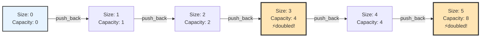

# Chapter 3: Basic Data Structures (Arrays and Strings)

## Table of Contents

- [3.1 Introduction to Arrays](#introduction-to-arrays)
  - [Key Characteristics of Arrays](#key-characteristics-of-arrays)
  - [3.1.1 Core Invariants](#1-core-invariants)
  - [3.1.2 Memory Layout and Cache Behavior](#2-memory-layout-and-cache-behavior)
- [3.2 Static Arrays in C++](#static-arrays-in-c)
  - [Declaration and Initialization](#declaration-and-initialization)
- [3.3 Dynamic Arrays (Vectors) in C++](#dynamic-arrays-vectors-in-c)
  - [Basic Vector Operations](#basic-vector-operations)
  - [Vector Performance Characteristics](#vector-performance-characteristics)
- [3.4 Dynamic Vector Growth Mechanisms](#dynamic-vector-growth-mechanisms)
  - [How Vector Growth Works](#how-vector-growth-works)
  - [Growth Strategy Analysis](#growth-strategy-analysis)
  - [Memory Reallocation Process](#memory-reallocation-process)
  - [Optimization Techniques](#optimization-techniques)
  - [Best Practices Summary](#best-practices-summary)
- [3.6 Common Array Algorithms](#common-array-algorithms)
  - [Linear Search](#linear-search)
  - [Binary Search (for sorted arrays)](#binary-search-for-sorted-arrays)
  - [REVISIT THIS --> /<begin>](#revisit-this-begin)
  - [Binary Search Pitfalls: When to Use `<=` vs `<`](#binary-search-pitfalls-when-to-use-vs)
  - [REVISIT THIS --> /<end>](#revisit-this-end)
  - [Array Rotation](#array-rotation)
  - [Finding Maximum Subarray (Kadane's Algorithm)](#finding-maximum-subarray-kadanes-algorithm)
  - [Two Pointers Technique](#two-pointers-technique)
- [3.7 Multidimensional Arrays](#multidimensional-arrays)
  - [2D Arrays (Matrices)](#2d-arrays-matrices)
  - [Matrix Operations](#matrix-operations)
- [3.8 String Manipulation](#string-manipulation)
  - [Basic String Operations](#basic-string-operations)
  - [String Algorithms](#string-algorithms)
  - [C++ String Characteristics](#c-string-characteristics)
  - [Memory: Each operation creates a new string object](#memory-each-operation-creates-a-new-string-object)
  - [String Interning](#string-interning)
  - [Efficient String Building in C++](#efficient-string-building-in-c)
- [3.9 Advanced Array Techniques](#advanced-array-techniques)
  - [Sliding Window Technique](#sliding-window-technique)
  - [Prefix Sum Technique](#prefix-sum-technique)
- [3.10 Failure Modes and Common Pitfalls](#failure-modes-and-common-pitfalls)
  - [3.10.1 Common Pitfalls](#1-common-pitfalls)
  - [3.10.2 Debugging Tips](#2-debugging-tips)
- [3.11 Memory Management and Best Practices](#memory-management-and-best-practices)
  - [Memory Layout of Arrays](#memory-layout-of-arrays)
  - [Best Practices](#best-practices)
- [3.12 Key Takeaways](#key-takeaways)
- [3.13 Exercises](#exercises)
- [3.14 Concurrency Considerations](#concurrency-considerations)
  - [3.14.1 Shared-State Invariants](#1-shared-state-invariants)
  - [3.14.2 Operations That Must Be Atomic](#2-operations-that-must-be-atomic)
  - [3.14.3 Naïve Approaches and Why They Fail](#3-naïve-approaches-and-why-they-fail)
  - [3.14.4 Locking Strategies](#4-locking-strategies)
  - [3.14.5 Performance and Scalability Implications](#5-performance-and-scalability-implications)
  - [3.14.6 When Not to Do This Yourself](#6-when-not-to-do-this-yourself)
- [3.15 Bit Manipulation](#bit-manipulation)
  - [Why Bit Manipulation Matters](#why-bit-manipulation-matters)
  - [Basic Bitwise Operations](#basic-bitwise-operations)
  - [Common Bit Manipulation Tricks](#common-bit-manipulation-tricks)
  - [Key Takeaways](#key-takeaways)
  - [When to Use Bit Manipulation](#when-to-use-bit-manipulation)
- [3.16 Summary](#summary)


## 3.1 Introduction to Arrays

An **array** is a collection of elements of the same data type stored in contiguous memory locations. Arrays provide direct access to elements using indices, making them one of the most fundamental and efficient data structures.

### Key Characteristics of Arrays
- **Fixed size** (in most programming languages)
- **Homogeneous elements** (all elements of the same type)
- **Contiguous memory allocation**
- **Random access** capability (O(1) access time)
- **Zero-based indexing** (in most languages including C++)

### 3.1.1 Core Invariants

To reason correctly about arrays—and to implement them safely—we must understand the **invariants** they maintain. An invariant is a condition that must always hold true, regardless of the operations performed on the array.

#### Core Invariants of Arrays

1. **Index Bounds Invariant**:
   - Valid indices: `0 ≤ i < size` (for zero-based indexing)
   - Array size is fixed (static arrays) or tracked (dynamic arrays)
   - Accessing `arr[i]` where `i < 0` or `i ≥ size` is invalid

2. **Contiguous Memory Invariant**:
   - All elements stored in consecutive memory locations
   - Memory layout: `arr[i]` is at address `base + i × element_size`
   - No gaps between elements

3. **Type Homogeneity Invariant**:
   - All elements are of the same type
   - Element size is constant (enables O(1) indexing)

4. **Size Consistency Invariant**:
   - Static arrays: Size is constant (set at declaration)
   - Dynamic arrays: Size tracked accurately, matches allocated memory

#### What Can Break These Invariants

- **Out-of-bounds access**: (e.g., `arr[-1]` or `arr[size]`)
- **Memory Corruption** from writes beyond allocated space
- **Incorrect size tracking** in dynamic arrays
- **Violating type assumptions**, which compromises safety and correctness

#### How Operations Preserve Invariants

- **Access**: Validate index bounds before reading or writing
- **Modification**: Only update elements at valid indices
- **Iteration**: Traverse indices in the range `[0, size)`
- **Resizing** (dynamic): Allocate a new contiguous block and copy elements

**Example**: When accessing `arr[i]`:
1. Verify `0 ≤ i < size` (preserves index bounds invariant)
2. Calculate address `base + i × sizeof(T)` (preserves contiguous memory invariant)
3. Access element (preserves type homogeneity invariant)

### 3.1.2 Memory Layout and Cache Behavior

Understanding how arrays work at the system level is crucial for performance. This section applies the memory hierarchy concepts from [Chapter 3.6](03.6-memory-hierarchy-and-performance.md) to arrays.

For comprehensive coverage of memory hierarchy, cache behavior, and performance, see Chapter 3.6. Here we focus on array-specific implications.

#### Memory Layout

Arrays are stored in **contiguous memory blocks** (see Section 3.6.6 for memory layout details):
```
Memory addresses: [base] [base+4] [base+8] [base+12] [base+16]
Array indices:       0       1       2        3        4
```

**Why This Matters:**
- **Cache Efficiency**: Contiguous memory enables excellent cache locality (Section 3.6.4)
- **Prefetching**: CPUs can predict and load adjacent elements (sequential access)
- **Memory Fragmentation**: Large arrays may fail to allocate if memory is fragmented
- **Resizing Cost**: Dynamic arrays (vectors) may need to reallocate entire block

#### Cache Behavior

Arrays excel at cache performance due to their contiguous layout (see Section 3.6.4 for sequential vs. random access):
- **Spatial Locality**: Accessing `arr[i]` often brings `arr[i+1]`, `arr[i+2]` into cache
- **Sequential Access**: Iterating through arrays is extremely fast (~5-10 cycles per element)
- **Random Access**: Still O(1), but may cause cache misses if elements are far apart (~50-200 cycles)

**Real-World Performance** (see Section 3.6.5 for CPU cycle details): 
- Sequential array access: ~5-10 CPU cycles per element (cache hit)
- Random array access: ~50-200 CPU cycles (cache miss penalty)
- Linked list access: ~100-300 CPU cycles (pointer chasing, see Chapter 4)

#### When Arrays Become a Bottleneck

1. **Resizing Operations**: 
   - `vector::push_back()` may trigger O(n) reallocation
   - Solution: Use `reserve()` when size is known

2. **Memory Fragmentation**:
   - Large contiguous blocks may not be available
   - Solution: Consider alternative structures or memory pools

3. **Insertion/Deletion in Middle**:
   - Requires shifting elements: O(n)
   - Solution: Use linked lists or other structures

4. **Cache Misses in Sparse Access**:
   - Random access patterns hurt performance
   - Solution: Reorganize data or use different access patterns

## 3.2 Static Arrays in C++

### Declaration and Initialization
```cpp
#include <iostream>
#include <array>
using namespace std;

int main() {
    // Method 1: Traditional C-style array
    int arr1[5];                    // Uninitialized array
    int arr2[5] = {1, 2, 3, 4, 5}; // Initialized array
    int arr3[] = {1, 2, 3};         // Auto-sized array
    
    // Method 2: std::array (recommended)
    array<int, 5> arr4;             // Uninitialized
    array<int, 5> arr5 = {1, 2, 3, 4, 5}; // Initialized
    array<int, 5> arr6 = {1, 2};    // Partial initialization (rest are 0)
    
    return 0;
}
```

## 3.3 Dynamic Arrays (Vectors) in C++

The `std::vector` class provides a dynamic array that can grow and shrink in size.

### Basic Vector Operations
```cpp
#include <vector>
#include <iostream>
using namespace std;

void demonstrateVector() {
    // Declaration and initialization
    vector<int> vec1;                    // Empty vector
    vector<int> vec2(5);                 // Vector of size 5 (all zeros)
    vector<int> vec3(5, 10);             // Vector of size 5 with value 10
    vector<int> vec4 = {1, 2, 3, 4, 5};  // Initialized vector
    
    // Adding elements
    vec1.push_back(1);
    vec1.push_back(2);
    vec1.push_back(3);
    
    // Insert elements
    vec1.insert(vec1.begin() + 1, 10);   // Insert 10 at index 1
    
    // Remove elements
    vec1.pop_back();                     // Remove last element
    vec1.erase(vec1.begin() + 1);        // Remove element at index 1
    
    // Access elements
    cout << "First element: " << vec1.front() << endl;
    cout << "Last element: " << vec1.back() << endl;
    cout << "Element at index 1: " << vec1[1] << endl;
    
    // Vector properties
    cout << "Size: " << vec1.size() << endl;
    cout << "Capacity: " << vec1.capacity() << endl;
    cout << "Empty: " << vec1.empty() << endl;
    
    // Reserve space
    vec1.reserve(100);                   // Reserve space for 100 elements
    
    // Resize
    vec1.resize(10, 5);                  // Resize to 10, fill new elements with 5
    
    // Clear vector
    vec1.clear();
}
```

### Vector Performance Characteristics
- **Access**: O(1) - random access by index
- **Insertion at end**: O(1) amortized - occasionally O(n) when resizing
- **Insertion at beginning/middle**: O(n) - need to shift elements
- **Deletion from end**: O(1)
- **Deletion from beginning/middle**: O(n) - need to shift elements
- **Search**: O(n) - linear search required

## 3.4 Dynamic Vector Growth Mechanisms

Understanding how vectors dynamically grow is crucial for efficient programming and performance optimization. This section explores the internal mechanisms, growth strategies, and optimization techniques.

### How Vector Growth Works

Vectors maintain two key properties:
- **Size**: Number of elements currently stored
- **Capacity**: Number of elements that can be stored without reallocation



**Key Insight**: Capacity doubles when size exceeds capacity, ensuring O(1) amortized insertion time.

### Growth Strategy Analysis

Most C++ implementations use a **doubling strategy** where capacity is doubled when more space is needed:

> **Note**: For detailed performance analysis and benchmarking, see `examples/arrays/vector_growth_analysis.cpp`

### Memory Reallocation Process

When a vector needs to grow, it performs these steps:

```cpp
// Simplified vector reallocation process
class SimpleVector {
private:
    int* data;
    size_t size;
    size_t capacity;
    
public:
    SimpleVector() : data(nullptr), size(0), capacity(0) {}
    
    ~SimpleVector() {
        delete[] data;
    }
    
    void push_back(int value) {
        if (size >= capacity) {
            // Need to reallocate
            size_t newCapacity = (capacity == 0) ? 1 : capacity * 2;
            reallocate(newCapacity);
        }
        
        data[size] = value;
        size++;
    }
    
private:
    void reallocate(size_t newCapacity) {
        cout << "Reallocating from capacity " << capacity 
             << " to " << newCapacity << endl;
        
        int* newData = new int[newCapacity];
        
        // Copy existing elements
        for (size_t i = 0; i < size; i++) {
            newData[i] = data[i];
        }
        
        delete[] data;
        data = newData;
        capacity = newCapacity;
    }
    
public:
    size_t getSize() const { return size; }
    size_t getCapacity() const { return capacity; }
};
```

### Optimization Techniques

#### 1. Reserve Capacity
```cpp
// Use reserve() when you know the approximate size
void efficientVectorUsage() {
    vector<int> vec;
    vec.reserve(1000);  // Pre-allocate capacity
    
    for (int i = 0; i < 1000; i++) {
        vec.push_back(i);  // No reallocations needed
    }
}
```

#### 2. Shrink to Fit
```cpp
// Use shrink_to_fit() to reduce memory usage
void optimizeMemoryUsage() {
    vector<int> vec;
    
    // Add many elements
    for (int i = 0; i < 10000; i++) {
        vec.push_back(i);
    }
    
    // Remove most elements
    vec.erase(vec.begin() + 100, vec.end());
    
    // Shrink to save memory
    vec.shrink_to_fit();
}
```

#### 3. Emplace vs Push Back
```cpp
// Use emplace_back() for better performance with complex objects
void preferEmplaceBack() {
    vector<pair<string, int>> vec;
    
    // Good: constructs in place
    vec.emplace_back("Alice", 25);
    
    // Less efficient: creates temporary
    vec.push_back(make_pair("Bob", 30));
}
```

> **Note**: For detailed performance comparisons and benchmarking, see `examples/arrays/vector_optimization_tests.cpp`

### Best Practices Summary

1. **Use `reserve()`** when you know the approximate size
2. **Use `emplace_back()`** instead of `push_back()` for complex objects
3. **Use move semantics** when possible to avoid unnecessary copies
4. **Consider `shrink_to_fit()`** for memory optimization after removing many elements
5. **Avoid frequent reallocations** in loops by pre-allocating capacity

```cpp
// Example combining best practices
void processDataEfficiently(const vector<int>& input) {
    vector<int> result;
    result.reserve(input.size());  // Pre-allocate
    
    for (int value : input) {
        result.emplace_back(value * 2);  // Construct in place
    }
    
    // Optional: shrink if we know we won't add more
    result.shrink_to_fit();
}
```

## 3.6 Common Array Algorithms

### Linear Search
```cpp
// Returns index of target, -1 if not found
int linearSearch(const vector<int>& arr, int target) {
    for (int i = 0; i < arr.size(); i++) {
        if (arr[i] == target) {
            return i;
        }
    }
    return -1;
}

// Using iterator
int linearSearchIterator(const vector<int>& arr, int target) {
    auto it = find(arr.begin(), arr.end(), target);
    return (it != arr.end()) ? distance(arr.begin(), it) : -1;
}
```

### Binary Search (for sorted arrays)
```cpp
int binarySearch(const vector<int>& arr, int target) {
    int left = 0;
    int right = arr.size() - 1;
    
    while (left <= right) {
        int mid = left + (right - left) / 2;  // Prevents overflow
        
        if (arr[mid] == target) {
            return mid;
        } else if (arr[mid] < target) {
            left = mid + 1;
        } else {
            right = mid - 1;
        }
    }
    return -1;
}

// Using STL
bool binarySearchSTL(const vector<int>& arr, int target) {
    return binary_search(arr.begin(), arr.end(), target);
}
```

### REVISIT THIS --> /<begin>

### Binary Search Pitfalls: When to Use `<=` vs `<`

Binary search is deceptively simple but notoriously error-prone. One of the most common mistakes is choosing the wrong comparison operator in the while loop condition. Understanding when to use `<=` versus `<` is crucial for correctness.

#### The Fundamental Question: Inclusive vs Exclusive Bounds

The choice between `<=` and `<` depends on how you define your search space:

1. **Inclusive bounds** (`left <= right`): Both `left` and `right` are valid indices that might contain the target
2. **Exclusive bounds** (`left < right`): `right` is exclusive—it's one past the last valid index

#### Pattern 1: Inclusive Bounds (`left <= right`)

**When to use**: Standard binary search for finding an exact match.

```cpp
int binarySearch(const vector<int>& arr, int target) {
    int left = 0;
    int right = arr.size() - 1;  // Inclusive: last valid index
    
    while (left <= right) {  // ✅ Use <= for inclusive bounds
        int mid = left + (right - left) / 2;
        
        if (arr[mid] == target) {
            return mid;
        } else if (arr[mid] < target) {
            left = mid + 1;   // Exclude mid from search space
        } else {
            right = mid - 1;   // Exclude mid from search space
        }
    }
    return -1;  // Not found
}
```

**Why `<=` works here**:
- `left` and `right` both point to valid array indices
- When `left == right`, there's still one element to check (`arr[left]`)
- The loop terminates when `left > right`, meaning the search space is empty

**Example trace**:
```
Array: [1, 3, 5, 7, 9], target = 5
Initial: left=0, right=4

Iteration 1: mid=2, arr[2]=5 == target → Found!
```

```
Array: [1, 3, 5, 7, 9], target = 4
Initial: left=0, right=4

Iteration 1: mid=2, arr[2]=5 > 4 → right=1
Iteration 2: left=0, right=1, mid=0, arr[0]=1 < 4 → left=1
Iteration 3: left=1, right=1, mid=1, arr[1]=3 < 4 → left=2
Termination: left=2 > right=1 → Not found
```

#### Pattern 2: Exclusive Bounds (`left < right`)

**When to use**: Finding insertion point, lower/upper bounds, or when you want to avoid checking `left == right`.

```cpp
// Find the first position where target can be inserted (lower_bound)
int lowerBound(const vector<int>& arr, int target) {
    int left = 0;
    int right = arr.size();  // Exclusive: one past last valid index
    
    while (left < right) {  // ✅ Use < for exclusive bounds
        int mid = left + (right - left) / 2;
        
        if (arr[mid] < target) {
            left = mid + 1;   // arr[mid] is too small, exclude it
        } else {
            right = mid;       // arr[mid] >= target, keep it (right is exclusive)
        }
    }
    return left;  // Insertion point
}
```

**Why `<` works here**:
- `right` is one past the last valid index (exclusive)
- When `left == right`, the search space is empty (no elements between them)
- We update `right = mid` (not `mid - 1`) because `right` is exclusive

**Example trace**:
```
Array: [1, 3, 5, 7, 9], target = 4
Initial: left=0, right=5 (exclusive)

Iteration 1: mid=2, arr[2]=5 >= 4 → right=2
Iteration 2: left=0, right=2, mid=1, arr[1]=3 < 4 → left=2
Termination: left=2 == right=2 → Insertion point is 2
```

#### Common Mistake: Using `<` with Inclusive Bounds

**WRONG**:
```cpp
int binarySearchWRONG(const vector<int>& arr, int target) {
    int left = 0;
    int right = arr.size() - 1;  // Inclusive bound
    
    while (left < right) {  // ❌ WRONG: Using < with inclusive bounds
        int mid = left + (right - left) / 2;
        
        if (arr[mid] == target) {
            return mid;
        } else if (arr[mid] < target) {
            left = mid + 1;
        } else {
            right = mid - 1;
        }
    }
    // ❌ BUG: When left == right, we exit without checking arr[left]!
    return (arr[left] == target) ? left : -1;  // Need extra check
}
```

**Why this fails**:
- When `left == right`, there's still one element to check, but the loop exits
- You need an extra check after the loop, which is error-prone
- Easy to forget the post-loop check

**Example of failure**:
```
Array: [5], target = 5
Initial: left=0, right=0

Loop condition: 0 < 0? No → Exit immediately
Result: Returns -1 (WRONG! Should return 0)
```

#### Common Mistake: Using `<=` with Exclusive Bounds

**WRONG**:
```cpp
int lowerBoundWRONG(const vector<int>& arr, int target) {
    int left = 0;
    int right = arr.size();  // Exclusive bound
    
    while (left <= right) {  // ❌ WRONG: Using <= with exclusive bounds
        int mid = left + (right - left) / 2;
        
        if (arr[mid] < target) {
            left = mid + 1;
        } else {
            right = mid - 1;  // ❌ BUG: right is exclusive, shouldn't use mid-1
        }
    }
    return left;
}
```

**Why this fails**:
- When `right = arr.size()`, accessing `arr[right]` is out of bounds
- The update `right = mid - 1` doesn't make sense with exclusive bounds
- Can cause infinite loops or incorrect results

#### Decision Tree: Which Pattern to Use?

```
Is right = arr.size() - 1 (inclusive)?
├─ YES → Use while (left <= right)
│         Update: left = mid + 1, right = mid - 1
│         Check: arr[mid] == target
│
└─ NO (right = arr.size(), exclusive)
    → Use while (left < right)
      Update: left = mid + 1, right = mid
      Check: arr[mid] < target (for lower_bound)
```

#### Complete Examples

**Example 1: Standard Binary Search (Inclusive)**
```cpp
int binarySearch(const vector<int>& arr, int target) {
    int left = 0;
    int right = arr.size() - 1;  // Inclusive
    
    while (left <= right) {  // ✅
        int mid = left + (right - left) / 2;
        if (arr[mid] == target) return mid;
        if (arr[mid] < target) left = mid + 1;
        else right = mid - 1;
    }
    return -1;
}
```

**Example 2: Lower Bound (Exclusive)**
```cpp
int lowerBound(const vector<int>& arr, int target) {
    int left = 0;
    int right = arr.size();  // Exclusive
    
    while (left < right) {  // ✅
        int mid = left + (right - left) / 2;
        if (arr[mid] < target) left = mid + 1;
        else right = mid;
    }
    return left;
}
```

**Example 3: Upper Bound (Exclusive)**
```cpp
int upperBound(const vector<int>& arr, int target) {
    int left = 0;
    int right = arr.size();  // Exclusive
    
    while (left < right) {  // ✅
        int mid = left + (right - left) / 2;
        if (arr[mid] <= target) left = mid + 1;  // Note: <=
        else right = mid;
    }
    return left;
}
```

#### Key Takeaways

1. **Inclusive bounds** (`right = size - 1`): Use `while (left <= right)`
   - Both endpoints are valid indices
   - Update: `left = mid + 1`, `right = mid - 1`
   - Check `arr[mid]` directly

2. **Exclusive bounds** (`right = size`): Use `while (left < right)`
   - `right` is one past the last valid index
   - Update: `left = mid + 1`, `right = mid` (keep mid in search space)
   - Useful for insertion point problems

3. **Consistency is key**: Match your loop condition with your bound semantics
   - Inclusive bounds → `<=`
   - Exclusive bounds → `<`

4. **Test edge cases**: Empty array, single element, target not found, target at boundaries

### REVISIT THIS --> /<end>

#### Practice Problems

1. Implement binary search with inclusive bounds
2. Implement `lower_bound` with exclusive bounds
3. Implement `upper_bound` with exclusive bounds
4. Find the first and last occurrence of a target in a sorted array with duplicates

### Array Rotation
```cpp
// Rotate array left by k positions
void rotateLeft(vector<int>& arr, int k) {
    k = k % arr.size();  // Handle k > array size
    reverse(arr.begin(), arr.begin() + k);
    reverse(arr.begin() + k, arr.end());
    reverse(arr.begin(), arr.end());
}

// Rotate array right by k positions
void rotateRight(vector<int>& arr, int k) {
    k = k % arr.size();
    reverse(arr.begin(), arr.end());
    reverse(arr.begin(), arr.begin() + k);
    reverse(arr.begin() + k, arr.end());
}
```

### Finding Maximum Subarray (Kadane's Algorithm)
```cpp
int maxSubarraySum(const vector<int>& arr) {
    int maxSoFar = arr[0];
    int maxEndingHere = arr[0];
    
    for (int i = 1; i < arr.size(); i++) {
        maxEndingHere = max(arr[i], maxEndingHere + arr[i]);
        maxSoFar = max(maxSoFar, maxEndingHere);
    }
    
    return maxSoFar;
}
```

### Two Pointers Technique
```cpp
// Find pair with given sum in sorted array
vector<int> twoSumSorted(const vector<int>& arr, int target) {
    int left = 0;
    int right = arr.size() - 1;
    
    while (left < right) {
        int sum = arr[left] + arr[right];
        if (sum == target) {
            return {left, right};
        } else if (sum < target) {
            left++;
        } else {
            right--;
        }
    }
    return {};  // No pair found
}

// Remove duplicates from sorted array
int removeDuplicates(vector<int>& arr) {
    if (arr.empty()) return 0;
    
    int writeIndex = 1;
    for (int readIndex = 1; readIndex < arr.size(); readIndex++) {
        if (arr[readIndex] != arr[readIndex - 1]) {
            arr[writeIndex] = arr[readIndex];
            writeIndex++;
        }
    }
    return writeIndex;
}
```

## 3.7 Multidimensional Arrays

### 2D Arrays (Matrices)
```cpp
#include <vector>
#include <iostream>
using namespace std;

void demonstrate2DArray() {
    // Method 1: Traditional 2D array
    int matrix1[3][4] = {
        {1, 2, 3, 4},
        {5, 6, 7, 8},
        {9, 10, 11, 12}
    };
    
    // Method 2: Vector of vectors (recommended)
    vector<vector<int>> matrix2 = {
        {1, 2, 3, 4},
        {5, 6, 7, 8},
        {9, 10, 11, 12}
    };
    
    // Method 3: Dynamic allocation
    vector<vector<int>> matrix3(3, vector<int>(4, 0));  // 3x4 matrix filled with 0s
    
    // Access elements
    cout << "Element at [1][2]: " << matrix2[1][2] << endl;
    
    // Iterate through 2D array
    for (int i = 0; i < matrix2.size(); i++) {
        for (int j = 0; j < matrix2[i].size(); j++) {
            cout << matrix2[i][j] << " ";
        }
        cout << endl;
    }
}
```

### Matrix Operations
```cpp
// Matrix multiplication
vector<vector<int>> multiplyMatrices(const vector<vector<int>>& a, 
                                   const vector<vector<int>>& b) {
    int rows = a.size();
    int cols = b[0].size();
    int common = a[0].size();
    
    vector<vector<int>> result(rows, vector<int>(cols, 0));
    
    for (int i = 0; i < rows; i++) {
        for (int j = 0; j < cols; j++) {
            for (int k = 0; k < common; k++) {
                result[i][j] += a[i][k] * b[k][j];
            }
        }
    }
    
    return result;
}

// Transpose matrix
vector<vector<int>> transpose(const vector<vector<int>>& matrix) {
    int rows = matrix.size();
    int cols = matrix[0].size();
    
    vector<vector<int>> result(cols, vector<int>(rows));
    
    for (int i = 0; i < rows; i++) {
        for (int j = 0; j < cols; j++) {
            result[j][i] = matrix[i][j];
        }
    }
    
    return result;
}
```

## 3.8 String Manipulation

### Basic String Operations
```cpp
#include <string>
#include <iostream>
#include <algorithm>
using namespace std;

void demonstrateStringOperations() {
    // String declaration and initialization
    string str1 = "Hello";
    string str2("World");
    string str3(5, 'A');  // "AAAAA"
    
    // String concatenation
    string result = str1 + " " + str2;
    str1 += " World";
    
    // String properties
    cout << "Length: " << str1.length() << endl;
    cout << "Size: " << str1.size() << endl;
    cout << "Empty: " << str1.empty() << endl;
    
    // Access characters
    cout << "First character: " << str1[0] << endl;
    cout << "Last character: " << str1.back() << endl;
    
    // String modification
    str1.insert(5, " Beautiful");
    str1.erase(5, 10);  // Remove 10 characters starting from index 5
    str1.replace(0, 5, "Hi");  // Replace 5 characters starting from 0
    
    // Substring
    string sub = str1.substr(0, 5);
    
    // Find operations
    size_t pos = str1.find("World");
    if (pos != string::npos) {
        cout << "Found 'World' at position: " << pos << endl;
    }
}
```

### String Algorithms

#### Palindrome Check
```cpp
bool isPalindrome(const string& str) {
    int left = 0;
    int right = str.length() - 1;
    
    while (left < right) {
        if (str[left] != str[right]) {
            return false;
        }
        left++;
        right--;
    }
    return true;
}

// Case-insensitive palindrome check
bool isPalindromeIgnoreCase(const string& str) {
    string lower = str;
    transform(lower.begin(), lower.end(), lower.begin(), ::tolower);
    return isPalindrome(lower);
}
```

#### String Reversal
```cpp
string reverseString(string str) {
    int left = 0;
    int right = str.length() - 1;
    
    while (left < right) {
        swap(str[left], str[right]);
        left++;
        right--;
    }
    return str;
}

// Using STL
string reverseStringSTL(string str) {
    reverse(str.begin(), str.end());
    return str;
}
```

#### Anagram Check
```cpp
bool areAnagrams(const string& str1, const string& str2) {
    if (str1.length() != str2.length()) {
        return false;
    }
    
    vector<int> count(256, 0);  // Assuming ASCII characters
    
    for (char c : str1) {
        count[c]++;
    }
    
    for (char c : str2) {
        count[c]--;
        if (count[c] < 0) {
            return false;
        }
    }
    
    return true;
}

// Using sorting
bool areAnagramsSort(string str1, string str2) {
    if (str1.length() != str2.length()) {
        return false;
    }
    
    sort(str1.begin(), str1.end());
    sort(str2.begin(), str2.end());
    
    return str1 == str2;
}
```

#### Longest Common Subsequence
```cpp
int longestCommonSubsequence(const string& text1, const string& text2) {
    int m = text1.length();
    int n = text2.length();
    
    vector<vector<int>> dp(m + 1, vector<int>(n + 1, 0));
    
    for (int i = 1; i <= m; i++) {
        for (int j = 1; j <= n; j++) {
            if (text1[i - 1] == text2[j - 1]) {
                dp[i][j] = dp[i - 1][j - 1] + 1;
            } else {
                dp[i][j] = max(dp[i - 1][j], dp[i][j - 1]);
            }
        }
    }
    
    return dp[m][n];
}
```

### C++ String Characteristics

Understanding how C++ strings work is crucial for performance and correctness.

#### C++ Strings: Mutable

In C++, `std::string` is **mutable** (can be modified in place):

```cpp
string str = "Hello";
str[0] = 'h';        // ✅ Allowed: modifies in place
str += " World";     // ✅ Allowed: modifies existing string
str.insert(5, ",");  // ✅ Allowed: modifies in place

// Memory: str points to a buffer that can be modified
```

**Characteristics**:
- **Mutable**: Can modify characters directly
- **Copy-on-write**: Some implementations use COW (but not guaranteed in C++11+)
- **Performance**: Efficient for modifications
- **Memory**: String owns its buffer, can grow/shrink

#### Performance Characteristics

**Efficient Concatenation**:

```cpp
// Efficient: Modifies in place
string result = "Hello";
for (int i = 0; i < 1000; i++) {
    result += " World";  // May reallocate, but modifies existing buffer
}
// Time: O(n) amortized where n is final length
```


**Optimization with `reserve()`**:

```cpp
// Even better: Reserve space to avoid reallocations
string result;
result.reserve(10000);  // Pre-allocate space
for (int i = 0; i < 1000; i++) {
    result += " " + to_string(i);  // Efficient (no reallocation needed)
}
// Time: O(n), avoids multiple reallocations
```

**Using `ostringstream` for Complex Building**:
```cpp
#include <sstream>
ostringstream oss;
for (int i = 0; i < 1000; i++) {
    oss << " " << i;  // Efficient stream-based building
}
string result = oss.str();  // Convert to string once
```


### Memory: Each operation creates a new string object

**Characteristics**:
- **Immutable**: Cannot modify after creation
- **String Interning**: Small strings and literals are interned
- **Performance**: Concatenation can be slow (creates new objects)
- **Memory**: Old strings are garbage collected

#### Comparison Table


### String Interning

**String Interning** is a technique where identical string literals share the same memory location.

#### How It Works

**Without Interning**:
```
str1 = "Hello"  → Memory address: 0x1000
str2 = "Hello"  → Memory address: 0x2000 (different object!)
str1 == str2    → false (different objects)
```

**With Interning**:
```
str1 = "Hello"  → Memory address: 0x1000
str2 = "Hello"  → Memory address: 0x1000 (same object!)
str1 == str2    → true (same object)
```

#### String Literals vs std::string

**String Literals** (C-style):
```cpp
const char* s1 = "Hello";  // String literal (read-only, stored in program memory)
const char* s2 = "Hello";  // May point to same memory (implementation-defined)

// String literals are immutable and stored in read-only memory
// s1[0] = 'h';  // ❌ Compile error: cannot modify string literal
```

**std::string Objects**:
```cpp
// C++ does NOT have automatic string interning
// String literals are stored in read-only memory, but
// std::string objects are separate

const char* s1 = "Hello";  // String literal (read-only)
const char* s2 = "Hello";  // May point to same memory (implementation-defined)
std::string s3 = "Hello";  // New std::string object
std::string s4 = "Hello";  // Another std::string object

// s3 and s4 are different objects (no automatic interning)
s3[0] = 'h';  // ✅ Allowed: modifies s3's buffer
// s4 remains "Hello" (unchanged)
```

**Key Difference**:
- **String literals**: Immutable, may be shared by compiler optimization
- **std::string**: Mutable, each object has its own buffer

#### String Interning in C++

**C++ does NOT have automatic string interning** for `std::string` objects. However:

1. **String Literals**: The compiler may optimize identical string literals to share memory (implementation-defined)
2. **std::string Objects**: Each `std::string` object has its own buffer, even if the content is identical

**Example**:
```cpp
const char* lit1 = "Hello";  // String literal
const char* lit2 = "Hello";  // May point to same memory (compiler optimization)
// lit1 == lit2 might be true (same pointer) - implementation-defined

string str1 = "Hello";  // New std::string object
string str2 = "Hello";  // Another std::string object
// str1 == str2 is true (content comparison), but &str1 != &str2 (different objects)
```

**Why No Interning?**:
- C++ prioritizes performance and control over memory optimization
- Mutable strings make interning complex (what if one is modified?)
- Explicit memory management gives programmers control

### Efficient String Building in C++

Since C++ strings are mutable, we can optimize string building with several techniques:

**Pattern 1: Using `reserve()`** (Recommended):
```cpp
string result;
result.reserve(expected_size);  // Pre-allocate if size is known
for (int i = 0; i < n; i++) {
    result += some_string;  // Efficient: no reallocation needed
}
```

**Pattern 2: Using `ostringstream`** (For complex formatting):
```cpp
ostringstream oss;
for (int i = 0; i < n; i++) {
    oss << some_value << " ";  // Stream-based building
}
string result = oss.str();
```

**Pattern 3: Direct Concatenation** (For small operations):
```cpp
string result = str1 + " " + str2;  // Fine for few concatenations
```

**When to Use Each**:
- **`reserve()` + `+=`**: When you know approximate size, building in loops
- **`ostringstream`**: When formatting is complex, or building from various types
- **Direct `+`**: When concatenating few strings (< 5), code clarity matters

#### Best Practices

1. **Use `reserve()`** when building strings in loops if you know approximate size
2. **Use `ostringstream`** for complex string building with formatting
3. **Avoid repeated concatenation** in tight loops without `reserve()`
4. **Prefer `std::string`** over C-style strings for safety and convenience
5. **Remember**: `std::string` is mutable, so be careful with concurrent access

## 3.9 Advanced Array Techniques

### Sliding Window Technique
```cpp
// Maximum sum of k consecutive elements
int maxSumKConsecutive(const vector<int>& arr, int k) {
    if (arr.size() < k) return -1;
    
    int windowSum = 0;
    for (int i = 0; i < k; i++) {
        windowSum += arr[i];
    }
    
    int maxSum = windowSum;
    for (int i = k; i < arr.size(); i++) {
        windowSum = windowSum - arr[i - k] + arr[i];
        maxSum = max(maxSum, windowSum);
    }
    
    return maxSum;
}

// Longest substring without repeating characters
int lengthOfLongestSubstring(const string& s) {
    unordered_set<char> charSet;
    int left = 0;
    int maxLength = 0;
    
    for (int right = 0; right < s.length(); right++) {
        while (charSet.find(s[right]) != charSet.end()) {
            charSet.erase(s[left]);
            left++;
        }
        charSet.insert(s[right]);
        maxLength = max(maxLength, right - left + 1);
    }
    
    return maxLength;
}
```

### Prefix Sum Technique
```cpp
class PrefixSum {
private:
    vector<int> prefix;
    
public:
    PrefixSum(const vector<int>& arr) {
        prefix.resize(arr.size() + 1);
        prefix[0] = 0;
        for (int i = 0; i < arr.size(); i++) {
            prefix[i + 1] = prefix[i] + arr[i];
        }
    }
    
    // Sum of elements from index left to right (inclusive)
    int rangeSum(int left, int right) {
        return prefix[right + 1] - prefix[left];
    }
};

// Example usage
void demonstratePrefixSum() {
    vector<int> arr = {1, 2, 3, 4, 5};
    PrefixSum ps(arr);
    
    cout << "Sum from index 1 to 3: " << ps.rangeSum(1, 3) << endl;  // 2+3+4 = 9
}
```

## 3.10 Failure Modes and Common Pitfalls

Understanding common failure modes helps avoid bugs and performance issues.

### 3.10.1 Common Pitfalls

#### 1. Off-by-One Errors
```cpp
// WRONG: Accessing out of bounds
for (int i = 0; i <= arr.size(); i++) {  // Should be <, not <=
    cout << arr[i] << endl;
}

// CORRECT
for (int i = 0; i < arr.size(); i++) {
    cout << arr[i] << endl;
}
```

**Why it happens**: Confusion between 0-based indexing and size
**Impact**: Undefined behavior, crashes, security vulnerabilities

#### 2. Memory Leaks (Raw Pointers)
```cpp
// WRONG: Memory leak
int* arr = new int[1000];
// ... use array ...
// Forgot to delete[] arr;

// CORRECT: Use smart pointers or vectors
vector<int> arr(1000);  // Automatically managed
// OR
unique_ptr<int[]> arr(new int[1000]);  // RAII
```

**Why it happens**: Manual memory management is error-prone
**Impact**: Memory leaks, eventual program crash

#### 3. Iterator Invalidation
```cpp
// WRONG: Modifying vector while iterating
vector<int> vec = {1, 2, 3, 4, 5};
for (auto it = vec.begin(); it != vec.end(); ++it) {
    if (*it == 3) {
        vec.erase(it);  // Invalidates iterator!
    }
}

// CORRECT: Use erase-remove idiom or careful iteration
vec.erase(remove(vec.begin(), vec.end(), 3), vec.end());
```

**Why it happens**: Vector reallocation invalidates iterators
**Impact**: Undefined behavior, crashes

#### 4. Performance Cliffs
```cpp
// WRONG: Frequent reallocations
vector<int> vec;
for (int i = 0; i < 1000000; i++) {
    vec.push_back(i);  // May reallocate many times
}

// CORRECT: Reserve capacity
vector<int> vec;
vec.reserve(1000000);  // Allocate once
for (int i = 0; i < 1000000; i++) {
    vec.push_back(i);
}
```

**Why it happens**: Vector doubles capacity when full
**Impact**: O(n) reallocation can cause significant slowdowns

#### 5. Incorrect Assumptions About Size
```cpp
// WRONG: Assuming array is non-empty
int first = arr[0];  // Crashes if arr is empty

// CORRECT: Check bounds
if (!arr.empty()) {
    int first = arr[0];
}
```

**Why it happens**: Not checking preconditions
**Impact**: Crashes, undefined behavior

### 3.10.2 Debugging Tips

1. **Use bounds-checking methods**: `arr.at(i)` throws exception on out-of-bounds
2. **Enable sanitizers**: `-fsanitize=address` detects memory errors
3. **Use assertions**: Verify invariants during development
4. **Test edge cases**: Empty arrays, single element, maximum size

## 3.11 Memory Management and Best Practices

### Memory Layout of Arrays
```cpp
void demonstrateMemoryLayout() {
    // Stack-allocated array
    int stackArray[5] = {1, 2, 3, 4, 5};
    
    // Heap-allocated array
    int* heapArray = new int[5];
    for (int i = 0; i < 5; i++) {
        heapArray[i] = i + 1;
    }
    
    // Don't forget to free heap memory
    delete[] heapArray;
    
    // Vector (automatic memory management)
    vector<int> vec = {1, 2, 3, 4, 5};
    // Memory is automatically managed
}
```

### Best Practices
1. **Use `std::vector` over raw arrays** when possible
2. **Use `std::array` over C-style arrays** for fixed-size arrays
3. **Always initialize arrays** to avoid undefined behavior
4. **Check bounds** when accessing array elements
5. **Use range-based for loops** for cleaner code
6. **Prefer algorithms from `<algorithm>`** header

## 3.12 Key Takeaways

1. **Arrays** provide O(1) random access but fixed size in C++
2. **Vectors** offer dynamic sizing with automatic memory management
3. **Strings** in C++ are mutable and support many operations
4. **Common algorithms** include search, sort, and manipulation techniques
5. **Memory management** is crucial for performance and correctness
6. **STL containers and algorithms** provide efficient, tested implementations

## 3.13 Exercises

1. Implement a function to find the second largest element in an array.
2. Write a function to rotate an array to the right by k steps.
3. Create a function that finds the longest increasing subsequence in an array.
4. Implement a function to merge two sorted arrays into one sorted array.
5. Write a function that finds the majority element in an array (appears more than n/2 times).
6. **Vector Growth Analysis**: Write a program that demonstrates the growth pattern of `std::vector` and measures the performance difference between using `reserve()` and not using it.
7. **Custom Vector Implementation**: Implement a simplified version of `std::vector` with dynamic growth capabilities, including `push_back()`, `reserve()`, and `shrink_to_fit()` methods.
8. **Memory Optimization**: Create a function that efficiently processes a large dataset by minimizing vector reallocations using appropriate reserve strategies.

## 3.14 Concurrency Considerations

This section applies the concurrency fundamentals from [Chapter 3.5](03.5-concurrency-fundamentals.md) to arrays. See Section 3.5.3 for invariant-based reasoning and Section 3.5.5 for atomicity concepts.

### 3.14.1 Shared-State Invariants

**Core Array Invariants** (see Section 3.5.3):
1. **Bounds Invariant**: All indices accessed are within `[0, size)`
2. **Value Invariant**: Elements at each index have valid values
3. **Size Invariant**: `size` accurately reflects the number of elements

**What Must Not Be Observed Half-Updated**:
- Size changes while elements are being accessed
- Element writes that are partially complete
- Reallocation during iteration (for dynamic arrays)

### 3.14.2 Operations That Must Be Atomic

**Read-Modify-Write Operations** (see Section 3.5.4):
```cpp
// Non-atomic: Three separate operations
array[index] = array[index] + 1;  // Read, compute, write
size++;                            // Read, compute, write
```

**Tie to Invariants**: These operations threaten the **Value Invariant** and **Size Invariant** if not atomic.

**Operations Requiring Atomicity**:
- **Element modification**: `array[i] = array[i] + 1`
- **Size updates**: `size++`, `size--`
- **Bounds-checked access**: Check `index < size` and access must be atomic
- **Reallocation** (for dynamic arrays): Entire reallocation must be atomic

### 3.14.3 Naïve Approaches and Why They Fail

**1. Partial Updates**:
```cpp
// Thread 1: array[0] = array[0] + 1
// Thread 2: array[0] = array[0] + 1
// Both read same value, both write, one update lost
```
**Why It Fails**: Read-modify-write is not atomic. Invariant violation: **Value Invariant** broken.

**2. Check-Then-Act Bugs**:
```cpp
if (index < size) {        // Check
    // Another thread may shrink array here!
    value = array[index];   // May be out of bounds
}
```
**Why It Fails**: Check and access are not atomic. Invariant violation: **Bounds Invariant** broken.

**3. Locking Only Part of the Structure**:
```cpp
// Locking only during write, not during read
void write(int index, int value) {
    std::lock_guard<std::mutex> lock(mtx);
    array[index] = value;
}
// But reads are unprotected!
int read(int index) {
    return array[index];  // Race condition!
}
```
**Why It Fails**: Readers can see partial writes. Invariant violation: **Value Invariant** broken.

### 3.14.4 Locking Strategies

**Coarse-Grained Lock** (see Section 3.5.8):
```cpp
class ThreadSafeArray {
    std::vector<int> data;
    std::mutex mtx;  // Single lock for entire array
    
public:
    void set(int index, int value) {
        std::lock_guard<std::mutex> lock(mtx);
        data[index] = value;
    }
    
    int get(int index) {
        std::lock_guard<std::mutex> lock(mtx);
        return data[index];
    }
};
```
- ✅ Simple, prevents all race conditions
- ❌ Low parallelism (only one thread can access at a time)

**Fine-Grained Lock (Per-Element)**:
```cpp
class FineGrainedArray {
    std::vector<int> data;
    std::vector<std::mutex> locks;  // One lock per element
    
public:
    void set(int index, int value) {
        std::lock_guard<std::mutex> lock(locks[index]);
        data[index] = value;
    }
};
```
- ✅ Higher parallelism (different threads can access different elements)
- ❌ More complex, higher memory overhead
- ❌ Doesn't help with operations spanning multiple elements

**Read-Write Locks** (see Section 3.5.8):
```cpp
std::shared_mutex mtx;  // Allows multiple readers

int get(int index) {
    std::shared_lock<std::shared_mutex> lock(mtx);  // Shared lock
    return data[index];
}

void set(int index, int value) {
    std::unique_lock<std::shared_mutex> lock(mtx);  // Exclusive lock
    data[index] = value;
}
```
- ✅ Good for read-heavy workloads
- ⚠️ Writers still block all readers

### 3.14.5 Performance and Scalability Implications

**Contention** (see Section 3.5.8):
- Coarse-grained locking: High contention under load, throughput collapses
- Fine-grained locking: Lower contention, but overhead increases

**False Sharing** (light mention):
- Elements in same cache line may cause unnecessary cache invalidation
- Consider padding or alignment for high-performance scenarios

**Throughput Collapse Under Load**:
- With many threads, coarse-grained locking becomes a bottleneck
- Fine-grained locking helps but adds complexity

### 3.14.6 When Not to Do This Yourself

**Use Library Implementations**:
- `std::vector` with external synchronization (mutex)
- Thread-safe containers from well-tested libraries
- Atomic operations (`std::atomic`) for simple counters

**Avoid Premature Optimization**:
- Start with coarse-grained locking
- Only optimize to fine-grained if profiling shows it's necessary
- Prefer simplicity over premature optimization

**For Production**: Prefer `std::vector` with external synchronization or thread-safe containers from proven libraries. See Section 3.5.10 for guidance on using libraries.

## 3.15 Bit Manipulation

**Bit manipulation** is the act of algorithmically manipulating bits or binary digits. It's a powerful technique for optimizing code and solving problems efficiently, especially in competitive programming and system-level programming.

### Why Bit Manipulation Matters

1. **Performance**: Bit operations are extremely fast (single CPU cycle)
2. **Memory Efficiency**: Can pack multiple boolean values in a single integer
3. **Interview Questions**: Common in technical interviews
4. **System Programming**: Essential for low-level operations
5. **Algorithm Optimization**: Can reduce time/space complexity

### Basic Bitwise Operations

```cpp
#include <iostream>
#include <bitset>
using namespace std;

void demonstrateBitwiseOperations() {
    int a = 5;   // 0101 in binary
    int b = 3;   // 0011 in binary
    
    // AND: Both bits must be 1
    cout << "a & b = " << (a & b) << endl;  // 0101 & 0011 = 0001 = 1
    
    // OR: At least one bit must be 1
    cout << "a | b = " << (a | b) << endl;  // 0101 | 0011 = 0111 = 7
    
    // XOR: Bits differ (exclusive or)
    cout << "a ^ b = " << (a ^ b) << endl;  // 0101 ^ 0011 = 0110 = 6
    
    // NOT: Flip all bits
    cout << "~a = " << (~a) << endl;  // ~0101 = ...11111010 (platform dependent)
    
    // Left Shift: Multiply by 2^n
    cout << "a << 1 = " << (a << 1) << endl;  // 0101 << 1 = 1010 = 10
    
    // Right Shift: Divide by 2^n
    cout << "a >> 1 = " << (a >> 1) << endl;  // 0101 >> 1 = 0010 = 2
}
```

### Common Bit Manipulation Tricks

#### 1. Check if Number is Power of 2

```cpp
bool isPowerOfTwo(int n) {
    return n > 0 && (n & (n - 1)) == 0;
}

// Explanation: Powers of 2 have only one set bit
// n = 8:  1000
// n-1 = 7: 0111
// n & (n-1) = 0000 ✓
```

#### 2. Count Set Bits (Population Count)

```cpp
// Method 1: Loop through bits
int countSetBits(int n) {
    int count = 0;
    while (n) {
        count += n & 1;  // Check if last bit is set
        n >>= 1;          // Right shift
    }
    return count;
}

// Method 2: Brian Kernighan's Algorithm (faster)
int countSetBitsOptimized(int n) {
    int count = 0;
    while (n) {
        n &= (n - 1);  // Remove rightmost set bit
        count++;
    }
    return count;
}

// Method 3: Built-in (C++20)
#include <bit>
int countSetBitsBuiltin(int n) {
    return popcount(n);  // C++20
}
```

#### 3. Get/Set/Clear/Toggle Bit at Position

```cpp
// Get bit at position i (0-indexed from right)
bool getBit(int num, int i) {
    return (num >> i) & 1;
}

// Set bit at position i
int setBit(int num, int i) {
    return num | (1 << i);
}

// Clear bit at position i
int clearBit(int num, int i) {
    return num & ~(1 << i);
}

// Toggle bit at position i
int toggleBit(int num, int i) {
    return num ^ (1 << i);
}
```

#### 4. Find Single Number (All Others Appear Twice)

```cpp
// LeetCode: Single Number
int singleNumber(vector<int>& nums) {
    int result = 0;
    for (int num : nums) {
        result ^= num;  // XOR cancels out pairs
    }
    return result;
}

// Explanation: a^a = 0, a^0 = a
// All pairs cancel out, only single number remains
```

#### 5. Subset Generation Using Bit Masks

```cpp
// Generate all subsets of array
vector<vector<int>> generateSubsets(vector<int>& nums) {
    int n = nums.size();
    vector<vector<int>> subsets;
    
    // 2^n possible subsets
    for (int mask = 0; mask < (1 << n); mask++) {
        vector<int> subset;
        for (int i = 0; i < n; i++) {
            if (mask & (1 << i)) {  // Check if bit i is set
                subset.push_back(nums[i]);
            }
        }
        subsets.push_back(subset);
    }
    
    return subsets;
}
```

### Key Takeaways

1. **Bitwise operations** are extremely fast (single CPU cycle)
2. **XOR** is useful for canceling duplicates
3. **Left/Right shifts** are fast multiply/divide by powers of 2
4. **Bit masks** can represent sets efficiently
5. **Common patterns**: Power of 2 check, set bit count, subset generation

### When to Use Bit Manipulation

- **Performance critical** code
- **Memory constrained** environments (packing booleans)
- **Competitive programming** problems
- **System programming** (flags, permissions)
- **Interview problems** (common pattern)

**Note**: While bit manipulation is powerful, prioritize code readability. Use it when performance matters or when it significantly simplifies the solution.

## 3.16 Summary

Arrays and strings are fundamental data structures that form the building blocks of more complex algorithms and data structures. Understanding their properties, operations, and common algorithms is essential for any programmer. The techniques learned in this chapter—such as two pointers, sliding window, and prefix sums—are widely applicable in solving various algorithmic problems.

**What We Learned:**
- Arrays provide O(1) access but require contiguous memory
- Cache behavior significantly impacts performance
- Common pitfalls like off-by-one errors and iterator invalidation
- Memory management best practices for production code
- Concurrency considerations and thread-safety patterns

**Why the Next Chapter Follows:**
Now that we understand linear, contiguous data structures, we'll explore **linked lists** in Chapter 4, which trade random access for dynamic sizing and efficient insertion/deletion. This contrast between arrays and linked lists illustrates a fundamental trade-off in data structure design: memory locality vs. flexibility.
