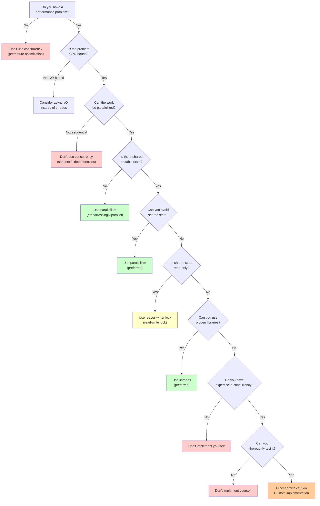

# Chapter 3.5: Concurrency for Data Structures

## Table of Contents

- [Scope and Limitations](#scope-and-limitations)
- [3.5.1 Why Concurrency Changes Everything](#1-why-concurrency-changes-everything)
  - [Single-Threaded Assumptions Break](#single-threaded-assumptions-break)
  - [Correct Code Can Become Incorrect](#correct-code-can-become-incorrect)
  - [Performance ≠ Correctness](#performance-correctness)
- [3.5.2 The Concurrency Model We Assume](#2-the-concurrency-model-we-assume)
  - [Shared Memory](#shared-memory)
  - [Multiple Threads](#multiple-threads)
  - [Preemptive Scheduling](#preemptive-scheduling)
  - [Weak Ordering (Conceptual)](#weak-ordering-conceptual)
- [3.5.3 Invariants Under Interleavings](#3-invariants-under-interleavings)
  - [What Invariants Are](#what-invariants-are)
  - [Why Invariants Break Under Concurrency](#why-invariants-break-under-concurrency)
  - [Atomicity as Invariant Preservation](#atomicity-as-invariant-preservation)
- [3.5.4 Race Conditions](#4-race-conditions)
  - [Data Races vs Logical Races](#data-races-vs-logical-races)
  - [Read-Modify-Write Hazards](#read-modify-write-hazards)
  - [Lost Updates](#lost-updates)
- [3.5.5 Atomicity and Critical Sections](#5-atomicity-and-critical-sections)
  - [Atomic Operations](#atomic-operations)
  - [Critical Sections](#critical-sections)
  - [Mutual Exclusion](#mutual-exclusion)
  - [What Locks Guarantee](#what-locks-guarantee)
- [3.5.6 Memory Visibility (Lightweight)](#6-memory-visibility-lightweight)
  - [Visibility vs Atomicity](#visibility-vs-atomicity)
  - [Happens-Before (Informal)](#happens-before-informal)
  - [Why "It Works on My Machine" Fails](#why-it-works-on-my-machine-fails)
- [3.5.7 Deadlocks and Livelocks](#7-deadlocks-and-livelocks)
  - [Circular Wait (Deadlock)](#circular-wait-deadlock)
  - [Lock Ordering](#lock-ordering)
  - [Why Deadlocks Are Correctness Bugs](#why-deadlocks-are-correctness-bugs)
- [3.5.8 Deadlock Prevention: Breaking the Four Necessary Conditions](#8-deadlock-prevention-breaking-the-four-necessary-conditions)
  - [Strategy 1: Break Circular Wait (Resource Ordering)](#strategy-1-break-circular-wait-resource-ordering)
  - [Strategy 2: Break Hold-and-Wait (Acquire All Resources Upfront)](#strategy-2-break-hold-and-wait-acquire-all-resources-upfront)
  - [Strategy 3: Break No Preemption (Lock Timeouts and Backoff)](#strategy-3-break-no-preemption-lock-timeouts-and-backoff)
  - [Strategy 4: Break Mutual Exclusion (Lock-Free Data Structures)](#strategy-4-break-mutual-exclusion-lock-free-data-structures)
  - [Comparison of Prevention Strategies](#comparison-of-prevention-strategies)
  - [Best Practices](#best-practices)
  - [Example: Complete Deadlock Prevention](#example-complete-deadlock-prevention)
- [3.5.9 Lock Granularity Tradeoffs](#9-lock-granularity-tradeoffs)
  - [Coarse-Grained Locking](#coarse-grained-locking)
  - [Fine-Grained Locking](#fine-grained-locking)
  - [Throughput vs Complexity](#throughput-vs-complexity)
- [3.5.10 Practical Example: Producer-Consumer Problem](#10-practical-example-producer-consumer-problem)
  - [Problem Statement](#problem-statement)
  - [Naive Implementation (Incorrect)](#naive-implementation-incorrect)
  - [Correct Implementation with Condition Variables](#correct-implementation-with-condition-variables)
  - [How It Works](#how-it-works)
  - [Example Usage](#example-usage)
  - [Key Concepts Demonstrated](#key-concepts-demonstrated)
  - [Common Pitfalls](#common-pitfalls)
  - [Enhanced Practical Example: Producer-Consumer with Shutdown](#enhanced-practical-example-producer-consumer-with-shutdown)
  - [Real-World Example: Task Queue for Thread Pool](#real-world-example-task-queue-for-thread-pool)
  - [Real-World Example: Log Buffer with Flush](#real-world-example-log-buffer-with-flush)
  - [Key Design Patterns](#key-design-patterns)
  - [Real-World Applications](#real-world-applications)
- [3.5.11 When to Use Concurrency: Decision Tree](#11-when-to-use-concurrency-decision-tree)
  - [Decision Tree](#decision-tree)
  - [Detailed Guidelines](#detailed-guidelines)
  - [When NOT to Use Concurrency](#when-not-to-use-concurrency)
  - [Benefits vs Costs](#benefits-vs-costs)
  - [Key Takeaway](#key-takeaway)
- [3.5.12 Reader-Writer Locks](#12-reader-writer-locks)
  - [The Problem](#the-problem)
  - [Custom Implementation Using Mutex and Condition Variables](#custom-implementation-using-mutex-and-condition-variables)
  - [How It Works](#how-it-works)
  - [Practical Example: Thread-Safe Container](#practical-example-thread-safe-container)
  - [Producer-Consumer Example with Reader-Writer Lock](#producer-consumer-example-with-reader-writer-lock)
  - [Reader-Writer Lock Invariants](#reader-writer-lock-invariants)
  - [When Writers Can Starve](#when-writers-can-starve)
  - [When to Use Reader-Writer Locks](#when-to-use-reader-writer-locks)
  - [Comparison: Mutex vs Reader-Writer Lock](#comparison-mutex-vs-reader-writer-lock)
  - [Best Practices](#best-practices)
- [3.5.13 Lock-Free Concepts and Data Structures Preview](#13-lock-free-concepts-and-data-structures-preview)
  - [Compare-And-Swap (CAS)](#compare-and-swap-cas)
  - [ABA Problem](#aba-problem)
  - [Progress Guarantees](#progress-guarantees)
  - [Lock-Free Data Structures Preview](#lock-free-data-structures-preview)
  - [Common Lock-Free Patterns](#common-lock-free-patterns)
  - [Memory Ordering Considerations](#memory-ordering-considerations)
  - [Explicit Warning](#explicit-warning)
  - [When to Consider Lock-Free](#when-to-consider-lock-free)
- [3.5.14 What This Book Will and Will Not Do](#14-what-this-book-will-and-will-not-do)
  - [Guidance on Using Libraries](#guidance-on-using-libraries)
  - [When to Build Your Own](#when-to-build-your-own)
  - [How to Reason Even When Not Implementing](#how-to-reason-even-when-not-implementing)
- [3.5.15 Key Takeaways](#15-key-takeaways)
- [3.5.16 Summary](#16-summary)


## Scope and Limitations

**In Scope:**
- Shared-memory concurrency
- Reasoning about correctness
- Invariants under interleavings
- Lock-based designs (primary focus)
- Lock-free ideas (conceptual, limited coverage)

**Out of Scope:**
- Async/await frameworks
- Distributed systems
- Thread pools and executors
- Language-specific APIs
- Full lock-free implementations

This chapter provides foundational understanding for reasoning about concurrent data structures. For production code, prefer well-tested libraries unless there is a compelling reason not to.

## 3.5.1 Why Concurrency Changes Everything

### Single-Threaded Assumptions Break

In single-threaded code, we can reason sequentially:
```cpp
int counter = 0;
counter++;  // Always works correctly
```

**Assumption**: Operations execute in program order, one at a time.

**Reality in Concurrent Systems**: Multiple threads can interleave operations unpredictably:
```cpp
// Thread 1 and Thread 2 both execute:
counter = counter + 1;  // Read, compute, write - three steps!
```

**Possible Interleavings:**
```
Thread 1: Read(0) → Compute(1)
Thread 2: Read(0) → Compute(1)  // Both read same value!
Thread 1: Write(1)
Thread 2: Write(1)
Result: counter = 1 (should be 2!) ✗
```

### Correct Code Can Become Incorrect

Code that is correct in single-threaded execution can become incorrect under concurrency:

```cpp
// Single-threaded: Always correct
void insertAfter(Node* prev, Node* new_node) {
    new_node->next = prev->next;
    prev->next = new_node;
}
```

**Problem**: Between the two assignments, another thread may observe an inconsistent state where the invariant "next pointers form a valid chain" is violated.

### Performance ≠ Correctness

**Key Insight**: Making code faster with threads doesn't help if it's incorrect. Correctness must come first.

Concurrency introduces **interleavings**, not just parallelism. We must reason about all possible interleavings of operations.

## 3.5.2 The Concurrency Model We Assume

### Shared Memory

We assume a **shared-memory** model where:
- Multiple threads share the same memory space
- All threads can read and write shared variables
- Changes made by one thread are visible to others (eventually)

### Multiple Threads

- Each thread executes independently
- Threads can run on the same or different CPU cores
- Threads are scheduled by the operating system

### Preemptive Scheduling

- The OS can interrupt a thread at any time
- Threads don't voluntarily yield control
- We cannot assume any particular execution order

### Weak Ordering (Conceptual)

Modern CPUs and compilers can reorder operations for performance:
- **Compiler reordering**: Instructions may be reordered during compilation
- **CPU reordering**: Memory operations may be reordered by the CPU
- **Cache effects**: Each CPU core has its own cache

**Key Principle**: We reason about **all possible interleavings** of operations. If any interleaving can break an invariant, the code is incorrect.

## 3.5.3 Invariants Under Interleavings

### What Invariants Are

An **invariant** is a property that must always be true for a data structure to be valid.

**Example - Stack Invariant:**
- "The `top` pointer points to the most recently pushed element"
- "`size` equals the number of elements"

### Why Invariants Break Under Concurrency

**Single-threaded**: Operations execute atomically from the perspective of the program.

**Concurrent**: Operations can be **interrupted** between steps, exposing intermediate states.

**Example: Counter Increment**

```cpp
int counter = 0;

void increment() {
    counter = counter + 1;  // Three steps: read, compute, write
}
```

**Invariant**: "`counter` equals the total number of `increment()` calls"

**What Breaks**: The operation is not atomic. Between reading `counter` and writing the new value, another thread can also read and write, causing lost updates.

**Example: Linked List Insertion**

```cpp
void insertAfter(Node* prev, Node* new_node) {
    new_node->next = prev->next;  // Step 1
    prev->next = new_node;         // Step 2
}
```

**Invariant**: "Each node's `next` pointer correctly points to the next node in the sequence"

**What Breaks**: Between Step 1 and Step 2:
- `new_node->next` points to the next node
- But `prev->next` still points to the old next node
- Another thread traversing the list may miss `new_node` or see an inconsistent state

### Atomicity as Invariant Preservation

**Atomicity** means an operation appears to execute as a single, indivisible step from the perspective of other threads.

**Goal**: Make operations atomic so that invariants are never observed in a broken state.

**Approaches**:
1. **Locks**: Ensure only one thread executes the operation at a time
2. **Atomic operations**: Use hardware-supported atomic operations
3. **Lock-free techniques**: Use Compare-And-Swap and other atomic primitives

## 3.5.4 Race Conditions

### Data Races vs Logical Races

**Data Race**: Two threads access the same memory location, at least one is a write, and the accesses are not synchronized.

```cpp
// Data race: Unsynchronized access
int shared = 0;
// Thread 1: shared++
// Thread 2: shared++
// Both access shared without synchronization
```

**Logical Race**: Even with synchronization, the logic can be incorrect:

```cpp
// Logical race: Check-then-act
if (!queue.empty()) {        // Check
    int value = queue.pop();  // Act (but queue may be empty now!)
}
```

### Read-Modify-Write Hazards

Many operations are **read-modify-write** (RMW):

```cpp
counter++;           // Read counter, increment, write back
array[i] = array[i] + 1;  // Read, compute, write
node->next = node->next->next;  // Read, compute, write
```

**Problem**: These are not atomic. Another thread can interleave between the read and write.

**Solution**: Use atomic operations or locks to make the entire RMW operation atomic.

### Lost Updates

**Lost Update Problem**: Two threads update the same value, one update is lost.

```cpp
// Thread 1: counter = counter + 1  (reads 0, writes 1)
// Thread 2: counter = counter + 1  (reads 0, writes 1)
// Result: counter = 1 (should be 2)
```

**Prevention**: Make the update atomic.

## 3.5.5 Atomicity and Critical Sections

### Atomic Operations

An **atomic operation** appears to execute as a single, indivisible step. Either it completes entirely, or it doesn't happen at all.

**Hardware Atomic Operations**:
```cpp
std::atomic<int> counter{0};
counter++;  // Atomic increment
```

**Compound Operations** (not atomic by default):
```cpp
int counter = 0;
counter++;  // Three steps: read, compute, write - NOT atomic
```

### Critical Sections

A **critical section** is a code region that accesses shared resources and must not be executed concurrently by multiple threads.

**Protection**: Use synchronization primitives (locks) to ensure mutual exclusion.

### Mutual Exclusion

**Mutual exclusion** ensures that only one thread can execute a critical section at a time.

```cpp
std::mutex mtx;

void safeIncrement() {
    std::lock_guard<std::mutex> lock(mtx);  // Acquire lock
    counter++;  // Critical section - only one thread here
    // Lock automatically released when lock_guard goes out of scope
}
```

### What Locks Guarantee

**Locks provide**:
- **Mutual exclusion**: Only one thread in critical section
- **Happens-before**: All writes before unlock are visible to threads that acquire the lock after

**Locks do NOT provide**:
- Protection against deadlocks
- Protection against incorrect logic (logical races)
- Automatic correctness (you must identify what needs protection)

## 3.5.6 Memory Visibility (Lightweight)

### Visibility vs Atomicity

**Atomicity**: Operation appears indivisible (no interleaving)

**Visibility**: Changes made by one thread are seen by other threads

These are **different concerns**:
- An operation can be atomic but not visible (if not properly synchronized)
- An operation can be visible but not atomic (partial updates seen)

### Happens-Before (Informal)

**Happens-before** is a guarantee that if operation A happens-before operation B, then:
- All memory writes by A are visible to B
- A's effects are complete before B begins

**Synchronization establishes happens-before**:
- Mutex lock/unlock
- Atomic operations with appropriate memory ordering
- Thread creation/join

### Why "It Works on My Machine" Fails

**Common Scenario**:
```cpp
bool ready = false;
int data = 0;

// Thread 1
void producer() {
    data = 42;
    ready = true;
}

// Thread 2
void consumer() {
    while (!ready) { }
    use(data);  // May see data = 0!
}
```

**Problem**: Without proper synchronization:
- CPU caches may not be flushed
- Compiler may reorder operations
- CPU may reorder memory operations

**Solution**: Use synchronization (mutex, atomic, or memory barriers) to establish happens-before.

## 3.5.7 Deadlocks and Livelocks

### Circular Wait (Deadlock)

A **deadlock** occurs when two or more threads are blocked forever, each waiting for a resource held by another.

**Classic Example**:
```cpp
// Thread 1
void transfer1(Account& from, Account& to, int amount) {
    std::lock_guard<std::mutex> lock1(from.mtx);  // Lock from
    std::lock_guard<std::mutex> lock2(to.mtx);    // Lock to
    // Transfer money
}

// Thread 2
void transfer2(Account& from, Account& to, int amount) {
    std::lock_guard<std::mutex> lock1(to.mtx);    // Lock to (different order!)
    std::lock_guard<std::mutex> lock2(from.mtx);  // Lock from
    // Transfer money
}
```

**Deadlock Scenario**:
```
Thread 1: Locks from.mtx, waits for to.mtx
Thread 2: Locks to.mtx, waits for from.mtx
→ Both blocked forever!
```

### Lock Ordering

**Solution**: Always acquire locks in the same order.

```cpp
// Always lock in order: from.mtx, then to.mtx
void transfer(Account& from, Account& to, int amount) {
    std::lock(from.mtx, to.mtx);  // Lock both atomically
    std::lock_guard<std::mutex> lock1(from.mtx, std::adopt_lock);
    std::lock_guard<std::mutex> lock2(to.mtx, std::adopt_lock);
    // Transfer money
}
```

### Why Deadlocks Are Correctness Bugs

Deadlocks are **correctness bugs**, not performance issues. They violate the fundamental expectation that a program should make progress, causing it to stall indefinitely due to circular dependencies where threads wait for resources held by each other, leading to frozen or crashed applications and failed service objectives, making them severe logical errors in concurrent systems. They represent a failure in logic, often from improper lock usage, creating a state where the system is functionally broken and unresponsive.

**1. Stalled Progress**: The core issue is that threads involved in a deadlock stop making forward progress, effectively halting that part of the program, which is a fundamental failure in correct execution. Unlike performance issues where the program runs slowly, deadlocks cause complete cessation of progress.

**2. Violation of Intent**: While locks prevent race conditions, deadlocks arise from incorrect ordering or usage of these locks, meaning the programmer's intended sequence of operations isn't met, breaking the program's logic. The code may be syntactically correct, but the concurrent execution violates the intended behavior.

**3. System Unresponsiveness**: A deadlocked system becomes frozen or unresponsive, failing to meet uptime and reliability goals, which is a critical failure in system behavior. In production systems, this can lead to service outages, data loss, or cascading failures.

**4. Circular Wait Condition**: A deadlock forms a cycle (e.g., Thread A waits for Thread B, Thread B waits for Thread A), creating a self-perpetuating state of inaction that's a clear bug in the concurrency design. This circular dependency is a logical flaw that prevents any resolution without external intervention.

**5. Difficult to Detect & Fix**: They are pernicious because they depend on specific, often rare, thread interleavings, making them hard to find with testing and diagnose, highlighting a deep logical flaw. Deadlocks may only manifest under specific timing conditions, making them intermittent and difficult to reproduce.

**6. Impact Beyond Stalling**: Lock misuse causing deadlocks can also lead to other severe issues, like privilege escalation or arbitrary code execution, further cementing their status as major correctness flaws. In security-critical systems, deadlocks can be exploited or cause denial-of-service.

**In essence**: A deadlock isn't just a performance issue; it's a bug in the program's core logic that prevents it from fulfilling its intended function, making it a classic correctness bug in concurrent programming.

## 3.5.8 Deadlock Prevention: Breaking the Four Necessary Conditions

For a deadlock to occur, **all four** of the following conditions must be simultaneously true:

1. **Mutual Exclusion**: Resources cannot be shared; only one thread can hold a resource at a time
2. **Hold and Wait**: A thread holds at least one resource while waiting for additional resources
3. **No Preemption**: Resources cannot be forcibly taken away from a thread; they must be voluntarily released
4. **Circular Wait**: There exists a circular chain of threads, where each thread waits for a resource held by the next thread in the chain

**Key Insight**: To prevent deadlocks, we must ensure that **at least one** of these conditions never occurs. This is the fundamental principle of deadlock prevention.

### Strategy 1: Break Circular Wait (Resource Ordering)

**Principle**: Enforce a consistent ordering on all resources (locks) so that threads always acquire them in the same order, preventing circular wait.

**Implementation**:

```cpp
// Define a consistent ordering function
uintptr_t getLockOrder(const std::mutex* mtx) {
    return reinterpret_cast<uintptr_t>(mtx);  // Use memory address as ordering
}

// Always acquire locks in order
void transfer(Account& from, Account& to, int amount) {
    // Determine order based on memory addresses
    std::mutex* first = &from.mtx;
    std::mutex* second = &to.mtx;
    
    if (getLockOrder(&from.mtx) > getLockOrder(&to.mtx)) {
        std::swap(first, second);  // Ensure consistent order
    }
    
    std::lock(*first, *second);  // Acquire in consistent order
    std::lock_guard<std::mutex> lock1(*first, std::adopt_lock);
    std::lock_guard<std::mutex> lock2(*second, std::adopt_lock);
    
    // Perform transfer
    from.balance -= amount;
    to.balance += amount;
}
```

**Alternative: Use std::lock() for Atomic Acquisition**:

```cpp
void transfer(Account& from, Account& to, int amount) {
    // std::lock() acquires locks atomically, preventing deadlock
    std::lock(from.mtx, to.mtx);
    std::lock_guard<std::mutex> lock1(from.mtx, std::adopt_lock);
    std::lock_guard<std::mutex> lock2(to.mtx, std::adopt_lock);
    
    from.balance -= amount;
    to.balance += amount;
}
```

**Advantages**:
- Simple to understand and implement
- Works well when you can establish a consistent ordering
- Prevents circular wait completely

**Limitations**:
- Requires all threads to follow the same ordering
- May reduce parallelism if ordering forces sequential access

### Strategy 2: Break Hold-and-Wait (Acquire All Resources Upfront)

**Principle**: Require threads to acquire all needed resources atomically before starting any operation, preventing hold-and-wait.

**Implementation**:

```cpp
class ResourceManager {
    std::mutex mtx1, mtx2, mtx3;
    
public:
    // Acquire all needed resources upfront
    void operationRequiringAllResources() {
        std::lock(mtx1, mtx2, mtx3);  // Acquire all at once
        std::lock_guard<std::mutex> lock1(mtx1, std::adopt_lock);
        std::lock_guard<std::mutex> lock2(mtx2, std::adopt_lock);
        std::lock_guard<std::mutex> lock3(mtx3, std::adopt_lock);
        
        // Now perform operation with all resources held
        // ...
    }
    
    // Alternative: Use try_lock to attempt acquisition
    bool tryOperationRequiringAllResources() {
        std::unique_lock<std::mutex> lock1(mtx1, std::try_to_lock);
        if (!lock1.owns_lock()) return false;
        
        std::unique_lock<std::mutex> lock2(mtx2, std::try_to_lock);
        if (!lock2.owns_lock()) return false;
        
        std::unique_lock<std::mutex> lock3(mtx3, std::try_to_lock);
        if (!lock3.owns_lock()) return false;
        
        // All locks acquired, perform operation
        // ...
        return true;
    }
};
```

**Advantages**:
- Eliminates hold-and-wait completely
- Prevents deadlock by design
- Works well when resource needs are known in advance

**Limitations**:
- May hold resources longer than necessary
- Can reduce parallelism if resources are held unnecessarily
- May cause starvation if resources are frequently unavailable

### Strategy 3: Break No Preemption (Lock Timeouts and Backoff)

**Principle**: Allow resources to be released if they cannot be acquired within a timeout, breaking the no-preemption condition.

**Implementation**:

```cpp
#include <chrono>
#include <thread>

bool transferWithTimeout(Account& from, Account& to, int amount, 
                          std::chrono::milliseconds timeout) {
    auto start = std::chrono::steady_clock::now();
    
    while (true) {
        // Try to acquire both locks
        std::unique_lock<std::mutex> lock1(from.mtx, std::try_to_lock);
        if (!lock1.owns_lock()) {
            // Check timeout
            if (std::chrono::steady_clock::now() - start > timeout) {
                return false;  // Timeout: give up
            }
            std::this_thread::sleep_for(std::chrono::milliseconds(10));
            continue;
        }
        
        std::unique_lock<std::mutex> lock2(to.mtx, std::try_to_lock);
        if (!lock2.owns_lock()) {
            // Release first lock and retry (preemption)
            lock1.unlock();
            if (std::chrono::steady_clock::now() - start > timeout) {
                return false;
            }
            std::this_thread::sleep_for(std::chrono::milliseconds(10));
            continue;
        }
        
        // Both locks acquired
        from.balance -= amount;
        to.balance += amount;
        return true;
    }
}
```

**Advantages**:
- Prevents indefinite blocking
- Allows progress even when some resources are unavailable
- Can implement exponential backoff for better performance

**Limitations**:
- More complex to implement
- May require retry logic
- Timeout values need careful tuning

### Strategy 4: Break Mutual Exclusion (Lock-Free Data Structures)

**Principle**: Use lock-free or wait-free algorithms that don't require mutual exclusion, eliminating the need for locks entirely.

**Implementation**:

```cpp
#include <atomic>

class LockFreeCounter {
    std::atomic<int> count{0};
    
public:
    void increment() {
        count.fetch_add(1, std::memory_order_relaxed);
    }
    
    int get() const {
        return count.load(std::memory_order_acquire);
    }
};
```

**Advantages**:
- No deadlocks possible (no locks!)
- Often better performance under high contention
- Scalable to many threads

**Limitations**:
- More complex algorithms
- Limited applicability (not all operations can be lock-free)
- Requires careful memory ordering considerations

### Comparison of Prevention Strategies

| Strategy | Condition Broken | Complexity | Performance Impact | Applicability |
|----------|------------------|------------|---------------------|---------------|
| **Resource Ordering** | Circular Wait | Low | Low | High (most common) |
| **Acquire All Upfront** | Hold-and-Wait | Medium | Medium | Medium |
| **Lock Timeouts** | No Preemption | High | Medium | Medium |
| **Lock-Free** | Mutual Exclusion | Very High | Low (often better) | Low (limited) |

### Best Practices

1. **Start with Resource Ordering**: This is the simplest and most effective strategy for most cases
2. **Use `std::lock()`**: When acquiring multiple locks, use `std::lock()` to acquire them atomically
3. **Minimize Lock Scope**: Hold locks for the shortest time possible
4. **Avoid Nested Locks**: When possible, restructure code to avoid needing multiple locks
5. **Consider Lock-Free Alternatives**: For high-contention scenarios, evaluate lock-free data structures
6. **Document Lock Ordering**: If you establish a lock ordering, document it clearly for all developers

### Example: Complete Deadlock Prevention

```cpp
class ThreadSafeBank {
    struct Account {
        int balance;
        std::mutex mtx;
    };
    
    std::vector<Account> accounts;
    
    // Helper to get lock order
    static bool lockOrder(const Account* a, const Account* b) {
        return a < b;  // Use memory address for ordering
    }
    
public:
    bool transfer(int fromId, int toId, int amount) {
        Account* from = &accounts[fromId];
        Account* to = &accounts[toId];
        
        // Ensure consistent lock ordering
        if (!lockOrder(from, to)) {
            std::swap(from, to);
        }
        
        // Acquire locks in consistent order
        std::lock(from->mtx, to->mtx);
        std::lock_guard<std::mutex> lock1(from->mtx, std::adopt_lock);
        std::lock_guard<std::mutex> lock2(to->mtx, std::adopt_lock);
        
        // Perform transfer
        if (from->balance >= amount) {
            from->balance -= amount;
            to->balance += amount;
            return true;
        }
        return false;
    }
};
```

**Key Takeaway**: By ensuring at least one of the four necessary conditions never occurs, we can prevent deadlocks entirely. Resource ordering (breaking circular wait) is the most practical and commonly used approach.

## 3.5.9 Lock Granularity Tradeoffs

### Coarse-Grained Locking

**Single lock protects entire data structure**:

```cpp
class ThreadSafeList {
    std::list<int> data;
    std::mutex mtx;  // One lock for entire list
    
public:
    void insert(int value) {
        std::lock_guard<std::mutex> lock(mtx);
        data.push_back(value);
    }
};
```

**Pros**:
- Simple to implement
- Prevents all race conditions
- Easy to reason about

**Cons**:
- Low parallelism (only one operation at a time)
- High contention under load
- Throughput collapses with many threads

### Fine-Grained Locking

**Multiple locks protect different parts of the structure**:

```cpp
class FineGrainedHashTable {
    std::vector<Bucket> buckets;
    std::vector<std::mutex> bucket_locks;  // One lock per bucket
    
public:
    void insert(int key, int value) {
        int bucket = hash(key) % buckets.size();
        std::lock_guard<std::mutex> lock(bucket_locks[bucket]);
        buckets[bucket].insert(key, value);
    }
};
```

**Pros**:
- Higher parallelism (different buckets can be accessed concurrently)
- Better scalability

**Cons**:
- More complex to implement
- Risk of deadlock if lock order violated
- Higher memory overhead
- Complex operations (like resizing) become difficult

### Throughput vs Complexity

**Trade-off**: 
- **Coarse-grained**: Simple but low throughput
- **Fine-grained**: Complex but higher throughput

**Guidance**: Start with coarse-grained. Only optimize to fine-grained if profiling shows it's necessary.

## 3.5.10 Practical Example: Producer-Consumer Problem

The **Producer-Consumer** problem is a classic synchronization problem that demonstrates many concurrency concepts. It involves:
- **Producers**: Threads that produce data and add it to a shared buffer
- **Consumers**: Threads that consume data from the shared buffer
- **Bounded Buffer**: A queue with limited capacity

### Problem Statement

**Invariants**:
1. **Buffer Size Invariant**: `0 ≤ size ≤ capacity`
2. **FIFO Invariant**: Elements are consumed in the order they were produced
3. **No Overflow**: Producers must wait when buffer is full
4. **No Underflow**: Consumers must wait when buffer is empty

### Naive Implementation (Incorrect)

```cpp
#include <queue>
#include <mutex>

class BoundedQueue {
private:
    std::queue<int> buffer;
    int capacity;
    std::mutex mtx;
    
public:
    BoundedQueue(int cap) : capacity(cap) {}
    
    // WRONG: Race condition!
    void produce(int item) {
        if (buffer.size() < capacity) {  // Check
            buffer.push(item);           // Act (not atomic!)
        }
    }
    
    // WRONG: Race condition!
    int consume() {
        if (!buffer.empty()) {  // Check
            int item = buffer.front();  // Act (not atomic!)
            buffer.pop();
            return item;
        }
        return -1;  // Error: no item
    }
};
```

**Problems**:
- **Check-then-act race**: Between check and act, another thread may modify the buffer
- **Lost updates**: Multiple producers can add items when buffer is almost full
- **Use-after-empty**: Consumer may pop from empty buffer

### Correct Implementation with Condition Variables

```cpp
#include <queue>
#include <mutex>
#include <condition_variable>

class BoundedQueue {
private:
    std::queue<int> buffer;
    int capacity;
    std::mutex mtx;
    std::condition_variable not_full;   // Signaled when buffer has space
    std::condition_variable not_empty;   // Signaled when buffer has items
    
public:
    BoundedQueue(int cap) : capacity(cap) {}
    
    void produce(int item) {
        std::unique_lock<std::mutex> lock(mtx);
        
        // Wait until buffer has space (preserves "No Overflow" invariant)
        not_full.wait(lock, [this] { return buffer.size() < capacity; });
        
        // Critical section: add item
        buffer.push(item);
        
        // Notify one waiting consumer (preserves "No Underflow" invariant)
        not_empty.notify_one();
    }
    
    int consume() {
        std::unique_lock<std::mutex> lock(mtx);
        
        // Wait until buffer has items (preserves "No Underflow" invariant)
        not_empty.wait(lock, [this] { return !buffer.empty(); });
        
        // Critical section: remove item
        int item = buffer.front();
        buffer.pop();
        
        // Notify one waiting producer (preserves "No Overflow" invariant)
        not_full.notify_one();
        
        return item;
    }
    
    size_t size() {
        std::lock_guard<std::mutex> lock(mtx);
        return buffer.size();
    }
};
```

### How It Works

**Producer**:
1. Acquires lock (mutual exclusion)
2. Waits if buffer is full (preserves "No Overflow" invariant)
3. Adds item to buffer (atomic operation)
4. Notifies a waiting consumer
5. Releases lock

**Consumer**:
1. Acquires lock (mutual exclusion)
2. Waits if buffer is empty (preserves "No Underflow" invariant)
3. Removes item from buffer (atomic operation)
4. Notifies a waiting producer
5. Releases lock

**Condition Variables**:
- `wait()`: Releases lock, blocks until notified, then reacquires lock
- `notify_one()`: Wakes up one waiting thread
- `notify_all()`: Wakes up all waiting threads

### Example Usage

```cpp
#include <thread>
#include <vector>
#include <iostream>

void producer(BoundedQueue& queue, int id, int items) {
    for (int i = 0; i < items; i++) {
        queue.produce(id * 1000 + i);
        std::cout << "Producer " << id << " produced: " << (id * 1000 + i) << std::endl;
        std::this_thread::sleep_for(std::chrono::milliseconds(100));
    }
}

void consumer(BoundedQueue& queue, int id) {
    while (true) {
        int item = queue.consume();
        std::cout << "Consumer " << id << " consumed: " << item << std::endl;
        std::this_thread::sleep_for(std::chrono::milliseconds(150));
    }
}

int main() {
    BoundedQueue queue(5);  // Buffer capacity: 5
    
    // Create producers
    std::vector<std::thread> producers;
    for (int i = 0; i < 2; i++) {
        producers.emplace_back(producer, std::ref(queue), i, 10);
    }
    
    // Create consumers
    std::vector<std::thread> consumers;
    for (int i = 0; i < 2; i++) {
        consumers.emplace_back(consumer, std::ref(queue), i);
    }
    
    // Wait for producers
    for (auto& t : producers) {
        t.join();
    }
    
    // Consumers will block waiting for more items
    // In a real application, you'd have a termination signal
    
    return 0;
}
```

### Key Concepts Demonstrated

1. **Mutual Exclusion**: `mutex` ensures only one thread modifies buffer at a time
2. **Condition Variables**: Allow threads to wait for specific conditions
3. **Invariant Preservation**: Operations maintain buffer size and FIFO invariants
4. **Atomic Operations**: Check and act are combined atomically
5. **Deadlock Avoidance**: Condition variables prevent deadlock (unlike busy-waiting)

### Common Pitfalls

**Pitfall 1: Busy Waiting**
```cpp
// BAD: Wastes CPU
while (buffer.size() >= capacity) {
    // Do nothing, just spin
}
```

**Pitfall 2: Lost Notifications**
```cpp
// BAD: Notification might be lost if no one is waiting
if (buffer.size() < capacity) {
    not_full.notify_one();  // Might notify no one
}
```

**Pitfall 3: Spurious Wakeups**
```cpp
// BAD: Condition might be false even after wakeup
not_empty.wait(lock);  // May wake up even if buffer is empty!
// CORRECT:
not_empty.wait(lock, [this] { return !buffer.empty(); });
```

### Enhanced Practical Example: Producer-Consumer with Shutdown

Here's a more complete implementation with proper shutdown handling:

```cpp
#include <queue>
#include <mutex>
#include <condition_variable>
#include <thread>
#include <vector>
#include <iostream>
#include <atomic>
#include <chrono>

template<typename T>
class ThreadSafeQueue {
private:
    std::queue<T> buffer;
    size_t capacity;
    std::mutex mtx;
    std::condition_variable not_full;
    std::condition_variable not_empty;
    std::atomic<bool> shutdown{false};
    
public:
    ThreadSafeQueue(size_t cap) : capacity(cap) {}
    
    // Producer: Add item to queue
    bool enqueue(const T& item) {
        std::unique_lock<std::mutex> lock(mtx);
        
        // Wait until space available or shutdown
        not_full.wait(lock, [this] { 
            return buffer.size() < capacity || shutdown.load(); 
        });
        
        if (shutdown.load()) {
            return false;  // Shutdown requested
        }
        
        buffer.push(item);
        not_empty.notify_one();
        return true;
    }
    
    // Consumer: Remove item from queue
    bool dequeue(T& item) {
        std::unique_lock<std::mutex> lock(mtx);
        
        // Wait until item available or shutdown
        not_empty.wait(lock, [this] { 
            return !buffer.empty() || shutdown.load(); 
        });
        
        if (shutdown.load() && buffer.empty()) {
            return false;  // Shutdown and no more items
        }
        
        item = buffer.front();
        buffer.pop();
        not_full.notify_one();
        return true;
    }
    
    // Signal shutdown to all waiting threads
    void shutdown_queue() {
        shutdown.store(true);
        std::lock_guard<std::mutex> lock(mtx);
        not_full.notify_all();
        not_empty.notify_all();
    }
    
    size_t size() const {
        std::lock_guard<std::mutex> lock(mtx);
        return buffer.size();
    }
    
    bool is_shutdown() const {
        return shutdown.load();
    }
};

// Producer function
void producer(ThreadSafeQueue<int>& queue, int id, int num_items) {
    for (int i = 0; i < num_items; i++) {
        int item = id * 1000 + i;
        if (!queue.enqueue(item)) {
            std::cout << "Producer " << id << " stopped (shutdown)\n";
            break;
        }
        std::cout << "Producer " << id << " produced: " << item << std::endl;
        std::this_thread::sleep_for(std::chrono::milliseconds(50));
    }
    std::cout << "Producer " << id << " finished\n";
}

// Consumer function
void consumer(ThreadSafeQueue<int>& queue, int id) {
    int item;
    int count = 0;
    while (queue.dequeue(item)) {
        std::cout << "Consumer " << id << " consumed: " << item << std::endl;
        count++;
        std::this_thread::sleep_for(std::chrono::milliseconds(100));
    }
    std::cout << "Consumer " << id << " finished (processed " << count << " items)\n";
}

int main() {
    ThreadSafeQueue<int> queue(10);  // Buffer capacity: 10
    
    // Create multiple producers
    std::vector<std::thread> producers;
    for (int i = 0; i < 3; i++) {
        producers.emplace_back(producer, std::ref(queue), i, 20);
    }
    
    // Create multiple consumers
    std::vector<std::thread> consumers;
    for (int i = 0; i < 2; i++) {
        consumers.emplace_back(consumer, std::ref(queue), i);
    }
    
    // Wait for all producers to finish
    for (auto& t : producers) {
        t.join();
    }
    
    // Allow consumers to process remaining items
    std::this_thread::sleep_for(std::chrono::milliseconds(500));
    
    // Shutdown queue (wakes up all waiting consumers)
    queue.shutdown_queue();
    std::cout << "Queue shutdown signaled\n";
    
    // Wait for all consumers to finish
    for (auto& t : consumers) {
        t.join();
    }
    
    std::cout << "Final queue size: " << queue.size() << std::endl;
    return 0;
}
```

### Real-World Example: Task Queue for Thread Pool

Here's a practical example of a task queue used in a thread pool:

```cpp
#include <queue>
#include <mutex>
#include <condition_variable>
#include <thread>
#include <vector>
#include <functional>
#include <atomic>
#include <future>

class TaskQueue {
private:
    std::queue<std::function<void()>> tasks;
    std::mutex mtx;
    std::condition_variable cv;
    std::atomic<bool> stop{false};
    
public:
    // Add task to queue
    template<typename F>
    void enqueue(F&& task) {
        {
            std::lock_guard<std::mutex> lock(mtx);
            if (stop.load()) {
                return;  // Don't accept new tasks after shutdown
            }
            tasks.push(std::forward<F>(task));
        }
        cv.notify_one();
    }
    
    // Get task from queue (blocks until available or shutdown)
    bool dequeue(std::function<void()>& task) {
        std::unique_lock<std::mutex> lock(mtx);
        cv.wait(lock, [this] { return !tasks.empty() || stop.load(); });
        
        if (stop.load() && tasks.empty()) {
            return false;  // Shutdown and no more tasks
        }
        
        task = std::move(tasks.front());
        tasks.pop();
        return true;
    }
    
    void shutdown() {
        stop.store(true);
        cv.notify_all();
    }
};

// Worker thread that processes tasks
void worker_thread(TaskQueue& queue, int id) {
    std::function<void()> task;
    int task_count = 0;
    
    while (queue.dequeue(task)) {
        std::cout << "Worker " << id << " executing task " << task_count++ << std::endl;
        task();  // Execute the task
    }
    
    std::cout << "Worker " << id << " finished (processed " << task_count << " tasks)\n";
}

int main() {
    TaskQueue task_queue;
    
    // Create worker threads
    std::vector<std::thread> workers;
    for (int i = 0; i < 4; i++) {
        workers.emplace_back(worker_thread, std::ref(task_queue), i);
    }
    
    // Submit tasks
    for (int i = 0; i < 20; i++) {
        task_queue.enqueue([i]() {
            std::cout << "Task " << i << " executed\n";
            std::this_thread::sleep_for(std::chrono::milliseconds(100));
        });
    }
    
    // Wait a bit for tasks to process
    std::this_thread::sleep_for(std::chrono::seconds(3));
    
    // Shutdown
    task_queue.shutdown();
    std::cout << "Task queue shutdown\n";
    
    // Wait for workers
    for (auto& w : workers) {
        w.join();
    }
    
    return 0;
}
```

### Real-World Example: Log Buffer with Flush

A practical logging system where multiple threads write logs and one thread flushes to disk:

```cpp
#include <queue>
#include <mutex>
#include <condition_variable>
#include <thread>
#include <string>
#include <fstream>
#include <atomic>
#include <chrono>

class LogBuffer {
private:
    std::queue<std::string> log_queue;
    std::mutex mtx;
    std::condition_variable cv;
    std::atomic<bool> shutdown{false};
    std::ofstream log_file;
    
public:
    LogBuffer(const std::string& filename) : log_file(filename) {}
    
    // Multiple threads can write logs concurrently
    void write_log(const std::string& message) {
        std::lock_guard<std::mutex> lock(mtx);
        if (!shutdown.load()) {
            log_queue.push(message);
            cv.notify_one();
        }
    }
    
    // Single flusher thread processes logs
    void flush_worker() {
        std::unique_lock<std::mutex> lock(mtx);
        
        while (true) {
            // Wait for logs or shutdown
            cv.wait(lock, [this] { 
                return !log_queue.empty() || shutdown.load(); 
            });
            
            // Process all available logs
            while (!log_queue.empty()) {
                std::string log = log_queue.front();
                log_queue.pop();
                lock.unlock();
                
                // Write to file (outside lock for better performance)
                log_file << log << std::endl;
                log_file.flush();
                
                lock.lock();
            }
            
            if (shutdown.load()) {
                break;
            }
        }
    }
    
    void shutdown() {
        shutdown.store(true);
        cv.notify_one();
    }
    
    ~LogBuffer() {
        shutdown();
        if (log_file.is_open()) {
            log_file.close();
        }
    }
};

// Simulate multiple threads writing logs
void logger_thread(LogBuffer& buffer, int id) {
    for (int i = 0; i < 10; i++) {
        std::string log = "Thread " + std::to_string(id) + 
                         " - Log entry " + std::to_string(i);
        buffer.write_log(log);
        std::this_thread::sleep_for(std::chrono::milliseconds(50));
    }
}

int main() {
    LogBuffer log_buffer("app.log");
    
    // Start flusher thread
    std::thread flusher(&LogBuffer::flush_worker, &log_buffer);
    
    // Create multiple logger threads
    std::vector<std::thread> loggers;
    for (int i = 0; i < 5; i++) {
        loggers.emplace_back(logger_thread, std::ref(log_buffer), i);
    }
    
    // Wait for all loggers
    for (auto& t : loggers) {
        t.join();
    }
    
    // Shutdown and wait for flusher
    log_buffer.shutdown();
    flusher.join();
    
    std::cout << "All logs flushed to file\n";
    return 0;
}
```

### Key Design Patterns

**1. Shutdown Pattern**:
- Use `std::atomic<bool>` flag for shutdown signal
- Notify all waiting threads on shutdown
- Check shutdown flag in wait conditions

**2. Template-Based Queue**:
- Make queue generic with templates
- Supports any data type
- Reusable across different scenarios

**3. Batch Processing**:
- Process multiple items while holding lock
- Release lock for I/O operations
- Reduces lock contention

### Real-World Applications

- **Task Queues**: Thread pools processing tasks
- **Message Passing**: Inter-thread communication
- **Event Processing**: Producers generate events, consumers process them
- **Logging Systems**: Multiple threads write logs, one thread flushes to disk
- **Network Servers**: Producer threads receive requests, consumer threads process them
- **Data Pipeline**: Multiple stages processing data through queues
- **Image Processing**: Producer loads images, consumers process them

## 3.5.11 When to Use Concurrency: Decision Tree

Deciding when to use concurrency is crucial. Concurrency adds complexity and should only be used when it provides clear benefits.

### Decision Tree



**Text Version** (for reference):

```
Do you have a performance problem?
├─ No → Don't use concurrency (premature optimization)
│
└─ Yes → Continue
    │
    Is the problem CPU-bound?
    ├─ No (I/O-bound) → Consider async I/O instead
    │
    └─ Yes → Continue
        │
        Can the work be parallelized?
        ├─ No (sequential dependencies) → Don't use concurrency
        │
        └─ Yes → Continue
            │
            Is there shared mutable state?
            ├─ No → Use parallelism (embarrassingly parallel)
            │
            └─ Yes → Continue
                │
                Can you avoid shared state?
                ├─ Yes → Use parallelism (preferred)
                │
                └─ No → Continue
                    │
                    Is the shared state read-only?
                    ├─ Yes → Use reader-writer lock (read-write lock)
                    │
                    └─ No → Continue
                        │
                        Can you use proven libraries?
                        ├─ Yes → Use libraries (preferred)
                        │
                        └─ No → Continue
                            │
                            Do you have expertise in concurrency?
                            ├─ No → Don't implement yourself
                            │
                            └─ Yes → Consider custom implementation
                                │
                                Can you thoroughly test it?
                                ├─ No → Don't implement yourself
                                │
                                └─ Yes → Proceed with caution
```

### Detailed Guidelines

#### 1. Performance Problem First

**Don't use concurrency unless**:
- You have measured a performance problem
- Single-threaded performance is insufficient
- You've optimized the single-threaded version first

**Premature optimization**: Adding concurrency to code that doesn't need it adds complexity without benefit.

#### 2. CPU-Bound vs I/O-Bound

**CPU-Bound Work** (good for concurrency):
- Mathematical computations
- Image processing
- Data compression
- Sorting large arrays

**I/O-Bound Work** (consider async I/O instead):
- File I/O
- Network requests
- Database queries
- Consider async/await or event loops instead of threads

#### 3. Parallelizable Work

**Can be parallelized**:
- Independent computations
- Map-reduce operations
- Embarrassingly parallel problems
- Divide-and-conquer algorithms

**Cannot be parallelized**:
- Sequential dependencies
- Pipeline stages with dependencies
- Problems requiring global state

#### 4. Shared Mutable State

**Avoid if possible**:
- Use immutable data structures
- Use message passing
- Use functional programming patterns
- Partition data across threads

**If necessary**:
- Minimize shared state
- Use fine-grained locking
- Consider lock-free data structures (from libraries)

#### 5. Read-Only Shared State

**If state is read-only**:
- No synchronization needed for reads
- Use `std::shared_mutex` if occasional writes needed
- Multiple readers, single writer pattern

#### 6. Use Proven Libraries

**Always prefer**:
- `std::thread`, `std::mutex`, `std::condition_variable`
- Thread-safe containers from standard library or proven libraries
- Concurrency frameworks (OpenMP, TBB, etc.)

**Only implement custom**:
- If libraries don't meet your specific needs
- If you have deep expertise
- If you can thoroughly test

### When NOT to Use Concurrency

**Avoid concurrency when**:
1. **No performance problem**: Single-threaded is fast enough
2. **Sequential dependencies**: Work cannot be parallelized
3. **High synchronization overhead**: Lock contention dominates
4. **Simple problems**: Concurrency adds unnecessary complexity
5. **Lack of expertise**: Concurrency bugs are hard to debug
6. **Insufficient testing**: Can't thoroughly test concurrent code

### Benefits vs Costs

| Benefit | Cost |
|---------|------|
| **Performance**: Faster execution on multi-core CPUs | **Complexity**: Harder to reason about, debug, test |
| **Responsiveness**: UI stays responsive during computation | **Overhead**: Thread creation, context switching, synchronization |
| **Throughput**: Process more work in parallel | **Bugs**: Race conditions, deadlocks, livelocks |
| **Resource utilization**: Better CPU usage | **Maintenance**: Harder to maintain and modify |

### Key Takeaway

**Default to single-threaded**. Only add concurrency when:
1. You have a measured performance problem
2. The work can be parallelized
3. You understand the complexity trade-offs
4. You can thoroughly test the concurrent code
5. You prefer proven libraries over custom implementations

**Remember**: Correctness > Performance. A slow correct program is better than a fast incorrect one.

## 3.5.12 Reader-Writer Locks

Reader-Writer locks allow multiple readers to access shared data simultaneously, while ensuring exclusive access for writers. This is useful when reads are frequent and writes are infrequent.

### The Problem

**Standard `std::mutex`**:
- Only one thread can access data at a time (even for reads)
- Multiple readers block each other unnecessarily
- Reduces parallelism when reads dominate

**Reader-Writer Lock**:
- Multiple readers can access simultaneously
- Writers get exclusive access
- Better performance for read-heavy workloads

### Custom Implementation Using Mutex and Condition Variables

Here's a custom Reader-Writer lock implementation that gives us full control over the locking behavior:

```cpp
#include <mutex>
#include <condition_variable>
#include <cstdint>

class ReaderWriterLock {
private:
    std::mutex rw_mutex;                    // Protects internal state
    std::condition_variable r_cv;          // Notifies waiting readers
    std::condition_variable w_cv;          // Notifies waiting writers
    uintmax_t readers = 0;                 // Number of active readers
    uintmax_t writers = 0;                 // Number of waiting/active writers
    bool writer = false;                    // Is a writer currently active?
    
public:
    void readLock() {
        std::unique_lock<std::mutex> lock(rw_mutex);
        // Wait while any writer is active or waiting
        while (writers != 0) {
            r_cv.wait(lock);
        }
        ++readers;  // Increment reader count
    }
    
    void readUnlock() {
        std::unique_lock<std::mutex> lock(rw_mutex);
        --readers;
        // If there are waiting writers, notify them
        if (writers > 0) {
            lock.unlock();
            w_cv.notify_all();  // Wake up waiting writers
        }
    }
    
    void writeLock() {
        std::unique_lock<std::mutex> lock(rw_mutex);
        ++writers;  // Increment waiting writers count
        // Wait while a writer is active or readers are active
        while (writer || readers != 0) {
            w_cv.wait(lock);
        }
        writer = true;  // Mark writer as active
    }
    
    void writeUnlock() {
        std::unique_lock<std::mutex> lock(rw_mutex);
        --writers;  // Decrement waiting writers count
        if (writers > 0) {
            // More writers waiting, wake one up
            lock.unlock();
            w_cv.notify_one();
        } else {
            // No more writers, wake all waiting readers
            writer = false;
            lock.unlock();
            r_cv.notify_all();
        }
    }
};
```

### How It Works

**State Variables**:
- `readers`: Count of currently active readers
- `writers`: Count of writers waiting or active
- `writer`: Boolean flag indicating if a writer is currently active

**Read Lock**:
1. Acquires internal mutex
2. Waits while any writers are present (active or waiting)
3. Increments reader count
4. Releases mutex (automatic via RAII)

**Read Unlock**:
1. Acquires internal mutex
2. Decrements reader count
3. If writers are waiting, notifies them
4. Releases mutex

**Write Lock**:
1. Acquires internal mutex
2. Increments waiting writers count
3. Waits while a writer is active OR readers are active
4. Marks writer as active
5. Releases mutex

**Write Unlock**:
1. Acquires internal mutex
2. Decrements waiting writers count
3. If more writers waiting, wakes one writer
4. Otherwise, marks writer inactive and wakes all readers
5. Releases mutex

### Practical Example: Thread-Safe Container

```cpp
#include <vector>
#include <string>
#include <iostream>
#include <thread>
#include <chrono>

class Container {
private:
    std::vector<std::pair<std::string, std::string>> cache;
    ReaderWriterLock rwLock;
    
public:
    void add(const std::string& k, const std::string& v) {
        rwLock.writeLock();  // Exclusive lock for write
        cache.push_back({k, v});
        rwLock.writeUnlock();
    }
    
    void show() {
        rwLock.readLock();  // Shared lock for read (acquire once before loop)
        // Read all elements while holding the lock
        for (const auto& x : cache) {
            std::cout << x.first << ' ' << x.second << '\n';
        }
        rwLock.readUnlock();  // Release after reading all
    }
    
    size_t size() {
        rwLock.readLock();
        size_t s = cache.size();
        rwLock.readUnlock();
        return s;
    }
};
```

**Important Fix**: The `show()` method locks once before the loop and unlocks after, not inside the loop. This is more efficient and prevents potential race conditions.

### Producer-Consumer Example with Reader-Writer Lock

```cpp
#include <thread>
#include <vector>
#include <iostream>
#include <string>
#include <chrono>

struct ProducerThreadObject {
    Container& c_;
    std::string processId_;
    
    ProducerThreadObject(const std::string& processId, Container& c) 
        : processId_(processId), c_(c) {}
    
    void operator()() {
        std::cout << "Producer " << processId_ << " started\n";
        for (int i = 0; i < 10; i++) {
            c_.add(processId_ + " " + std::to_string(i), std::to_string(i));
            std::this_thread::sleep_for(std::chrono::milliseconds(15));
        }
        std::cout << "Producer " << processId_ << " finished\n";
    }
};

struct ConsumerThreadObject {
    Container& c_;
    std::string processId_;
    
    ConsumerThreadObject(const std::string& processId, Container& c) 
        : processId_(processId), c_(c) {}
    
    void operator()() {
        std::cout << "Consumer " << processId_ << " started\n";
        c_.show();  // Multiple consumers can read simultaneously
        std::this_thread::sleep_for(std::chrono::milliseconds(5));
        std::cout << "Consumer " << processId_ << " finished\n";
    }
};

int main() {
    Container c;
    
    std::vector<std::thread> threads;
    
    // Create 10 producer threads (writers)
    for (int i = 1; i <= 10; i++) {
        threads.emplace_back(ProducerThreadObject("p" + std::to_string(i), c));
    }
    
    // Create 40 consumer threads (readers)
    for (int i = 1; i <= 40; i++) {
        threads.emplace_back(ConsumerThreadObject("c" + std::to_string(i), c));
    }
    
    // Wait for all threads
    for (auto& t : threads) {
        t.join();
    }
    
    std::cout << "Final container size: " << c.size() << std::endl;
    return 0;
}
```

### Reader-Writer Lock Invariants

**Core Invariants**:
1. **Multiple Readers**: When `readers > 0` and `writer == false`, multiple readers can access simultaneously
2. **Exclusive Writer**: When `writer == true`, only one writer is active and `readers == 0`
3. **Mutual Exclusion**: `writer == true` implies `readers == 0` (readers and writers never access simultaneously)
4. **Writer Queue**: `writers` count tracks waiting writers, ensuring FIFO ordering for writers

**What Must Not Be Observed**:
- Partial writes by a writer while readers are reading
- Multiple writers active simultaneously (`writer == true` for multiple threads)
- Readers accessing while a writer is active
- Inconsistent state during writer modifications

### When Writers Can Starve

**Writer Starvation** occurs when writers are continuously blocked because new readers keep acquiring shared locks, preventing writers from ever getting exclusive access.

**Scenario**:
```
Time 0: Reader 1 acquires shared lock
Time 1: Reader 2 acquires shared lock (Reader 1 still holds)
Time 2: Writer 1 tries to acquire exclusive lock → BLOCKED (waiting for readers)
Time 3: Reader 1 releases lock, Reader 2 still holds
Time 4: Reader 3 acquires shared lock (Reader 2 still holds)
Time 5: Reader 2 releases lock, Reader 3 still holds
Time 6: Reader 4 acquires shared lock (Reader 3 still holds)
... (Writer 1 never gets exclusive access!)
```

**Causes of Writer Starvation**:
1. **Continuous Reader Arrival**: New readers arrive faster than existing readers finish
2. **No Writer Priority**: The custom `ReaderWriterLock` implementation doesn't prioritize writers
3. **Long Reader Operations**: Readers hold locks for extended periods
4. **Many Readers**: Large number of concurrent readers

**Example of Writer Starvation with Custom Implementation**:

```cpp
ReaderWriterLock rw_lock;
int shared_data = 0;

void reader(int id) {
    while (true) {
        rw_lock.readLock();
        std::cout << "Reader " << id << " reading: " << shared_data << std::endl;
        std::this_thread::sleep_for(std::chrono::milliseconds(100));  // Long read
        rw_lock.readUnlock();
        std::this_thread::sleep_for(std::chrono::milliseconds(10));  // Brief pause
    }
}

void writer(int id) {
    while (true) {
        rw_lock.writeLock();  // May wait forever if readers keep arriving!
        shared_data++;
        std::cout << "Writer " << id << " wrote: " << shared_data << std::endl;
        std::this_thread::sleep_for(std::chrono::milliseconds(50));
        rw_lock.writeUnlock();
    }
}

int main() {
    // Create many readers
    std::vector<std::thread> readers;
    for (int i = 0; i < 10; i++) {
        readers.emplace_back(reader, i);
    }
    
    // Create a writer (may starve!)
    std::thread writer_thread(writer, 1);
    
    // In this scenario, the writer may never get to write
    // because new readers continuously acquire read locks
    // before existing readers finish
}
```

**Why This Implementation Causes Writer Starvation**:

The custom `ReaderWriterLock` implementation is **reader-preferring**:
1. New readers can acquire locks even when writers are waiting
2. Readers only wait if `writers != 0`, but once a reader acquires, new readers can also acquire
3. Writers must wait for ALL readers to finish, but new readers can keep arriving
4. This creates a scenario where writers may wait indefinitely

**Mitigation Strategies**:

1. **Limit Reader Count**: Use a semaphore to limit concurrent readers
2. **Writer Priority**: Use a custom implementation that prioritizes waiting writers
3. **Timeout**: Writers can use `try_lock_for()` with timeout
4. **Reader Timeout**: Readers release locks after a maximum time
5. **Batch Operations**: Group multiple reads to reduce lock acquisition frequency

**Example with Reader Limit Using Semaphore**:

```cpp
#include <mutex>
#include <condition_variable>
#include <semaphore>
#include <cstdint>

class FairReaderWriterLock {
private:
    std::mutex rw_mutex;
    std::condition_variable r_cv, w_cv;
    std::counting_semaphore<10> reader_semaphore{10};  // Max 10 concurrent readers
    uintmax_t readers = 0;
    uintmax_t writers = 0;
    bool writer = false;
    
public:
    void readLock() {
        reader_semaphore.acquire();  // Wait for reader slot (limits concurrent readers)
        std::unique_lock<std::mutex> lock(rw_mutex);
        while (writers != 0) {
            r_cv.wait(lock);
        }
        ++readers;
    }
    
    void readUnlock() {
        std::unique_lock<std::mutex> lock(rw_mutex);
        --readers;
        reader_semaphore.release();  // Release reader slot
        if (writers > 0) {
            lock.unlock();
            w_cv.notify_all();
        }
    }
    
    void writeLock() {
        std::unique_lock<std::mutex> lock(rw_mutex);
        ++writers;
        while (writer || readers != 0) {
            w_cv.wait(lock);
        }
        writer = true;
    }
    
    void writeUnlock() {
        std::unique_lock<std::mutex> lock(rw_mutex);
        --writers;
        if (writers > 0) {
            lock.unlock();
            w_cv.notify_one();
        } else {
            writer = false;
            lock.unlock();
            r_cv.notify_all();
        }
    }
};
```

**How Semaphore Helps**:
- Limits the number of concurrent readers (prevents reader flood)
- Gives writers a better chance to acquire the lock
- Reduces but doesn't eliminate writer starvation

### When to Use Reader-Writer Locks

**Use Reader-Writer locks when**:
- Reads are much more frequent than writes
- Read operations are relatively fast
- You can tolerate potential writer starvation
- You have a read-heavy workload
- You need better parallelism for read operations

**Don't use when**:
- Writes are frequent (overhead may not be worth it)
- You need guaranteed writer progress (use regular mutex or writer-preferring implementation)
- Read operations are very fast (mutex overhead may be negligible)
- You need strict fairness guarantees
- Write latency is critical

### Comparison: Mutex vs Reader-Writer Lock

| Aspect | `std::mutex` | `ReaderWriterLock` (Custom) |
|--------|--------------|----------------------------|
| **Readers** | Serialized (one at a time) | Parallel (multiple simultaneously) |
| **Writers** | Exclusive | Exclusive |
| **Performance (read-heavy)** | Lower | Higher |
| **Performance (write-heavy)** | Similar | Similar or worse (overhead) |
| **Complexity** | Low | Medium |
| **Writer Starvation** | No | Possible (reader-preferring) |
| **Fairness** | FIFO | Reader-preferring |
| **Implementation** | Standard library | Custom (condition variables) |

### Best Practices

1. **Use for Read-Heavy Workloads**: Reader-writer locks shine when reads dominate
2. **Monitor Writer Progress**: Be aware that writers can starve in reader-preferring implementations
3. **Consider Alternatives**: For write-heavy workloads, regular mutex may be better
4. **Lock Once Per Operation**: Acquire locks before loops, not inside (as shown in `show()` method)
5. **Test Under Load**: Writer starvation may only appear under high contention
6. **Use Semaphores for Fairness**: Limit concurrent readers to give writers a chance
7. **Consider Writer-Preferring Variants**: If writer progress is critical, use implementations that prioritize writers

## 3.5.13 Lock-Free Concepts and Data Structures Preview

### Compare-And-Swap (CAS)

**CAS** is an atomic operation that:
1. Reads a value
2. Compares it to an expected value
3. If equal, writes a new value
4. Returns whether the swap succeeded

```cpp
std::atomic<int> value{0};

bool cas(int expected, int new_value) {
    return value.compare_exchange_weak(expected, new_value);
    // Atomically: if (value == expected) { value = new_value; return true; }
    //            else { expected = value; return false; }
}
```

### ABA Problem

**Scenario**:
```
Initial: pointer = A
Thread 1: Reads A, prepares to CAS to B
Thread 2: Changes A → B → A (pointer back to A)
Thread 1: CAS succeeds (thinks nothing changed, but it did!)
```

**Problem**: The value changed and changed back, but CAS thinks it never changed.

**Impact**: For simple values (integers), this is usually fine. For pointer-based structures, this can cause serious bugs.

### Progress Guarantees

**Wait-free**: Every thread makes progress in a bounded number of steps (strongest guarantee)

**Lock-free**: At least one thread makes progress (system makes progress overall)

**Obstruction-free**: A thread makes progress if no other thread interferes (weakest guarantee)

**Blocking**: Threads may block waiting for locks (no progress guarantee)

### Lock-Free Data Structures Preview

While full lock-free implementations are beyond this book's scope, here's a preview of common lock-free data structures and their characteristics:

#### 1. Lock-Free Stack

**Basic Idea**: Use atomic pointer operations to push/pop without locks.

```cpp
#include <atomic>

template<typename T>
class LockFreeStack {
private:
    struct Node {
        T data;
        Node* next;
    };
    
    std::atomic<Node*> head{nullptr};
    
public:
    void push(const T& item) {
        Node* new_node = new Node{item, head.load()};
        // CAS loop: try to update head atomically
        while (!head.compare_exchange_weak(new_node->next, new_node)) {
            // Retry if head changed
        }
    }
    
    bool pop(T& result) {
        Node* old_head = head.load();
        while (old_head != nullptr) {
            // CAS loop: try to update head atomically
            if (head.compare_exchange_weak(old_head, old_head->next)) {
                result = old_head->data;
                delete old_head;  // Memory reclamation is complex!
                return true;
            }
        }
        return false;
    }
};
```

**Challenges**:
- Memory reclamation (when to delete nodes?)
- ABA problem (node reused between read and CAS)
- Requires careful memory ordering

#### 2. Lock-Free Queue

**Basic Idea**: Use atomic operations on head and tail pointers.

```cpp
template<typename T>
class LockFreeQueue {
private:
    struct Node {
        std::atomic<T*> data{nullptr};
        std::atomic<Node*> next{nullptr};
    };
    
    std::atomic<Node*> head{new Node};
    std::atomic<Node*> tail{head.load()};
    
public:
    void enqueue(const T& item) {
        Node* new_node = new Node;
        T* data = new T(item);
        new_node->data.store(data);
        
        Node* prev_tail = tail.exchange(new_node);
        prev_tail->next.store(new_node);
    }
    
    bool dequeue(T& result) {
        Node* head_node = head.load();
        Node* next = head_node->next.load();
        
        if (next == nullptr) {
            return false;  // Empty
        }
        
        T* data = next->data.exchange(nullptr);
        if (data != nullptr) {
            result = *data;
            delete data;
            head.store(next);
            return true;
        }
        return false;
    }
};
```

**Challenges**:
- More complex than stack (two pointers to manage)
- Memory reclamation still an issue
- Requires careful synchronization of head and tail

#### 3. Lock-Free Counter

**Simplest Case**: Atomic operations on integers.

```cpp
class LockFreeCounter {
    std::atomic<int> count{0};
    
public:
    void increment() {
        count.fetch_add(1, std::memory_order_relaxed);
    }
    
    void decrement() {
        count.fetch_sub(1, std::memory_order_relaxed);
    }
    
    int get() const {
        return count.load(std::memory_order_acquire);
    }
    
    int add_and_get(int delta) {
        return count.fetch_add(delta, std::memory_order_acq_rel) + delta;
    }
};
```

**Advantages**:
- Simple and efficient
- No contention issues
- Widely used in practice

#### 4. Lock-Free Hash Table (Conceptual)

**Basic Idea**: Use atomic operations on buckets and CAS for updates.

**Challenges**:
- Resizing is extremely complex
- Collision handling requires careful design
- Memory reclamation for deleted entries

**Recommendation**: Use proven implementations (e.g., `folly::ConcurrentHashMap`, Intel TBB)

### Common Lock-Free Patterns

#### Compare-And-Swap (CAS) Loop

```cpp
// Standard pattern for lock-free updates
void lock_free_update() {
    int current = shared_value.load();
    int desired;
    do {
        desired = compute_new_value(current);
    } while (!shared_value.compare_exchange_weak(current, desired));
    // Loop until CAS succeeds
}
```

#### Load-Link/Store-Conditional (LL/SC)

Some architectures provide LL/SC instead of CAS, but C++ standardizes on CAS.

### Memory Ordering Considerations

Lock-free code requires careful memory ordering:

```cpp
std::atomic<int> data{0};
std::atomic<bool> ready{false};

// Thread 1 (Producer)
void producer() {
    data.store(42, std::memory_order_relaxed);
    ready.store(true, std::memory_order_release);  // Release: all previous writes visible
}

// Thread 2 (Consumer)
void consumer() {
    while (!ready.load(std::memory_order_acquire)) {  // Acquire: see all previous writes
        // Wait
    }
    int value = data.load(std::memory_order_relaxed);  // Guaranteed to see 42
}
```

**Memory Ordering Semantics**:
- `memory_order_relaxed`: No ordering guarantees
- `memory_order_acquire`: All previous writes visible after this load
- `memory_order_release`: All previous writes visible before this store
- `memory_order_acq_rel`: Both acquire and release
- `memory_order_seq_cst`: Sequential consistency (default, strongest)

### Explicit Warning

> **⚠️ Correct lock-free data structures are extremely difficult to implement and verify.**
> 
> Lock-free algorithms require:
> - Deep understanding of memory models
> - Careful handling of the ABA problem
> - Complex memory reclamation strategies (hazard pointers, epoch-based, etc.)
> - Extensive testing and verification
> - Understanding of hardware memory ordering
> 
> **Recommendation**: Use lock-free implementations from proven libraries (Intel TBB, Folly, Boost.Lockfree). Only implement your own if you have a compelling performance requirement and deep expertise.

### When to Consider Lock-Free

**Consider lock-free when**:
- Lock contention is a measured bottleneck
- You need high throughput under heavy contention
- You can use proven library implementations
- You have expertise in concurrent programming

**Don't use lock-free when**:
- Lock contention is not a problem
- You need to implement your own (use locks instead)
- Correctness is more important than performance
- You lack expertise in memory models

## 3.5.14 What This Book Will and Will Not Do

### Guidance on Using Libraries

**This book will**:
- Teach you to reason about concurrent data structures
- Help you understand what invariants must be preserved
- Show you how to identify race conditions
- Explain trade-offs between different synchronization approaches

**This book will NOT**:
- Provide production-ready concurrent implementations
- Cover all edge cases and optimizations
- Replace the need for well-tested libraries

### When to Build Your Own

**Consider building your own only if**:
1. You have a specific performance requirement that libraries don't meet
2. You have deep expertise in concurrent programming
3. You can invest significant time in testing and verification
4. You understand the risks and are willing to accept them

**Otherwise**: Use proven libraries like:
- `std::shared_mutex` for read-write locks
- `std::atomic` for atomic operations
- Thread-safe containers from well-tested libraries
- Concurrency frameworks designed for your use case

### How to Reason Even When Not Implementing

**Even when using libraries, you should**:
1. Understand what invariants your data structure must maintain
2. Identify which operations need synchronization
3. Reason about possible interleavings
4. Understand the guarantees provided by your synchronization primitives
5. Test concurrent code thoroughly (concurrency bugs are non-deterministic)

**This reasoning ability** helps you:
- Use libraries correctly
- Debug concurrent issues
- Make informed decisions about synchronization
- Understand performance characteristics

## 3.5.15 Key Takeaways

1. **Concurrency introduces interleavings**, not just parallelism
2. **Invariants must hold even under concurrent access**
3. **Atomicity preserves invariants** by making operations appear indivisible
4. **Race conditions** occur when correctness depends on timing
5. **Locks provide mutual exclusion** but require careful use to avoid deadlocks
6. **Visibility** ensures threads see updates from other threads
7. **Lock granularity** trades simplicity for throughput
8. **Lock-free algorithms** are extremely complex and should be avoided unless necessary
9. **Prefer proven libraries** over custom implementations
10. **Reasoning about invariants** is the key skill, even when using libraries

## 3.5.16 Summary

This chapter introduced the fundamental concepts needed to reason about concurrent data structures:
- Why single-threaded assumptions break under concurrency
- How invariants must be preserved even when operations interleave
- The importance of atomicity and visibility
- Trade-offs between locks and lock-free approaches
- The critical role of invariant-based reasoning

In the following chapters, you'll find "Concurrency Considerations" sections that apply these fundamentals to specific data structures. Each section will:
- State the invariants that must be preserved
- Identify operations that must be atomic
- Discuss locking strategies and trade-offs
- Reference back to specific concepts from this chapter

Always reason in terms of **what invariants must be preserved** and **how concurrent access threatens them**.

---

**Next**: As we explore arrays, linked lists, hash tables, and other structures, the "Concurrency Considerations" sections will apply these fundamentals, always reasoning in terms of **what invariants must be preserved** and **how concurrent access threatens them**.
