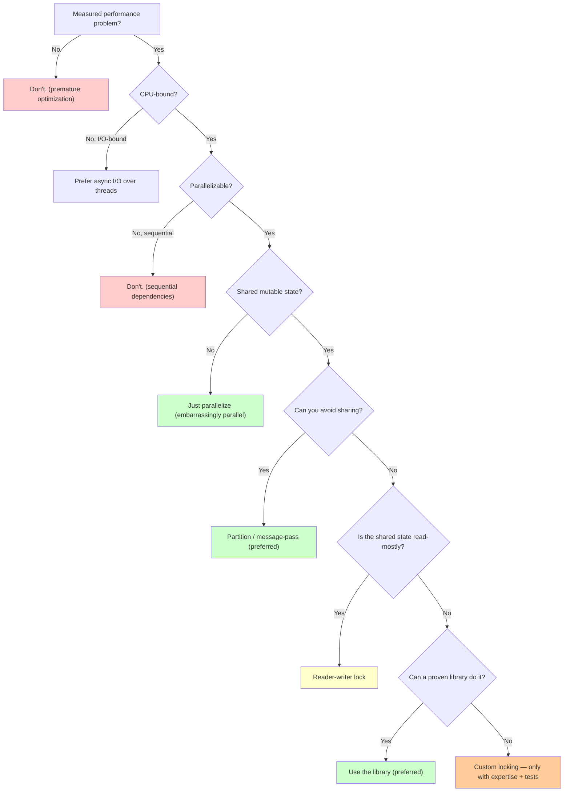

# Chapter 3.5: Concurrency for Data Structures

Every data structure in this book so far has assumed one thread. That assumption is a luxury.
The moment two threads touch the same structure, code that was obviously correct becomes subtly,
intermittently wrong — and the bug only shows up on the customer's 64-core machine, at 3 a.m.,
once every ten million requests.

This chapter is the mental model you need before the "Concurrency Considerations" sections in the
chapters that follow. The single skill it teaches is this: **a concurrent operation is correct
only if *every possible interleaving* of it with other threads preserves the structure's
invariants.** Everything else — locks, atomics, memory ordering, lock-free tricks — exists to make
that true.

We stay in shared-memory territory: multiple threads, one address space, lock-based designs as the
default, lock-free ideas as a preview. Async/await, distributed consensus, and full lock-free
implementations are out of scope. And the honest bottom line up front: for production code, reach
for a well-tested library before you write your own. This chapter teaches you to reason, not to
reinvent `std::shared_mutex`.

## 3.5.1 Why one thread was a luxury

In single-threaded code you reason in program order: each statement finishes before the next one
starts. `counter++` is one thing that happens. Under concurrency that intuition is a lie, because
`counter++` is really three machine steps — read, add, write — and another thread can slip between
them:

```
Thread 1: read(0) → add → 1
Thread 2: read(0) → add → 1     // read the same stale 0
Thread 1: write(1)
Thread 2: write(1)
Result: counter == 1, but two increments happened.   ✗
```

One increment vanished. Nothing is broken in either thread's code; the bug lives in the *gap*
between their steps. The same gap corrupts pointer surgery:

```cpp
void insertAfter(Node* prev, Node* new_node) {
    new_node->next = prev->next;   // step 1
    prev->next = new_node;         // step 2
}
```

Between step 1 and step 2 the list is in a state the invariant forbids: `new_node` points into the
chain, but nothing points at `new_node` yet. A thread traversing the list right then skips it, or
worse, sees a half-linked node. Concurrency doesn't just add parallelism — it adds *interleavings*,
and making incorrect code faster with threads only lets it be wrong in parallel. Correctness first.

## 3.5.2 The model we assume

Three assumptions define the world we have to survive. **Shared memory:** threads share one address
space and can read and write the same variables; writes become visible to others, but only
eventually and only if you synchronize. **Preemptive scheduling:** the OS can suspend any thread
between any two instructions, so you may never assume an execution order. **Weak ordering:** the
compiler and the CPU freely reorder memory operations for speed, and each core caches memory
locally, so the order one thread *writes* is not the order another thread *sees* — unless a
synchronization point forces it.

The discipline that falls out of these three: reason about *all* interleavings. If a single
interleaving can break an invariant, the code is wrong, no matter how rarely that interleaving
occurs in testing.

## 3.5.3 Invariants under interleavings

An **invariant** is a property that must always hold for the structure to be valid: a stack's
`top` points at the most recently pushed element; a list's `size` equals its node count; a bounded
queue holds between 0 and `capacity` items. In single-threaded code an invariant may be violated
*during* an operation as long as it's restored by the end — no one is looking mid-operation.
Concurrency removes that privacy. Preemption exposes every intermediate state to other threads, so
an invariant that is briefly false becomes an invariant another thread can *observe* as false.

**Atomicity** is the fix. An operation is atomic if, to every other thread, it appears to happen all
at once — either not yet started or fully finished, never caught halfway. Make the operations that
touch shared state atomic and the broken intermediate states become unobservable. You get atomicity
three ways, in rough order of how often you should reach for them: locks (let one thread in at a
time), hardware atomics (`std::atomic` for single words), and lock-free algorithms built on
compare-and-swap (powerful, treacherous, covered last).

## 3.5.4 Race conditions

A **data race** is the low-level sin: two threads access the same location, at least one writes, and
nothing synchronizes them. In C++ a data race is undefined behavior — not "you get a stale value,"
but "the standard makes no promises at all." A **logical race** is subtler and survives even after
you've added synchronization: the classic *check-then-act*, where the world changes between the
check and the act.

```cpp
if (!queue.empty()) {      // check — true right now
    int value = queue.pop(); // act — but another thread may have drained it
}
```

Most such bugs are **read-modify-write** hazards. `counter++`, `array[i] += 1`, and
`node->next = node->next->next` all read a value, compute a new one, and write it back, and the read
and the write are separate events another thread can split. The result is a **lost update**: two
threads read the same value, both compute from it, and one write clobbers the other. The cure is to
make the whole read-modify-write indivisible — with an atomic instruction for a single word, or a
lock for anything larger.

## 3.5.5 Atomicity, critical sections, and what locks actually promise

A **critical section** is a region of code that touches shared state and must not run concurrently
with itself. **Mutual exclusion** is the guarantee that only one thread is inside it at a time, and a
mutex is the tool that provides it. In C++ you almost never lock and unlock by hand — an RAII guard
ties the lock's lifetime to a scope, so it's released even if the body throws:

```cpp
std::mutex mtx;
long counter = 0;

void safeIncrement() {
    std::lock_guard<std::mutex> lock(mtx);  // acquire
    ++counter;                              // critical section: one thread only
}                                           // release on scope exit
```

A lock gives you two things. The obvious one is mutual exclusion. The one people forget is
**visibility via happens-before**: every write a thread makes before it unlocks is guaranteed
visible to the next thread that locks the same mutex. That second guarantee is what makes the data
you protected actually *readable* by the next thread, and it's why "just mark it `volatile`" is not
a substitute for a lock.

A lock does *not* make your logic correct. It won't save you from a check-then-act race that spans
two separate lock acquisitions, it won't prevent deadlock, and it can't tell you *which* state needs
protecting — that judgment is yours.

## 3.5.6 Visibility is a separate problem from atomicity

Atomicity is about indivisibility; visibility is about whether a write ever reaches another thread's
eyes. They're independent, and this snippet — correct-looking, and broken — shows why:

```cpp
bool ready = false;
int data = 0;

void producer() {          // Thread 1
    data = 42;
    ready = true;
}

void consumer() {          // Thread 2
    while (!ready) { }
    use(data);             // may read data == 0
}
```

Each individual write here is atomic; both are single-word stores. Yet the consumer can spin out of
the loop and still read `data == 0`, because nothing establishes happens-before between the two
threads. The compiler may reorder the two stores (they look independent), the CPU may commit them
out of order, and the consumer's core may hold a stale cached `data`. "Works on my machine" means
your machine's memory model happened to hide the bug; a weaker-ordered CPU (ARM, POWER) will not.
The fix is any real synchronization — a mutex around both, or making `ready` a
`std::atomic<bool>` with release/acquire ordering (Section 3.5.12).

**A hardware footnote — false sharing.** Cache coherence operates on whole cache lines (typically 64
bytes), not individual variables. If two threads hammer two *different* atomics that happen to sit
in the same line, the coherence protocol bounces that line between cores on every write, and your
"independent" counters run an order of magnitude slower than they should. This is *false sharing*:
no logical conflict, pure hardware contention.

```cpp
struct Counters {                       // a and b likely share one 64-byte line
    std::atomic<long> a;
    std::atomic<long> b;
};
// Fix: pad so each lands on its own line.
struct alignas(64) Padded { std::atomic<long> v; };
```

`std::hardware_destructive_interference_size` names the line size portably. Remember this when you
"optimize" by giving each thread its own counter and see no speedup — they may be sharing a line.

## 3.5.7 Deadlock

A **deadlock** is not a slow program; it's a stopped one. Threads block forever, each holding a
resource the next one needs. It's a correctness bug, not a performance bug — the program has stopped
making progress, and it did so because of a logic error in how locks were ordered, not because it
ran out of speed. Worse, deadlocks depend on rare interleavings, so they sail through testing and
surface in production.

The canonical trigger is two threads locking the same pair in opposite orders:

```cpp
// Thread A: lock(from.mtx) then lock(to.mtx)
// Thread B: lock(to.mtx)   then lock(from.mtx)
// A holds from and waits for to; B holds to and waits for from. Frozen.
```

A deadlock needs **all four** of these conditions at once, which is also the menu of ways to prevent
one — break any single condition and deadlock is impossible:

1. **Mutual exclusion** — the resource can't be shared.
2. **Hold and wait** — a thread holds one resource while waiting for another.
3. **No preemption** — resources are released only voluntarily.
4. **Circular wait** — a cycle of threads each waiting on the next.

In practice you break **circular wait** with a consistent lock order, and this is the strategy to
reach for first. When you lock a fixed pair, `std::lock` acquires both without any order at all — it
uses a deadlock-avoiding algorithm internally:

```cpp
void transfer(Account& from, Account& to, int amount) {
    std::scoped_lock lock(from.mtx, to.mtx);   // both, deadlock-free (C++17)
    from.balance -= amount;
    to.balance += amount;
}
```

When the resources aren't a fixed pair — any two of N accounts — impose a total order and always
lock in it. A stable proxy for identity, like the object's address, works:

```cpp
class Bank {
    struct Account { long balance; std::mutex mtx; };
    std::vector<Account> accounts;
public:
    bool transfer(int fromId, int toId, long amount) {
        if (fromId == toId) return false;
        Account& from = accounts[fromId];
        Account& to   = accounts[toId];

        // Lock both in a consistent global order (by address) so two opposite
        // transfers can't deadlock. scoped_lock would also work; this shows the
        // ordering principle explicitly, for when locks are taken one at a time.
        std::mutex* first  = &from.mtx;
        std::mutex* second = &to.mtx;
        if (second < first) std::swap(first, second);
        std::lock_guard<std::mutex> l1(*first);
        std::lock_guard<std::mutex> l2(*second);

        if (from.balance < amount) return false;
        from.balance -= amount;
        to.balance   += amount;
        return true;
    }
};
```

The other three conditions give you other tools, used less often. Breaking **hold-and-wait** means
grabbing every lock you'll need up front (`std::lock` over all of them) — simple, but it serializes
more than necessary. Breaking **no preemption** means using `try_lock` with a timeout and backoff:
if you can't get the second lock, drop the first and retry, so no thread waits forever. And breaking
**mutual exclusion** entirely means going lock-free (Section 3.5.12) — no locks, no deadlock, but a
steep jump in difficulty.

Two habits prevent most deadlocks regardless of strategy: hold locks for the shortest possible
scope, and never call unknown code (a callback, a virtual method) while holding a lock, because you
don't know what *it* will try to lock.

## 3.5.8 Lock granularity

Once locking is correct, the question is how *much* one lock protects. **Coarse-grained** locking
puts a single mutex around the whole structure:

```cpp
class ThreadSafeList {
    std::list<int> data;
    std::mutex mtx;
public:
    void insert(int v) {
        std::lock_guard<std::mutex> lock(mtx);
        data.push_back(v);
    }
};
```

It's trivially correct and trivially serial: every operation waits for every other, and under load
throughput flatlines no matter how many cores you add. **Fine-grained** locking splits the structure
so independent parts have independent locks — one lock per hash bucket, say, so operations on
different buckets proceed in parallel:

```cpp
class FineGrainedHashTable {
    std::vector<Bucket> buckets;
    std::vector<std::mutex> bucket_locks;   // one lock per bucket
public:
    void insert(int key, int value) {
        size_t b = hash(key) % buckets.size();
        std::lock_guard<std::mutex> lock(bucket_locks[b]);
        buckets[b].insert(key, value);
    }
};
```

You buy scalability and pay for it in complexity: more memory for the locks, a real risk of deadlock
once an operation needs two of them, and structure-wide operations like resizing that suddenly have
to coordinate every lock at once. The guidance is unglamorous and correct: start coarse, measure,
and refine to fine-grained only where a profiler shows contention. Fine-grained locking you didn't
need is just deadlock risk you didn't need.

## 3.5.9 Worked example: the bounded producer-consumer queue

The producer-consumer queue is where these ideas meet: producers push items, consumers pop them, a
bounded buffer sits between them, and the invariants are `0 ≤ size ≤ capacity`, FIFO order,
producers block when full, consumers block when empty. The naive version is a textbook
check-then-act race — `if (size < capacity) push()` lets two producers both pass the check and
overflow. The correct version pairs a mutex with two **condition variables**, one for each waiting
condition:

```cpp
#include <queue>
#include <mutex>
#include <condition_variable>

class BoundedQueue {
    std::queue<int> buffer;
    size_t capacity;
    std::mutex mtx;
    std::condition_variable not_full;   // producers wait here
    std::condition_variable not_empty;  // consumers wait here
public:
    explicit BoundedQueue(size_t cap) : capacity(cap) {}

    void produce(int item) {
        std::unique_lock<std::mutex> lock(mtx);
        not_full.wait(lock, [this] { return buffer.size() < capacity; });
        buffer.push(item);
        not_empty.notify_one();
    }

    int consume() {
        std::unique_lock<std::mutex> lock(mtx);
        not_empty.wait(lock, [this] { return !buffer.empty(); });
        int item = buffer.front();
        buffer.pop();
        not_full.notify_one();
        return item;
    }
};
```

`wait(lock, predicate)` atomically releases the lock and sleeps, then reacquires the lock and
rechecks the predicate on wakeup. Three details make this correct, and each maps to a classic bug:

- **Always wait on a predicate, never a bare `wait(lock)`.** Condition variables suffer *spurious
  wakeups* — a thread can wake with no notification and the condition still false. The predicate
  form loops until the condition truly holds; the bare form trusts a wakeup it shouldn't.
- **The predicate is why check-then-act is safe here.** The check and the act both happen under the
  same held lock, with no gap for another thread to invalidate the check.
- **Condition variables replace busy-waiting.** A `while (full) {}` spin burns a core doing nothing;
  `wait` sleeps until there's actually a reason to run.

To shut such a queue down cleanly, add an atomic `stop` flag, make each predicate also return true
when `stop` is set, and `notify_all()` after setting it so every blocked thread wakes, sees the
flag, and exits instead of sleeping forever. That same pattern — a queue of `std::function<void()>`
guarded this way — is the beating heart of a thread pool, and it reappears in task schedulers,
logging pipelines, and network servers that hand accepted connections from an accept loop to a pool
of workers.

## 3.5.10 When to reach for concurrency at all

Concurrency is a cost you pay in complexity, debuggability, and whole categories of bug that don't
exist in serial code. Pay it deliberately. The decision tree below front-loads the cheap wins —
don't parallelize without a measured problem; prefer async I/O for I/O-bound work; prefer *not
sharing* state over sharing it carefully — and only lands on custom synchronization when nothing
simpler fits.



The two rules that matter most: **default to single-threaded** until a measurement says otherwise,
and when you do go parallel, **prefer designs that don't share mutable state at all** — partition
the data, or pass messages — over designs that share it and lock carefully. A slow correct program
beats a fast broken one every time, and most concurrency bugs are self-inflicted by sharing that
didn't need to happen.

## 3.5.11 Reader-writer locks

When reads vastly outnumber writes, a plain mutex wastes parallelism: it serializes readers who
would never have conflicted with each other. A **reader-writer lock** lets any number of readers
proceed together while giving writers exclusive access — many readers *or* one writer, never both.

Here is a correct implementation on a mutex and two condition variables. Read it as a teaching model;
in production you'd use `std::shared_mutex`, which does exactly this and is tuned and tested.

```cpp
#include <mutex>
#include <condition_variable>

class ReaderWriterLock {
    std::mutex mtx;
    std::condition_variable r_cv, w_cv;
    unsigned readers = 0;    // active readers
    unsigned writers = 0;    // writers active OR waiting
    bool writer_active = false;
public:
    void readLock() {
        std::unique_lock<std::mutex> lock(mtx);
        r_cv.wait(lock, [this] { return writers == 0; });  // yield to writers
        ++readers;
    }
    void readUnlock() {
        std::unique_lock<std::mutex> lock(mtx);
        if (--readers == 0) w_cv.notify_one();   // last reader lets a writer in
    }
    void writeLock() {
        std::unique_lock<std::mutex> lock(mtx);
        ++writers;
        w_cv.wait(lock, [this] { return !writer_active && readers == 0; });
        writer_active = true;
    }
    void writeUnlock() {
        std::unique_lock<std::mutex> lock(mtx);
        writer_active = false;
        --writers;
        if (writers > 0) w_cv.notify_one();  // hand off to the next writer
        else             r_cv.notify_all();  // otherwise release the readers
    }
};
```

The invariants are exactly the concurrency guarantee restated: `writer_active` implies
`readers == 0` (never a reader and a writer together), and at most one thread ever has
`writer_active` set. A writer never sees a partially updated structure, and a reader never sees a
write in progress.

The policy choice hiding in this code is *who wins when both a reader and a writer are waiting.*
This implementation is **writer-preferring**: `readLock` waits while `writers != 0`, and `writeLock`
increments `writers` *before* it starts waiting, so once a writer is queued, new readers block behind
it. That guarantees writers make progress but can starve readers under a heavy write stream. The
opposite policy — letting new readers join an already-active read even while a writer waits — is
**reader-preferring**, and it starves *writers* instead: a steady trickle of readers means the
writer never finds `readers == 0`. There's no free lunch; `std::shared_mutex` picks a policy for you,
which is one more reason to prefer it.

Reach for a reader-writer lock only when reads genuinely dominate *and* the read critical section is
long enough to be worth sharing. If writes are frequent or reads are a few instructions, the
bookkeeping costs more than a plain mutex would.

## 3.5.12 A preview of lock-free

Everything so far has used locks. **Lock-free** algorithms drop them, building operations directly on
atomic hardware instructions so that no thread can block another by holding a lock. The foundation is
**compare-and-swap** (CAS): atomically, "if this location still holds the value I expect, replace it;
otherwise tell me it changed."

```cpp
std::atomic<int> value{0};
// compare_exchange_weak(expected, desired):
//   if value == expected: value = desired, return true
//   else:                 expected = value (the current value), return false
```

CAS turns a read-modify-write into a retry loop: read the current value, compute the new one, and CAS
it in; if someone else got there first, the CAS fails and you loop with the fresh value. A lock-free
stack is the canonical example — push a node by pointing it at the current head, then CAS the head to
the new node:

```cpp
#include <atomic>

template<typename T>
class LockFreeStack {
    struct Node { T data; Node* next; };
    std::atomic<Node*> head{nullptr};
public:
    void push(const T& item) {
        Node* n = new Node{item, head.load()};
        while (!head.compare_exchange_weak(n->next, n)) {
            // CAS refreshed n->next to the current head; retry
        }
    }
    bool pop(T& out) {
        Node* old = head.load();
        while (old && !head.compare_exchange_weak(old, old->next)) {
            // old refreshed to current head; retry
        }
        if (!old) return false;
        out = old->data;
        delete old;         // UNSAFE in general — see below
        return true;
    }
};
```

That `delete` is where lock-free stops being easy. Two problems bite immediately. The **ABA problem**:
between your `head.load()` and your CAS, another thread pops A, pops B, and pushes A back. The head is
`A` again, so your CAS *succeeds* — but the list underneath it has completely changed, and you've
corrupted it. CAS compares the value, and the value came back the same; it cannot see the history. The
second problem is **memory reclamation**: another thread may still be dereferencing the node you just
`delete`d. Real lock-free structures solve these with tagged pointers, hazard pointers, or epoch-based
reclamation — each a small research project.

The one lock-free pattern you can and should use freely is the atomic counter, where there's no
pointer to reclaim and no ABA:

```cpp
std::atomic<long> count{0};
count.fetch_add(1, std::memory_order_relaxed);   // atomic, wait-free, cheap
```

Progress guarantees classify these algorithms. **Wait-free** is strongest: every thread finishes in a
bounded number of steps (the atomic counter qualifies). **Lock-free** guarantees *some* thread always
makes progress, even if individuals retry (the stack qualifies). **Obstruction-free** guarantees
progress only when a thread runs uncontended. Plain locking guarantees none of these — a stalled
lock-holder stalls everyone.

Lock-free code also forces you to reason about **memory ordering** explicitly, because there's no lock
to establish happens-before for you. The release/acquire pair is the workhorse:

```cpp
std::atomic<int> data{0};
std::atomic<bool> ready{false};

void producer() {
    data.store(42, std::memory_order_relaxed);
    ready.store(true, std::memory_order_release);  // publishes all prior writes
}
void consumer() {
    while (!ready.load(std::memory_order_acquire)) { }  // sees them once ready is true
    int v = data.load(std::memory_order_relaxed);       // guaranteed to read 42
}
```

The orderings, weakest to strongest: `relaxed` (atomicity only, no ordering — fine for a standalone
counter), `acquire`/`release` (a load-release pairs with an acquire-load to establish happens-before,
as above), `acq_rel` (both, for read-modify-write), and `seq_cst` (a single global order, the safe
default and the one to use until profiling proves you need weaker).

> **Do not ship a hand-rolled lock-free data structure.** Getting one correct demands mastery of the
> memory model, the ABA problem, and a memory-reclamation scheme, plus testing that can catch bugs
> that appear once per billion runs. Use a proven library — Intel TBB, Folly, Boost.Lockfree — and
> hand-roll only with a measured need and deep expertise. This section is here so you can *reason*
> about lock-free code and use those libraries correctly, not so you can write your own.

## 3.5.13 Where this leaves us

The through-line of this chapter is a single question you now know to ask of any concurrent
operation: *which invariant does it touch, and can any interleaving catch that invariant broken?*
Answer it and the tools fall into place — a lock when you need mutual exclusion and visibility, an
atomic when a single word will do, a condition variable when a thread must wait for a state, a
reader-writer lock when reads dominate, and a library's lock-free structure when contention is
measured and severe.

Two commitments carry the most weight. **Correctness before performance:** a slow correct structure
beats a fast racy one, always. And **prefer proven libraries:** `std::mutex`, `std::shared_mutex`,
`std::atomic`, and battle-tested concurrent containers exist so that you can spend your cleverness on
your problem, not on rediscovering the ABA bug. Even then, the reasoning in this chapter is what lets
you use them correctly, debug them when they misbehave, and understand why they cost what they cost.

From here the book returns to specific structures, each with a "Concurrency Considerations" section
that names its invariants, marks the operations that must be atomic, and weighs the locking
strategies — always in these terms. That reasoning rests on how these structures actually behave on
the hardware, which is exactly where we go next:
[Chapter 3.6, the memory hierarchy and performance](03.6-memory-hierarchy-and-performance.md).
