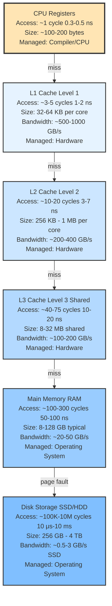
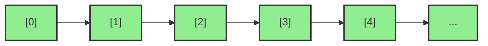
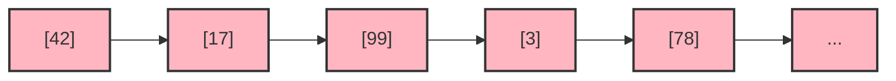
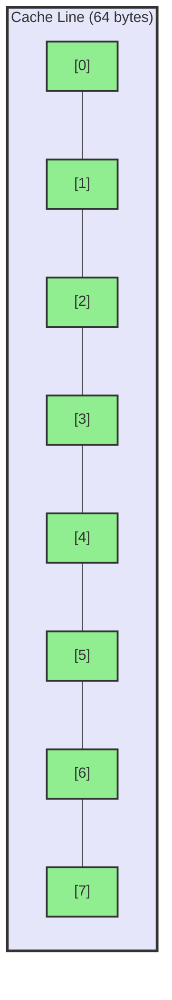
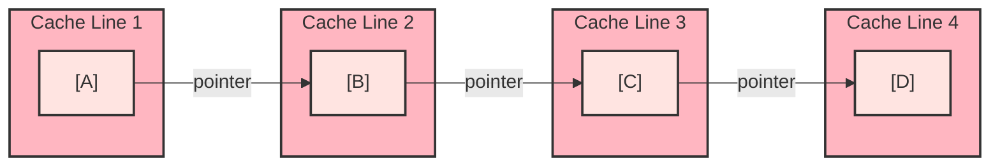
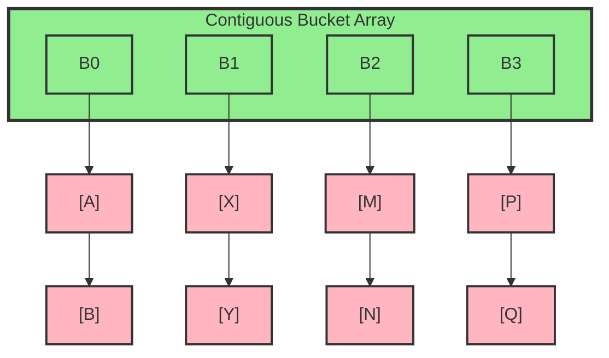
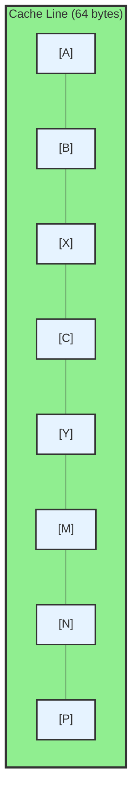

# Chapter 3.6: Memory Hierarchy and Performance

## 3.6.1 Introduction

Understanding how modern computer systems manage memory is crucial for writing high-performance code. This chapter explores the memory hierarchy, cache behavior, CPU cycles, and how these concepts affect data structure performance. This knowledge is essential for making informed decisions about data structure design and optimization.

**Scope of This Chapter:**
- Memory hierarchy (registers, caches, RAM, disk)
- Cache behavior (hits, misses, cache lines)
- CPU cycles and performance measurement
- Sequential vs. random memory access
- False sharing and cache coherency
- Practical optimization strategies

**Out of Scope:**
- Virtual memory management details
- Operating system internals
- Hardware-specific optimizations
- Distributed systems memory models

## 3.6.2 The Memory Hierarchy

Modern computer systems have multiple levels of memory, each with different characteristics. Understanding this hierarchy is fundamental to understanding performance. The memory hierarchy exists because of a fundamental trade-off in computer hardware: **speed vs. capacity vs. cost**.

### Why the Memory Hierarchy Exists

**The Fundamental Problem:**
- Fast memory is expensive and power-hungry
- Large memory is slow and cheaper
- We need both speed AND capacity, but can't have both in a single technology

**The Solution:**
- Use a **hierarchy** of memory technologies
- Small, fast, expensive memory near the CPU (registers, caches)
- Large, slow, cheap memory further away (RAM, disk)
- Keep frequently accessed data in fast memory
- Move less frequently accessed data to slower memory

**The Principle of Locality:**
The memory hierarchy works because of two types of locality:
1. **Temporal Locality**: Recently accessed data is likely to be accessed again soon
2. **Spatial Locality**: Data near recently accessed data is likely to be accessed soon

These principles allow the system to predict what data will be needed and keep it in fast memory.

### The Memory Pyramid



### Understanding Each Level

#### CPU Registers

**What They Are:**
- The fastest memory in the system, physically located inside the CPU
- Directly accessible by CPU instructions
- Limited in number (typically 16-32 general-purpose registers)

**Characteristics:**
- **Access Time**: ~1 CPU cycle (0.3-0.5 ns) - essentially instant
- **Size**: ~100-200 bytes total (8-16 registers × 8-16 bytes each)
- **Technology**: Flip-flops (fastest, most expensive)
- **Managed By**: Compiler and CPU instruction set

**Why So Fast:**
- No addressing needed - registers are directly named in instructions
- No memory bus - data is already in the CPU
- Synchronous with CPU clock - no wait states

**Limitations:**
- Extremely limited capacity
- Must be explicitly managed by compiler/assembly
- Cannot store large data structures

#### L1 Cache (Level 1)

**What It Is:**
- First level of cache, closest to CPU after registers
- Split into L1 Instruction Cache (L1I) and L1 Data Cache (L1D)
- Typically per-core (each CPU core has its own L1 cache)

**Characteristics:**
- **Access Time**: ~3-5 CPU cycles (1-2 ns)
- **Size**: 32-64 KB per core (16-32 KB instruction + 16-32 KB data)
- **Bandwidth**: ~500-1000 GB/s (extremely high)
- **Technology**: SRAM (Static Random Access Memory)
- **Managed By**: Hardware automatically (transparent to software)

**Why It Exists:**
- Registers are too small for program data
- RAM is too slow for CPU operations
- L1 cache bridges this gap with very fast access

**How It Works:**
- Stores recently accessed data and instructions
- Automatically loads nearby data (spatial locality)
- Hardware automatically manages what stays in cache

#### L2 Cache (Level 2)

**What It Is:**
- Second level of cache, larger but slightly slower than L1
- Typically per-core (each CPU core has its own L2 cache)
- Acts as backup when L1 cache misses

**Characteristics:**
- **Access Time**: ~10-20 CPU cycles (3-7 ns)
- **Size**: 256 KB - 1 MB per core
- **Bandwidth**: ~200-400 GB/s
- **Technology**: SRAM (larger, slightly slower than L1)
- **Managed By**: Hardware automatically

**Why It Exists:**
- L1 cache is too small for many workloads
- L2 provides larger capacity while still being fast
- Reduces pressure on L3 cache and RAM

**Trade-offs:**
- Larger than L1 (can hold more data)
- Slower than L1 (further from CPU, larger size)
- Still much faster than RAM

#### L3 Cache (Level 3, Shared)

**What It Is:**
- Third level of cache, shared across all CPU cores
- Largest cache level before main memory
- Acts as shared buffer for multi-core systems

**Characteristics:**
- **Access Time**: ~40-75 CPU cycles (10-20 ns)
- **Size**: 8-32 MB (shared across all cores)
- **Bandwidth**: ~100-200 GB/s
- **Technology**: SRAM (largest cache, slower than L1/L2)
- **Managed By**: Hardware automatically

**Why It Exists:**
- Provides large shared cache for multi-core systems
- Reduces memory traffic to RAM
- Enables efficient data sharing between cores

**Multi-Core Implications:**
- Shared cache means cores can share data efficiently
- Cache coherency protocols ensure consistency
- Contention can occur when multiple cores access same data

#### Main Memory (RAM)

**What It Is:**
- Primary system memory, where programs and data reside
- Volatile (loses data when power is off)
- Much larger than cache, but much slower

**Characteristics:**
- **Access Time**: ~100-300 CPU cycles (50-100 ns)
- **Size**: 8-128 GB typical (can be much larger)
- **Bandwidth**: ~20-50 GB/s (shared across all cores)
- **Technology**: DRAM (Dynamic Random Access Memory)
- **Managed By**: Operating System (virtual memory management)

**Why It's Slower:**
- Must refresh data periodically (DRAM characteristic)
- Memory controller overhead
- Physical distance from CPU
- Shared bus for all cores

**Virtual Memory:**
- OS maps virtual addresses to physical RAM
- Allows programs to use more memory than physically available
- Uses disk as backup (page file/swap)

#### Disk Storage (SSD/HDD)

**What It Is:**
- Persistent storage for programs and data
- Non-volatile (retains data when power is off)
- Extremely large capacity, but very slow

**Characteristics:**
- **Access Time**: 
  - SSD: ~100,000 cycles (10-100 μs)
  - HDD: ~10,000,000 cycles (5-10 ms)
- **Size**: 256 GB - 4 TB typical (can be much larger)
- **Bandwidth**: 
  - SSD: ~0.5-3 GB/s
  - HDD: ~0.1 GB/s
- **Technology**: NAND flash (SSD) or magnetic platters (HDD)
- **Managed By**: Operating System (file system, page file)

**Why It's So Slow:**
- Mechanical components (HDD) or flash cell programming (SSD)
- Must transfer data through multiple layers (disk → controller → bus → RAM)
- Designed for capacity, not speed

**When Data Goes to Disk:**
- Page faults: When virtual memory pages aren't in RAM
- File I/O: Reading/writing files
- Swap: When RAM is full, OS moves pages to disk

### Key Characteristics

**Speed vs. Size Trade-off:**
- Each level is 10-100x slower than the previous level
- Each level is 10-100x larger than the previous level
- **Goal**: Keep frequently accessed data in faster levels

**Latency Progression:**
```
Registers:  1 cycle     (0.3 ns)   ← Fastest
L1 Cache:   3-5 cycles  (1-2 ns)   ← 3-5x slower
L2 Cache:   10-20 cycles (3-7 ns)  ← 10-20x slower
L3 Cache:   40-75 cycles (10-20 ns) ← 40-75x slower
RAM:        100-300 cycles (50-100 ns) ← 100-300x slower
SSD:        100,000 cycles (10-100 μs) ← 100,000x slower
HDD:        10,000,000 cycles (5-10 ms) ← 10,000,000x slower
```

**Size Progression:**
```
Registers:  ~200 bytes
L1 Cache:   ~64 KB      ← 320x larger
L2 Cache:   ~512 KB     ← 8x larger
L3 Cache:   ~16 MB      ← 32x larger
RAM:        ~16-64 GB   ← 1000x larger
Disk:       ~512 GB-2 TB ← 10-100x larger
```

**Typical Modern System (2024):**
- **Registers**: ~200 bytes, ~0.3 ns access
- **L1 Cache**: ~64 KB, ~1 ns access
- **L2 Cache**: ~512 KB, ~3 ns access
- **L3 Cache**: ~16 MB, ~12 ns access
- **RAM**: ~16-64 GB, ~60 ns access
- **SSD**: ~512 GB - 2 TB, ~10-100 μs access

### How the Hierarchy Works Together

**Cache Hierarchy Flow:**
1. CPU requests data from register
2. If not in register, check L1 cache
3. If not in L1, check L2 cache
4. If not in L2, check L3 cache
5. If not in L3, access RAM
6. If not in RAM, trigger page fault and load from disk

**Automatic Management:**
- Hardware automatically moves data between cache levels
- Recently accessed data stays in faster caches
- Less recently accessed data is evicted to slower levels
- Software doesn't need to manage this (mostly transparent)

**Performance Impact:**
- **Cache Hit**: Data found in cache → fast access (5-20 cycles)
- **Cache Miss**: Data not in cache → slow access (100-300 cycles)
- **Goal**: Maximize cache hits, minimize cache misses

### Real-World Implications

**For Data Structure Design:**
- **Small structures** (< 1 MB): Likely to fit in L3 cache → excellent performance
- **Medium structures** (1-32 MB): May fit in RAM but not cache → good performance
- **Large structures** (> 32 MB): May cause page faults → degraded performance

**For Algorithm Design:**
- **Sequential access**: Exploits spatial locality → excellent cache behavior
- **Random access**: Breaks spatial locality → poor cache behavior
- **Working set size**: Keep it smaller than cache size when possible

**For Performance Optimization:**
- **Cache-aware algorithms**: Design algorithms that work well with cache
- **Data layout**: Organize data for cache-friendly access patterns
- **Blocking/Tiling**: Process data in cache-sized chunks

## 3.6.3 Cache Lines and Cache Behavior

### Cache Lines

**Cache Line**: The smallest unit of data that can be transferred between cache levels. On modern x86-64 systems, this is typically **64 bytes**.

**Why 64 bytes?**
- Balance between transfer efficiency and cache capacity
- Most data structures benefit from spatial locality (nearby data is accessed together)
- Aligns with common data structure sizes (8-byte pointers, 16-byte structs, etc.)

### Cache Hits and Misses

**Cache Hit**: When requested data is found in cache. This is fast:
- **L1 hit**: ~1-2 ns (3-5 cycles)
- **L2 hit**: ~3-7 ns (10-20 cycles)
- **L3 hit**: ~10-20 ns (40-75 cycles)

**Cache Miss**: When requested data is not in cache. This triggers a fetch from the next level:
- **L1 miss → L2**: ~10-20 cycles
- **L2 miss → L3**: ~40-75 cycles
- **L3 miss → RAM**: ~100-300 cycles (cache miss penalty)
- **RAM miss → Disk**: ~10,000-10,000,000 cycles (page fault)

**Performance Impact:**
- Cache hit: ~5-20 cycles
- Cache miss: ~100-300 cycles
- **A single cache miss can be 10-30x slower than a cache hit!**

### Types of Cache Misses

1. **Compulsory Miss (Cold Miss)**:
   - First access to a memory location
   - Unavoidable - data must be loaded into cache
   - Example: First access to a newly allocated array

2. **Capacity Miss**:
   - Cache is too small to hold all needed data
   - Working set exceeds cache capacity
   - Example: Iterating over a 100 MB array when L3 cache is 16 MB

3. **Conflict Miss**:
   - Multiple memory locations map to the same cache line
   - Cache associativity limits (direct-mapped or low-associativity caches)
   - Example: Accessing array indices that collide in cache

4. **Coherence Miss**:
   - Cache line invalidated by another CPU core (multi-threaded)
   - Part of cache coherency protocol
   - Example: Two threads modifying data on the same cache line

## 3.6.4 Sequential vs. Random Memory Access

### Sequential Access (Cache-Friendly)

**Pattern**: Accessing memory locations in order



**Characteristics:**
- **Prefetching**: CPU predicts next access and loads cache lines ahead
- **Cache efficiency**: ~90-95% hit rate
- **Bandwidth**: Can saturate memory bandwidth (~20-50 GB/s)
- **Performance**: ~5-10 cycles per element

**Example**: Iterating through an array
```cpp
int sum = 0;
for (int i = 0; i < n; i++) {
    sum += array[i];  // Sequential access, excellent cache behavior
}
```

### Random Access (Cache-Unfriendly)

**Pattern**: Accessing memory locations in unpredictable order



**Characteristics:**
- **No prefetching**: CPU cannot predict next access
- **Cache efficiency**: ~50-70% hit rate (depends on working set size)
- **Bandwidth**: Limited by cache miss latency (~5-10 GB/s effective)
- **Performance**: ~50-200 cycles per element

**Example**: Following pointers in a linked list
```cpp
Node* current = head;
while (current != nullptr) {
    process(current->data);  // Random access, poor cache behavior
    current = current->next;  // Pointer chase = cache miss likely
}
```

### Performance Comparison

| Access Pattern | Cache Hit Rate | Cycles per Access | Effective Bandwidth |
|----------------|----------------|-------------------|---------------------|
| Sequential     | 90-95%         | 5-10              | 20-50 GB/s          |
| Random         | 50-70%         | 50-200            | 5-10 GB/s           |

**Key Insight**: Sequential access can be 10-40x faster than random access due to cache behavior!

## 3.6.5 CPU Cycles and Performance Measurement

### What is a CPU Cycle?

A **CPU cycle** (also called a clock cycle or tick) is the fundamental unit of time in a computer processor. It represents one complete oscillation of the CPU's clock signal, which synchronizes all operations within the processor.

**Basic Definition:**
- **1 CPU cycle** = 1 complete clock tick
- The CPU clock generates a periodic signal (like a metronome)
- All CPU operations are synchronized to this clock
- Each instruction takes a certain number of cycles to execute

**Clock Frequency:**
- **Clock Speed**: Measured in Hertz (Hz) - cycles per second
- **Modern CPUs**: Typically 3-4 GHz (gigahertz)
  - 3 GHz = 3,000,000,000 cycles per second
  - 4 GHz = 4,000,000,000 cycles per second
- **Cycle Time**: The inverse of clock frequency
  - 3 GHz CPU: 1 cycle = 1/3,000,000,000 seconds = ~0.33 ns
  - 4 GHz CPU: 1 cycle = 1/4,000,000,000 seconds = ~0.25 ns

**Why Cycles Matter:**
- CPU operations are measured in cycles, not seconds
- Different operations take different numbers of cycles
- Cache hits: Few cycles (fast)
- Cache misses: Many cycles (slow)
- Understanding cycles helps predict performance

**Example:**
```
CPU running at 3 GHz:
- 1 cycle = 0.33 nanoseconds
- 100 cycles = 33 nanoseconds
- 1,000 cycles = 0.33 microseconds
- 1,000,000 cycles = 0.33 milliseconds
```

### Understanding CPU Cycles

**Modern CPU**: ~3-4 GHz = 3-4 billion cycles per second
- 1 cycle = ~0.25-0.33 ns
- Cache miss to RAM: ~100-300 cycles = ~25-100 ns
- This is why cache misses are so expensive!

**Cycle-Based Performance:**
- **Fast operations** (cache hit): 1-20 cycles
- **Medium operations** (L2/L3 cache): 10-75 cycles
- **Slow operations** (RAM access): 100-300 cycles
- **Very slow operations** (disk access): 100,000-10,000,000 cycles

**Why We Use Cycles Instead of Time:**
1. **Hardware Independence**: Cycles are consistent across different CPU models
2. **Precision**: More accurate than nanoseconds for measuring operations
3. **Scalability**: Works for both fast and slow operations
4. **Predictability**: Helps estimate performance on different hardware

### Operation Breakdown Example

**Array Access (Cache Hit)**:
```
1. Compute index:        ~5 cycles (L1 cache for index)
2. Calculate address:   ~5 cycles
3. Load from cache:      ~3-5 cycles (L1 cache hit)
4. Use value:           ~1-3 cycles
─────────────────────────────────────
Total:                  ~14-18 cycles ≈ 4-6 ns
```

**Linked List Traversal (Cache Miss)**:
```
1. Load pointer:         ~3-5 cycles (L1 cache hit)
2. Follow pointer:       ~100-300 cycles (L3/RAM miss!)
3. Load node data:        ~3-5 cycles (if now in cache)
4. Process data:         ~5-10 cycles
─────────────────────────────────────
Total:                   ~111-320 cycles ≈ 30-80 ns
```

**Key Insight**: A single cache miss can cost 100-300 cycles, making it 10-30x slower than a cache hit!

## 3.6.6 Memory Layout and Data Structures

### Contiguous Memory (Arrays, Vectors)

**Layout**:



**Characteristics:**
- **Cache-friendly**: Sequential access, 90-95% hit rate
- **Prefetching**: CPU can predict and load ahead
- **Bandwidth**: Can saturate memory bandwidth
- **Performance**: ~5-10 cycles per element

### Non-Contiguous Memory (Linked Lists)

**Layout**:



**Characteristics:**
- **Cache-unfriendly**: Random access, 50-70% hit rate
- **No prefetching**: CPU cannot predict next node
- **Pointer chasing**: Each node access may cause cache miss
- **Performance**: ~50-200 cycles per element

### Hash Tables: Chaining vs. Open Addressing

**Separate Chaining**:



- Bucket array: Cache-friendly (contiguous)
- Chain nodes: Cache-unfriendly (pointer chasing)
- **Performance**: ~50-200 cycles per operation

**Open Addressing (Linear Probing)**:



- All data: Contiguous array
- Probing: Sequential access (if good distribution)
- **Performance**: ~5-20 cycles per operation

## 3.6.7 False Sharing and Cache Coherency

### False Sharing

**False Sharing**: When multiple CPU cores modify different variables that happen to be on the same cache line (64 bytes). This causes cache line invalidation and performance degradation.

**Example**:
```cpp
// Two variables on same cache line (bad!)
struct CounterPair {
    int counter1;  // 4 bytes
    int padding[15];  // 60 bytes padding
    int counter2;  // 4 bytes
};  // Total: 68 bytes, but counter1 and counter2 may share cache line
```

**What Happens**:
1. Thread 1 modifies `counter1` → invalidates cache line
2. Thread 2's cache line becomes invalid → must refetch from L3/RAM
3. **Performance penalty**: ~100-300 cycles per false sharing event

**Solution**: Align structures to cache line boundaries
```cpp
alignas(64) int counter1;  // 64-byte alignment
alignas(64) int counter2;  // Separate cache lines
```

### Cache Coherency

**Cache Coherency Protocol**: Ensures all CPU cores see consistent memory values. When one core modifies a cache line, other cores' copies are invalidated.

**MESI Protocol States**:
- **Modified (M)**: Cache line is dirty (modified), only this core has it
- **Exclusive (E)**: Cache line is clean, only this core has it
- **Shared (S)**: Cache line is clean, multiple cores may have it
- **Invalid (I)**: Cache line is invalid, must be fetched

**Performance Impact**:
- Cache line invalidation: ~100-300 cycles
- Frequent invalidations: Severe performance degradation
- **Solution**: Minimize shared writes, use thread-local data when possible

## 3.6.8 Practical Optimization Strategies

### 1. Prefer Contiguous Memory

**Bad**: Linked list for sequential access
```cpp
// Poor cache behavior
for (Node* n = head; n != nullptr; n = n->next) {
    process(n->data);  // Random access, cache misses
}
```

**Good**: Array/vector for sequential access
```cpp
// Excellent cache behavior
for (int i = 0; i < vec.size(); i++) {
    process(vec[i]);  // Sequential access, cache hits
}
```

### 2. Structure of Arrays (SoA) vs. Array of Structures (AoS)

**Array of Structures (AoS)** - Cache-unfriendly for certain access patterns:
```cpp
struct Point {
    float x, y, z;  // 12 bytes
    int id;         // 4 bytes
};  // Total: 16 bytes

Point points[1000];  // All fields interleaved

// Accessing only x coordinates:
for (int i = 0; i < 1000; i++) {
    process(points[i].x);  // Loads x, y, z, id (wastes cache)
}
```

**Structure of Arrays (SoA)** - Cache-friendly for field-specific access:
```cpp
struct Points {
    float x[1000];
    float y[1000];
    float z[1000];
    int id[1000];
};

// Accessing only x coordinates:
for (int i = 0; i < 1000; i++) {
    process(x[i]);  // Only loads x values (efficient)
}
```

### 3. Cache Line Alignment

**Prevent False Sharing**:
```cpp
// Bad: False sharing likely
struct Counters {
    int count1;
    int count2;
};

// Good: Separate cache lines
struct Counters {
    alignas(64) int count1;  // 64-byte alignment
    alignas(64) int count2;  // Separate cache line
};
```

### 4. Blocking (Tiling) for Large Data

**Problem**: Large arrays don't fit in cache
```cpp
// Poor: Entire row doesn't fit in cache
for (int i = 0; i < N; i++) {
    for (int j = 0; j < M; j++) {
        process(matrix[i][j]);  // Cache misses when M is large
    }
}
```

**Solution**: Process in cache-sized blocks
```cpp
const int BLOCK_SIZE = 64;  // Fit in L1 cache
for (int ii = 0; ii < N; ii += BLOCK_SIZE) {
    for (int jj = 0; jj < M; jj += BLOCK_SIZE) {
        for (int i = ii; i < min(ii + BLOCK_SIZE, N); i++) {
            for (int j = jj; j < min(jj + BLOCK_SIZE, M); j++) {
                process(matrix[i][j]);  // Better cache reuse
            }
        }
    }
}
```

### 5. Prefetching Hints

**Manual Prefetching** (use sparingly):
```cpp
#include <xmmintrin.h>  // For _mm_prefetch

for (int i = 0; i < n; i++) {
    // Prefetch data for next iteration
    if (i + 1 < n) {
        _mm_prefetch(&data[i + 1], _MM_HINT_T0);  // Prefetch to L1
    }
    process(data[i]);
}
```

**Note**: Modern CPUs have excellent automatic prefetchers. Manual prefetching is rarely needed and can hurt performance if misused.

## 3.6.9 Real-World Performance Examples

### Small Data Structures (< 1 MB)

**Fits in L3 cache**:
- Arrays: Excellent performance (~5-10 cycles/access)
- Linked lists: Moderate performance (~50-100 cycles/access)
- Hash tables (open addressing): Excellent (~5-20 cycles/op)
- Hash tables (chaining): Moderate (~50-200 cycles/op)

### Medium Data Structures (1-32 MB)

**Fits in RAM, not cache**:
- Arrays: Good performance (~20-50 cycles/access)
- Linked lists: Poor performance (~200-500 cycles/access)
- Hash tables (open addressing): Good (~20-100 cycles/op)
- Hash tables (chaining): Poor (~200-500 cycles/op)

### Large Data Structures (> 32 MB)

**May cause page faults**:
- Both methods: Degraded performance
- Consider: Sharding, distributed structures, or disk-based structures
- Page faults: ~10,000-10,000,000 cycles (disaster!)

## 3.6.10 Key Takeaways

1. **Memory hierarchy matters**: Each level is 10-100x slower but 10-100x larger
2. **Cache hits are fast**: ~5-20 cycles vs. ~100-300 cycles for misses
3. **Sequential access is king**: 10-40x faster than random access
4. **Contiguous memory is cache-friendly**: Arrays beat linked lists for sequential access
5. **False sharing hurts**: Align shared data to cache line boundaries
6. **Size matters**: Keep working sets smaller than cache size when possible
7. **Measure, don't guess**: Profile your code to find actual bottlenecks

## 3.6.11 Summary

Understanding memory hierarchy and cache behavior is essential for writing high-performance code. The difference between cache hits and misses can be 10-30x, and sequential vs. random access can be 10-40x. By designing data structures with cache behavior in mind, you can achieve significant performance improvements.

**Next Steps:**
- Apply these concepts when choosing between data structures (see Chapter 3, 4, 10)
- Consider cache behavior in algorithm design (see Chapter 9, 11, 12)
- Use profiling tools to measure actual performance
- Reference this chapter when optimizing code

**Related Chapters:**
- Chapter 3: Arrays (contiguous memory, excellent cache behavior)
- Chapter 4: Linked Lists (non-contiguous, poor cache behavior)
- Chapter 10: Hash Tables (chaining vs. open addressing cache implications)
- Chapter 11: Graphs (adjacency matrix vs. adjacency list cache behavior)

