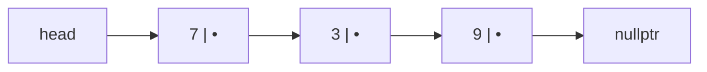
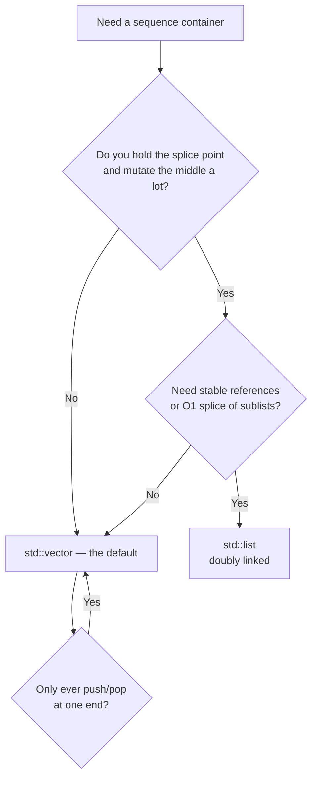

# Chapter 4: Linked Lists

The [array](03-basic-data-structures.md) has one structural weakness: inserting or deleting anywhere but the end means shifting everything after it, which is `O(n)`. The linked list is the classic answer. Instead of one contiguous block, it stores each element in its own separately-allocated *node* that holds a value and a pointer to the next node. To splice a new element into the middle you allocate a node and rewire two pointers — no shifting, no copying, `O(1)`.

That is the trade the whole chapter turns on, and it is worth stating bluntly before we write a line of code: **a linked list buys `O(1)` insertion by scattering its nodes across memory, and in doing so it throws away the cache locality that makes arrays fast.** On paper the linked list wins on insertion and loses on random access. On a real CPU it loses far more often than the asymptotics suggest, and the honest default remains: *almost always a `std::vector`.* We'll build the structure properly, then spend real time on why that sentence is true and on the narrow, genuine cases where a linked list is nonetheless the right call.

## The shape of the thing

A singly linked list is a chain of nodes. You hold a pointer to the first one — the `head` — and follow `next` pointers until you hit `nullptr`, which marks the end.



Every operation starts from `head` and walks. That single fact drives all the complexity: there is no arithmetic that jumps you to "element 5" the way `a[5]` does. To reach the k-th node you follow k pointers, so indexed access and search are `O(n)`. What you get in return is that once you are *holding* a node, local surgery is `O(1)`.

```cpp
struct Node {
    int val;
    Node* next;
    explicit Node(int v) : val(v), next(nullptr) {}
};
```

## A singly linked list

Here is a minimal list that owns its nodes. It caches a `tail` pointer so that appending is `O(1)` instead of an `O(n)` walk to the end — a small addition that changes the cost of the most common mutation.

```cpp
class LinkedList {
    Node* head = nullptr;
    Node* tail = nullptr;          // cached so push_back is O(1)
    std::size_t count = 0;

public:
    LinkedList() = default;
    // Owns raw pointers, so the default copy would double-free. Forbid it.
    LinkedList(const LinkedList&) = delete;
    LinkedList& operator=(const LinkedList&) = delete;

    ~LinkedList() {                // iterative on purpose: a recursive delete
        while (head) {             // (or a unique_ptr chain) can overflow the
            Node* next = head->next;   // stack on a long list
            delete head;
            head = next;
        }
    }

    bool empty() const { return count == 0; }
    std::size_t size() const { return count; }

    void push_front(int v) {       // O(1)
        Node* n = new Node(v);
        n->next = head;
        head = n;
        if (!tail) tail = n;       // first node is both head and tail
        ++count;
    }

    void push_back(int v) {        // O(1) only because we kept tail
        Node* n = new Node(v);
        if (tail) tail->next = n;
        else head = n;
        tail = n;
        ++count;
    }

    bool pop_front() {             // O(1)
        if (!head) return false;
        Node* old = head;
        head = head->next;
        if (!head) tail = nullptr; // list is now empty
        delete old;
        --count;
        return true;
    }

    bool contains(int v) const {   // O(n): the price of no random access
        for (Node* cur = head; cur; cur = cur->next)
            if (cur->val == v) return true;
        return false;
    }
};
```

Three details carry the correctness. Every mutation updates `head`/`tail`/`count` together, so they never disagree. `push_front` and `pop_front` handle the empty-list edge case (setting or clearing `tail`) rather than assuming a node exists. And because the class owns raw pointers and defines a destructor, it *must* also disable copying — the compiler-generated copy would duplicate the pointers and then both copies would `delete` the same nodes. That is the rule of three, and forgetting it is one of the most common real bugs in hand-rolled lists.

One subtlety worth internalizing: the destructor walks the list and frees nodes one at a time. The tempting alternative — making `next` a `std::unique_ptr` so cleanup is automatic — quietly introduces a *recursive* destructor (each node destroys the one it owns), which can blow the stack on a list of a few hundred thousand nodes. The explicit loop is not a step backward; it is the correct way to tear down a long chain.

## Why it's usually slower than a vector

Now the sentence from the top of the chapter, made concrete. Suppose you traverse a list of a million integers and sum them. The asymptotics — `O(n)` — are identical to summing a `std::vector<int>`. The runtimes are not remotely identical, and the reason is entirely about the [memory hierarchy](03.6-memory-hierarchy-and-performance.md).

The vector's elements sit in one contiguous block. Walking it is a straight march through memory: the hardware prefetcher spots the pattern instantly and streams the next cache lines in before you ask, so almost every access is an L1 hit costing a cycle or two. The list's nodes were each `new`'d separately and live wherever the allocator happened to put them — scattered across the heap. Following a `next` pointer is a jump to an unpredictable address the prefetcher cannot anticipate, so each step risks a cache miss that stalls the CPU for **100–300 cycles**. This is *pointer chasing*, and it is the defining performance characteristic of linked structures. A list traversal can easily run 10–50× slower than the equivalent vector traversal despite matching Big-O exactly.

The scattering costs you twice more. Each node carries a `next` pointer — 8 bytes on a 64-bit machine — so storing a 4-byte `int` in a node more than triples its footprint before you count the allocator's own per-block bookkeeping (another 16+ bytes). And every `push` is a separate heap allocation, which is far more expensive than the vector's amortized "bump a pointer, occasionally copy." Over a program's life those allocations also fragment the heap.

So the `O(1)` insertion has a large asterisk. Insertion is only cheap *once you are already holding the node before the insertion point.* If you have to search for that point first, you pay `O(n)` to get there — and you pay it in cache-missing pointer chases, the slowest kind of `O(n)` there is. A `std::vector::insert` in the middle is `O(n)` too, but it is `O(n)` of a blazing-fast contiguous `memmove`. For the sizes most programs actually touch, the vector's "slow" `O(n)` beats the list's "fast" `O(1)` plus its `O(n)` search. This is the constant-factor lesson from [Chapter 2](02-complexity-analysis.md) in one of its sharpest forms.

The practical rule: reach for `std::vector` by default and only move to a list when you have a specific reason the vector can't serve — and the rest of this chapter is largely about identifying those reasons honestly.

## Doubly linked lists

A singly linked list can only move forward, and it can't delete a node in `O(1)` given only a pointer to that node — it needs the *predecessor* to rewire `next`, and finding the predecessor is an `O(n)` walk. A **doubly linked list** fixes both by giving every node a `prev` pointer as well.

```cpp
struct DNode {
    int val;
    DNode* prev;
    DNode* next;
    explicit DNode(int v) : val(v), prev(nullptr), next(nullptr) {}
};
```

Now, holding any node, you can splice it out in constant time without ever traversing:

```cpp
// Unlink `node` from the list, fixing up head/tail. O(1), no search.
void unlink(DNode*& head, DNode*& tail, DNode* node) {
    if (node->prev) node->prev->next = node->next;
    else            head = node->next;      // node was the head
    if (node->next) node->next->prev = node->prev;
    else            tail = node->prev;      // node was the tail
    delete node;
}
```

The four branches are the whole story: a node may be at the head, at the tail, both (a one-element list), or in the interior, and each `prev`/`next` fixup guards for the boundary. This `O(1)` unlink-by-node is the single capability that makes doubly linked lists worth their extra pointer, and it is exactly what the LRU cache later in this chapter depends on. The cost is a second pointer per node — more memory, and the same cache-hostile scattering as before, now with a wider node.

This is what the standard library hands you: `std::list` is a doubly linked list, and `std::forward_list` is the leaner singly linked one. Prefer them to anything hand-rolled in production; the code above is for understanding what they do underneath, not for shipping.

## Reversing a list

Reversing a singly linked list in place is the canonical linked-list exercise, and it hinges on one habit: **save `next` before you overwrite it.** The moment you point a node's `next` backward, you've lost your only handle on the rest of the list unless you stashed it first.

```cpp
Node* reverse(Node* head) {
    Node* prev = nullptr;
    while (head) {
        Node* next = head->next;   // save the rest BEFORE we clobber the link
        head->next = prev;         // flip this node's pointer backward
        prev = head;               // prev advances to this node
        head = next;               // continue with the saved rest
    }
    return prev;                   // prev is the old tail = new head
}
```

Write `head->next = prev` before saving `next` and the list is severed at the first step — the classic lost-pointer bug. Three pointers, one pass, `O(n)` time and `O(1)` space.

## Two-pointer techniques

Many list problems fall to a *fast/slow pointer* pair walking at different speeds. Two are worth committing to memory.

**Finding the middle** in a single pass: advance `slow` one node and `fast` two per step; when `fast` runs off the end, `slow` sits at the middle.

```cpp
Node* middle(Node* head) {
    Node* slow = head;
    Node* fast = head;
    while (fast && fast->next) {   // both checks matter: fast->next->next
        slow = slow->next;         // would deref null otherwise
        fast = fast->next->next;
    }
    return slow;                   // second of the two middles on even length
}
```

**Detecting a cycle** — Floyd's algorithm. If a `next` chain ever loops back on itself, a plain traversal spins forever. The fast pointer gains one node per step on the slow one, so if there's a loop it must eventually lap and land on it; if there's no loop, `fast` reaches `nullptr`.

```cpp
bool hasCycle(Node* head) {
    Node* slow = head;
    Node* fast = head;
    while (fast && fast->next) {
        slow = slow->next;
        fast = fast->next->next;
        if (slow == fast) return true;   // fast lapped slow: cycle
    }
    return false;                         // fast hit the end: no cycle
}
```

A short extension finds *where* the loop begins: after the pointers meet, reset one to `head` and advance both one step at a time; they meet again exactly at the cycle's entry (a consequence of the distances involved).

```cpp
Node* cycleStart(Node* head) {
    Node* slow = head;
    Node* fast = head;
    while (fast && fast->next) {
        slow = slow->next;
        fast = fast->next->next;
        if (slow == fast) {              // meeting point found
            for (slow = head; slow != fast; ) {
                slow = slow->next;       // now both move one at a time
                fast = fast->next;
            }
            return slow;                 // entry of the cycle
        }
    }
    return nullptr;
}
```

## Merging two sorted lists

Merging is where linked lists shine relative to arrays: because you only rewire pointers, you can splice two sorted lists into one sorted list *without allocating a single new node* — you reuse the existing ones. This is the merge step that makes linked-list merge sort attractive when copying is expensive.

```cpp
Node* mergeSorted(Node* a, Node* b) {
    Node dummy(0);              // stack sentinel: a fake head, no heap allocation
    Node* tail = &dummy;
    while (a && b) {
        if (a->val <= b->val) { tail->next = a; a = a->next; }  // <= keeps it stable
        else                  { tail->next = b; b = b->next; }
        tail = tail->next;
    }
    tail->next = a ? a : b;    // one list is exhausted; attach whatever remains
    return dummy.next;         // real head is whatever we linked first
}
```

The *dummy node* is the idiom that removes a pile of special cases: without it you'd need separate logic to pick the initial head, and the code would branch on emptiness at every turn. Allocated on the stack, it costs nothing and is discarded on return. Using `<=` rather than `<` keeps equal elements in their original relative order — the stability that a linked merge sort inherits for free.

## Where linked lists actually earn their place

Given everything above, when is a list genuinely the right tool? Not "insertion is O(1)" in the abstract — the vector usually wins that fight. The real answers are narrow and specific:

- **You already hold a pointer to the splice point, and you splice a lot.** If your access pattern hands you the node (an iterator into the list, a node embedded in another structure) and you insert or delete there repeatedly, the list's `O(1)` local surgery is real and the vector's `O(n)` shift is real. The keyword is *already hold* — no search.
- **You need stable references.** A `std::vector` invalidates pointers, references, and iterators to its elements whenever it reallocates. A `std::list` never moves a node once created, so pointers into it stay valid across insertions and deletions elsewhere. When other structures must point *into* your container, this is decisive.
- **You need to splice whole sublists in `O(1)`.** `std::list::splice` moves a range of nodes from one list to another by rewiring a handful of pointers, touching no elements. No array can do this.
- **Intrusive lists in systems code.** The Linux kernel threads its `list_head` links directly through objects (a process is on the run queue, a scheduler list, and a wait queue at once by carrying several link fields). This costs no allocation — the links live inside the object — and gives `O(1)` removal from any list given the object. It is the linked list's most defensible habitat.

The archetypal application, an **LRU cache**, exercises the first two points at once. It pairs a hash map (for `O(1)` key lookup) with a doubly linked list (for `O(1)` reordering), keeping most-recently-used items at the front and evicting from the back. The idiomatic C++ leans entirely on `std::list::splice` and the fact that list iterators survive mutation:

```cpp
#include <list>
#include <unordered_map>

class LRUCache {
    std::size_t capacity;
    std::list<std::pair<int, int>> items;                 // front = most recent
    std::unordered_map<int, decltype(items)::iterator> index;

public:
    explicit LRUCache(std::size_t cap) : capacity(cap) {}

    int get(int key) {
        auto it = index.find(key);
        if (it == index.end()) return -1;
        // Move this node to the front in O(1) — splice rewires pointers,
        // and crucially does NOT invalidate the iterator we stored.
        items.splice(items.begin(), items, it->second);
        return it->second->second;
    }

    void put(int key, int value) {
        auto it = index.find(key);
        if (it != index.end()) {                          // update + promote
            it->second->second = value;
            items.splice(items.begin(), items, it->second);
            return;
        }
        if (items.size() == capacity) {                   // evict least-recently-used
            index.erase(items.back().first);
            items.pop_back();
        }
        items.push_front({key, value});
        index[key] = items.begin();
    }
};
```

Every operation is `O(1)`. The list earns its keep here for a reason no vector can match: `splice` reorders in constant time *and* leaves the iterators stored in the hash map valid. Undo/redo stacks, browser history, and OS free-lists lean on the same two properties. Notice, though, how modest the win is — you reach for the list not because insertion is cheap in general, but because these specific structural guarantees have no array equivalent.

## A note on concurrency

Linked lists are not thread-safe, and making them so is harder than it looks. An insertion is two pointer writes (`new->next = ...; prev->next = new;`); a reader traversing between those writes can see a torn, invalid structure, and a concurrent delete can free a node out from under a traversing thread (use-after-free). The simple fix is a single mutex around the whole list, which is correct but serializes all access. Fine-grained "hand-over-hand" locking (hold two adjacent node locks at a time) allows more parallelism at the cost of real complexity and deadlock risk, and genuinely lock-free lists are notoriously subtle. In practice: guard a shared list with a mutex, or reach for a purpose-built concurrent container rather than rolling your own. The fundamentals are in [Chapter 3.5](03.5-concurrency-fundamentals.md).

## Choosing between a list and a vector



The decision almost always lands on `std::vector`, and that is the correct outcome. Move to `std::list` only when you can name the specific property — stable references, `O(1)` splice, `O(1)` erase-by-iterator in a hot mutation loop — that the vector cannot provide. "Insertions are `O(1)`" is not that reason on its own, because the search to *reach* the insertion point, plus the cache misses of every traversal, usually hand the win back to the contiguous array.

| Operation | `std::vector` | `std::list` (doubly linked) |
|-----------|---------------|------------------------------|
| Index / random access | `O(1)` | `O(n)` |
| Search (unsorted) | `O(n)`, cache-friendly | `O(n)`, pointer-chasing |
| Insert/erase at a held position | `O(n)` (shift) | `O(1)` |
| Insert/erase at the back | `O(1)` amortized | `O(1)` |
| Splice a sublist | `O(n)` | `O(1)` |
| Reference/iterator stability | Invalidated on realloc | Stable |
| Memory per element | element only | element + 2 pointers + alloc overhead |
| Cache behavior | Excellent | Poor |

## Interview checklist

**Say this, not that.** "Linked lists have `O(1)` insertion" is the shallow answer that gets you in trouble. The deep one: "`O(1)` insertion *at a node you already hold* — but you usually have to search for that node in `O(n)` of cache-missing pointer chases, so a `std::vector` beats it in practice despite the worse asymptotics. Lists earn their place for stable references, `O(1)` splicing, and intrusive links, not for raw insertion speed."

**Questions you'll get:**
- *Reverse a linked list.* Three pointers, save `next` before flipping. Know why the save is mandatory.
- *Detect a cycle / find its start.* Floyd's fast/slow pointers; reset one to head to locate the entry.
- *Find the middle in one pass.* Fast/slow, with the `fast && fast->next` guard.
- *Merge two sorted lists.* Dummy node, splice existing nodes, `<=` for stability.
- *Why is a vector usually faster?* Cache locality and prefetching versus pointer chasing.

**The traps:** losing the `next` pointer during reversal; dereferencing `fast->next->next` without checking `fast->next`; the rule-of-three double-free in a hand-rolled list; recursive destruction (or a `unique_ptr` chain) overflowing the stack on long lists; and forgetting the empty/single-element cases when updating `head`/`tail`.

## Exercises

1. Remove the k-th node from the *end* of a singly linked list in one pass, using two pointers spaced k apart.
2. Determine whether a singly linked list is a palindrome in `O(n)` time and `O(1)` extra space (find the middle, reverse the second half, compare, then restore it).
3. Find the node where two singly linked lists intersect, in `O(m + n)` time and `O(1)` space, without modifying either list.
4. Implement merge sort on a linked list. Why is it a more natural fit for lists than quicksort, and how does it compare to sorting a `std::vector`?
5. Benchmark summing a `std::list<int>` against a `std::vector<int>` of the same length for sizes 10³ through 10⁷. Explain the gap in terms of cache misses, and find where (if ever) the list is competitive.

## Summary

A linked list buys `O(1)` local insertion and deletion by giving every element its own node and threading them with pointers — and pays for it by scattering those nodes across memory, surrendering the cache locality and prefetching that make arrays fast. That trade is why, on real hardware, a list traversal can run an order of magnitude slower than the identical `O(n)` walk over a `std::vector`, and why the honest default is almost always the vector. Lists still have a real, narrow domain: stable references that survive mutation, `O(1)` splicing of nodes and sublists, `O(1)` erase-by-iterator in hot loops, and intrusive links woven through objects in systems code — the machinery behind LRU caches, kernel run queues, and undo stacks. Reach for `std::list` when you can name which of those you need; reach for `std::vector` the rest of the time, which is most of the time.

Next we build [stacks and queues](05-stacks-and-queues.md) — abstract data types with a deliberately narrow interface, implementable on either an array or a linked list, which makes them the perfect place to watch the same operations play out on both foundations we now understand.
