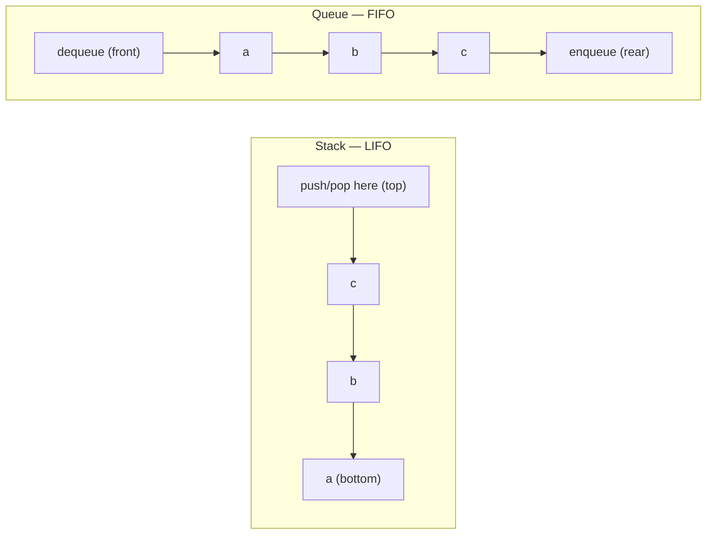

# Chapter 5: Stacks and Queues

Every structure so far has been about *access*: an [array](03-basic-data-structures.md) lets you touch any element in `O(1)`, a [linked list](04-linked-lists.md) lets you splice one in anywhere in `O(1)`. Stacks and queues go the other way. They take a sequence and *throw access away* — you may add and remove at the ends, and nowhere else. That sounds like a downgrade, and it is the entire point.

The restriction is the feature. When the only thing you can do is push and pop one end, every operation is `O(1)`, allocation-free if you want it, and — more importantly — the *order* elements come back out is a guarantee, not an accident. A stack hands them back **last-in-first-out (LIFO)**; a queue hands them back **first-in-first-out (FIFO)**. That single guarantee is what lets you reason about a recursive descent, a task pipeline, or a graph traversal without holding the whole thing in your head. You give up random access and you buy back predictability. For a huge class of problems that is exactly the trade you want.



Both are *abstract data types*, not concrete layouts: "stack" names a contract (`push`, `pop`, `top`, `empty`), and you can honor that contract with an array or with a linked list. As with searching, the interesting question isn't the interface — it's which backing store you pick, and why the machine cares.

## The stack: a sequence you only touch at the top

A stack supports four operations, all `O(1)`: `push` a value onto the top, `pop` the top off, `top` (peek without removing), and `empty`. The last-in element is the first out, so three pushes of `a, b, c` come back `c, b, a`.

The natural backing store is a plain array that grows at one end — which is exactly what `std::vector` already is. Pushing is `push_back`, popping is `pop_back`, and the top is `back()`. Both are `O(1)` amortized (the "amortized" covers the occasional doubling-and-copy when the vector outgrows its buffer; see [Chapter 3](03-basic-data-structures.md)). You almost never need to write this yourself, but writing it once shows there's nothing hidden inside.

```cpp
#include <vector>
#include <stdexcept>

template <typename T>
class ArrayStack {
    std::vector<T> data;
public:
    void push(const T& x) { data.push_back(x); }

    T pop() {
        if (empty()) throw std::underflow_error("pop from empty stack");
        T x = std::move(data.back());
        data.pop_back();
        return x;
    }

    T& top() {
        if (empty()) throw std::underflow_error("top of empty stack");
        return data.back();
    }

    bool empty() const { return data.empty(); }
    std::size_t size() const { return data.size(); }
};
```

The array backing is the one you want by default, and the reason is the same one that runs through this whole book: contiguous memory. The elements sit next to each other, so pushing and popping walk the CPU's cache the way it likes to be walked, and the hardware prefetcher keeps the hot end of the stack in L1. A linked-list stack — one node per element, `next` pointing at the node below — is also perfectly valid and gives genuinely unbounded growth with no resize copies, but every element is a separate heap allocation scattered across memory, so touching the top can cost a cache miss the array never pays. Reach for the linked version only when you truly cannot tolerate a resize pause (a hard-real-time path) or the elements are large enough that moving them on a resize hurts more than pointer-chasing does. For everything else, `std::stack` — which is a thin adapter over `std::deque` — is the right answer.

## The call stack: the most important stack in computing

You have been using a stack on every line of code you have ever written, whether or not you named it. When a function calls another function, the machine pushes a **stack frame** — the return address, the saved registers, and the callee's local variables — onto a region of memory called the *call stack*. When the function returns, its frame is popped and control resumes at the return address underneath. Nested calls nest frames; the LIFO discipline of "return to your most recent caller first" is not a metaphor for a stack, it *is* a stack, maintained in hardware by a stack-pointer register.

This is why recursion and stacks are the same idea seen from two angles. A recursive function is just one that pushes another copy of its own frame before the previous copy returns, and **the recursion depth is literally how many frames are on the call stack.** That connection has a sharp, practical consequence: the call stack is a *fixed-size region* (commonly a few megabytes, set at thread creation), and when your recursion goes too deep, those frames overflow it. That is a **stack overflow** — the single most famous crash in programming, and it is nothing more exotic than an array running off its end. Infinite recursion overflows it instantly; a correct but very deep recursion over a million-node structure overflows it too.

```cpp
long sum(long n) {              // depth grows with n
    if (n == 0) return 0;
    return n + sum(n - 1);      // each call pushes a frame that outlives the call below
}
// sum(1'000'000) does not compute a number — it overflows the call stack and crashes.
```

The fix is to recognize that *any* recursion can be rewritten as a loop with an **explicit stack** on the heap, trading the bounded call stack for a `std::stack` that can grow to gigabytes. This is the standard move for deep tree and graph traversals, and it is why the iterative depth-first search you'll write in [Chapter 11](11-graphs.md) keeps an explicit stack instead of recursing: the heap-backed stack won't blow the 8 MB call-stack ceiling on a pathological input. When an interviewer asks you to "convert this recursion to iteration," they are asking you to move the call stack from hardware into a data structure you control.

## The queue: FIFO, and why a ring buffer is the right backing store

A queue is the stack's sibling with the opposite discipline: add at the rear, remove at the front, so the first-in element is the first out. Its four operations — `enqueue`, `dequeue`, `front`, `empty` — are all `O(1)`, and three enqueues of `a, b, c` come back `a, b, c`, order preserved.

Here the choice of backing store is not a wash, and getting it right is the most important lesson in this chapter. The naive array queue — `enqueue` appends at the back, `dequeue` removes at the front — is a trap: removing the front of an array is `O(n)` because everything shifts down. You could leave a `front` index that just advances instead of shifting, but then the array grows without bound as the live window crawls rightward, leaking all the space to its left.

The fix is to bend the array into a circle. A **ring buffer** is a fixed array plus two indices — a head (front) and a count — where advancing past the last slot wraps back to slot zero via modular arithmetic. Dequeue advances the head; enqueue writes at `(head + count) mod capacity`. Nothing ever shifts, nothing ever reallocates, and the freed slots at the front are transparently reused by the rear. It is a bounded, allocation-free, cache-friendly queue, and it is the queue the OS kernel, the network card driver, and the low-latency trading engine all actually use — because in those worlds an unbounded queue that mallocs under load is a latency spike or an out-of-memory kill waiting to happen. A fixed ring can never surprise you that way.

```cpp
#include <vector>
#include <stdexcept>

template <typename T>
class RingQueue {
    std::vector<T> buf;         // fixed capacity, never resized
    std::size_t head = 0;       // index of the front element
    std::size_t count = 0;      // number of live elements
public:
    explicit RingQueue(std::size_t capacity) : buf(capacity) {
        if (capacity == 0) throw std::invalid_argument("capacity must be > 0");
    }

    bool empty() const { return count == 0; }
    bool full()  const { return count == buf.size(); }
    std::size_t size() const { return count; }

    void enqueue(const T& x) {
        if (full()) throw std::overflow_error("enqueue to full queue");
        std::size_t tail = (head + count) % buf.size();   // wrap to reuse freed slots
        buf[tail] = x;
        ++count;
    }

    T dequeue() {
        if (empty()) throw std::underflow_error("dequeue from empty queue");
        T x = std::move(buf[head]);
        head = (head + 1) % buf.size();                   // advance front, wrapping
        --count;
        return x;
    }

    const T& front() const {
        if (empty()) throw std::underflow_error("front of empty queue");
        return buf[head];
    }
};
```

Notice the one decision that makes this correct: it tracks `count` explicitly. The classic ring-buffer bug is the **full-versus-empty ambiguity** — if you store only a head and a tail index, then `head == tail` means the queue is empty *and* it means the queue is full, and you cannot tell which. The two traditional escapes are to sacrifice one slot (call it full when the tail is one short of the head, capacity minus one usable) or to keep a separate count. The count is simpler, uses the whole array, and the check-then-act guards (`full()` before write, `empty()` before read) fall out of it directly. Sacrifice-a-slot is worth recognizing because you'll see it in other people's code, but prefer the counter.

The alternative backing store is a linked list: `frontNode` and `rearNode` pointers, enqueue links a node at the rear, dequeue unlinks from the front, both genuinely `O(1)` with no capacity limit. It's a correct queue and it's what you use when the size is truly unbounded and unknowable. But it pays for that flexibility exactly the way the linked-list stack does — a heap allocation per element and a pointer-chase per access, scattering the queue across memory and missing cache on every hop. The ring buffer keeps the whole queue in one contiguous block the prefetcher can stream. When you can name a maximum size, the ring wins on every axis that a systems engineer counts: predictable memory, no allocator in the hot path, and cache locality. That is why it is the default in performance-critical code and the linked queue is the fallback, not the other way around.

## Deque: both ends open

A **double-ended queue** (deque, pronounced "deck") relaxes the restriction just enough to allow push and pop at *both* ends, still `O(1)` each — it is a stack and a queue at once. You can build one on a ring buffer by adding a `push_front` that decrements the head (wrapping), mirroring the `push_back` that uses the tail. In practice you reach for `std::deque`, which is implemented as a sequence of fixed-size chunks so it grows at both ends without invalidating references, and it's the default engine underneath both `std::stack` and `std::queue`. The deque earns its own section here for one reason: it is the data structure behind the sliding-window pattern below, where you need to add at one end and evict from *either*.

## The interview workhorses: monotonic stack and monotonic queue

Two patterns turn stacks and queues from plumbing into algorithmic tools, and together they account for a large slice of the "medium" problems interviewers reach for. Both rest on the same trick: keep the structure **monotonic** — sorted — by throwing away elements that can never again be the answer. Because every element is pushed once and popped once, the whole scan is `O(n)` even though it looks like it should be `O(n²)`.

### Monotonic stack: next greater element

The question "for each element, what is the next element to its right that is larger?" looks like it needs a nested loop. It doesn't. Walk left to right keeping a stack of indices whose answer you haven't found yet, in *decreasing* value order. When the current element is larger than the value on top of the stack, it is the answer for that index — record it and pop. Each index is pushed once and popped at most once, so `O(n)`.

```cpp
#include <vector>
#include <stack>

// For each i, result[i] = next element to the right greater than nums[i], else -1.
std::vector<int> nextGreater(const std::vector<int>& nums) {
    int n = static_cast<int>(nums.size());
    std::vector<int> result(n, -1);
    std::stack<int> st;                       // indices, values decreasing bottom-to-top
    for (int i = 0; i < n; ++i) {
        while (!st.empty() && nums[i] > nums[st.top()]) {
            result[st.top()] = nums[i];       // nums[i] is the next-greater for st.top()
            st.pop();
        }
        st.push(i);
    }
    return result;
}
```

The identical skeleton, with the comparison flipped or the array walked in reverse, solves *next smaller*, *previous greater*, **daily temperatures** (how many days until it's warmer — store indices, answer is the index gap), and **largest rectangle in a histogram** (maintain increasing bar heights; when a shorter bar arrives, pop and compute the rectangle each popped bar anchors). Recognizing that a problem is asking "nearest larger/smaller neighbor" is the whole game; the monotonic stack is the answer every time.

```cpp
// Daily temperatures: days to wait for a warmer day. Same skeleton, storing gaps.
std::vector<int> dailyTemperatures(const std::vector<int>& temp) {
    int n = static_cast<int>(temp.size());
    std::vector<int> wait(n, 0);
    std::stack<int> st;
    for (int i = 0; i < n; ++i) {
        while (!st.empty() && temp[i] > temp[st.top()]) {
            wait[st.top()] = i - st.top();
            st.pop();
        }
        st.push(i);
    }
    return wait;
}
```

### Monotonic queue: sliding-window maximum

Now a window of width `k` slides across an array and you want the maximum inside it at every position. Recomputing each window is `O(nk)`. A **monotonic queue** — a deque of indices kept in decreasing value order — gets it to `O(n)`. The front always holds the index of the current window's maximum. Two evictions keep the invariant: drop indices that have slid out of the window off the front, and drop smaller values off the back before pushing the current one, because a smaller element with a larger one still to its left can never be a future window's maximum.

```cpp
#include <vector>
#include <deque>

std::vector<int> maxSlidingWindow(const std::vector<int>& nums, int k) {
    std::deque<int> dq;                       // indices, values decreasing front-to-back
    std::vector<int> result;
    for (int i = 0; i < static_cast<int>(nums.size()); ++i) {
        if (!dq.empty() && dq.front() <= i - k) dq.pop_front();   // evict out-of-window
        while (!dq.empty() && nums[dq.back()] <= nums[i])         // evict dominated values
            dq.pop_back();
        dq.push_back(i);
        if (i >= k - 1) result.push_back(nums[dq.front()]);       // front = window max
    }
    return result;
}
```

Flip the back-eviction comparison to `>=` and you have sliding-window *minimum*. The deque is doing exactly what the monotonic stack did — discarding elements that are provably useless — but with eviction at *both* ends, which is why it needs a deque and not a plain stack.

## Two classic applications

Beyond the interview patterns, two everyday uses show the LIFO/FIFO disciplines doing their jobs.

**Balanced brackets** is the canonical stack problem, and it's why every editor can flag a mismatched `)`. Push each opening bracket; on a closing bracket, the top of the stack must be its matching opener, or the string is invalid. The LIFO order is exactly the nesting order — the most recently opened bracket must be the first one closed.

```cpp
#include <stack>
#include <string>

bool balanced(const std::string& s) {
    std::stack<char> st;
    for (char c : s) {
        if (c == '(' || c == '[' || c == '{') {
            st.push(c);
        } else if (c == ')' || c == ']' || c == '}') {
            if (st.empty()) return false;                 // closer with nothing open
            char open = st.top();
            st.pop();
            if ((c == ')' && open != '(') ||
                (c == ']' && open != '[') ||
                (c == '}' && open != '{')) return false;  // mismatched pair
        }
    }
    return st.empty();                                    // nothing left unclosed
}
```

**Breadth-first search** is the canonical queue problem, and it's why a queue is the backbone of level-by-level exploration — shortest paths on an unweighted graph, level-order tree traversal, flood fill. FIFO order is what makes it explore in rings of increasing distance: you finish every node at distance `d` before touching any at distance `d + 1`, precisely because they were enqueued first. Swap the queue for a stack and BFS becomes DFS; the traversal order is *entirely* a property of which end you remove from.

```cpp
#include <queue>
#include <vector>

std::vector<int> bfs(const std::vector<std::vector<int>>& adj, int start) {
    std::vector<bool> seen(adj.size(), false);
    std::vector<int> order;
    std::queue<int> q;
    seen[start] = true;
    q.push(start);
    while (!q.empty()) {
        int u = q.front();
        q.pop();
        order.push_back(u);
        for (int v : adj[u])
            if (!seen[v]) { seen[v] = true; q.push(v); }   // mark on enqueue, not dequeue
    }
    return order;
}
```

Mark neighbors seen when you *enqueue* them, not when you dequeue them — the frequent bug is to mark on dequeue, which lets the same node get enqueued several times before it's processed and quietly turns a linear traversal quadratic. The full treatment of BFS, DFS, and their weighted cousins is in [Chapter 11](11-graphs.md); the level-order walk of a binary tree is the same loop over a tree's children in [Chapter 6](06-trees-and-binary-trees.md).

A close relative worth naming is the **priority queue**, which relaxes FIFO to "highest priority out first" and is backed by a heap, not a ring buffer — `push` and `pop` become `O(log n)`. It powers Dijkstra, Huffman, and every scheduler that isn't strictly first-come-first-served; `std::priority_queue` is the standard implementation and heaps get their own treatment in [Chapter 14](14-advanced-data-structures.md).

## The standard library, and when to hand-roll

In C++ you rarely build any of this from scratch. `std::stack` and `std::queue` are *container adapters* — thin wrappers that expose the restricted interface over an underlying container (a `std::deque` by default), so you get the LIFO/FIFO contract with none of the index bookkeeping. `std::deque` gives you both ends, `std::priority_queue` gives you priority ordering, and for the fixed-capacity ring buffer that low-latency code wants, reach for a purpose-built type (`boost::circular_buffer`, or the hand-rolled `RingQueue` above) since the standard library doesn't ship one.

Write your own only for a concrete reason: a fixed-capacity ring buffer with no allocation in the hot path, a lock-free queue for a specific concurrency pattern, or an intrusive structure where the nodes live inside the elements. Concurrency in particular is a place not to improvise — a naive `push` behind a mutex is easy, but a correct lock-free queue (the Michael–Scott algorithm) is a research-grade artifact, and the right first move under contention is a coarse lock around `std::queue`, profiled, before anything cleverer. Absent one of those reasons, the adapter is faster to write, already correct, and already tuned.

## Engineering judgment

- **Pick a stack or a queue when the restriction is what you want.** If your access pattern really is "most recent first" or "oldest first," enforcing it in the type makes the code impossible to misuse and every operation `O(1)`. If you find yourself reaching into the middle, you picked the wrong structure — that's an array or a list.
- **Default to array backing.** An `ArrayStack`/`std::stack` and a ring-buffer queue keep everything contiguous and cache-friendly. Choose linked backing only for genuinely unbounded size with intolerable resize pauses.
- **Bound your queues.** A ring buffer with a hard capacity turns "we ran out of memory under load" into an explicit, testable full-queue signal. Unbounded queues hide backpressure until production finds it for you.
- **Watch the call stack.** Deep recursion is a bounded array you can overflow. On large or adversarial inputs, convert to iteration with an explicit heap-backed stack.

## Interview checklist

**Say this, not that.** "A stack is LIFO, a queue is FIFO" is the surface. The substance: "Both are restrictions on a sequence that buy `O(1)` operations and a guaranteed ordering. A stack is array-backed by default for cache locality; a queue is best backed by a ring buffer so it's bounded and allocation-free. The call stack is the canonical stack, and deep recursion overflows it — which is why you convert to an explicit stack."

**The problems interviewers use to test it**
- **Balanced parentheses / valid brackets** — the one-line stack proof of nesting.
- **Next greater element, daily temperatures, largest rectangle in histogram** — the monotonic stack, `O(n)` because each element is pushed and popped once.
- **Sliding-window maximum** — the monotonic deque.
- **Implement a queue with two stacks** (and its mirror) — tests whether you understand the disciplines, not just the APIs.
- **Convert a recursion to iteration** — really "move the call stack into a `std::stack`."

**Common mistakes**
- Accessing `top()`/`front()` without an empty check — undefined behavior on an empty container.
- The ring-buffer full-versus-empty ambiguity — resolve it with a count or a sacrificed slot.
- Marking BFS nodes visited on dequeue instead of enqueue, letting duplicates pile into the queue.
- Forgetting that unbounded recursion is a stack overflow, not an infinite loop.

## Summary

Stacks and queues are the same idea in two directions: take a sequence, forbid access to the middle, and what remains is `O(1)`, predictable, and easy to reason about. The stack's LIFO discipline is the one the machine itself runs on — the call stack is a real, fixed-size array, and overflowing it with deep recursion is the most common crash there is, curable by moving the stack onto the heap. The queue's FIFO discipline is best realized not with a pointer-chasing linked list but with a ring buffer: a fixed array and a wrapping index pair that is bounded, allocation-free, and cache-friendly, which is exactly why kernels and low-latency systems are built on it. On top of those two disciplines sit the monotonic-stack and monotonic-queue patterns that collapse seemingly quadratic problems to a single linear pass. Reach for `std::stack`, `std::queue`, and `std::deque` by default; hand-roll a ring buffer only when you need a hard capacity and no allocator in the hot path. Next we climb from linear structures to hierarchical ones — [trees](06-trees-and-binary-trees.md), where a queue drives the level-order walk and a stack drives the depth-first one.
