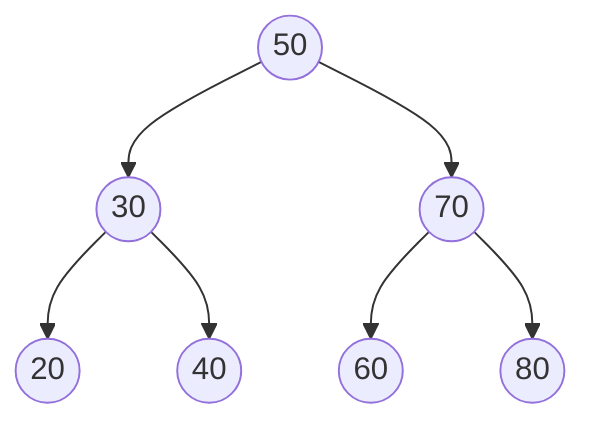
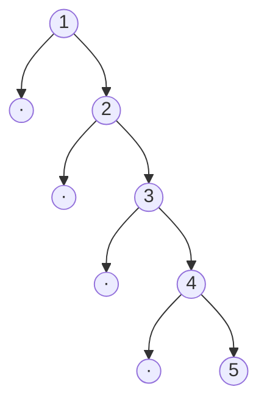

# Chapter 6: Trees and Binary Trees

The [hash table](10-hash-tables-and-hashing.md) bought you `O(1)` lookup, and it paid for it by throwing away order. Ask a hash table for the smallest key, or every key between 100 and 200, or the keys in sorted sequence, and it has nothing to offer — its whole speed comes from scattering keys across buckets by hash value, which is the opposite of keeping them in order. That is a real loss, because an enormous amount of real work is ordered work: range queries, "next largest," sorted iteration, autocomplete.

The **binary search tree** is the structure that gets ordering back *without* giving up logarithmic operations. It keeps its keys arranged so that a single comparison at each node tells you which way to go, exactly like binary search on a sorted array — except that, unlike an array, you can also insert and delete in `O(log n)` instead of paying `O(n)` to shift elements. Ordering *and* fast updates, at once. That is the promise of this chapter, and also, eventually, its problem: the promise holds only while the tree stays balanced, and keeping it balanced is the whole reason [`std::map`](https://en.cppreference.com/w/cpp/container/map) is a red-black tree and not the naive thing you'd write first.

## The ordering invariant

A tree is a set of **nodes** connected so that each node has one **parent** (except the **root**, which has none) and any number of **children**. No cycles, one path from the root to any node. A **binary tree** narrows this to at most two children per node, named `left` and `right`. A **leaf** has no children; the **height** of the tree is the number of edges on the longest root-to-leaf path.

```cpp
#include <algorithm>
#include <queue>
#include <stack>
#include <vector>

template <typename T>
struct Node {
    T key;
    Node* left  = nullptr;
    Node* right = nullptr;
    explicit Node(const T& k) : key(k) {}
};
```

What makes a binary tree a *binary search tree* is one rule, the **BST invariant**, applied at every node:

> every key in the left subtree is less than the node's key, and every key in the right subtree is greater.

Not just the immediate children — the *entire* left subtree sits below the node's key and the entire right subtree above it. Here is a valid BST:



Read the invariant at the root: everything under `30` (that's `20, 30, 40`) is less than `50`, and everything under `70` (that's `60, 70, 80`) is greater. It holds again at `30`, and again at `70`, all the way down. That single recursive rule is what every operation below exploits.

Two consequences fall out immediately, and they are worth stating before any code. First, **searching is guided**: at each node you compare once and discard an entire subtree, so on a balanced tree you reach any key in `O(log n)` steps — the tree *is* binary search, made mutable. Second, **an in-order traversal — left subtree, then node, then right subtree — visits the keys in sorted order.** Walk the tree above that way and you get `20, 30, 40, 50, 60, 70, 80`. The BST is, in effect, a sorted sequence you can splice into cheaply.

## Search, insert, delete

Search is the invariant turned into a loop. Compare, go left or right, repeat until you match or fall off the tree. No stack or recursion needed — the path is a straight line down.

```cpp
template <typename T>
bool contains(Node<T>* root, const T& key) {
    for (Node<T>* n = root; n; ) {
        if      (key < n->key) n = n->left;    // target is smaller → left
        else if (n->key < key) n = n->right;   // target is larger  → right
        else                   return true;    // equal → found
    }
    return false;                              // ran off the tree → absent
}
```

That is `O(h)` where `h` is the height — `O(log n)` on a balanced tree, and the same shape as `binarySearch` from [Chapter 13](13-searching-algorithms.md), one comparison halving the search space.

Insertion follows the identical search path and, when it falls off the tree, that empty spot is exactly where the new key belongs — so the BST invariant is preserved for free. The recursive form is clean because "insert into a subtree and hang the result back on" is the natural shape:

```cpp
template <typename T>
Node<T>* insert(Node<T>* n, const T& key) {
    if (!n) return new Node<T>(key);                  // empty spot: this is where it goes
    if      (key < n->key) n->left  = insert(n->left,  key);
    else if (n->key < key) n->right = insert(n->right, key);
    // key == n->key: already present, do nothing (a BST holds a set)
    return n;
}
```

Deletion is the one operation with real bookkeeping, because removing an interior node leaves a hole that has to be filled without breaking the ordering. There are three cases, and the third is the only one that takes thought:

1. **A leaf** — just delete it and return `nullptr` to the parent.
2. **One child** — splice the node out by returning its single child to the parent.
3. **Two children** — the node can't simply vanish; something must take its place that preserves order. The right choice is the **in-order successor**: the smallest key in the right subtree, i.e. the very next key in sorted order. Copy that key up into the node, then delete the successor from the right subtree (where it is guaranteed to be a leaf or a one-child node — cases 1 or 2). Its symmetric twin, the in-order predecessor, works just as well.

```cpp
template <typename T>
Node<T>* minNode(Node<T>* n) {          // leftmost node = smallest key
    while (n->left) n = n->left;
    return n;
}

template <typename T>
Node<T>* erase(Node<T>* n, const T& key) {
    if (!n) return nullptr;                          // not found
    if      (key < n->key) n->left  = erase(n->left,  key);
    else if (n->key < key) n->right = erase(n->right, key);
    else {                                           // found the node to remove
        if (!n->left)  { Node<T>* r = n->right; delete n; return r; }   // 0 or 1 child
        if (!n->right) { Node<T>* l = n->left;  delete n; return l; }   // 1 child
        Node<T>* succ = minNode(n->right);           // two children
        n->key = succ->key;                          // copy successor up
        n->right = erase(n->right, succ->key);       // then delete it below
    }
    return n;
}
```

Note what `delete n` does *not* do here: `Node` has no destructor, so deleting a node frees exactly that one node and never touches its children. That is deliberate. A common beginner version gives `Node` a recursive destructor (`~Node() { delete left; delete right; }`) — and then `delete n` in case 1, right after grabbing `r = n->right`, recursively frees the very subtree `r` you are about to return. A use-after-free hiding in a "helpful" destructor. Keep node destruction out of the node and in the owning tree instead:

```cpp
template <typename T>
class BST {
    Node<T>* root_ = nullptr;
    static void destroy(Node<T>* n) {                // post-order: children before parent
        if (!n) return;
        destroy(n->left);
        destroy(n->right);
        delete n;
    }
public:
    BST() = default;
    ~BST() { destroy(root_); }
    BST(const BST&) = delete;                         // owns raw pointers → no copying
    BST& operator=(const BST&) = delete;

    void insert(const T& key)      { root_ = ::insert(root_, key); }
    void erase(const T& key)       { root_ = ::erase(root_, key); }
    bool contains(const T& key) const { return ::contains(root_, key); }
    Node<T>* root() const          { return root_; }
};
```

All three operations are `O(h)`: `O(log n)` on a balanced tree, and — as the last section warns — `O(n)` on a tree that has lost its balance.

## Traversals

Visiting every node is `O(n)`, and the *order* you visit them in is a choice. All three depth-first orders are the same three lines with the "visit" moved:

```cpp
template <typename T>
void inorder(Node<T>* n, std::vector<T>& out) {
    if (!n) return;
    inorder(n->left, out);
    out.push_back(n->key);      // in-order:  left,  VISIT, right  → sorted for a BST
    inorder(n->right, out);
}
```

Move `out.push_back(n->key)` above both recursive calls and you have **pre-order** (node, left, right — used to copy or serialize a tree); move it below both and you have **post-order** (left, right, node — the order `destroy` above uses, because you must free children before the parent). In-order is the one that matters most here: for a BST it emits the keys **sorted**, which is how you print a BST in order, validate it, or find the *k*-th smallest.

The recursion is really an implicit stack, and for a very deep (unbalanced) tree that stack can overflow — thousands of frames on a degenerate tree. Making the stack explicit removes that risk and is worth knowing:

```cpp
template <typename T>
std::vector<T> inorderIterative(Node<T>* root) {
    std::vector<T> out;
    std::stack<Node<T>*> st;
    Node<T>* cur = root;
    while (cur || !st.empty()) {
        while (cur) { st.push(cur); cur = cur->left; }   // dive to the leftmost
        cur = st.top(); st.pop();
        out.push_back(cur->key);                         // visit
        cur = cur->right;                                // then explore the right subtree
    }
    return out;
}
```

**Breadth-first** (level-order) traversal is a different shape entirely: instead of a stack it uses a queue, visiting the root, then every node at depth 1, then depth 2, and so on. Swap the stack for a queue and depth-first becomes breadth-first — that one substitution is the whole difference.

```cpp
template <typename T>
std::vector<T> levelOrder(Node<T>* root) {
    std::vector<T> out;
    if (!root) return out;
    std::queue<Node<T>*> q;
    q.push(root);
    while (!q.empty()) {
        Node<T>* n = q.front(); q.pop();
        out.push_back(n->key);
        if (n->left)  q.push(n->left);
        if (n->right) q.push(n->right);
    }
    return out;
}
```

## Height and validation

Height is a two-line recursion, and the base case is a convention you must fix and then obey: an empty tree is height `-1`, which makes a single leaf height `0`.

```cpp
template <typename T>
int height(Node<T>* n) {
    if (!n) return -1;
    return 1 + std::max(height(n->left), height(n->right));
}
```

Validating the BST invariant is a sharper problem than it first looks, and it is a classic interview trap. Checking only that `left->key < n->key < right->key` at each node is **wrong** — that catches an out-of-place child but not an out-of-place grandchild, because the invariant is about entire subtrees, not immediate neighbors. The correct check threads a *range* down the tree: every node must fall inside a `(lo, hi)` window that tightens as you descend.

```cpp
template <typename T>
bool isBST(Node<T>* n, const T* lo, const T* hi) {
    if (!n) return true;
    if (lo && !(*lo < n->key)) return false;   // must be strictly greater than lower bound
    if (hi && !(n->key < *hi)) return false;   // must be strictly less than upper bound
    return isBST(n->left,  lo, &n->key) &&     // left subtree: upper bound becomes this key
           isBST(n->right, &n->key, hi);       // right subtree: lower bound becomes this key
}

template <typename T>
bool isBST(Node<T>* root) { return isBST<T>(root, nullptr, nullptr); }
```

The bounds are passed as pointers, with `nullptr` meaning "unbounded on this side." A tempting shortcut — seed the range with `std::numeric_limits<T>::min()` and `max()` — is a genuine bug: a tree legitimately containing the minimum or maximum representable value would be rejected, because the strict comparison against the sentinel fails on a perfectly valid key. Null bounds have no such blind spot.

## The balance problem

Everything so far has quietly assumed the tree is *bushy* — that its height is about `log n`. Nothing in the insert code enforces that, and the failure is not exotic; it is the most ordinary input imaginable. Insert `1, 2, 3, 4, 5` in order:



Every key is larger than the last, so every key goes right, and the tree collapses into a **linked list**. Height is now `n - 1`, and search, insert, and delete are all `O(n)`. You built a tree and got a linked list with extra pointer overhead — the worst of both. And sorted-or-nearly-sorted input is *everywhere*: timestamps, auto-increment IDs, already-processed data. A BST that degrades on sorted input degrades on exactly the data real systems feed it.

The fix is a **self-balancing tree**: one that detects when an insertion or deletion has made a subtree too lopsided and locally repairs it — with an `O(1)` structural operation called a **rotation** that re-hangs a few pointers to reduce height while preserving the BST ordering. Two schemes dominate:

- **AVL trees** keep the heights of every node's two subtrees within 1 of each other. Tightly balanced, so lookups are as short as possible; the strict invariant costs a few more rotations on update.
- **Red-black trees** color each node red or black and enforce rules that keep the longest root-to-leaf path at most twice the shortest. Looser balance, fewer rotations per update — a better fit for update-heavy workloads.

Both guarantee `O(log n)` height no matter what order the keys arrive in, sorted input included. This is not a niche technique you'll reach for occasionally: **C++'s `std::map` and `std::set` are red-black trees**, as are Java's `TreeMap` and `TreeSet`. When you want ordered keys with logarithmic operations, you almost never hand-roll a BST — you reach for `std::map`, and a balanced tree is what you get. The plain BST in this chapter is the thing you build to understand *why* the balanced version has to exist. (The rotation mechanics themselves are involved enough to be their own subject; what matters here is the shape of the problem and its solution.)

## Why a binary tree isn't the end: the cache

A balanced BST gives `O(log n)` operations, and by the complexity table that should be the end of the story. On real hardware it is not, and the reason is the same one that runs through this whole book: **`O(log n)` counts comparisons, but what the machine actually pays for is memory access.**

A BST node is allocated on its own, wherever `new` happened to place it, and it reaches its children through pointers. So walking down the tree is **pointer chasing** — each step follows a pointer to an address the hardware had no way to predict, and an unpredictable access to a node not already in cache is a **cache miss** that stalls the CPU for on the order of 100 nanoseconds (see [Chapter 3.6](03.6-memory-hierarchy-and-performance.md) for the memory-hierarchy numbers). Crucially, this is *one miss per level of the tree*, because each level lives at an unrelated address.

Do the arithmetic for a million keys. A balanced binary tree is about `log₂(1,000,000) ≈ 20` levels deep, so a single lookup can cost **roughly 20 cache misses** — around 2 microseconds of mostly waiting on memory, to perform 20 comparisons that themselves take almost no time. The asymptotics are excellent and the constant factor is dismal, and for data this size the constant factor is what you feel.

The fix is to make each node hold *more* than one key, so that one memory access does more work and the tree gets shallower. That is precisely a **B-tree**: a node is a block of many keys — sized to a cache line or a disk page — with many children, so a million keys fit in three or four levels instead of twenty, and a lookup costs three or four cache misses instead of twenty. When the data lives on disk, where a "miss" is a *ten-thousand-times* slower seek rather than a cache stall, this stops being an optimization and becomes the only workable design. That is why **every production database index is a B-tree, not a binary tree** — PostgreSQL, MySQL, SQLite all index this way. The binary tree taught the ordering idea; the B-tree is what you deploy when memory latency is the bill you actually pay. The [B-tree chapter](https://sb2k16.github.io/chapters/b-trees) follows this thread all the way to the systems that live and die by it.

## Summary

A binary search tree recovers what the hash table gave up — order — while keeping search, insert, and delete at `O(log n)`, all resting on one recursive invariant: left subtree below the node, right subtree above. That invariant makes search a guided descent, makes deletion's two-child case reduce to lifting the in-order successor, and makes an in-order traversal emit sorted keys. But the guarantee is conditional: nothing in a naive BST prevents sorted input from collapsing it into an `O(n)` linked list, which is why real ordered containers (`std::map`, `std::set`) are self-balancing red-black trees that hold height at `O(log n)` regardless of input order. And even a perfectly balanced binary tree pays one cache miss per level — about 20 for a million keys — so the systems that index data at scale replace it with the wide, shallow, cache- and disk-aware [B-tree](https://sb2k16.github.io/chapters/b-trees), the structure behind every database index.

## Exercises

1. Insert `50, 30, 70, 20, 40, 60, 80` into the `BST` above, then run `inorderIterative`. Confirm the output is sorted, and hand-trace the explicit stack for the first four `push`/`pop` operations.
2. Add a `kthSmallest(int k)` method using an in-order traversal that stops early once it has seen `k` keys. Why is in-order the right traversal for this?
3. Delete the root of the seven-node tree from exercise 1 (the key `50`) using the two-child rule. Which key replaces it, and what does the tree look like afterward?
4. Write a version of `height` that returns `-1` the moment it detects the tree is unbalanced (any node whose subtree heights differ by more than 1), without a second pass. What is its complexity?
5. Feed the sorted sequence `1..1000` into the `BST` and measure the height. Then shuffle the same keys and measure again. Explain the gap in terms of the balance problem, and predict what a red-black tree would give for both.
6. Estimate the lookup cost, in cache misses, for a balanced binary tree of one billion keys versus a B-tree of order 100 holding the same keys. Which structure would you index a database table with, and why?
