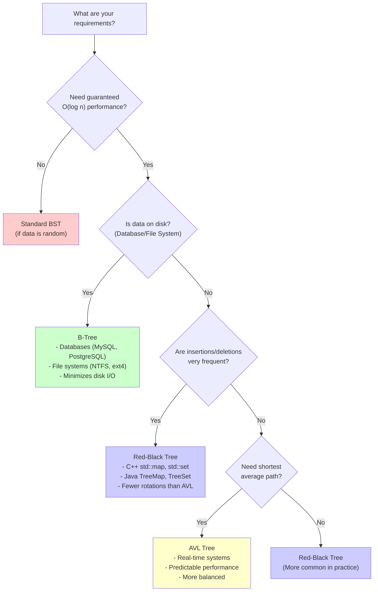

# Chapter 6: Trees and Binary Trees

## Table of Contents

- [6.1 Problem Statement & Motivation](#problem-statement-motivation)
  - [What Problem Do Trees Solve?](#what-problem-do-trees-solve)
  - [When to Use Trees](#when-to-use-trees)
  - [When NOT to Use Trees](#when-not-to-use-trees)
- [6.2 Conceptual Overview](#conceptual-overview)
  - [Intuitive Explanation](#intuitive-explanation)
  - [Tree Terminology](#tree-terminology)
  - [Tree Properties](#tree-properties)
- [6.3 Abstract Model & Invariants ⭐](#abstract-model-invariants)
  - [Abstract Model](#abstract-model)
  - [Core Invariants](#core-invariants)
- [6.8 Implementation (Reference Language: C++) ⭐](#implementation-reference-language-c)
  - [6.8.1 Binary Trees](#1-binary-trees)
  - [Binary Tree Node Structure](#binary-tree-node-structure)
  - [Binary Tree Implementation](#binary-tree-implementation)
  - [6.8.2 Tree Traversal Algorithms](#2-tree-traversal-algorithms)
  - [Depth-First Traversal (DFS)](#depth-first-traversal-dfs)
  - [Breadth-First Traversal (BFS)](#breadth-first-traversal-bfs)
  - [Adding Traversal Methods to BinaryTree Class](#adding-traversal-methods-to-binarytree-class)
  - [6.8.3 Binary Search Trees (BST)](#3-binary-search-trees-bst)
  - [BST Implementation](#bst-implementation)
  - [6.8.4 Advanced Tree Operations](#4-advanced-tree-operations)
  - [Lowest Common Ancestor (LCA)](#lowest-common-ancestor-lca)
  - [Path Sum Problems](#path-sum-problems)
  - [Tree Serialization and Deserialization](#tree-serialization-and-deserialization)
  - [Tree Validation and Properties](#tree-validation-and-properties)
  - [6.8.5 Example Usage and Testing](#5-example-usage-and-testing)
- [6.9 Correctness Argument](#correctness-argument)
  - [Why BST Search Is Correct](#why-bst-search-is-correct)
  - [Why BST Insert Is Correct](#why-bst-insert-is-correct)
  - [Why BST Delete Is Correct](#why-bst-delete-is-correct)
- [6.10 Edge Cases & Failure Modes](#edge-cases-failure-modes)
  - [Empty Tree Operations](#empty-tree-operations)
  - [Single Node Tree](#single-node-tree)
  - [Unbalanced Tree](#unbalanced-tree)
  - [Memory Leaks](#memory-leaks)
  - [Stack Overflow](#stack-overflow)
  - [BST Property Violation](#bst-property-violation)
- [6.11 Performance & System Considerations ⭐](#performance-system-considerations)
  - [Memory Layout Impact](#memory-layout-impact)
  - [When Trees Become Bottlenecks](#when-trees-become-bottlenecks)
- [6.12 Variants & Extensions](#variants-extensions)
  - [Tree Variants](#tree-variants)
  - [Self-Balancing Trees](#self-balancing-trees)
- [6.13 Real-World Implementations](#real-world-implementations)
  - [C++ Standard Library: std::map, std::set](#c-standard-library-stdmap-stdset)
  - [Database Indexes: B-Trees](#database-indexes-b-trees)
- [6.14 Common Pitfalls & Interview Traps](#common-pitfalls-interview-traps)
  - [1. Not Handling Empty Tree](#not-handling-empty-tree)
  - [2. Breaking BST Property](#breaking-bst-property)
  - [3. Memory Leaks](#memory-leaks)
  - [4. Stack Overflow in Deep Trees](#stack-overflow-in-deep-trees)
  - [5. Incorrect Height Calculation](#incorrect-height-calculation)
  - [6. Creating Cycles](#creating-cycles)
  - [7. Forgetting to Update Parent Pointers](#forgetting-to-update-parent-pointers)
  - [8. Assuming Tree Is Balanced](#assuming-tree-is-balanced)
- [6.15 Additional Performance Analysis](#additional-performance-analysis)
  - [Time Complexity](#time-complexity)
  - [Space Complexity](#space-complexity)
  - [6.12.1 Self-Balancing Trees Overview](#1-self-balancing-trees-overview)
  - [Why Self-Balancing Trees?](#why-self-balancing-trees)
  - [Types of Self-Balancing Trees](#types-of-self-balancing-trees)
  - [Comparison Table](#comparison-table)
  - [Decision Tree: Which Tree Structure to Use?](#decision-tree-which-tree-structure-to-use)
  - [Implementation Note](#implementation-note)
  - [Real-World Applications](#real-world-applications)
  - [6.12.2 Tree Traversal Patterns Guide](#2-tree-traversal-patterns-guide)
  - [When to Use Each Traversal](#when-to-use-each-traversal)
  - [Iterative vs Recursive Trade-offs](#iterative-vs-recursive-trade-offs)
  - [Morris Traversal (O(1) Space)](#morris-traversal-o1-space)
  - [Traversal Pattern Decision Guide](#traversal-pattern-decision-guide)
  - [Common Patterns](#common-patterns)
  - [Practice Problems](#practice-problems)
  - [Additional Failure Modes](#additional-failure-modes)
- [6.16 Exercises & Thought Questions](#exercises-thought-questions)
  - [Conceptual Questions](#conceptual-questions)
  - [Implementation Tasks](#implementation-tasks)
  - [Performance Reasoning](#performance-reasoning)
  - [Interview-Style Problems](#interview-style-problems)
- [6.17 Key Takeaways](#key-takeaways)
  - [Additional Exercises](#additional-exercises)
- [6.18 Summary](#summary)


## 6.1 Problem Statement & Motivation

### What Problem Do Trees Solve?

Linear structures (arrays, linked lists) have limitations for hierarchical data:

- **No Hierarchy**: Can't represent parent-child relationships
- **Inefficient Search**: Linear search is O(n) in arrays/lists
- **No Natural Ordering**: Hard to maintain sorted data efficiently
- **Rigid Structure**: Arrays are fixed, lists are sequential

**Naive Approaches and Their Limitations**:

- **Arrays**: No hierarchy, O(n) search
- **Linked Lists**: Sequential only, O(n) search
- **Multiple Arrays**: Hard to maintain relationships

**The Tree Solution**: Trees provide hierarchical organization with O(log n) search (balanced trees), natural parent-child relationships, and efficient insertion/deletion while maintaining order.

### When to Use Trees

✅ **Use trees when**:
- Data has hierarchical structure
- Need efficient search (O(log n) with balanced trees)
- Need to maintain sorted order
- Representing relationships (file systems, organization charts)
- Implementing priority queues (heaps)

✅ **Real-world applications**:
- File systems (directory structure)
- Database indexes (B-trees)
- Expression trees (compilers)
- Decision trees (machine learning)
- Organization charts
- XML/HTML parsing
- Priority queues (heaps)

### When NOT to Use Trees

❌ **Avoid trees when**:
- Data is flat/unordered (use arrays/lists)
- Need random access by index (use arrays)
- Simple key-value mapping (use hash tables)
- Very small datasets (overhead not worth it)

**Key Trade-off**: Trees trade simplicity for hierarchy and efficient search.

## 6.2 Conceptual Overview

A **tree** is a hierarchical data structure consisting of nodes connected by edges. Unlike linear structures like arrays and linked lists, trees provide a way to organize data in a hierarchical manner.

### Intuitive Explanation

Think of a tree like a family tree or company organization:
- **Root** is the top (CEO, ancestor)
- **Nodes** are people/positions
- **Edges** are relationships (parent-child, manager-employee)
- **Leaves** are bottom level (individual contributors, descendants)
- **Path** from root to any node is unique

### Tree Terminology

- **Node**: An element in the tree that contains data
- **Root**: The topmost node of the tree (no parent)
- **Parent**: A node that has child nodes
- **Child**: A node that has a parent
- **Leaf**: A node with no children
- **Sibling**: Nodes that have the same parent
- **Ancestor**: Any node on the path from the root to a given node
- **Descendant**: Any node in the subtree rooted at a given node
- **Depth**: The number of edges from the root to a node
- **Height**: The maximum depth of any node in the tree
- **Degree**: The number of children a node has

### Tree Properties

1. **Connected**: Every node is reachable from the root
2. **Acyclic**: No cycles exist in the tree
3. **Unique path**: Exactly one path exists between any two nodes

## 6.3 Abstract Model & Invariants ⭐

Understanding tree invariants is essential for correct implementation and reasoning. This section defines correctness **independent of any implementation**.

### Abstract Model

A tree T = (V, E) consists of:
- **Set of vertices V**: The nodes
- **Set of edges E**: Parent-child relationships
- **Root node**: Unique node with no parent
- **Leaf nodes**: Nodes with no children
- **Path**: Unique sequence of edges from root to any node

### Core Invariants

These invariants must **always** hold for a tree to be correct:

#### Core Invariants of a Tree

1. **Root Invariant**:
   - Exactly one root node exists (no parent)
   - All other nodes have exactly one parent
   - Root is reachable from itself (trivially)

2. **Acyclicity Invariant**:
   - No node is its own ancestor
   - No cycles exist in the tree structure
   - Following parent pointers from any node eventually reaches the root

3. **Connectivity Invariant**:
   - Every node is reachable from the root
   - There exists exactly one path from root to any node
   - No isolated nodes exist
   - **Tree Connectivity Property**: For a tree with `n` nodes, there are exactly `n-1` edges
     - This follows from: each node (except root) has exactly one parent → exactly `n-1` parent-child relationships → exactly `n-1` edges
     - Adding an edge creates a cycle (violates acyclicity)
     - Removing an edge disconnects the tree

4. **Parent-Child Invariant**:
   - If node B is a child of node A, then A is the parent of B
   - Each node has at most one parent (exactly one parent, except root which has none)
   - Parent-child relationships form a directed acyclic graph (DAG)
   - Parent-child relationship is asymmetric: if A is parent of B, then B cannot be parent of A

5. **Height and Depth Definitions**:
   - **Depth of a node**: Number of edges from root to that node
     - Root has depth 0
     - Depth increases by 1 for each level down
   - **Height of a node**: Number of edges from that node to the deepest leaf in its subtree
     - Leaf nodes have height 0
     - Height of a node = 1 + max(height of left child, height of right child)
   - **Height of a tree**: Height of the root node (maximum depth of any node)
   - **Level**: Depth + 1 (root is at level 1, not level 0)
   - **Relationship**: For any node, `depth(node) + height(node) ≤ height(tree)`

#### Why Invariants Matter

- **Insertion**: Must maintain acyclicity and connectivity
- **Deletion**: Must ensure no orphaned subtrees
- **Traversal**: Relies on connectivity invariant
- **Search**: Depends on unique path invariant

**Example**: When inserting a node, we must:
1. Set the new node's parent pointer (preserves parent-child invariant)
2. Add the new node to parent's children (preserves connectivity)
3. Ensure no cycle is created (preserves acyclicity)

Violating any invariant creates an invalid tree structure.

## 6.8 Implementation (Reference Language: C++) ⭐

**Note to Reader**: This section provides concrete C++ implementations. The correctness relies on the invariants defined in Section 6.3 and the pseudocode in Section 6.6.

### 6.8.1 Binary Trees

A **binary tree** is a tree where each node has at most two children, referred to as the **left child** and **right child**.

**This corresponds to the binary tree pseudocode in Section 6.6.**

#### Core Invariants of Binary Trees

In addition to general tree invariants, binary trees have specific constraints:

1. **Binary Constraint**:
   - Each node has at most 2 children
   - Children are distinguished as "left" and "right"
   - A node may have 0, 1, or 2 children

2. **Left-Right Invariant**:
   - `left` and `right` pointers are distinct (or both null)
   - No node appears as both left and right child of the same parent
   - Left and right subtrees are independent

3. **Binary Search Tree (BST) Invariant** (if applicable):
   - **BST Property**: For any node with value `v`:
     - All nodes in the **left subtree** have values **strictly less than** `v` (left < root)
     - All nodes in the **right subtree** have values **strictly greater than** `v` (right > root)
     - The node itself satisfies: `left->data < node->data < right->data` (if children exist)
   - **Global BST Property**: The property holds recursively for all nodes
   - **Inorder Traversal Property**: Inorder traversal of a BST produces values in sorted order
   - **Uniqueness**: No duplicate values allowed (unless using multiset variant)
   
   **Example**:
   ```
        5
       / \
      3   7
     / \ / \
    2  4 6  8
   ```
   - Node 5: left subtree (2,3,4) < 5 < right subtree (6,7,8) ✓
   - Node 3: left subtree (2) < 3 < right subtree (4) ✓
   - Node 7: left subtree (6) < 7 < right subtree (8) ✓

### Binary Tree Node Structure
```cpp
#include <iostream>
#include <queue>
#include <stack>
#include <vector>
using namespace std;

template<typename T>
struct TreeNode {
    T data;
    TreeNode<T>* left;
    TreeNode<T>* right;
    
    TreeNode(T value) : data(value), left(nullptr), right(nullptr) {}
    
    // Destructor to clean up memory
    ~TreeNode() {
        delete left;
        delete right;
    }
};
```

### Binary Tree Implementation
```cpp
template<typename T>
class BinaryTree {
private:
    TreeNode<T>* root;
    
    // Helper function to insert recursively
    TreeNode<T>* insertHelper(TreeNode<T>* node, T value) {
        if (!node) {
            return new TreeNode<T>(value);
        }
        
        if (value < node->data) {
            node->left = insertHelper(node->left, value);
        } else {
            node->right = insertHelper(node->right, value);
        }
        
        return node;
    }
    
    // Helper function to find minimum value
    TreeNode<T>* findMin(TreeNode<T>* node) {
        while (node && node->left) {
            node = node->left;
        }
        return node;
    }
    
    // Helper function to delete a node
    TreeNode<T>* deleteHelper(TreeNode<T>* node, T value) {
        if (!node) {
            return nullptr;
        }
        
        if (value < node->data) {
            node->left = deleteHelper(node->left, value);
        } else if (value > node->data) {
            node->right = deleteHelper(node->right, value);
        } else {
            // Node to be deleted found
            if (!node->left) {
                TreeNode<T>* temp = node->right;
                delete node;
                return temp;
            } else if (!node->right) {
                TreeNode<T>* temp = node->left;
                delete node;
                return temp;
            }
            
            // Node with two children
            TreeNode<T>* temp = findMin(node->right);
            node->data = temp->data;
            node->right = deleteHelper(node->right, temp->data);
        }
        
        return node;
    }
    
    // Helper function to search
    bool searchHelper(TreeNode<T>* node, T value) {
        if (!node) {
            return false;
        }
        
        if (value == node->data) {
            return true;
        } else if (value < node->data) {
            return searchHelper(node->left, value);
        } else {
            return searchHelper(node->right, value);
        }
    }
    
    // Helper function to get height
    int getHeightHelper(TreeNode<T>* node) {
        if (!node) {
            return -1;  // Height of empty tree is -1
        }
        
        int leftHeight = getHeightHelper(node->left);
        int rightHeight = getHeightHelper(node->right);
        
        return 1 + max(leftHeight, rightHeight);
    }
    
    // Helper function to count nodes
    int countNodesHelper(TreeNode<T>* node) {
        if (!node) {
            return 0;
        }
        
        return 1 + countNodesHelper(node->left) + countNodesHelper(node->right);
    }
    
    // Helper function to count leaves
    int countLeavesHelper(TreeNode<T>* node) {
        if (!node) {
            return 0;
        }
        
        if (!node->left && !node->right) {
            return 1;
        }
        
        return countLeavesHelper(node->left) + countLeavesHelper(node->right);
    }
    
public:
    BinaryTree() : root(nullptr) {}
    
    ~BinaryTree() {
        delete root;
    }
    
    // Insert a value into the tree
    void insert(T value) {
        root = insertHelper(root, value);
    }
    
    // Delete a value from the tree
    void remove(T value) {
        root = deleteHelper(root, value);
    }
    
    // Search for a value
    bool search(T value) {
        return searchHelper(root, value);
    }
    
    // Get height of the tree
    int getHeight() {
        return getHeightHelper(root);
    }
    
    // Count total nodes
    int countNodes() {
        return countNodesHelper(root);
    }
    
    // Count leaf nodes
    int countLeaves() {
        return countLeavesHelper(root);
    }
    
    // Check if tree is empty
    bool isEmpty() {
        return root == nullptr;
    }
    
    // Clear the tree
    void clear() {
        delete root;
        root = nullptr;
    }
};
```

#### Systems Perspective: Memory Layout and Cache Behavior

Trees use pointer-based structures, which have different cache characteristics than the contiguous arrays we saw in Chapter 3. This section applies the memory hierarchy concepts from [Chapter 3.6](03.6-memory-hierarchy-and-performance.md) to trees.

For comprehensive coverage of memory hierarchy and cache behavior, see Chapter 3.6. Here we focus on tree-specific implications.

#### Memory Layout

**Pointer-Based Trees** (see Section 3.6.6 for non-contiguous memory layouts):
- **Non-Contiguous Memory**: Nodes allocated separately (like linked lists from Chapter 4)
- **Cache Performance**: Poor - pointer chasing causes cache misses (Section 3.6.4)
- **Memory Overhead**: ~24-32 bytes per node (data + 2-3 pointers)
- **Access Pattern**: Traversal follows pointers → unpredictable memory access (random access)

**Comparison with Arrays** (see Section 3.6.6):
```
Structure    | Memory Layout    | Cache Misses/Op | Memory/Element
-------------|------------------|-----------------|----------------
Array        | Contiguous       | 0-1             | 4-8 bytes
Tree Node    | Scattered        | 2-5             | 24-32 bytes
```

#### Cache Behavior

**Tree Traversal** (see Section 3.6.4 for random access performance):
- **DFS**: Follows pointers → 2-5 cache misses per level (~100-300 cycles each)
- **BFS**: Uses queue (Chapter 5) → additional cache misses
- **Search**: O(log n) levels → O(log n) cache misses in balanced tree
- **Performance**: ~50-200 cycles per node access (random access pattern)

**Why Trees Are Slower Than Arrays:**
- **Arrays** (Chapter 3): Sequential access → prefetcher helps → 0-1 misses
- **Trees**: Random pointer access → prefetcher can't help → 2-5 misses per node
- **Real Impact**: Tree search is O(log n) but with 3-5x higher constant factor

#### When Trees Become a Bottleneck

1. **Deep Trees:**
   - Unbalanced tree → O(n) depth → many cache misses
   - Solution: Use balanced trees (AVL, Red-Black) or arrays for small datasets

2. **Frequent Traversals:**
   - Many traversals → repeated cache misses
   - Solution: Consider array-based heap (Chapter 14) if structure allows

3. **Memory Fragmentation:**
   - Many small trees → heap fragmentation
   - Solution: Use memory pools or allocate nodes in batches

**Comparison with Heaps (Chapter 14):**
While both are tree-like structures:
- **Trees**: Pointer-based → poor cache, flexible structure
- **Heaps**: Array-based → excellent cache, fixed structure
- **Trade-off**: Flexibility vs. performance

### 6.8.2 Tree Traversal Algorithms

**This corresponds to the traversal pseudocode in Section 6.6.**

### Depth-First Traversal (DFS)

#### 1. Preorder Traversal (Root-Left-Right)
```cpp
// Recursive implementation
template<typename T>
void preorderRecursive(TreeNode<T>* node) {
    if (node) {
        cout << node->data << " ";        // Visit root
        preorderRecursive(node->left);    // Traverse left subtree
        preorderRecursive(node->right);   // Traverse right subtree
    }
}

// Iterative implementation using stack
template<typename T>
void preorderIterative(TreeNode<T>* root) {
    if (!root) return;
    
    stack<TreeNode<T>*> stack;
    stack.push(root);
    
    while (!stack.empty()) {
        TreeNode<T>* node = stack.top();
        stack.pop();
        
        cout << node->data << " ";
        
        // Push right child first, then left (stack is LIFO)
        if (node->right) {
            stack.push(node->right);
        }
        if (node->left) {
            stack.push(node->left);
        }
    }
}
```

#### 2. Inorder Traversal (Left-Root-Right)
```cpp
// Recursive implementation
template<typename T>
void inorderRecursive(TreeNode<T>* node) {
    if (node) {
        inorderRecursive(node->left);     // Traverse left subtree
        cout << node->data << " ";        // Visit root
        inorderRecursive(node->right);    // Traverse right subtree
    }
}

// Iterative implementation
template<typename T>
void inorderIterative(TreeNode<T>* root) {
    stack<TreeNode<T>*> stack;
    TreeNode<T>* current = root;
    
    while (current || !stack.empty()) {
        // Go to leftmost node
        while (current) {
            stack.push(current);
            current = current->left;
        }
        
        // Process current node
        current = stack.top();
        stack.pop();
        cout << current->data << " ";
        
        // Move to right subtree
        current = current->right;
    }
}
```

#### 3. Postorder Traversal (Left-Right-Root)
```cpp
// Recursive implementation
template<typename T>
void postorderRecursive(TreeNode<T>* node) {
    if (node) {
        postorderRecursive(node->left);   // Traverse left subtree
        postorderRecursive(node->right);  // Traverse right subtree
        cout << node->data << " ";        // Visit root
    }
}

// Iterative implementation using two stacks
template<typename T>
void postorderIterative(TreeNode<T>* root) {
    if (!root) return;
    
    stack<TreeNode<T>*> stack1, stack2;
    stack1.push(root);
    
    while (!stack1.empty()) {
        TreeNode<T>* node = stack1.top();
        stack1.pop();
        stack2.push(node);
        
        if (node->left) {
            stack1.push(node->left);
        }
        if (node->right) {
            stack1.push(node->right);
        }
    }
    
    while (!stack2.empty()) {
        cout << stack2.top()->data << " ";
        stack2.pop();
    }
}
```

### Breadth-First Traversal (BFS)

#### Level Order Traversal
```cpp
template<typename T>
void levelOrderTraversal(TreeNode<T>* root) {
    if (!root) return;
    
    queue<TreeNode<T>*> queue;
    queue.push(root);
    
    while (!queue.empty()) {
        int levelSize = queue.size();
        
        for (int i = 0; i < levelSize; i++) {
            TreeNode<T>* node = queue.front();
            queue.pop();
            
            cout << node->data << " ";
            
            if (node->left) {
                queue.push(node->left);
            }
            if (node->right) {
                queue.push(node->right);
            }
        }
        cout << endl;  // New line for each level
    }
}
```

### Adding Traversal Methods to BinaryTree Class
```cpp
// Add these methods to the BinaryTree class
public:
    void preorderTraversal() {
        cout << "Preorder: ";
        preorderRecursive(root);
        cout << endl;
    }
    
    void inorderTraversal() {
        cout << "Inorder: ";
        inorderRecursive(root);
        cout << endl;
    }
    
    void postorderTraversal() {
        cout << "Postorder: ";
        postorderRecursive(root);
        cout << endl;
    }
    
    void levelOrderTraversal() {
        cout << "Level Order:" << endl;
        levelOrderTraversal(root);
    }
```

### 6.8.3 Binary Search Trees (BST)

**This corresponds to the BST operations pseudocode in Section 6.6.**

A **Binary Search Tree** is a binary tree with the following property:
- For any node, all values in the left subtree are less than the node's value
- For any node, all values in the right subtree are greater than the node's value

### BST Implementation
```cpp
template<typename T>
class BinarySearchTree {
private:
    TreeNode<T>* root;
    
    // Helper function to insert maintaining BST property
    TreeNode<T>* insertHelper(TreeNode<T>* node, T value) {
        if (!node) {
            return new TreeNode<T>(value);
        }
        
        if (value < node->data) {
            node->left = insertHelper(node->left, value);
        } else if (value > node->data) {
            node->right = insertHelper(node->right, value);
        }
        // If value == node->data, do nothing (no duplicates)
        
        return node;
    }
    
    // Helper function to find minimum value
    TreeNode<T>* findMin(TreeNode<T>* node) {
        while (node && node->left) {
            node = node->left;
        }
        return node;
    }
    
    // Helper function to find maximum value
    TreeNode<T>* findMax(TreeNode<T>* node) {
        while (node && node->right) {
            node = node->right;
        }
        return node;
    }
    
    // Helper function to delete a node
    TreeNode<T>* deleteHelper(TreeNode<T>* node, T value) {
        if (!node) {
            return nullptr;
        }
        
        if (value < node->data) {
            node->left = deleteHelper(node->left, value);
        } else if (value > node->data) {
            node->right = deleteHelper(node->right, value);
        } else {
            // Node to be deleted found
            if (!node->left) {
                TreeNode<T>* temp = node->right;
                delete node;
                return temp;
            } else if (!node->right) {
                TreeNode<T>* temp = node->left;
                delete node;
                return temp;
            }
            
            // Node with two children: get inorder successor
            TreeNode<T>* temp = findMin(node->right);
            node->data = temp->data;
            node->right = deleteHelper(node->right, temp->data);
        }
        
        return node;
    }
    
    // Helper function to validate BST
    bool isValidBSTHelper(TreeNode<T>* node, T minVal, T maxVal) {
        if (!node) {
            return true;
        }
        
        if (node->data <= minVal || node->data >= maxVal) {
            return false;
        }
        
        return isValidBSTHelper(node->left, minVal, node->data) &&
               isValidBSTHelper(node->right, node->data, maxVal);
    }
    
    // Helper function to find kth smallest element
    void kthSmallestHelper(TreeNode<T>* node, int& count, int k, T& result) {
        if (!node || count >= k) {
            return;
        }
        
        kthSmallestHelper(node->left, count, k, result);
        count++;
        
        if (count == k) {
            result = node->data;
            return;
        }
        
        kthSmallestHelper(node->right, count, k, result);
    }
    
public:
    BinarySearchTree() : root(nullptr) {}
    
    ~BinarySearchTree() {
        delete root;
    }
    
    // Insert a value
    void insert(T value) {
        root = insertHelper(root, value);
    }
    
    // Delete a value
    void remove(T value) {
        root = deleteHelper(root, value);
    }
    
    // Search for a value
    bool search(T value) {
        TreeNode<T>* current = root;
        
        while (current) {
            if (value == current->data) {
                return true;
            } else if (value < current->data) {
                current = current->left;
            } else {
                current = current->right;
            }
        }
        
        return false;
    }
    
    // Find minimum value
    T findMin() {
        if (!root) {
            throw runtime_error("Tree is empty");
        }
        return findMin(root)->data;
    }
    
    // Find maximum value
    T findMax() {
        if (!root) {
            throw runtime_error("Tree is empty");
        }
        return findMax(root)->data;
    }
    
    // Validate if tree is a valid BST
    bool isValidBST() {
        return isValidBSTHelper(root, numeric_limits<T>::min(), 
                               numeric_limits<T>::max());
    }
    
    // Find kth smallest element
    T kthSmallest(int k) {
        int count = 0;
        T result;
        kthSmallestHelper(root, count, k, result);
        return result;
    }
    
    // Get height
    int getHeight() {
        return getHeightHelper(root);
    }
    
    // Count nodes
    int countNodes() {
        return countNodesHelper(root);
    }
    
    // Check if empty
    bool isEmpty() {
        return root == nullptr;
    }
    
    // Inorder traversal (gives sorted order for BST)
    void inorderTraversal() {
        cout << "Inorder (sorted): ";
        inorderRecursive(root);
        cout << endl;
    }
};
```

### 6.8.4 Advanced Tree Operations

### Lowest Common Ancestor (LCA)
```cpp
template<typename T>
TreeNode<T>* findLCA(TreeNode<T>* root, T value1, T value2) {
    if (!root) {
        return nullptr;
    }
    
    if (root->data == value1 || root->data == value2) {
        return root;
    }
    
    TreeNode<T>* leftLCA = findLCA(root->left, value1, value2);
    TreeNode<T>* rightLCA = findLCA(root->right, value1, value2);
    
    if (leftLCA && rightLCA) {
        return root;
    }
    
    return leftLCA ? leftLCA : rightLCA;
}

// For BST, we can optimize LCA
template<typename T>
TreeNode<T>* findLCABST(TreeNode<T>* root, T value1, T value2) {
    if (!root) {
        return nullptr;
    }
    
    if (root->data > value1 && root->data > value2) {
        return findLCABST(root->left, value1, value2);
    }
    
    if (root->data < value1 && root->data < value2) {
        return findLCABST(root->right, value1, value2);
    }
    
    return root;
}
```

### Path Sum Problems
```cpp
// Check if there exists a root-to-leaf path with given sum
bool hasPathSum(TreeNode<int>* root, int targetSum) {
    if (!root) {
        return false;
    }
    
    if (!root->left && !root->right) {
        return root->data == targetSum;
    }
    
    int remainingSum = targetSum - root->data;
    return hasPathSum(root->left, remainingSum) || 
           hasPathSum(root->right, remainingSum);
}

// Find all root-to-leaf paths with given sum
void findAllPaths(TreeNode<int>* root, int targetSum, 
                  vector<int>& currentPath, vector<vector<int>>& allPaths) {
    if (!root) {
        return;
    }
    
    currentPath.push_back(root->data);
    
    if (!root->left && !root->right && root->data == targetSum) {
        allPaths.push_back(currentPath);
    } else {
        findAllPaths(root->left, targetSum - root->data, currentPath, allPaths);
        findAllPaths(root->right, targetSum - root->data, currentPath, allPaths);
    }
    
    currentPath.pop_back();
}
```

### Tree Serialization and Deserialization
```cpp
// Serialize tree to string (preorder with null markers)
string serialize(TreeNode<int>* root) {
    if (!root) {
        return "null,";
    }
    
    return to_string(root->data) + "," + 
           serialize(root->left) + 
           serialize(root->right);
}

// Deserialize string to tree
TreeNode<int>* deserializeHelper(istringstream& iss) {
    string token;
    getline(iss, token, ',');
    
    if (token == "null") {
        return nullptr;
    }
    
    TreeNode<int>* root = new TreeNode<int>(stoi(token));
    root->left = deserializeHelper(iss);
    root->right = deserializeHelper(iss);
    
    return root;
}

TreeNode<int>* deserialize(string data) {
    istringstream iss(data);
    return deserializeHelper(iss);
}
```

### Tree Validation and Properties
```cpp
// Check if two trees are identical
bool isSameTree(TreeNode<int>* p, TreeNode<int>* q) {
    if (!p && !q) {
        return true;
    }
    
    if (!p || !q) {
        return false;
    }
    
    return (p->data == q->data) &&
           isSameTree(p->left, q->left) &&
           isSameTree(p->right, q->right);
}

// Check if tree is symmetric
bool isSymmetric(TreeNode<int>* root) {
    if (!root) {
        return true;
    }
    
    return isSymmetricHelper(root->left, root->right);
}

bool isSymmetricHelper(TreeNode<int>* left, TreeNode<int>* right) {
    if (!left && !right) {
        return true;
    }
    
    if (!left || !right) {
        return false;
    }
    
    return (left->data == right->data) &&
           isSymmetricHelper(left->left, right->right) &&
           isSymmetricHelper(left->right, right->left);
}

// Check if tree is balanced
bool isBalanced(TreeNode<int>* root) {
    return getHeightAndCheckBalanced(root) != -1;
}

int getHeightAndCheckBalanced(TreeNode<int>* root) {
    if (!root) {
        return 0;
    }
    
    int leftHeight = getHeightAndCheckBalanced(root->left);
    if (leftHeight == -1) {
        return -1;
    }
    
    int rightHeight = getHeightAndCheckBalanced(root->right);
    if (rightHeight == -1) {
        return -1;
    }
    
    if (abs(leftHeight - rightHeight) > 1) {
        return -1;
    }
    
    return 1 + max(leftHeight, rightHeight);
}
```

### 6.8.5 Example Usage and Testing

```cpp
void demonstrateBinaryTree() {
    BinarySearchTree<int> bst;
    
    // Insert elements
    bst.insert(50);
    bst.insert(30);
    bst.insert(70);
    bst.insert(20);
    bst.insert(40);
    bst.insert(60);
    bst.insert(80);
    
    // Display tree properties
    cout << "Tree height: " << bst.getHeight() << endl;
    cout << "Number of nodes: " << bst.countNodes() << endl;
    
    // Traversal methods
    bst.inorderTraversal();  // Should print sorted order
    
    // Search operations
    cout << "Search 40: " << bst.search(40) << endl;
    cout << "Search 45: " << bst.search(45) << endl;
    
    // Min/Max operations
    cout << "Minimum value: " << bst.findMin() << endl;
    cout << "Maximum value: " << bst.findMax() << endl;
    
    // Kth smallest
    cout << "3rd smallest: " << bst.kthSmallest(3) << endl;
    
    // Delete operation
    bst.remove(30);
    cout << "After deleting 30:" << endl;
    bst.inorderTraversal();
    
    // Validation
    cout << "Is valid BST: " << bst.isValidBST() << endl;
}

int main() {
    demonstrateBinaryTree();
    return 0;
}
```

## 6.9 Correctness Argument

This section explains why tree operations preserve invariants.

### Why BST Search Is Correct

**Correctness Argument**:
1. BST property ensures value comparison guides search ✓
2. If value < node, must be in left subtree (by BST property) ✓
3. If value > node, must be in right subtree (by BST property) ✓
4. If value == node, found ✓
5. If node is null, value doesn't exist ✓

**Edge Cases Handled**:
- Empty tree: Returns false correctly ✓
- Value not present: Returns false after complete search ✓

### Why BST Insert Is Correct

**Correctness Argument**:
1. Traverse to correct position using BST property ✓
2. Insert at null position (leaf) ✓
3. BST property preserved: left < root < right ✓
4. Tree connectivity maintained ✓

**Edge Cases Handled**:
- Empty tree: New node becomes root ✓
- Duplicate value: Typically not inserted (or handled per design) ✓

### Why BST Delete Is Correct

**Correctness Argument**:
1. Find node to delete ✓
2. If leaf: Simply remove ✓
3. If one child: Replace with child ✓
4. If two children: Replace with inorder successor ✓
5. BST property preserved after deletion ✓

**Edge Cases Handled**:
- Deleting root: Root updated correctly ✓
- Deleting node with two children: Inorder successor maintains BST property ✓

## 6.10 Edge Cases & Failure Modes

Understanding edge cases helps build defensive thinking.

### Empty Tree Operations

**Operations on Empty Tree**:
- Search: Returns false
- Delete: Returns error or no-op
- Traverse: Returns empty result

**Example Failure**: Accessing `root->data` without null check → segmentation fault

### Single Node Tree

**Operations**:
- Delete root: Tree becomes empty
- Search: Single comparison
- Traverse: Visits single node

**Example Failure**: Not handling single node deletion correctly

### Unbalanced Tree

**Problem**: Tree degenerates to linked list
- Inserting sorted sequence → linear tree
- O(n) operations instead of O(log n)

**Example Failure**: Inserting 1,2,3,4,5 in order → O(n) search

### Memory Leaks

**Problem**: Not deleting nodes when removing from tree
- Node removed but not freed
- Memory leak accumulates

**Example Failure**: Delete operation doesn't call `delete` on node

### Stack Overflow

**Problem**: Deep recursion in unbalanced tree
- Very deep tree → stack overflow
- Recursive traversal fails

**Example Failure**: Traversing tree with 10,000 nodes in one branch → stack overflow

### BST Property Violation

**Problem**: Insert/delete breaks BST property
- Left subtree > root or right subtree < root
- Search fails, incorrect results

**Example Failure**: Incorrect insertion logic → BST property violated

## 6.11 Performance & System Considerations ⭐

This section connects trees to real machine behavior. See [Chapter 3.6: Memory Hierarchy and Performance](03.6-memory-hierarchy-and-performance.md) for foundational concepts.

### Memory Layout Impact

**Pointer-Based Trees**:
- Nodes allocated separately on heap
- Non-contiguous memory
- Random memory access pattern
- Poor cache performance

**Cache Behavior**:
- Each node access likely cache miss
- Traversing tree → many cache misses
- Arrays: sequential access → cache hits
- **Performance Implication**: Array-based heaps can be faster for some operations

### When Trees Become Bottlenecks

**Signs**:
- Unbalanced tree → O(n) depth → many cache misses
- Frequent traversals → repeated cache misses
- Memory fragmentation from many small trees

**Solutions**:
- Use balanced trees (AVL, Red-Black)
- Consider array-based heap for specific use cases
- Use memory pools for frequent allocation

**Note**: Detailed systems perspective content is in Section 6.2.2. See that section for comprehensive memory hierarchy analysis.

## 6.12 Variants & Extensions

### Tree Variants

- **Binary Tree**: At most 2 children per node
- **Binary Search Tree**: Maintains ordering property
- **AVL Tree**: Self-balancing BST
- **Red-Black Tree**: Self-balancing BST with different balance criteria
- **B-Tree**: Multi-way tree for disk storage
- **Trie**: Tree for string storage

### Self-Balancing Trees

- **AVL**: Strict balance, O(log n) guaranteed
- **Red-Black**: Less strict, still O(log n)
- **B-Tree**: Optimized for disk I/O

See Section 6.8 for detailed overview.

## 6.13 Real-World Implementations

### C++ Standard Library: std::map, std::set

**Design Choices**:
- Typically Red-Black tree implementation
- Ordered containers
- O(log n) operations guaranteed
- Iterators remain valid after insert/delete

**Use Cases**: When ordering is needed, O(log n) acceptable

### Database Indexes: B-Trees

**Design Choices**:
- Multi-way tree (not binary)
- Optimized for disk pages
- Used in databases (MySQL, PostgreSQL)

**Use Cases**: Large datasets on disk, range queries

## 6.14 Common Pitfalls & Interview Traps

### 1. Not Handling Empty Tree

**Pitfall**: Accessing root without null check

**Reality**: Segmentation fault

**Interview Trap**: Implement search, forget empty tree check

**Correct Approach**: Always check `if (root == nullptr)`

### 2. Breaking BST Property

**Pitfall**: Insert/delete logic violates BST property

**Reality**: Search fails, incorrect results

**Interview Trap**: Implement BST insert incorrectly

**Correct Approach**: Always maintain left < root < right

### 3. Memory Leaks

**Pitfall**: Not deleting nodes when removing from tree

**Reality**: Memory leak accumulates

**Interview Trap**: Delete operation doesn't free memory

**Correct Approach**: Always `delete` node after removal

### 4. Stack Overflow in Deep Trees

**Pitfall**: Recursive traversal on very deep tree

**Reality**: Stack overflow, program crashes

**Interview Trap**: Unbalanced tree with deep recursion

**Correct Approach**: Use iterative traversal or balanced trees

### 5. Incorrect Height Calculation

**Pitfall**: Off-by-one errors in height calculation

**Reality**: Wrong height, affects balance calculations

**Interview Trap**: Height of empty tree is -1 or 0?

**Correct Approach**: Be consistent: empty tree height = -1 or 0 (define convention)

### 6. Creating Cycles

**Pitfall**: Setting parent pointer incorrectly

**Reality**: Cycle created, traversal infinite loop

**Interview Trap**: Insert operation creates cycle

**Correct Approach**: Always ensure acyclicity invariant

### 7. Forgetting to Update Parent Pointers

**Pitfall**: Delete operation doesn't update parent

**Reality**: Dangling pointer, tree structure broken

**Interview Trap**: Delete node, parent still points to deleted node

**Correct Approach**: Always update parent's child pointer

### 8. Assuming Tree Is Balanced

**Pitfall**: Assuming O(log n) operations without balance

**Reality**: O(n) worst case for unbalanced tree

**Interview Trap**: Analyze complexity assuming balanced tree

**Correct Approach**: State assumptions or use balanced tree

## 6.15 Additional Performance Analysis

### Time Complexity

| Operation | Average Case | Worst Case |
|-----------|--------------|------------|
| Search | O(log n) | O(n) |
| Insert | O(log n) | O(n) |
| Delete | O(log n) | O(n) |
| Traversal | O(n) | O(n) |
| Height | O(log n) | O(n) |

### Space Complexity
- **Storage**: O(n) for n nodes
- **Recursion stack**: O(h) where h is the height of the tree
- **Worst case**: O(n) for skewed trees

### 6.12.1 Self-Balancing Trees Overview

While a standard Binary Search Tree (BST) provides O(log n) average-case performance, it can degrade to O(n) in the worst case when the tree becomes unbalanced (skewed). **Self-balancing trees** automatically maintain balance during insertions and deletions, guaranteeing O(log n) worst-case performance.

### Why Self-Balancing Trees?

**Problem with Standard BST**:
- Inserting elements in sorted order creates a linked list: O(n) search time
- Real-world data is often partially sorted
- Performance becomes unpredictable

**Solution**: Automatically rebalance the tree to maintain logarithmic height.

### Types of Self-Balancing Trees

#### 1. AVL Trees

**Named after**: Adelson-Velsky and Landis (1962)

**Key Property**: For every node, the heights of left and right subtrees differ by at most 1.

**Balance Factor**: `balance(node) = height(left) - height(right)`
- Must be -1, 0, or 1 for all nodes

**Operations**:
- **Search**: O(log n) worst-case
- **Insert**: O(log n) worst-case (may require rotations)
- **Delete**: O(log n) worst-case (may require rotations)

**Rotations**:
- **Single Rotation**: Left rotation or Right rotation
- **Double Rotation**: Left-Right rotation or Right-Left rotation

**When to Use**:
- When you need guaranteed O(log n) performance
- When search operations are more frequent than insertions/deletions
- Applications requiring predictable performance

**Trade-offs**:
- ✅ Guaranteed O(log n) operations
- ✅ More balanced than Red-Black trees (shorter average path)
- ❌ More rotations during insertions/deletions
- ❌ More complex implementation

#### 2. Red-Black Trees

**Key Properties**:
1. Every node is either red or black
2. Root is always black
3. No two consecutive red nodes (red node cannot have red parent)
4. Every path from root to null has the same number of black nodes

**Operations**:
- **Search**: O(log n) worst-case
- **Insert**: O(log n) worst-case (may require color changes and rotations)
- **Delete**: O(log n) worst-case (more complex than AVL)

**When to Use**:
- Standard library implementations (`std::map`, `std::set` in C++)
- When insertions/deletions are frequent
- When you need ordered iteration

**Trade-offs**:
- ✅ Fewer rotations than AVL trees
- ✅ Good for frequent insertions/deletions
- ✅ Used in many standard libraries
- ❌ Less balanced than AVL (longer average path)
- ❌ More complex deletion logic

#### 3. B-Trees

**Key Properties**:
- Each node can have more than 2 children (multi-way tree)
- All leaves are at the same level
- Internal nodes have between `⌈m/2⌉` and `m` children (where m is the order)
- Keys in a node are sorted

**Operations**:
- **Search**: O(log n) worst-case
- **Insert**: O(log n) worst-case
- **Delete**: O(log n) worst-case

**When to Use**:
- **Database systems**: Disk-based storage (minimizes disk I/O)
- **File systems**: Directory structures
- **Large datasets**: When data doesn't fit in memory

**Why B-Trees for Databases?**:
- **Minimizes disk I/O**: Each node can hold many keys (matches disk block size)
- **Shallow trees**: Fewer levels mean fewer disk reads
- **Cache-friendly**: Better locality than binary trees

**Example**: A B-tree of order 1000 can store 1 billion keys in just 3 levels!

**Trade-offs**:
- ✅ Excellent for disk-based storage
- ✅ Very shallow trees (fewer I/O operations)
- ✅ Used in databases (MySQL, PostgreSQL)
- ❌ More complex than binary trees
- ❌ Overhead for small datasets

### Comparison Table

| Tree Type | Search | Insert | Delete | Balance | Use Case |
|-----------|--------|--------|--------|---------|----------|
| **Standard BST** | O(log n) avg<br>O(n) worst | O(log n) avg<br>O(n) worst | O(log n) avg<br>O(n) worst | No guarantee | Simple cases, random data |
| **AVL Tree** | O(log n) | O(log n) | O(log n) | Strict (height diff ≤ 1) | Predictable performance |
| **Red-Black Tree** | O(log n) | O(log n) | O(log n) | Relaxed (black height) | Standard libraries, frequent updates |
| **B-Tree** | O(log n) | O(log n) | O(log n) | All leaves same level | Databases, file systems |

### Decision Tree: Which Tree Structure to Use?



**Text Version**:
```
Do you need guaranteed O(log n) performance?
├─ No → Standard BST (if data is random)
│
└─ Yes → Continue
    │
    Is data on disk (database/file system)?
    ├─ Yes → B-Tree
    │   └─ Use cases: MySQL, PostgreSQL, MongoDB indexes, file systems
    │
    └─ No → Continue
        │
        Are insertions/deletions frequent?
        ├─ Yes → Red-Black Tree
        │   └─ Use cases: C++ STL, Java Collections, frequent updates
        │
        └─ No → Continue
            │
            Do you need shortest average path?
            ├─ Yes → AVL Tree
            │   └─ Use cases: Real-time systems, predictable performance
            │
            └─ No → Red-Black Tree (more common)
                └─ Use cases: General-purpose ordered containers
```

**Quick Reference Table**:

| Requirement | Recommended Tree | Reason |
|------------|------------------|--------|
| Random data, no guarantees needed | Standard BST | Simple, good average case |
| Database/file system storage | B-Tree | Minimizes disk I/O, shallow trees |
| Frequent insertions/deletions | Red-Black Tree | Fewer rotations, standard library |
| Predictable performance, real-time | AVL Tree | More balanced, guaranteed height |
| General-purpose ordered container | Red-Black Tree | Balanced performance, widely used |
| Memory-constrained, very large | Consider B-Tree | Better cache locality |

### Implementation Note

Full implementations of self-balancing trees are complex and beyond the scope of this chapter. In practice:
- **Use standard library**: `std::map`, `std::set` (Red-Black trees)
- **Use specialized libraries**: For AVL or B-Trees if needed
- **Understand the concepts**: Important for interviews and system design

### Real-World Applications

- **AVL Trees**: When you need guaranteed performance (real-time systems)
- **Red-Black Trees**: C++ STL (`std::map`, `std::set`), Java `TreeMap`, `TreeSet`
- **B-Trees**: MySQL, PostgreSQL, MongoDB indexes, file systems (NTFS, ext4)

### 6.12.2 Tree Traversal Patterns Guide

Understanding when to use each traversal order is crucial for solving tree problems efficiently.

### When to Use Each Traversal

#### Preorder Traversal (Root-Left-Right)

**Use When**:
- **Copying a tree**: Create a new tree with the same structure
- **Serialization**: Convert tree to string/array
- **Prefix notation**: Expression trees (e.g., `+ * 2 3 4`)
- **Printing directory structure**: Show folder hierarchy
- **Creating prefix expressions**: From expression trees

**Example**: Serialize a tree
```cpp
void serialize(TreeNode* root, vector<int>& result) {
    if (!root) {
        result.push_back(-1);  // Null marker
        return;
    }
    result.push_back(root->val);  // Root first
    serialize(root->left, result);
    serialize(root->right, result);
}
```

#### Inorder Traversal (Left-Root-Right)

**Use When**:
- **BST operations**: Produces sorted order
- **Finding kth smallest/largest**: In BST
- **Validating BST**: Check if inorder is sorted
- **Expression evaluation**: Infix notation (e.g., `2 * 3 + 4`)
- **Printing sorted data**: From BST

**Example**: Validate BST
```cpp
bool isValidBST(TreeNode* root) {
    vector<int> values;
    inorder(root, values);
    for (int i = 1; i < values.size(); i++) {
        if (values[i] <= values[i-1]) return false;
    }
    return true;
}
```

#### Postorder Traversal (Left-Right-Root)

**Use When**:
- **Deleting a tree**: Delete children before parent
- **Calculating expressions**: Postfix notation (e.g., `2 3 * 4 +`)
- **Bottom-up processing**: Need children processed before parent
- **Finding height/depth**: Process children first
- **Tree destruction**: Free memory correctly

**Example**: Delete tree
```cpp
void deleteTree(TreeNode* root) {
    if (!root) return;
    deleteTree(root->left);   // Delete left subtree
    deleteTree(root->right);  // Delete right subtree
    delete root;              // Delete root last
}
```

#### Level-Order Traversal (BFS)

**Use When**:
- **Printing level by level**: Show tree structure
- **Finding level of a node**: BFS naturally processes by level
- **Finding minimum depth**: Shortest path to leaf
- **Zigzag traversal**: Alternate left-right per level
- **Right side view**: Last node at each level

**Example**: Level-order with level information
```cpp
vector<vector<int>> levelOrder(TreeNode* root) {
    vector<vector<int>> result;
    if (!root) return result;
    
    queue<TreeNode*> q;
    q.push(root);
    
    while (!q.empty()) {
        int size = q.size();
        vector<int> level;
        
        for (int i = 0; i < size; i++) {
            TreeNode* node = q.front();
            q.pop();
            level.push_back(node->val);
            
            if (node->left) q.push(node->left);
            if (node->right) q.push(node->right);
        }
        result.push_back(level);
    }
    return result;
}
```

### Iterative vs Recursive Trade-offs

#### Recursive Approach

**Advantages**:
- ✅ More intuitive and readable
- ✅ Natural for tree problems
- ✅ Less code
- ✅ Easy to understand

**Disadvantages**:
- ❌ Stack overflow risk for deep trees
- ❌ Function call overhead
- ❌ Harder to debug (deep call stack)

**When to Use**:
- Tree depth is reasonable (< 1000 levels)
- Code clarity is priority
- Interview settings (unless explicitly asked for iterative)

#### Iterative Approach

**Advantages**:
- ✅ No stack overflow risk
- ✅ Better performance (no function calls)
- ✅ More control over execution
- ✅ Easier to add additional logic

**Disadvantages**:
- ❌ More complex code
- ❌ Requires explicit stack/queue
- ❌ More error-prone

**When to Use**:
- Very deep trees (risk of stack overflow)
- Performance-critical code
- Production systems
- When explicitly required

### Morris Traversal (O(1) Space)

**Morris Traversal** allows inorder traversal with O(1) extra space (no stack, no recursion).

**Key Idea**: Use threaded binary tree concept - temporarily modify tree structure by creating links to predecessors, then restore.

**How It Works**:
1. For each node, find its inorder predecessor (rightmost node in left subtree)
2. If predecessor's right pointer is null, set it to current node (create thread)
3. If predecessor's right pointer points to current node, we've visited left subtree → restore and process current
4. Move to right subtree

**Inorder Morris Traversal Implementation**:
```cpp
vector<int> morrisInorder(TreeNode* root) {
    vector<int> result;
    TreeNode* current = root;
    
    while (current) {
        if (!current->left) {
            // No left subtree, process current and go right
            result.push_back(current->val);
            current = current->right;
        } else {
            // Find inorder predecessor
            TreeNode* predecessor = current->left;
            while (predecessor->right && predecessor->right != current) {
                predecessor = predecessor->right;
            }
            
            if (!predecessor->right) {
                // Create thread
                predecessor->right = current;
                current = current->left;
            } else {
                // Thread exists, restore and process
                predecessor->right = nullptr;
                result.push_back(current->val);
                current = current->right;
            }
        }
    }
    return result;
}
```

**Preorder Morris Traversal**:
```cpp
vector<int> morrisPreorder(TreeNode* root) {
    vector<int> result;
    TreeNode* current = root;
    
    while (current) {
        if (!current->left) {
            result.push_back(current->val);
            current = current->right;
        } else {
            TreeNode* predecessor = current->left;
            while (predecessor->right && predecessor->right != current) {
                predecessor = predecessor->right;
            }
            
            if (!predecessor->right) {
                result.push_back(current->val);  // Process before going left
                predecessor->right = current;
                current = current->left;
            } else {
                predecessor->right = nullptr;
                current = current->right;
            }
        }
    }
    return result;
}
```

**When to Use**:
- Memory-constrained environments
- Very large trees (millions of nodes)
- When O(1) space is explicitly required
- Embedded systems with limited stack space

**Complexity**: 
- **Time**: O(n) - each edge is traversed at most twice
- **Space**: O(1) - only uses a few pointers, no stack/recursion

**Trade-offs**:
- ✅ O(1) space complexity
- ✅ No stack overflow risk
- ❌ Modifies tree structure temporarily (must restore)
- ❌ More complex to understand and implement
- ❌ Slightly slower due to extra pointer operations

**Note**: Advanced technique, rarely needed in interviews but impressive to know. Most interview problems can be solved with recursive/iterative approaches.

### Traversal Pattern Decision Guide

```
What do you need to do?
│
├─ Process root before children?
│   └─ Preorder
│
├─ Process in sorted order (BST)?
│   └─ Inorder
│
├─ Process children before root?
│   └─ Postorder
│
├─ Process level by level?
│   └─ Level-order (BFS)
│
└─ Need O(1) space?
    └─ Morris Traversal (advanced)
```

### Common Patterns

1. **Two Traversals Together**:
   - Preorder + Inorder → Reconstruct tree
   - Inorder + Postorder → Reconstruct tree

2. **Traversal with State**:
   - Pass additional parameters (sum, path, etc.)
   - Modify traversal to track state

3. **Multiple Passes**:
   - First pass: Collect information
   - Second pass: Use information

### Practice Problems

1. **Serialize and Deserialize Binary Tree** (LeetCode 297) - Preorder
2. **Validate Binary Search Tree** (LeetCode 98) - Inorder
3. **Binary Tree Maximum Path Sum** (LeetCode 124) - Postorder
4. **Binary Tree Level Order Traversal** (LeetCode 102) - Level-order
5. **Construct Binary Tree from Preorder and Inorder** (LeetCode 105) - Both
6. **Binary Tree Right Side View** (LeetCode 199) - Level-order
7. **Kth Smallest Element in BST** (LeetCode 230) - Inorder
8. **Find Largest Value in Each Tree Row** (LeetCode 515) - Level-order/DFS

**Problem 8: Find Largest Value in Each Tree Row**

Given the root of a binary tree, return an array of the largest value in each row of the tree (0-indexed).

**Examples**:
```
Input: root = [1,3,2,5,3,null,9]
Output: [1,3,9]

Input: root = [1,2,3]
Output: [1,3]
```

**Solution Approach**: Use DFS with depth tracking to maintain the maximum value at each depth level.

```cpp
/**
 * Definition for a binary tree node.
 * struct TreeNode {
 *     int val;
 *     TreeNode *left;
 *     TreeNode *right;
 *     TreeNode() : val(0), left(nullptr), right(nullptr) {}
 *     TreeNode(int x) : val(x), left(nullptr), right(nullptr) {}
 *     TreeNode(int x, TreeNode *left, TreeNode *right) : val(x), left(left), right(right) {}
 * };
 */
class Solution {
public:
    vector<int> largestValues(TreeNode* root) {
        vector<int> result;
        dfs(root, 0, result);
        return result;
    }
    
    void dfs(TreeNode* root, int depth, vector<int>& result) {
        if (!root) {
            return;
        }
        if (result.size() <= depth) {
            result.push_back(root->val);
        } else {
            result[depth] = max(result[depth], root->val);
        }
        dfs(root->left, 1 + depth, result);
        dfs(root->right, 1 + depth, result);
    }
};
```

**Key Insight**: 
- Use DFS to traverse the tree while tracking depth
- Maintain a result array where `result[depth]` stores the maximum value seen at that depth
- When visiting a node at depth `d`, update `result[d]` if the current node's value is larger
- If `result.size() <= depth`, this is the first node at this depth, so initialize it

**Alternative Approach (BFS/Level-order)**:
```cpp
vector<int> largestValues(TreeNode* root) {
    if (!root) return {};
    
    vector<int> result;
    queue<TreeNode*> q;
    q.push(root);
    
    while (!q.empty()) {
        int levelSize = q.size();
        int maxVal = INT_MIN;
        
        for (int i = 0; i < levelSize; i++) {
            TreeNode* node = q.front();
            q.pop();
            maxVal = max(maxVal, node->val);
            
            if (node->left) q.push(node->left);
            if (node->right) q.push(node->right);
        }
        
        result.push_back(maxVal);
    }
    
    return result;
}
```

**Time Complexity**: O(n) - visit each node once
**Space Complexity**: O(h) for DFS (recursion stack), O(w) for BFS (queue), where h is height and w is maximum width

### Additional Failure Modes

Understanding common failure modes helps avoid bugs and performance issues.

#### 1. Memory Leaks in Recursive Structures
```cpp
// WRONG: Not deleting children recursively
~TreeNode() {
    delete left;   // Only deletes immediate children
    delete right;  // But not grandchildren!
}

// CORRECT: Recursive deletion
~TreeNode() {
    delete left;   // Recursively deletes entire left subtree
    delete right; // Recursively deletes entire right subtree
}
```

**Why it happens**: Trees are recursive structures requiring recursive cleanup
**Impact**: Memory leaks, especially in deep trees

#### 2. Breaking BST Invariant
```cpp
// WRONG: Inserting without maintaining BST property
void insert(int value) {
    if (!root) {
        root = new TreeNode(value);
        return;
    }
    root->left = new TreeNode(value);  // Violates BST invariant!
}

// CORRECT: Maintain BST property
void insert(int value) {
    root = insertHelper(root, value);
}
```

**Why it happens**: Not maintaining ordering invariant
**Impact**: Search operations fail, tree becomes invalid

#### 3. Stack Overflow in Deep Trees
```cpp
// WRONG: Recursive traversal on very deep tree
void inorder(TreeNode* node) {
    if (!node) return;
    inorder(node->left);   // May cause stack overflow
    process(node);
    inorder(node->right);
}

// CORRECT: Use iterative approach for deep trees
void inorderIterative() {
    stack<TreeNode*> st;
    // ... iterative implementation
}
```

**Why it happens**: Deep recursion exhausts stack space
**Impact**: Stack overflow, program crash

#### 4. Dangling Pointers After Deletion
```cpp
// WRONG: Using node after deletion
TreeNode* node = findNode(value);
deleteNode(node);
cout << node->data;  // Undefined behavior!

// CORRECT: Set to nullptr or don't use after deletion
deleteNode(node);
node = nullptr;
```

**Why it happens**: Not handling deleted nodes properly
**Impact**: Undefined behavior, crashes

#### 5. Incorrect Height Calculation
```cpp
// WRONG: Not handling null case
int height(TreeNode* node) {
    return 1 + max(height(node->left), height(node->right));
    // Crashes if node is nullptr
}

// CORRECT: Handle base case
int height(TreeNode* node) {
    if (!node) return -1;  // or 0, depending on definition
    return 1 + max(height(node->left), height(node->right));
}
```

**Why it happens**: Missing base case in recursion
**Impact**: Null pointer dereference, crashes

#### 6. Creating Cycles
```cpp
// WRONG: Creating cycle in tree
node->left = child;
child->parent = node;
node->left = node;  // Cycle! Violates acyclicity invariant

// CORRECT: Ensure no cycles
// Use cycle detection or careful pointer management
```

**Why it happens**: Incorrect pointer manipulation
**Impact**: Infinite loops, broken traversal, memory leaks

## 6.16 Exercises & Thought Questions

### Conceptual Questions

1. **When would you choose a tree over a hash table?**
   - Explain the trade-offs
   - Give specific use cases

2. **Why do unbalanced trees degrade to O(n) performance?**
   - Explain the worst-case scenario
   - How do self-balancing trees help?

3. **Compare different tree traversals:**
   - When would you use each?
   - What are the trade-offs?

4. **Explain BST property:**
   - Why does it enable efficient search?
   - What happens if property is violated?

### Implementation Tasks

1. **Implement BST operations**
   - Insert, delete, search
   - Handle edge cases
   - Maintain BST property

2. **Implement tree traversals**
   - Recursive and iterative
   - All four types (pre, in, post, level)

3. **Implement tree validation**
   - Check if tree is valid BST
   - Check if tree is balanced

### Performance Reasoning

1. **Analyze cache behavior:**
   - Why are trees cache-unfriendly?
   - Compare to array-based structures
   - When does this matter?

2. **Balance vs performance:**
   - When is balance critical?
   - When can unbalanced tree be acceptable?

### Interview-Style Problems

1. **Validate Binary Search Tree** (LeetCode 98)
2. **Maximum Depth of Binary Tree** (LeetCode 104)
3. **Same Tree** (LeetCode 100)
4. **Symmetric Tree** (LeetCode 101)
5. **Binary Tree Level Order Traversal** (LeetCode 102)

## 6.17 Key Takeaways

1. **Trees** provide hierarchical data organization with efficient search, insert, and delete operations
2. **Binary Search Trees** maintain sorted order and provide O(log n) average-case operations
3. **Traversal algorithms** (preorder, inorder, postorder, level-order) serve different purposes
4. **Tree properties** like height, balance, and symmetry are important for performance
5. **BST operations** are efficient when the tree is balanced
6. **Tree algorithms** often use recursion naturally due to the recursive structure

### Additional Exercises

1. Implement a function to find the diameter of a binary tree.
2. Write a function to convert a sorted array to a balanced BST.
3. Implement a function to find the lowest common ancestor of two nodes.
4. Create a function to check if a binary tree is a valid BST.
5. Write a function to serialize and deserialize a binary tree.

## 6.18 Summary

Trees and binary trees are fundamental hierarchical data structures that provide efficient organization and access patterns. Binary Search Trees, in particular, offer excellent average-case performance for search, insertion, and deletion operations. Understanding tree traversal algorithms, tree properties, and common tree problems is essential for solving many algorithmic challenges and designing efficient data structures.

**What We Learned:**
- Trees organize data hierarchically with parent-child relationships
- Core invariants: acyclicity, connectivity, and (for BSTs) ordering
- Common pitfalls: memory leaks, stack overflow, and broken invariants
- Recursive algorithms naturally fit tree structures

**Why the Next Chapter Follows:**
Now that we understand hierarchical structures, we'll explore **string search algorithms** in Chapter 7. While trees organize data hierarchically, strings are linear sequences, and efficient searching within strings is a fundamental problem in text processing, pattern matching, and many real-world applications.
