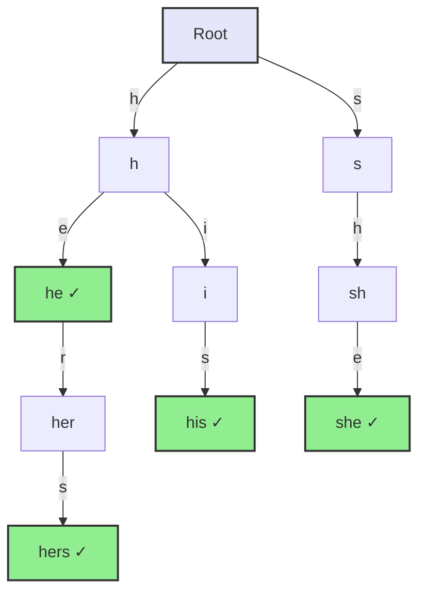
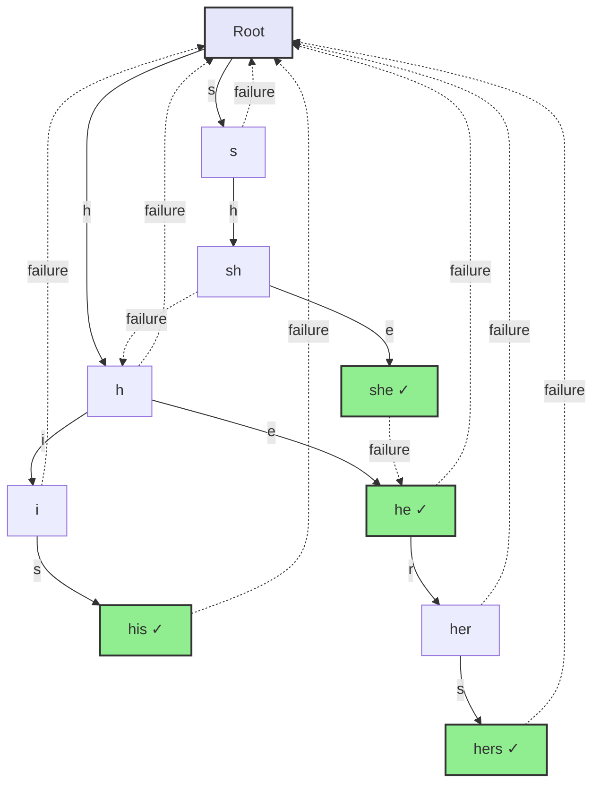
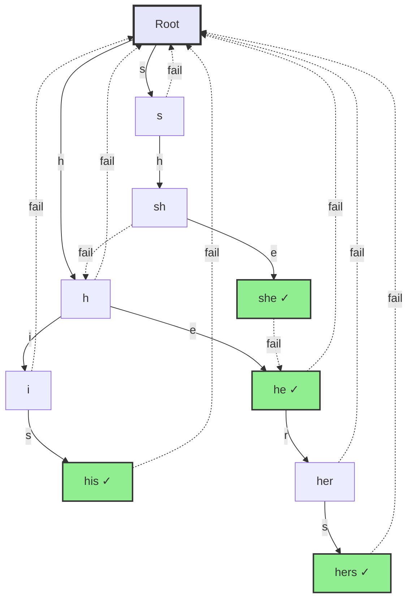

# Chapter 7: String Search Algorithms

## 7.1 Problem Statement & Motivation

### What Problem Do String Search Algorithms Solve?

Finding patterns in text is a fundamental operation in computing:

- **Text Processing**: Search and replace in documents, code editors
- **Data Mining**: Finding keywords in large datasets
- **Bioinformatics**: DNA sequence matching, protein pattern search
- **Network Security**: Intrusion detection, virus scanning
- **Search Engines**: Keyword matching in web pages

**Naive Approaches and Their Limitations**:

- **Brute Force**: Check every position → O(n×m) time complexity
- **Simple Loop**: No optimization, redundant comparisons
- **Character-by-Character**: Doesn't leverage pattern structure

**The String Search Solution**: Advanced algorithms optimize pattern matching by preprocessing the pattern, skipping impossible positions, and leveraging pattern structure to achieve O(n+m) or even sublinear performance.

Reach for an advanced algorithm when pattern matching is performance-critical, the text is large, or the same pattern (or many patterns) is searched repeatedly — text editors (Ctrl+F), search engines, virus scanners, DNA analysis, log scanning, and network packet inspection all qualify. For very small texts (< 100 characters), very short patterns (< 5 characters), or a single one-off search, a plain substring scan is fine: the preprocessing cost of advanced algorithms is not worth it. The core trade-off is preprocessing time and space in exchange for faster search.

## 7.2 Conceptual Overview

**String Search** is the process of finding all occurrences of a pattern string within a text string. It's one of the most fundamental operations in text processing.

### Intuitive Explanation

Think of string search like finding a word in a book:
- **Text**: The entire book
- **Pattern**: The word you're looking for
- **Naive Approach**: Check every word sequentially
- **Optimized Approach**: Use index, skip impossible positions, leverage word structure

### Key Concepts

- **Text (T)**: The string in which we search for patterns (length n)
- **Pattern (P)**: The string we want to find (length m)
- **Match**: An occurrence of the pattern in the text
- **Prefix**: A substring starting from the beginning of a string
- **Suffix**: A substring ending at the end of a string
- **Overlap**: When pattern prefixes match suffixes (used in KMP)

### Problem Statement

Given a text string `T` of length `n` and a pattern string `P` of length `m`, find all occurrences of `P` in `T`.

### Algorithm Categories

1. **Naive Algorithms**: Simple, check every position (O(n×m))
2. **Hash-Based**: Use rolling hash (Rabin-Karp, O(n+m) average)
3. **Automaton-Based**: Build finite automaton (KMP, Aho-Corasick, O(n+m))
4. **Skip-Based**: Skip impossible positions (Boyer-Moore, O(n/m) best case)
5. **Suffix-Based**: Preprocess text (Suffix Tree/Array, O(n+m) preprocessing)

## 7.3 Abstract Model & Invariants

### Abstract Model

A string search problem consists of:
- **Text T**: Sequence of characters of length n
- **Pattern P**: Sequence of characters of length m
- **Match Function**: `match(T, i, P)` returns true if `T[i...i+m-1] == P[0...m-1]`
- **Result Set**: All positions i where match(T, i, P) is true

### Core Invariants

These invariants must **always** hold for string search algorithms to be correct:

#### 1. Completeness Invariant

```
For all positions i where T[i...i+m-1] == P[0...m-1]:
  i is in the result set
```

**Meaning**: All matches are found, no matches are missed.

#### 2. Correctness Invariant

```
For all positions i in the result set:
  T[i...i+m-1] == P[0...m-1]
```

**Meaning**: All reported positions are actual matches, no false positives.

#### 3. Position Range Invariant

```
For all positions i checked:
  0 ≤ i ≤ n - m
```

**Meaning**: Only valid positions are checked (pattern must fit in remaining text).

#### 4. Comparison Invariant

```
For position i, comparison checks:
  T[i+j] == P[j] for all j in [0, m-1]
```

**Meaning**: Character-by-character comparison is performed correctly.

### Algorithm-Specific Invariants

#### KMP Algorithm Invariants

1. **LPS (Longest Proper Prefix which is also Suffix) Invariant**:
   - `lps[i]` = length of longest proper prefix of `P[0...i]` that is also a suffix
   - Used to skip impossible positions

2. **Skip Invariant**:
   - When mismatch at position `j` in pattern, skip to position `lps[j-1]`
   - Preserves already-matched prefix

#### Boyer-Moore Algorithm Invariants

1. **Bad Character Rule Invariant**:
   - If mismatch at `T[i+j]` and `P[j]`, skip to align `T[i+j]` with last occurrence in pattern
   - Never skips past a possible match

2. **Good Suffix Rule Invariant**:
   - If suffix of pattern matches, skip to align matching suffix
   - Leverages pattern structure for larger skips

### Assumptions

1. **Character Comparison**: Characters can be compared for equality (O(1))
2. **Text Immutability**: Text doesn't change during search
3. **Pattern Immutability**: Pattern doesn't change during search
4. **Finite Alphabet**: Alphabet size is finite (affects hash-based algorithms)
5. **Valid Indices**: All array accesses are within bounds

## 7.4 Operations & Interface

String search algorithms support the following conceptual operations:

| Operation | Description | Precondition | Postcondition |
|-----------|-------------|--------------|---------------|
| `search(text, pattern)` | Find all occurrences | Both strings are valid | Returns list of match positions |
| `findFirst(text, pattern)` | Find first occurrence | Both strings are valid | Returns first match position or -1 |
| `findLast(text, pattern)` | Find last occurrence | Both strings are valid | Returns last match position or -1 |
| `count(text, pattern)` | Count occurrences | Both strings are valid | Returns number of matches |
| `preprocess(pattern)` | Preprocess pattern | Pattern is valid | Pattern ready for fast search |
| `searchPreprocessed(text)` | Search with preprocessed pattern | Pattern preprocessed | Returns match positions |

### Behavioral Guarantees

1. **Completeness**: All matches are found
2. **Correctness**: All reported positions are actual matches
3. **Order**: Results are returned in order of occurrence (for some algorithms)
4. **Efficiency**: Time complexity meets algorithm guarantees

## 7.5 Time & Space Complexity

### Time Complexity Comparison

| Algorithm | Best Case | Average Case | Worst Case | Preprocessing |
|-----------|-----------|-------------|------------|--------------|
| **Naive** | O(n) | O(n×m) | O(n×m) | O(1) |
| **Rabin-Karp** | O(n+m) | O(n+m) | O(n×m) | O(m) |
| **KMP** | O(n+m) | O(n+m) | O(n+m) | O(m) |
| **Boyer-Moore** | O(n/m) | O(n) | O(n×m) | O(m) |
| **Z-Algorithm** | O(n+m) | O(n+m) | O(n+m) | O(m) |
| **Aho-Corasick** | O(n+m+z) | O(n+m+z) | O(n+m+z) | O(m) |

Where:
- `n` = text length
- `m` = pattern length
- `z` = total number of pattern occurrences

### Space Complexity

| Algorithm | Space Complexity | Notes |
|-----------|------------------|-------|
| **Naive** | O(1) | No extra space |
| **Rabin-Karp** | O(1) | Only hash values |
| **KMP** | O(m) | LPS array of size m |
| **Boyer-Moore** | O(m) | Bad character and good suffix tables |
| **Z-Algorithm** | O(n+m) | Z-array for text and pattern |
| **Aho-Corasick** | O(m) | Trie structure |

### Detailed Analysis

#### When Each Algorithm Excels

**Naive**: Small texts, short patterns, single search
**Rabin-Karp**: Multiple pattern search, streaming
**KMP**: General-purpose, guaranteed O(n+m)
**Boyer-Moore**: Large texts, long patterns, large alphabet
**Z-Algorithm**: When Z-array needed, pattern preprocessing
**Aho-Corasick**: Multiple patterns simultaneously

## 7.7 Implementation (Reference Language: C++)

Complete, compilable C++ implementations for every algorithm covered here — Naive, Rabin-Karp, KMP, Boyer-Moore, the Z-Algorithm, and Aho-Corasick — appear inline in Section 7.11, each paired with its walkthrough, complexity, and edge-case handling. Their correctness rests on the invariants defined in Section 7.3.

## 7.8 Correctness Argument

### Invariant Preservation

String search algorithms preserve the core invariants defined in Section 7.3:

#### 1. Completeness Invariant

**For All Algorithms**:
- All positions from 0 to n-m are considered (or skipped correctly)
- No valid match position is missed
- **Preserves**: All matches are found

**For KMP**:
- LPS array ensures we never skip past a possible match
- When mismatch occurs, we skip to longest matching prefix
- **Preserves**: No matches are missed

**For Boyer-Moore**:
- Bad character and good suffix rules ensure optimal skipping
- Skips are safe (never skip past matches)
- **Preserves**: All matches are found

#### 2. Correctness Invariant

**For All Algorithms**:
- Character-by-character comparison verifies matches
- Only positions with full pattern match are reported
- **Preserves**: No false positives

### Algorithm-Specific Correctness

#### KMP Correctness

**Why LPS Works**:
- When mismatch at position j, we know P[0...j-1] matched
- LPS[j-1] gives longest prefix that is also suffix of P[0...j-1]
- We can skip to align this prefix, preserving already-matched characters
- **Correct**: Never misses matches, optimal skipping

#### Boyer-Moore Correctness

**Why Bad Character Rule Works**:
- If T[i+j] doesn't match P[j], and T[i+j] appears in pattern at position k
- We can align T[i+j] with P[k] for next comparison
- **Correct**: Safe skipping, never skips past matches

**Why Good Suffix Rule Works**:
- If suffix of pattern matched, we can skip to align matching suffix
- Leverages pattern structure for larger skips
- **Correct**: Optimal skipping while preserving correctness

### Termination Guarantee

**Why algorithms terminate**:
- Text length n is finite
- Pattern length m is finite
- Each iteration makes progress (either match found or position advanced)
- Eventually all positions are checked or search completes

## 7.9 Edge Cases & Failure Modes

### Empty Strings

#### Empty Text

**Problem**: Text is empty string "".

**Edge Cases**:
- Pattern longer than text (m > n)
- Pattern same length as text (m == n == 0)
- Pattern shorter than text (but text is empty)

**Handling**:
```cpp
if (text.empty() || pattern.empty() || pattern.length() > text.length()) {
    return {};  // No matches possible
}
```

**Failure Mode**: Accessing text[0] when text is empty causes out-of-bounds error.

#### Empty Pattern

**Problem**: Pattern is empty string "".

**Edge Cases**:
- Should empty pattern match everywhere?
- Definition-dependent (usually matches at every position)

**Handling**:
```cpp
if (pattern.empty()) {
    // Return all positions or handle according to requirements
    return allPositions(text.length());
}
```

### Pattern Longer Than Text

**Problem**: Pattern length m > text length n.

**Edge Cases**:
- Pattern cannot fit in text
- No matches possible

**Handling**:
```cpp
if (pattern.length() > text.length()) {
    return {};  // No matches possible
}
```

**Failure Mode**: Accessing text[i+m-1] when i+m-1 >= n causes out-of-bounds error.

### Single Character Cases

#### Single Character Text

**Problem**: Text has only one character.

**Edge Cases**:
- Text = "A", Pattern = "A" → match at 0
- Text = "A", Pattern = "B" → no match
- Text = "A", Pattern = "AA" → no match (pattern too long)

#### Single Character Pattern

**Problem**: Pattern has only one character.

**Edge Cases**:
- Pattern = "A", find all 'A' in text
- Simple case, can optimize

### Repeated Characters

#### All Same Characters

**Problem**: Text or pattern has all same characters.

**Edge Cases**:
- Text = "AAAAA", Pattern = "AA" → matches at 0, 1, 2, 3
- Worst case for naive algorithm
- Best case for some optimized algorithms

#### Pattern is Substring of Text

**Problem**: Pattern appears multiple times, possibly overlapping.

**Edge Cases**:
- Overlapping matches: Text = "AAAA", Pattern = "AA" → matches at 0, 1, 2
- Non-overlapping matches: depends on algorithm

### Special Characters

#### Unicode and Multi-byte Characters

**Problem**: Text contains Unicode characters.

**Edge Cases**:
- Multi-byte UTF-8 characters
- Emoji, special symbols
- Character encoding issues

**Handling**:
- Use proper string encoding
- Character comparison must handle multi-byte characters
- Consider using library functions for Unicode

### Memory Issues

#### Very Large Texts

**Problem**: Text is extremely large (millions of characters).

**Edge Cases**:
- Memory constraints
- Cache performance
- Streaming required

**Handling**:
- Use streaming algorithms (Rabin-Karp with rolling hash)
- Process in chunks
- Consider memory-mapped files

#### Very Long Patterns

**Problem**: Pattern is very long.

**Edge Cases**:
- Preprocessing overhead significant
- Memory for tables/arrays
- Pattern may not fit in cache

### Common Failure Patterns

1. **Off-by-One Errors**: Accessing text[i+m] instead of text[i+m-1]
2. **Boundary Conditions**: Not checking i ≤ n-m before accessing
3. **Index Out of Bounds**: Accessing text[i+j] without checking i+j < n
4. **Empty String Handling**: Not handling empty text/pattern
5. **Unicode Issues**: Incorrect character comparison for multi-byte characters

## 7.10 Performance & System Considerations

### Cache Locality

#### Text Access Patterns

**Sequential Access** (Naive, KMP):
- Access text sequentially
- Good cache locality
- Prefetching works well

**Backward Access** (Boyer-Moore):
- Access pattern from right to left
- May cause cache misses
- Still better than naive due to skipping

**Random Access** (Hash-based):
- Hash table lookups
- Cache misses for table access
- But skips many positions

### Memory Access Optimization

#### Pattern Preprocessing

**KMP LPS Array**:
- Small array (size m)
- Fits in cache
- Fast access during search

**Boyer-Moore Tables**:
- Bad character table: O(alphabet_size)
- Good suffix table: O(m)
- May not fit in cache for large alphabets

### Branch Prediction

#### Conditional Branches

**Character Comparison**:
- `if (text[i] == pattern[j])` creates branch
- Well-predicted: ~1 cycle
- Mispredicted: ~10-20 cycles

**Optimization**:
- Use branchless comparisons when possible
- Unroll loops for small patterns
- Use SIMD for character comparison

### Real-World Performance

#### Algorithm Selection

**Small Texts (< 1KB)**:
- Naive algorithm often fastest
- Preprocessing overhead not worth it

**Medium Texts (1KB - 1MB)**:
- KMP or Boyer-Moore
- Preprocessing pays off

**Large Texts (> 1MB)**:
- Boyer-Moore (best case O(n/m))
- Or specialized algorithms

#### Production Systems

**grep/ripgrep**:
- Use Boyer-Moore variants
- Optimized for large files
- Multi-threaded for parallel search

**Text Editors**:
- Use KMP for Ctrl+F
- Fast, predictable performance
- Good for interactive use

## 7.11 String Search Algorithms (Detailed)

### 7.11.1 Naive String Search Algorithm

The naive approach checks every possible position in the text for the pattern. While simple to understand and implement, it's not the most efficient algorithm for large texts.

### Algorithm Description
1. Slide the pattern over the text one position at a time
2. At each position, compare the pattern with the corresponding substring
3. If all characters match, record the position as a match

### 7.2.1 Core Invariants

Understanding invariants ensures correct string search implementations.

**Core Invariants of Naive Search:**

1. **Position Invariant**: 
   - At position `i` in the text, we check if `text[i...i+m-1]` matches `pattern[0...m-1]`
   - All positions from `0` to `n-m` are checked exactly once

2. **Comparison Invariant**:
   - Character-by-character comparison is performed left-to-right
   - If any character mismatches, the position is rejected immediately
   - Only if all `m` characters match is the position recorded as a match

3. **Completeness Invariant**:
   - Every possible starting position is examined
   - No valid match position is skipped
   - The algorithm finds all occurrences of the pattern in the text

### Detailed Example Walkthrough

Let's trace through the naive algorithm with a concrete example:

**Text**: `"ABABCABABDABABCABAB"`
**Pattern**: `"ABABCABAB"`

#### Step-by-Step Execution:

At position 0 all nine characters match, giving a match. Position 1 fails immediately (`B≠A`). Position 2 matches four characters before failing at `C≠A`. Continuing this way, the pattern matches again at positions 5 and 10.

**Final Result**: Matches found at positions 0, 5, and 10.

### Visual Representation

```
Text:    A B A B C A B A B D A B A B C A B A B
Pattern: A B A B C A B A B
         ✓ ✓ ✓ ✓ ✓ ✓ ✓ ✓ ✓  ← Match at position 0

Text:    A B A B C A B A B D A B A B C A B A B
Pattern:   A B A B C A B A B
           ✗                 ← No match at position 1

Text:    A B A B C A B A B D A B A B C A B A B
Pattern:     A B A B C A B A B
             ✓ ✓ ✓ ✓ ✗         ← No match at position 2

... (continuing for all positions)

Text:    A B A B C A B A B D A B A B C A B A B
Pattern:           A B A B C A B A B
                   ✓ ✓ ✓ ✓ ✓ ✓ ✓ ✓ ✓  ← Match at position 5

Text:    A B A B C A B A B D A B A B C A B A B
Pattern:               A B A B C A B A B
                       ✓ ✓ ✓ ✓ ✓ ✓ ✓ ✓ ✓  ← Match at position 10
```

### Key Observations

1. **Systematic Approach**: The algorithm checks every possible starting position
2. **Character-by-Character Comparison**: At each position, it compares characters from left to right
3. **Early Termination**: As soon as a mismatch is found, it moves to the next position
4. **No Memory of Previous Matches**: Each position is checked independently
5. **Guaranteed Correctness**: If a pattern exists, the algorithm will find it

```cpp
#include <iostream>
#include <vector>
#include <string>
using namespace std;

// Naive string search - O(n*m) time complexity
vector<int> naiveSearch(const string& text, const string& pattern) {
    vector<int> matches;
    int n = text.length();
    int m = pattern.length();
    
    // Check every possible starting position
    for (int i = 0; i <= n - m; i++) {
        int j;
        // Check if pattern matches at position i
        for (j = 0; j < m; j++) {
            if (text[i + j] != pattern[j]) {
                break;
            }
        }
        
        // If we reached the end of pattern, it's a match
        if (j == m) {
            matches.push_back(i);
        }
    }
    
    return matches;
}

// Example usage
void demonstrateNaiveSearch() {
    string text = "ABABCABABDABABCABAB";
    string pattern = "ABABCABAB";
    
    vector<int> matches = naiveSearch(text, pattern);
    
    cout << "Text: " << text << endl;
    cout << "Pattern: " << pattern << endl;
    cout << "Matches found at positions: ";
    for (int pos : matches) {
        cout << pos << " ";
    }
    cout << endl;
}
```

### Time and Space Complexity
- **Time Complexity**: O(n*m) in the worst case
- **Space Complexity**: O(1) excluding the result array
- **Best Case**: O(n) when no matches are found
- **Worst Case**: O(n*m) when pattern appears at every position

### 7.11.2 Rabin-Karp Algorithm

The Rabin-Karp algorithm uses hashing to find the pattern. It's based on the idea that if two strings are equal, their hash values must also be equal. This algorithm is particularly useful for multiple pattern search and when dealing with rolling hash applications.

### Algorithm Description
1. Calculate hash value of the pattern
2. Calculate hash value of the first window of text
3. Slide the window one position at a time and update the hash
4. Compare hash values; if they match, verify character by character

### 7.3.1 Core Invariants

**Core Invariants of Rabin-Karp:**

1. **Hash Equality Invariant** (Probabilistic):
   - If two strings are equal, their hash values must be equal
   - If hash values are equal, the strings are likely equal (with high probability)
   - Hash collisions are possible but rare with good hash functions

2. **Rolling Hash Invariant**:
   - At position `i`, the hash of `text[i...i+m-1]` can be computed from the hash at position `i-1`
   - The rolling hash update maintains: `hash(text[i...i+m-1]) = f(hash(text[i-1...i+m-2]), text[i-1], text[i+m-1])`
   - This allows O(1) hash updates instead of O(m) recomputation

3. **Verification Invariant**:
   - When hash values match, character-by-character verification is performed
   - This ensures correctness despite potential hash collisions
   - False positives (hash match but strings differ) are caught during verification

### Detailed Example Walkthrough

Let's trace through the Rabin-Karp algorithm with a concrete example:

**Text**: `"3141592653589793"`
**Pattern**: `"26535"`

#### Hash Function
We'll use a simple hash function: `hash = (c₁ × 10^(m-1) + c₂ × 10^(m-2) + ... + cₘ) mod 101`

#### Step-by-Step Execution:

The pattern hash is `26535 mod 101 = 88`. The first window `"31415"` hashes to `12` — no match. Sliding the window updates the hash in O(1): subtract the leftmost digit's contribution, multiply through by the base, and fold in the new rightmost digit. Several later windows collide on hash `88` but fail character-by-character verification — a hash match is necessary, not sufficient. The window `"26535"` finally matches on both hash and verification.

**Final Result**: Match found at position 5.

### Visual Representation

```
Text:    3 1 4 1 5 9 2 6 5 3 5 8 9 7 9 3
Pattern: 2 6 5 3 5

Step 1:  [3 1 4 1 5] 9 2 6 5 3 5 8 9 7 9 3
         Hash: 12 ≠ 88 → No match

Step 2:  3 [1 4 1 5 9] 2 6 5 3 5 8 9 7 9 3
         Hash: 8 ≠ 88 → No match

Step 3:  3 1 [4 1 5 9 2] 6 5 3 5 8 9 7 9 3
         Hash: 88 = 88 → Verify: 4≠2 → No match

Step 4:  3 1 4 [1 5 9 2 6] 5 3 5 8 9 7 9 3
         Hash: 88 = 88 → Verify: 1≠2 → No match

Step 5:  3 1 4 1 [5 9 2 6 5] 3 5 8 9 7 9 3
         Hash: 88 = 88 → Verify: 5≠2 → No match

Step 6:  3 1 4 1 5 [9 2 6 5 3] 5 8 9 7 9 3
         Hash: 88 = 88 → Verify: 9≠2 → No match

Step 7:  3 1 4 1 5 9 [2 6 5 3 5] 8 9 7 9 3
         Hash: 88 = 88 → Verify: 2=2, 6=6, 5=5, 3=3, 5=5 → MATCH!
```

### Key Observations

1. **Hash Collisions**: Different strings can have the same hash value, requiring verification
2. **Rolling Hash**: Efficient hash update by removing leftmost character and adding rightmost
3. **False Positives**: Hash matches don't guarantee string matches
4. **Verification Step**: Always verify character-by-character when hashes match
5. **Efficiency**: Reduces comparisons from O(n×m) to O(n+m) on average

```cpp
#include <string>
#include <vector>
using namespace std;

class RabinKarp {
private:
    static const int BASE = 256;        // Alphabet size
    static const int MOD  = 1000000007; // Large prime keeps collisions rare

    long long power;  // BASE^(m-1) mod MOD, precomputed for the rolling update

    long long calculateHash(const string& str, int length) {
        long long hash = 0;
        for (int i = 0; i < length; i++) {
            hash = (hash * BASE + str[i]) % MOD;
        }
        return hash;
    }

    // Roll the window: drop oldChar's contribution, fold in newChar. O(1).
    long long recalculateHash(long long oldHash, char oldChar, char newChar) {
        long long newHash = (oldHash - oldChar * power % MOD + MOD) % MOD;
        newHash = (newHash * BASE + newChar) % MOD;
        return newHash;
    }

public:
    vector<int> search(const string& text, const string& pattern) {
        vector<int> matches;
        int n = text.length();
        int m = pattern.length();
        if (m == 0 || m > n) {
            return matches;
        }

        // Precompute BASE^(m-1) mod MOD modularly (never floating-point pow)
        power = 1;
        for (int i = 0; i < m - 1; i++) {
            power = (power * BASE) % MOD;
        }

        long long patternHash = calculateHash(pattern, m);
        long long textHash    = calculateHash(text, m);

        // Verify on hash hit to guard against collisions
        if (patternHash == textHash && text.compare(0, m, pattern) == 0) {
            matches.push_back(0);
        }

        for (int i = 1; i <= n - m; i++) {
            textHash = recalculateHash(textHash, text[i - 1], text[i + m - 1]);
            if (patternHash == textHash && text.compare(i, m, pattern) == 0) {
                matches.push_back(i);
            }
        }

        return matches;
    }
};
```

### Time and Space Complexity
- **Average Time Complexity**: O(n + m)
- **Worst Time Complexity**: O(n*m) due to hash collisions
- **Space Complexity**: O(1)
- **Best Case**: O(n + m) when no hash collisions occur

### 7.11.3 Knuth-Morris-Pratt (KMP) Algorithm

The KMP algorithm uses information from previous matches to avoid unnecessary comparisons. It preprocesses the pattern to create a failure function (LPS array) that helps skip characters that are guaranteed to match.

### Algorithm Description
1. Preprocess the pattern to create the Longest Proper Prefix which is also Suffix (LPS) array
2. Use the LPS array to skip characters that are guaranteed to match
3. When a mismatch occurs, use the LPS array to determine the next position to check

### 7.4.1 Core Invariants

**Core Invariants of KMP:**

1. **Prefix-Suffix Invariant** (Strong Invariant):
   - At position `i` in the text, the algorithm maintains that the prefix of length `lps[j]` of the pattern matches the suffix ending at position `i-1` in the text
   - When a mismatch occurs at `text[i]` and `pattern[j]`, we know that `text[i-lps[j]...i-1]` matches `pattern[0...lps[j]-1]`
   - This allows skipping `j - lps[j]` characters that are guaranteed to match

2. **LPS Array Invariant**:
   - `lps[i]` stores the length of the longest proper prefix of `pattern[0...i]` that is also a suffix
   - The LPS array is computed once during preprocessing and remains constant
   - This invariant enables efficient pattern matching without backtracking in the text

3. **Progress Invariant**:
   - The text pointer `i` never decreases (no backtracking)
   - The pattern pointer `j` may decrease (via LPS), but total progress is guaranteed
   - This ensures O(n) time complexity for the search phase

### Understanding the LPS Array

The LPS (Longest Proper Prefix which is also Suffix) array stores the length of the longest proper prefix that is also a suffix for each position in the pattern.

**Example**: Pattern `"ABABCABAB"`

Let's build the LPS array step by step:

```
Pattern: A B A B C A B A B
Index:   0 1 2 3 4 5 6 7 8
LPS:     0 0 1 2 0 1 2 3 4
```

#### LPS Array Construction

Each entry `LPS[i]` is the length of the longest proper prefix of `pattern[0..i]` that is also a suffix. Working left to right: `A`→0 and `AB`→0 (no prefix equals a suffix); `ABA`→1 (`A`); `ABAB`→2 (`AB`); `ABABC`→0 (the `C` breaks the run); then `ABABCA`→1, `ABABCAB`→2, `ABABCABA`→3, and `ABABCABAB`→4 as the `ABAB` prefix re-accumulates. These values are exactly the fallback positions the search uses on a mismatch.

### Detailed Example Walkthrough

Let's trace through the KMP algorithm with a concrete example:

**Text**: `"ABABDABACDABABCABAB"`
**Pattern**: `"ABABCABAB"`

#### Step-by-Step Execution:

Starting at `i=0, j=0`, the pattern matches `ABAB` (through `i=4, j=4`) before hitting `D≠C`. Rather than restart, KMP consults `LPS[3]=2` and resets `j=2`, leaving the text pointer `i` fixed — the already-matched `AB` prefix is reused. `D` still fails against `pattern[2]` and then `pattern[0]`, so `i` advances. The scan realigns at `i=10`, where all nine characters match. Crucially, `i` never moves backward.

**Final Result**: Match found at position 10.

### Visual Representation

```
Text:    A B A B D A B A C D A B A B C A B A B
Pattern: A B A B C A B A B
         ✓ ✓ ✓ ✓ ✗
         ↑ Mismatch at position 4, use LPS[3]=2

Text:    A B A B D A B A C D A B A B C A B A B
Pattern:     A B A B C A B A B
               ✗
               ↑ Mismatch at position 2, use LPS[1]=0

Text:    A B A B D A B A C D A B A B C A B A B
Pattern:       A B A B C A B A B
               ✗
               ↑ Mismatch at position 0, move to next text position

Text:    A B A B D A B A C D A B A B C A B A B
Pattern:         A B A B C A B A B
                 ✓ ✓ ✓ ✓ ✓ ✓ ✓ ✓ ✓
                 ↑ Match found at position 10
```

### Key Observations

1. **LPS Array**: Precomputed to avoid redundant comparisons
2. **Smart Skipping**: Uses pattern structure to skip characters that are guaranteed to match
3. **No Backtracking**: Text pointer never moves backward
4. **Efficient**: O(n+m) time complexity with O(m) space
5. **Pattern Preprocessing**: One-time cost that pays off for multiple searches

```cpp
class KMPAlgorithm {
private:
    // Build the Longest Proper Prefix which is also Suffix array
    vector<int> buildLPS(const string& pattern) {
        int m = pattern.length();
        vector<int> lps(m, 0);
        int len = 0;  // Length of the previous longest prefix suffix
        int i = 1;
        
        while (i < m) {
            if (pattern[i] == pattern[len]) {
                len++;
                lps[i] = len;
                i++;
            } else {
                if (len != 0) {
                    len = lps[len - 1];
                } else {
                    lps[i] = 0;
                    i++;
                }
            }
        }
        
        return lps;
    }
    
public:
    vector<int> search(const string& text, const string& pattern) {
        vector<int> matches;
        int n = text.length();
        int m = pattern.length();
        
        if (m == 0) {
            return matches;
        }
        
        // Build LPS array
        vector<int> lps = buildLPS(pattern);
        
        int i = 0;  // Index for text
        int j = 0;  // Index for pattern
        
        while (i < n) {
            if (pattern[j] == text[i]) {
                i++;
                j++;
            }
            
            if (j == m) {
                matches.push_back(i - j);
                j = lps[j - 1];
            } else if (i < n && pattern[j] != text[i]) {
                if (j != 0) {
                    j = lps[j - 1];
                } else {
                    i++;
                }
            }
        }
        
        return matches;
    }
    
    // Count occurrences of pattern in text
    int countOccurrences(const string& text, const string& pattern) {
        vector<int> matches = search(text, pattern);
        return matches.size();
    }
};
```

### Time and Space Complexity
- **Time Complexity**: O(n + m)
- **Space Complexity**: O(m) for the LPS array
- **Preprocessing Time**: O(m)
- **Searching Time**: O(n)

### 7.11.4 Boyer-Moore Algorithm

The Boyer-Moore algorithm is often the fastest in practice for large texts. It uses two heuristics: the Bad Character Rule and the Good Suffix Rule. The algorithm compares the pattern with the text from right to left, which allows it to skip many characters when mismatches occur.

### Algorithm Description
1. Compare pattern with text from right to left
2. When a mismatch occurs, use the Bad Character Rule to shift the pattern
3. Use the Good Suffix Rule for additional optimization

### 7.5.1 Core Invariants

**Core Invariants of Boyer-Moore:**

1. **Right-to-Left Comparison Invariant**:
   - The pattern is compared with the text from right to left
   - This allows discovering mismatches earlier when they occur near the end of the pattern
   - Early mismatch detection enables larger shifts

2. **Bad Character Rule Invariant**:
   - When a mismatch occurs at `text[i+j]` and `pattern[j]`, the bad character `text[i+j]` is not in the pattern suffix `pattern[j+1...m-1]`
   - The pattern can be shifted to align the last occurrence of `text[i+j]` in the pattern (if it exists) with `text[i+j]`
   - If the bad character doesn't exist in the pattern, the entire pattern can be shifted past position `i+j`

3. **Good Suffix Rule Invariant**:
   - When a mismatch occurs, the suffix `pattern[j+1...m-1]` matched the text
   - The pattern can be shifted to align the longest suffix of `pattern[j+1...m-1]` that matches a prefix of the pattern
   - This ensures we don't miss potential matches by shifting too far

### Understanding the Bad Character Rule

The Bad Character Rule states that when a mismatch occurs, we can shift the pattern to align the last occurrence of the mismatched character in the pattern with the mismatched character in the text.

**Example**: Pattern `"TATGTG"`

Let's build the bad character table:

```
Pattern: T A T G T G
Index:   0 1 2 3 4 5
Bad Char Table:
T: 4 (last occurrence at index 4)
A: 1 (last occurrence at index 1)
G: 5 (last occurrence at index 5)
```

### Understanding the Good Suffix Rule

The Good Suffix Rule states that when a mismatch occurs, we can shift the pattern to align the longest suffix of the pattern that matches a prefix of the pattern.

**Example**: Pattern `"TATGTG"`

Let's build the good suffix table:

```
Pattern: T A T G T G
Index:   0 1 2 3 4 5
Good Suffix Table:
Position 5: "G" → No good suffix
Position 4: "TG" → No good suffix
Position 3: "GTG" → No good suffix
Position 2: "TGTG" → No good suffix
Position 1: "ATGTG" → No good suffix
Position 0: "TATGTG" → No good suffix
```

### Detailed Example Walkthrough

Let's trace through the Boyer-Moore algorithm with a concrete example:

**Text**: `"GCAATGCCTATGTGACC"`
**Pattern**: `"TATGTG"`

#### Step-by-Step Execution:

Comparison runs right-to-left. At `i=0` the last two characters (`G`, `T`) match before `text[3]='A'` mismatches `pattern[3]='G'`; the bad-character rule shifts by `max(1, 3 - badChar['A']) = 2`. At the next alignment `text[7]='C'` mismatches and, since `C` is absent from the pattern, the whole pattern jumps past it. The alignment at `i=8` then matches all six characters right-to-left.

**Final Result**: Match found at position 8.

### Visual Representation

The algorithm successfully finds the pattern "TATGTG" at position 8 in the text "GCAATGCCTATGTGACC". The right-to-left comparison allows Boyer-Moore to skip characters efficiently when mismatches occur early in the pattern.

### Key Observations

1. **Right-to-Left Comparison**: Allows for larger shifts when mismatches occur
2. **Bad Character Rule**: Shifts pattern based on the last occurrence of the mismatched character
3. **Good Suffix Rule**: Additional optimization using pattern structure
4. **Efficiency**: Often skips many characters, making it very fast in practice
5. **Worst Case**: Can still be O(n×m) in pathological cases

```cpp
class BoyerMoore {
private:
    // Bad Character Rule: last index at which each byte occurs in the pattern
    vector<int> buildBadCharTable(const string& pattern) {
        vector<int> badChar(256, -1);
        for (int i = 0; i < (int)pattern.length(); i++) {
            badChar[(unsigned char)pattern[i]] = i;  // cast avoids negative index on non-ASCII
        }
        return badChar;
    }

public:
    // Boyer-Moore with the bad-character heuristic. The good-suffix rule can be
    // layered on for a guaranteed better worst case; it is omitted here for clarity.
    vector<int> search(const string& text, const string& pattern) {
        vector<int> matches;
        int n = text.length();
        int m = pattern.length();
        if (m == 0 || m > n) {
            return matches;
        }

        vector<int> badChar = buildBadCharTable(pattern);
        int s = 0;  // Alignment of the pattern against the text

        while (s <= n - m) {
            int j = m - 1;
            while (j >= 0 && pattern[j] == text[s + j]) {
                j--;
            }

            if (j < 0) {
                matches.push_back(s);
                s += (s + m < n) ? m - badChar[(unsigned char)text[s + m]] : 1;
            } else {
                s += max(1, j - badChar[(unsigned char)text[s + j]]);
            }
        }

        return matches;
    }
};
```

### Time and Space Complexity
- **Best Case Time Complexity**: O(n/m)
- **Worst Case Time Complexity**: O(n*m)
- **Average Time Complexity**: O(n)
- **Space Complexity**: O(m)

### 7.11.5 Z-Algorithm

The Z-Algorithm finds all occurrences of a pattern in a text by constructing a Z-array that contains the length of the longest substring starting from each position that is also a prefix.

### Algorithm Description
1. Create a combined string: pattern + '$' + text
2. Build Z-array for the combined string
3. Find positions where Z-value equals pattern length

```cpp
class ZAlgorithm {
private:
    // Build Z-array for a given string
    vector<int> buildZArray(const string& str) {
        int n = str.length();
        vector<int> z(n, 0);
        int l = 0, r = 0;  // Left and right boundaries of the Z-box
        
        for (int i = 1; i < n; i++) {
            if (i <= r) {
                z[i] = min(r - i + 1, z[i - l]);
            }
            
            while (i + z[i] < n && str[z[i]] == str[i + z[i]]) {
                z[i]++;
            }
            
            if (i + z[i] - 1 > r) {
                l = i;
                r = i + z[i] - 1;
            }
        }
        
        return z;
    }
    
public:
    vector<int> search(const string& text, const string& pattern) {
        vector<int> matches;
        int m = pattern.length();
        int n = text.length();
        
        if (m == 0) {
            return matches;
        }
        
        // Create combined string: pattern + '$' + text
        string combined = pattern + '$' + text;
        vector<int> z = buildZArray(combined);
        
        // Find positions where Z-value equals pattern length
        for (int i = m + 1; i < combined.length(); i++) {
            if (z[i] == m) {
                matches.push_back(i - m - 1);
            }
        }
        
        return matches;
    }
    
    // Find all occurrences of pattern in text (including overlapping)
    vector<int> findAllOccurrences(const string& text, const string& pattern) {
        return search(text, pattern);
    }
    
    // Count occurrences
    int countOccurrences(const string& text, const string& pattern) {
        vector<int> matches = search(text, pattern);
        return matches.size();
    }
};
```

### Time and Space Complexity
- **Time Complexity**: O(n + m)
- **Space Complexity**: O(n + m)
- **Preprocessing Time**: O(n + m)
- **Searching Time**: O(n + m)

### 7.11.6 Aho-Corasick Algorithm

The Aho-Corasick algorithm efficiently searches for multiple patterns simultaneously using a finite automaton (trie with failure links). It processes the text in a single pass, finding all occurrences of all patterns in O(n + m + z) time, where n is text length, m is total pattern length, and z is the number of matches.

**Reference**: Based on the algorithm described in [cp-algorithms.com](https://cp-algorithms.com/string/aho_corasick.html).

### Algorithm Description
1. **Build a trie** from all patterns
2. **Add failure links** (suffix links) to create an automaton
3. **Traverse the automaton** while reading the text character by character

### Understanding the Trie Construction

First, we build a trie containing all patterns. Each node represents a prefix of one or more patterns.

**Example**: Patterns = {"he", "she", "his", "hers"}



**Trie Structure**:
- Root node (empty string)
- Each edge represents a character
- Nodes marked with ✓ indicate complete patterns
- Path from root to a node represents a prefix

### Understanding Failure Links (Suffix Links)

Failure links allow the automaton to efficiently handle mismatches. For a node representing string `s`, the failure link points to the longest proper suffix of `s` that is also a prefix of some pattern.

**Key Properties**:
- Failure link of root is root itself
- Failure links form a tree structure
- Following failure links never increases the matched length
- All failure links eventually lead to root

**Example**: Building failure links for patterns {"he", "she", "his", "hers"}



**Failure Link Rules** (following [cp-algorithms.com](https://cp-algorithms.com/string/aho_corasick.html)):
1. **Root's children**: Failure link points to root
2. **Other nodes**: For node `v` with parent `p` and character `c`:
   - Follow parent's failure link to find longest suffix
   - If that node has an edge labeled `c`, use it
   - Otherwise, continue following failure links until root
   - Set `failure[v] = go(failure[p], c)`

**Step-by-Step Failure Link Construction**:

**Step 1: First level (depth 1)**
- Node 'h': failure → root (no proper suffix)
- Node 's': failure → root (no proper suffix)

**Step 2: Second level (depth 2)**
- Node 'he': parent='h', char='e'
  - failure['h'] = root
  - root has no 'e' edge → failure['he'] = root
- Node 'hi': parent='h', char='i'
  - failure['h'] = root
  - root has no 'i' edge → failure['hi'] = root
- Node 'sh': parent='s', char='h'
  - failure['s'] = root
  - root has 'h' edge → failure['sh'] = node 'h'

**Step 3: Third level (depth 3)**
- Node 'she': parent='sh', char='e'
  - failure['sh'] = 'h'
  - 'h' has 'e' edge → failure['she'] = node 'he'
- Node 'his': parent='hi', char='s'
  - failure['hi'] = root
  - root has no 's' edge → failure['his'] = root
- Node 'her': parent='he', char='r'
  - failure['he'] = root
  - root has no 'r' edge → failure['her'] = root

**Step 4: Fourth level (depth 4)**
- Node 'hers': parent='her', char='s'
  - failure['her'] = root
  - root has no 's' edge → failure['hers'] = root

### Complete Automaton with Failure Links

The final automaton combines the trie with failure links, enabling efficient pattern matching:



**Key Insight**: Failure links allow the automaton to continue matching even after a mismatch, by following the longest suffix that matches a prefix of some pattern. This is similar to the LPS array in KMP, but extended to multiple patterns.

### 7.7.1 Core Invariants

**Core Invariants of Aho-Corasick:**

1. **Trie Invariant**:
   - All patterns are stored in the trie with paths from root to leaf nodes
   - Each node represents a unique prefix of one or more patterns
   - Output nodes mark the end of complete patterns

2. **Failure Link Invariant**:
   - For any node `v` representing string `s`, `failure[v]` points to the longest proper suffix of `s` that is also a prefix of some pattern
   - Failure links form a tree structure (all paths lead to root)
   - Following failure links never increases the matched length

3. **Automaton Transition Invariant**:
   - From any state `v` and character `c`, the transition `go(v, c)` either:
     - Follows a direct edge if it exists in the trie
     - Follows failure links until finding a valid transition or reaching root
   - This ensures we always find the longest matching prefix

4. **Output Invariant**:
   - Each node stores all patterns that end at that node (via direct match or failure links)
   - Output sets are merged during failure link construction
   - All matches are found by checking the output set at each state

### Step-by-Step Example: Searching Text "shers"

Let's trace through searching for patterns {"he", "she", "his", "hers"} in text "shers":

**Initial State**: current = root, i = 0

**Step 1: Process 's' (i=0)**
```
Text: shers
      ↑
Current: root → go(root, 's') = node 's'
Output: none
```

**Step 2: Process 'h' (i=1)**
```
Text: shers
       ↑
Current: 's' → go('s', 'h') = node 'sh'
Output: none
```

**Step 3: Process 'e' (i=2)**
```
Text: shers
        ↑
Current: 'sh' → go('sh', 'e') = node 'she'
Output: {'she'} ✓ (found at position 0)
```

**Step 4: Process 'r' (i=3)**
```
Text: shers
         ↑
Current: 'she' → go('she', 'r')
  - 'she' has no 'r' edge
  - Follow failure: failure['she'] = 'he'
  - 'he' has no 'r' edge
  - Follow failure: failure['he'] = root
  - root has no 'r' edge
  - Current = root
Output: none
```

**Step 5: Process 's' (i=4)**
```
Text: shers
          ↑
Current: root → go(root, 's') = node 's'
Output: none
```

**Result**: Found "she" at position 0.

### Implementation

```cpp
#include <queue>
#include <unordered_map>
using namespace std;

class AhoCorasick {
private:
    struct TrieNode {
        unordered_map<char, TrieNode*> children;
        TrieNode* failure;
        vector<int> output;  // Pattern indices ending at this node
        bool isEnd;
        
        TrieNode() : failure(nullptr), isEnd(false) {}
    };
    
    TrieNode* root;
    vector<string> patterns;
    
    // Build the trie
    void buildTrie() {
        root = new TrieNode();
        
        for (int i = 0; i < patterns.size(); i++) {
            TrieNode* current = root;
            
            for (char c : patterns[i]) {
                if (current->children.find(c) == current->children.end()) {
                    current->children[c] = new TrieNode();
                }
                current = current->children[c];
            }
            
            current->isEnd = true;
            current->output.push_back(i);
        }
    }
    
    // Build failure links using BFS
    void buildFailureLinks() {
        queue<TrieNode*> q;
        
        // Initialize failure links for first level
        for (auto& pair : root->children) {
            pair.second->failure = root;
            q.push(pair.second);
        }
        
        while (!q.empty()) {
            TrieNode* current = q.front();
            q.pop();
            
            for (auto& pair : current->children) {
                char c = pair.first;
                TrieNode* child = pair.second;
                q.push(child);
                
                TrieNode* failure = current->failure;
                
                while (failure != nullptr && failure->children.find(c) == failure->children.end()) {
                    failure = failure->failure;
                }
                
                if (failure != nullptr) {
                    child->failure = failure->children[c];
                } else {
                    child->failure = root;
                }
                
                // Merge output
                child->output.insert(child->output.end(), 
                                   child->failure->output.begin(), 
                                   child->failure->output.end());
            }
        }
    }
    
public:
    AhoCorasick(const vector<string>& patterns) : patterns(patterns) {
        buildTrie();
        buildFailureLinks();
    }
    
    // Search for all patterns in text
    unordered_map<string, vector<int>> search(const string& text) {
        unordered_map<string, vector<int>> results;
        TrieNode* current = root;
        
        for (int i = 0; i < text.length(); i++) {
            char c = text[i];
            
            while (current != nullptr && current->children.find(c) == current->children.end()) {
                current = current->failure;
            }
            
            if (current != nullptr) {
                current = current->children[c];
            } else {
                current = root;
            }
            
            // Check for matches
            for (int patternIndex : current->output) {
                string pattern = patterns[patternIndex];
                int startPos = i - pattern.length() + 1;
                results[pattern].push_back(startPos);
            }
        }
        
        return results;
    }
    
    ~AhoCorasick() {
        // Clean up memory (simplified)
        delete root;
    }
};
```

### Time and Space Complexity

**Preprocessing** (based on [cp-algorithms.com](https://cp-algorithms.com/string/aho_corasick.html)):
- **Trie Construction**: O(m) where m is total length of all patterns
- **Failure Link Construction**: O(m × k) where k is alphabet size, or O(m) with memoization
- **BFS-based Construction**: O(n × k) where n is number of nodes, or O(n log k) with persistent arrays

**Searching**:
- **Time Complexity**: O(n + m + z) where:
  - n = text length
  - m = total pattern length
  - z = number of matches found
- **Space Complexity**: O(m) for the automaton

## 7.12 Performance Comparison

### Comprehensive Algorithm Comparison Table

| Algorithm | Best Case | Average Case | Worst Case | Space Complexity | Preprocessing | When to Use |
|-----------|-----------|--------------|------------|------------------|--------------|-------------|
| **Naive** | O(n) | O(n*m) | O(n*m) | O(1) | None | • Small inputs (< 1000 chars)<br>• Short patterns (< 10 chars)<br>• Single search<br>• Teaching/learning |
| **Rabin-Karp** | O(n+m) | O(n+m) | O(n*m) | O(1) | O(m) | • Multiple pattern search<br>• Streaming/online search<br>• Plagiarism detection<br>• When hash collisions are acceptable |
| **KMP** | O(n+m) | O(n+m) | O(n+m) | O(m) | O(m) | • Single pattern, repeated searches<br>• General-purpose search<br>• DNA sequence matching<br>• Text editors (Ctrl+F) |
| **Boyer-Moore** | O(n/m) | O(n) | O(n*m) | O(m) | O(m) | • Large texts (> 1M chars)<br>• Long patterns (> 100 chars)<br>• Large alphabet (text, Unicode)<br>• Production systems (grep, ripgrep) |
| **Z-Algorithm** | O(n+m) | O(n+m) | O(n+m) | O(n+m) | O(m) | • Pattern preprocessing<br>• Finding all occurrences<br>• String periodicity<br>• When Z-array is needed |
| **Aho-Corasick** | O(n+m+z) | O(n+m+z) | O(n+m+z) | O(m) | O(m) | • Multiple patterns simultaneously<br>• Intrusion detection systems<br>• Virus scanners<br>• Keyword filtering<br>• Hundreds/thousands of patterns |

**Legend**:
- `n` = text length
- `m` = pattern length
- `z` = total number of pattern occurrences

### Detailed Complexity Analysis

#### Time Complexity Breakdown

**Naive Algorithm**:
- **Best Case**: O(n) - Pattern not found, first character mismatch at each position
- **Average Case**: O(n*m) - Random text and pattern
- **Worst Case**: O(n*m) - Pattern like "AAA" in text "AAAAA...A"

**Rabin-Karp Algorithm**:
- **Best Case**: O(n+m) - No hash collisions, pattern found early
- **Average Case**: O(n+m) - Good hash function, few collisions
- **Worst Case**: O(n*m) - Many hash collisions requiring character-by-character verification

**KMP Algorithm**:
- **Best Case**: O(n+m) - Pattern found early
- **Average Case**: O(n+m) - Consistent performance
- **Worst Case**: O(n+m) - Guaranteed, no degradation

**Boyer-Moore Algorithm**:
- **Best Case**: O(n/m) - Large skips, pattern not found or found at end
- **Average Case**: O(n) - Sublinear in practice for large alphabets
- **Worst Case**: O(n*m) - Pattern like "AAA" in text "AAAAA...A" (bad character rule ineffective)

**Z-Algorithm**:
- **Best Case**: O(n+m) - Pattern found early
- **Average Case**: O(n+m) - Consistent performance
- **Worst Case**: O(n+m) - Guaranteed

**Aho-Corasick Algorithm**:
- **Best Case**: O(n+m+z) - Few matches
- **Average Case**: O(n+m+z) - Moderate matches
- **Worst Case**: O(n+m+z) - Many matches (z can be large)

#### Space Complexity Breakdown

- **Naive**: O(1) - No extra space beyond input
- **Rabin-Karp**: O(1) - Only hash values stored
- **KMP**: O(m) - LPS array of size m
- **Boyer-Moore**: O(m) - Bad character table and good suffix table
- **Z-Algorithm**: O(n+m) - Z-array for text and pattern
- **Aho-Corasick**: O(m) - Trie structure, where m is total pattern length

### Performance Characteristics Summary

**Fastest in Practice**:
1. **Boyer-Moore** - Often fastest for large texts with large alphabets
2. **KMP** - Consistent and reliable
3. **Aho-Corasick** - Best for multiple patterns

**Most Memory Efficient**:
1. **Naive** - O(1) space
2. **Rabin-Karp** - O(1) space
3. **KMP/Boyer-Moore** - O(m) space

**Most Reliable**:
1. **KMP** - Guaranteed O(n+m), no worst-case degradation
2. **Z-Algorithm** - Guaranteed O(n+m)
3. **Aho-Corasick** - Guaranteed O(n+m+z)

## 7.13 Choosing the Right String Search Algorithm

Selecting the appropriate algorithm depends on your specific requirements. Here's a decision framework based on practical tradeoffs:

### Decision Factors

**1. Input Size**
- **Small inputs (< 1000 characters)**: Use **Naive** search. The overhead of preprocessing doesn't pay off.
- **Medium inputs (1K-1M characters)**: **KMP** or **Boyer-Moore** depending on pattern characteristics.
- **Large inputs (> 1M characters)**: **Boyer-Moore** often performs best in practice due to sublinear average case.

**2. Pattern Characteristics**
- **Short patterns (< 10 characters)**: **Naive** or **KMP** (preprocessing overhead is minimal).
- **Long patterns (> 100 characters)**: **Boyer-Moore** excels with its right-to-left comparison.
- **Patterns with many repeated substrings**: **KMP** leverages the LPS array effectively.

**3. Search Frequency**
- **Single search**: Consider preprocessing cost. **Naive** may be fastest overall.
- **Repeated searches with same pattern**: **KMP** or **Boyer-Moore** (preprocess once, search many times).
- **Multiple different patterns**: **Rabin-Karp** or **Aho-Corasick** for multiple pattern search.

**4. Alphabet Size**
- **Small alphabet (DNA: 4 characters)**: **Boyer-Moore** Bad Character Rule is less effective.
- **Large alphabet (Unicode, text)**: **Boyer-Moore** performs exceptionally well.

**5. Memory Constraints**
- **Tight memory**: **Naive** or **Rabin-Karp** (O(1) space).
- **Memory available**: **KMP** or **Boyer-Moore** (O(m) space for preprocessing).

### Practical Recommendations

**Small inputs → Naive**
- Simplest to implement and understand
- No preprocessing overhead
- Sufficient for most small-scale applications

**Single pattern, repeated searches → KMP**
- Consistent O(n+m) performance
- No worst-case degradation
- Good general-purpose choice

**Large alphabet, long patterns → Boyer-Moore**
- Often fastest in practice
- Sublinear average case (O(n/m))
- Used in production systems like `grep` and `ripgrep`

**Multiple patterns or probabilistic tolerance → Rabin-Karp**
- Efficient for multiple pattern search
- Rolling hash enables streaming applications
- Acceptable if occasional false positives are tolerable

**Many patterns simultaneously → Aho-Corasick**
- Optimal for multiple pattern search
- Used in intrusion detection systems, virus scanners
- Efficient when searching for hundreds or thousands of patterns

### Real-World Usage

**Production Systems:**
- **`grep`/`ripgrep`**: Use Boyer-Moore variants for single pattern search
- **Log scanning pipelines**: Often use KMP or Boyer-Moore depending on log size
- **Search indexing**: Use Aho-Corasick for multi-keyword search
- **Stream processing**: Rabin-Karp with rolling hash for continuous pattern matching

## 7.14 Concurrency Considerations

String search algorithms appear frequently in concurrent systems: log scanning, stream processing, and indexing pipelines. Understanding concurrent access patterns is essential for thread-safe implementations.

This section applies the concurrency fundamentals from [Chapter 3.5](03.5-concurrency-fundamentals.md). See Section 3.5.3 for invariant-based reasoning.

### 7.10.1 Shared-State Invariants

**Core String Search Invariants** (see Section 3.5.3):
1. **Pattern Invariant**: "The pattern remains constant during search"
2. **Text Invariant**: "The text being searched remains consistent (or changes are handled)"
3. **Match Position Invariant**: "Match positions are correctly identified and reported"

**What Must Not Be Observed Half-Updated**:
- Pattern modifications during search
- Text modifications during search (for mutable text)
- Partial match results

### 7.10.2 Stateless String Search is Embarrassingly Parallel

**Key Insight**: Most string search algorithms are **stateless** during the search phase (after preprocessing).

**Naive, KMP, Boyer-Moore Search Phase**:
- Each position in the text can be checked independently
- No shared mutable state during search
- Perfect for parallelization

**Example: Parallel Naive Search**
```cpp
// Each thread processes a chunk of text
void parallelNaiveSearch(const string& text, const string& pattern, 
                         int start, int end, vector<int>& results) {
    for (int i = start; i <= end - pattern.length(); i++) {
        if (text.substr(i, pattern.length()) == pattern) {
            results.push_back(i);
        }
    }
}
```

**Invariant Preserved**: Each thread operates on disjoint text regions, maintaining the **Match Position Invariant**.

### 7.10.3 Shared Pattern Preprocessing Must Be Immutable

**Problem**: Pattern preprocessing (LPS array, bad character table) is shared across threads.

**Invariant Threatened**: If preprocessing data is modified during search, the **Pattern Invariant** is violated.

**Solution**: Make preprocessing data **immutable** after construction:
```cpp
class ThreadSafeKMP {
    vector<int> lps;  // Immutable after construction
    string pattern;   // Immutable after construction
    
public:
    ThreadSafeKMP(const string& p) : pattern(p) {
        // Preprocess once, never modify
        buildLPS();
    }
    
    // Multiple threads can safely call search concurrently
    vector<int> search(const string& text) {
        // Uses immutable lps and pattern
    }
};
```

### 7.10.4 Rolling Hashes Must Avoid Shared Mutable State

**Rabin-Karp Rolling Hash**:
- Hash computation uses previous hash value
- **Problem**: Shared mutable state if multiple threads update same hash

**Solution**: Each thread maintains its own hash state:
```cpp
// Each thread has its own hash state
void parallelRabinKarp(const string& text, const string& pattern,
                       int start, int end, vector<int>& results) {
    // Each thread computes its own initial hash
    // No shared mutable state
}
```

**Invariant Preserved**: Each thread's hash computation is independent, maintaining the **Hash Equality Invariant**.

### 7.10.5 Streaming Inputs Require Boundary Handling Across Chunks

**Problem**: When processing text in chunks across threads, matches may span chunk boundaries.

**Example**:
```
Chunk 1: "...ABC"
Chunk 2: "DEF..."
Pattern: "CDEF"
```

**Solution**: Overlap chunks by `pattern.length() - 1` characters:
```cpp
void processChunks(const string& text, const string& pattern, 
                   int numThreads) {
    int chunkSize = text.length() / numThreads;
    int overlap = pattern.length() - 1;
    
    for (int i = 0; i < numThreads; i++) {
        int start = i * chunkSize;
        int end = min((i + 1) * chunkSize + overlap, text.length());
        // Process chunk with overlap
    }
}
```

**Invariant Preserved**: Overlapping ensures no matches are missed at boundaries, maintaining the **Completeness Invariant**.

### 7.10.6 Practical Recommendations

**For Stateless Algorithms**:
- Parallelize by dividing text into chunks
- Each thread processes its chunk independently
- Merge results at the end

**For Preprocessing**:
- Preprocess pattern once before parallel search
- Make preprocessing data immutable
- Share read-only preprocessing data across threads

**For Streaming**:
- Handle chunk boundaries with overlap
- Use lock-free data structures for result collection
- Consider producer-consumer pattern for continuous streams

**For Production**: Most string search algorithms are naturally parallelizable. Use thread pools to process text chunks concurrently. See Section 3.5.10 for guidance on using libraries.

## 7.15 Practical Applications and Use Cases

### Detailed Use Cases by Algorithm

The comparison table in Section 7.12 and the decision guide in Section 7.13 cover selection; these notes highlight where each algorithm is deployed in practice.

- **Naive** — teaching, prototyping, and small one-off searches (short text and pattern).
- **Rabin-Karp** — multiple-pattern and streaming search where a rolling hash helps: plagiarism detection, file deduplication, network packet inspection. Watch for collision-driven O(n·m) worst cases.
- **KMP** — a single pattern searched repeatedly under a guaranteed O(n+m) bound: editor find, log scanning, code search, DNA matching.
- **Boyer-Moore** — large texts and large alphabets where its sublinear average case shines: `grep`, `ripgrep`, `ag`, full-text and database search.
- **Z-Algorithm** — when the Z-array itself is useful (periodicity, longest common prefix, competitive programming), at O(n+m) space.
- **Aho-Corasick** — hundreds or thousands of patterns matched in one pass: intrusion detection (Snort, Suricata), virus scanners, content moderation.

### Text Processing
```cpp
// Find all occurrences of a word in a document
vector<int> findWordInDocument(const string& document, const string& word) {
    KMPAlgorithm kmp;
    return kmp.search(document, word);
}

// Replace all occurrences of a pattern
string replaceAll(const string& text, const string& pattern, const string& replacement) {
    KMPAlgorithm kmp;
    vector<int> matches = kmp.search(text, pattern);
    
    string result = text;
    int offset = 0;
    
    for (int pos : matches) {
        result.replace(pos + offset, pattern.length(), replacement);
        offset += replacement.length() - pattern.length();
    }
    
    return result;
}
```

### DNA Sequence Analysis
```cpp
// Find patterns in DNA sequences
vector<int> findDNASequence(const string& dna, const string& pattern) {
    // DNA sequences are typically large, so Boyer-Moore is often best
    BoyerMoore bm;
    return bm.search(dna, pattern);
}

// Find multiple patterns in DNA
unordered_map<string, vector<int>> findMultiplePatterns(
    const string& dna, 
    const vector<string>& patterns) {
    AhoCorasick ac(patterns);
    return ac.search(dna);
}
```

## 7.16 Real-World Systems

String search algorithms are fundamental to many production systems:

**Text Processing Tools:**
- **`grep`**: Uses Boyer-Moore algorithm for efficient pattern matching in files
- **`ripgrep`**: Modern implementation using Boyer-Moore variants, optimized for large-scale text search
- **Text editors**: Use KMP or Boyer-Moore for find/replace operations

**Log Scanning Pipelines:**
- **Log analysis tools**: Process millions of log lines using parallel string search
- **Intrusion detection**: Use Aho-Corasick to search for multiple attack patterns simultaneously
- **Security scanners**: Search for known vulnerability signatures in code or logs

**Search Indexing:**
- **Search engines**: Use multiple pattern search algorithms for keyword matching
- **Database full-text search**: Implement string search for text queries
- **Code search tools**: Search across large codebases efficiently

**Stream Processing:**
- **Network monitoring**: Real-time pattern matching in network traffic
- **Data pipelines**: Continuous pattern detection in streaming data
- **Event processing**: Detect patterns in event streams

Understanding these algorithms provides the foundation for building efficient text processing systems.

## 7.17 Key Takeaways

1. **String search algorithms** vary significantly in performance characteristics
2. **KMP algorithm** provides consistent O(n+m) performance for single patterns
3. **Boyer-Moore** is often fastest in practice for large texts
4. **Rabin-Karp** is useful for multiple pattern search with rolling hash
5. **Aho-Corasick** efficiently handles multiple pattern search
6. **Algorithm choice** depends on text size, pattern characteristics, and use case

## 7.18 Exercises

1. Implement a case-insensitive string search algorithm.
2. Modify the KMP algorithm to find non-overlapping occurrences only.
3. Create a function that finds the longest common substring between two strings.
4. Implement a string search algorithm that handles wildcard characters.
5. Write a program to find all anagrams of a pattern in a text.

## 7.19 Summary

String search algorithms are essential tools for pattern matching in text processing. From the simple naive approach to sophisticated algorithms like KMP and Boyer-Moore, each algorithm has its strengths and optimal use cases.

**What We Learned:**
- Each algorithm maintains specific invariants that ensure correctness
- **Naive search**: Simple but O(n*m) complexity, suitable for small inputs
- **Rabin-Karp**: Probabilistic hash-based approach, excellent for multiple patterns
- **KMP**: Strong prefix-suffix invariant, consistent O(n+m) performance
- **Boyer-Moore**: Right-to-left comparison, often fastest in practice
- Algorithm choice depends on input size, pattern characteristics, and use case
- String search is naturally parallelizable with proper boundary handling

**Why the Next Chapter Follows:**
Now that we understand string search algorithms, we'll explore **sorting algorithms** in Chapter 9. Both string search and sorting are fundamental operations that appear throughout computer science, and understanding their tradeoffs helps in choosing the right tool for each problem.
