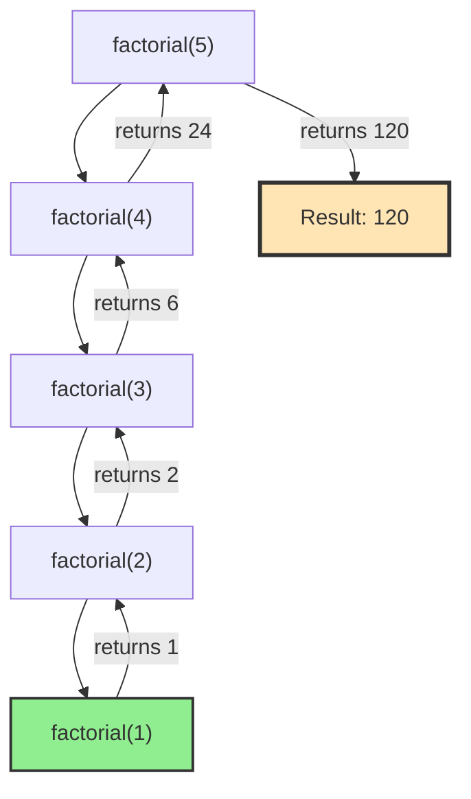

# Chapter 8: Recursion and Backtracking

## 8.1 Introduction to Recursion

**Recursion** is a fundamental programming technique where a function calls itself to solve a problem. It's based on the principle of solving a problem by breaking it down into smaller, similar subproblems.

### Why Recursion Matters

Recursion is essential for:
- **Tree and Graph Traversal**: Natural fit for hierarchical structures
- **Divide and Conquer Algorithms**: Breaking problems into subproblems
- **Dynamic Programming**: Building solutions from subproblems
- **Backtracking**: Exploring all possible solutions
- **Mathematical Problems**: Factorial, Fibonacci, Tower of Hanoi

### Key Characteristics of Recursion

1. **Base Case**: The condition that stops the recursion
2. **Recursive Case**: The part where the function calls itself
3. **Progress Toward Base Case**: Each recursive call must move closer to the base case

### The Recursive Thinking Pattern

```
1. Identify the base case(s) - simplest version of the problem
2. Identify the recursive case - how to break down the problem
3. Ensure progress - each call moves toward the base case
4. Combine results - how to combine subproblem solutions
```

## 8.2 Understanding Recursion

### Basic Recursion Example: Factorial

The factorial of n (n!) is defined as:
- Base case: 0! = 1, 1! = 1
- Recursive case: n! = n × (n-1)!

```cpp
#include <iostream>
using namespace std;

// Recursive factorial
int factorial(int n) {
    // Base case
    if (n <= 1) {
        return 1;
    }
    
    // Recursive case
    return n * factorial(n - 1);
}

// Example usage
int main() {
    cout << "5! = " << factorial(5) << endl;  // Output: 120
    return 0;
}
```

**Execution Trace for factorial(5)**:
```
factorial(5)
  → 5 * factorial(4)
    → 4 * factorial(3)
      → 3 * factorial(2)
        → 2 * factorial(1)
          → 1 (base case)
        → 2 * 1 = 2
      → 3 * 2 = 6
    → 4 * 6 = 24
  → 5 * 24 = 120
```

### Visualizing Recursion: Call Stack



### Common Recursion Patterns

#### 1. Linear Recursion
Function makes a single recursive call.

```cpp
// Sum of array elements
int sumArray(int arr[], int n) {
    // Base case
    if (n == 0) {
        return 0;
    }
    
    // Recursive case: sum of first n-1 + last element
    return sumArray(arr, n - 1) + arr[n - 1];
}
```

#### 2. Binary Recursion
Function makes two recursive calls.

```cpp
// Binary search (recursive)
int binarySearch(int arr[], int left, int right, int target) {
    // Base case: not found
    if (left > right) {
        return -1;
    }
    
    int mid = left + (right - left) / 2;
    
    // Base case: found
    if (arr[mid] == target) {
        return mid;
    }
    
    // Recursive cases
    if (arr[mid] > target) {
        return binarySearch(arr, left, mid - 1, target);
    } else {
        return binarySearch(arr, mid + 1, right, target);
    }
}
```

#### 3. Multiple Recursion
Function makes multiple recursive calls.

```cpp
// Fibonacci (multiple recursion)
int fibonacci(int n) {
    // Base cases
    if (n <= 1) {
        return n;
    }
    
    // Multiple recursive calls
    return fibonacci(n - 1) + fibonacci(n - 2);
}
```

## 8.3 Recursion vs. Iteration

### When to Use Recursion

**Use Recursion When:**
- Problem has natural recursive structure (trees, graphs)
- Solution is clearer with recursion
- Divide and conquer approach fits
- Backtracking is needed

**Use Iteration When:**
- Simple loops suffice
- Performance is critical (recursion has overhead)
- Stack overflow is a concern
- Tail recursion can be optimized

### Comparison

| Aspect | Recursion | Iteration |
|--------|-----------|-----------|
| Code Clarity | Often clearer for recursive problems | Can be more verbose |
| Performance | Function call overhead | No overhead |
| Memory | Uses call stack (O(n) depth) | Uses constant space |
| Stack Overflow | Risk for deep recursion | No risk |
| Debugging | Can be harder (call stack) | Easier to step through |

### Converting Recursion to Iteration

**Example: Factorial**

```cpp
// Recursive version
int factorialRecursive(int n) {
    if (n <= 1) return 1;
    return n * factorialRecursive(n - 1);
}

// Iterative version
int factorialIterative(int n) {
    int result = 1;
    for (int i = 2; i <= n; i++) {
        result *= i;
    }
    return result;
}
```

## 8.4 Tail Recursion

**Tail recursion** occurs when the recursive call is the last operation in the function. This allows the compiler to optimize it into iteration.

### Tail Recursive Factorial

```cpp
// Non-tail recursive (current operation after recursive call)
int factorial(int n) {
    if (n <= 1) return 1;
    return n * factorial(n - 1);  // Multiplication after call
}

// Tail recursive (recursive call is last operation)
int factorialTail(int n, int accumulator = 1) {
    if (n <= 1) return accumulator;
    return factorialTail(n - 1, n * accumulator);  // Call is last
}
```

**Why Tail Recursion Matters:**
- Can be optimized to iteration (no stack growth)
- Prevents stack overflow
- Better performance

## 8.5 Common Recursion Problems

### Problem 1: Tower of Hanoi

Move n disks from source to destination using auxiliary rod.

```cpp
void towerOfHanoi(int n, char source, char destination, char auxiliary) {
    // Base case
    if (n == 1) {
        cout << "Move disk 1 from " << source << " to " << destination << endl;
        return;
    }
    
    // Move n-1 disks from source to auxiliary
    towerOfHanoi(n - 1, source, auxiliary, destination);
    
    // Move largest disk from source to destination
    cout << "Move disk " << n << " from " << source << " to " << destination << endl;
    
    // Move n-1 disks from auxiliary to destination
    towerOfHanoi(n - 1, auxiliary, destination, source);
}
```

**Complexity**: O(2^n) - exponential, but optimal solution

### Problem 2: Power Function

Compute x^n efficiently.

```cpp
// Naive: O(n)
double powerNaive(double x, int n) {
    if (n == 0) return 1;
    return x * powerNaive(x, n - 1);
}

// Optimized: O(log n)
double powerOptimized(double x, int n) {
    if (n == 0) return 1;
    
    double half = powerOptimized(x, n / 2);
    
    if (n % 2 == 0) {
        return half * half;
    } else {
        return x * half * half;
    }
}
```

### Problem 3: Reverse String

```cpp
void reverseString(string& s, int left, int right) {
    // Base case
    if (left >= right) {
        return;
    }
    
    // Swap characters
    swap(s[left], s[right]);
    
    // Recursive case
    reverseString(s, left + 1, right - 1);
}
```

## 8.6 Introduction to Backtracking

**Backtracking** is an algorithmic technique for solving problems by trying partial solutions and abandoning them ("backtracking") if they cannot lead to a valid solution.

### Key Characteristics

1. **Incremental Construction**: Build solution step by step
2. **Constraint Checking**: Verify if current path is valid
3. **Backtracking**: Undo choices that don't lead to solution
4. **Exploration**: Try all possibilities systematically

### Backtracking Template

```cpp
void backtrack(solution, choices) {
    // Base case: solution is complete
    if (isComplete(solution)) {
        processSolution(solution);
        return;
    }
    
    // Try each possible choice
    for (each choice in choices) {
        // Make choice
        makeChoice(choice);
        
        // Check if valid (pruning)
        if (isValid(solution)) {
            // Recurse
            backtrack(solution, remainingChoices);
        }
        
        // Undo choice (backtrack)
        undoChoice(choice);
    }
}
```

## 8.7 Classic Backtracking Problems

### Problem 1: N-Queens Problem

Place N queens on an N×N chessboard such that no two queens attack each other.

```cpp
#include <iostream>
#include <vector>
using namespace std;

class NQueens {
private:
    vector<vector<int>> board;
    int n;
    int solutions;
    
    bool isValid(int row, int col) {
        // Check column
        for (int i = 0; i < row; i++) {
            if (board[i][col] == 1) {
                return false;
            }
        }
        
        // Check upper-left diagonal
        for (int i = row - 1, j = col - 1; i >= 0 && j >= 0; i--, j--) {
            if (board[i][j] == 1) {
                return false;
            }
        }
        
        // Check upper-right diagonal
        for (int i = row - 1, j = col + 1; i >= 0 && j < n; i--, j++) {
            if (board[i][j] == 1) {
                return false;
            }
        }
        
        return true;
    }
    
    void solve(int row) {
        // Base case: all queens placed
        if (row == n) {
            solutions++;
            printBoard();
            return;
        }
        
        // Try placing queen in each column of current row
        for (int col = 0; col < n; col++) {
            if (isValid(row, col)) {
                // Make choice
                board[row][col] = 1;
                
                // Recurse
                solve(row + 1);
                
                // Backtrack
                board[row][col] = 0;
            }
        }
    }
    
    void printBoard() {
        cout << "Solution " << solutions << ":\n";
        for (int i = 0; i < n; i++) {
            for (int j = 0; j < n; j++) {
                cout << (board[i][j] == 1 ? "Q " : ". ");
            }
            cout << endl;
        }
        cout << endl;
    }
    
public:
    NQueens(int size) : n(size), solutions(0) {
        board.assign(n, vector<int>(n, 0));
    }
    
    void findSolutions() {
        solve(0);
        cout << "Total solutions: " << solutions << endl;
    }
};
```

### Problem 2: Sudoku Solver

```cpp
class SudokuSolver {
private:
    vector<vector<char>> board;
    static const int SIZE = 9;
    
    bool isValid(int row, int col, char num) {
        // Check row
        for (int j = 0; j < SIZE; j++) {
            if (board[row][j] == num) return false;
        }
        
        // Check column
        for (int i = 0; i < SIZE; i++) {
            if (board[i][col] == num) return false;
        }
        
        // Check 3x3 box
        int boxRow = (row / 3) * 3;
        int boxCol = (col / 3) * 3;
        for (int i = boxRow; i < boxRow + 3; i++) {
            for (int j = boxCol; j < boxCol + 3; j++) {
                if (board[i][j] == num) return false;
            }
        }
        
        return true;
    }
    
    bool solve() {
        for (int i = 0; i < SIZE; i++) {
            for (int j = 0; j < SIZE; j++) {
                if (board[i][j] == '.') {
                    // Try each digit
                    for (char num = '1'; num <= '9'; num++) {
                        if (isValid(i, j, num)) {
                            // Make choice
                            board[i][j] = num;
                            
                            // Recurse
                            if (solve()) {
                                return true;
                            }
                            
                            // Backtrack
                            board[i][j] = '.';
                        }
                    }
                    return false;  // No valid number found
                }
            }
        }
        return true;  // All cells filled
    }
    
public:
    void solveSudoku(vector<vector<char>>& board) {
        this->board = board;
        solve();
        board = this->board;
    }
};
```

### Problem 3: Generate Permutations

```cpp
void generatePermutations(vector<int>& nums, int start, vector<vector<int>>& result) {
    // Base case: permutation complete
    if (start == nums.size()) {
        result.push_back(nums);
        return;
    }
    
    // Try each element at current position
    for (int i = start; i < nums.size(); i++) {
        // Make choice: swap
        swap(nums[start], nums[i]);
        
        // Recurse
        generatePermutations(nums, start + 1, result);
        
        // Backtrack: undo swap
        swap(nums[start], nums[i]);
    }
}
```

### Problem 4: Subset Generation

```cpp
void generateSubsets(vector<int>& nums, int index, vector<int>& current, 
                    vector<vector<int>>& result) {
    // Base case: processed all elements
    if (index == nums.size()) {
        result.push_back(current);
        return;
    }
    
    // Choice 1: Include current element
    current.push_back(nums[index]);
    generateSubsets(nums, index + 1, current, result);
    current.pop_back();  // Backtrack
    
    // Choice 2: Exclude current element
    generateSubsets(nums, index + 1, current, result);
}
```

## 8.8 Backtracking with Memoization

Backtracking can be combined with memoization to avoid redundant computations.

### Example: Word Break Problem

```cpp
class WordBreak {
private:
    unordered_set<string> wordDict;
    unordered_map<string, bool> memo;
    
    bool canBreak(string s) {
        // Base case
        if (s.empty()) {
            return true;
        }
        
        // Check memo
        if (memo.find(s) != memo.end()) {
            return memo[s];
        }
        
        // Try each possible prefix
        for (int i = 1; i <= s.length(); i++) {
            string prefix = s.substr(0, i);
            
            if (wordDict.find(prefix) != wordDict.end()) {
                string suffix = s.substr(i);
                if (canBreak(suffix)) {
                    memo[s] = true;
                    return true;
                }
            }
        }
        
        memo[s] = false;
        return false;
    }
    
public:
    bool wordBreak(string s, vector<string>& wordDict) {
        this->wordDict = unordered_set<string>(wordDict.begin(), wordDict.end());
        return canBreak(s);
    }
};
```

## 8.9 Optimization Techniques

### Pruning

**Pruning** is the technique of eliminating branches that cannot lead to a solution.

```cpp
// Example: Early termination in N-Queens
bool solve(int row) {
    if (row == n) return true;
    
    for (int col = 0; col < n; col++) {
        if (isValid(row, col)) {
            board[row][col] = 1;
            
            // Pruning: if this leads to solution, return immediately
            if (solve(row + 1)) {
                return true;
            }
            
            board[row][col] = 0;
        }
    }
    return false;
}
```

### Constraint Propagation

Use constraints to reduce search space early.

```cpp
// Example: Sudoku with constraint propagation
bool solve() {
    // Find cell with fewest possibilities
    pair<int, int> cell = findMostConstrainedCell();
    
    if (cell.first == -1) return true;  // Solved
    
    vector<char> possibilities = getPossibilities(cell.first, cell.second);
    
    for (char num : possibilities) {
        board[cell.first][cell.second] = num;
        if (solve()) return true;
        board[cell.first][cell.second] = '.';
    }
    
    return false;
}
```

## 8.10 Common Pitfalls and Best Practices

### Common Pitfalls

1. **Missing Base Case**: Infinite recursion
   ```cpp
   // WRONG: No base case
   int factorial(int n) {
       return n * factorial(n - 1);
   }
   ```

2. **Not Making Progress**: Infinite recursion
   ```cpp
   // WRONG: Doesn't move toward base case
   int badRecursion(int n) {
       if (n == 0) return 1;
       return badRecursion(n);  // Same value!
   }
   ```

3. **Forgetting to Backtrack**: Incorrect solutions
   ```cpp
   // WRONG: Doesn't undo choice
   void backtrack(...) {
       makeChoice(choice);
       backtrack(...);
       // Missing: undoChoice(choice);
   }
   ```

4. **Stack Overflow**: Deep recursion
   - Solution: Use iteration or tail recursion
   - Consider iterative DFS for deep trees

### Best Practices

1. **Always Define Base Case First**
2. **Ensure Progress Toward Base Case**
3. **Use Memoization When Appropriate**
4. **Prune Early When Possible**
5. **Test with Small Inputs First**
6. **Consider Stack Depth Limits**

## 8.11 Key Takeaways

1. **Recursion** breaks problems into smaller subproblems
2. **Base case** stops recursion
3. **Backtracking** explores all solutions systematically
4. **Memoization** can optimize recursive solutions
5. **Pruning** reduces search space
6. **Tail recursion** can be optimized to iteration

## 8.12 Exercises

1. **Easy**: Implement recursive binary search
2. **Easy**: Write recursive function to reverse a linked list
3. **Medium**: Solve Tower of Hanoi for n disks
4. **Medium**: Generate all permutations of an array
5. **Medium**: Solve N-Queens problem for N=8
6. **Hard**: Implement Sudoku solver
7. **Hard**: Word Break II (return all possible sentences)

## 8.13 Summary

Recursion and backtracking are fundamental techniques for solving complex problems. Recursion provides an elegant way to express solutions to problems with recursive structure, while backtracking systematically explores solution spaces. Understanding these techniques is essential for tree/graph algorithms, dynamic programming, and many interview problems.

**Next Steps:**
- Apply recursion to tree traversal (Chapter 6)
- Use backtracking in dynamic programming (Chapter 12)
- Explore divide and conquer algorithms (Chapter 17)

**Related Chapters:**
- Chapter 6: Trees (recursive traversal)
- Chapter 11: Graphs (DFS uses recursion)
- Chapter 12: Dynamic Programming (memoization)
- Chapter 17: Divide and Conquer (recursive structure)

