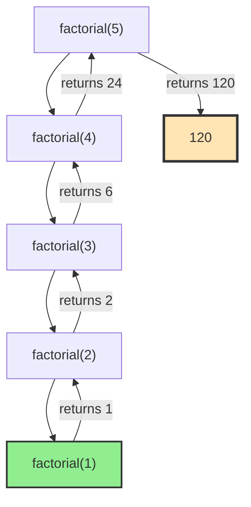
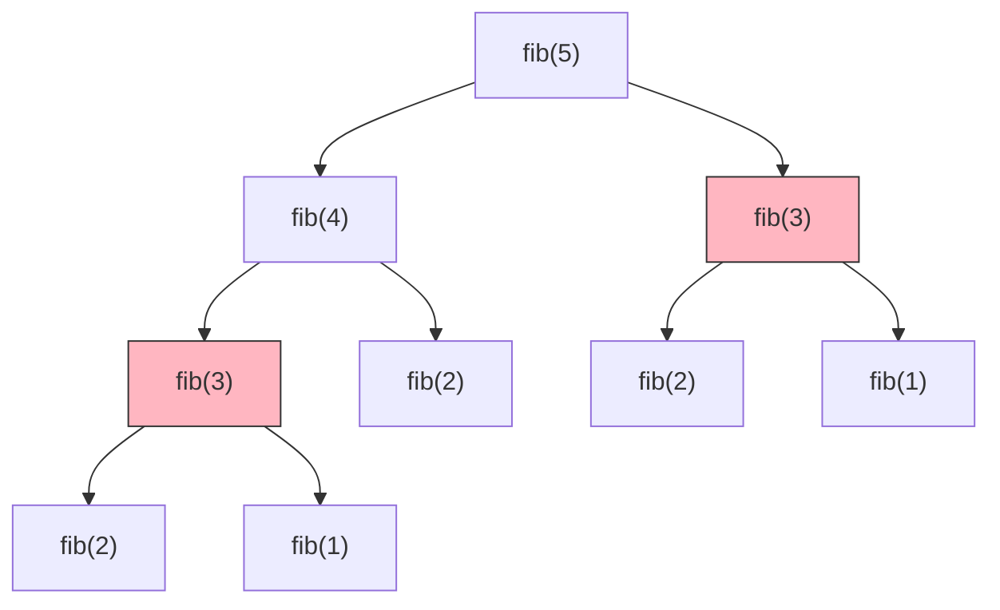

# Chapter 8: Recursion and Backtracking

Recursion is the first idea in this book that isn't a data structure — it's a control-flow technique. It earns its place here because it runs on one: the **call stack**, a real, finite block of memory the CPU manages for you. Every recursive call pushes a frame onto that stack; every return pops one. So recursion depth is not an abstraction. It is literally how many frames are stacked in that array of memory, and when you push past the end, the array overflows — that is exactly what a stack overflow is. Hold that picture and almost everything about recursion follows from it: its cost, its failure modes, and the moment you should abandon it for a plain loop.

A **recursive** function calls itself to solve a smaller version of its own problem. **Backtracking** is recursion pointed at search: it builds a candidate solution one choice at a time, and the instant a partial choice can't possibly work, it undoes that choice and tries the next. This chapter walks the arc from plain recursion, to backtracking, to *pruning* — the trick that turns an exponential search into one that finishes before the heat death of the universe.

## Why recursion earns its place

Some problems are recursive in their bones, and forcing them into loops means hand-rolling a stack anyway:

- **Hierarchies** — trees and graphs are defined recursively, so traversing them (DFS, tree walks) is naturally recursive.
- **Divide and conquer** — sorting, searching, and many numerical algorithms split into smaller copies of themselves (Chapter 17).
- **Combinatorial generation** — permutations, subsets, and partitions are built by choosing one element and recursing on the rest.
- **Constraint satisfaction** — N-Queens, Sudoku, and parsing explore a space of partial solutions.

The trade you are making is explicit: recursion buys you a clearer expression of the problem, and pays for it in call-stack space and function-call overhead. When the recursive shape is real, that's a bargain. When you're just counting from 1 to n, it's a loop wearing a costume — write the loop.

## The two rules every recursion obeys

A correct recursion needs exactly two things, and every recursion bug is a violation of one of them:

1. **A base case** — a smallest problem you can answer outright, with no further recursion.
2. **A recursive case that makes progress** — each call must move strictly closer to the base case, or the recursion never ends and the stack fills until it overflows.

Factorial is the minimal example: `0! = 1! = 1` is the base case, and `n! = n × (n−1)!` is the recursive case, with `n` shrinking by one each call.

```cpp
long long factorial(int n) {
    if (n <= 1) return 1;            // base case
    return n * factorial(n - 1);     // recursive case: n shrinks toward 1
}
```

```python
def factorial(n):
    if n <= 1:                        # base case
        return 1
    return n * factorial(n - 1)       # recursive case: n shrinks toward 1
```

Watch `factorial(5)` run and you can see the stack grow on the way down and unwind on the way back up — the return values are computed only as the frames pop:

```
factorial(5)
  → 5 * factorial(4)
      → 4 * factorial(3)
          → 3 * factorial(2)
              → 2 * factorial(1)
                  → 1              (base case, stack at full depth)
              → 2 * 1  = 2
          → 3 * 2  = 6
      → 4 * 6  = 24
  → 5 * 24 = 120
```



Five frames are live at the deepest point. Each holds this call's `n` and the return address to jump back to. That's the whole mechanism — and the whole cost.

## The call stack is a real data structure with a real cost

Every book tells you recursion "uses the stack." Here is what that actually means for the machine, because it decides when recursion is safe and when it will crash your process.

**Depth is memory.** A thread's stack is a fixed region — typically 1–8 MB on desktop and server operating systems, and often far smaller elsewhere (a few hundred KB on some embedded and threaded contexts). Each frame consumes space for the parameters, locals, saved registers, and return address — call it tens to hundreds of bytes. Divide stack size by frame size and you get your hard depth limit: a few tens of thousands of frames, sometimes far fewer. Recurse deeper than that and the stack pointer walks off the end of its region. There is no graceful error — the OS traps the access and kills the process. **Stack overflow is the call stack overflowing, in exactly the sense an array overflows.** A recursion whose depth scales with `n` (walking a linked list, a skewed tree, or a large range) is a latent crash waiting for a big enough input.

**Deep recursion is unfriendly to the hardware, too.** An explicit loop keeps its working set in a handful of registers and cache lines the CPU never has to leave. A deep recursion instead streams frames up and down a growing stack, touching more memory and more cache lines, and its returns are indirect jumps the branch predictor handles less well than a tight loop's back-edge. For a problem that is *genuinely* recursive — a tree of bounded depth — this cost is negligible and the clarity is worth everything. For a linear walk `n` levels deep, you are paying stack traffic and misprediction for nothing a loop wouldn't do faster and without the crash risk.

The practical rule falls straight out of this: **recursion depth that is bounded and shallow (log n, or a balanced-tree height) is free and clean; recursion depth that grows linearly with the input is a performance and correctness liability.** For the latter, convert to iteration or an explicit heap-allocated stack — same algorithm, but now the "stack" is a `std::vector` you control, on the heap, that can grow to gigabytes without touching the thread's tiny call stack.

## Recursion vs. iteration

Any recursion can be rewritten as a loop, because "call myself" is just "push state and jump back to the top," and you can push that state onto your own stack instead of the CPU's. The choice is about which expresses the problem honestly.

| | Recursion | Iteration |
|---|---|---|
| Clarity | Wins when the problem is recursive (trees, divide-and-conquer) | Wins for linear passes |
| Memory | O(depth) on the call stack | O(1), or an explicit stack you size yourself |
| Failure mode | Stack overflow on deep input | None from depth |
| Hardware | Frame traffic, indirect returns | Registers and cache-friendly back-edges |

For a linear recursion the conversion is trivial and worth it — you shed the stack risk entirely:

```cpp
long long factorialIterative(int n) {
    long long result = 1;
    for (int i = 2; i <= n; ++i) result *= i;
    return result;
}
```

```python
def factorial_iterative(n):
    result = 1
    for i in range(2, n + 1):
        result *= i
    return result
```

For a tree or graph walk, the honest conversion keeps the recursion's shape but moves the stack to the heap:

```cpp
// Iterative DFS: the explicit stack replaces the call stack,
// lives on the heap, and can grow far past the OS depth limit.
void dfs(Node* root) {
    std::stack<Node*> stk;
    if (root) stk.push(root);
    while (!stk.empty()) {
        Node* n = stk.top(); stk.pop();
        process(n);
        for (Node* child : n->children) stk.push(child);
    }
}
```

```python
# Iterative DFS: the explicit stack replaces the call stack,
# lives on the heap, and can grow far past any recursion limit.
def dfs(root):
    stack = [root] if root else []
    while stack:
        node = stack.pop()
        process(node)
        for child in node.children:
            stack.append(child)
```

This is the standard defense when a recursive tree walk might see pathological depth: same traversal, no call-stack ceiling.

## Tail recursion

A call is in **tail position** when it is the last thing the function does — nothing happens to its return value on the way out. Such a call needs no frame of its own: the compiler can reuse the current frame and turn the recursion into a loop, so depth stays O(1). Factorial can be made tail-recursive by carrying the running product in an accumulator instead of multiplying after the call returns:

```cpp
long long factorialTail(int n, long long acc = 1) {
    if (n <= 1) return acc;
    return factorialTail(n - 1, n * acc);   // nothing happens after this call
}
```

```python
def factorial_tail(n, acc=1):
    if n <= 1:
        return acc
    return factorial_tail(n - 1, n * acc)   # nothing happens after this call
```

One caveat aimed squarely at systems code: **C++ does not guarantee tail-call optimization.** GCC and Clang usually do it at `-O2`, but the standard permits them not to, and a debug build (`-O0`) generally won't — so a "tail-recursive" C++ function can still blow the stack. Languages that guarantee TCO (Scheme, and Scala via `@tailrec`) let you lean on it. In C++, if you need the depth guarantee, write the loop.

## Recursion patterns and classic problems

Recursions are worth classifying by how many times they call themselves, because that number is the base of the complexity exponent.

**Linear recursion** — one call per level, O(n) depth. Summing an array, walking a list.

**Binary recursion** — two calls, but on disjoint halves, so the work still collapses to O(n) or O(log n). Binary search discards half the range each step, giving O(log n) time and O(log n) depth:

```cpp
int binarySearch(const std::vector<int>& a, int lo, int hi, int target) {
    if (lo > hi) return -1;                       // base case: not found
    int mid = lo + (hi - lo) / 2;                 // avoids lo+hi overflow
    if (a[mid] == target) return mid;
    return a[mid] > target
        ? binarySearch(a, lo, mid - 1, target)
        : binarySearch(a, mid + 1, hi, target);
}
```

```python
def binary_search(a, lo, hi, target):
    if lo > hi:                            # base case: not found
        return -1
    mid = lo + (hi - lo) // 2              # avoids lo+hi overflow (moot in Python)
    if a[mid] == target:
        return mid
    return (binary_search(a, lo, mid - 1, target) if a[mid] > target
            else binary_search(a, mid + 1, hi, target))
```

**Multiple / exponential recursion** — two or more calls on *overlapping* subproblems, and the tree explodes. Naive Fibonacci is the cautionary tale; we fix it in the next section.

Three more classics, each a clean recursive shape:

**Tower of Hanoi** — the definition *is* the recursion: move `n−1` disks aside, move the big one, move the `n−1` back. O(2ⁿ) moves, which is provably optimal for the puzzle.

```cpp
void hanoi(int n, char from, char to, char via) {
    if (n == 1) { std::cout << "Move disk 1: " << from << " -> " << to << "\n"; return; }
    hanoi(n - 1, from, via, to);
    std::cout << "Move disk " << n << ": " << from << " -> " << to << "\n";
    hanoi(n - 1, via, to, from);
}
```

```python
def hanoi(n, from_peg, to_peg, via_peg):
    if n == 1:
        print(f"Move disk 1: {from_peg} -> {to_peg}")
        return
    hanoi(n - 1, from_peg, via_peg, to_peg)
    print(f"Move disk {n}: {from_peg} -> {to_peg}")
    hanoi(n - 1, via_peg, to_peg, from_peg)
```

**Fast exponentiation** — halving the exponent turns O(n) multiplications into O(log n), which is also O(log n) depth:

```cpp
double power(double x, int n) {          // assumes n >= 0
    if (n == 0) return 1.0;
    double half = power(x, n / 2);
    return (n % 2 == 0) ? half * half : x * half * half;
}
```

```python
def power(x, n):                     # assumes n >= 0
    if n == 0:
        return 1.0
    half = power(x, n // 2)
    return half * half if n % 2 == 0 else x * half * half
```

**Reverse a string in place** — swap the ends, recurse inward, stop when the pointers meet:

```cpp
void reverse(std::string& s, int lo, int hi) {
    if (lo >= hi) return;                // base case: pointers crossed
    std::swap(s[lo], s[hi]);
    reverse(s, lo + 1, hi - 1);
}
```

```python
def reverse(s, lo, hi):              # s is a list of characters (strings are immutable)
    if lo >= hi:                     # base case: pointers crossed
        return
    s[lo], s[hi] = s[hi], s[lo]
    reverse(s, lo + 1, hi - 1)
```

## Memoization: the bridge to dynamic programming

Naive Fibonacci is `fib(n) = fib(n−1) + fib(n−2)`, and it is a disaster — not because recursion is slow, but because it recomputes the same subproblems an exponential number of times:



`fib(3)` is computed twice, `fib(2)` three times, and it compounds: `fib(n)` makes about `fib(n)` calls — O(1.618ⁿ). The subproblems *overlap*, and nothing remembers the answers.

**Memoization** is the one-line fix: cache each result the first time you compute it, and return the cache on every repeat. The tree of redundant calls collapses into a line of n unique ones — O(n) time, O(n) space:

```cpp
long long fib(int n, std::vector<long long>& memo) {
    if (n <= 1) return n;
    if (memo[n] != -1) return memo[n];              // already solved
    return memo[n] = fib(n - 1, memo) + fib(n - 2, memo);
}

long long fib(int n) {
    std::vector<long long> memo(n + 1, -1);
    return fib(n, memo);
}
```

```python
def fib(n, memo=None):
    if memo is None:
        memo = [-1] * (n + 1)
    if n <= 1:
        return n
    if memo[n] != -1:                       # already solved
        return memo[n]
    memo[n] = fib(n - 1, memo) + fib(n - 2, memo)
    return memo[n]
```

This is **top-down dynamic programming**, full stop. The moment a recursion has overlapping subproblems, memoization converts it to DP; flip the direction and fill the table bottom-up and you have removed the recursion (and its stack) entirely. Chapter 12 develops this into a discipline — for now, the reflex to build is: *overlapping subproblems ⇒ cache them.*

## Backtracking: recursion that undoes its choices

Backtracking is what you get when you point recursion at a search problem and give it an eraser. You build a solution incrementally; before extending a partial solution you check whether it can still lead anywhere; and after exploring a choice you **undo it** so the next choice starts from a clean slate. Picture solving a maze: walk down a corridor, and the moment it dead-ends, walk back to the last junction and try a different one — never re-walking a corridor you've already ruled out.

Every backtracking solver is a variation on one template:

```cpp
void backtrack(State& s) {
    if (isComplete(s)) { record(s); return; }        // reached a full solution
    for (Choice c : choicesFor(s)) {
        if (!isValid(s, c)) continue;                // prune: skip doomed choices
        apply(s, c);                                 // make the choice
        backtrack(s);                                // recurse on the extended state
        undo(s, c);                                  // BACKTRACK — restore the state
    }
}
```

The `undo` is the line beginners forget, and forgetting it is catastrophic: the state accumulates stale choices, and every solution downstream is corrupted. If you take one habit from this chapter, it's that **every `apply` needs a matching `undo` on the way out.**

Subset generation shows the pattern at its cleanest — at each element you branch on "include it" or "skip it," and the `pop_back` is the undo:

```cpp
void subsets(const std::vector<int>& nums, int i,
             std::vector<int>& cur, std::vector<std::vector<int>>& out) {
    if (i == (int)nums.size()) { out.push_back(cur); return; }
    cur.push_back(nums[i]);                 // choose to include nums[i]
    subsets(nums, i + 1, cur, out);
    cur.pop_back();                         // undo, then explore excluding it
    subsets(nums, i + 1, cur, out);
}
```

```python
def subsets(nums, i, cur, out):
    if i == len(nums):
        out.append(cur.copy())
        return
    cur.append(nums[i])                     # choose to include nums[i]
    subsets(nums, i + 1, cur, out)
    cur.pop()                               # undo, then explore excluding it
    subsets(nums, i + 1, cur, out)
```

Permutations use the same shape with a swap as the reversible move — swap an element into place, recurse, swap it back:

```cpp
void permute(std::vector<int>& nums, int start,
             std::vector<std::vector<int>>& out) {
    if (start == (int)nums.size()) { out.push_back(nums); return; }
    for (int i = start; i < (int)nums.size(); ++i) {
        std::swap(nums[start], nums[i]);    // choose nums[i] for this position
        permute(nums, start + 1, out);
        std::swap(nums[start], nums[i]);    // undo the swap
    }
}
```

```python
def permute(nums, start, out):
    if start == len(nums):
        out.append(nums.copy())
        return
    for i in range(start, len(nums)):
        nums[start], nums[i] = nums[i], nums[start]   # choose nums[i] for this position
        permute(nums, start + 1, out)
        nums[start], nums[i] = nums[i], nums[start]   # undo the swap
```

## Pruning: where backtracking earns its keep

Naive backtracking explores every leaf of the choice tree — O(branchesᵈᵉᵖᵗʰ), hopeless past small inputs. **Pruning** is the observation that most of that tree is dead: if a partial solution already violates a constraint, *no* completion of it can be valid, so you skip the entire subtree beneath it. That single check is the difference between a solver that finishes and one that doesn't.

N-Queens makes it concrete: place one queen per row of an N×N board so none attack each other. Represent the board as a single 1-D array — `col[r]` is the column of the queen in row `r` — which keeps each stack frame tiny and the board in one cache-friendly block. Before placing a queen we check it against every queen already placed; that check *is* the pruning, because it rejects a placement before we ever recurse into the doomed subtree below it:

```cpp
#include <vector>
#include <cstdlib>   // std::abs

int countNQueens(int n) {
    std::vector<int> col(n);
    int solutions = 0;

    // Try every column for `row`, recursing only on placements that survive pruning.
    auto place = [&](auto&& self, int row) -> void {
        if (row == n) { ++solutions; return; }   // all rows filled: a full solution
        for (int c = 0; c < n; ++c) {
            bool safe = true;
            for (int r = 0; r < row; ++r) {       // check against queens above
                if (col[r] == c || std::abs(col[r] - c) == row - r) { safe = false; break; }
            }
            if (safe) {                           // prune: only descend into valid boards
                col[row] = c;
                self(self, row + 1);              // col[row] is overwritten next iteration,
            }                                     // so no explicit undo is needed
        }
    };
    place(place, 0);
    return solutions;
}
```

```python
def count_n_queens(n):
    col = [0] * n
    solutions = 0

    # Try every column for `row`, recursing only on placements that survive pruning.
    def place(row):
        nonlocal solutions
        if row == n:                       # all rows filled: a full solution
            solutions += 1
            return
        for c in range(n):
            safe = True
            for r in range(row):           # check against queens above
                if col[r] == c or abs(col[r] - c) == row - r:
                    safe = False
                    break
            if safe:                       # prune: only descend into valid boards
                col[row] = c
                place(row + 1)             # col[row] is overwritten next iteration,
                                           # so no explicit undo is needed

    place(0)
    return solutions
```

Two rows can share a diagonal exactly when their column gap equals their row gap — that's the `abs(col[r] - c) == row - r` test. Without this check the search visits nⁿ placements; with it, whole branches vanish the instant a conflict appears, and 8-Queens finishes instantly. To find just *one* solution instead of counting all, have `place` return `bool` and propagate `true` up the moment a full board is reached — the recursion then unwinds without exploring the rest of the tree.

**Sudoku** escalates the same idea. Scan for an empty cell, try each digit that doesn't already conflict, recurse, and undo on failure — the conflict check prunes the vast majority of the 9⁸¹ raw possibilities:

```cpp
bool isValid(std::vector<std::vector<char>>& b, int row, int col, char num) {
    for (int k = 0; k < 9; ++k) {
        if (b[row][k] == num || b[k][col] == num) return false;          // row, column
        int br = 3 * (row / 3) + k / 3, bc = 3 * (col / 3) + k % 3;
        if (b[br][bc] == num) return false;                              // 3x3 box
    }
    return true;
}

bool solveSudoku(std::vector<std::vector<char>>& b) {
    for (int r = 0; r < 9; ++r)
        for (int c = 0; c < 9; ++c)
            if (b[r][c] == '.') {
                for (char num = '1'; num <= '9'; ++num)
                    if (isValid(b, r, c, num)) {
                        b[r][c] = num;                  // choose
                        if (solveSudoku(b)) return true;
                        b[r][c] = '.';                  // undo
                    }
                return false;                           // no digit fits: dead end
            }
    return true;                                        // no empty cells: solved
}
```

```python
def is_valid(b, row, col, num):
    for k in range(9):
        if b[row][k] == num or b[k][col] == num:              # row, column
            return False
        br, bc = 3 * (row // 3) + k // 3, 3 * (col // 3) + k % 3
        if b[br][bc] == num:                                  # 3x3 box
            return False
    return True

def solve_sudoku(b):
    for r in range(9):
        for c in range(9):
            if b[r][c] == '.':
                for num in "123456789":
                    if is_valid(b, r, c, num):
                        b[r][c] = num                         # choose
                        if solve_sudoku(b):
                            return True
                        b[r][c] = '.'                         # undo
                return False                                  # no digit fits: dead end
    return True                                               # no empty cells: solved
```

You can prune harder still with **constraint propagation**: instead of filling cells left-to-right, always expand the cell with the *fewest* legal digits (the minimum-remaining-values heuristic). Fewer branches at the top of the tree means a smaller tree overall — the same lever, pulled earlier. This is the entry point to the whole field of constraint solvers.

## Complexity, at a glance

| Pattern | Time | Space (stack) |
|---|---|---|
| Linear recursion (factorial, list sum) | O(n) | O(n) |
| Balanced binary recursion (binary search, tree walk) | O(n) or O(log n) | O(log n) |
| Naive multiple recursion (Fibonacci) | O(branchesⁿ) | O(n) |
| Memoized recursion | O(unique states) | O(states) + O(depth) |
| Backtracking, no pruning | O(branchesᵈᵉᵖᵗʰ) | O(depth) |
| Backtracking with pruning | far below the worst case; input-dependent | O(depth) |

The two rows that matter most are the last two: pruning doesn't improve the worst-case bound, but on real inputs it collapses the search so aggressively that "exponential" becomes "runs in milliseconds." That gap is the entire art of practical backtracking.

## Edge cases and failure modes

Every recursion bug is one of these four, and all four are checkable in seconds:

- **Missing or unreachable base case** → the recursion never stops and the stack overflows. Write the base case *first*, and confirm the recursive case actually drives the input toward it.
- **No progress** → `solve(n)` calling `solve(n)` (or failing to shrink the problem) is an infinite loop that crashes as a stack overflow. Every recursive call must move strictly closer to a base case.
- **Depth that scales with n** → correct but fragile; a large enough input crashes it. Convert to iteration or an explicit heap stack when depth is unbounded.
- **Forgetting to backtrack** → the missing `undo` corrupts shared state and every later solution with it. Pair every `apply` with an `undo`.

## Engineering judgment

- **Reach for recursion when the problem is recursive** — trees, grammars, divide-and-conquer, combinatorial search. There its clarity is worth the stack cost.
- **Watch the depth.** Bounded/logarithmic depth is free; depth that grows with the input is a latent stack-overflow bug. Convert those to iteration or an explicit stack.
- **Memoize the moment subproblems overlap** — that's the recursion-to-DP conversion, and it's usually the difference between exponential and linear.
- **In backtracking, prune as early as possible.** Check constraints before you recurse, not after; the earlier you kill a doomed branch, the smaller the tree.
- **Don't trust C++ to eliminate tail calls.** If you need an O(1)-depth guarantee, write the loop.

## Exercises

1. *(Easy)* Implement recursive binary search and confirm its depth is O(log n).
2. *(Easy)* Reverse a singly linked list recursively — then explain why the iterative version is safer on a million-node list.
3. *(Medium)* Solve Tower of Hanoi for n disks and prove the move count is 2ⁿ − 1.
4. *(Medium)* Generate all permutations of an array, then all distinct permutations when the array has duplicates.
5. *(Medium)* Solve 8-Queens; count all 92 solutions.
6. *(Hard)* Write a Sudoku solver, then add the minimum-remaining-values heuristic and measure the reduction in recursive calls.
7. *(Hard)* Word Break II: return every sentence a string can be segmented into, using memoization to avoid re-solving suffixes.

## Summary

Recursion expresses a problem in terms of smaller copies of itself, anchored by a base case and driven forward by progress toward it. It runs on the call stack — a finite, fast array of frames — so its depth is a memory budget you spend, and overrunning it is a crash, not a warning. Backtracking is recursion aimed at search: build incrementally, validate early, and undo on the way out. Pruning is what makes that search tractable, cutting away subtrees that provably can't hold a solution. And memoization is the hinge between recursion and dynamic programming: cache overlapping subproblems and an exponential recursion becomes a linear one.

**Related chapters:**
- [Chapter 6: Trees](06-trees-and-binary-trees.md) — recursive traversal is the canonical application.
- [Chapter 11: Graphs](11-graphs.md) — DFS is recursion (or an explicit stack) over a graph.
- [Chapter 12: Dynamic Programming](12-dynamic-programming.md) — memoization, developed into a method.
- [Chapter 17: Divide and Conquer](17-divide-and-conquer.md) — recursion as an algorithm-design strategy.
