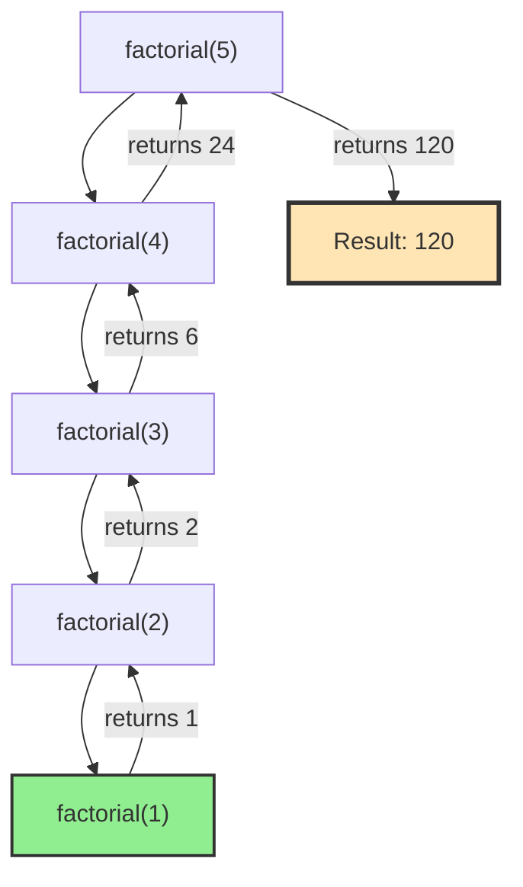

# Chapter 8: Recursion and Backtracking

## 8.1 Problem Statement & Motivation

### What Problem Do Recursion and Backtracking Solve?

Many problems have natural recursive structure that makes iterative solutions complex:

- **Hierarchical Structures**: Trees, graphs have recursive structure
- **Combinatorial Problems**: Generating all permutations, combinations, subsets
- **Optimization with Constraints**: Finding valid solutions under constraints
- **Divide and Conquer**: Problems that break into similar subproblems
- **State Space Exploration**: Systematically exploring all possibilities

**Naive Approaches and Their Limitations**:

- **Iterative Solutions**: Often complex, hard to reason about
- **Nested Loops**: Don't scale for variable-depth problems
- **Manual State Management**: Error-prone, hard to maintain
- **No Systematic Exploration**: May miss solutions or explore inefficiently

**The Recursion/Backtracking Solution**: Recursion provides elegant expression of recursive problems, while backtracking systematically explores solution spaces, making complex problems manageable.

### When to Use Recursion

✅ **Use recursion when**:
- Problem has natural recursive structure (trees, graphs)
- Solution is clearer with recursion
- Divide and conquer approach fits
- Backtracking is needed
- Mathematical problems with recursive definitions

✅ **Real-world applications**:
- Tree/graph traversal (DFS)
- File system navigation
- Parsing (expression trees, syntax trees)
- Combinatorial generation (permutations, combinations)
- Constraint satisfaction (N-Queens, Sudoku)
- Dynamic programming (memoization)

### When NOT to Use Recursion

❌ **Avoid recursion when**:
- Simple loops suffice
- Performance is critical (recursion has overhead)
- Stack overflow is a concern (deep recursion)
- Tail recursion can be optimized to iteration
- Problem doesn't have recursive structure

**Key Trade-off**: Recursion trades performance (function call overhead, stack space) for clarity and natural problem expression.

## 8.2 Conceptual Overview

**Recursion** is a fundamental programming technique where a function calls itself to solve a problem. **Backtracking** is a systematic method for exploring solution spaces by trying partial solutions and abandoning them if they cannot lead to a complete solution.

### Intuitive Explanation

Think of recursion like Russian nesting dolls:
- **Base Case**: Smallest doll (simplest problem)
- **Recursive Case**: Larger doll contains smaller doll (problem contains subproblem)
- **Unwinding**: Opening dolls one by one (solving subproblems)

Think of backtracking like exploring a maze:
- **Try Path**: Go down a path
- **Check Validity**: Is this path valid?
- **Backtrack**: If invalid, go back and try another path
- **Systematic**: Try all possible paths

### Key Characteristics

**Recursion**:
1. **Base Case**: Condition that stops recursion
2. **Recursive Case**: Function calls itself on smaller problem
3. **Progress**: Each call moves toward base case

**Backtracking**:
1. **Build Solution**: Construct solution incrementally
2. **Check Constraints**: Verify partial solution is valid
3. **Prune**: Abandon invalid partial solutions early
4. **Backtrack**: Undo choices and try alternatives

### The Recursive Thinking Pattern

```
1. Identify the base case(s) - simplest version of the problem
2. Identify the recursive case - how to break down the problem
3. Ensure progress - each call moves toward the base case
4. Combine results - how to combine subproblem solutions
```

### The Backtracking Pattern

```
1. Make a choice (add to partial solution)
2. Check if choice is valid (constraints satisfied)
3. If valid, recurse to extend solution
4. If invalid or recursion fails, undo choice (backtrack)
5. Try next choice
```

## 8.3 Abstract Model & Invariants ⭐ (Mandatory)

**Purpose**: Define correctness independent of implementation.

### Abstract Model

A recursive solution consists of:
- **Problem Space**: Set of all problem instances
- **Base Cases**: Terminal problems with known solutions
- **Recursive Decomposition**: Function that breaks problem into subproblems
- **Combination Function**: How to combine subproblem solutions

A backtracking solution consists of:
- **State Space**: All possible partial solutions
- **Valid States**: Partial solutions satisfying constraints
- **Goal States**: Complete valid solutions
- **Transition Function**: How to extend partial solutions

### Core Invariants

These invariants must **always** hold for recursive/backtracking solutions:

#### 1. Termination Invariant (Recursion)

```
For any recursive call:
  - Problem size decreases toward base case
  - Eventually reaches base case
  - No infinite recursion
```

**Meaning**: Every recursive path eventually terminates.

#### 2. Correctness Invariant (Recursion)

```
For any problem instance:
  - Base case returns correct solution
  - Recursive case combines correct subproblem solutions
  - Final solution is correct
```

**Meaning**: Recursive solution correctly solves the problem.

#### 3. Progress Invariant (Backtracking)

```
For any backtracking step:
  - Partial solution is extended or backtracked
  - All valid extensions are tried
  - Invalid partial solutions are pruned early
```

**Meaning**: Backtracking makes progress toward finding all solutions.

#### 4. Completeness Invariant (Backtracking)

```
For backtracking search:
  - All valid solutions are found
  - No valid solution is missed
  - Invalid solutions are not included
```

**Meaning**: Backtracking finds all valid solutions.

#### 5. Constraint Invariant (Backtracking)

```
For any partial solution:
  - All constraints are satisfied
  - Invalid partial solutions are rejected immediately
  - Only valid extensions are explored
```

**Meaning**: All explored states satisfy constraints.

### Assumptions

1. **Finite Problem Space**: Problem instances are finite
2. **Well-Defined Base Cases**: Base cases have clear solutions
3. **Monotonic Constraints**: Constraints can be checked incrementally
4. **Deterministic**: Same input produces same output
5. **Stack Space Available**: Sufficient stack space for recursion depth

This abstract model provides the intellectual backbone for understanding recursion and backtracking correctness.

## 8.4 Operations & Interface

**Purpose**: Define what operations are supported.

Recursion and backtracking support the following conceptual operations:

| Operation | Description | Precondition | Postcondition |
|-----------|-------------|--------------|---------------|
| `solve(problem)` | Solve problem recursively | Problem is valid | Returns solution |
| `backtrack(state)` | Explore state space | State is valid partial solution | Returns all valid solutions |
| `isBaseCase(problem)` | Check if base case | Problem is valid | Returns true if base case |
| `decompose(problem)` | Break into subproblems | Problem is not base case | Returns list of subproblems |
| `combine(solutions)` | Combine subproblem solutions | Solutions are valid | Returns combined solution |
| `isValid(state)` | Check if state is valid | State is partial solution | Returns true if constraints satisfied |
| `isComplete(state)` | Check if state is complete | State is partial solution | Returns true if complete solution |
| `extend(state, choice)` | Add choice to state | State and choice are valid | Returns extended state |
| `undo(state, choice)` | Remove choice from state | State contains choice | Returns state without choice |

### Behavioral Guarantees

1. **Termination**: All recursive calls eventually terminate
2. **Correctness**: Solutions are correct for the problem
3. **Completeness**: All valid solutions are found (backtracking)
4. **Constraint Satisfaction**: All solutions satisfy constraints

## 8.5 Time & Space Complexity

**Purpose**: Make trade-offs explicit.

### Recursion Complexity

| Aspect | Complexity | Notes |
|--------|-----------|-------|
| **Time** | O(branches^depth) | Exponential for backtracking |
| **Space** | O(depth) | Stack space for recursion depth |
| **Memoization Time** | O(unique_states) | Each state computed once |
| **Memoization Space** | O(unique_states) | Store all computed states |

### Backtracking Complexity

| Aspect | Complexity | Notes |
|--------|-----------|-------|
| **Time** | O(branches^depth) | Worst case: explore all states |
| **Space** | O(depth) | Stack space + current state |
| **With Pruning** | O(valid_states) | Only explore valid states |
| **Memoization** | O(unique_states) | Cache computed states |

### Common Patterns

**Linear Recursion** (e.g., factorial):
- Time: O(n)
- Space: O(n) stack

**Binary Recursion** (e.g., binary tree traversal):
- Time: O(n)
- Space: O(h) where h is height

**Exponential Backtracking** (e.g., N-Queens):
- Time: O(branches^n) without pruning
- Space: O(n) for current state

**Memoized Recursion**:
- Time: O(unique_states × cost_per_state)
- Space: O(unique_states) + O(depth) stack

## 8.6 Pseudocode (Language-Neutral) ⭐ (Mandatory)

**Purpose**: Bridge theory → implementation.

**Rules**: No language syntax, no pointers/templates, focus on logic only.

### Generic Recursive Pattern

```
FUNCTION solve(problem):
  IF isBaseCase(problem):
    RETURN baseCaseSolution(problem)
  END IF
  
  subproblems ← decompose(problem)
  solutions ← empty list
  
  FOR EACH subproblem IN subproblems:
    sub_solution ← solve(subproblem)
    solutions.add(sub_solution)
  END FOR
  
  RETURN combine(solutions)
END FUNCTION
```

### Factorial (Linear Recursion)

```
FUNCTION factorial(n):
  IF n ≤ 1:
    RETURN 1
  END IF
  
  RETURN n × factorial(n - 1)
END FUNCTION
```

### Binary Tree Traversal (Binary Recursion)

```
FUNCTION inorderTraverse(node):
  IF node is null:
    RETURN
  END IF
  
  inorderTraverse(node.left)
  process(node.data)
  inorderTraverse(node.right)
END FUNCTION
```

### Backtracking Pattern

```
FUNCTION backtrack(current_state):
  IF isComplete(current_state):
    IF isValid(current_state):
      solutions.add(current_state)
    END IF
    RETURN
  END IF
  
  IF NOT isValid(current_state):
    RETURN  // Prune invalid state
  END IF
  
  choices ← getPossibleChoices(current_state)
  
  FOR EACH choice IN choices:
    new_state ← extend(current_state, choice)
    backtrack(new_state)
    undo(current_state, choice)  // Backtrack
  END FOR
END FUNCTION
```

### N-Queens Backtracking

```
FUNCTION solveNQueens(board, row):
  IF row = board_size:
    IF isValidBoard(board):
      solutions.add(copy(board))
    END IF
    RETURN
  END IF
  
  FOR col FROM 0 TO board_size - 1:
    IF isValidPlacement(board, row, col):
      board[row][col] ← QUEEN
      solveNQueens(board, row + 1)
      board[row][col] ← EMPTY  // Backtrack
    END IF
  END FOR
END FUNCTION
```

### Memoized Recursion

```
FUNCTION solveMemoized(problem, memo):
  IF problem in memo:
    RETURN memo[problem]
  END IF
  
  IF isBaseCase(problem):
    result ← baseCaseSolution(problem)
  ELSE:
    subproblems ← decompose(problem)
    solutions ← empty list
    
    FOR EACH subproblem IN subproblems:
      sub_solution ← solveMemoized(subproblem, memo)
      solutions.add(sub_solution)
    END FOR
    
    result ← combine(solutions)
  END IF
  
  memo[problem] ← result
  RETURN result
END FUNCTION
```

This pseudocode should be readable by any engineer, regardless of their programming language background.

## 8.7 Implementation (Reference Language: C++) ⭐

**Note to Reader**: This section provides concrete C++ implementations. The correctness relies on the invariants defined in Section 8.3 and the pseudocode in Section 8.6.

Detailed C++ implementations are provided in the following sections:
- Section 8.12: Common Recursion Problems (factorial, Fibonacci, etc.)
- Section 8.13: Classic Backtracking Problems (N-Queens, Sudoku, etc.)

## 8.8 Correctness Argument

**Purpose**: Explain why the implementations work.

### Invariant Preservation

Recursive and backtracking implementations preserve the core invariants:

#### 1. Termination Invariant

**For Recursion**:
- Base case check ensures termination
- Problem size decreases in recursive case
- Eventually reaches base case
- **Preserves**: No infinite recursion

**For Backtracking**:
- Depth increases or backtrack occurs
- Eventually reaches complete state or exhausts choices
- **Preserves**: Search terminates

#### 2. Correctness Invariant

**For Recursion**:
- Base cases return correct solutions
- Recursive cases combine correct subproblem solutions
- **Preserves**: Final solution is correct

**For Backtracking**:
- Only valid complete states are added to solutions
- Invalid states are pruned
- **Preserves**: All solutions are valid

#### 3. Completeness Invariant (Backtracking)

**For Backtracking**:
- All choices are tried at each step
- Backtracking ensures all paths are explored
- Pruning only removes invalid paths
- **Preserves**: All valid solutions are found

### Informal Proof Sketch

**For Recursion**:
1. **Base Case**: Correct by definition/verification
2. **Inductive Step**: If subproblems solved correctly, combination is correct
3. **Termination**: Problem size decreases, eventually reaches base case
4. **Conclusion**: Recursive solution is correct

**For Backtracking**:
1. **Systematic Exploration**: All choices tried at each step
2. **Constraint Checking**: Invalid states pruned early
3. **Backtracking**: Ensures all paths explored
4. **Conclusion**: All valid solutions found

This correctness argument provides engineers with confidence that recursive and backtracking implementations work correctly.

## 8.9 Edge Cases & Failure Modes

**Purpose**: Build defensive thinking.

### Stack Overflow

**Problem**: Deep recursion exhausts stack space.

**Edge Cases**:
- Very deep recursion (10,000+ levels)
- Unbalanced recursion (one very deep branch)
- No base case (infinite recursion)

**Handling**:
```cpp
// Use iterative approach for deep recursion
// Or increase stack size (system-dependent)
// Or use tail recursion optimization
```

**Failure Mode**: Stack overflow crashes program.

### Missing Base Case

**Problem**: Recursion never terminates.

**Edge Cases**:
- No base case defined
- Base case condition never met
- Infinite recursion loop

**Handling**:
```cpp
// Always define base case first
if (n <= 1) return 1;  // Base case
// Ensure base case is reachable
```

**Failure Mode**: Infinite recursion, stack overflow.

### Not Making Progress

**Problem**: Recursive call doesn't reduce problem size.

**Edge Cases**:
- Same problem passed recursively
- Problem size doesn't decrease
- Infinite loop in recursion

**Handling**:
```cpp
// Ensure problem size decreases
return solve(n - 1);  // n decreases
// Not: return solve(n);  // Same size!
```

### Forgetting to Backtrack

**Problem**: State not restored after recursion.

**Edge Cases**:
- Modify state, recurse, but don't undo
- State accumulates incorrect choices
- Solutions become corrupted

**Handling**:
```cpp
// Always undo after recursion
makeChoice(choice);
backtrack(state);
undoChoice(choice);  // Must undo!
```

**Failure Mode**: Incorrect solutions, state corruption.

### Common Failure Patterns

1. **Missing Base Case**: Infinite recursion
2. **Not Making Progress**: Same problem recursively
3. **Forgetting Backtrack**: State not restored
4. **Stack Overflow**: Too deep recursion
5. **Off-by-One in Base Case**: Wrong termination condition

This section maps directly to production bugs and helps engineers write robust recursive code.

## 8.10 Performance & System Considerations ⭐ (Differentiator)

**Purpose**: Connect algorithms to real machines.

### Stack Space

#### Recursion Depth Limits

**Problem**: Each recursive call uses stack space.

**Impact**:
- Typical stack: 1-8 MB
- Each call: ~100-1000 bytes
- Deep recursion: Stack overflow risk

**Mitigation**:
- Use iterative approach for deep recursion
- Tail recursion optimization (compiler-dependent)
- Increase stack size (system-dependent)

### Function Call Overhead

#### Call Stack Operations

**Recursion Overhead**:
- Function call: ~10-50 cycles
- Stack frame allocation: ~5-20 cycles
- Parameter passing: ~1-5 cycles per parameter

**Iteration Overhead**:
- Loop iteration: ~1-5 cycles
- No function call overhead

**Performance Impact**:
- Recursion: 10-100x more overhead per step
- Significant for performance-critical code

### Memory Access Patterns

#### Stack vs Heap

**Recursion**:
- Uses call stack (limited, fast)
- Stack frames allocated/deallocated automatically
- Good cache locality (stack is contiguous)

**Iteration with State**:
- Uses heap for state (larger, slower)
- Manual memory management
- May have worse cache locality

### Tail Recursion Optimization

#### When Compiler Optimizes

**Tail Recursive**:
- Recursive call is last operation
- No computation after call
- Can be optimized to iteration

**Example**:
```cpp
// Tail recursive - can be optimized
int factorialTail(int n, int acc = 1) {
    if (n <= 1) return acc;
    return factorialTail(n - 1, n * acc);
}

// Not tail recursive - cannot optimize
int factorial(int n) {
    if (n <= 1) return 1;
    return n * factorial(n - 1);  // Multiplication after call
}
```

### Backtracking Performance

#### Pruning Effectiveness

**Without Pruning**:
- Explores all possible states
- Exponential time: O(branches^depth)

**With Pruning**:
- Skips invalid states early
- Reduces search space significantly
- Can make exponential → polynomial

#### Memoization Trade-offs

**Space vs Time**:
- Memoization: O(states) space for O(1) lookup
- Without memo: O(1) space but recompute

**When to Memoize**:
- Overlapping subproblems
- Expensive computations
- Sufficient memory available

### Practical Recommendations

1. **Use Iteration When Possible**: Better performance, no stack risk
2. **Use Recursion for Clarity**: When code is much clearer
3. **Consider Tail Recursion**: Can be optimized by compiler
4. **Prune Early**: In backtracking, check constraints as soon as possible
5. **Memoize Overlapping Subproblems**: Trade space for time
6. **Profile Before Optimizing**: Measure actual performance

This section connects recursion and backtracking to real system performance.

## 8.11 Recursion vs. Iteration

The factorial of n (n!) is defined as:
- Base case: 0! = 1, 1! = 1
- Recursive case: n! = n × (n-1)!

```cpp
#include <iostream>
using namespace std;

// Recursive factorial
int factorial(int n) {
    // Base case
    if (n <= 1) {
        return 1;
    }
    
    // Recursive case
    return n * factorial(n - 1);
}

// Example usage
int main() {
    cout << "5! = " << factorial(5) << endl;  // Output: 120
    return 0;
}
```

**Execution Trace for factorial(5)**:
```
factorial(5)
  → 5 * factorial(4)
    → 4 * factorial(3)
      → 3 * factorial(2)
        → 2 * factorial(1)
          → 1 (base case)
        → 2 * 1 = 2
      → 3 * 2 = 6
    → 4 * 6 = 24
  → 5 * 24 = 120
```

### Visualizing Recursion: Call Stack



### Common Recursion Patterns

#### 1. Linear Recursion
Function makes a single recursive call.

```cpp
// Sum of array elements
int sumArray(int arr[], int n) {
    // Base case
    if (n == 0) {
        return 0;
    }
    
    // Recursive case: sum of first n-1 + last element
    return sumArray(arr, n - 1) + arr[n - 1];
}
```

#### 2. Binary Recursion
Function makes two recursive calls.

```cpp
// Binary search (recursive)
int binarySearch(int arr[], int left, int right, int target) {
    // Base case: not found
    if (left > right) {
        return -1;
    }
    
    int mid = left + (right - left) / 2;
    
    // Base case: found
    if (arr[mid] == target) {
        return mid;
    }
    
    // Recursive cases
    if (arr[mid] > target) {
        return binarySearch(arr, left, mid - 1, target);
    } else {
        return binarySearch(arr, mid + 1, right, target);
    }
}
```

#### 3. Multiple Recursion
Function makes multiple recursive calls.

```cpp
// Fibonacci (multiple recursion)
int fibonacci(int n) {
    // Base cases
    if (n <= 1) {
        return n;
    }
    
    // Multiple recursive calls
    return fibonacci(n - 1) + fibonacci(n - 2);
}
```

## 8.11 Recursion vs. Iteration

### When to Use Recursion

**Use Recursion When:**
- Problem has natural recursive structure (trees, graphs)
- Solution is clearer with recursion
- Divide and conquer approach fits
- Backtracking is needed

**Use Iteration When:**
- Simple loops suffice
- Performance is critical (recursion has overhead)
- Stack overflow is a concern
- Tail recursion can be optimized

### Comparison

| Aspect | Recursion | Iteration |
|--------|-----------|-----------|
| Code Clarity | Often clearer for recursive problems | Can be more verbose |
| Performance | Function call overhead | No overhead |
| Memory | Uses call stack (O(n) depth) | Uses constant space |
| Stack Overflow | Risk for deep recursion | No risk |
| Debugging | Can be harder (call stack) | Easier to step through |

### Converting Recursion to Iteration

**Example: Factorial**

```cpp
// Recursive version
int factorialRecursive(int n) {
    if (n <= 1) return 1;
    return n * factorialRecursive(n - 1);
}

// Iterative version
int factorialIterative(int n) {
    int result = 1;
    for (int i = 2; i <= n; i++) {
        result *= i;
    }
    return result;
}
```

## 8.12 Tail Recursion

**Tail recursion** occurs when the recursive call is the last operation in the function. This allows the compiler to optimize it into iteration.

### Tail Recursive Factorial

```cpp
// Non-tail recursive (current operation after recursive call)
int factorial(int n) {
    if (n <= 1) return 1;
    return n * factorial(n - 1);  // Multiplication after call
}

// Tail recursive (recursive call is last operation)
int factorialTail(int n, int accumulator = 1) {
    if (n <= 1) return accumulator;
    return factorialTail(n - 1, n * accumulator);  // Call is last
}
```

**Why Tail Recursion Matters:**
- Can be optimized to iteration (no stack growth)
- Prevents stack overflow
- Better performance

## 8.13 Common Recursion Problems

### Problem 1: Tower of Hanoi

Move n disks from source to destination using auxiliary rod.

```cpp
void towerOfHanoi(int n, char source, char destination, char auxiliary) {
    // Base case
    if (n == 1) {
        cout << "Move disk 1 from " << source << " to " << destination << endl;
        return;
    }
    
    // Move n-1 disks from source to auxiliary
    towerOfHanoi(n - 1, source, auxiliary, destination);
    
    // Move largest disk from source to destination
    cout << "Move disk " << n << " from " << source << " to " << destination << endl;
    
    // Move n-1 disks from auxiliary to destination
    towerOfHanoi(n - 1, auxiliary, destination, source);
}
```

**Complexity**: O(2^n) - exponential, but optimal solution

### Problem 2: Power Function

Compute x^n efficiently.

```cpp
// Naive: O(n)
double powerNaive(double x, int n) {
    if (n == 0) return 1;
    return x * powerNaive(x, n - 1);
}

// Optimized: O(log n)
double powerOptimized(double x, int n) {
    if (n == 0) return 1;
    
    double half = powerOptimized(x, n / 2);
    
    if (n % 2 == 0) {
        return half * half;
    } else {
        return x * half * half;
    }
}
```

### Problem 3: Reverse String

```cpp
void reverseString(string& s, int left, int right) {
    // Base case
    if (left >= right) {
        return;
    }
    
    // Swap characters
    swap(s[left], s[right]);
    
    // Recursive case
    reverseString(s, left + 1, right - 1);
}
```

## 8.14 Introduction to Backtracking

**Backtracking** is an algorithmic technique for solving problems by trying partial solutions and abandoning them ("backtracking") if they cannot lead to a valid solution.

### Key Characteristics

1. **Incremental Construction**: Build solution step by step
2. **Constraint Checking**: Verify if current path is valid
3. **Backtracking**: Undo choices that don't lead to solution
4. **Exploration**: Try all possibilities systematically

### Backtracking Template

```cpp
void backtrack(solution, choices) {
    // Base case: solution is complete
    if (isComplete(solution)) {
        processSolution(solution);
        return;
    }
    
    // Try each possible choice
    for (each choice in choices) {
        // Make choice
        makeChoice(choice);
        
        // Check if valid (pruning)
        if (isValid(solution)) {
            // Recurse
            backtrack(solution, remainingChoices);
        }
        
        // Undo choice (backtrack)
        undoChoice(choice);
    }
}
```

## 8.15 Classic Backtracking Problems

### Problem 1: N-Queens Problem

Place N queens on an N×N chessboard such that no two queens attack each other.

```cpp
#include <iostream>
#include <vector>
using namespace std;

class NQueens {
private:
    vector<vector<int>> board;
    int n;
    int solutions;
    
    bool isValid(int row, int col) {
        // Check column
        for (int i = 0; i < row; i++) {
            if (board[i][col] == 1) {
                return false;
            }
        }
        
        // Check upper-left diagonal
        for (int i = row - 1, j = col - 1; i >= 0 && j >= 0; i--, j--) {
            if (board[i][j] == 1) {
                return false;
            }
        }
        
        // Check upper-right diagonal
        for (int i = row - 1, j = col + 1; i >= 0 && j < n; i--, j++) {
            if (board[i][j] == 1) {
                return false;
            }
        }
        
        return true;
    }
    
    void solve(int row) {
        // Base case: all queens placed
        if (row == n) {
            solutions++;
            printBoard();
            return;
        }
        
        // Try placing queen in each column of current row
        for (int col = 0; col < n; col++) {
            if (isValid(row, col)) {
                // Make choice
                board[row][col] = 1;
                
                // Recurse
                solve(row + 1);
                
                // Backtrack
                board[row][col] = 0;
            }
        }
    }
    
    void printBoard() {
        cout << "Solution " << solutions << ":\n";
        for (int i = 0; i < n; i++) {
            for (int j = 0; j < n; j++) {
                cout << (board[i][j] == 1 ? "Q " : ". ");
            }
            cout << endl;
        }
        cout << endl;
    }
    
public:
    NQueens(int size) : n(size), solutions(0) {
        board.assign(n, vector<int>(n, 0));
    }
    
    void findSolutions() {
        solve(0);
        cout << "Total solutions: " << solutions << endl;
    }
};
```

### Problem 2: Sudoku Solver

```cpp
class SudokuSolver {
private:
    vector<vector<char>> board;
    static const int SIZE = 9;
    
    bool isValid(int row, int col, char num) {
        // Check row
        for (int j = 0; j < SIZE; j++) {
            if (board[row][j] == num) return false;
        }
        
        // Check column
        for (int i = 0; i < SIZE; i++) {
            if (board[i][col] == num) return false;
        }
        
        // Check 3x3 box
        int boxRow = (row / 3) * 3;
        int boxCol = (col / 3) * 3;
        for (int i = boxRow; i < boxRow + 3; i++) {
            for (int j = boxCol; j < boxCol + 3; j++) {
                if (board[i][j] == num) return false;
            }
        }
        
        return true;
    }
    
    bool solve() {
        for (int i = 0; i < SIZE; i++) {
            for (int j = 0; j < SIZE; j++) {
                if (board[i][j] == '.') {
                    // Try each digit
                    for (char num = '1'; num <= '9'; num++) {
                        if (isValid(i, j, num)) {
                            // Make choice
                            board[i][j] = num;
                            
                            // Recurse
                            if (solve()) {
                                return true;
                            }
                            
                            // Backtrack
                            board[i][j] = '.';
                        }
                    }
                    return false;  // No valid number found
                }
            }
        }
        return true;  // All cells filled
    }
    
public:
    void solveSudoku(vector<vector<char>>& board) {
        this->board = board;
        solve();
        board = this->board;
    }
};
```

### Problem 3: Generate Permutations

```cpp
void generatePermutations(vector<int>& nums, int start, vector<vector<int>>& result) {
    // Base case: permutation complete
    if (start == nums.size()) {
        result.push_back(nums);
        return;
    }
    
    // Try each element at current position
    for (int i = start; i < nums.size(); i++) {
        // Make choice: swap
        swap(nums[start], nums[i]);
        
        // Recurse
        generatePermutations(nums, start + 1, result);
        
        // Backtrack: undo swap
        swap(nums[start], nums[i]);
    }
}
```

### Problem 4: Subset Generation

```cpp
void generateSubsets(vector<int>& nums, int index, vector<int>& current, 
                    vector<vector<int>>& result) {
    // Base case: processed all elements
    if (index == nums.size()) {
        result.push_back(current);
        return;
    }
    
    // Choice 1: Include current element
    current.push_back(nums[index]);
    generateSubsets(nums, index + 1, current, result);
    current.pop_back();  // Backtrack
    
    // Choice 2: Exclude current element
    generateSubsets(nums, index + 1, current, result);
}
```

## 8.16 Backtracking with Memoization

Backtracking can be combined with memoization to avoid redundant computations.

### Example: Word Break Problem

```cpp
class WordBreak {
private:
    unordered_set<string> wordDict;
    unordered_map<string, bool> memo;
    
    bool canBreak(string s) {
        // Base case
        if (s.empty()) {
            return true;
        }
        
        // Check memo
        if (memo.find(s) != memo.end()) {
            return memo[s];
        }
        
        // Try each possible prefix
        for (int i = 1; i <= s.length(); i++) {
            string prefix = s.substr(0, i);
            
            if (wordDict.find(prefix) != wordDict.end()) {
                string suffix = s.substr(i);
                if (canBreak(suffix)) {
                    memo[s] = true;
                    return true;
                }
            }
        }
        
        memo[s] = false;
        return false;
    }
    
public:
    bool wordBreak(string s, vector<string>& wordDict) {
        this->wordDict = unordered_set<string>(wordDict.begin(), wordDict.end());
        return canBreak(s);
    }
};
```

## 8.17 Optimization Techniques

### Pruning

**Pruning** is the technique of eliminating branches that cannot lead to a solution.

```cpp
// Example: Early termination in N-Queens
bool solve(int row) {
    if (row == n) return true;
    
    for (int col = 0; col < n; col++) {
        if (isValid(row, col)) {
            board[row][col] = 1;
            
            // Pruning: if this leads to solution, return immediately
            if (solve(row + 1)) {
                return true;
            }
            
            board[row][col] = 0;
        }
    }
    return false;
}
```

### Constraint Propagation

Use constraints to reduce search space early.

```cpp
// Example: Sudoku with constraint propagation
bool solve() {
    // Find cell with fewest possibilities
    pair<int, int> cell = findMostConstrainedCell();
    
    if (cell.first == -1) return true;  // Solved
    
    vector<char> possibilities = getPossibilities(cell.first, cell.second);
    
    for (char num : possibilities) {
        board[cell.first][cell.second] = num;
        if (solve()) return true;
        board[cell.first][cell.second] = '.';
    }
    
    return false;
}
```

## 8.18 Common Pitfalls and Best Practices

### Common Pitfalls

1. **Missing Base Case**: Infinite recursion
   ```cpp
   // WRONG: No base case
   int factorial(int n) {
       return n * factorial(n - 1);
   }
   ```

2. **Not Making Progress**: Infinite recursion
   ```cpp
   // WRONG: Doesn't move toward base case
   int badRecursion(int n) {
       if (n == 0) return 1;
       return badRecursion(n);  // Same value!
   }
   ```

3. **Forgetting to Backtrack**: Incorrect solutions
   ```cpp
   // WRONG: Doesn't undo choice
   void backtrack(...) {
       makeChoice(choice);
       backtrack(...);
       // Missing: undoChoice(choice);
   }
   ```

4. **Stack Overflow**: Deep recursion
   - Solution: Use iteration or tail recursion
   - Consider iterative DFS for deep trees

### Best Practices

1. **Always Define Base Case First**
2. **Ensure Progress Toward Base Case**
3. **Use Memoization When Appropriate**
4. **Prune Early When Possible**
5. **Test with Small Inputs First**
6. **Consider Stack Depth Limits**

## 8.19 Key Takeaways

1. **Recursion** breaks problems into smaller subproblems
2. **Base case** stops recursion
3. **Backtracking** explores all solutions systematically
4. **Memoization** can optimize recursive solutions
5. **Pruning** reduces search space
6. **Tail recursion** can be optimized to iteration

## 8.20 Exercises

1. **Easy**: Implement recursive binary search
2. **Easy**: Write recursive function to reverse a linked list
3. **Medium**: Solve Tower of Hanoi for n disks
4. **Medium**: Generate all permutations of an array
5. **Medium**: Solve N-Queens problem for N=8
6. **Hard**: Implement Sudoku solver
7. **Hard**: Word Break II (return all possible sentences)

## 8.21 Summary

Recursion and backtracking are fundamental techniques for solving complex problems. Recursion provides an elegant way to express solutions to problems with recursive structure, while backtracking systematically explores solution spaces. Understanding these techniques is essential for tree/graph algorithms, dynamic programming, and many interview problems.

**Next Steps:**
- Apply recursion to tree traversal (Chapter 6)
- Use backtracking in dynamic programming (Chapter 12)
- Explore divide and conquer algorithms (Chapter 17)

**Related Chapters:**
- Chapter 6: Trees (recursive traversal)
- Chapter 11: Graphs (DFS uses recursion)
- Chapter 12: Dynamic Programming (memoization)
- Chapter 17: Divide and Conquer (recursive structure)


