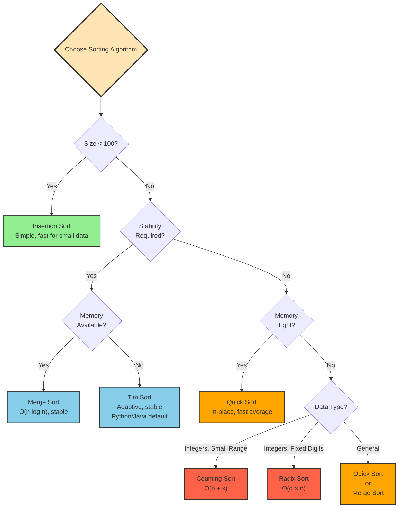

# Chapter 9: Sorting Algorithms

## 9.1 Problem Statement & Motivation

### What Problem Does Sorting Solve?

Unordered data has limitations:

- **Inefficient Search**: Linear search is O(n) in unsorted data
- **Poor User Experience**: Users expect sorted results
- **Inefficient Algorithms**: Many algorithms require sorted input
- **Data Analysis**: Statistical operations need ordered data
- **Database Performance**: Unsorted data requires full table scans

**Naive Approaches and Their Limitations**:

- **Manual Sorting**: Error-prone, doesn't scale
- **No Sorting**: Accept O(n) search, poor UX
- **Partial Sorting**: Inconsistent results

**The Sorting Solution**: Sorting algorithms arrange data in order, enabling O(log n) search, better user experience, and efficient algorithms that require sorted input.

### When to Use Sorting

✅ **Use sorting when**:
- Need efficient search (binary search requires sorted data)
- User expects ordered results
- Algorithm requires sorted input (merge, set operations)
- Data analysis needs ordered data
- Database indexing

✅ **Real-world applications**:
- Search engines (ranked results)
- E-commerce (price, rating sorting)
- Database indexes
- File systems (alphabetical listing)
- Data analysis and visualization
- Operating system process scheduling

### When NOT to Use Sorting

❌ **Avoid sorting when**:
- Data changes frequently (sorting cost may exceed benefit)
- Only need to find min/max (O(n) without sorting)
- Hash table provides O(1) lookup (no sorting needed)
- Very small datasets (overhead not worth it)

**Key Trade-off**: Sorting trades O(n log n) preprocessing time for O(log n) search and better user experience.

## 9.2 Conceptual Overview

**Sorting** is the process of arranging data in a particular order (ascending or descending). Sorting is one of the most fundamental operations in computer science and is used in countless applications, from organizing databases to preparing data for efficient searching.

### Intuitive Explanation

Think of sorting like organizing a deck of cards:
- **Goal**: Arrange cards in order (by suit, rank, etc.)
- **Comparison**: Compare two cards to determine order
- **Swap**: Move cards to correct positions
- **Result**: Ordered sequence

### Why Sorting Matters

1. **Search Efficiency**: Sorted data enables binary search (O(log n)) vs. linear search (O(n))
2. **Data Analysis**: Statistical operations often require sorted data
3. **User Interface**: Displaying sorted results improves user experience
4. **Database Operations**: Many database queries benefit from sorted indexes
5. **Algorithm Prerequisites**: Some algorithms require sorted input

### Sorting Criteria

- **Stability**: Maintains relative order of equal elements
- **In-place**: Uses O(1) extra space
- **Adaptive**: Performance improves with partially sorted data
- **Comparison-based**: Uses comparisons to determine order
- **Time Complexity**: Best, average, and worst-case performance

## 9.3 Abstract Model & Invariants ⭐

Understanding sorting invariants helps reason about correctness.

### Abstract Model

A sorting algorithm transforms:
- **Input**: Array/sequence of comparable elements
- **Output**: Same elements in sorted order
- **Comparison**: Binary relation defining order
- **Stability**: Relative order of equal elements preserved (if stable)

### Core Invariants

#### 1. Ordering Invariant

- After sorting, `arr[i] ≤ arr[i+1]` for all valid i (ascending)
- Or `arr[i] ≥ arr[i+1]` for all valid i (descending)
- All elements from original array present in result

#### 2. Stability Invariant (for stable sorts)

- If `arr[i] == arr[j]` and `i < j` before sorting, then `arr[i]` appears before `arr[j]` after sorting
- Relative order of equal elements preserved

#### 3. Completeness Invariant

- All elements from input appear in output
- No elements added or removed
- Output size equals input size

### How Sorting Preserves Invariants

- **Comparison**: Determines correct order
- **Swapping/Reordering**: Moves elements to correct positions
- **Partitioning** (divide & conquer): Sorts subarrays, then combines
- **Stability**: Maintains relative order during reordering

## 9.4 Operations & Interface

Sorting algorithms typically provide:

| Operation | Description | Precondition | Postcondition |
|-----------|-------------|-------------|---------------|
| `sort(array)` | Sorts array in-place | Array is valid | Array is sorted |
| `sort(array, comparator)` | Sorts with custom comparator | Valid comparator | Array sorted by comparator |
| `isSorted(array)` | Checks if sorted | - | Returns true if sorted |

### Behavioral Guarantees

- **Correctness**: Output is sorted according to comparison function
- **Completeness**: All input elements in output
- **Stability**: Equal elements maintain relative order (if stable sort)

## 9.5 Time & Space Complexity

### Comparison-Based Sorting Complexity

| Algorithm | Best | Average | Worst | Space | Stable | In-Place |
|-----------|------|---------|-------|-------|--------|----------|
| Bubble Sort | O(n) | O(n²) | O(n²) | O(1) | Yes | Yes |
| Selection Sort | O(n²) | O(n²) | O(n²) | O(1) | No | Yes |
| Insertion Sort | O(n) | O(n²) | O(n²) | O(1) | Yes | Yes |
| Merge Sort | O(n log n) | O(n log n) | O(n log n) | O(n) | Yes | No |
| Quick Sort | O(n log n) | O(n log n) | O(n²) | O(log n) | No | Yes |
| Heap Sort | O(n log n) | O(n log n) | O(n log n) | O(1) | No | Yes |

### Non-Comparison Sorting Complexity

| Algorithm | Best | Average | Worst | Space | Stable | Notes |
|-----------|------|---------|-------|-------|--------|-------|
| Counting Sort | O(n + k) | O(n + k) | O(n + k) | O(k) | Yes | k = range |
| Radix Sort | O(d(n + k)) | O(d(n + k)) | O(d(n + k)) | O(n + k) | Yes | d = digits |
| Bucket Sort | O(n + k) | O(n + k) | O(n²) | O(n) | Yes | k = buckets |

**Key Insight**: Non-comparison sorts can achieve O(n) time but have restrictions (limited range, integer keys).

## 9.6 Pseudocode (Language-Neutral) ⭐

This section presents sorting algorithms in language-neutral pseudocode.

### Bubble Sort

```
BUBBLE_SORT(array):
  n ← length(array)
  
  for i from 0 to n - 2:
    swapped ← false
    for j from 0 to n - i - 2:
      if array[j] > array[j + 1]:
        swap(array[j], array[j + 1])
        swapped ← true
    
    if not swapped:
      break  // Array is sorted
```

### Insertion Sort

```
INSERTION_SORT(array):
  n ← length(array)
  
  for i from 1 to n - 1:
    key ← array[i]
    j ← i - 1
    
    while j >= 0 and array[j] > key:
      array[j + 1] ← array[j]
      j ← j - 1
    
    array[j + 1] ← key
```

### Merge Sort

```
MERGE_SORT(array, left, right):
  if left < right:
    mid ← (left + right) / 2
    MERGE_SORT(array, left, mid)
    MERGE_SORT(array, mid + 1, right)
    MERGE(array, left, mid, right)

MERGE(array, left, mid, right):
  // Create temporary arrays
  left_array ← array[left to mid]
  right_array ← array[mid + 1 to right]
  
  i ← 0, j ← 0, k ← left
  
  while i < length(left_array) and j < length(right_array):
    if left_array[i] <= right_array[j]:
      array[k] ← left_array[i]
      i ← i + 1
    else:
      array[k] ← right_array[j]
      j ← j + 1
    k ← k + 1
  
  // Copy remaining elements
  while i < length(left_array):
    array[k] ← left_array[i]
    i ← i + 1
    k ← k + 1
  
  while j < length(right_array):
    array[k] ← right_array[j]
    j ← j + 1
    k ← k + 1
```

### Quick Sort

```
QUICK_SORT(array, left, right):
  if left < right:
    pivot_index ← PARTITION(array, left, right)
    QUICK_SORT(array, left, pivot_index - 1)
    QUICK_SORT(array, pivot_index + 1, right)

PARTITION(array, left, right):
  pivot ← array[right]
  i ← left - 1
  
  for j from left to right - 1:
    if array[j] <= pivot:
      i ← i + 1
      swap(array[i], array[j])
  
  swap(array[i + 1], array[right])
  return i + 1
```

### Heap Sort

```
HEAP_SORT(array):
  n ← length(array)
  
  // Build max heap
  for i from n/2 - 1 down to 0:
    HEAPIFY(array, n, i)
  
  // Extract elements one by one
  for i from n - 1 down to 1:
    swap(array[0], array[i])
    HEAPIFY(array, i, 0)

HEAPIFY(array, size, root):
  largest ← root
  left ← 2 * root + 1
  right ← 2 * root + 2
  
  if left < size and array[left] > array[largest]:
    largest ← left
  
  if right < size and array[right] > array[largest]:
    largest ← right
  
  if largest ≠ root:
    swap(array[root], array[largest])
    HEAPIFY(array, size, largest)
```

**Note**: This pseudocode is language-agnostic. The C++ implementation in the next section maps directly to these algorithms.

## 9.7 Implementation (Reference Language: C++) ⭐

**Note to Reader**: This section provides concrete C++ implementations. The correctness relies on the invariants defined in Section 9.3 and the pseudocode in Section 9.6.

### 9.7.1 Comparison-Based Sorting Algorithms

#### 1. Bubble Sort

Bubble Sort repeatedly steps through the list, compares adjacent elements, and swaps them if they are in the wrong order.

```cpp
#include <iostream>
#include <vector>
#include <algorithm>
#include <chrono>
using namespace std;

// Basic Bubble Sort
void bubbleSort(vector<int>& arr) {
    int n = arr.size();
    
    for (int i = 0; i < n - 1; i++) {
        for (int j = 0; j < n - i - 1; j++) {
            if (arr[j] > arr[j + 1]) {
                swap(arr[j], arr[j + 1]);
            }
        }
    }
}

// Optimized Bubble Sort (stops if no swaps in a pass)
void optimizedBubbleSort(vector<int>& arr) {
    int n = arr.size();
    bool swapped;
    
    for (int i = 0; i < n - 1; i++) {
        swapped = false;
        
        for (int j = 0; j < n - i - 1; j++) {
            if (arr[j] > arr[j + 1]) {
                swap(arr[j], arr[j + 1]);
                swapped = true;
            }
        }
        
        // If no swaps occurred, array is sorted
        if (!swapped) {
            break;
        }
    }
}

// Time Complexity: O(n²) worst/average, O(n) best
// Space Complexity: O(1)
// Stable: Yes
// In-place: Yes
```

### 2. Selection Sort

Selection Sort finds the minimum element and places it at the beginning.

```cpp
void selectionSort(vector<int>& arr) {
    int n = arr.size();
    
    for (int i = 0; i < n - 1; i++) {
        int minIndex = i;
        
        // Find minimum element in remaining array
        for (int j = i + 1; j < n; j++) {
            if (arr[j] < arr[minIndex]) {
                minIndex = j;
            }
        }
        
        // Swap with first element of unsorted portion
        if (minIndex != i) {
            swap(arr[i], arr[minIndex]);
        }
    }
}

// Time Complexity: O(n²) always
// Space Complexity: O(1)
// Stable: No
// In-place: Yes
```

### 3. Insertion Sort

Insertion Sort builds the sorted array one element at a time by inserting each element into its correct position.

```cpp
void insertionSort(vector<int>& arr) {
    int n = arr.size();
    
    for (int i = 1; i < n; i++) {
        int key = arr[i];
        int j = i - 1;
        
        // Move elements greater than key one position ahead
        while (j >= 0 && arr[j] > key) {
            arr[j + 1] = arr[j];
            j--;
        }
        
        arr[j + 1] = key;
    }
}

// Time Complexity: O(n²) worst/average, O(n) best
// Space Complexity: O(1)
// Stable: Yes
// In-place: Yes
// Adaptive: Yes
```

### 4. Merge Sort

Merge Sort uses the divide-and-conquer approach to sort arrays.

```cpp
// Merge function to combine two sorted arrays
void merge(vector<int>& arr, int left, int mid, int right) {
    int n1 = mid - left + 1;
    int n2 = right - mid;
    
    // Create temporary arrays
    vector<int> leftArr(n1);
    vector<int> rightArr(n2);
    
    // Copy data to temporary arrays
    for (int i = 0; i < n1; i++) {
        leftArr[i] = arr[left + i];
    }
    for (int j = 0; j < n2; j++) {
        rightArr[j] = arr[mid + 1 + j];
    }
    
    // Merge the temporary arrays back
    int i = 0, j = 0, k = left;
    
    while (i < n1 && j < n2) {
        if (leftArr[i] <= rightArr[j]) {
            arr[k] = leftArr[i];
            i++;
        } else {
            arr[k] = rightArr[j];
            j++;
        }
        k++;
    }
    
    // Copy remaining elements
    while (i < n1) {
        arr[k] = leftArr[i];
        i++;
        k++;
    }
    while (j < n2) {
        arr[k] = rightArr[j];
        j++;
        k++;
    }
}

// Merge sort function
void mergeSort(vector<int>& arr, int left, int right) {
    if (left < right) {
        int mid = left + (right - left) / 2;
        
        // Sort first and second halves
        mergeSort(arr, left, mid);
        mergeSort(arr, mid + 1, right);
        
        // Merge the sorted halves
        merge(arr, left, mid, right);
    }
}

// Wrapper function
void mergeSort(vector<int>& arr) {
    if (arr.size() > 1) {
        mergeSort(arr, 0, arr.size() - 1);
    }
}

// Time Complexity: O(n log n) always
// Space Complexity: O(n)
// Stable: Yes
// In-place: No
```

### 5. Quick Sort

Quick Sort uses a pivot element to partition the array and recursively sorts the partitions.

```cpp
// Partition function
int partition(vector<int>& arr, int low, int high) {
    int pivot = arr[high];  // Choose last element as pivot
    int i = low - 1;        // Index of smaller element
    
    for (int j = low; j < high; j++) {
        // If current element is smaller than or equal to pivot
        if (arr[j] <= pivot) {
            i++;
            swap(arr[i], arr[j]);
        }
    }
    
    swap(arr[i + 1], arr[high]);
    return i + 1;
}

// Quick sort function
void quickSort(vector<int>& arr, int low, int high) {
    if (low < high) {
        int pivotIndex = partition(arr, low, high);
        
        // Recursively sort elements before and after partition
        quickSort(arr, low, pivotIndex - 1);
        quickSort(arr, pivotIndex + 1, high);
    }
}

// Wrapper function
void quickSort(vector<int>& arr) {
    if (arr.size() > 1) {
        quickSort(arr, 0, arr.size() - 1);
    }
}

// Randomized Quick Sort (better average performance)
int randomizedPartition(vector<int>& arr, int low, int high) {
    int randomIndex = low + rand() % (high - low + 1);
    swap(arr[randomIndex], arr[high]);
    return partition(arr, low, high);
}

void randomizedQuickSort(vector<int>& arr, int low, int high) {
    if (low < high) {
        int pivotIndex = randomizedPartition(arr, low, high);
        randomizedQuickSort(arr, low, pivotIndex - 1);
        randomizedQuickSort(arr, pivotIndex + 1, high);
    }
}

// Time Complexity: O(n log n) average, O(n²) worst
// Space Complexity: O(log n) average, O(n) worst
// Stable: No
// In-place: Yes
```

### 6. Heap Sort

Heap Sort uses a binary heap data structure to sort elements.

```cpp
// Heapify function to maintain heap property
void heapify(vector<int>& arr, int n, int i) {
    int largest = i;        // Initialize largest as root
    int left = 2 * i + 1;   // Left child
    int right = 2 * i + 2;  // Right child
    
    // If left child is larger than root
    if (left < n && arr[left] > arr[largest]) {
        largest = left;
    }
    
    // If right child is larger than largest so far
    if (right < n && arr[right] > arr[largest]) {
        largest = right;
    }
    
    // If largest is not root
    if (largest != i) {
        swap(arr[i], arr[largest]);
        
        // Recursively heapify the affected sub-tree
        heapify(arr, n, largest);
    }
}

// Heap sort function
void heapSort(vector<int>& arr) {
    int n = arr.size();
    
    // Build heap (rearrange array)
    for (int i = n / 2 - 1; i >= 0; i--) {
        heapify(arr, n, i);
    }
    
    // One by one extract elements from heap
    for (int i = n - 1; i > 0; i--) {
        // Move current root to end
        swap(arr[0], arr[i]);
        
        // Call max heapify on the reduced heap
        heapify(arr, i, 0);
    }
}

// Time Complexity: O(n log n) always
// Space Complexity: O(1)
// Stable: No
// In-place: Yes
```

### 9.7.2 Non-Comparison Sorting Algorithms

### 1. Counting Sort

Counting Sort works by counting the number of objects having distinct key values.

```cpp
void countingSort(vector<int>& arr) {
    if (arr.empty()) return;
    
    // Find the maximum element
    int maxElement = *max_element(arr.begin(), arr.end());
    
    // Create count array
    vector<int> count(maxElement + 1, 0);
    
    // Count occurrences of each element
    for (int num : arr) {
        count[num]++;
    }
    
    // Modify count array to store actual position
    for (int i = 1; i <= maxElement; i++) {
        count[i] += count[i - 1];
    }
    
    // Build output array
    vector<int> output(arr.size());
    for (int i = arr.size() - 1; i >= 0; i--) {
        output[count[arr[i]] - 1] = arr[i];
        count[arr[i]]--;
    }
    
    // Copy output back to original array
    arr = output;
}

// Time Complexity: O(n + k) where k is range of input
// Space Complexity: O(k)
// Stable: Yes
// In-place: No
```

### 2. Radix Sort

Radix Sort sorts numbers by processing individual digits.

```cpp
// Counting sort for individual digit
void countingSortByDigit(vector<int>& arr, int exp) {
    vector<int> output(arr.size());
    vector<int> count(10, 0);
    
    // Count occurrences of each digit
    for (int num : arr) {
        count[(num / exp) % 10]++;
    }
    
    // Change count[i] to position of digit i in output
    for (int i = 1; i < 10; i++) {
        count[i] += count[i - 1];
    }
    
    // Build output array
    for (int i = arr.size() - 1; i >= 0; i--) {
        output[count[(arr[i] / exp) % 10] - 1] = arr[i];
        count[(arr[i] / exp) % 10]--;
    }
    
    // Copy output back to original array
    arr = output;
}

// Radix sort function
void radixSort(vector<int>& arr) {
    if (arr.empty()) return;
    
    // Find maximum number to know number of digits
    int maxNum = *max_element(arr.begin(), arr.end());
    
    // Do counting sort for every digit
    for (int exp = 1; maxNum / exp > 0; exp *= 10) {
        countingSortByDigit(arr, exp);
    }
}

// Time Complexity: O(d × (n + k)) where d is number of digits
// Space Complexity: O(n + k)
// Stable: Yes
// In-place: No
```

### 3. Bucket Sort

Bucket Sort distributes elements into buckets and sorts each bucket.

```cpp
void bucketSort(vector<double>& arr) {
    if (arr.empty()) return;
    
    int n = arr.size();
    vector<vector<double>> buckets(n);
    
    // Put array elements in different buckets
    for (double num : arr) {
        int bucketIndex = n * num;
        buckets[bucketIndex].push_back(num);
    }
    
    // Sort individual buckets
    for (auto& bucket : buckets) {
        sort(bucket.begin(), bucket.end());
    }
    
    // Concatenate all buckets into arr[]
    int index = 0;
    for (const auto& bucket : buckets) {
        for (double num : bucket) {
            arr[index++] = num;
        }
    }
}

// Time Complexity: O(n + k) average, O(n²) worst
// Space Complexity: O(n + k)
// Stable: Yes
// In-place: No
```

### 9.7.3 Hybrid Sorting Algorithms

### Timsort (Used in Python and Java)

Timsort is a hybrid stable sorting algorithm derived from merge sort and insertion sort.

```cpp
const int RUN = 32;

// Insertion sort for small arrays
void insertionSort(vector<int>& arr, int left, int right) {
    for (int i = left + 1; i <= right; i++) {
        int key = arr[i];
        int j = i - 1;
        
        while (j >= left && arr[j] > key) {
            arr[j + 1] = arr[j];
            j--;
        }
        arr[j + 1] = key;
    }
}

// Merge function for Timsort
void mergeTim(vector<int>& arr, int left, int mid, int right) {
    int len1 = mid - left + 1;
    int len2 = right - mid;
    
    vector<int> leftArr(len1);
    vector<int> rightArr(len2);
    
    for (int i = 0; i < len1; i++) {
        leftArr[i] = arr[left + i];
    }
    for (int j = 0; j < len2; j++) {
        rightArr[j] = arr[mid + 1 + j];
    }
    
    int i = 0, j = 0, k = left;
    
    while (i < len1 && j < len2) {
        if (leftArr[i] <= rightArr[j]) {
            arr[k] = leftArr[i];
            i++;
        } else {
            arr[k] = rightArr[j];
            j++;
        }
        k++;
    }
    
    while (i < len1) {
        arr[k] = leftArr[i];
        i++;
        k++;
    }
    while (j < len2) {
        arr[k] = rightArr[j];
        j++;
        k++;
    }
}

// Timsort function
void timSort(vector<int>& arr) {
    int n = arr.size();
    
    // Sort individual subarrays of size RUN
    for (int i = 0; i < n; i += RUN) {
        insertionSort(arr, i, min(i + RUN - 1, n - 1));
    }
    
    // Start merging from size RUN
    for (int size = RUN; size < n; size = 2 * size) {
        for (int left = 0; left < n; left += 2 * size) {
            int mid = left + size - 1;
            int right = min(left + 2 * size - 1, n - 1);
            
            if (mid < right) {
                mergeTim(arr, left, mid, right);
            }
        }
    }
}
```

## 9.8 Correctness Argument

This section explains why sorting algorithms produce correct results.

### Why Merge Sort Is Correct

**Correctness Argument**:
1. **Base Case**: Single element is trivially sorted ✓
2. **Divide**: Split array into two halves ✓
3. **Conquer**: Recursively sort both halves ✓
4. **Combine**: Merge two sorted halves produces sorted array ✓
5. **Induction**: If subarrays sorted, merged array sorted ✓

**Edge Cases Handled**:
- Empty array: Returns correctly ✓
- Single element: Already sorted ✓
- Odd length: Handled by floor division ✓

### Why Quick Sort Is Correct

**Correctness Argument**:
1. **Partition**: Elements < pivot on left, > pivot on right ✓
2. **Pivot Position**: Pivot in correct final position ✓
3. **Recursion**: Sort left and right partitions ✓
4. **Combination**: No merge needed (pivot separates) ✓

**Edge Cases Handled**:
- Already sorted: Degrades to O(n²) but still correct ✓
- All equal: Partition handles correctly ✓
- Pivot selection: Affects performance, not correctness ✓

### Why Heap Sort Is Correct

**Correctness Argument**:
1. **Heap Property**: Max heap has largest at root ✓
2. **Build Heap**: Creates valid max heap ✓
3. **Extract**: Remove root (largest), place at end ✓
4. **Heapify**: Restore heap property ✓
5. **Result**: Array sorted in ascending order ✓

**Edge Cases Handled**:
- Empty array: Returns correctly ✓
- Single element: Already sorted ✓

## 9.9 Edge Cases & Failure Modes

Understanding edge cases helps build defensive thinking.

### Empty Array

**Operations on Empty Array**:
- Sort: Returns empty array (no-op)
- Should handle gracefully

**Example Failure**: Accessing `array[0]` without size check

### Single Element Array

**Operations**:
- Already sorted
- No operations needed

**Example Failure**: Unnecessary comparisons or swaps

### Already Sorted Array

**Performance Impact**:
- Bubble Sort: O(n) with optimization
- Insertion Sort: O(n) - best case
- Quick Sort: O(n²) worst case (poor pivot)

**Example Failure**: Quick Sort with first element as pivot on sorted array → O(n²)

### All Equal Elements

**Operations**:
- All algorithms should handle correctly
- Stability matters for preserving order

**Example Failure**: Unstable sort changes relative order

### Very Large Arrays

**Memory Issues**:
- Merge Sort: O(n) extra space
- Recursive algorithms: Stack overflow risk

**Example Failure**: Merge Sort on very large array → out of memory

### Integer Overflow

**Problem**: Large array indices in calculations
- `(left + right) / 2` may overflow
- Should use `left + (right - left) / 2`

**Example Failure**: Merge Sort with large indices → overflow

## 9.10 Performance & System Considerations ⭐

This section connects sorting to real machine behavior.

### Memory Access Patterns

**Merge Sort**:
- Sequential access during merge
- Good cache behavior
- Extra memory allocation

**Quick Sort**:
- Random access during partition
- Poor cache behavior
- In-place (better memory)

**Insertion Sort**:
- Sequential access
- Excellent cache behavior
- Good for small arrays

### Cache Behavior

**Small Arrays (< cache size)**:
- All algorithms cache-friendly
- Insertion Sort often fastest

**Large Arrays**:
- Cache misses dominate
- Merge Sort better (sequential access)
- Quick Sort worse (random access)

### When Sorting Becomes Bottleneck

**Signs**:
- Sorting takes significant time
- Memory pressure from extra space
- Cache misses in profiling

**Solutions**:
- Choose algorithm based on data characteristics
- Use hybrid algorithms (Timsort)
- Consider parallel sorting for large datasets

## 9.11 Variants & Extensions

### Sorting Variants

- **Stable vs Unstable**: Preserve relative order of equals
- **In-place vs Extra Space**: Memory trade-offs
- **Adaptive**: Performance improves with partially sorted data
- **Comparison vs Non-comparison**: Different complexity bounds

### Hybrid Algorithms

- **Timsort**: Merge + Insertion (Python, Java)
- **Introsort**: Quick + Heap (C++ std::sort)
- **Adaptive**: Choose algorithm based on data

## 9.12 Real-World Implementations

### C++ Standard Library: std::sort

**Design Choices**:
- Typically Introsort (Quick + Heap)
- O(n log n) guaranteed
- Not stable (use std::stable_sort for stability)

**Use Cases**: General-purpose sorting in C++

### Python: list.sort(), sorted()

**Design Choices**:
- Timsort (hybrid)
- Stable
- Adaptive

**Use Cases**: Python's default sorting

### Java: Arrays.sort()

**Design Choices**:
- Dual-pivot Quick Sort (primitives)
- Timsort (objects)
- Adaptive

**Use Cases**: Java's default sorting

## 9.13 Common Pitfalls & Interview Traps

### 1. Assuming O(n log n) Is Always Best

**Pitfall**: Always use O(n log n) algorithm

**Reality**: O(n²) algorithms faster for small arrays

**Interview Trap**: Asked to optimize, choose Quick Sort for 10 elements

**Correct Approach**: Use Insertion Sort for small arrays

### 2. Ignoring Stability Requirements

**Pitfall**: Use unstable sort when stability needed

**Reality**: Relative order of equals changed

**Interview Trap**: Sort by one field, then another, expect stability

**Correct Approach**: Use stable sort (Merge Sort) or sort in reverse order

### 3. Quick Sort Worst Case

**Pitfall**: Using Quick Sort without considering worst case

**Reality**: O(n²) on sorted/reverse-sorted data

**Interview Trap**: Quick Sort on already sorted array

**Correct Approach**: Use randomized pivot or fallback to Heap Sort

### 4. Integer Overflow in Index Calculation

**Pitfall**: `(left + right) / 2` overflows

**Reality**: Incorrect indices, crashes

**Interview Trap**: Merge Sort with large array indices

**Correct Approach**: Use `left + (right - left) / 2`

### 5. Not Handling Empty/Single Element

**Pitfall**: Accessing array[0] without size check

**Reality**: Out of bounds, crashes

**Interview Trap**: Implement sort, forget edge cases

**Correct Approach**: Always check array size first

### 6. Memory Issues with Merge Sort

**Pitfall**: Merge Sort on very large array

**Reality**: Out of memory (O(n) extra space)

**Interview Trap**: Asked to sort large array, use Merge Sort

**Correct Approach**: Use in-place algorithm or external sort

### 9.5.1 Performance Comparison

### Time Complexity Summary

| Algorithm | Best Case | Average Case | Worst Case | Space Complexity |
|-----------|-----------|--------------|------------|------------------|
| Bubble Sort | O(n) | O(n²) | O(n²) | O(1) |
| Selection Sort | O(n²) | O(n²) | O(n²) | O(1) |
| Insertion Sort | O(n) | O(n²) | O(n²) | O(1) |
| Merge Sort | O(n log n) | O(n log n) | O(n log n) | O(n) |
| Quick Sort | O(n log n) | O(n log n) | O(n²) | O(log n) |
| Heap Sort | O(n log n) | O(n log n) | O(n log n) | O(1) |
| Counting Sort | O(n + k) | O(n + k) | O(n + k) | O(k) |
| Radix Sort | O(d × n) | O(d × n) | O(d × n) | O(n + k) |
| Bucket Sort | O(n + k) | O(n + k) | O(n²) | O(n + k) |

### When to Use Which Algorithm

1. **Small datasets (< 50 elements)**: Insertion Sort
2. **Nearly sorted data**: Insertion Sort or Bubble Sort
3. **General purpose**: Quick Sort or Merge Sort
4. **Memory constrained**: Heap Sort
5. **Stable sort required**: Merge Sort or Insertion Sort
6. **Integer data with small range**: Counting Sort
7. **Large datasets**: Merge Sort or Heap Sort
8. **Real-world applications**: Timsort or Introsort

### 9.5.2 Testing and Benchmarking

```cpp
// Utility functions for testing
vector<int> generateRandomArray(int size, int minVal = 1, int maxVal = 1000) {
    vector<int> arr(size);
    for (int i = 0; i < size; i++) {
        arr[i] = minVal + rand() % (maxVal - minVal + 1);
    }
    return arr;
}

vector<int> generateSortedArray(int size) {
    vector<int> arr(size);
    for (int i = 0; i < size; i++) {
        arr[i] = i;
    }
    return arr;
}

vector<int> generateReverseSortedArray(int size) {
    vector<int> arr(size);
    for (int i = 0; i < size; i++) {
        arr[i] = size - i;
    }
    return arr;
}

bool isSorted(const vector<int>& arr) {
    for (int i = 1; i < arr.size(); i++) {
        if (arr[i] < arr[i - 1]) {
            return false;
        }
    }
    return true;
}

void printArray(const vector<int>& arr) {
    for (int num : arr) {
        cout << num << " ";
    }
    cout << endl;
}

// Benchmarking function
template<typename SortFunction>
double benchmarkSort(SortFunction sortFunc, vector<int> arr) {
    auto start = chrono::high_resolution_clock::now();
    sortFunc(arr);
    auto end = chrono::high_resolution_clock::now();
    
    auto duration = chrono::duration_cast<chrono::microseconds>(end - start);
    return duration.count() / 1000.0; // Return time in milliseconds
}

void runSortingBenchmarks() {
    const int sizes[] = {100, 1000, 10000};
    const string algorithms[] = {"Bubble", "Selection", "Insertion", "Merge", "Quick", "Heap"};
    
    for (int size : sizes) {
        cout << "\nArray size: " << size << endl;
        cout << "Algorithm\t\tTime (ms)" << endl;
        cout << "----------------------------------------" << endl;
        
        vector<int> originalArray = generateRandomArray(size);
        
        // Test each algorithm
        vector<int> testArray = originalArray;
        cout << "Bubble Sort\t\t" << benchmarkSort(bubbleSort, testArray) << endl;
        
        testArray = originalArray;
        cout << "Selection Sort\t\t" << benchmarkSort(selectionSort, testArray) << endl;
        
        testArray = originalArray;
        cout << "Insertion Sort\t\t" << benchmarkSort(insertionSort, testArray) << endl;
        
        testArray = originalArray;
        cout << "Merge Sort\t\t" << benchmarkSort(mergeSort, testArray) << endl;
        
        testArray = originalArray;
        cout << "Quick Sort\t\t" << benchmarkSort(quickSort, testArray) << endl;
        
        testArray = originalArray;
        cout << "Heap Sort\t\t" << benchmarkSort(heapSort, testArray) << endl;
    }
}
```

## 9.14 Choosing the Right Sorting Algorithm

Sorting algorithms aren't just academic exercises—they're engineering decisions. Here's how to choose:

### Decision Framework

#### 1. Dataset Size

**Small datasets (< 100 elements):**
- **Insertion Sort**: Simple, cache-friendly, O(n) for nearly sorted
- **Selection Sort**: Minimal writes (useful for flash memory)
- **Why**: O(n²) algorithms are fast enough, simpler code

**Medium datasets (100 - 10,000 elements):**
- **Quick Sort**: Excellent average case, in-place
- **Merge Sort**: Guaranteed O(n log n), stable
- **Why**: O(n log n) algorithms shine, cache still effective

**Large datasets (> 10,000 elements):**
- **Quick Sort**: With good pivot selection
- **Heap Sort**: Guaranteed O(n log n), no worst-case degradation
- **Hybrid (Timsort)**: Combines merge + insertion (used in Python, Java)
- **Why**: Cache misses matter, need guaranteed performance

#### 2. Memory Constraints

**Tight Memory (Embedded Systems):**
- **In-place algorithms**: Quick Sort, Heap Sort, Insertion Sort
- **Avoid**: Merge Sort (requires O(n) extra space)
- **Consider**: Selection Sort (minimal writes for flash memory)

**Adequate Memory:**
- **Merge Sort**: Stable, predictable, parallelizable
- **Quick Sort**: Faster in practice, but needs fallback for worst case

#### 3. Stability Requirements

**Stability Required:**
- **Merge Sort**: Always stable, O(n log n)
- **Insertion Sort**: Stable, good for small/partially sorted data
- **Avoid**: Quick Sort, Heap Sort (not stable)

**Stability Not Required:**
- **Quick Sort**: Faster, in-place
- **Heap Sort**: Guaranteed O(n log n), in-place

#### 4. Data Characteristics

**Nearly Sorted Data:**
- **Insertion Sort**: O(n) best case, adaptive
- **Bubble Sort**: O(n) best case (but still slower than insertion)
- **Avoid**: Quick Sort (may degrade to O(n²))

**Random Data:**
- **Quick Sort**: Excellent average case
- **Merge Sort**: Consistent performance

**Reverse Sorted:**
- **Merge Sort**: Consistent O(n log n)
- **Avoid**: Quick Sort with naive pivot (O(n²))

#### 5. Online vs. Offline

**Online (Streaming Data):**
- **Insertion Sort**: Process as data arrives
- **Heap-based**: Maintain sorted window

**Offline (All Data Available):**
- **Quick Sort**: Best average performance
- **Merge Sort**: Predictable, parallelizable

### Real-World Recommendations

**General Purpose (C++ std::sort):**
- Uses **Introsort**: Quick Sort → Heap Sort fallback → Insertion Sort for small arrays
- Combines best of all worlds

**Database Systems:**
- **External Sort**: Merge Sort variant for disk-based sorting
- **Index Building**: Often uses multi-way merge

**Embedded Systems:**
- **Insertion Sort**: Small datasets, simple, predictable
- **Heap Sort**: When guaranteed O(n log n) needed

**Parallel Systems:**
- **Merge Sort**: Naturally parallelizable (divide-and-conquer)
- **Sample Sort**: Parallel Quick Sort variant

### Comprehensive Comparison Table

| Algorithm | Best Time | Average Time | Worst Time | Space | Stable | In-Place | Adaptive | Notes |
|-----------|-----------|--------------|------------|-------|--------|----------|----------|-------|
| **Bubble Sort** | O(n) | O(n²) | O(n²) | O(1) | Yes | Yes | Yes | Simple, educational only |
| **Selection Sort** | O(n²) | O(n²) | O(n²) | O(1) | No | Yes | No | Always O(n²), simple |
| **Insertion Sort** | O(n) | O(n²) | O(n²) | O(1) | Yes | Yes | Yes | Best for small/nearly sorted |
| **Merge Sort** | O(n log n) | O(n log n) | O(n log n) | O(n) | Yes | No | No | Guaranteed O(n log n), parallelizable |
| **Quick Sort** | O(n log n) | O(n log n) | O(n²) | O(log n) | No | Yes | No | Fast average, pivot choice matters |
| **Heap Sort** | O(n log n) | O(n log n) | O(n log n) | O(1) | No | Yes | No | Guaranteed O(n log n), in-place |
| **Counting Sort** | O(n + k) | O(n + k) | O(n + k) | O(k) | Yes | No | No | k = range of values |
| **Radix Sort** | O(d × n) | O(d × n) | O(d × n) | O(n + k) | Yes | No | No | d = number of digits |
| **Tim Sort** | O(n) | O(n log n) | O(n log n) | O(n) | Yes | No | Yes | Python/Java default, hybrid |

**Key**:
- **k**: Range of values (for Counting/Radix Sort)
- **d**: Number of digits (for Radix Sort)
- **Stable**: Maintains relative order of equal elements
- **In-Place**: Uses O(1) extra space (ignoring recursion stack)
- **Adaptive**: Performance improves with partially sorted data

### Sorting Algorithm Decision Tree



**Remember**: The "best" algorithm depends on your constraints. `std::sort` uses a hybrid approach (Introsort) for good reason—it adapts to different scenarios.

### Additional Practical Considerations

### When to Use Each Algorithm

#### Small Arrays (< 100 elements)
- **Insertion Sort**: Simple, fast enough, adaptive
- **Why**: Overhead of O(n log n) algorithms not worth it for small n

#### Nearly Sorted Data
- **Insertion Sort**: O(n) best case, adaptive
- **Tim Sort**: Excellent adaptive performance
- **Avoid**: Quick Sort (may degrade to O(n²))

#### Guaranteed O(n log n) Required
- **Merge Sort**: Always O(n log n), stable
- **Heap Sort**: Always O(n log n), in-place
- **Tim Sort**: Always O(n log n), adaptive

#### In-Place Requirement
- **Quick Sort**: Fast average, in-place
- **Heap Sort**: Guaranteed O(n log n), in-place
- **Insertion Sort**: Simple, in-place

#### Stability Required
- **Merge Sort**: Classic stable sort
- **Tim Sort**: Stable, adaptive
- **Insertion Sort**: Stable, simple
- **Counting Sort**: Stable, O(n + k)
- **Radix Sort**: Stable, O(d × n)

#### Integer Data with Small Range
- **Counting Sort**: O(n + k) where k is range
- **Radix Sort**: O(d × n) for fixed-width integers

#### General Purpose (No Special Requirements)
- **C++ std::sort**: Introsort (hybrid Quick/Heap/Insertion)
- **Python/Java**: Tim Sort (default)
- **Both**: Production-tested, optimized

### Real-World Performance Tips

1. **Use Library Functions**: `std::sort`, `std::stable_sort` are highly optimized
2. **Profile First**: Don't optimize prematurely
3. **Consider Data Characteristics**: Nearly sorted? Use adaptive algorithm
4. **Memory Constraints**: Choose in-place algorithms if memory is tight
5. **Stability Matters**: If equal elements must maintain order, use stable sort

### Common Mistakes to Avoid

1. **Reinventing the Wheel**: Use library functions unless you have specific needs
2. **Ignoring Stability**: May cause subtle bugs if order matters
3. **Wrong Algorithm for Data**: Don't use Quick Sort for nearly sorted data
4. **Not Considering Range**: For small integer ranges, Counting Sort is faster
5. **Premature Optimization**: Profile before optimizing

## 9.15 Exercises & Thought Questions

### Conceptual Questions

1. **When would you choose Merge Sort over Quick Sort?**
   - Explain the trade-offs
   - Give specific scenarios

2. **Why is Insertion Sort faster than Quick Sort for small arrays?**
   - Explain cache behavior
   - When does this matter?

3. **What is stability in sorting and when does it matter?**
   - Give examples
   - Which algorithms are stable?

4. **Compare comparison-based vs non-comparison sorting:**
   - When can you use non-comparison sorts?
   - What are the limitations?

### Implementation Tasks

1. **Implement Merge Sort**
   - Handle edge cases
   - Optimize merge function
   - Add stability guarantee

2. **Implement Quick Sort**
   - Use randomized pivot
   - Handle worst case
   - Add fallback to Heap Sort

3. **Implement hybrid sort**
   - Use Insertion Sort for small subarrays
   - Combine with Merge/Quick Sort

### Performance Reasoning

1. **Analyze cache behavior:**
   - Why is Insertion Sort cache-friendly?
   - When does cache matter most?
   - Compare Merge vs Quick Sort cache behavior

2. **Space-time trade-offs:**
   - When is O(n) extra space acceptable?
   - When must you use in-place sorting?

### Interview-Style Problems

1. **Sort Colors** (LeetCode 75) - Counting Sort
2. **Kth Largest Element** (LeetCode 215) - Quick Select
3. **Merge Sorted Arrays** (LeetCode 88)
4. **Sort an Array** (LeetCode 912) - Implement sorting
5. **Wiggle Sort** (LeetCode 280) - Custom comparator

## 9.16 Key Takeaways

1. **Sorting algorithms** vary in performance characteristics and use cases
2. **Comparison-based sorts** have O(n log n) lower bound in worst case
3. **Non-comparison sorts** can achieve O(n) time complexity under specific conditions
4. **Stability** and **in-place** properties are important considerations
5. **Real-world performance** depends on data characteristics and implementation details
6. **Hybrid algorithms** combine benefits of multiple sorting techniques

### Additional Exercises

1. Implement a stable version of Quick Sort.
2. Write a function to sort an array of strings using Radix Sort.
3. Create a hybrid sorting algorithm that uses Insertion Sort for small arrays and Merge Sort for larger ones.
4. Implement a function to find the kth smallest element using Quick Select.
5. Write a program to sort an array of custom objects with multiple fields.

## 9.17 Summary

Sorting algorithms are fundamental tools in computer science, each with unique characteristics and optimal use cases. Understanding the trade-offs between different sorting algorithms helps in choosing the right one for specific applications. From simple O(n²) algorithms like Bubble Sort to sophisticated O(n log n) algorithms like Merge Sort and Quick Sort, each has its place in the programmer's toolkit. Non-comparison sorting algorithms like Counting Sort and Radix Sort can achieve linear time complexity under specific conditions, making them valuable for specialized use cases.

In the next chapter, we'll explore searching algorithms, which often work in conjunction with sorting to provide efficient data retrieval mechanisms.
