# Chapter 11: Graphs

## 11.1 Introduction to Graphs

A **graph** is a collection of vertices (nodes) connected by edges. Unlike trees (Chapter 6), graphs can have cycles and multiple paths between vertices, making them ideal for modeling complex relationships.

### Key Characteristics

- **Vertices (Nodes)**: The fundamental units
- **Edges**: Connections between vertices (can be directed/undirected, weighted/unweighted)
- **Cyclic/Acyclic**: Can contain cycles (unlike trees from Chapter 6)

### Why Graphs Matter

Graphs model real-world relationships (networks, dependencies, maps) and are fundamental to many algorithms. They're essential for system design (routing, scheduling) and frequently appear in technical interviews.

### Graph vs. Trees

| Feature | Tree | Graph |
|---------|------|-------|
| Connectivity | Connected | Can be disconnected |
| Cycles | No cycles | Can have cycles |
| Root | Has a root | No root |
| Parent-Child | Hierarchical | No hierarchy |
| Edges | n-1 edges (n nodes) | Can have any number |

### 11.1.1 Core Invariants

Understanding graph invariants helps reason about graph algorithms and representations.

#### Core Invariants of a Graph

1. **Edge Consistency Invariant**:
   - If edge (u, v) exists in undirected graph, then (v, u) must be represented
   - If edge (u, v) exists in directed graph, (v, u) may or may not exist
   - Edge representation matches graph type (directed/undirected)

2. **Vertex-Edge Relationship Invariant**:
   - Every edge connects exactly two vertices (or one vertex to itself for self-loops)
   - Vertices referenced by edges must exist in the graph
   - No dangling edges (edges pointing to non-existent vertices)

3. **Representation Consistency Invariant**:
   - Adjacency list/matrix accurately reflects all edges
   - No duplicate edges (unless multigraph)
   - Graph representation matches graph structure

4. **Weight Invariant** (for weighted graphs):
   - All edges have valid weights
   - Weight values are consistent with graph semantics (distances, costs, etc.)

#### What Breaks Invariants

- **Inconsistent edge representation**: Undirected graph with only one direction stored → breaks edge consistency
- **Dangling references**: Edge points to deleted vertex → breaks vertex-edge relationship
- **Stale adjacency data**: Vertex deleted but edges remain → breaks representation consistency
- **Invalid weights**: Negative weights in distance graph → breaks weight invariant

#### How Operations Restore Invariants

- **Add edge**: Update both vertices' adjacency lists/matrix → preserves edge consistency
- **Remove vertex**: Remove all incident edges first → preserves vertex-edge relationship
- **Update representation**: Rebuild adjacency structure → restores representation consistency

**Example**: When adding an edge (u, v) to an undirected graph:
1. Add v to u's adjacency list (preserves edge consistency)
2. Add u to v's adjacency list (preserves edge consistency for undirected graph)
3. Update adjacency matrix if used (preserves representation consistency)

Note: This builds on the **connectivity invariant** we established in Chapter 6 (Trees), but graphs relax the acyclicity constraint. Unlike trees, graphs can have cycles and multiple paths between vertices, which requires different representation strategies (adjacency matrix vs. list) as we'll see next.

## 11.2 Graph Terminology

### Basic Terms

- **Vertex (Node)**: A point in the graph
- **Edge**: A connection between two vertices
- **Adjacent Vertices**: Vertices connected by an edge
- **Degree**: Number of edges incident to a vertex
  - **In-degree**: Number of incoming edges (directed graphs)
  - **Out-degree**: Number of outgoing edges (directed graphs)
- **Path**: Sequence of vertices connected by edges
- **Cycle**: Path that starts and ends at the same vertex
- **Connected Graph**: Every vertex is reachable from every other vertex
- **Subgraph**: A graph formed by a subset of vertices and edges

### Graph Types

#### 1. Undirected Graph
Edges have no direction - connection is bidirectional.

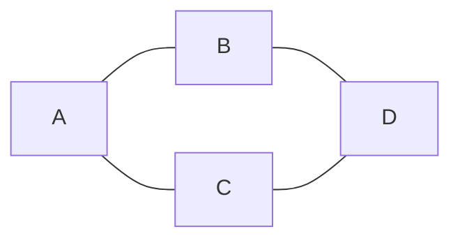

#### 2. Directed Graph (Digraph)
Edges have direction - connection is one-way.

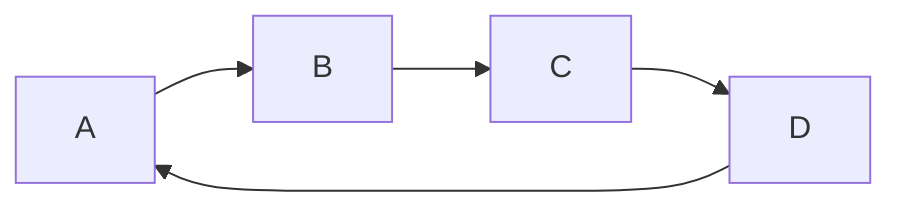

#### 3. Weighted Graph
Edges have associated weights (costs, distances, etc.).

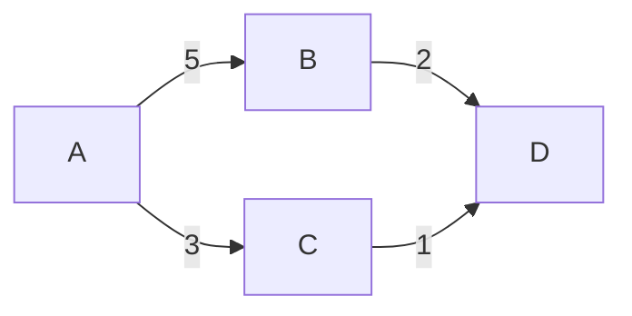

#### 4. Unweighted Graph
All edges have equal weight (or no weight).

#### 5. Complete Graph
Every pair of vertices is connected by an edge.

#### 6. Bipartite Graph
Vertices can be divided into two sets such that no edges exist within the same set.

## 11.3 Graph Representations

### 11.3.1 Adjacency Matrix

An **adjacency matrix** is a 2D array where `matrix[i][j]` indicates if there's an edge between vertex `i` and vertex `j`.

#### Implementation
```cpp
#include <iostream>
#include <vector>
#include <limits>
using namespace std;

class GraphMatrix {
private:
    vector<vector<int>> adjMatrix;
    int numVertices;
    bool directed;
    
public:
    GraphMatrix(int vertices, bool isDirected = false) 
        : numVertices(vertices), directed(isDirected) {
        adjMatrix.resize(vertices, vector<int>(vertices, 0));
    }
    
    void addEdge(int from, int to, int weight = 1) {
        if (from >= 0 && from < numVertices && to >= 0 && to < numVertices) {
            adjMatrix[from][to] = weight;
            if (!directed) {
                adjMatrix[to][from] = weight;
            }
        }
    }
    
    void removeEdge(int from, int to) {
        if (from >= 0 && from < numVertices && to >= 0 && to < numVertices) {
            adjMatrix[from][to] = 0;
            if (!directed) {
                adjMatrix[to][from] = 0;
            }
        }
    }
    
    bool hasEdge(int from, int to) const {
        if (from >= 0 && from < numVertices && to >= 0 && to < numVertices) {
            return adjMatrix[from][to] != 0;
        }
        return false;
    }
    
    int getWeight(int from, int to) const {
        if (from >= 0 && from < numVertices && to >= 0 && to < numVertices) {
            return adjMatrix[from][to];
        }
        return 0;
    }
    
    void print() const {
        cout << "Adjacency Matrix:" << endl;
        cout << "  ";
        for (int i = 0; i < numVertices; i++) {
            cout << i << " ";
        }
        cout << endl;
        
        for (int i = 0; i < numVertices; i++) {
            cout << i << " ";
            for (int j = 0; j < numVertices; j++) {
                cout << adjMatrix[i][j] << " ";
            }
            cout << endl;
        }
    }
    
    int getNumVertices() const { return numVertices; }
};
```

#### Advantages and Disadvantages

**Advantages:**
- O(1) edge lookup
- Simple to implement
- Easy to check if edge exists
- Good for dense graphs

**Disadvantages:**
- O(V²) space complexity
- Inefficient for sparse graphs
- Adding/removing vertices is expensive

### 11.3.1.1 Systems Perspective: Memory Layout and Cache Behavior

Understanding graph representation at the system level reveals critical performance trade-offs.

#### Memory Layout Comparison

**Adjacency Matrix:**
- **Memory Layout**: Contiguous 2D array (like 2D arrays from Chapter 3)
- **Cache Performance**: Excellent for dense graphs - sequential access patterns
- **Memory Overhead**: O(V²) - significant for large graphs
- **Access Pattern**: Random access for edge queries, but matrix is cache-friendly

**Adjacency List:**
- **Memory Layout**: Array of linked lists (combines arrays from Chapter 3 with linked lists from Chapter 4)
- **Cache Performance**: Poor - pointer chasing causes cache misses
- **Memory Overhead**: O(V + E) - efficient for sparse graphs
- **Access Pattern**: Sequential within each list, but jumping between lists hurts cache

**Performance Comparison (Real-World):**
```
Operation          | Adjacency Matrix | Adjacency List
-------------------|------------------|---------------
Edge Query         | ~5 cycles        | ~50-100 cycles
Iterate Neighbors  | O(V) scans       | O(degree) - cache-friendly
Memory (sparse)    | O(V²)            | O(V + E) - much better
Cache Misses       | 0-1 per query    | 2-5 per neighbor
```

#### When Each Representation Wins

**Use Adjacency Matrix When:**
- Graph is dense (E ≈ V²)
- Need frequent edge existence checks
- Cache performance matters more than memory
- Graph is small enough to fit in memory

**Use Adjacency List When:**
- Graph is sparse (E << V²)
- Memory is constrained
- Need to iterate neighbors frequently
- Graph is large (memory savings significant)

**Real-World Example:**
- **Social Networks**: Sparse (each person has ~100-1000 friends) → Adjacency List
- **Complete Graphs**: Dense (all pairs connected) → Adjacency Matrix
- **Road Networks**: Sparse (each intersection connects to ~4 roads) → Adjacency List

### 11.3.2 Adjacency List

An **adjacency list** stores each vertex's neighbors in a list or array.

#### Implementation
```cpp
#include <iostream>
#include <vector>
#include <list>
#include <unordered_map>
using namespace std;

struct Edge {
    int to;
    int weight;
    
    Edge(int t, int w = 1) : to(t), weight(w) {}
};

class GraphList {
private:
    vector<list<Edge>> adjList;
    int numVertices;
    bool directed;
    
public:
    GraphList(int vertices, bool isDirected = false) 
        : numVertices(vertices), directed(isDirected) {
        adjList.resize(vertices);
    }
    
    void addEdge(int from, int to, int weight = 1) {
        if (from >= 0 && from < numVertices && to >= 0 && to < numVertices) {
            adjList[from].push_back(Edge(to, weight));
            if (!directed) {
                adjList[to].push_back(Edge(from, weight));
            }
        }
    }
    
    void removeEdge(int from, int to) {
        if (from >= 0 && from < numVertices && to >= 0 && to < numVertices) {
            adjList[from].remove_if([to](const Edge& e) { return e.to == to; });
            if (!directed) {
                adjList[to].remove_if([from](const Edge& e) { return e.to == from; });
            }
        }
    }
    
    bool hasEdge(int from, int to) const {
        if (from >= 0 && from < numVertices) {
            for (const Edge& edge : adjList[from]) {
                if (edge.to == to) {
                    return true;
                }
            }
        }
        return false;
    }
    
    const list<Edge>& getNeighbors(int vertex) const {
        if (vertex >= 0 && vertex < numVertices) {
            return adjList[vertex];
        }
        static list<Edge> empty;
        return empty;
    }
    
    void print() const {
        cout << "Adjacency List:" << endl;
        for (int i = 0; i < numVertices; i++) {
            cout << i << ": ";
            for (const Edge& edge : adjList[i]) {
                cout << "(" << edge.to << ", " << edge.weight << ") ";
            }
            cout << endl;
        }
    }
    
    int getNumVertices() const { return numVertices; }
};
```

#### Advantages and Disadvantages

**Advantages:**
- O(V + E) space complexity (efficient for sparse graphs)
- Easy to iterate over neighbors
- Easy to add/remove edges
- Memory efficient

**Disadvantages:**
- O(degree) edge lookup
- Slightly more complex implementation
- Less cache-friendly than matrix

### 11.3.3 Comparison

| Operation | Adjacency Matrix | Adjacency List |
|-----------|-----------------|----------------|
| Space | O(V²) | O(V + E) |
| Check Edge | O(1) | O(degree) |
| Add Edge | O(1) | O(1) |
| Remove Edge | O(1) | O(degree) |
| Iterate Neighbors | O(V) | O(degree) |
| Best For | Dense graphs | Sparse graphs |

## 11.4 Graph Traversal

### 11.4.1 Depth-First Search (DFS)

**Depth-First Search** explores as far as possible along each branch before backtracking. Think of it like exploring a maze: you go as deep as possible down one path, and only when you hit a dead end do you backtrack to try another path.

#### How DFS Works: Step-by-Step Example

Let's trace through DFS on the following graph, starting from vertex A:

**Graph:**
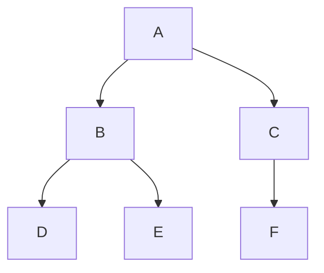

**Step-by-Step Traversal:**

**Step 1: Start at A**
```
Visited: [A]
Stack: [A]
Current: A
```

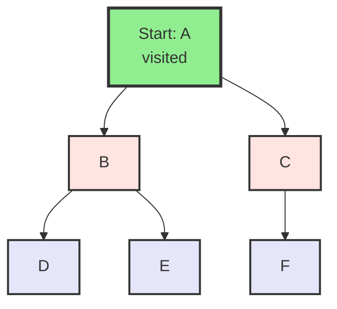

**Step 2: Visit A's neighbors (B, C) - push to stack**
```
Visited: [A]
Stack: [A, C, B]  (push in reverse order for correct traversal)
Current: A
```
We push C first, then B, so B is on top (will be explored first).

**Step 3: Pop B, mark visited, explore its neighbors**
```
Visited: [A, B]
Stack: [A, C]
Current: B
```

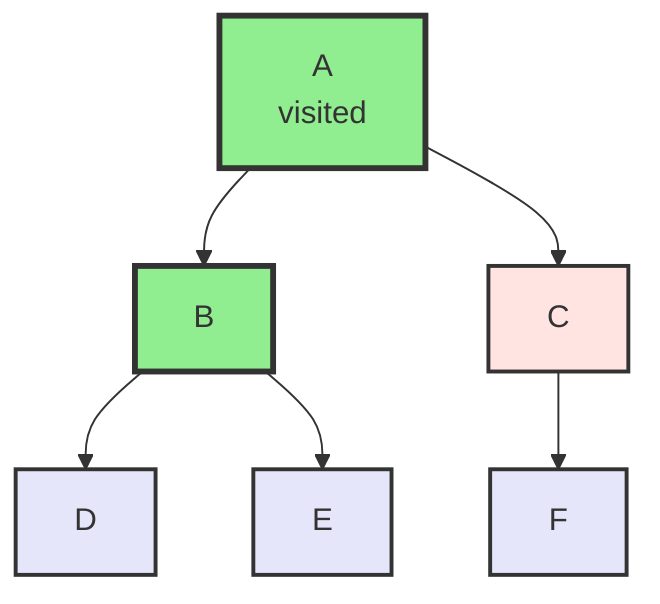

**Step 4: Visit B's neighbors (D, E) - push to stack**
```
Visited: [A, B]
Stack: [A, C, E, D]  (E on top)
Current: B
```

**Step 5: Pop D, mark visited**
```
Visited: [A, B, D]
Stack: [A, C, E]
Current: D
```

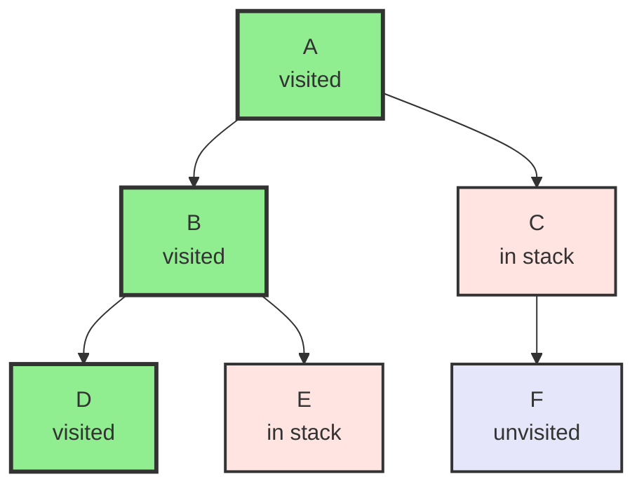

**Step 6: Pop E, mark visited**
```
Visited: [A, B, D, E]
Stack: [A, C]
Current: E
```

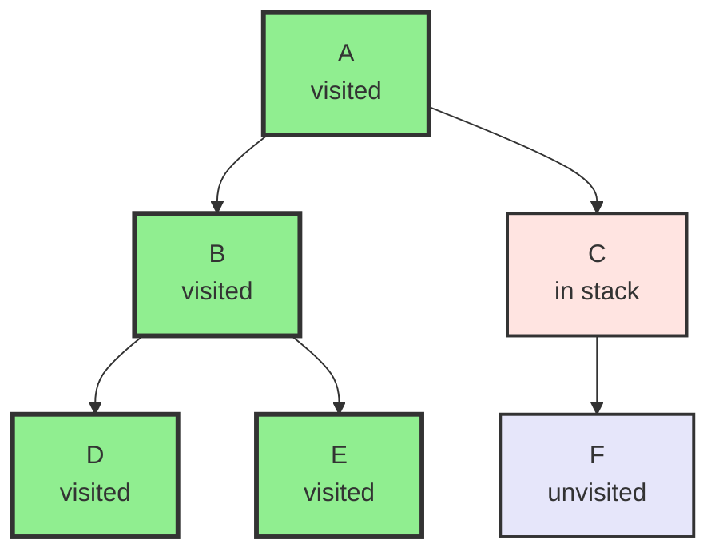

**Step 7: Pop C, mark visited, explore its neighbors**
```
Visited: [A, B, D, E, C]
Stack: [A]
Current: C
```

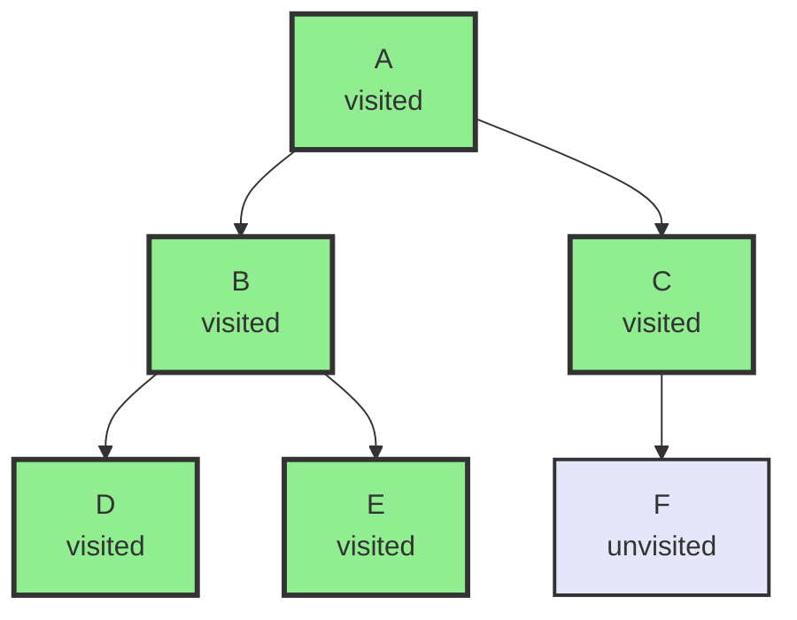

**Step 8: Visit C's neighbor (F) - push to stack**
```
Visited: [A, B, D, E, C]
Stack: [A, F]
Current: C
```

**Step 9: Pop F, mark visited**
```
Visited: [A, B, D, E, C, F]
Stack: [A]
Current: F
```

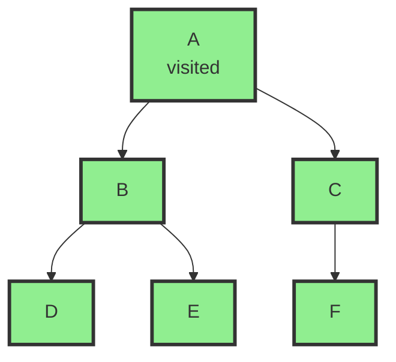

**Step 10: Pop A (already visited, stack empty)**
```
Visited: [A, B, D, E, C, F]
Stack: []
DFS Complete!
```

**Final Traversal Order:** A → B → D → E → C → F

**Key Observations:**
- DFS goes **deep** before going **wide**
- Uses a **stack** (implicit in recursion, explicit in iterative)
- Backtracks when no unvisited neighbors remain
- Visits all vertices in a connected component

#### Visual Comparison: DFS vs BFS

**Same Graph, DFS (starting from A):**
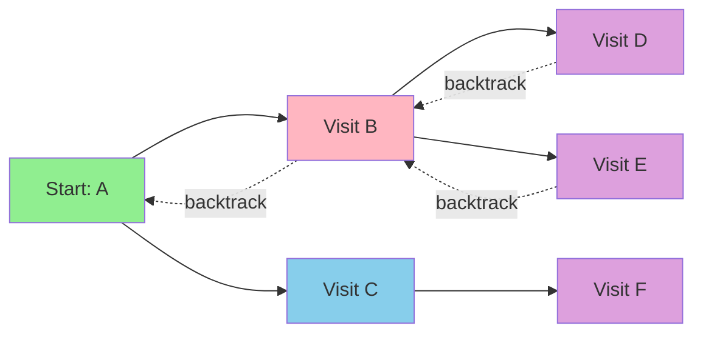

**Same Graph, BFS (starting from A):**
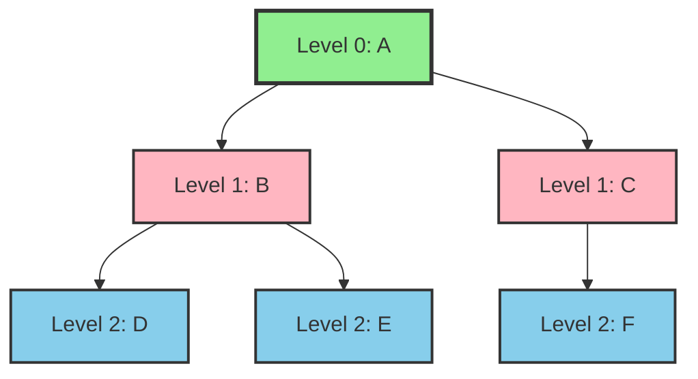

#### Recursive Implementation
```cpp
#include <vector>
#include <stack>
#include <iostream>
using namespace std;

class GraphDFS {
private:
    vector<list<Edge>> adjList;
    int numVertices;
    
    void dfsRecursive(int vertex, vector<bool>& visited, vector<int>& result) {
        visited[vertex] = true;
        result.push_back(vertex);
        
        for (const Edge& edge : adjList[vertex]) {
            if (!visited[edge.to]) {
                dfsRecursive(edge.to, visited, result);
            }
        }
    }
    
public:
    GraphDFS(int vertices) : numVertices(vertices) {
        adjList.resize(vertices);
    }
    
    void addEdge(int from, int to, int weight = 1) {
        adjList[from].push_back(Edge(to, weight));
        adjList[to].push_back(Edge(from, weight));
    }
    
    vector<int> dfs(int start) {
        vector<bool> visited(numVertices, false);
        vector<int> result;
        
        dfsRecursive(start, visited, result);
        return result;
    }
    
    vector<int> dfsAll() {
        vector<bool> visited(numVertices, false);
        vector<int> result;
        
        for (int i = 0; i < numVertices; i++) {
            if (!visited[i]) {
                dfsRecursive(i, visited, result);
            }
        }
        
        return result;
    }
};
```

#### Iterative Implementation
```cpp
vector<int> dfsIterative(int start) {
    vector<bool> visited(numVertices, false);
    vector<int> result;
    stack<int> stk;
    
    stk.push(start);
    
    while (!stk.empty()) {
        int vertex = stk.top();
        stk.pop();
        
        if (!visited[vertex]) {
            visited[vertex] = true;
            result.push_back(vertex);
            
            // Push neighbors in reverse order to maintain same traversal
            for (auto it = adjList[vertex].rbegin(); it != adjList[vertex].rend(); ++it) {
                if (!visited[it->to]) {
                    stk.push(it->to);
                }
            }
        }
    }
    
    return result;
}
```

#### Applications of DFS
- Finding connected components
- Detecting cycles
- Topological sorting
- Finding strongly connected components
- Solving mazes
- Path finding

### 11.4.2 Breadth-First Search (BFS)

**Breadth-First Search** explores all neighbors at the current depth before moving to the next level. Think of it like ripples in water: it expands outward level by level, exploring all vertices at distance 1, then all at distance 2, and so on.

#### How BFS Works: Step-by-Step Example

Let's trace through BFS on the following graph, starting from vertex A:

**Graph:**


**Step-by-Step Traversal:**

**Step 1: Start at A, mark visited, enqueue**
```
Visited: [A]
Queue: [A]
Current Level: 0
```

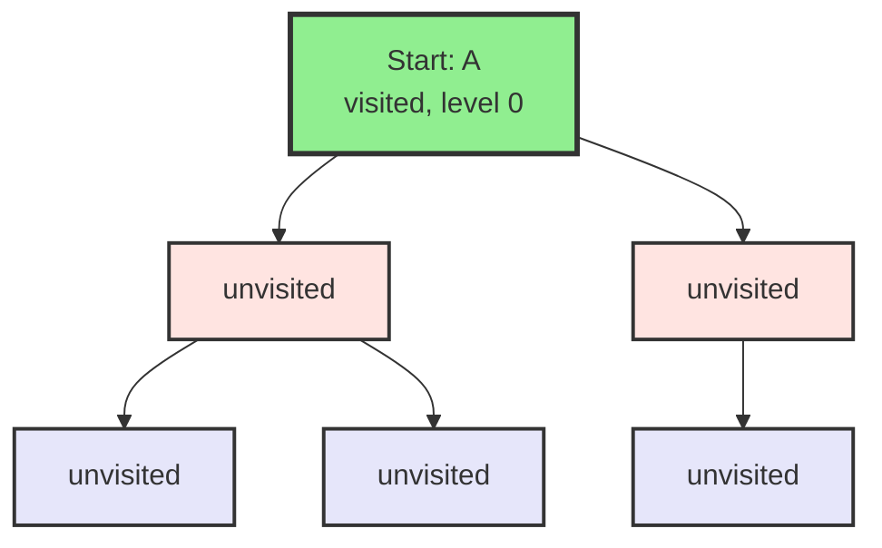

**Step 2: Dequeue A, visit its neighbors (B, C)**
```
Visited: [A]
Queue: [B, C]  (enqueue neighbors)
Current Level: 0 → 1
```

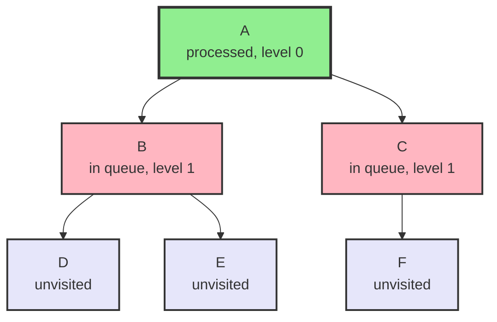

**Step 3: Dequeue B, mark visited, enqueue its neighbors (D, E)**
```
Visited: [A, B]
Queue: [C, D, E]
Current Level: 1
```

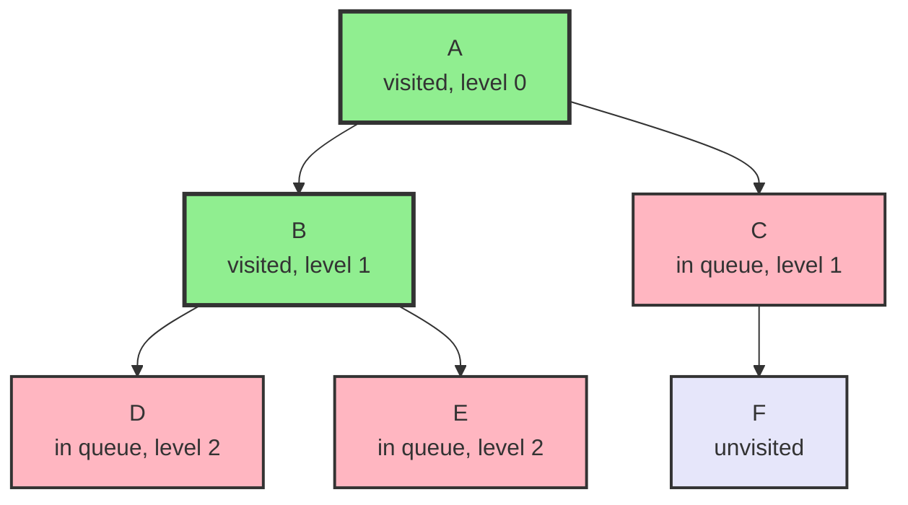

**Step 4: Dequeue C, mark visited, enqueue its neighbor (F)**
```
Visited: [A, B, C]
Queue: [D, E, F]
Current Level: 1
```

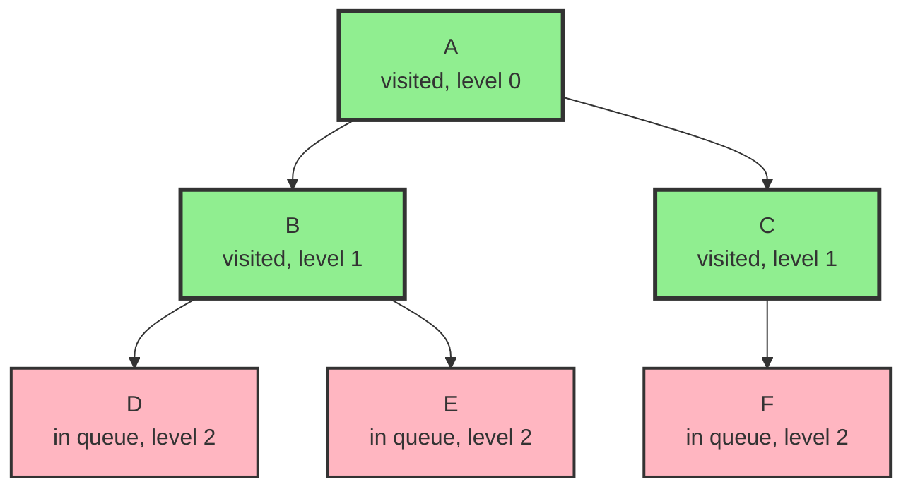

**Step 5: Dequeue D, mark visited (no neighbors to enqueue)**
```
Visited: [A, B, C, D]
Queue: [E, F]
Current Level: 2
```

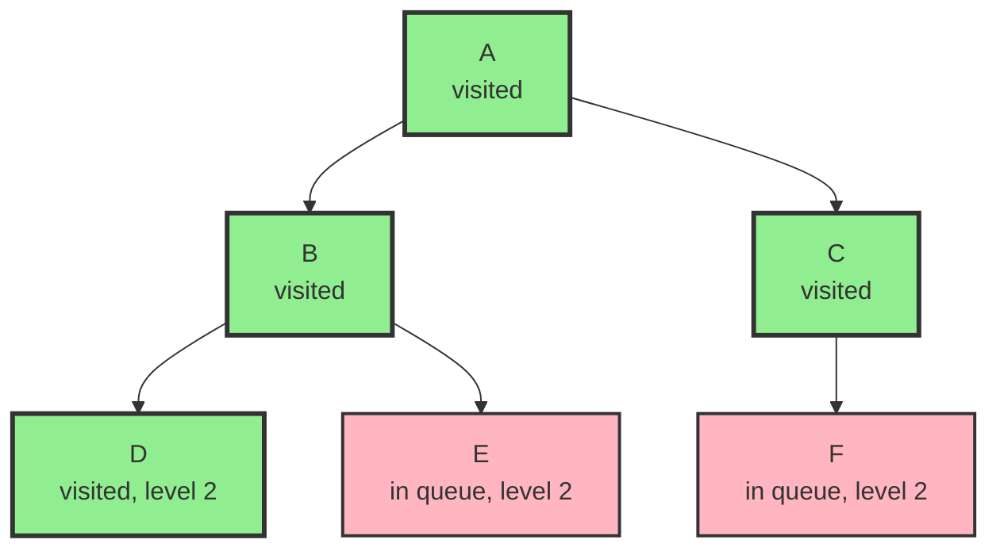

**Step 6: Dequeue E, mark visited (no neighbors to enqueue)**
```
Visited: [A, B, C, D, E]
Queue: [F]
Current Level: 2
```

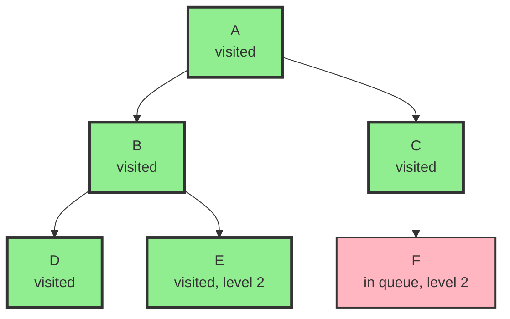

**Step 7: Dequeue F, mark visited (no neighbors to enqueue)**
```
Visited: [A, B, C, D, E, F]
Queue: []
Current Level: 2
BFS Complete!
```

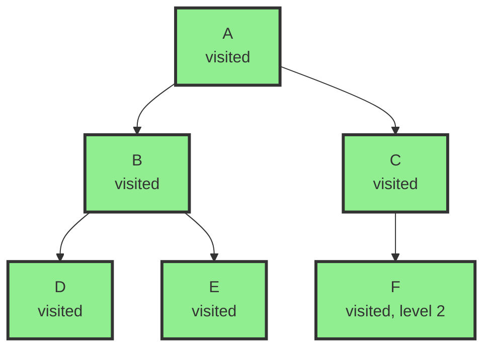

**Final Traversal Order:** A → B → C → D → E → F

**Level Structure:**
- **Level 0:** A
- **Level 1:** B, C
- **Level 2:** D, E, F

**Key Observations:**
- BFS explores **level by level** (breadth-first)
- Uses a **queue** (FIFO: First In, First Out)
- Finds **shortest path** in unweighted graphs
- All vertices at distance k are visited before vertices at distance k+1

#### Why BFS Finds Shortest Path in Unweighted Graphs

**Example:** Find shortest path from A to F

```mermaid
graph TD
    A[Start: A] --> B
    A --> C
    B --> D
    B --> E
    C --> F[Target: F]
    
    style A fill:#90EE90,stroke:#333,stroke-width:3px
    style F fill:#FFB6C1,stroke:#333,stroke-width:3px
```

**BFS Process:**
1. **Level 0:** A (distance 0)
2. **Level 1:** B, C (distance 1 from A)
3. **Level 2:** D, E, F (distance 2 from A)

Since BFS visits vertices in order of their distance from the source, when we first reach F at level 2, we've found the shortest path: A → C → F (length 2).

**Why DFS might not find shortest path:**
- DFS might take A → B → D → (backtrack) → E → (backtrack) → C → F
- This path has length 2, but DFS doesn't guarantee finding it first
- BFS guarantees finding the shortest path because it explores by distance

#### Implementation
```cpp
#include <queue>

class GraphBFS {
private:
    vector<list<Edge>> adjList;
    int numVertices;
    
public:
    GraphBFS(int vertices) : numVertices(vertices) {
        adjList.resize(vertices);
    }
    
    void addEdge(int from, int to, int weight = 1) {
        adjList[from].push_back(Edge(to, weight));
        adjList[to].push_back(Edge(from, weight));
    }
    
    vector<int> bfs(int start) {
        vector<bool> visited(numVertices, false);
        vector<int> result;
        queue<int> q;
        
        visited[start] = true;
        q.push(start);
        
        while (!q.empty()) {
            int vertex = q.front();
            q.pop();
            result.push_back(vertex);
            
            for (const Edge& edge : adjList[vertex]) {
                if (!visited[edge.to]) {
                    visited[edge.to] = true;
                    q.push(edge.to);
                }
            }
        }
        
        return result;
    }
    
    vector<int> shortestPathUnweighted(int start, int end) {
        vector<bool> visited(numVertices, false);
        vector<int> parent(numVertices, -1);
        queue<int> q;
        
        visited[start] = true;
        q.push(start);
        
        while (!q.empty()) {
            int vertex = q.front();
            q.pop();
            
            if (vertex == end) {
                // Reconstruct path
                vector<int> path;
                int current = end;
                while (current != -1) {
                    path.push_back(current);
                    current = parent[current];
                }
                reverse(path.begin(), path.end());
                return path;
            }
            
            for (const Edge& edge : adjList[vertex]) {
                if (!visited[edge.to]) {
                    visited[edge.to] = true;
                    parent[edge.to] = vertex;
                    q.push(edge.to);
                }
            }
        }
        
        return {}; // No path found
    }
};
```

#### Applications of BFS
- Shortest path in unweighted graphs
- Level-order traversal
- Finding minimum spanning tree (unweighted)
- Social network analysis (degrees of separation)
- Web crawling
- Broadcasting in networks

### 11.4.3 DFS vs BFS

| Aspect | DFS | BFS |
|--------|-----|-----|
| Data Structure | Stack | Queue |
| Memory | O(h) where h is height | O(w) where w is width |
| Path Finding | May not find shortest | Finds shortest (unweighted) |
| Use Case | Deep exploration | Level-by-level exploration |
| Implementation | Recursive/Iterative | Iterative |

## 11.5 Shortest Path Algorithms

### 11.5.1 Dijkstra's Algorithm

**Dijkstra's algorithm** finds the shortest path from a source vertex to all other vertices in a weighted graph with non-negative edge weights. It uses a greedy approach: at each step, it selects the unvisited vertex with the smallest known distance and updates distances to its neighbors.

#### How Dijkstra's Works: Step-by-Step Example

Let's trace through Dijkstra's algorithm on the following weighted graph, starting from vertex A:

**Graph:**
```mermaid
graph TD
    A[Start: A] -->|6| B
    A -->|1| C
    A -->|5| D
    B -->|3| E
    B -->|2| F
    C -->|2| F
    C -->|4| G
    D -->|2| G
    
    style A fill:#90EE90,stroke:#333,stroke-width:3px
```

**Step-by-Step Execution:**

**Initialization:**
```
Distances: A=0, B=∞, C=∞, D=∞, E=∞, F=∞, G=∞
Visited: {}
Priority Queue: [(0, A)]
```

**Step 1: Process A (distance = 0)**
```
Current: A (distance 0)
Visited: {A}
Distances: A=0, B=6, C=1, D=5, E=∞, F=∞, G=∞
Queue: [(1, C), (5, D), (6, B)]
```

```mermaid
graph TD
    A[A<br/>visited<br/>dist=0] -->|6| B[B<br/>dist=6]
    A -->|1| C[C<br/>dist=1]
    A -->|5| D[D<br/>dist=5]
    B -->|3| E[E<br/>dist=∞]
    B -->|2| F[F<br/>dist=∞]
    C -->|2| F
    C -->|4| G[G<br/>dist=∞]
    D -->|2| G
    
    style A fill:#90EE90,stroke:#333,stroke-width:3px
    style B fill:#FFB6C1,stroke:#333,stroke-width:2px
    style C fill:#FFB6C1,stroke:#333,stroke-width:2px
    style D fill:#FFB6C1,stroke:#333,stroke-width:2px
    style E fill:#E6E6FA,stroke:#333,stroke-width:2px
    style F fill:#E6E6FA,stroke:#333,stroke-width:2px
    style G fill:#E6E6FA,stroke:#333,stroke-width:2px
```

**Step 2: Process C (distance = 1) - smallest unvisited**
```
Current: C (distance 1)
Visited: {A, C}
Distances: A=0, B=6, C=1, D=5, E=∞, F=3, G=∞
Queue: [(3, F), (5, D), (6, B)]
```

```mermaid
graph TD
    A[A<br/>visited<br/>dist=0] -->|6| B[B<br/>dist=6]
    A -->|1| C[C<br/>visited<br/>dist=1]
    A -->|5| D[D<br/>dist=5]
    B -->|3| E[E<br/>dist=∞]
    B -->|2| F[F<br/>dist=3]
    C -->|2| F
    C -->|4| G[G<br/>dist=∞]
    D -->|2| G
    
    style A fill:#90EE90,stroke:#333,stroke-width:3px
    style C fill:#90EE90,stroke:#333,stroke-width:3px
    style B fill:#FFB6C1,stroke:#333,stroke-width:2px
    style D fill:#FFB6C1,stroke:#333,stroke-width:2px
    style F fill:#FFB6C1,stroke:#333,stroke-width:2px
    style E fill:#E6E6FA,stroke:#333,stroke-width:2px
    style G fill:#E6E6FA,stroke:#333,stroke-width:2px
```

**Step 3: Process F (distance = 3) - smallest unvisited**
```
Current: F (distance 3)
Visited: {A, C, F}
Distances: A=0, B=5, C=1, D=5, E=∞, F=3, G=∞
Queue: [(5, B), (5, D)]
```

```mermaid
graph TD
    A[A<br/>visited<br/>dist=0] -->|6| B[B<br/>dist=5<br/>updated!]
    A -->|1| C[C<br/>visited<br/>dist=1]
    A -->|5| D[D<br/>dist=5]
    B -->|3| E[E<br/>dist=∞]
    B -->|2| F[F<br/>visited<br/>dist=3]
    C -->|2| F
    C -->|4| G[G<br/>dist=∞]
    D -->|2| G
    
    style A fill:#90EE90,stroke:#333,stroke-width:3px
    style C fill:#90EE90,stroke:#333,stroke-width:3px
    style F fill:#90EE90,stroke:#333,stroke-width:3px
    style B fill:#FFB6C1,stroke:#333,stroke-width:2px
    style D fill:#FFB6C1,stroke:#333,stroke-width:2px
    style E fill:#E6E6FA,stroke:#333,stroke-width:2px
    style G fill:#E6E6FA,stroke:#333,stroke-width:2px
```

**Step 4: Process B (distance = 5) - tie with D, pick B**
```
Current: B (distance 5)
Visited: {A, C, F, B}
Distances: A=0, B=5, C=1, D=5, E=8, F=3, G=∞
Queue: [(5, D), (8, E)]
```

```mermaid
graph TD
    A[A<br/>visited<br/>dist=0] -->|6| B[B<br/>visited<br/>dist=5]
    A -->|1| C[C<br/>visited<br/>dist=1]
    A -->|5| D[D<br/>dist=5]
    B -->|3| E[E<br/>dist=8<br/>updated!]
    B -->|2| F[F<br/>visited<br/>dist=3]
    C -->|2| F
    C -->|4| G[G<br/>dist=∞]
    D -->|2| G
    
    style A fill:#90EE90,stroke:#333,stroke-width:3px
    style C fill:#90EE90,stroke:#333,stroke-width:3px
    style F fill:#90EE90,stroke:#333,stroke-width:3px
    style B fill:#90EE90,stroke:#333,stroke-width:3px
    style D fill:#FFB6C1,stroke:#333,stroke-width:2px
    style E fill:#FFB6C1,stroke:#333,stroke-width:2px
    style G fill:#E6E6FA,stroke:#333,stroke-width:2px
```

**Step 5: Process D (distance = 5)**
```
Current: D (distance 5)
Visited: {A, C, F, B, D}
Distances: A=0, B=5, C=1, D=5, E=8, F=3, G=7
Queue: [(7, G), (8, E)]
```

```mermaid
graph TD
    A[A<br/>visited<br/>dist=0] -->|6| B[B<br/>visited<br/>dist=5]
    A -->|1| C[C<br/>visited<br/>dist=1]
    A -->|5| D[D<br/>visited<br/>dist=5]
    B -->|3| E[E<br/>dist=8]
    B -->|2| F[F<br/>visited<br/>dist=3]
    C -->|2| F
    C -->|4| G[G<br/>dist=7<br/>updated!]
    D -->|2| G
    
    style A fill:#90EE90,stroke:#333,stroke-width:3px
    style C fill:#90EE90,stroke:#333,stroke-width:3px
    style F fill:#90EE90,stroke:#333,stroke-width:3px
    style B fill:#90EE90,stroke:#333,stroke-width:3px
    style D fill:#90EE90,stroke:#333,stroke-width:3px
    style E fill:#FFB6C1,stroke:#333,stroke-width:2px
    style G fill:#FFB6C1,stroke:#333,stroke-width:2px
```

**Step 6: Process G (distance = 7)**
```
Current: G (distance 7)
Visited: {A, C, F, B, D, G}
Distances: A=0, B=5, C=1, D=5, E=8, F=3, G=7
Queue: [(8, E)]
```
No updates (G has no unvisited neighbors).

**Step 7: Process E (distance = 8)**
```
Current: E (distance 8)
Visited: {A, C, F, B, D, G, E}
Distances: A=0, B=5, C=1, D=5, E=8, F=3, G=7
Queue: []
Algorithm Complete!
```

**Final Shortest Distances from A:**
- A: 0
- C: 1 (A → C)
- F: 3 (A → C → F)
- B: 5 (A → C → F → B)
- D: 5 (A → D)
- G: 7 (A → D → G)
- E: 8 (A → C → F → B → E)

**Key Observations:**
1. **Greedy Choice**: Always process the unvisited vertex with smallest distance
2. **Relaxation**: Update distances if a shorter path is found
3. **Non-negative weights**: Algorithm fails with negative weights
4. **Optimal Substructure**: Once a vertex is processed, its distance is final

#### Why Dijkstra's Requires Non-Negative Weights

**Counterexample with Negative Edge:**
```mermaid
graph TD
    A[Start: A] -->|1| B
    A -->|-5| C
    B -->|1| D[Target: D]
    C -->|1| D
    
    style A fill:#90EE90,stroke:#333,stroke-width:3px
    style D fill:#FFB6C1,stroke:#333,stroke-width:3px
```

Starting from A:
- Process A: distances B=1, C=-5
- Process C (smallest): distance D=-4
- Process B: distance D=2 (via B)
- **Problem**: We already finalized D=-4, but A→B→D=2 is actually longer!

With negative weights, we can't guarantee that processing a vertex means we've found its shortest path.

#### Implementation
```cpp
#include <queue>
#include <vector>
#include <limits>
#include <algorithm>

class Dijkstra {
private:
    vector<list<Edge>> adjList;
    int numVertices;
    
public:
    Dijkstra(int vertices) : numVertices(vertices) {
        adjList.resize(vertices);
    }
    
    void addEdge(int from, int to, int weight) {
        adjList[from].push_back(Edge(to, weight));
    }
    
    vector<int> shortestPath(int start) {
        vector<int> dist(numVertices, numeric_limits<int>::max());
        vector<bool> visited(numVertices, false);
        priority_queue<pair<int, int>, vector<pair<int, int>>, 
                      greater<pair<int, int>>> pq;
        
        dist[start] = 0;
        pq.push({0, start});
        
        while (!pq.empty()) {
            int u = pq.top().second;
            pq.pop();
            
            if (visited[u]) continue;
            visited[u] = true;
            
            for (const Edge& edge : adjList[u]) {
                int v = edge.to;
                int weight = edge.weight;
                
                if (!visited[v] && dist[u] + weight < dist[v]) {
                    dist[v] = dist[u] + weight;
                    pq.push({dist[v], v});
                }
            }
        }
        
        return dist;
    }
    
    vector<int> shortestPathTo(int start, int end) {
        vector<int> dist(numVertices, numeric_limits<int>::max());
        vector<int> parent(numVertices, -1);
        vector<bool> visited(numVertices, false);
        priority_queue<pair<int, int>, vector<pair<int, int>>, 
                      greater<pair<int, int>>> pq;
        
        dist[start] = 0;
        pq.push({0, start});
        
        while (!pq.empty()) {
            int u = pq.top().second;
            pq.pop();
            
            if (u == end) break;
            if (visited[u]) continue;
            visited[u] = true;
            
            for (const Edge& edge : adjList[u]) {
                int v = edge.to;
                int weight = edge.weight;
                
                if (!visited[v] && dist[u] + weight < dist[v]) {
                    dist[v] = dist[u] + weight;
                    parent[v] = u;
                    pq.push({dist[v], v});
                }
            }
        }
        
        // Reconstruct path
        if (dist[end] == numeric_limits<int>::max()) {
            return {}; // No path
        }
        
        vector<int> path;
        int current = end;
        while (current != -1) {
            path.push_back(current);
            current = parent[current];
        }
        reverse(path.begin(), path.end());
        return path;
    }
};
```

#### Time Complexity
- **Time**: O((V + E) log V) with binary heap
- **Space**: O(V)

#### Limitations
- Only works with non-negative edge weights
- Does not work with negative cycles

### 11.5.2 Bellman-Ford Algorithm

**Bellman-Ford algorithm** finds shortest paths even with negative edge weights (but not negative cycles).

#### Implementation
```cpp
class BellmanFord {
private:
    struct Edge {
        int from, to, weight;
        Edge(int f, int t, int w) : from(f), to(t), weight(w) {}
    };
    
    vector<Edge> edges;
    int numVertices;
    
public:
    BellmanFord(int vertices) : numVertices(vertices) {}
    
    void addEdge(int from, int to, int weight) {
        edges.push_back(Edge(from, to, weight));
    }
    
    vector<int> shortestPath(int start) {
        vector<int> dist(numVertices, numeric_limits<int>::max());
        dist[start] = 0;
        
        // Relax edges V-1 times
        for (int i = 0; i < numVertices - 1; i++) {
            for (const Edge& edge : edges) {
                if (dist[edge.from] != numeric_limits<int>::max() &&
                    dist[edge.from] + edge.weight < dist[edge.to]) {
                    dist[edge.to] = dist[edge.from] + edge.weight;
                }
            }
        }
        
        // Check for negative cycles
        for (const Edge& edge : edges) {
            if (dist[edge.from] != numeric_limits<int>::max() &&
                dist[edge.from] + edge.weight < dist[edge.to]) {
                // Negative cycle detected
                return {};
            }
        }
        
        return dist;
    }
    
    bool hasNegativeCycle() {
        vector<int> dist(numVertices, 0);
        
        // Relax edges V times
        for (int i = 0; i < numVertices; i++) {
            for (const Edge& edge : edges) {
                if (dist[edge.from] + edge.weight < dist[edge.to]) {
                    dist[edge.to] = dist[edge.from] + edge.weight;
                    if (i == numVertices - 1) {
                        return true; // Negative cycle detected
                    }
                }
            }
        }
        
        return false;
    }
};
```

#### Time Complexity
- **Time**: O(V × E)
- **Space**: O(V)

#### Advantages
- Works with negative edge weights
- Can detect negative cycles
- Simpler than Dijkstra for some cases

### 11.5.3 Floyd-Warshall Algorithm

**Floyd-Warshall algorithm** finds shortest paths between all pairs of vertices.

#### Implementation
```cpp
class FloydWarshall {
private:
    vector<vector<int>> dist;
    int numVertices;
    
public:
    FloydWarshall(int vertices) : numVertices(vertices) {
        dist.resize(vertices, vector<int>(vertices, numeric_limits<int>::max()));
        
        for (int i = 0; i < vertices; i++) {
            dist[i][i] = 0;
        }
    }
    
    void addEdge(int from, int to, int weight) {
        dist[from][to] = weight;
    }
    
    void computeShortestPaths() {
        for (int k = 0; k < numVertices; k++) {
            for (int i = 0; i < numVertices; i++) {
                for (int j = 0; j < numVertices; j++) {
                    if (dist[i][k] != numeric_limits<int>::max() &&
                        dist[k][j] != numeric_limits<int>::max() &&
                        dist[i][k] + dist[k][j] < dist[i][j]) {
                        dist[i][j] = dist[i][k] + dist[k][j];
                    }
                }
            }
        }
    }
    
    int getDistance(int from, int to) const {
        return dist[from][to];
    }
    
    bool hasNegativeCycle() const {
        for (int i = 0; i < numVertices; i++) {
            if (dist[i][i] < 0) {
                return true;
            }
        }
        return false;
    }
};
```

#### Time Complexity
- **Time**: O(V³)
- **Space**: O(V²)

#### Use Cases
- All-pairs shortest paths
- Transitive closure
- Detecting negative cycles

## 11.6 Disjoint Sets (Union-Find Data Structure)

A **Disjoint Set** (also called Union-Find) is a data structure that tracks a set of elements partitioned into disjoint (non-overlapping) subsets. It provides efficient operations to:
- **Find**: Determine which subset an element belongs to
- **Union**: Merge two subsets into one

### Why Disjoint Sets Matter

Disjoint sets are essential for many graph algorithms:
- **Kruskal's Algorithm**: Detecting cycles when building MST
- **Connected Components**: Finding all connected components in a graph
- **Cycle Detection**: Determining if adding an edge creates a cycle
- **Network Connectivity**: Checking if nodes are in the same network

### Basic Operations

1. **MakeSet(x)**: Creates a new set containing element x
2. **Find(x)**: Returns the representative (root) of the set containing x
3. **Union(x, y)**: Merges the sets containing x and y

### Naive Implementation

```cpp
class UnionFindNaive {
private:
    vector<int> parent;
    int n;
    
public:
    UnionFindNaive(int size) : n(size) {
        parent.resize(n);
        // Initially, each element is its own parent
        for (int i = 0; i < n; i++) {
            parent[i] = i;
        }
    }
    
    // Find the root of x
    int find(int x) {
        if (parent[x] != x) {
            return find(parent[x]); // Recursive find
        }
        return x;
    }
    
    // Union two sets
    void unite(int x, int y) {
        int rootX = find(x);
        int rootY = find(y);
        
        if (rootX != rootY) {
            parent[rootX] = rootY;
        }
    }
    
    // Check if two elements are in the same set
    bool connected(int x, int y) {
        return find(x) == find(y);
    }
};
```

**Time Complexity**: 
- Find: O(n) worst case (can form a chain)
- Union: O(n) worst case

### Optimized Implementation with Path Compression

**Path Compression** flattens the tree structure during find operations, making future finds faster.

```cpp
class UnionFindPathCompression {
private:
    vector<int> parent;
    int n;
    
public:
    UnionFindPathCompression(int size) : n(size) {
        parent.resize(n);
        for (int i = 0; i < n; i++) {
            parent[i] = i;
        }
    }
    
    // Find with path compression
    int find(int x) {
        if (parent[x] != x) {
            parent[x] = find(parent[x]); // Path compression
        }
        return parent[x];
    }
    
    void unite(int x, int y) {
        int rootX = find(x);
        int rootY = find(y);
        
        if (rootX != rootY) {
            parent[rootX] = rootY;
        }
    }
    
    bool connected(int x, int y) {
        return find(x) == find(y);
    }
};
```

**Time Complexity**: 
- Find: O(α(n)) amortized, where α is the inverse Ackermann function (practically constant)
- Union: O(α(n)) amortized

### Union by Rank (or Union by Size)

**Union by Rank** keeps trees balanced by always attaching the smaller tree under the root of the larger tree.

```cpp
class UnionFind {
private:
    vector<int> parent;
    vector<int> rank; // Height of tree (or use size for union by size)
    int n;
    
public:
    UnionFind(int size) : n(size) {
        parent.resize(n);
        rank.resize(n, 0);
        
        for (int i = 0; i < n; i++) {
            parent[i] = i;
        }
    }
    
    // Find with path compression
    int find(int x) {
        if (parent[x] != x) {
            parent[x] = find(parent[x]); // Path compression
        }
        return parent[x];
    }
    
    // Union by rank
    void unite(int x, int y) {
        int rootX = find(x);
        int rootY = find(y);
        
        if (rootX == rootY) {
            return; // Already in same set
        }
        
        // Attach smaller rank tree under root of higher rank tree
        if (rank[rootX] < rank[rootY]) {
            parent[rootX] = rootY;
        } else if (rank[rootX] > rank[rootY]) {
            parent[rootY] = rootX;
        } else {
            // Ranks are same, make one root and increment its rank
            parent[rootY] = rootX;
            rank[rootX]++;
        }
    }
    
    bool connected(int x, int y) {
        return find(x) == find(y);
    }
    
    // Get number of disjoint sets
    int countSets() {
        int count = 0;
        for (int i = 0; i < n; i++) {
            if (parent[i] == i) {
                count++;
            }
        }
        return count;
    }
};
```

**Time Complexity**: 
- Find: O(α(n)) amortized
- Union: O(α(n)) amortized
- Space: O(n)

### Union by Size (Alternative)

```cpp
class UnionFindBySize {
private:
    vector<int> parent;
    vector<int> size; // Size of each set
    int n;
    
public:
    UnionFindBySize(int size) : n(size) {
        parent.resize(n);
        this->size.resize(n, 1);
        
        for (int i = 0; i < n; i++) {
            parent[i] = i;
        }
    }
    
    int find(int x) {
        if (parent[x] != x) {
            parent[x] = find(parent[x]);
        }
        return parent[x];
    }
    
    void unite(int x, int y) {
        int rootX = find(x);
        int rootY = find(y);
        
        if (rootX == rootY) return;
        
        // Attach smaller set to larger set
        if (size[rootX] < size[rootY]) {
            parent[rootX] = rootY;
            size[rootY] += size[rootX];
        } else {
            parent[rootY] = rootX;
            size[rootX] += size[rootY];
        }
    }
    
    bool connected(int x, int y) {
        return find(x) == find(y);
    }
    
    int getSize(int x) {
        return size[find(x)];
    }
};
```

### Applications in Graph Algorithms

#### 1. Kruskal's Algorithm for MST
Disjoint sets are used to detect cycles when building the minimum spanning tree.

#### 2. Finding Connected Components
```cpp
int countConnectedComponents(const vector<vector<int>>& graph) {
    int n = graph.size();
    UnionFind uf(n);
    
    // Union all connected vertices
    for (int i = 0; i < n; i++) {
        for (int neighbor : graph[i]) {
            uf.unite(i, neighbor);
        }
    }
    
    return uf.countSets();
}
```

#### 3. Cycle Detection in Undirected Graph
```cpp
bool hasCycle(const vector<pair<int, int>>& edges, int numVertices) {
    UnionFind uf(numVertices);
    
    for (const auto& edge : edges) {
        int u = edge.first;
        int v = edge.second;
        
        if (uf.connected(u, v)) {
            return true; // Cycle detected
        }
        uf.unite(u, v);
    }
    
    return false;
}
```

#### 4. Network Connectivity
```cpp
class NetworkConnectivity {
private:
    UnionFind uf;
    
public:
    NetworkConnectivity(int n) : uf(n) {}
    
    void connect(int a, int b) {
        uf.unite(a, b);
    }
    
    bool isConnected(int a, int b) {
        return uf.connected(a, b);
    }
    
    int getComponentCount() {
        return uf.countSets();
    }
};
```

### Time Complexity Analysis

| Operation | Naive | Path Compression | Path Compression + Union by Rank |
|-----------|-------|------------------|----------------------------------|
| Find | O(n) | O(log n) amortized | O(α(n)) amortized |
| Union | O(n) | O(log n) amortized | O(α(n)) amortized |
| Space | O(n) | O(n) | O(n) |

Where α(n) is the inverse Ackermann function, which grows extremely slowly and is practically constant (≤ 4 for any reasonable n).

### Key Takeaways

1. **Disjoint Sets** efficiently track partitions of elements
2. **Path Compression** flattens trees during find operations
3. **Union by Rank/Size** keeps trees balanced
4. **Amortized Complexity** is nearly constant with optimizations
5. **Essential for** Kruskal's algorithm, cycle detection, and connected components

## 11.7 Minimum Spanning Tree (MST)

A **Minimum Spanning Tree** is a subset of edges that connects all vertices with minimum total weight.

### 11.7.1 Kruskal's Algorithm

**Kruskal's algorithm** builds MST by adding edges in increasing order of weight, skipping edges that would create cycles. It uses Union-Find (Disjoint Set) to efficiently check for cycles.

#### How Kruskal's Works: Step-by-Step Example

Let's trace through Kruskal's algorithm on the following weighted graph:

**Graph:**
```
    A ----2---- B
    |\         /|
    | \       / |
   3|  \4    /5 |1
    |   \   /   |
    |    \ /    |
    C ----6---- D
    |           |
   7|           |2
    |           |
    E ----------F
         3
```

**Step-by-Step Execution:**

**Step 1: Sort all edges by weight**
```
Edges sorted: (A-B:2), (B-D:1), (D-F:2), (E-F:3), (A-C:3), (A-D:4), (B-C:5), (C-D:6), (C-E:7)
```

**Step 2: Initialize Union-Find**
```
Each vertex is its own component:
A: {A}, B: {B}, C: {C}, D: {D}, E: {E}, F: {F}
MST edges: []
```

**Step 3: Process edge (B-D:1) - smallest weight**
```
Check: B and D in different components? Yes
Action: Add edge, union B and D
Components: {A}, {B,D}, {C}, {E}, {F}
MST: [B-D:1]
```

```mermaid
graph TD
    A[A] 
    B[B] -->|1| D[D]
    C[C]
    E[E]
    F[F]
    
    style B fill:#90EE90,stroke:#333,stroke-width:3px
    style D fill:#90EE90,stroke:#333,stroke-width:3px
    style A fill:#E6E6FA,stroke:#333,stroke-width:2px
    style C fill:#E6E6FA,stroke:#333,stroke-width:2px
    style E fill:#E6E6FA,stroke:#333,stroke-width:2px
    style F fill:#E6E6FA,stroke:#333,stroke-width:2px
```

**Step 4: Process edge (A-B:2)**
```
Check: A and B in different components? Yes (A vs {B,D})
Action: Add edge, union A with {B,D}
Components: {A,B,D}, {C}, {E}, {F}
MST: [B-D:1, A-B:2]
```

```mermaid
graph TD
    A[A] -->|2| B[B]
    B -->|1| D[D]
    C[C]
    E[E]
    F[F]
    
    style A fill:#90EE90,stroke:#333,stroke-width:3px
    style B fill:#90EE90,stroke:#333,stroke-width:3px
    style D fill:#90EE90,stroke:#333,stroke-width:3px
    style C fill:#E6E6FA,stroke:#333,stroke-width:2px
    style E fill:#E6E6FA,stroke:#333,stroke-width:2px
    style F fill:#E6E6FA,stroke:#333,stroke-width:2px
```

**Step 5: Process edge (D-F:2)**
```
Check: D and F in different components? Yes ({A,B,D} vs {F})
Action: Add edge, union {A,B,D} with {F}
Components: {A,B,D,F}, {C}, {E}
MST: [B-D:1, A-B:2, D-F:2]
```

```mermaid
graph TD
    A[A] -->|2| B[B]
    B -->|1| D[D]
    D -->|2| F[F]
    C[C]
    E[E]
    
    style A fill:#90EE90,stroke:#333,stroke-width:3px
    style B fill:#90EE90,stroke:#333,stroke-width:3px
    style D fill:#90EE90,stroke:#333,stroke-width:3px
    style F fill:#90EE90,stroke:#333,stroke-width:3px
    style C fill:#E6E6FA,stroke:#333,stroke-width:2px
    style E fill:#E6E6FA,stroke:#333,stroke-width:2px
```

**Step 6: Process edge (E-F:3)**
```
Check: E and F in different components? Yes ({E} vs {A,B,D,F})
Action: Add edge, union E with {A,B,D,F}
Components: {A,B,D,E,F}, {C}
MST: [B-D:1, A-B:2, D-F:2, E-F:3]
```

```mermaid
graph TD
    A[A] -->|2| B[B]
    B -->|1| D[D]
    D -->|2| F[F]
    E[E] -->|3| F
    C[C]
    
    style A fill:#90EE90,stroke:#333,stroke-width:3px
    style B fill:#90EE90,stroke:#333,stroke-width:3px
    style D fill:#90EE90,stroke:#333,stroke-width:3px
    style F fill:#90EE90,stroke:#333,stroke-width:3px
    style E fill:#90EE90,stroke:#333,stroke-width:3px
    style C fill:#E6E6FA,stroke:#333,stroke-width:2px
```

**Step 7: Process edge (A-C:3)**
```
Check: A and C in different components? Yes ({A,B,D,E,F} vs {C})
Action: Add edge, union {A,B,D,E,F} with {C}
Components: {A,B,C,D,E,F} (all connected!)
MST: [B-D:1, A-B:2, D-F:2, E-F:3, A-C:3]
```

```mermaid
graph TD
    A[A] -->|2| B[B]
    A -->|3| C[C]
    B -->|1| D[D]
    D -->|2| F[F]
    E[E] -->|3| F
    
    style A fill:#90EE90,stroke:#333,stroke-width:3px
    style B fill:#90EE90,stroke:#333,stroke-width:3px
    style C fill:#90EE90,stroke:#333,stroke-width:3px
    style D fill:#90EE90,stroke:#333,stroke-width:3px
    style E fill:#90EE90,stroke:#333,stroke-width:3px
    style F fill:#90EE90,stroke:#333,stroke-width:3px
```

**Step 8: Check remaining edges**
```
Edge (A-D:4): A and D in same component → Skip (would create cycle)
Edge (B-C:5): B and C in same component → Skip
Edge (C-D:6): C and D in same component → Skip
Edge (C-E:7): C and E in same component → Skip
```

**Final MST:**
- Total weight: 1 + 2 + 2 + 3 + 3 = 11
- Edges: B-D, A-B, D-F, E-F, A-C

**Key Observations:**
1. **Greedy Strategy**: Always add the smallest edge that doesn't create a cycle
2. **Union-Find**: Efficiently checks if two vertices are in the same component
3. **Cycle Detection**: If find(u) == find(v), adding edge (u,v) would create a cycle
4. **Stops Early**: When we have V-1 edges, we have a spanning tree

#### Visual: Why We Skip Edges That Create Cycles

**Before adding (A-D:4):**
```mermaid
graph TD
    A[A] -->|2| B[B]
    A -->|3| C[C]
    B -->|1| D[D]
    
    style A fill:#90EE90,stroke:#333,stroke-width:3px
    style B fill:#90EE90,stroke:#333,stroke-width:3px
    style C fill:#90EE90,stroke:#333,stroke-width:3px
    style D fill:#90EE90,stroke:#333,stroke-width:3px
```

A and D are already connected via A→B→D. Adding A-D would create cycle A-B-D-A.

#### Implementation
```cpp
#include <algorithm>

class Kruskal {
private:
    struct Edge {
        int from, to, weight;
        Edge(int f, int t, int w) : from(f), to(t), weight(w) {}
        bool operator<(const Edge& other) const {
            return weight < other.weight;
        }
    };
    
    vector<Edge> edges;
    int numVertices;
    
    class UnionFind {
    private:
        vector<int> parent, rank;
        
    public:
        UnionFind(int n) : parent(n), rank(n, 0) {
            for (int i = 0; i < n; i++) {
                parent[i] = i;
            }
        }
        
        int find(int x) {
            if (parent[x] != x) {
                parent[x] = find(parent[x]); // Path compression
            }
            return parent[x];
        }
        
        bool unite(int x, int y) {
            int rootX = find(x);
            int rootY = find(y);
            
            if (rootX == rootY) return false;
            
            if (rank[rootX] < rank[rootY]) {
                parent[rootX] = rootY;
            } else if (rank[rootX] > rank[rootY]) {
                parent[rootY] = rootX;
            } else {
                parent[rootY] = rootX;
                rank[rootX]++;
            }
            
            return true;
        }
    };
    
public:
    Kruskal(int vertices) : numVertices(vertices) {}
    
    void addEdge(int from, int to, int weight) {
        edges.push_back(Edge(from, to, weight));
    }
    
    vector<Edge> findMST() {
        sort(edges.begin(), edges.end());
        UnionFind uf(numVertices);
        vector<Edge> mst;
        
        for (const Edge& edge : edges) {
            if (uf.unite(edge.from, edge.to)) {
                mst.push_back(edge);
                if (mst.size() == numVertices - 1) {
                    break;
                }
            }
        }
        
        return mst;
    }
    
    int mstWeight() {
        vector<Edge> mst = findMST();
        int totalWeight = 0;
        for (const Edge& edge : mst) {
            totalWeight += edge.weight;
        }
        return totalWeight;
    }
};
```

#### Time Complexity
- **Time**: O(E log E) = O(E log V)
- **Space**: O(V)

### 11.7.2 Prim's Algorithm

**Prim's algorithm** builds MST by starting from a vertex and growing the tree. At each step, it adds the minimum-weight edge that connects a vertex in the MST to a vertex outside the MST.

#### How Prim's Works: Step-by-Step Example

Let's trace through Prim's algorithm on the same graph, starting from vertex A:

**Graph:**
```
    A ----2---- B
    |\         /|
    | \       / |
   3|  \4    /5 |1
    |   \   /   |
    |    \ /    |
    C ----6---- D
    |           |
   7|           |2
    |           |
    E ----------F
         3
```

**Step-by-Step Execution:**

**Step 1: Start with vertex A**
```
MST vertices: {A}
MST edges: []
Priority queue: [(A-C:3), (A-B:2), (A-D:4)]
```

```mermaid
graph TD
    A[A<br/>in MST] -->|3| C[C<br/>candidate]
    A -->|2| B[B<br/>candidate]
    A -->|4| D[D<br/>candidate]
    
    style A fill:#90EE90,stroke:#333,stroke-width:3px
    style B fill:#FFB6C1,stroke:#333,stroke-width:2px
    style C fill:#FFB6C1,stroke:#333,stroke-width:2px
    style D fill:#FFB6C1,stroke:#333,stroke-width:2px
```

**Step 2: Add minimum edge (A-B:2)**
```
MST vertices: {A, B}
MST edges: [A-B:2]
Priority queue: [(A-C:3), (A-D:4), (B-D:1), (B-C:5)]
```

```mermaid
graph TD
    A[A<br/>in MST] -->|2| B[B<br/>in MST]
    A -->|3| C[C<br/>candidate]
    A -->|4| D[D<br/>candidate]
    B -->|1| D
    B -->|5| C
    
    style A fill:#90EE90,stroke:#333,stroke-width:3px
    style B fill:#90EE90,stroke:#333,stroke-width:3px
    style C fill:#FFB6C1,stroke:#333,stroke-width:2px
    style D fill:#FFB6C1,stroke:#333,stroke-width:2px
```

**Step 3: Add minimum edge (B-D:1)**
```
MST vertices: {A, B, D}
MST edges: [A-B:2, B-D:1]
Priority queue: [(A-C:3), (A-D:4), (B-C:5), (D-F:2)]
```

```mermaid
graph TD
    A[A<br/>in MST] -->|2| B[B<br/>in MST]
    A -->|3| C[C<br/>candidate]
    A -->|4| D[D<br/>in MST]
    B -->|1| D
    B -->|5| C
    D -->|2| F[F<br/>candidate]
    
    style A fill:#90EE90,stroke:#333,stroke-width:3px
    style B fill:#90EE90,stroke:#333,stroke-width:3px
    style D fill:#90EE90,stroke:#333,stroke-width:3px
    style C fill:#FFB6C1,stroke:#333,stroke-width:2px
    style F fill:#FFB6C1,stroke:#333,stroke-width:2px
```

**Step 4: Add minimum edge (D-F:2)**
```
MST vertices: {A, B, D, F}
MST edges: [A-B:2, B-D:1, D-F:2]
Priority queue: [(A-C:3), (A-D:4), (B-C:5), (E-F:3)]
```

```mermaid
graph TD
    A[A<br/>in MST] -->|2| B[B<br/>in MST]
    A -->|3| C[C<br/>candidate]
    A -->|4| D[D<br/>in MST]
    B -->|1| D
    B -->|5| C
    D -->|2| F[F<br/>in MST]
    E[E<br/>candidate] -->|3| F
    
    style A fill:#90EE90,stroke:#333,stroke-width:3px
    style B fill:#90EE90,stroke:#333,stroke-width:3px
    style D fill:#90EE90,stroke:#333,stroke-width:3px
    style F fill:#90EE90,stroke:#333,stroke-width:3px
    style C fill:#FFB6C1,stroke:#333,stroke-width:2px
    style E fill:#FFB6C1,stroke:#333,stroke-width:2px
```

**Step 5: Add minimum edge (A-C:3)**
```
MST vertices: {A, B, D, F, C}
MST edges: [A-B:2, B-D:1, D-F:2, A-C:3]
Priority queue: [(A-D:4), (B-C:5), (C-D:6), (C-E:7), (E-F:3)]
```

```mermaid
graph TD
    A[A<br/>in MST] -->|2| B[B<br/>in MST]
    A -->|3| C[C<br/>in MST]
    B -->|1| D[D<br/>in MST]
    D -->|2| F[F<br/>in MST]
    E[E<br/>candidate] -->|3| F
    
    style A fill:#90EE90,stroke:#333,stroke-width:3px
    style B fill:#90EE90,stroke:#333,stroke-width:3px
    style C fill:#90EE90,stroke:#333,stroke-width:3px
    style D fill:#90EE90,stroke:#333,stroke-width:3px
    style F fill:#90EE90,stroke:#333,stroke-width:3px
    style E fill:#FFB6C1,stroke:#333,stroke-width:2px
```

**Step 6: Add minimum edge (E-F:3)**
```
MST vertices: {A, B, D, F, C, E}
MST edges: [A-B:2, B-D:1, D-F:2, A-C:3, E-F:3]
All vertices included! MST complete.
```

```mermaid
graph TD
    A[A<br/>in MST] -->|2| B[B<br/>in MST]
    A -->|3| C[C<br/>in MST]
    B -->|1| D[D<br/>in MST]
    D -->|2| F[F<br/>in MST]
    E[E<br/>in MST] -->|3| F
    
    style A fill:#90EE90,stroke:#333,stroke-width:3px
    style B fill:#90EE90,stroke:#333,stroke-width:3px
    style C fill:#90EE90,stroke:#333,stroke-width:3px
    style D fill:#90EE90,stroke:#333,stroke-width:3px
    style E fill:#90EE90,stroke:#333,stroke-width:3px
    style F fill:#90EE90,stroke:#333,stroke-width:3px
```

**Final MST:**
- Total weight: 2 + 1 + 2 + 3 + 3 = 11
- Edges: A-B, B-D, D-F, A-C, E-F

**Key Observations:**
1. **Greedy Strategy**: Always add the minimum-weight edge connecting MST to outside
2. **Grows from One Vertex**: Starts with one vertex and expands outward
3. **Priority Queue**: Maintains minimum-weight edges from MST to outside vertices
4. **Similar to Dijkstra's**: Uses similar structure but different edge selection criteria

#### Kruskal vs Prim: When to Use Which?

| Aspect | Kruskal's | Prim's |
|--------|-----------|--------|
| **Approach** | Sort edges, add in order | Grow from one vertex |
| **Data Structure** | Union-Find | Priority Queue |
| **Best For** | Sparse graphs | Dense graphs |
| **Time Complexity** | O(E log E) | O(E log V) with binary heap |
| **Implementation** | Simpler | Slightly more complex |

#### Implementation
```cpp
class Prim {
private:
    vector<list<Edge>> adjList;
    int numVertices;
    
public:
    Prim(int vertices) : numVertices(vertices) {
        adjList.resize(vertices);
    }
    
    void addEdge(int from, int to, int weight) {
        adjList[from].push_back(Edge(to, weight));
        adjList[to].push_back(Edge(from, weight));
    }
    
    vector<Edge> findMST(int start = 0) {
        vector<bool> inMST(numVertices, false);
        vector<int> key(numVertices, numeric_limits<int>::max());
        vector<int> parent(numVertices, -1);
        priority_queue<pair<int, int>, vector<pair<int, int>>, 
                      greater<pair<int, int>>> pq;
        
        key[start] = 0;
        pq.push({0, start});
        
        vector<Edge> mst;
        
        while (!pq.empty()) {
            int u = pq.top().second;
            pq.pop();
            
            if (inMST[u]) continue;
            inMST[u] = true;
            
            if (parent[u] != -1) {
                // Find weight of edge from parent[u] to u
                int weight = 0;
                for (const Edge& edge : adjList[parent[u]]) {
                    if (edge.to == u) {
                        weight = edge.weight;
                        break;
                    }
                }
                mst.push_back(Edge(parent[u], u, weight));
            }
            
            for (const Edge& edge : adjList[u]) {
                int v = edge.to;
                int weight = edge.weight;
                
                if (!inMST[v] && weight < key[v]) {
                    key[v] = weight;
                    parent[v] = u;
                    pq.push({key[v], v});
                }
            }
        }
        
        return mst;
    }
};
```

#### Time Complexity
- **Time**: O((V + E) log V) with binary heap
- **Space**: O(V)

## 11.8 Topological Sorting

**Topological sorting** is a linear ordering of vertices in a directed acyclic graph (DAG) such that for every directed edge (u, v), u comes before v. Think of it as arranging tasks with dependencies: if task A depends on task B, then B must come before A in the ordering.

#### How Topological Sort Works: Step-by-Step Example

Let's trace through topological sorting on the following DAG:

**Graph (Task Dependencies):**
```
    A → B → D
    ↓   ↓   ↓
    C → E → F
```

**Interpretation:**
- A must complete before B and C
- B must complete before D and E
- C must complete before E
- E must complete before F

**Method 1: Kahn's Algorithm (BFS-based)**

**Step-by-Step Execution:**

**Step 1: Calculate in-degrees**
```
A: 0, B: 1, C: 1, D: 1, E: 2, F: 1
```

**Step 2: Initialize queue with vertices having in-degree 0**
```
Queue: [A]
In-degrees: A=0, B=1, C=1, D=1, E=2, F=1
Result: []
```
```
    A* → B    (A has in-degree 0, process first)
    ↓   ↓
    C → E → F
```

**Step 3: Process A, remove outgoing edges, update in-degrees**
```
Queue: []
In-degrees: A=0 (processed), B=0, C=0, D=1, E=2, F=1
Result: [A]
Add to queue: B, C (now have in-degree 0)
Queue: [B, C]
```
```
    A* → B*   (A processed, B now has in-degree 0)
    ↓   ↓
    C* → E → F  (C now has in-degree 0)
```

**Step 4: Process B, remove outgoing edges**
```
Queue: [C]
In-degrees: B=0 (processed), D=0, E=1, F=1
Result: [A, B]
Add to queue: D (now has in-degree 0)
Queue: [C, D]
```
```
    A* → B* → D*  (B processed, D now has in-degree 0)
    ↓
    C* → E → F
```

**Step 5: Process C, remove outgoing edges**
```
Queue: [D]
In-degrees: C=0 (processed), E=0, F=1
Result: [A, B, C]
Add to queue: E (now has in-degree 0)
Queue: [D, E]
```
```
    A* → B* → D*
    ↓
    C* → E*  (C processed, E now has in-degree 0)
         ↓
         F
```

**Step 6: Process D (no outgoing edges)**
```
Queue: [E]
In-degrees: D=0 (processed)
Result: [A, B, C, D]
Queue: [E]
```

**Step 7: Process E**
```
Queue: []
In-degrees: E=0 (processed), F=0
Result: [A, B, C, D, E]
Add to queue: F (now has in-degree 0)
Queue: [F]
```
```
    A* → B* → D*
    ↓
    C* → E* → F*  (E processed, F now has in-degree 0)
```

**Step 8: Process F**
```
Queue: []
In-degrees: F=0 (processed)
Result: [A, B, C, D, E, F]
Topological Sort Complete!
```

**Final Ordering:** A → B → C → D → E → F

**Valid Alternative Orderings:**
- A → C → B → D → E → F
- A → B → C → D → E → F
- A → C → B → E → D → F

**Key Observations:**
1. **Multiple Valid Orderings**: A DAG can have multiple topological orderings
2. **No Cycles**: If graph has cycles, topological sort is impossible
3. **Source First**: Vertices with no incoming edges (sources) appear first
4. **Sink Last**: Vertices with no outgoing edges (sinks) appear last

#### Method 2: DFS-based Topological Sort

**DFS Approach:**
1. Perform DFS on the graph
2. When a vertex finishes (all neighbors processed), add it to result
3. Reverse the result to get topological order

**Why Reverse?**
- DFS finishes sinks first (no outgoing edges)
- We want sources first, so we reverse

**Example with same graph:**
```
DFS order (finish times): F, E, D, C, B, A
Reversed: A, B, C, D, E, F
```

### Implementation
```cpp
class TopologicalSort {
private:
    vector<list<int>> adjList;
    int numVertices;
    
    void dfs(int vertex, vector<bool>& visited, vector<bool>& recStack, 
             vector<int>& result, bool& hasCycle) {
        visited[vertex] = true;
        recStack[vertex] = true;
        
        for (int neighbor : adjList[vertex]) {
            if (!visited[neighbor]) {
                dfs(neighbor, visited, recStack, result, hasCycle);
            } else if (recStack[neighbor]) {
                hasCycle = true;
            }
        }
        
        recStack[vertex] = false;
        result.push_back(vertex);
    }
    
public:
    TopologicalSort(int vertices) : numVertices(vertices) {
        adjList.resize(vertices);
    }
    
    void addEdge(int from, int to) {
        adjList[from].push_back(to);
    }
    
    vector<int> topologicalSort() {
        vector<bool> visited(numVertices, false);
        vector<bool> recStack(numVertices, false);
        vector<int> result;
        bool hasCycle = false;
        
        for (int i = 0; i < numVertices; i++) {
            if (!visited[i]) {
                dfs(i, visited, recStack, result, hasCycle);
            }
        }
        
        if (hasCycle) {
            return {}; // Cycle detected, no topological order
        }
        
        reverse(result.begin(), result.end());
        return result;
    }
    
    vector<int> topologicalSortKahn() {
        vector<int> inDegree(numVertices, 0);
        queue<int> q;
        vector<int> result;
        
        // Calculate in-degrees
        for (int i = 0; i < numVertices; i++) {
            for (int neighbor : adjList[i]) {
                inDegree[neighbor]++;
            }
        }
        
        // Add vertices with in-degree 0
        for (int i = 0; i < numVertices; i++) {
            if (inDegree[i] == 0) {
                q.push(i);
            }
        }
        
        while (!q.empty()) {
            int u = q.front();
            q.pop();
            result.push_back(u);
            
            for (int neighbor : adjList[u]) {
                inDegree[neighbor]--;
                if (inDegree[neighbor] == 0) {
                    q.push(neighbor);
                }
            }
        }
        
        if (result.size() != numVertices) {
            return {}; // Cycle detected
        }
        
        return result;
    }
};
```

### Applications
- Task scheduling
- Build systems (make, gradle)
- Course prerequisites
- Event ordering

## 11.9 Finding Bridges in a Graph

A **bridge** (also called a cut edge) is an edge whose removal increases the number of connected components in the graph. Bridges are critical edges that, if removed, disconnect the graph.

### Algorithm Overview

We use DFS with the concept of **discovery time** and **low link value**:
- **Discovery time (disc[u])**: When vertex u is first visited during DFS
- **Low link (low[u])**: The earliest discovery time of any vertex reachable from u (including u itself) via tree edges and back edges

### Understanding the Bridge Condition: `low[v] > disc[u]`

The condition `low[v] > disc[u]` identifies bridges through a key insight: **if removing edge (u, v) disconnects the graph, then v and its descendants cannot reach any ancestor of u**.

#### Intuitive Explanation

**What `disc[u]` represents:**
- `disc[u]` is the timestamp when we first discovered vertex u during DFS
- If u was discovered at time 5, then `disc[u] = 5`
- All ancestors of u in the DFS tree were discovered **before** time 5

**What `low[v]` represents:**
- `low[v]` is the earliest discovery time reachable from v
- If v can reach an ancestor of u (via back edges), then `low[v] ≤ disc[u]`
- If v **cannot** reach any ancestor of u, then `low[v] > disc[u]`

**Why `low[v] > disc[u]` means (u, v) is a bridge:**

1. **If `low[v] > disc[u]`**: 
   - v and all its descendants can only reach vertices discovered **after** u
   - They cannot reach u or any ancestor of u
   - Removing edge (u, v) disconnects v's subtree from the rest of the graph
   - **Therefore, (u, v) is a bridge**

2. **If `low[v] ≤ disc[u]`**:
   - v can reach u or an ancestor of u (via some back edge)
   - Even if we remove (u, v), v's subtree remains connected through the back edge
   - **Therefore, (u, v) is NOT a bridge**

#### Visual Example

Consider this graph:
```
    0
   / \
  1   2
  |   |
  3---4
```

**DFS Tree (starting from 0):**
```
    0 (disc=1)
   / \
  1   2 (disc=3)
  |   |
  3   4 (disc=5)
  |
  (back edge 3-4)
```

**Analysis:**
- Edge (0, 1): `low[1] = 1` (can reach 0), `disc[0] = 1` → `low[1] ≤ disc[0]` → **NOT a bridge**
- Edge (0, 2): `low[2] = 3` (can reach 2), `disc[0] = 1` → `low[2] > disc[0]` → **IS a bridge**
- Edge (1, 3): `low[3] = 1` (can reach 0 via back edge 3-4-2-0), `disc[1] = 2` → `low[3] < disc[1]` → **NOT a bridge**

**Why edge (0, 2) is a bridge:**
- If we remove (0, 2), vertex 2 and its subtree (including 4) become disconnected
- Even though there's a back edge (3-4), it doesn't help because 3 is in a different subtree

**Why edge (1, 3) is NOT a bridge:**
- If we remove (1, 3), vertex 3 can still reach 0 via: 3 → 4 → 2 → 0
- The back edge (3-4) provides an alternative path

#### Step-by-Step Reasoning

1. **During DFS**, we traverse from u to v
2. **After exploring v's subtree**, we check `low[v]`
3. **If `low[v] > disc[u]`**:
   - v's earliest reachable vertex was discovered **after** u
   - This means v cannot reach u or any ancestor of u
   - The only connection from v's subtree to the rest of the graph is through edge (u, v)
   - Removing (u, v) would disconnect v's entire subtree
4. **Therefore**, (u, v) is a bridge

**Key Insight**: A bridge is an edge that is the **only path** connecting two parts of the graph. If there's any alternative path (back edge), the edge is not a bridge.

### Implementation
```cpp
#include <vector>
#include <list>
#include <algorithm>

class BridgeFinder {
private:
    vector<list<int>> graph;
    int numVertices;
    vector<int> disc;  // Discovery time
    vector<int> low;   // Low link value
    vector<bool> visited;
    int time;
    vector<pair<int, int>> bridges;
    
    void dfs(int u, int parent) {
        visited[u] = true;
        disc[u] = low[u] = ++time;
        
        for (int v : graph[u]) {
            if (v == parent) continue; // Skip parent edge
            
            if (!visited[v]) {
                dfs(v, u);
                low[u] = min(low[u], low[v]);
                
                // Bridge condition: low[v] > disc[u]
                // This means v cannot reach any ancestor of u.
                // If we remove (u, v), v's subtree becomes disconnected.
                // See detailed explanation above for intuition.
                if (low[v] > disc[u]) {
                    bridges.push_back({u, v});
                }
            } else {
                // Back edge - update low[u]
                low[u] = min(low[u], disc[v]);
            }
        }
    }
    
public:
    BridgeFinder(int vertices) : numVertices(vertices) {
        graph.resize(vertices);
        disc.resize(vertices, 0);
        low.resize(vertices, 0);
        visited.resize(vertices, false);
        time = 0;
    }
    
    void addEdge(int from, int to) {
        graph[from].push_back(to);
        graph[to].push_back(from);
    }
    
    vector<pair<int, int>> findBridges() {
        bridges.clear();
        fill(visited.begin(), visited.end(), false);
        fill(disc.begin(), disc.end(), 0);
        fill(low.begin(), low.end(), 0);
        time = 0;
        
        for (int i = 0; i < numVertices; i++) {
            if (!visited[i]) {
                dfs(i, -1);
            }
        }
        
        return bridges;
    }
};
```

### Time Complexity
- **Time**: O(V + E)
- **Space**: O(V)

### Applications
- Network reliability analysis
- Finding critical connections
- Graph connectivity analysis

## 11.10 Finding Articulation Points

An **articulation point** (also called a cut vertex) is a vertex whose removal increases the number of connected components in the graph. Unlike bridges (which are edges), articulation points are vertices that are critical to graph connectivity.

### Algorithm Overview

Similar to bridge finding, we use DFS with discovery time and low link value. A vertex u is an articulation point if:
1. **u is root** and has at least 2 children, OR
2. **u is not root** and has a child v such that `low[v] >= disc[u]`

### Understanding the Articulation Point Condition: `low[v] >= disc[u]`

The condition `low[v] >= disc[u]` identifies articulation points through a similar insight to bridges, but with an important difference: **we use `>=` instead of `>`**.

#### Intuitive Explanation

**Key Difference from Bridges:**
- **Bridge condition**: `low[v] > disc[u]` (strictly greater)
- **Articulation point condition**: `low[v] >= disc[u]` (greater or equal)

**Why the difference?**

When checking if edge (u, v) is a bridge:
- If `low[v] = disc[u]`, v can reach u itself (but not ancestors)
- Removing edge (u, v) might not disconnect if there's another path to u
- **But** removing vertex u would disconnect v's subtree

**What `low[v] >= disc[u]` means:**

1. **If `low[v] > disc[u]`**:
   - v cannot reach u or any ancestor of u
   - Removing u disconnects v's entire subtree
   - **u is an articulation point**

2. **If `low[v] = disc[u]`**:
   - v can reach u itself, but not any ancestor of u
   - Even if v can reach u, removing u still disconnects v's subtree
   - **u is an articulation point** (this is why we use `>=`)

3. **If `low[v] < disc[u]`**:
   - v can reach an ancestor of u (via back edge)
   - Removing u doesn't disconnect v's subtree (alternative path exists)
   - **u is NOT an articulation point**

#### Visual Example

Consider this graph:
```
    0
   / \
  1   2
  |   |
  3---4
  |
  5
```

**DFS Tree (starting from 0):**
```
    0 (disc=1)
   / \
  1   2 (disc=3)
  |   |
  3   4 (disc=5)
  |
  5 (disc=6)
```

**Analysis:**

**Vertex 0 (Root):**
- Has 2 children (1 and 2)
- **IS an articulation point** (root with 2+ children)

**Vertex 1:**
- Child 3: `low[3] = 1` (can reach 0 via back edge 3-4-2-0), `disc[1] = 2`
- `low[3] < disc[1]` → **NOT an articulation point**

**Vertex 3:**
- Child 5: `low[5] = 6` (can only reach 5), `disc[3] = 4`
- `low[5] > disc[3]` → **IS an articulation point**
- If we remove 3, vertex 5 becomes disconnected

**Why vertex 3 is an articulation point:**
- Vertex 5 can only reach vertices discovered at time 6 or later
- It cannot reach vertex 3 (disc=4) or any ancestor
- Removing vertex 3 disconnects vertex 5 from the rest of the graph

#### Why Root Needs Special Handling

**Root case (2+ children):**
- If root has only 1 child, removing root doesn't disconnect (the child subtree remains connected)
- If root has 2+ children, removing root disconnects the subtrees (they're only connected through root)
- **Example**: In a tree, the root is an articulation point if it has degree > 1

**Non-root case (`low[v] >= disc[u]`):**
- If `low[v] >= disc[u]`, v's subtree cannot reach any ancestor of u
- Removing u disconnects v's subtree
- **u is an articulation point**

#### Step-by-Step Reasoning

1. **During DFS**, we traverse from u to v
2. **After exploring v's subtree**, we check `low[v]`
3. **If `low[v] >= disc[u]`**:
   - v's earliest reachable vertex was discovered at time `>= disc[u]`
   - This means v cannot reach any ancestor of u (or can only reach u itself)
   - Removing u would disconnect v's entire subtree
4. **Therefore**, u is an articulation point

**Key Insight**: An articulation point is a vertex that is the **only connection** between its parent and at least one of its child subtrees. If there's any alternative path (back edge to an ancestor), the vertex is not an articulation point.

#### Comparison: Bridges vs. Articulation Points

| Aspect | Bridges | Articulation Points |
|--------|---------|---------------------|
| **What** | Critical edge | Critical vertex |
| **Condition** | `low[v] > disc[u]` | `low[v] >= disc[u]` |
| **Why different** | Edge removal: need strict `>` | Vertex removal: need `>=` (can reach u itself) |
| **Root case** | N/A | Needs 2+ children |

**Important Note**: If edge (u, v) is a bridge, then either u or v (or both) must be an articulation point, but the reverse is not always true.

### Implementation
```cpp
class ArticulationPointFinder {
private:
    vector<list<int>> graph;
    int numVertices;
    vector<int> disc;
    vector<int> low;
    vector<bool> visited;
    vector<bool> isArticulation;
    int time;
    
    void dfs(int u, int parent, bool isRoot) {
        visited[u] = true;
        disc[u] = low[u] = ++time;
        int children = 0;
        
        for (int v : graph[u]) {
            if (v == parent) continue;
            
            if (!visited[v]) {
                children++;
                dfs(v, u, false);
                low[u] = min(low[u], low[v]);
                
                // Articulation point condition: low[v] >= disc[u]
                // This means v cannot reach any ancestor of u (or can only reach u itself).
                // If we remove u, v's subtree becomes disconnected.
                // Note: We use >= (not >) because even if v can reach u, removing u disconnects.
                // See detailed explanation above for intuition.
                if (!isRoot && low[v] >= disc[u]) {
                    isArticulation[u] = true;
                }
            } else {
                low[u] = min(low[u], disc[v]);
            }
        }
        
        // Root is articulation point if it has 2+ children
        // If root has only 1 child, removing root doesn't disconnect.
        // If root has 2+ children, removing root disconnects the subtrees.
        if (isRoot && children >= 2) {
            isArticulation[u] = true;
        }
    }
    
public:
    ArticulationPointFinder(int vertices) : numVertices(vertices) {
        graph.resize(vertices);
        disc.resize(vertices, 0);
        low.resize(vertices, 0);
        visited.resize(vertices, false);
        isArticulation.resize(vertices, false);
        time = 0;
    }
    
    void addEdge(int from, int to) {
        graph[from].push_back(to);
        graph[to].push_back(from);
    }
    
    vector<int> findArticulationPoints() {
        fill(visited.begin(), visited.end(), false);
        fill(isArticulation.begin(), isArticulation.end(), false);
        fill(disc.begin(), disc.end(), 0);
        fill(low.begin(), low.end(), 0);
        time = 0;
        
        for (int i = 0; i < numVertices; i++) {
            if (!visited[i]) {
                dfs(i, -1, true);
            }
        }
        
        vector<int> result;
        for (int i = 0; i < numVertices; i++) {
            if (isArticulation[i]) {
                result.push_back(i);
            }
        }
        
        return result;
    }
};
```

### Time Complexity
- **Time**: O(V + E)
- **Space**: O(V)

### Applications
- Network vulnerability analysis
- Finding critical nodes
- Social network analysis

## 11.11 Strongly Connected Components

A **Strongly Connected Component (SCC)** in a directed graph is a maximal set of vertices where every vertex is reachable from every other vertex.

### Kosaraju's Algorithm

Kosaraju's algorithm finds all SCCs in O(V + E) time using two DFS passes.

#### Implementation
```cpp
class StronglyConnectedComponents {
private:
    vector<vector<int>> graph;
    vector<vector<int>> reverseGraph;
    int numVertices;
    vector<bool> visited;
    vector<int> order;
    vector<int> component;
    
    void dfs1(int v) {
        visited[v] = true;
        for (int u : graph[v]) {
            if (!visited[u]) {
                dfs1(u);
            }
        }
        order.push_back(v); // Add to order after processing
    }
    
    void dfs2(int v, int compId) {
        visited[v] = true;
        component[v] = compId;
        for (int u : reverseGraph[v]) {
            if (!visited[u]) {
                dfs2(u, compId);
            }
        }
    }
    
public:
    StronglyConnectedComponents(int vertices) : numVertices(vertices) {
        graph.resize(vertices);
        reverseGraph.resize(vertices);
        visited.resize(vertices, false);
        component.resize(vertices, -1);
    }
    
    void addEdge(int from, int to) {
        graph[from].push_back(to);
        reverseGraph[to].push_back(from);
    }
    
    vector<vector<int>> findSCCs() {
        // Step 1: First DFS on original graph
        fill(visited.begin(), visited.end(), false);
        order.clear();
        
        for (int i = 0; i < numVertices; i++) {
            if (!visited[i]) {
                dfs1(i);
            }
        }
        
        // Step 2: Second DFS on reverse graph in reverse order
        fill(visited.begin(), visited.end(), false);
        reverse(order.begin(), order.end());
        
        int compId = 0;
        for (int v : order) {
            if (!visited[v]) {
                dfs2(v, compId++);
            }
        }
        
        // Step 3: Group vertices by component
        vector<vector<int>> components(compId);
        for (int i = 0; i < numVertices; i++) {
            components[component[i]].push_back(i);
        }
        
        return components;
    }
    
    int getComponentCount() {
        findSCCs();
        return *max_element(component.begin(), component.end()) + 1;
    }
};
```

### Tarjan's Algorithm (Alternative)

Tarjan's algorithm finds SCCs in a single DFS pass using a stack.

```cpp
class TarjanSCC {
private:
    vector<vector<int>> graph;
    int numVertices;
    vector<int> disc;
    vector<int> low;
    vector<bool> onStack;
    vector<int> stack;
    int time;
    vector<vector<int>> components;
    
    void dfs(int u) {
        disc[u] = low[u] = ++time;
        stack.push_back(u);
        onStack[u] = true;
        
        for (int v : graph[u]) {
            if (disc[v] == 0) {
                dfs(v);
                low[u] = min(low[u], low[v]);
            } else if (onStack[v]) {
                low[u] = min(low[u], disc[v]);
            }
        }
        
        // If u is root of SCC
        if (low[u] == disc[u]) {
            vector<int> component;
            while (true) {
                int v = stack.back();
                stack.pop_back();
                onStack[v] = false;
                component.push_back(v);
                if (v == u) break;
            }
            components.push_back(component);
        }
    }
    
public:
    TarjanSCC(int vertices) : numVertices(vertices) {
        graph.resize(vertices);
        disc.resize(vertices, 0);
        low.resize(vertices, 0);
        onStack.resize(vertices, false);
        time = 0;
    }
    
    void addEdge(int from, int to) {
        graph[from].push_back(to);
    }
    
    vector<vector<int>> findSCCs() {
        components.clear();
        fill(disc.begin(), disc.end(), 0);
        fill(low.begin(), low.end(), 0);
        fill(onStack.begin(), onStack.end(), false);
        stack.clear();
        time = 0;
        
        for (int i = 0; i < numVertices; i++) {
            if (disc[i] == 0) {
                dfs(i);
            }
        }
        
        return components;
    }
};
```

### Time Complexity
- **Time**: O(V + E) for both algorithms
- **Space**: O(V)

### Applications
- Compiler design (control flow analysis)
- Social network analysis
- Web page ranking
- Dependency resolution

## 11.12 0-1 BFS

**0-1 BFS** is a special case of BFS for graphs where edge weights are either 0 or 1. It's more efficient than Dijkstra's algorithm for this case.

### Algorithm Overview

Instead of a priority queue, we use a deque (double-ended queue):
- Edges with weight 0 are added to the front
- Edges with weight 1 are added to the back

This ensures vertices are processed in order of distance.

### Implementation
```cpp
#include <deque>
#include <vector>
#include <list>
#include <limits>

struct Edge01 {
    int to;
    int weight; // 0 or 1
};

class BFS01 {
private:
    vector<list<Edge01>> graph;
    int numVertices;
    
public:
    BFS01(int vertices) : numVertices(vertices) {
        graph.resize(vertices);
    }
    
    void addEdge(int from, int to, int weight) {
        graph[from].push_back({to, weight});
    }
    
    vector<int> shortestPath(int start) {
        vector<int> dist(numVertices, numeric_limits<int>::max());
        deque<int> dq;
        
        dist[start] = 0;
        dq.push_back(start);
        
        while (!dq.empty()) {
            int u = dq.front();
            dq.pop_front();
            
            for (const Edge01& edge : graph[u]) {
                int v = edge.to;
                int w = edge.weight;
                
                if (dist[u] + w < dist[v]) {
                    dist[v] = dist[u] + w;
                    
                    if (w == 0) {
                        dq.push_front(v); // Weight 0 - add to front
                    } else {
                        dq.push_back(v);  // Weight 1 - add to back
                    }
                }
            }
        }
        
        return dist;
    }
    
    vector<int> shortestPathTo(int start, int end) {
        vector<int> dist(numVertices, numeric_limits<int>::max());
        vector<int> parent(numVertices, -1);
        deque<int> dq;
        
        dist[start] = 0;
        dq.push_back(start);
        
        while (!dq.empty()) {
            int u = dq.front();
            dq.pop_front();
            
            if (u == end) break;
            
            for (const Edge01& edge : graph[u]) {
                int v = edge.to;
                int w = edge.weight;
                
                if (dist[u] + w < dist[v]) {
                    dist[v] = dist[u] + w;
                    parent[v] = u;
                    
                    if (w == 0) {
                        dq.push_front(v);
                    } else {
                        dq.push_back(v);
                    }
                }
            }
        }
        
        // Reconstruct path
        if (dist[end] == numeric_limits<int>::max()) {
            return {};
        }
        
        vector<int> path;
        int current = end;
        while (current != -1) {
            path.push_back(current);
            current = parent[current];
        }
        reverse(path.begin(), path.end());
        return path;
    }
};
```

### Time Complexity
- **Time**: O(V + E) - more efficient than Dijkstra's O((V + E) log V)
- **Space**: O(V)

### When to Use
- Graph has only 0 and 1 edge weights
- Need shortest paths in unweighted graph with some "free" edges
- More efficient than Dijkstra for 0-1 weighted graphs

### Applications
- Grid problems with free moves and cost moves
- Problems with "teleportation" edges (weight 0)
- Network routing with binary costs

## 11.13 Graph Applications

### 11.13.1 Finding Connected Components
```cpp
vector<vector<int>> findConnectedComponents(const vector<list<int>>& graph) {
    int n = graph.size();
    vector<bool> visited(n, false);
    vector<vector<int>> components;
    
    function<void(int, vector<int>&)> dfs = [&](int v, vector<int>& comp) {
        visited[v] = true;
        comp.push_back(v);
        for (int neighbor : graph[v]) {
            if (!visited[neighbor]) {
                dfs(neighbor, comp);
            }
        }
    };
    
    for (int i = 0; i < n; i++) {
        if (!visited[i]) {
            vector<int> component;
            dfs(i, component);
            components.push_back(component);
        }
    }
    
    return components;
}
```

### 11.13.2 Cycle Detection
```cpp
bool hasCycle(const vector<list<int>>& graph) {
    int n = graph.size();
    vector<bool> visited(n, false);
    vector<bool> recStack(n, false);
    
    function<bool(int)> dfs = [&](int v) {
        visited[v] = true;
        recStack[v] = true;
        
        for (int neighbor : graph[v]) {
            if (!visited[neighbor]) {
                if (dfs(neighbor)) return true;
            } else if (recStack[neighbor]) {
                return true;
            }
        }
        
        recStack[v] = false;
        return false;
    };
    
    for (int i = 0; i < n; i++) {
        if (!visited[i] && dfs(i)) {
            return true;
        }
    }
    
    return false;
}
```

### 11.13.3 Bipartite Graph Check
```cpp
bool isBipartite(const vector<list<int>>& graph) {
    int n = graph.size();
    vector<int> color(n, -1);
    queue<int> q;
    
    for (int i = 0; i < n; i++) {
        if (color[i] == -1) {
            color[i] = 0;
            q.push(i);
            
            while (!q.empty()) {
                int u = q.front();
                q.pop();
                
                for (int v : graph[u]) {
                    if (color[v] == -1) {
                        color[v] = 1 - color[u];
                        q.push(v);
                    } else if (color[v] == color[u]) {
                        return false;
                    }
                }
            }
        }
    }
    
    return true;
}
```

## 11.14 Key Takeaways

1. **Graphs** represent relationships and connections between entities
2. **Adjacency matrix** is good for dense graphs, **adjacency list** for sparse graphs
3. **DFS** explores deeply, **BFS** explores level-by-level
4. **Dijkstra's** finds shortest paths with non-negative weights
5. **Bellman-Ford** handles negative weights but not negative cycles
6. **Floyd-Warshall** finds all-pairs shortest paths
7. **Kruskal** and **Prim** find minimum spanning trees
8. **Topological sort** orders vertices in a DAG
9. **Bridges and articulation points** identify critical edges and vertices
10. **Strongly Connected Components** find maximal strongly connected subgraphs
11. **0-1 BFS** efficiently handles graphs with binary edge weights
12. Graphs have many real-world applications

## 11.15 Exercises

1. Implement a graph class that supports both adjacency matrix and adjacency list representations.

2. Implement DFS and BFS iteratively and recursively, and compare their performance.

3. Modify Dijkstra's algorithm to reconstruct the actual shortest path, not just the distance.

4. Implement a function to detect if a graph is strongly connected.

5. Implement an algorithm to find all cycles in a directed graph.

6. Create a function to find the longest path in a DAG.

7. Implement Tarjan's algorithm for finding strongly connected components.

8. Compare the performance of Kosaraju's and Tarjan's algorithms for SCC.

9. Implement a function to check if a graph is Eulerian (has Eulerian path/cycle).

10. Create a graph visualization tool that can display small graphs.

## 11.16 Summary

Graphs are fundamental data structures that model relationships and connections. Understanding graph representations, traversal algorithms, shortest path algorithms, and minimum spanning tree algorithms is essential for solving many computational problems. The choice of representation and algorithm depends on the specific problem requirements, graph characteristics, and performance constraints.

In the next chapters, we'll explore more advanced topics including searching algorithms and advanced data structures that build upon these graph concepts.

