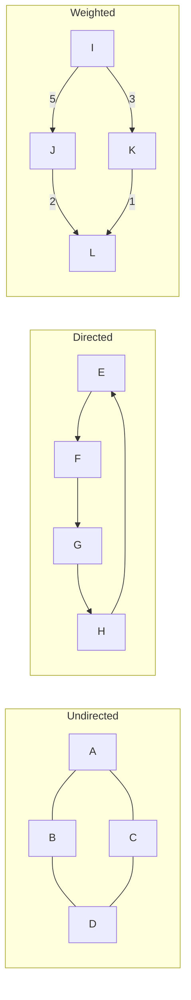
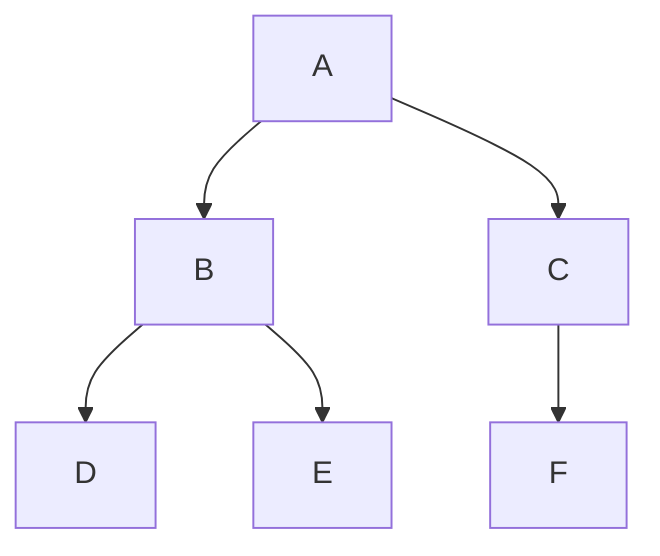
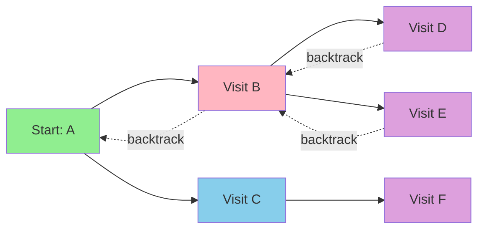
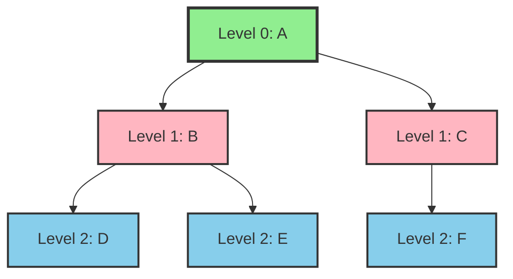
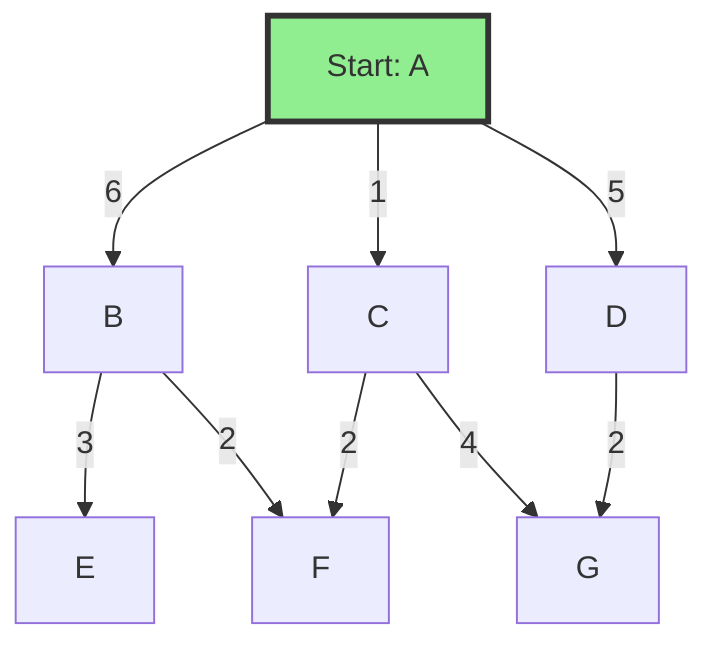
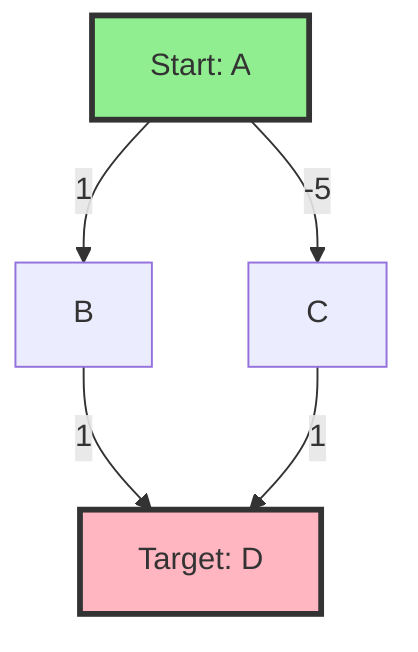
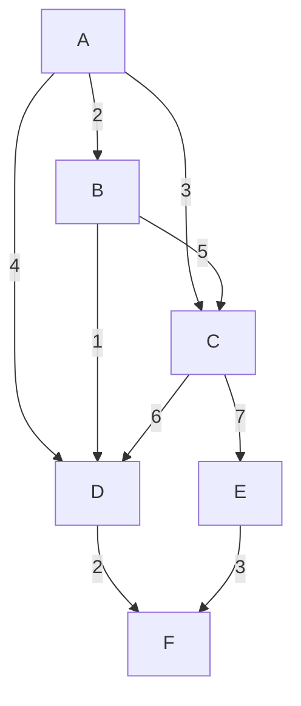

# Chapter 11: Graphs

## 11.1 When the Relationships Are the Data

Most structures in this book impose a shape on your data — a sequence, a hierarchy, a key-value mapping. A graph imposes none. It is what you reach for when the *relationships between things* are the data: who follows whom, which road connects which cities, what task blocks what other task. A graph is nothing but a set of vertices and a set of edges joining them, and that minimalism is exactly why it models everything from social networks to build dependencies to internet routing. GPS navigation, web crawlers, `make`, package managers, and recommendation engines are all graph algorithms wearing an application's clothes.

The flexibility isn't free. Trees (Chapter 6) guarantee one parent, no cycles, and exactly `n−1` edges — constraints that make them cheap to reason about. Graphs relax all of it: any vertex may connect to any other, cycles are allowed, and there may be no root and no single connected piece at all. That freedom is what buys you the more elaborate algorithms in the rest of this chapter. If your data is genuinely a sequence, a lookup table, or a hierarchy, use the structure built for it; reach for a graph only when connectivity itself is the problem.

Formally a graph is `G = (V, E)`: a set of vertices `V` and a set of edges `E`, each edge joining two of them. A little vocabulary, fixed once, carries the whole chapter:

- An edge is **directed** (`u→v`, one-way, like a Twitter follow) or **undirected** (`u–v`, mutual, like a Facebook friendship). A graph of directed edges is a **digraph**.
- An edge may carry a **weight** — a distance, cost, or capacity. Dijkstra and the MST algorithms below live on weighted graphs; BFS and DFS ignore weights entirely.
- The **degree** of a vertex is how many edges touch it; in a digraph that splits into **in-degree** and **out-degree**.
- A **path** is a sequence of vertices joined by edges, a **cycle** a path back to its start. A graph with no cycles is **acyclic** — a **DAG** if it is also directed. A graph is **connected** if every vertex is reachable from every other; otherwise it breaks into **components**.

The one structural invariant that bites in practice: the stored representation must exactly match the edge set. For an undirected graph that means every edge is recorded at *both* endpoints — the single most common graph bug is storing `u→v` but forgetting `v→u`, silently making half your edges one-way. And deleting a vertex means deleting all its incident edges first, or you leave dangling references to a vertex that no longer exists.

The type combinations show up as small pictures throughout the chapter. Undirected edges are mutual; directed edges point one way and can form directed cycles; weighted edges label each connection with a number the algorithms optimize over:



Two more types are worth naming because algorithms below depend on them: a **complete** graph connects every pair of vertices (the dense extreme), and a **bipartite** graph splits its vertices into two sides with no edge inside a side — the structure behind matching and two-coloring problems.

## 11.2 Representations: The Memory Decision That Governs Everything

Before any algorithm runs, you have to decide how the graph lives in memory, and the two choices — adjacency matrix and adjacency list — are a genuine memory-versus-cache trade-off, not a formality. Everything downstream inherits it: the matrix makes "is there an edge `u→v`?" a single array access but costs `O(V²)` memory whether the graph has a million edges or three; the list costs only `O(V + E)` but answers the same question by scanning a vertex's neighbors. Almost every real graph — road networks, social graphs, web graphs — is *sparse* (`E ≪ V²`), so the adjacency list is the default. The matrix earns its keep only when the graph is dense or you need constant-time edge tests on a small graph.

### 11.2.1 Adjacency Matrix

An **adjacency matrix** is a `V × V` array where `matrix[i][j]` holds the weight of edge `i→j` (or 0/1 for its presence). Edge lookup, insert, and delete are all `O(1)`, and the code is trivial:

```cpp
#include <iostream>
#include <vector>
#include <limits>
using namespace std;

class GraphMatrix {
private:
    vector<vector<int>> adjMatrix;
    int numVertices;
    bool directed;
    
public:
    GraphMatrix(int vertices, bool isDirected = false) 
        : numVertices(vertices), directed(isDirected) {
        adjMatrix.resize(vertices, vector<int>(vertices, 0));
    }
    
    void addEdge(int from, int to, int weight = 1) {
        if (from >= 0 && from < numVertices && to >= 0 && to < numVertices) {
            adjMatrix[from][to] = weight;
            if (!directed) {
                adjMatrix[to][from] = weight;
            }
        }
    }
    
    void removeEdge(int from, int to) {
        if (from >= 0 && from < numVertices && to >= 0 && to < numVertices) {
            adjMatrix[from][to] = 0;
            if (!directed) {
                adjMatrix[to][from] = 0;
            }
        }
    }
    
    bool hasEdge(int from, int to) const {
        if (from >= 0 && from < numVertices && to >= 0 && to < numVertices) {
            return adjMatrix[from][to] != 0;
        }
        return false;
    }
    
    int getWeight(int from, int to) const {
        if (from >= 0 && from < numVertices && to >= 0 && to < numVertices) {
            return adjMatrix[from][to];
        }
        return 0;
    }
    
    void print() const {
        cout << "Adjacency Matrix:" << endl;
        cout << "  ";
        for (int i = 0; i < numVertices; i++) {
            cout << i << " ";
        }
        cout << endl;
        
        for (int i = 0; i < numVertices; i++) {
            cout << i << " ";
            for (int j = 0; j < numVertices; j++) {
                cout << adjMatrix[i][j] << " ";
            }
            cout << endl;
        }
    }
    
    int getNumVertices() const { return numVertices; }
};
```

The catch is the `O(V²)` memory, paid whether the graph is full or nearly empty, plus expensive vertex insertion and removal. A million-vertex sparse graph would need a trillion-entry matrix — hopeless. The matrix wins only when the graph is dense enough that you'd store most of those entries anyway.

There is a subtler reason the matrix can outrun a list even when it "shouldn't," and it comes straight from the memory hierarchy of [Chapter 3.6](03.6-memory-hierarchy-and-performance.md): the matrix is one contiguous block, so an edge query is a single cache-friendly load (~5–10 cycles), whereas an adjacency list is an array of separately allocated node chains, and walking one means pointer-chasing across scattered addresses — every hop risks a cache miss of 50–200 cycles. On a dense graph that fits in cache, the matrix's sequential layout can beat the list's asymptotically-better bounds outright. This is the same constant-factor story as binary versus linear search in [Chapter 13](13-searching-algorithms.md): Big-O picks the representation, but memory layout picks the winner.

### 11.2.2 Adjacency List

An **adjacency list** stores, for each vertex, a list of its neighbors — `O(V + E)` memory, which for a sparse graph is dramatically smaller. It is the representation every algorithm in this chapter assumes unless noted, because those algorithms iterate a vertex's neighbors far more often than they test a specific edge, and neighbor iteration is exactly what the list does well (`O(degree)`, not `O(V)`).

```cpp
#include <iostream>
#include <vector>
#include <list>
#include <unordered_map>
using namespace std;

struct Edge {
    int to;
    int weight;
    
    Edge(int t, int w = 1) : to(t), weight(w) {}
};

class GraphList {
private:
    vector<list<Edge>> adjList;
    int numVertices;
    bool directed;
    
public:
    GraphList(int vertices, bool isDirected = false) 
        : numVertices(vertices), directed(isDirected) {
        adjList.resize(vertices);
    }
    
    void addEdge(int from, int to, int weight = 1) {
        if (from >= 0 && from < numVertices && to >= 0 && to < numVertices) {
            adjList[from].push_back(Edge(to, weight));
            if (!directed) {
                adjList[to].push_back(Edge(from, weight));
            }
        }
    }
    
    void removeEdge(int from, int to) {
        if (from >= 0 && from < numVertices && to >= 0 && to < numVertices) {
            adjList[from].remove_if([to](const Edge& e) { return e.to == to; });
            if (!directed) {
                adjList[to].remove_if([from](const Edge& e) { return e.to == from; });
            }
        }
    }
    
    bool hasEdge(int from, int to) const {
        if (from >= 0 && from < numVertices) {
            for (const Edge& edge : adjList[from]) {
                if (edge.to == to) {
                    return true;
                }
            }
        }
        return false;
    }
    
    const list<Edge>& getNeighbors(int vertex) const {
        if (vertex >= 0 && vertex < numVertices) {
            return adjList[vertex];
        }
        static list<Edge> empty;
        return empty;
    }
    
    void print() const {
        cout << "Adjacency List:" << endl;
        for (int i = 0; i < numVertices; i++) {
            cout << i << ": ";
            for (const Edge& edge : adjList[i]) {
                cout << "(" << edge.to << ", " << edge.weight << ") ";
            }
            cout << endl;
        }
    }
    
    int getNumVertices() const { return numVertices; }
};
```

Its one real weakness is the edge test: checking whether `u→v` exists means scanning `u`'s neighbors, `O(degree)`. If your workload is dominated by edge existence queries on a small graph, that's the case for the matrix; otherwise the list wins on every axis that matters at scale.

| | Adjacency Matrix | Adjacency List |
|--|-----------------|----------------|
| Space | `O(V²)` | `O(V + E)` |
| Edge exists `u→v`? | `O(1)` | `O(degree)` |
| Add / remove edge | `O(1)` / `O(1)` | `O(1)` / `O(degree)` |
| Iterate neighbors | `O(V)` | `O(degree)` |
| Cache behavior | contiguous, friendly | pointer-chasing |
| Best for | dense / small graphs | sparse / large graphs |

## 11.3 Graph Traversal

### 11.3.1 Depth-First Search (DFS)

**Depth-First Search** explores as far as possible along each branch before backtracking. Think of it like exploring a maze: you go as deep as possible down one path, and only when you hit a dead end do you backtrack to try another path.

#### How DFS Works: Step-by-Step Example

Trace DFS from vertex A on this graph:



Using an explicit stack, we push a vertex's unvisited neighbors and always pop the most recently pushed one, so exploration dives deep before fanning out:

| Step | Pop | Visited so far | Stack after |
|------|-----|----------------|-------------|
| 1 | A | A | C, B |
| 2 | B | A, B | C, E, D |
| 3 | D | A, B, D | C, E |
| 4 | E | A, B, D, E | C |
| 5 | C | A, B, D, E, C | F |
| 6 | F | A, B, D, E, C, F | (empty) |

**Traversal order:** A → B → D → E → C → F. The stack is implicit in the recursive form, explicit in the iterative one; either way DFS visits every vertex in the connected component.

#### DFS vs BFS on the Same Graph

The contrast is the whole point — DFS plunges down one branch and backtracks; BFS expands level by level:





#### Recursive Implementation
```cpp
#include <vector>
#include <stack>
#include <iostream>
using namespace std;

class GraphDFS {
private:
    vector<list<Edge>> adjList;
    int numVertices;
    
    void dfsRecursive(int vertex, vector<bool>& visited, vector<int>& result) {
        visited[vertex] = true;
        result.push_back(vertex);
        
        for (const Edge& edge : adjList[vertex]) {
            if (!visited[edge.to]) {
                dfsRecursive(edge.to, visited, result);
            }
        }
    }
    
public:
    GraphDFS(int vertices) : numVertices(vertices) {
        adjList.resize(vertices);
    }
    
    void addEdge(int from, int to, int weight = 1) {
        adjList[from].push_back(Edge(to, weight));
        adjList[to].push_back(Edge(from, weight));
    }
    
    vector<int> dfs(int start) {
        vector<bool> visited(numVertices, false);
        vector<int> result;
        
        dfsRecursive(start, visited, result);
        return result;
    }
    
    vector<int> dfsAll() {
        vector<bool> visited(numVertices, false);
        vector<int> result;
        
        for (int i = 0; i < numVertices; i++) {
            if (!visited[i]) {
                dfsRecursive(i, visited, result);
            }
        }
        
        return result;
    }
};
```

#### Iterative Implementation
```cpp
vector<int> dfsIterative(int start) {
    vector<bool> visited(numVertices, false);
    vector<int> result;
    stack<int> stk;
    
    stk.push(start);
    
    while (!stk.empty()) {
        int vertex = stk.top();
        stk.pop();
        
        if (!visited[vertex]) {
            visited[vertex] = true;
            result.push_back(vertex);
            
            // Push neighbors in reverse order to maintain same traversal
            for (auto it = adjList[vertex].rbegin(); it != adjList[vertex].rend(); ++it) {
                if (!visited[it->to]) {
                    stk.push(it->to);
                }
            }
        }
    }
    
    return result;
}
```

DFS is the engine under a surprising number of later algorithms in this chapter: cycle detection, topological sort, bridges and articulation points, and strongly connected components are all DFS with extra bookkeeping. Anywhere you need to fully explore one region before moving on — maze solving, connected components, reachability — it is the natural traversal.

### 11.3.2 Breadth-First Search (BFS)

**Breadth-First Search** explores all neighbors at the current depth before moving to the next level. Think of it like ripples in water: it expands outward level by level, exploring all vertices at distance 1, then all at distance 2, and so on.

#### How BFS Works: Step-by-Step Example

Trace BFS from vertex A on the same graph. BFS marks a vertex visited when it is *enqueued*, then processes the queue in FIFO order, so every vertex at distance k is visited before any at distance k+1:

| Step | Dequeue | Enqueue | Queue after |
|------|---------|---------|-------------|
| 1 | A | B, C | B, C |
| 2 | B | D, E | C, D, E |
| 3 | C | F | D, E, F |
| 4 | D | — | E, F |
| 5 | E | — | F |
| 6 | F | — | (empty) |

**Traversal order:** A → B → C → D → E → F — Level 0: A; Level 1: B, C; Level 2: D, E, F.

Because BFS visits vertices in order of distance from the source, the first time it reaches a vertex it has already found a shortest path (in edges) to it. Reaching F at level 2 yields the shortest path A → C → F of length 2. DFS could reach F through a longer exploration order, so it offers no such guarantee.

#### Implementation
```cpp
#include <queue>

class GraphBFS {
private:
    vector<list<Edge>> adjList;
    int numVertices;
    
public:
    GraphBFS(int vertices) : numVertices(vertices) {
        adjList.resize(vertices);
    }
    
    void addEdge(int from, int to, int weight = 1) {
        adjList[from].push_back(Edge(to, weight));
        adjList[to].push_back(Edge(from, weight));
    }
    
    vector<int> bfs(int start) {
        vector<bool> visited(numVertices, false);
        vector<int> result;
        queue<int> q;
        
        visited[start] = true;
        q.push(start);
        
        while (!q.empty()) {
            int vertex = q.front();
            q.pop();
            result.push_back(vertex);
            
            for (const Edge& edge : adjList[vertex]) {
                if (!visited[edge.to]) {
                    visited[edge.to] = true;
                    q.push(edge.to);
                }
            }
        }
        
        return result;
    }
    
    vector<int> shortestPathUnweighted(int start, int end) {
        vector<bool> visited(numVertices, false);
        vector<int> parent(numVertices, -1);
        queue<int> q;
        
        visited[start] = true;
        q.push(start);
        
        while (!q.empty()) {
            int vertex = q.front();
            q.pop();
            
            if (vertex == end) {
                // Reconstruct path
                vector<int> path;
                int current = end;
                while (current != -1) {
                    path.push_back(current);
                    current = parent[current];
                }
                reverse(path.begin(), path.end());
                return path;
            }
            
            for (const Edge& edge : adjList[vertex]) {
                if (!visited[edge.to]) {
                    visited[edge.to] = true;
                    parent[edge.to] = vertex;
                    q.push(edge.to);
                }
            }
        }
        
        return {}; // No path found
    }
};
```

That shortest-path guarantee is why BFS, not DFS, powers "degrees of separation" in social networks, shortest-hop routing, web crawling by link distance, and network broadcast. The two traversals differ only in the container that holds pending vertices — a stack (or recursion) for DFS, a FIFO queue for BFS — but that one swap changes everything: DFS goes deep and uses memory proportional to the longest path, BFS goes wide and uses memory proportional to the widest level, and only BFS finds shortest paths in an unweighted graph.

## 11.4 Shortest Path Algorithms

### 11.4.1 Dijkstra's Algorithm

**Dijkstra's algorithm** finds the shortest path from a source vertex to all other vertices in a weighted graph with non-negative edge weights. It uses a greedy approach: at each step, it selects the unvisited vertex with the smallest known distance and updates distances to its neighbors.

#### How Dijkstra's Works: Step-by-Step Example

Trace Dijkstra from A on this weighted graph:



At each step we extract the unvisited vertex with the smallest tentative distance and relax its outgoing edges:

| Processed | Distances updated |
|-----------|-------------------|
| A (0) | B=6, C=1, D=5 |
| C (1) | F=3 (via C) |
| F (3) | B=5 (via C→F) |
| B (5) | E=8 |
| D (5) | G=7 |
| G (7) | — |
| E (8) | — |

**Final distances from A:** A=0, C=1, F=3, B=5, D=5, G=7, E=8.

Three properties drive the algorithm: the greedy choice always processes the smallest-distance unvisited vertex; relaxation lowers a neighbor's distance whenever a shorter path is found; and once a vertex is processed its distance is final — which is exactly why non-negative weights are required.

#### Why Dijkstra's Requires Non-Negative Weights



Here Dijkstra processes C first (distance −5) and finalizes D = −4, committing to D before it can discover that another route is cheaper. With negative weights, finalizing a vertex the moment it is extracted is no longer safe — use Bellman-Ford instead.

#### Implementation
```cpp
#include <queue>
#include <vector>
#include <limits>
#include <algorithm>

class Dijkstra {
private:
    vector<list<Edge>> adjList;
    int numVertices;
    
public:
    Dijkstra(int vertices) : numVertices(vertices) {
        adjList.resize(vertices);
    }
    
    void addEdge(int from, int to, int weight) {
        adjList[from].push_back(Edge(to, weight));
    }
    
    vector<int> shortestPath(int start) {
        vector<int> dist(numVertices, numeric_limits<int>::max());
        vector<bool> visited(numVertices, false);
        priority_queue<pair<int, int>, vector<pair<int, int>>, 
                      greater<pair<int, int>>> pq;
        
        dist[start] = 0;
        pq.push({0, start});
        
        while (!pq.empty()) {
            int u = pq.top().second;
            pq.pop();
            
            if (visited[u]) continue;
            visited[u] = true;
            
            for (const Edge& edge : adjList[u]) {
                int v = edge.to;
                int weight = edge.weight;
                
                if (!visited[v] && dist[u] + weight < dist[v]) {
                    dist[v] = dist[u] + weight;
                    pq.push({dist[v], v});
                }
            }
        }
        
        return dist;
    }
    
    vector<int> shortestPathTo(int start, int end) {
        vector<int> dist(numVertices, numeric_limits<int>::max());
        vector<int> parent(numVertices, -1);
        vector<bool> visited(numVertices, false);
        priority_queue<pair<int, int>, vector<pair<int, int>>, 
                      greater<pair<int, int>>> pq;
        
        dist[start] = 0;
        pq.push({0, start});
        
        while (!pq.empty()) {
            int u = pq.top().second;
            pq.pop();
            
            if (u == end) break;
            if (visited[u]) continue;
            visited[u] = true;
            
            for (const Edge& edge : adjList[u]) {
                int v = edge.to;
                int weight = edge.weight;
                
                if (!visited[v] && dist[u] + weight < dist[v]) {
                    dist[v] = dist[u] + weight;
                    parent[v] = u;
                    pq.push({dist[v], v});
                }
            }
        }
        
        // Reconstruct path
        if (dist[end] == numeric_limits<int>::max()) {
            return {}; // No path
        }
        
        vector<int> path;
        int current = end;
        while (current != -1) {
            path.push_back(current);
            current = parent[current];
        }
        reverse(path.begin(), path.end());
        return path;
    }
};
```

With a binary-heap priority queue this runs in `O((V + E) log V)` time and `O(V)` space. The non-negative-weight requirement isn't a limitation to route around — it is the exact condition under which "finalize a vertex the moment it's extracted" is correct. When weights can go negative, you need the next algorithm.

### 11.4.2 Bellman-Ford Algorithm

**Bellman-Ford** trades speed for generality: it handles negative edge weights and, as a bonus, *detects* negative cycles (where "shortest path" stops being well-defined). Instead of Dijkstra's greedy finalization, it simply relaxes every edge `V−1` times — enough for any shortest path, which can span at most `V−1` edges, to settle — then one more pass to check whether anything still improves, which would mean a negative cycle.

```cpp
class BellmanFord {
private:
    struct Edge {
        int from, to, weight;
        Edge(int f, int t, int w) : from(f), to(t), weight(w) {}
    };
    
    vector<Edge> edges;
    int numVertices;
    
public:
    BellmanFord(int vertices) : numVertices(vertices) {}
    
    void addEdge(int from, int to, int weight) {
        edges.push_back(Edge(from, to, weight));
    }
    
    vector<int> shortestPath(int start) {
        vector<int> dist(numVertices, numeric_limits<int>::max());
        dist[start] = 0;
        
        // Relax edges V-1 times
        for (int i = 0; i < numVertices - 1; i++) {
            for (const Edge& edge : edges) {
                if (dist[edge.from] != numeric_limits<int>::max() &&
                    dist[edge.from] + edge.weight < dist[edge.to]) {
                    dist[edge.to] = dist[edge.from] + edge.weight;
                }
            }
        }
        
        // Check for negative cycles
        for (const Edge& edge : edges) {
            if (dist[edge.from] != numeric_limits<int>::max() &&
                dist[edge.from] + edge.weight < dist[edge.to]) {
                // Negative cycle detected
                return {};
            }
        }
        
        return dist;
    }
    
    bool hasNegativeCycle() {
        vector<int> dist(numVertices, 0);
        
        // Relax edges V times
        for (int i = 0; i < numVertices; i++) {
            for (const Edge& edge : edges) {
                if (dist[edge.from] + edge.weight < dist[edge.to]) {
                    dist[edge.to] = dist[edge.from] + edge.weight;
                    if (i == numVertices - 1) {
                        return true; // Negative cycle detected
                    }
                }
            }
        }
        
        return false;
    }
};
```

The cost of that generality is `O(V × E)` time — a full order slower than Dijkstra — so use Bellman-Ford only when negative weights actually appear.

### 11.4.3 Floyd-Warshall Algorithm

Dijkstra and Bellman-Ford give shortest paths from *one* source. When you need the distance between *every* pair of vertices, **Floyd-Warshall** does it in three nested loops and `O(V³)` time. The idea is deceptively simple: for each intermediate vertex `k`, ask whether routing through `k` shortens any pair `i→j`, and if so, take it. After considering every `k`, `dist[i][j]` holds the true shortest distance. It's compact, cache-friendly (dense arrays), and the natural choice on small dense graphs where `V³` beats running Dijkstra `V` times.

```cpp
class FloydWarshall {
private:
    vector<vector<int>> dist;
    int numVertices;
    
public:
    FloydWarshall(int vertices) : numVertices(vertices) {
        dist.resize(vertices, vector<int>(vertices, numeric_limits<int>::max()));
        
        for (int i = 0; i < vertices; i++) {
            dist[i][i] = 0;
        }
    }
    
    void addEdge(int from, int to, int weight) {
        dist[from][to] = weight;
    }
    
    void computeShortestPaths() {
        for (int k = 0; k < numVertices; k++) {
            for (int i = 0; i < numVertices; i++) {
                for (int j = 0; j < numVertices; j++) {
                    if (dist[i][k] != numeric_limits<int>::max() &&
                        dist[k][j] != numeric_limits<int>::max() &&
                        dist[i][k] + dist[k][j] < dist[i][j]) {
                        dist[i][j] = dist[i][k] + dist[k][j];
                    }
                }
            }
        }
    }
    
    int getDistance(int from, int to) const {
        return dist[from][to];
    }
    
    bool hasNegativeCycle() const {
        for (int i = 0; i < numVertices; i++) {
            if (dist[i][i] < 0) {
                return true;
            }
        }
        return false;
    }
};
```

Beyond all-pairs distances, the same `O(V²)` space and `O(V³)` time also compute transitive closure (reachability) and detect negative cycles — a negative value on the diagonal means a vertex can reach itself at negative cost.

## 11.5 Union-Find (Disjoint Sets)

Union-Find is not a graph structure at all — it's the little data structure that makes several graph algorithms fast, so it earns its place here. It maintains a partition of elements into disjoint sets under two operations: **find**, which returns a set's representative, and **union**, which merges two sets. That's exactly what you need to answer "are these two vertices already connected?" in near-constant time — the question at the heart of Kruskal's MST, connected-component labeling, and cycle detection in an undirected graph.

The naive version stores each element's parent and walks parent pointers to the root. It's correct but degenerates: unions can build a linked chain, making `find` `O(n)`.

```cpp
class UnionFindNaive {
private:
    vector<int> parent;
    int n;
    
public:
    UnionFindNaive(int size) : n(size) {
        parent.resize(n);
        // Initially, each element is its own parent
        for (int i = 0; i < n; i++) {
            parent[i] = i;
        }
    }
    
    // Find the root of x
    int find(int x) {
        if (parent[x] != x) {
            return find(parent[x]); // Recursive find
        }
        return x;
    }
    
    // Union two sets
    void unite(int x, int y) {
        int rootX = find(x);
        int rootY = find(y);
        
        if (rootX != rootY) {
            parent[rootX] = rootY;
        }
    }
    
    // Check if two elements are in the same set
    bool connected(int x, int y) {
        return find(x) == find(y);
    }
};
```

Two optimizations fix that, and together they are what make Union-Find famous. **Path compression** flattens the tree during every `find` — after finding the root, it points each node visited straight at it, so the next query is `O(1)`:

```cpp
class UnionFindPathCompression {
private:
    vector<int> parent;
    int n;
    
public:
    UnionFindPathCompression(int size) : n(size) {
        parent.resize(n);
        for (int i = 0; i < n; i++) {
            parent[i] = i;
        }
    }
    
    // Find with path compression
    int find(int x) {
        if (parent[x] != x) {
            parent[x] = find(parent[x]); // Path compression
        }
        return parent[x];
    }
    
    void unite(int x, int y) {
        int rootX = find(x);
        int rootY = find(y);
        
        if (rootX != rootY) {
            parent[rootX] = rootY;
        }
    }
    
    bool connected(int x, int y) {
        return find(x) == find(y);
    }
};
```

**Union by rank** (or by size) is the second half: when merging, always hang the shorter tree under the taller one's root, so the tree never gets needlessly deep. Combine the two and every operation is `O(α(n))` amortized, where α is the inverse Ackermann function — below 5 for any input that fits in the universe, so effectively constant.

```cpp
class UnionFind {
private:
    vector<int> parent;
    vector<int> rank; // Height of tree (or use size for union by size)
    int n;
    
public:
    UnionFind(int size) : n(size) {
        parent.resize(n);
        rank.resize(n, 0);
        
        for (int i = 0; i < n; i++) {
            parent[i] = i;
        }
    }
    
    // Find with path compression
    int find(int x) {
        if (parent[x] != x) {
            parent[x] = find(parent[x]); // Path compression
        }
        return parent[x];
    }
    
    // Union by rank
    void unite(int x, int y) {
        int rootX = find(x);
        int rootY = find(y);
        
        if (rootX == rootY) {
            return; // Already in same set
        }
        
        // Attach smaller rank tree under root of higher rank tree
        if (rank[rootX] < rank[rootY]) {
            parent[rootX] = rootY;
        } else if (rank[rootX] > rank[rootY]) {
            parent[rootY] = rootX;
        } else {
            // Ranks are same, make one root and increment its rank
            parent[rootY] = rootX;
            rank[rootX]++;
        }
    }
    
    bool connected(int x, int y) {
        return find(x) == find(y);
    }
    
    // Get number of disjoint sets
    int countSets() {
        int count = 0;
        for (int i = 0; i < n; i++) {
            if (parent[i] == i) {
                count++;
            }
        }
        return count;
    }
};
```

Union by size is the same idea with element counts instead of heights: attach the smaller set under the larger, add the counts. Identical `O(α(n))` bound, and it makes `getSize(x)` trivial (`size[find(x)]`).

Two applications show the pattern. Counting **connected components** is just: union every edge, then count distinct roots.

```cpp
int countConnectedComponents(const vector<vector<int>>& graph) {
    int n = graph.size();
    UnionFind uf(n);
    
    // Union all connected vertices
    for (int i = 0; i < n; i++) {
        for (int neighbor : graph[i]) {
            uf.unite(i, neighbor);
        }
    }
    
    return uf.countSets();
}
```

And **cycle detection** in an undirected graph is the same trick from the other side: if an edge's two endpoints are *already* in the same set, adding it closes a cycle.

```cpp
bool hasCycle(const vector<pair<int, int>>& edges, int numVertices) {
    UnionFind uf(numVertices);
    
    for (const auto& edge : edges) {
        int u = edge.first;
        int v = edge.second;
        
        if (uf.connected(u, v)) {
            return true; // Cycle detected
        }
        uf.unite(u, v);
    }
    
    return false;
}
```

| Operation | Naive | + Path Compression | + Union by Rank |
|-----------|-------|--------------------|-----------------|
| Find / Union | `O(n)` | `O(log n)` amortized | `O(α(n))` amortized |

That last column is the one to remember: path compression flattens trees during `find`, union by rank keeps them shallow, and together they buy effectively constant-time connectivity — the foundation Kruskal's MST is about to stand on.

## 11.6 Minimum Spanning Trees

A **minimum spanning tree (MST)** is the cheapest set of edges that keeps every vertex connected — think of laying cable to wire up every building for the least total length. Both classic algorithms are greedy (Chapter 16), and both are correct for the same reason: the *cut property* guarantees the lightest edge crossing any partition of the vertices is safe to include.

### 11.6.1 Kruskal's Algorithm

**Kruskal's algorithm** builds MST by adding edges in increasing order of weight, skipping edges that would create cycles. It uses Union-Find (Disjoint Set) to efficiently check for cycles.

#### How Kruskal's Works: Step-by-Step Example

Trace Kruskal on this weighted graph:



Sort every edge by weight, then add each edge whose endpoints lie in different components (checked with Union-Find), skipping any edge that would close a cycle:

| Edge | Weight | Endpoints joined? | Action |
|------|--------|-------------------|--------|
| B-D | 1 | different | add |
| A-B | 2 | different | add |
| D-F | 2 | different | add |
| E-F | 3 | different | add |
| A-C | 3 | different | add (V−1 edges reached) |
| A-D | 4 | same | skip (cycle) |
| B-C, C-D, C-E | 5, 6, 7 | same | skip |

**MST edges:** B-D, A-B, D-F, E-F, A-C — total weight 1+2+2+3+3 = 11.

Kruskal is greedy: it adds the smallest edge that does not create a cycle. `find(u) == find(v)` detects a would-be cycle (the endpoints already share a component), and the tree is complete once it holds V−1 edges.

#### Implementation
```cpp
#include <algorithm>

class Kruskal {
private:
    struct Edge {
        int from, to, weight;
        Edge(int f, int t, int w) : from(f), to(t), weight(w) {}
        bool operator<(const Edge& other) const {
            return weight < other.weight;
        }
    };
    
    vector<Edge> edges;
    int numVertices;
    
    class UnionFind {
    private:
        vector<int> parent, rank;
        
    public:
        UnionFind(int n) : parent(n), rank(n, 0) {
            for (int i = 0; i < n; i++) {
                parent[i] = i;
            }
        }
        
        int find(int x) {
            if (parent[x] != x) {
                parent[x] = find(parent[x]); // Path compression
            }
            return parent[x];
        }
        
        bool unite(int x, int y) {
            int rootX = find(x);
            int rootY = find(y);
            
            if (rootX == rootY) return false;
            
            if (rank[rootX] < rank[rootY]) {
                parent[rootX] = rootY;
            } else if (rank[rootX] > rank[rootY]) {
                parent[rootY] = rootX;
            } else {
                parent[rootY] = rootX;
                rank[rootX]++;
            }
            
            return true;
        }
    };
    
public:
    Kruskal(int vertices) : numVertices(vertices) {}
    
    void addEdge(int from, int to, int weight) {
        edges.push_back(Edge(from, to, weight));
    }
    
    vector<Edge> findMST() {
        sort(edges.begin(), edges.end());
        UnionFind uf(numVertices);
        vector<Edge> mst;
        
        for (const Edge& edge : edges) {
            if (uf.unite(edge.from, edge.to)) {
                mst.push_back(edge);
                if (mst.size() == numVertices - 1) {
                    break;
                }
            }
        }
        
        return mst;
    }
    
    int mstWeight() {
        vector<Edge> mst = findMST();
        int totalWeight = 0;
        for (const Edge& edge : mst) {
            totalWeight += edge.weight;
        }
        return totalWeight;
    }
};
```

Sorting the edges dominates, so Kruskal runs in `O(E log E) = O(E log V)` — a clean fit for sparse graphs, where you already have an edge list in hand.

### 11.6.2 Prim's Algorithm

Prim grows the tree from a single vertex instead of sorting all edges up front. At each step it adds the cheapest edge leaving the current tree, using a priority queue to find it fast.

#### How Prim's Works: Step-by-Step Example

Trace Prim on the same graph, starting from A. Prim grows a single tree, at each step taking the minimum-weight edge that crosses from the tree to a vertex outside it (via a priority queue):

| Step | Edge added | Tree vertices |
|------|-----------|---------------|
| 1 | A-B (2) | A, B |
| 2 | B-D (1) | A, B, D |
| 3 | D-F (2) | A, B, D, F |
| 4 | A-C (3) | A, B, D, F, C |
| 5 | E-F (3) | A, B, D, F, C, E |

**MST edges:** A-B, B-D, D-F, A-C, E-F — total weight 11, the same tree Kruskal found.

#### Kruskal vs Prim: When to Use Which?

| Aspect | Kruskal's | Prim's |
|--------|-----------|--------|
| **Approach** | Sort edges, add in order | Grow from one vertex |
| **Data Structure** | Union-Find | Priority Queue |
| **Best For** | Sparse graphs | Dense graphs |
| **Time Complexity** | O(E log E) | O(E log V) with binary heap |
| **Implementation** | Simpler | Slightly more complex |

#### Implementation
```cpp
class Prim {
private:
    vector<list<Edge>> adjList;
    int numVertices;
    
public:
    Prim(int vertices) : numVertices(vertices) {
        adjList.resize(vertices);
    }
    
    void addEdge(int from, int to, int weight) {
        adjList[from].push_back(Edge(to, weight));
        adjList[to].push_back(Edge(from, weight));
    }
    
    vector<Edge> findMST(int start = 0) {
        vector<bool> inMST(numVertices, false);
        vector<int> key(numVertices, numeric_limits<int>::max());
        vector<int> parent(numVertices, -1);
        priority_queue<pair<int, int>, vector<pair<int, int>>, 
                      greater<pair<int, int>>> pq;
        
        key[start] = 0;
        pq.push({0, start});
        
        vector<Edge> mst;
        
        while (!pq.empty()) {
            int u = pq.top().second;
            pq.pop();
            
            if (inMST[u]) continue;
            inMST[u] = true;
            
            if (parent[u] != -1) {
                // Find weight of edge from parent[u] to u
                int weight = 0;
                for (const Edge& edge : adjList[parent[u]]) {
                    if (edge.to == u) {
                        weight = edge.weight;
                        break;
                    }
                }
                mst.push_back(Edge(parent[u], u, weight));
            }
            
            for (const Edge& edge : adjList[u]) {
                int v = edge.to;
                int weight = edge.weight;
                
                if (!inMST[v] && weight < key[v]) {
                    key[v] = weight;
                    parent[v] = u;
                    pq.push({key[v], v});
                }
            }
        }
        
        return mst;
    }
};
```

With a binary heap Prim runs in `O((V + E) log V)`. Its inner loop is Dijkstra's almost exactly — same priority queue, same relaxation — differing only in the key: Prim keys on the single edge weight into the tree, Dijkstra on the accumulated distance from the source. Kruskal tends to win on sparse graphs (you already have the edge list), Prim on dense ones.

## 11.7 Topological Sorting

**Topological sort** linearizes a DAG so that every edge `u→v` points forward: if task A depends on task B, B comes first. It is the algorithm behind build systems, package managers, and course-prerequisite planners — anywhere dependencies must be resolved into an order.

#### How Topological Sort Works: Step-by-Step Example

Consider these task dependencies (an edge u → v means u must finish before v):

```
    A → B → D
    ↓   ↓   ↓
    C → E → F
```

**Kahn's algorithm (BFS-based)** repeatedly emits a vertex with in-degree 0, then decrements the in-degree of its successors:

| Step | Emit | In-degree drops to 0 | Queue after |
|------|------|----------------------|-------------|
| start | — | A | A |
| 1 | A | B, C | B, C |
| 2 | B | D | C, D |
| 3 | C | E | D, E |
| 4 | D | — | E |
| 5 | E | F | F |
| 6 | F | — | (empty) |

**One valid ordering:** A → B → C → D → E → F. A DAG generally has several valid orderings (e.g. A → C → B → E → D → F): sources appear first, sinks last. If any vertices remain unemitted when the queue empties, the graph has a cycle and no ordering exists.

**DFS-based alternative:** run DFS and push each vertex onto a list when it *finishes* (all its successors are done), then reverse the list. DFS finishes sinks first, so reversing yields sources first.

### Implementation
```cpp
class TopologicalSort {
private:
    vector<list<int>> adjList;
    int numVertices;
    
    void dfs(int vertex, vector<bool>& visited, vector<bool>& recStack, 
             vector<int>& result, bool& hasCycle) {
        visited[vertex] = true;
        recStack[vertex] = true;
        
        for (int neighbor : adjList[vertex]) {
            if (!visited[neighbor]) {
                dfs(neighbor, visited, recStack, result, hasCycle);
            } else if (recStack[neighbor]) {
                hasCycle = true;
            }
        }
        
        recStack[vertex] = false;
        result.push_back(vertex);
    }
    
public:
    TopologicalSort(int vertices) : numVertices(vertices) {
        adjList.resize(vertices);
    }
    
    void addEdge(int from, int to) {
        adjList[from].push_back(to);
    }
    
    vector<int> topologicalSort() {
        vector<bool> visited(numVertices, false);
        vector<bool> recStack(numVertices, false);
        vector<int> result;
        bool hasCycle = false;
        
        for (int i = 0; i < numVertices; i++) {
            if (!visited[i]) {
                dfs(i, visited, recStack, result, hasCycle);
            }
        }
        
        if (hasCycle) {
            return {}; // Cycle detected, no topological order
        }
        
        reverse(result.begin(), result.end());
        return result;
    }
    
    vector<int> topologicalSortKahn() {
        vector<int> inDegree(numVertices, 0);
        queue<int> q;
        vector<int> result;
        
        // Calculate in-degrees
        for (int i = 0; i < numVertices; i++) {
            for (int neighbor : adjList[i]) {
                inDegree[neighbor]++;
            }
        }
        
        // Add vertices with in-degree 0
        for (int i = 0; i < numVertices; i++) {
            if (inDegree[i] == 0) {
                q.push(i);
            }
        }
        
        while (!q.empty()) {
            int u = q.front();
            q.pop();
            result.push_back(u);
            
            for (int neighbor : adjList[u]) {
                inDegree[neighbor]--;
                if (inDegree[neighbor] == 0) {
                    q.push(neighbor);
                }
            }
        }
        
        if (result.size() != numVertices) {
            return {}; // Cycle detected
        }
        
        return result;
    }
};
```

## 11.8 Bridges and Articulation Points

Some connections are load-bearing: remove them and the graph falls apart. A **bridge** is such an edge and an **articulation point** such a vertex — a critical link whose removal increases the number of connected components. Both answer the same production question (which single failure partitions the network?), and remarkably both fall out of one DFS carrying two timestamps per vertex:

- `disc[u]` — when DFS first reached `u`, its discovery time.
- `low[u]` — the earliest `disc` reachable from `u`'s subtree via tree edges plus at most one back edge; intuitively, the highest ancestor that subtree can escape back to.

A tree edge `(u, v)` is a **bridge** exactly when `low[v] > disc[u]`: everything below `v` can reach nothing discovered before `u`, so that edge is its only link to the rest of the graph. If instead `low[v] ≤ disc[u]`, some back edge climbs above `u` and gives an alternate route — not a bridge. In a plain path `0–1–2` every edge is a bridge (cutting any one strands a tail); add one back edge to form a cycle and the edges it spans stop being bridges, because now each has a detour.

```cpp
#include <vector>
#include <list>
#include <algorithm>

class BridgeFinder {
private:
    vector<list<int>> graph;
    int numVertices;
    vector<int> disc;  // Discovery time
    vector<int> low;   // Low link value
    vector<bool> visited;
    int time;
    vector<pair<int, int>> bridges;
    
    void dfs(int u, int parent) {
        visited[u] = true;
        disc[u] = low[u] = ++time;
        
        for (int v : graph[u]) {
            if (v == parent) continue; // Skip parent edge
            
            if (!visited[v]) {
                dfs(v, u);
                low[u] = min(low[u], low[v]);
                
                // Bridge condition: low[v] > disc[u]
                // This means v cannot reach any ancestor of u.
                // If we remove (u, v), v's subtree becomes disconnected.
                // See detailed explanation above for intuition.
                if (low[v] > disc[u]) {
                    bridges.push_back({u, v});
                }
            } else {
                // Back edge - update low[u]
                low[u] = min(low[u], disc[v]);
            }
        }
    }
    
public:
    BridgeFinder(int vertices) : numVertices(vertices) {
        graph.resize(vertices);
        disc.resize(vertices, 0);
        low.resize(vertices, 0);
        visited.resize(vertices, false);
        time = 0;
    }
    
    void addEdge(int from, int to) {
        graph[from].push_back(to);
        graph[to].push_back(from);
    }
    
    vector<pair<int, int>> findBridges() {
        bridges.clear();
        fill(visited.begin(), visited.end(), false);
        fill(disc.begin(), disc.end(), 0);
        fill(low.begin(), low.end(), 0);
        time = 0;
        
        for (int i = 0; i < numVertices; i++) {
            if (!visited[i]) {
                dfs(i, -1);
            }
        }
        
        return bridges;
    }
};
```

Bridge-finding is a single DFS, `O(V + E)`, and is the standard tool for network-reliability and critical-connection analysis.

An **articulation point** is the vertex analogue, found by the same DFS with two adjustments. The condition softens from `>` to `>=`: a non-root vertex `u` is an articulation point when some child `v` has `low[v] >= disc[u]`. The equality case is the whole difference. If `v`'s subtree can climb back to `u` *itself* but no higher, cutting the *edge* `(u, v)` disconnects nothing — which is exactly why it wasn't a bridge — yet deleting the *vertex* `u` still severs that subtree. Removing a vertex is strictly more destructive than removing an edge, so the bar is lower.

The root needs its own rule, because it has no ancestor to escape to and the low-link test is meaningless there. Instead, the root is an articulation point precisely when it has two or more DFS children: two independent subtrees joined only through it. (Every bridge forces an articulation point at one of its ends, but not the reverse — a vertex can be critical without any single edge being.)

```cpp
class ArticulationPointFinder {
private:
    vector<list<int>> graph;
    int numVertices;
    vector<int> disc;
    vector<int> low;
    vector<bool> visited;
    vector<bool> isArticulation;
    int time;
    
    void dfs(int u, int parent, bool isRoot) {
        visited[u] = true;
        disc[u] = low[u] = ++time;
        int children = 0;
        
        for (int v : graph[u]) {
            if (v == parent) continue;
            
            if (!visited[v]) {
                children++;
                dfs(v, u, false);
                low[u] = min(low[u], low[v]);
                
                // Articulation point condition: low[v] >= disc[u]
                // This means v cannot reach any ancestor of u (or can only reach u itself).
                // If we remove u, v's subtree becomes disconnected.
                // Note: We use >= (not >) because even if v can reach u, removing u disconnects.
                // See detailed explanation above for intuition.
                if (!isRoot && low[v] >= disc[u]) {
                    isArticulation[u] = true;
                }
            } else {
                low[u] = min(low[u], disc[v]);
            }
        }
        
        // Root is articulation point if it has 2+ children
        // If root has only 1 child, removing root doesn't disconnect.
        // If root has 2+ children, removing root disconnects the subtrees.
        if (isRoot && children >= 2) {
            isArticulation[u] = true;
        }
    }
    
public:
    ArticulationPointFinder(int vertices) : numVertices(vertices) {
        graph.resize(vertices);
        disc.resize(vertices, 0);
        low.resize(vertices, 0);
        visited.resize(vertices, false);
        isArticulation.resize(vertices, false);
        time = 0;
    }
    
    void addEdge(int from, int to) {
        graph[from].push_back(to);
        graph[to].push_back(from);
    }
    
    vector<int> findArticulationPoints() {
        fill(visited.begin(), visited.end(), false);
        fill(isArticulation.begin(), isArticulation.end(), false);
        fill(disc.begin(), disc.end(), 0);
        fill(low.begin(), low.end(), 0);
        time = 0;
        
        for (int i = 0; i < numVertices; i++) {
            if (!visited[i]) {
                dfs(i, -1, true);
            }
        }
        
        vector<int> result;
        for (int i = 0; i < numVertices; i++) {
            if (isArticulation[i]) {
                result.push_back(i);
            }
        }
        
        return result;
    }
};
```

Also `O(V + E)`. Together, bridges and articulation points are the standard vocabulary for network-vulnerability analysis: the single edges and nodes whose failure fragments the system.

## 11.9 Strongly Connected Components

In a directed graph, a **strongly connected component (SCC)** is a maximal set of vertices where every one can reach every other — mutual reachability, not just connectivity. SCCs matter in compiler control-flow analysis, dependency resolution (a cycle of mutually-dependent modules is an SCC), and web-graph structure. Two `O(V + E)` algorithms find them.

**Kosaraju's algorithm** is the more intuitive: run DFS on the graph recording finish order, then run DFS on the *transpose* (all edges reversed) in reverse-finish order — each DFS tree in the second pass is one SCC. Two passes, both linear.

```cpp
class StronglyConnectedComponents {
private:
    vector<vector<int>> graph;
    vector<vector<int>> reverseGraph;
    int numVertices;
    vector<bool> visited;
    vector<int> order;
    vector<int> component;
    
    void dfs1(int v) {
        visited[v] = true;
        for (int u : graph[v]) {
            if (!visited[u]) {
                dfs1(u);
            }
        }
        order.push_back(v); // Add to order after processing
    }
    
    void dfs2(int v, int compId) {
        visited[v] = true;
        component[v] = compId;
        for (int u : reverseGraph[v]) {
            if (!visited[u]) {
                dfs2(u, compId);
            }
        }
    }
    
public:
    StronglyConnectedComponents(int vertices) : numVertices(vertices) {
        graph.resize(vertices);
        reverseGraph.resize(vertices);
        visited.resize(vertices, false);
        component.resize(vertices, -1);
    }
    
    void addEdge(int from, int to) {
        graph[from].push_back(to);
        reverseGraph[to].push_back(from);
    }
    
    vector<vector<int>> findSCCs() {
        // Step 1: First DFS on original graph
        fill(visited.begin(), visited.end(), false);
        order.clear();
        
        for (int i = 0; i < numVertices; i++) {
            if (!visited[i]) {
                dfs1(i);
            }
        }
        
        // Step 2: Second DFS on reverse graph in reverse order
        fill(visited.begin(), visited.end(), false);
        reverse(order.begin(), order.end());
        
        int compId = 0;
        for (int v : order) {
            if (!visited[v]) {
                dfs2(v, compId++);
            }
        }
        
        // Step 3: Group vertices by component
        vector<vector<int>> components(compId);
        for (int i = 0; i < numVertices; i++) {
            components[component[i]].push_back(i);
        }
        
        return components;
    }
    
    int getComponentCount() {
        findSCCs();
        return *max_element(component.begin(), component.end()) + 1;
    }
};
```

### Tarjan's Algorithm (Alternative)

Tarjan's algorithm finds SCCs in a single DFS pass using a stack.

```cpp
class TarjanSCC {
private:
    vector<vector<int>> graph;
    int numVertices;
    vector<int> disc;
    vector<int> low;
    vector<bool> onStack;
    vector<int> stack;
    int time;
    vector<vector<int>> components;
    
    void dfs(int u) {
        disc[u] = low[u] = ++time;
        stack.push_back(u);
        onStack[u] = true;
        
        for (int v : graph[u]) {
            if (disc[v] == 0) {
                dfs(v);
                low[u] = min(low[u], low[v]);
            } else if (onStack[v]) {
                low[u] = min(low[u], disc[v]);
            }
        }
        
        // If u is root of SCC
        if (low[u] == disc[u]) {
            vector<int> component;
            while (true) {
                int v = stack.back();
                stack.pop_back();
                onStack[v] = false;
                component.push_back(v);
                if (v == u) break;
            }
            components.push_back(component);
        }
    }
    
public:
    TarjanSCC(int vertices) : numVertices(vertices) {
        graph.resize(vertices);
        disc.resize(vertices, 0);
        low.resize(vertices, 0);
        onStack.resize(vertices, false);
        time = 0;
    }
    
    void addEdge(int from, int to) {
        graph[from].push_back(to);
    }
    
    vector<vector<int>> findSCCs() {
        components.clear();
        fill(disc.begin(), disc.end(), 0);
        fill(low.begin(), low.end(), 0);
        fill(onStack.begin(), onStack.end(), false);
        stack.clear();
        time = 0;
        
        for (int i = 0; i < numVertices; i++) {
            if (disc[i] == 0) {
                dfs(i);
            }
        }
        
        return components;
    }
};
```

**Tarjan's algorithm** does the same job in a *single* DFS by keeping vertices on a stack and using the same `disc`/`low` timestamps as bridge-finding: when a vertex's `low` equals its own `disc`, it's the root of an SCC, and everything above it on the stack is that component. One pass instead of two, at the cost of trickier bookkeeping.

## 11.10 0-1 BFS

When every edge weight is 0 or 1, you don't need Dijkstra's `log` factor. **0-1 BFS** replaces the priority queue with a double-ended queue: relax an edge of weight 0 and push the neighbor to the *front* (same distance layer), weight 1 and push to the *back* (next layer). The deque stays sorted by distance for free, so the whole thing runs in `O(V + E)` — Dijkstra's answer at BFS's cost. It's the right tool for grid problems mixing free and unit moves, or "teleport" edges of weight 0.

```cpp
#include <deque>
#include <vector>
#include <list>
#include <limits>

struct Edge01 {
    int to;
    int weight; // 0 or 1
};

class BFS01 {
private:
    vector<list<Edge01>> graph;
    int numVertices;
    
public:
    BFS01(int vertices) : numVertices(vertices) {
        graph.resize(vertices);
    }
    
    void addEdge(int from, int to, int weight) {
        graph[from].push_back({to, weight});
    }
    
    vector<int> shortestPath(int start) {
        vector<int> dist(numVertices, numeric_limits<int>::max());
        deque<int> dq;
        
        dist[start] = 0;
        dq.push_back(start);
        
        while (!dq.empty()) {
            int u = dq.front();
            dq.pop_front();
            
            for (const Edge01& edge : graph[u]) {
                int v = edge.to;
                int w = edge.weight;
                
                if (dist[u] + w < dist[v]) {
                    dist[v] = dist[u] + w;
                    
                    if (w == 0) {
                        dq.push_front(v); // Weight 0 - add to front
                    } else {
                        dq.push_back(v);  // Weight 1 - add to back
                    }
                }
            }
        }
        
        return dist;
    }
    
    vector<int> shortestPathTo(int start, int end) {
        vector<int> dist(numVertices, numeric_limits<int>::max());
        vector<int> parent(numVertices, -1);
        deque<int> dq;
        
        dist[start] = 0;
        dq.push_back(start);
        
        while (!dq.empty()) {
            int u = dq.front();
            dq.pop_front();
            
            if (u == end) break;
            
            for (const Edge01& edge : graph[u]) {
                int v = edge.to;
                int w = edge.weight;
                
                if (dist[u] + w < dist[v]) {
                    dist[v] = dist[u] + w;
                    parent[v] = u;
                    
                    if (w == 0) {
                        dq.push_front(v);
                    } else {
                        dq.push_back(v);
                    }
                }
            }
        }
        
        // Reconstruct path
        if (dist[end] == numeric_limits<int>::max()) {
            return {};
        }
        
        vector<int> path;
        int current = end;
        while (current != -1) {
            path.push_back(current);
            current = parent[current];
        }
        reverse(path.begin(), path.end());
        return path;
    }
};
```

## 11.11 A Few Everyday Graph Routines

Three short functions come up constantly and are worth seeing because each is a two-line variation on a traversal you already know. **Connected components** is DFS restarted from every unvisited vertex, one component per restart:

```cpp
vector<vector<int>> findConnectedComponents(const vector<list<int>>& graph) {
    int n = graph.size();
    vector<bool> visited(n, false);
    vector<vector<int>> components;
    
    function<void(int, vector<int>&)> dfs = [&](int v, vector<int>& comp) {
        visited[v] = true;
        comp.push_back(v);
        for (int neighbor : graph[v]) {
            if (!visited[neighbor]) {
                dfs(neighbor, comp);
            }
        }
    };
    
    for (int i = 0; i < n; i++) {
        if (!visited[i]) {
            vector<int> component;
            dfs(i, component);
            components.push_back(component);
        }
    }
    
    return components;
}
```

**Cycle detection** in a directed graph is DFS tracking the current recursion stack — an edge back to a vertex still on the stack is a cycle (the same `recStack` idea that made topological sort detect impossible orderings):

```cpp
bool hasCycle(const vector<list<int>>& graph) {
    int n = graph.size();
    vector<bool> visited(n, false);
    vector<bool> recStack(n, false);
    
    function<bool(int)> dfs = [&](int v) {
        visited[v] = true;
        recStack[v] = true;
        
        for (int neighbor : graph[v]) {
            if (!visited[neighbor]) {
                if (dfs(neighbor)) return true;
            } else if (recStack[neighbor]) {
                return true;
            }
        }
        
        recStack[v] = false;
        return false;
    };
    
    for (int i = 0; i < n; i++) {
        if (!visited[i] && dfs(i)) {
            return true;
        }
    }
    
    return false;
}
```

And a **bipartite check** is BFS two-coloring: give each vertex the opposite color of its neighbor, and if you ever need a vertex to hold both colors, the graph isn't bipartite:

```cpp
bool isBipartite(const vector<list<int>>& graph) {
    int n = graph.size();
    vector<int> color(n, -1);
    queue<int> q;
    
    for (int i = 0; i < n; i++) {
        if (color[i] == -1) {
            color[i] = 0;
            q.push(i);
            
            while (!q.empty()) {
                int u = q.front();
                q.pop();
                
                for (int v : graph[u]) {
                    if (color[v] == -1) {
                        color[v] = 1 - color[u];
                        q.push(v);
                    } else if (color[v] == color[u]) {
                        return false;
                    }
                }
            }
        }
    }
    
    return true;
}
```

## 11.12 A* Search

A* is Dijkstra with a sense of direction. Dijkstra expands outward blindly, equally in all directions; A* adds a **heuristic** `h(n)` estimating the remaining distance to the goal and prioritizes nodes by `f(n) = g(n) + h(n)` — cost-so-far plus estimated cost-to-go. That nudges the search toward the target instead of exploring the whole graph, which is why games and robotics pathfinders use it. The one rule that keeps it correct: the heuristic must be **admissible** — never *over*estimate the true remaining cost. Straight-line (or Manhattan, on a grid) distance is the classic admissible choice. Set `h(n) = 0` and A* degenerates back into Dijkstra.

```cpp
#include <iostream>
#include <vector>
#include <queue>
#include <unordered_map>
#include <cmath>
#include <climits>
using namespace std;

struct Node {
    int x, y;
    int g, h, f;
    Node* parent;
    
    Node(int x, int y) : x(x), y(y), g(0), h(0), f(0), parent(nullptr) {}
    
    bool operator>(const Node& other) const {
        return f > other.f;
    }
};

// Order by the pointed-to node's f, not by pointer address
struct CompareNode {
    bool operator()(const Node* a, const Node* b) const { return a->f > b->f; }
};

class AStar {
private:
    vector<vector<int>> grid;
    int rows, cols;
    
    // Manhattan distance heuristic (admissible for grid)
    int heuristic(int x1, int y1, int x2, int y2) {
        return abs(x1 - x2) + abs(y1 - y2);
    }
    
    // Get neighbors (4-directional)
    vector<pair<int, int>> getNeighbors(int x, int y) {
        vector<pair<int, int>> neighbors;
        int dx[] = {-1, 1, 0, 0};
        int dy[] = {0, 0, -1, 1};
        
        for (int i = 0; i < 4; i++) {
            int nx = x + dx[i];
            int ny = y + dy[i];
            
            if (nx >= 0 && nx < rows && ny >= 0 && ny < cols && 
                grid[nx][ny] != 1) {  // 1 = obstacle
                neighbors.push_back({nx, ny});
            }
        }
        
        return neighbors;
    }
    
public:
    AStar(vector<vector<int>> g) : grid(g) {
        rows = grid.size();
        cols = grid[0].size();
    }
    
    vector<pair<int, int>> findPath(pair<int, int> start, pair<int, int> goal) {
        priority_queue<Node*, vector<Node*>, CompareNode> openSet;
        unordered_map<string, Node*> allNodes;
        unordered_map<string, bool> closedSet;
        
        Node* startNode = new Node(start.first, start.second);
        startNode->h = heuristic(start.first, start.second, goal.first, goal.second);
        startNode->f = startNode->g + startNode->h;
        
        string startKey = to_string(start.first) + "," + to_string(start.second);
        allNodes[startKey] = startNode;
        openSet.push(startNode);
        
        while (!openSet.empty()) {
            Node* current = openSet.top();
            openSet.pop();
            
            string currentKey = to_string(current->x) + "," + to_string(current->y);
            
            if (closedSet[currentKey]) continue;
            closedSet[currentKey] = true;
            
            // Goal reached
            if (current->x == goal.first && current->y == goal.second) {
                // Reconstruct path
                vector<pair<int, int>> path;
                Node* node = current;
                while (node) {
                    path.push_back({node->x, node->y});
                    node = node->parent;
                }
                reverse(path.begin(), path.end());
                return path;
            }
            
            // Explore neighbors
            for (auto [nx, ny] : getNeighbors(current->x, current->y)) {
                string neighborKey = to_string(nx) + "," + to_string(ny);
                
                if (closedSet[neighborKey]) continue;
                
                int tentativeG = current->g + 1;  // Assuming unit cost
                
                Node* neighbor;
                if (allNodes.find(neighborKey) == allNodes.end()) {
                    neighbor = new Node(nx, ny);
                    allNodes[neighborKey] = neighbor;
                } else {
                    neighbor = allNodes[neighborKey];
                    if (tentativeG >= neighbor->g) continue;
                }
                
                neighbor->parent = current;
                neighbor->g = tentativeG;
                neighbor->h = heuristic(nx, ny, goal.first, goal.second);
                neighbor->f = neighbor->g + neighbor->h;
                
                openSet.push(neighbor);
            }
        }
        
        return {};  // No path found
    }
};
```

The three shortest-path tools now form a ladder: BFS for unweighted graphs, Dijkstra when weights matter but you have no heuristic, A* when you do. Use the most informed one your problem allows.

## 11.13 Network Flow

A different question about weighted graphs: given a network of pipes with capacities, a **source**, and a **sink**, how much can flow from source to sink at once? The **Ford-Fulkerson** method answers it by repeatedly finding an *augmenting path* — any source-to-sink route with spare capacity — and pushing as much flow as its tightest edge allows, updating a *residual graph* that tracks remaining capacity (and lets flow be "pushed back" to reroute). When no augmenting path remains, the flow is maximal. Finding each path with BFS (the Edmonds-Karp refinement below) bounds the work at `O(V·E²)`.

```cpp
#include <iostream>
#include <vector>
#include <queue>
#include <climits>
#include <algorithm>
using namespace std;

class FordFulkerson {
private:
    int n;
    vector<vector<int>> capacity;
    vector<vector<int>> flow;
    vector<vector<int>> graph;
    
    // BFS to find augmenting path
    bool bfs(int source, int sink, vector<int>& parent) {
        vector<bool> visited(n, false);
        queue<int> q;
        
        q.push(source);
        visited[source] = true;
        parent[source] = -1;
        
        while (!q.empty()) {
            int u = q.front();
            q.pop();
            
            for (int v : graph[u]) {
                if (!visited[v] && capacity[u][v] - flow[u][v] > 0) {
                    visited[v] = true;
                    parent[v] = u;
                    q.push(v);
                    
                    if (v == sink) {
                        return true;
                    }
                }
            }
        }
        
        return false;
    }
    
public:
    FordFulkerson(int numNodes) : n(numNodes) {
        capacity.assign(n, vector<int>(n, 0));
        flow.assign(n, vector<int>(n, 0));
        graph.assign(n, vector<int>());
    }
    
    void addEdge(int u, int v, int cap) {
        graph[u].push_back(v);
        graph[v].push_back(u);  // For residual graph
        capacity[u][v] = cap;
    }
    
    int maxFlow(int source, int sink) {
        int maxFlow = 0;
        vector<int> parent(n);
        
        // Find augmenting paths and update flow
        while (bfs(source, sink, parent)) {
            int pathFlow = INT_MAX;
            
            // Find minimum capacity in path
            for (int v = sink; v != source; v = parent[v]) {
                int u = parent[v];
                pathFlow = min(pathFlow, capacity[u][v] - flow[u][v]);
            }
            
            // Update flow along path
            for (int v = sink; v != source; v = parent[v]) {
                int u = parent[v];
                flow[u][v] += pathFlow;
                flow[v][u] -= pathFlow;  // Residual capacity
            }
            
            maxFlow += pathFlow;
        }
        
        return maxFlow;
    }
};
```

Max flow is more useful than it looks: by the max-flow/min-cut theorem the maximum flow equals the *minimum cut* — the cheapest set of edges whose removal severs source from sink — so the same code solves bipartite matching, network reliability, and resource-allocation problems that don't look like flow at all. Faster variants trade complexity for speed: Edmonds-Karp is `O(V·E²)`, Dinic's `O(V²·E)`.

## 11.14 Graph Coloring

**Graph coloring** assigns a color to each vertex so that no edge joins two of the same color; the fewest colors that suffice is the graph's **chromatic number**. It's the abstract form of conflict-free scheduling: exam timetabling, register allocation in compilers (variables that are live at once conflict), and map coloring are all colorings. The catch is that finding the chromatic number is NP-hard, so in practice you either settle for a fast greedy approximation or brute-force small instances with backtracking.

The greedy version scans vertices in order, giving each the lowest color not used by an already-colored neighbor. Fast (`O(V + E)`) but not optimal — its color count depends on vertex order:

```cpp
#include <iostream>
#include <vector>
#include <set>
#include <queue>
#include <algorithm>
using namespace std;

class GraphColoring {
private:
    vector<vector<int>> graph;
    int n;
    
public:
    GraphColoring(vector<vector<int>> g) : graph(g), n(g.size()) {}
    
    // Greedy coloring - O(V + E)
    vector<int> greedyColoring() {
        vector<int> color(n, -1);
        color[0] = 0;  // First vertex gets color 0
        
        // Available colors for each vertex
        vector<bool> available(n, true);
        
        for (int u = 1; u < n; u++) {
            // Mark colors of adjacent vertices as unavailable
            for (int v : graph[u]) {
                if (color[v] != -1) {
                    available[color[v]] = false;
                }
            }
            
            // Find first available color
            int cr;
            for (cr = 0; cr < n; cr++) {
                if (available[cr]) {
                    break;
                }
            }
            
            color[u] = cr;
            
            // Reset available colors for next vertex
            fill(available.begin(), available.end(), true);
        }
        
        return color;
    }
    
    // Check if graph is bipartite (2-colorable)
    bool isBipartite() {
        vector<int> color(n, -1);
        queue<int> q;
        
        for (int i = 0; i < n; i++) {
            if (color[i] == -1) {
                color[i] = 0;
                q.push(i);
                
                while (!q.empty()) {
                    int u = q.front();
                    q.pop();
                    
                    for (int v : graph[u]) {
                        if (color[v] == -1) {
                            color[v] = 1 - color[u];
                            q.push(v);
                        } else if (color[v] == color[u]) {
                            return false;  // Not bipartite
                        }
                    }
                }
            }
        }
        
        return true;
    }
    
    // Find chromatic number (minimum colors needed)
    int chromaticNumber() {
        // This is NP-hard, so we use greedy as approximation
        vector<int> colors = greedyColoring();
        return *max_element(colors.begin(), colors.end()) + 1;
    }
};
```

Backtracking gives the exact answer for small graphs by trying colors and undoing choices that lead to a dead end — optimal, but exponential, so reserve it for when the exact chromatic number genuinely matters and the graph is small:

```cpp
// Backtracking to find minimum colors (optimal but slow)
bool isSafe(vector<vector<int>>& graph, vector<int>& color, int v, int c) {
    for (int u : graph[v]) {
        if (color[u] == c) {
            return false;
        }
    }
    return true;
}

bool graphColoringUtil(vector<vector<int>>& graph, int m, vector<int>& color, int v) {
    int n = graph.size();
    if (v == n) {
        return true;  // All vertices colored
    }
    
    for (int c = 0; c < m; c++) {
        if (isSafe(graph, color, v, c)) {
            color[v] = c;
            
            if (graphColoringUtil(graph, m, color, v + 1)) {
                return true;
            }
            
            color[v] = -1;  // Backtrack
        }
    }
    
    return false;
}

vector<int> graphColoringBacktracking(vector<vector<int>>& graph, int maxColors) {
    int n = graph.size();
    vector<int> color(n, -1);
    
    if (graphColoringUtil(graph, maxColors, color, 0)) {
        return color;
    }
    
    return {};  // No valid coloring with maxColors
}
```

Greedy coloring is the default; reach for backtracking only when you need the true minimum on a small graph.

## 11.15 Concurrency: Traversing a Shared Graph

Parallelizing graph work runs straight into the concurrency fundamentals of [Chapter 3.5](03.5-concurrency-fundamentals.md), and the sharpest hazard is the `visited` array. Two threads that both read `visited[v] == false` will both process `v` — the classic check-then-act race — corrupting results or looping forever. The fix is to make the check-and-set a single atomic step:

```cpp
std::vector<std::atomic<bool>> visited(numVertices);
if (!visited[v].exchange(true)) {   // atomic: only one thread sees false
    q.push(v);
}
```

One `exchange` both tests and claims the vertex, so exactly one thread ever enters. That lock-free pattern is what makes parallel BFS practical: process each level's vertices in parallel, each claimed by an atomic exchange.

Mutating the graph *during* traversal is the other trap — an edge added mid-iteration can invalidate the adjacency list a thread is walking. If you must allow concurrent structure changes, a coarse-grained lock around the whole graph is simple and correct but serializes everything; per-vertex locks buy parallelism at the cost of deadlock risk (always acquire in a fixed order). The honest production advice is to avoid the problem: keep the graph **immutable** during read-heavy traversal so no synchronization is needed, or use a graph-processing framework (Pregel, GraphX) built to handle the concurrency. Don't hand-roll fine-grained graph locking unless profiling proves you need it.

## 11.16 Summary

Graphs are the structure for data whose essence is *relationships*, and the through-line of this chapter is that two upfront choices govern everything after: the representation (adjacency list for the sparse graphs that dominate reality, matrix for dense or small ones — a real memory-and-cache decision) and the traversal (DFS to go deep, BFS to find shortest unweighted paths). Almost every named algorithm here is one of those two with extra bookkeeping.

| Algorithm | Time | Notes |
|-----------|------|-------|
| DFS / BFS | `O(V + E)` | traversal; BFS = shortest unweighted path |
| Dijkstra | `O((V + E) log V)` | shortest path, non-negative weights |
| Bellman-Ford | `O(V·E)` | negative weights; detects negative cycles |
| Floyd-Warshall | `O(V³)` | all-pairs shortest paths |
| Kruskal / Prim | `O(E log V)` | minimum spanning tree |
| Topological sort | `O(V + E)` | DAG ordering (Kahn's or DFS) |
| Bridges / articulation pts | `O(V + E)` | critical edges / vertices, one DFS |
| SCC (Kosaraju / Tarjan) | `O(V + E)` | mutual reachability in a digraph |
| 0-1 BFS | `O(V + E)` | shortest path with 0/1 weights |
| A* | heuristic-dependent | Dijkstra with a goal-directed heuristic |

### Exercises

1. Implement a graph class supporting both adjacency-matrix and adjacency-list representations, and measure the crossover density where the matrix's edge test beats the list's.
2. Implement DFS and BFS both recursively and iteratively, and compare their performance and memory on deep versus wide graphs.
3. Extend Dijkstra to reconstruct the actual shortest path, not just the distance.
4. Write a function that decides whether a directed graph is strongly connected.
5. Find all cycles in a directed graph.
6. Find the longest path in a DAG (hint: topological order makes this linear).
7. Implement Tarjan's SCC algorithm and compare it against Kosaraju's on the same inputs.
8. Detect whether an undirected graph has an Eulerian path or circuit.
9. Implement 0-1 BFS on a grid with free and unit-cost moves, and verify it against Dijkstra.
10. Build a small graph visualizer that renders a graph and highlights its bridges and articulation points.

The next chapters build on this foundation, moving into searching algorithms and more advanced structures.

