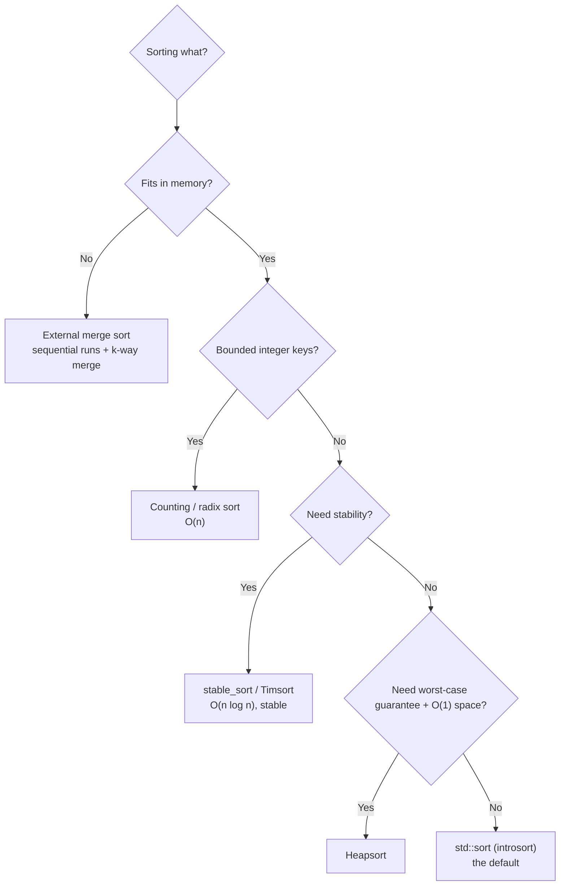

# Sorting Algorithms

Sorting is the most-studied problem in computing, and by now it is a solved one: every language ships a sort you should use instead of writing your own. So why spend a chapter on it? Because sorting is the cleanest lens we have on the theme of this book — the gap between what Big-O promises and what the machine delivers. Three algorithms in this chapter, quicksort, mergesort, and heapsort, are all `O(n log n)`. On paper they are interchangeable. On real hardware they are not remotely interchangeable, and *why* is a short course in cache behavior, branch prediction, and constant factors. The algorithm your standard library actually runs is none of the three in pure form; it is a hybrid stitched together from all the lessons below.

We'll build up the classic algorithms, keep the complexity and stability facts straight, and then spend the back half on the part most treatments skip: what happens when these run on a CPU with a memory hierarchy and a branch predictor.

## Why sort at all

An unsorted array answers exactly one question cheaply: "what's at index `i`?" Everything else — does `x` exist, what's the median, which records share a key, show me the top ten by price — is a linear scan. Sort once, up front, and a whole class of queries collapses:

- **Search** drops from `O(n)` to `O(log n)` via binary search.
- **Finding duplicates, medians, or order statistics** becomes a single pass.
- **Merging and set operations** (union, intersection) become linear.
- **Grouping** — every database `GROUP BY` and `ORDER BY`, every deduplication — is sorting in disguise.

The trade is `O(n log n)` of preprocessing for cheap queries forever after, which is why you sort when data is queried far more often than it changes, and why you *don't* bother when a hash table already gives you `O(1)` membership, when you only need the min or max (that's an `O(n)` scan, no sort required), or when the data churns so fast the sort never amortizes.

## The comparison-sort landscape

Almost every general-purpose sort works by comparing pairs of elements. That single assumption imposes a hard floor: any algorithm that only learns about its input through comparisons needs at least `⌈log₂(n!)⌉ ≈ n log n` comparisons in the worst case, because it must distinguish between `n!` possible orderings and each comparison yields one bit. **No comparison sort beats `O(n log n)`.** The algorithms that appear to — counting and radix sort, later in this chapter — don't compare; they exploit the structure of the keys, and pay for it with restrictions.

Here is the field. Memorize the shape of it, not the individual cells:

| Algorithm | Best | Average | Worst | Space | Stable |
|-----------|------|---------|-------|-------|--------|
| Insertion | `O(n)` | `O(n²)` | `O(n²)` | `O(1)` | Yes |
| Selection | `O(n²)` | `O(n²)` | `O(n²)` | `O(1)` | No |
| Merge | `O(n log n)` | `O(n log n)` | `O(n log n)` | `O(n)` | Yes |
| Quick | `O(n log n)` | `O(n log n)` | `O(n²)` | `O(log n)` | No |
| Heap | `O(n log n)` | `O(n log n)` | `O(n log n)` | `O(1)` | Yes* |

*Heapsort as written is not stable; the asterisk is a reminder that stability is a property of the implementation, not just the name. The three `O(n log n)` sorts each make a different trade — merge buys stability and a predictable worst case with `O(n)` memory; quick buys speed and in-place operation with a `O(n²)` worst case; heap buys a guaranteed worst case and `O(1)` space with poor cache behavior — and the rest of this chapter is about spending those trades wisely.

## Insertion sort: the O(n²) sort that refuses to die

Insertion sort is what you do with a hand of cards: pick up each new element and slide it left until it sits in order. It is `O(n²)`, which should make it useless. It is not, and understanding why is the key that unlocks how `std::sort` is built.

```cpp
void insertionSort(std::vector<int>& a) {
    for (std::size_t i = 1; i < a.size(); ++i) {
        int key = a[i];
        std::size_t j = i;
        while (j > 0 && a[j - 1] > key) {   // shift larger elements right
            a[j] = a[j - 1];
            --j;
        }
        a[j] = key;                         // drop key into the gap
    }
}
```

```python
def insertion_sort(a):
    for i in range(1, len(a)):
        key = a[i]
        j = i
        while j > 0 and a[j - 1] > key:   # shift larger elements right
            a[j] = a[j - 1]
            j -= 1
        a[j] = key                        # drop key into the gap
```

```java
void insertionSort(int[] a) {
    for (int i = 1; i < a.length; i++) {
        int key = a[i];
        int j = i;
        while (j > 0 && a[j - 1] > key) {   // shift larger elements right
            a[j] = a[j - 1];
            j--;
        }
        a[j] = key;                         // drop key into the gap
    }
}
```

```go
func insertionSort(a []int) {
    for i := 1; i < len(a); i++ {
        key := a[i]
        j := i
        for j > 0 && a[j-1] > key { // shift larger elements right
            a[j] = a[j-1]
            j--
        }
        a[j] = key // drop key into the gap
    }
}
```

Three properties make it punch far above its complexity class. It is **adaptive**: on already-sorted or nearly-sorted input the inner loop never runs, so it degrades gracefully to `O(n)` — one linear pass. It is **stable**: equal elements never jump past each other because the comparison is strictly `>`. And it has a **tiny constant factor** — no recursion, no partitioning, no bookkeeping, just a linear scan with the occasional shift. On small inputs, "tiny constant factor" beats "good asymptotics" every time, because `n²` with a small constant is less than `n log n` with a large one when `n` is 16. That crossover is exactly why real sorts fall back to insertion sort for small subarrays. Hold that thought.

Selection sort — repeatedly find the minimum of the remaining elements and swap it into place — is insertion sort's less useful cousin: also `O(n²)`, but *not* adaptive (it always scans the full remainder) and not stable. Its one virtue is that it performs at most `n` swaps total, which matters only when writes are far more expensive than reads, as on some flash memory. Bubble sort has no virtues worth the page; we'll leave it as a name to recognize.

## Merge sort: divide, conquer, and stream

Merge sort is the textbook divide-and-conquer: split the array in half, sort each half recursively, then merge the two sorted halves into one. The merge is the whole trick — walking two sorted runs with two fingers, always taking the smaller front element.

```cpp
void merge(std::vector<int>& a, int lo, int mid, int hi) {
    std::vector<int> L(a.begin() + lo,  a.begin() + mid + 1);
    std::vector<int> R(a.begin() + mid + 1, a.begin() + hi + 1);
    std::size_t i = 0, j = 0;
    int k = lo;
    while (i < L.size() && j < R.size())
        a[k++] = (L[i] <= R[j]) ? L[i++] : R[j++];   // <= keeps it stable
    while (i < L.size()) a[k++] = L[i++];
    while (j < R.size()) a[k++] = R[j++];
}

void mergeSort(std::vector<int>& a, int lo, int hi) {
    if (lo >= hi) return;
    int mid = lo + (hi - lo) / 2;          // not (lo+hi)/2 — that can overflow
    mergeSort(a, lo, mid);
    mergeSort(a, mid + 1, hi);
    merge(a, lo, mid, hi);
}
```

```python
def merge(a, lo, mid, hi):
    L = a[lo:mid + 1]
    R = a[mid + 1:hi + 1]
    i = j = 0
    k = lo
    while i < len(L) and j < len(R):
        if L[i] <= R[j]:              # <= keeps it stable
            a[k] = L[i]; i += 1
        else:
            a[k] = R[j]; j += 1
        k += 1
    while i < len(L):
        a[k] = L[i]; i += 1; k += 1
    while j < len(R):
        a[k] = R[j]; j += 1; k += 1


def merge_sort(a, lo, hi):
    if lo >= hi:
        return
    mid = lo + (hi - lo) // 2          # not (lo+hi)//2 — matches the C++ convention
    merge_sort(a, lo, mid)
    merge_sort(a, mid + 1, hi)
    merge(a, lo, mid, hi)
```

```java
void merge(int[] a, int lo, int mid, int hi) {
    int[] L = Arrays.copyOfRange(a, lo, mid + 1);
    int[] R = Arrays.copyOfRange(a, mid + 1, hi + 1);
    int i = 0, j = 0, k = lo;
    while (i < L.length && j < R.length)
        a[k++] = (L[i] <= R[j]) ? L[i++] : R[j++];   // <= keeps it stable
    while (i < L.length) a[k++] = L[i++];
    while (j < R.length) a[k++] = R[j++];
}

void mergeSort(int[] a, int lo, int hi) {
    if (lo >= hi) return;
    int mid = lo + (hi - lo) / 2;          // not (lo+hi)/2 — that can overflow
    mergeSort(a, lo, mid);
    mergeSort(a, mid + 1, hi);
    merge(a, lo, mid, hi);
}
```

```go
func merge(a []int, lo, mid, hi int) {
    L := append([]int(nil), a[lo:mid+1]...)
    R := append([]int(nil), a[mid+1:hi+1]...)
    i, j, k := 0, 0, lo
    for i < len(L) && j < len(R) {
        if L[i] <= R[j] { // <= keeps it stable
            a[k] = L[i]
            i++
        } else {
            a[k] = R[j]
            j++
        }
        k++
    }
    for i < len(L) {
        a[k] = L[i]
        i++
        k++
    }
    for j < len(R) {
        a[k] = R[j]
        j++
        k++
    }
}

func mergeSort(a []int, lo, hi int) {
    if lo >= hi {
        return
    }
    mid := lo + (hi-lo)/2 // not (lo+hi)/2 — that can overflow
    mergeSort(a, lo, mid)
    mergeSort(a, mid+1, hi)
    merge(a, lo, mid, hi)
}
```

Two details carry systems weight. The `<=` in the merge is what makes merge sort **stable**: when the fronts tie, we take from the left run, which held the earlier element. Flip it to `<` and stability is gone. And `mid = lo + (hi - lo) / 2` instead of `(lo + hi) / 2` avoids integer overflow when the indices are large — the same bug that lived in the JDK's binary search for nine years. It costs nothing to write it correctly.

Merge sort's headline properties: a **guaranteed `O(n log n)`** with no worst case to fear, **stability**, and **trivial parallelism** — the two recursive halves are independent, so a parallel merge sort just hands them to different cores. Its price is `O(n)` scratch memory, which rules it out where memory is tight and makes it the natural choice where it isn't. Its deeper virtue, invisible in the complexity, is that **the merge touches memory sequentially** — three linear scans, two in and one out. We'll come back to why that makes it faster than its Big-O twin quicksort on large, out-of-cache data.

## Quicksort: partition in place

Quicksort also divides and conquers, but it does the work *before* recursing instead of after. Pick a pivot, partition the array so everything `≤` pivot is left of it and everything `>` is right, and the pivot is now in its final position. Recurse on each side. There is no merge step — the partitioning already placed everything.

```cpp
int partition(std::vector<int>& a, int lo, int hi) {
    int pivot = a[hi];        // pivot = last element (Lomuto scheme)
    int i = lo - 1;           // i tracks the end of the "<= pivot" region
    for (int j = lo; j < hi; ++j)
        if (a[j] <= pivot)
            std::swap(a[++i], a[j]);
    std::swap(a[i + 1], a[hi]);
    return i + 1;             // pivot's final resting index
}

void quickSort(std::vector<int>& a, int lo, int hi) {
    while (lo < hi) {
        int p = partition(a, lo, hi);
        // Recurse into the smaller side, loop on the larger:
        // keeps stack depth O(log n) even on bad pivots.
        if (p - lo < hi - p) {
            quickSort(a, lo, p - 1);
            lo = p + 1;
        } else {
            quickSort(a, p + 1, hi);
            hi = p - 1;
        }
    }
}
```

```python
def partition(a, lo, hi):
    pivot = a[hi]                    # pivot = last element (Lomuto scheme)
    i = lo - 1                       # i tracks the end of the "<= pivot" region
    for j in range(lo, hi):
        if a[j] <= pivot:
            i += 1
            a[i], a[j] = a[j], a[i]
    a[i + 1], a[hi] = a[hi], a[i + 1]
    return i + 1                     # pivot's final resting index


def quick_sort(a, lo, hi):
    while lo < hi:
        p = partition(a, lo, hi)
        # Recurse into the smaller side, loop on the larger:
        # keeps stack depth O(log n) even on bad pivots.
        if p - lo < hi - p:
            quick_sort(a, lo, p - 1)
            lo = p + 1
        else:
            quick_sort(a, p + 1, hi)
            hi = p - 1
```

```java
int partition(int[] a, int lo, int hi) {
    int pivot = a[hi];        // pivot = last element (Lomuto scheme)
    int i = lo - 1;           // i tracks the end of the "<= pivot" region
    for (int j = lo; j < hi; j++)
        if (a[j] <= pivot) {
            i++;
            int t = a[i]; a[i] = a[j]; a[j] = t;
        }
    int t = a[i + 1]; a[i + 1] = a[hi]; a[hi] = t;
    return i + 1;             // pivot's final resting index
}

void quickSort(int[] a, int lo, int hi) {
    while (lo < hi) {
        int p = partition(a, lo, hi);
        // Recurse into the smaller side, loop on the larger:
        // keeps stack depth O(log n) even on bad pivots.
        if (p - lo < hi - p) {
            quickSort(a, lo, p - 1);
            lo = p + 1;
        } else {
            quickSort(a, p + 1, hi);
            hi = p - 1;
        }
    }
}
```

```go
func partition(a []int, lo, hi int) int {
    pivot := a[hi] // pivot = last element (Lomuto scheme)
    i := lo - 1    // i tracks the end of the "<= pivot" region
    for j := lo; j < hi; j++ {
        if a[j] <= pivot {
            i++
            a[i], a[j] = a[j], a[i]
        }
    }
    a[i+1], a[hi] = a[hi], a[i+1]
    return i + 1 // pivot's final resting index
}

func quickSort(a []int, lo, hi int) {
    for lo < hi {
        p := partition(a, lo, hi)
        // Recurse into the smaller side, loop on the larger:
        // keeps stack depth O(log n) even on bad pivots.
        if p-lo < hi-p {
            quickSort(a, lo, p-1)
            lo = p + 1
        } else {
            quickSort(a, p+1, hi)
            hi = p - 1
        }
    }
}
```

Quicksort is usually the fastest comparison sort in practice, for one reason above all: it sorts **in place** with a tight partition loop and excellent constant factors. But it hides a trap. The pivot choice decides the split, and a bad pivot gives a lopsided one. Feed the code above an already-sorted array and `a[hi]` — the largest element — is the pivot every time, so each partition peels off exactly one element: `n` levels of recursion, `O(n²)` work, and on the naive recursive version, a stack overflow. The cruel irony is that the worst case is triggered by the *best*-looking input.

Two defenses matter. The first is the tail-call trick already in the code: always recurse into the smaller partition and loop on the larger, which caps stack depth at `O(log n)` regardless of pivots. The second is to **stop letting the input choose the pivot**:

```cpp
int randomizedPartition(std::vector<int>& a, int lo, int hi) {
    int r = lo + std::rand() % (hi - lo + 1);   // needs <cstdlib>
    std::swap(a[r], a[hi]);
    return partition(a, lo, hi);
}
```

```python
def randomized_partition(a, lo, hi):
    r = random.randint(lo, hi)          # random index in [lo, hi]
    a[r], a[hi] = a[hi], a[r]
    return partition(a, lo, hi)
```

```java
int randomizedPartition(int[] a, int lo, int hi) {
    int r = lo + ThreadLocalRandom.current().nextInt(hi - lo + 1);   // random index in [lo, hi]
    int t = a[r]; a[r] = a[hi]; a[hi] = t;
    return partition(a, lo, hi);
}
```

```go
func randomizedPartition(a []int, lo, hi int) int {
    r := lo + rand.Intn(hi-lo+1) // random index in [lo, hi]
    a[r], a[hi] = a[hi], a[r]
    return partition(a, lo, hi)
}
```

A random pivot makes the `O(n²)` case astronomically unlikely for any *particular* input — an adversary can no longer hand you a sorted array to blow up. Production libraries go further: `std::sort` uses **median-of-three** (or median-of-medians) pivots and, crucially, a hard fallback we'll see in a moment.

## Heapsort: guaranteed and in-place

Heapsort is the sort you reach for when you want quicksort's `O(1)` space *and* mergesort's guaranteed `O(n log n)`, and are willing to give up cache performance to get both. It builds a max-heap in the array — a binary tree where every parent outranks its children, laid out so node `i`'s children sit at `2i+1` and `2i+2` — then repeatedly swaps the max at the root to the end and shrinks the heap.

```cpp
void heapify(std::vector<int>& a, int n, int i) {
    int largest = i, l = 2 * i + 1, r = 2 * i + 2;
    if (l < n && a[l] > a[largest]) largest = l;
    if (r < n && a[r] > a[largest]) largest = r;
    if (largest != i) {
        std::swap(a[i], a[largest]);
        heapify(a, n, largest);   // sift the demoted element down
    }
}

void heapSort(std::vector<int>& a) {
    int n = a.size();
    for (int i = n / 2 - 1; i >= 0; --i)   // build heap bottom-up: O(n)
        heapify(a, n, i);
    for (int i = n - 1; i > 0; --i) {      // extract max n-1 times: O(n log n)
        std::swap(a[0], a[i]);
        heapify(a, i, 0);                  // restore heap on the shrunk range
    }
}
```

```python
def heapify(a, n, i):
    largest, l, r = i, 2 * i + 1, 2 * i + 2
    if l < n and a[l] > a[largest]: largest = l
    if r < n and a[r] > a[largest]: largest = r
    if largest != i:
        a[i], a[largest] = a[largest], a[i]
        heapify(a, n, largest)             # sift the demoted element down


def heap_sort(a):
    n = len(a)
    for i in range(n // 2 - 1, -1, -1):    # build heap bottom-up: O(n)
        heapify(a, n, i)
    for i in range(n - 1, 0, -1):          # extract max n-1 times: O(n log n)
        a[0], a[i] = a[i], a[0]
        heapify(a, i, 0)                   # restore heap on the shrunk range
```

```java
void heapify(int[] a, int n, int i) {
    int largest = i, l = 2 * i + 1, r = 2 * i + 2;
    if (l < n && a[l] > a[largest]) largest = l;
    if (r < n && a[r] > a[largest]) largest = r;
    if (largest != i) {
        int t = a[i]; a[i] = a[largest]; a[largest] = t;
        heapify(a, n, largest);   // sift the demoted element down
    }
}

void heapSort(int[] a) {
    int n = a.length;
    for (int i = n / 2 - 1; i >= 0; i--)   // build heap bottom-up: O(n)
        heapify(a, n, i);
    for (int i = n - 1; i > 0; i--) {      // extract max n-1 times: O(n log n)
        int t = a[0]; a[0] = a[i]; a[i] = t;
        heapify(a, i, 0);                  // restore heap on the shrunk range
    }
}
```

```go
func heapify(a []int, n, i int) {
    largest, l, r := i, 2*i+1, 2*i+2
    if l < n && a[l] > a[largest] {
        largest = l
    }
    if r < n && a[r] > a[largest] {
        largest = r
    }
    if largest != i {
        a[i], a[largest] = a[largest], a[i]
        heapify(a, n, largest) // sift the demoted element down
    }
}

func heapSort(a []int) {
    n := len(a)
    for i := n/2 - 1; i >= 0; i-- { // build heap bottom-up: O(n)
        heapify(a, n, i)
    }
    for i := n - 1; i > 0; i-- { // extract max n-1 times: O(n log n)
        a[0], a[i] = a[i], a[0]
        heapify(a, i, 0) // restore heap on the shrunk range
    }
}
```

The properties are the selling point: **`O(n log n)` in every case** — no adversarial input degrades it — and **`O(1)` extra space**. It is not stable, and in practice it is the *slowest* of the three `O(n log n)` sorts, because `heapify` hops between a parent at index `i` and children at `2i+1` and `2i+2` — addresses that fan out across memory and defeat the cache and the prefetcher. That combination, bulletproof worst case but poor real-world speed, is exactly why heapsort's main job today is to be a *safety net* for quicksort rather than a front-line sort.

## What std::sort actually runs: introsort

No serious library ships pure quicksort — the `O(n²)` cliff is unacceptable — and none ships pure mergesort as the default, because the `O(n)` memory and the constant factors lose to quicksort on typical data. So `std::sort` runs **introsort** (introspective sort), a hybrid that takes the best of all three:

1. **Run quicksort** for its speed and in-place partitioning, with a good pivot heuristic.
2. **Watch the recursion depth.** If it exceeds `~2·log₂(n)` — the signature of pivots going bad and the `O(n²)` cliff approaching — **switch that subproblem to heapsort**, which guarantees `O(n log n)` from there. This is what turns quicksort's fragile average case into a hard worst-case guarantee.
3. **Stop recursing on small subarrays** (below a threshold around 16) and finish with a single **insertion sort** over the nearly-sorted whole.

That third step is the constant-factor lesson made concrete, and it is worth dwelling on. Below ~16 elements, quicksort's partitioning overhead — the pivot selection, the swaps, the recursive calls — costs more than insertion sort's tight, branch-predictable, cache-resident inner loop, even though insertion sort is asymptotically worse. Introsort doesn't insertion-sort each tiny piece separately; it leaves subarrays of size < 16 unsorted (each is already "roughly" in place, within 16 slots of home) and runs one final insertion-sort pass over the entire array. On data that is everywhere locally almost-sorted, that pass is nearly `O(n)`. The result: quicksort's speed on the large scale, heapsort's guarantee against adversaries, insertion sort's constant factor on the small scale. No single algorithm wins; the *combination* does. That is the real lesson of this chapter, and it recurs throughout systems work.

## Branch prediction: why sorting the data first can speed up code that doesn't sort

Here is a result that startles people the first time they see it. Take a large array of random bytes and sum only the ones `≥ 128`:

```cpp
long sum = 0;
for (int i = 0; i < N; ++i)
    if (data[i] >= 128)      // <-- the whole story is this branch
        sum += data[i];
```

Run it on a shuffled array, then run the *identical* loop on the same data after sorting it, and the sorted version can be **several times faster**. The loop does the same work, touches the same memory, has the same `O(n)` complexity. What changed is the CPU's **branch predictor**.

A modern CPU is a pipeline running a dozen-plus instructions in flight at once, and to keep it full it must *guess* which way each branch goes before the condition is actually computed. On sorted data the branch is trivially predictable: false, false, false, … then true, true, true — one mispredict at the boundary and it's right the rest of the way. On shuffled data `data[i] >= 128` is a coin flip; the predictor is wrong roughly half the time, and every misprediction **flushes the pipeline** and restarts it, throwing away ~15–20 cycles of speculative work. Half of `N` mispredictions, at 15+ cycles each, is where the time goes.

Two systems lessons fall out of this. First, **sorted data isn't just cheaper to search — it's cheaper to compute over**, because it makes downstream branches predictable. Second, when you *can't* sort and the branch is inherently unpredictable, remove it. The **branchless** rewrite

```cpp
sum += (data[i] >= 128) * data[i];   // comparison yields 0 or 1; no branch
```

turns a control dependency the CPU must guess into a data dependency it can always execute, trading a possible pipeline flush for one cheap multiply. Compilers do this automatically when they can (it's called *if-conversion* or *predication*), and it is why hand-written high-performance code — sorting networks, hash probes, parsers — is often deliberately branchless. The predictor is a hidden variable in every hot loop, and Big-O cannot see it.

## Cache behavior: why two O(n log n) sorts run at different speeds

Quicksort and mergesort are both `O(n log n)` and both do `~n log n` comparisons. Yet on large arrays that spill out of cache, their real-world speeds diverge, and the reason is entirely about **how they walk memory** — the thing Big-O throws away and this book keeps insisting is the whole game.

**Mergesort's access pattern is sequential.** Every merge is three linear scans: read up the left run, read up the right run, write out the result, each address one past the last. That is precisely the pattern the hardware prefetcher was built to detect — it sees the stride and fetches the next cache line before the code asks for it, so the data is waiting in L1 by the time it's needed. Mergesort streams.

**Quicksort's access pattern is a partition.** The core loop walks a range and swaps elements across a moving boundary, which is still fairly local, but the *pivoting* scatters reads and writes, and the algorithm revisits regions as it recurses. Its cache behavior is good but not the clean sequential stream mergesort enjoys. On data that fits in cache, quicksort's smaller constant factor and in-place operation win outright. On data far larger than cache — the multi-gigabyte case — mergesort's sequential locality can pull it ahead, cache miss for cache miss, despite identical complexity.

This is not a footnote; it is the design principle behind **external sorting**, how databases sort data too large for RAM. You cannot quicksort a terabyte on a machine with 64 GB of memory — random access to disk is death. So you sort in RAM-sized chunks, write each sorted **run** to disk, and then **k-way merge** the runs with sequential reads and one sequential write. The whole architecture is chosen because merging is sequential and sequential is what spinning disks, SSDs, and prefetchers all reward. Big-O says mergesort and quicksort are the same. The memory hierarchy says otherwise, and the memory hierarchy is the one you have to ship on.

## Beyond comparison: counting and radix sort

The `n log n` floor only binds algorithms that learn about their input through comparisons. If the keys are integers in a bounded range, you can sidestep comparison entirely and hit `O(n)`.

**Counting sort** tallies how many times each key appears, turns the tallies into positions with a prefix sum, then places each element directly. It is `O(n + k)` for `n` elements with keys in a range of size `k`, and it is **stable** if you place elements from right to left:

```cpp
void countingSort(std::vector<int>& a) {
    if (a.empty()) return;
    int lo = *std::min_element(a.begin(), a.end());
    int hi = *std::max_element(a.begin(), a.end());
    std::vector<int> count(hi - lo + 1, 0);
    for (int x : a) ++count[x - lo];
    for (std::size_t i = 1; i < count.size(); ++i)
        count[i] += count[i - 1];               // prefix sum -> end positions
    std::vector<int> out(a.size());
    for (int i = (int)a.size() - 1; i >= 0; --i) // right-to-left keeps it stable
        out[--count[a[i] - lo]] = a[i];
    a = out;
}
```

```python
def counting_sort(a):
    if not a:
        return
    lo = min(a)
    hi = max(a)
    count = [0] * (hi - lo + 1)
    for x in a:
        count[x - lo] += 1
    for i in range(1, len(count)):
        count[i] += count[i - 1]                 # prefix sum -> end positions
    out = [0] * len(a)
    for i in range(len(a) - 1, -1, -1):          # right-to-left keeps it stable
        count[a[i] - lo] -= 1
        out[count[a[i] - lo]] = a[i]
    a[:] = out
```

```java
void countingSort(int[] a) {
    if (a.length == 0) return;
    int lo = a[0], hi = a[0];
    for (int x : a) { if (x < lo) lo = x; if (x > hi) hi = x; }
    int[] count = new int[hi - lo + 1];
    for (int x : a) count[x - lo]++;
    for (int i = 1; i < count.length; i++)
        count[i] += count[i - 1];               // prefix sum -> end positions
    int[] out = new int[a.length];
    for (int i = a.length - 1; i >= 0; i--)     // right-to-left keeps it stable
        out[--count[a[i] - lo]] = a[i];
    System.arraycopy(out, 0, a, 0, a.length);
}
```

```go
func countingSort(a []int) {
    if len(a) == 0 {
        return
    }
    lo, hi := a[0], a[0]
    for _, x := range a {
        if x < lo {
            lo = x
        }
        if x > hi {
            hi = x
        }
    }
    count := make([]int, hi-lo+1)
    for _, x := range a {
        count[x-lo]++
    }
    for i := 1; i < len(count); i++ {
        count[i] += count[i-1] // prefix sum -> end positions
    }
    out := make([]int, len(a))
    for i := len(a) - 1; i >= 0; i-- { // right-to-left keeps it stable
        count[a[i]-lo]--
        out[count[a[i]-lo]] = a[i]
    }
    copy(a, out)
}
```

Counting sort is a rocket when `k` is small (sorting a million values in `[0, 255]`) and a memory disaster when `k` is large — sorting 32-bit integers this way would allocate a four-billion-entry table. That's where **radix sort** comes in: it runs counting sort digit by digit, least-significant first, relying on counting sort's stability to preserve the ordering of previous digits. For `d`-digit keys it is `O(d · (n + k))` with a small `k` (10 for decimal digits, or 256 for byte-at-a-time), effectively `O(n)` when `d` is a constant.

```cpp
void countingSortByDigit(std::vector<int>& a, int exp) {
    std::vector<int> out(a.size());
    int count[10] = {0};
    for (int x : a) ++count[(x / exp) % 10];
    for (int i = 1; i < 10; ++i) count[i] += count[i - 1];
    for (int i = (int)a.size() - 1; i >= 0; --i) {   // stable placement
        int d = (a[i] / exp) % 10;
        out[--count[d]] = a[i];
    }
    a = out;
}

void radixSort(std::vector<int>& a) {   // non-negative integers
    if (a.empty()) return;
    int hi = *std::max_element(a.begin(), a.end());
    for (int exp = 1; hi / exp > 0; exp *= 10)
        countingSortByDigit(a, exp);
}
```

```python
def counting_sort_by_digit(a, exp):
    out = [0] * len(a)
    count = [0] * 10
    for x in a:
        count[(x // exp) % 10] += 1
    for i in range(1, 10):
        count[i] += count[i - 1]
    for i in range(len(a) - 1, -1, -1):          # stable placement
        d = (a[i] // exp) % 10
        count[d] -= 1
        out[count[d]] = a[i]
    a[:] = out


def radix_sort(a):                                # non-negative integers
    if not a:
        return
    hi = max(a)
    exp = 1
    while hi // exp > 0:
        counting_sort_by_digit(a, exp)
        exp *= 10
```

```java
void countingSortByDigit(int[] a, int exp) {
    int[] out = new int[a.length];
    int[] count = new int[10];
    for (int x : a) count[(x / exp) % 10]++;
    for (int i = 1; i < 10; i++) count[i] += count[i - 1];
    for (int i = a.length - 1; i >= 0; i--) {   // stable placement
        int d = (a[i] / exp) % 10;
        out[--count[d]] = a[i];
    }
    System.arraycopy(out, 0, a, 0, a.length);
}

void radixSort(int[] a) {   // non-negative integers
    if (a.length == 0) return;
    int hi = a[0];
    for (int x : a) if (x > hi) hi = x;
    for (int exp = 1; hi / exp > 0; exp *= 10)
        countingSortByDigit(a, exp);
}
```

```go
func countingSortByDigit(a []int, exp int) {
    out := make([]int, len(a))
    var count [10]int
    for _, x := range a {
        count[(x/exp)%10]++
    }
    for i := 1; i < 10; i++ {
        count[i] += count[i-1]
    }
    for i := len(a) - 1; i >= 0; i-- { // stable placement
        d := (a[i] / exp) % 10
        count[d]--
        out[count[d]] = a[i]
    }
    copy(a, out)
}

func radixSort(a []int) { // non-negative integers
    if len(a) == 0 {
        return
    }
    hi := a[0]
    for _, x := range a {
        if x > hi {
            hi = x
        }
    }
    for exp := 1; hi/exp > 0; exp *= 10 {
        countingSortByDigit(a, exp)
    }
}
```

These are not magic. They only apply to keys you can decompose into small bounded pieces — integers, fixed-width strings — and they are not in-place. But when they apply, they beat every comparison sort, which is why radix sort shows up sorting integer keys in databases and why bucketing schemes underpin a lot of large-scale data processing. (**Bucket sort** is the same idea for uniformly distributed floating-point keys: scatter into `n` buckets by value, sort each small bucket, concatenate — `O(n)` on average, `O(n²)` if the distribution clumps everything into one bucket.)

## Stability, and why it quietly matters

A sort is **stable** if equal elements keep their original relative order. It sounds academic until you sort by more than one key. Sort a table of transactions by amount, then by date, with a *stable* sort, and rows with the same date stay ordered by amount — you get "by date, ties broken by amount" for free. With an unstable sort the second pass scrambles the first, and you have to encode both keys into one comparator. Every "sort by column, then re-sort by another column" UI relies on this. Merge sort, insertion sort, counting, and radix are stable; quicksort and heapsort are not, which is precisely why `std::sort` is unstable and there is a separate `std::stable_sort` (a merge sort) for when you need the guarantee.

## Choosing a sort

In application code the honest answer is: **call your library's sort.** It is `std::sort` (introsort), Python and Java's Timsort (a stable, adaptive merge/insertion hybrid that detects and exploits already-sorted runs), or Java's dual-pivot quicksort for primitives — all of them years more tuned than anything you'll write. Reach past the library only when you have a reason the table below names.

| Situation | Reach for | Because |
|-----------|-----------|---------|
| General purpose, don't care about stability | `std::sort` / introsort | Fast average case, hard `O(n log n)` guarantee, in-place |
| Stability required (multi-key sorts) | `std::stable_sort` / mergesort / Timsort | Preserves order of equal keys |
| Hard worst-case guarantee *and* tight memory | Heapsort | `O(n log n)` always, `O(1)` space |
| Small or nearly-sorted input | Insertion sort | Adaptive `O(n)` best case, tiny constant |
| Integer keys, bounded range | Counting / radix sort | Beats the `n log n` floor: `O(n)` |
| Data larger than RAM | External merge sort | Sequential I/O; random access is fatal |

The decision, boiled down:



## Edge cases and traps

The bugs that actually bite when you implement a sort:

- **`(lo + hi) / 2` overflows** on large indices. Always `lo + (hi - lo) / 2`. This is the single most common real bug in sort and binary-search code.
- **Quicksort on sorted input** with a naive last-element pivot is `O(n²)` and can overflow the stack. Randomize the pivot and recurse into the smaller partition.
- **Empty and single-element arrays** must be no-ops, not out-of-bounds accesses — check before touching `a[0]` or computing `size() - 1` on an unsigned type (an empty `vector` makes `size() - 1` a huge number).
- **Assuming `O(n log n)` is always best.** For `n < 16` insertion sort wins on constant factors; for bounded integer keys radix wins outright. The asymptote is not the runtime.
- **Reaching for an unstable sort when order matters.** Silent, data-dependent bugs. Know which sort you called.

## Interview checklist

**Say this, not that.** "Quicksort is `O(n log n)`" is the shallow answer. The deep one: "`O(n log n)` *average*, but `O(n²)` worst case on bad pivots — which is why real implementations randomize the pivot and fall back to heapsort. It wins in practice because it's in-place with great constant factors, not because of its complexity class."

**Questions you'll get:**
- *When is an `O(n²)` sort the right choice?* Small or nearly-sorted inputs — insertion sort's tiny constant and adaptivity beat `n log n` overhead. It's why `std::sort` finishes with one.
- *Merge vs. quick?* Merge for stability, a guaranteed worst case, external/parallel sorting, and sequential memory access; quick for in-place speed on in-memory data.
- *How do you beat `n log n`?* You don't with comparisons — that's a proven lower bound. You stop comparing: counting/radix sort on bounded integer keys.
- *Why is `std::sort` a hybrid?* No single algorithm is best everywhere; introsort takes quicksort's speed, heapsort's guarantee, and insertion sort's small-`n` constant.

**Classic problems:** Sort Colors (Dutch national flag / 3-way partition), Kth Largest Element (quickselect — quicksort's partition without full recursion, `O(n)` average), Merge k Sorted Lists (heap-based k-way merge), Sort an Array (implement it and defend your choice).

## Summary

Sorting is where Big-O and the machine part ways most visibly. Three algorithms share the `O(n log n)` label and behave completely differently: mergesort streams memory sequentially and stays stable at the cost of `O(n)` space; quicksort partitions in place with the best constant factors but a `O(n²)` cliff on bad pivots; heapsort guarantees the worst case in `O(1)` space but pays for it in cache misses. The library's answer, introsort, refuses to choose — it runs quicksort, escapes to heapsort when pivots go bad, and finishes with insertion sort where small-`n` constants dominate. Underneath it all sit the two forces this book keeps returning to: the cache, which rewards mergesort's sequential access and punishes heapsort's scattered heap, and the branch predictor, which can make the *same* loop several times faster on sorted data. Master those two and you understand not just how to sort, but why the fastest sort on paper is rarely the fastest sort on your CPU.

Next we turn to [searching](13-searching-algorithms.md) — the payoff that sorted data buys, and where the `O(log n)` we've been promising finally comes due.
