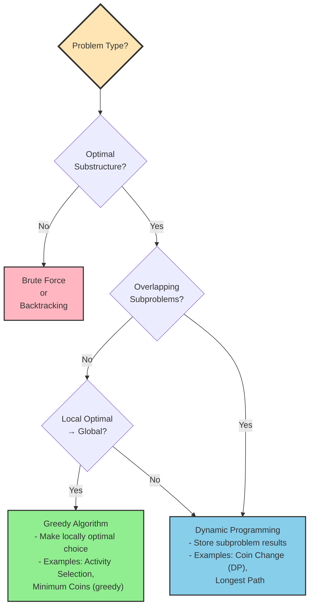

# Chapter 12: Dynamic Programming

Dynamic programming is what you reach for when a recursive solution is *correct but hopelessly slow* because it keeps re-solving the same subproblems. Naive Fibonacci is `O(2ⁿ)`; brute-force longest common subsequence, coin change, and knapsack are all exponential — not because the problems are hard, but because the recursion recomputes the same answers exponentially many times. DP fixes exactly that: solve each distinct subproblem once, store the result, reuse it. The exponential collapses to polynomial — usually `O(n²)` or `O(n³)` — paid for in memory.

Two properties have to hold for the trick to work, and together they are the whole test for whether something is a DP problem:

- **Optimal substructure** — the optimal answer is built from optimal answers to subproblems. Fibonacci: `F(n) = F(n-1) + F(n-2)`. LCS, edit distance, and knapsack each have a one-line recurrence of the same shape.
- **Overlapping subproblems** — the naive recursion solves the same subproblem many times. `F(3)` appears again and again in the call tree for `F(5)`; that repetition is what memoization erases.

Both must be present. Without overlap, you want plain divide and conquer ([Chapter 17](17-divide-and-conquer.md)) — nothing to cache. When a locally optimal choice is provably globally optimal, you want a cheaper greedy algorithm ([Chapter 16](16-greedy-algorithms.md)). DP is the middle case — optimization or counting over sequences, grids, and subsets: sequence alignment, resource allocation, constrained shortest paths, edit distance, optimal game play.

The mechanism comes in exactly two forms, and every algorithm in this chapter is one of them. **Memoization** (top-down) keeps the natural recursion but caches each result the first time it is computed, so it only ever touches the states it actually needs. **Tabulation** (bottom-up) drops the recursion and fills a table in dependency order, from the base cases toward the answer. They compute the same values with the same asymptotics; tabulation just has no call-stack overhead, is easier to space-optimize, and walks memory in a cache-friendly order — which, as §12.3 shows, usually makes it the faster of the two.

Correctness of either form rests on three facts worth checking every time: base cases are correct by definition; every other state is computed from strictly *smaller* states, so its value is final before anything reads it; and the state space is finite with acyclic dependencies, so the process terminates. Get the base cases, the recurrence, and the dependency order right and the algorithm is right.

## 12.1 The two faces of DP: Fibonacci

Fibonacci is the smallest problem that shows the whole idea. The naive recursion transcribes the definition directly:

```cpp
#include <iostream>
#include <vector>
#include <unordered_map>
using namespace std;

// Naive recursive Fibonacci - O(2^n) time
long long fibonacciNaive(int n) {
    if (n <= 1) return n;
    return fibonacciNaive(n - 1) + fibonacciNaive(n - 2);
}
```

Draw its call tree and the waste is obvious:

```
                    fibonacci(5)
                   /            \
          fibonacci(4)          fibonacci(3)
         /          \           /          \
  fibonacci(3)  fibonacci(2)  fibonacci(2)  fibonacci(1)
   /      \      /      \      /      \
fib(2)  fib(1) fib(1) fib(0) fib(1) fib(0)
 /   \
fib(1) fib(0)
```

`fibonacci(3)` is computed twice, `fibonacci(2)` three times, `fibonacci(1)` five times — and the redundancy compounds: `fibonacci(40)` makes about a trillion calls. Each does `O(1)` work, but there are `O(2ⁿ)` of them, at recursion depth `O(n)`.

**Memoization** caches each result the first time it is needed, so every distinct `n` is computed once. That one change collapses `O(2ⁿ)` to `O(n)` while keeping the recursive shape:

```cpp
// Memoized Fibonacci - O(n) time
long long fibonacciMemo(int n, unordered_map<int, long long>& memo) {
    if (n <= 1) return n;
    if (memo.find(n) != memo.end()) return memo[n];
    memo[n] = fibonacciMemo(n - 1, memo) + fibonacciMemo(n - 2, memo);
    return memo[n];
}

long long fibonacciMemo(int n) {
    unordered_map<int, long long> memo;
    return fibonacciMemo(n, memo);
}
```

**Tabulation** builds the same answers iteratively from the base cases, with no recursion (and no stack-overflow risk) and a predictable, sequential access pattern:

```cpp
// Tabulated Fibonacci - O(n) time, O(n) space
long long fibonacciTab(int n) {
    if (n <= 1) return n;
    vector<long long> dp(n + 1);
    dp[0] = 0;
    dp[1] = 1;
    for (int i = 2; i <= n; i++) dp[i] = dp[i - 1] + dp[i - 2];
    return dp[n];
}

// Space-optimized - O(n) time, O(1) space
long long fibonacciOptimized(int n) {
    if (n <= 1) return n;
    long long prev2 = 0, prev1 = 1, current = 0;
    for (int i = 2; i <= n; i++) {
        current = prev1 + prev2;
        prev2 = prev1;
        prev1 = current;
    }
    return current;
}
```

That last version is the endgame of most 1D DP: once `dp[i]` depends only on the two values before it, the table collapses to two scalars. *Keep only the state the recurrence actually reads* — a move that recurs throughout the chapter.

Stripped of the problem, both faces reduce to one of two language-neutral shapes — the template every algorithm below fills in:

```
FUNCTION solve(state):                    # memoization (top-down)
    IF state is base case: RETURN base_value
    IF memo[state] exists:  RETURN memo[state]
    result ← identity
    FOR EACH subproblem S that state depends on:
        result ← combine(result, solve(S))
    memo[state] ← result
    RETURN result

FUNCTION solve():                         # tabulation (bottom-up)
    INITIALIZE dp with base cases
    FOR EACH state in dependency order:
        result ← identity
        FOR EACH subproblem S that state depends on:
            result ← combine(result, dp[S])
        dp[state] ← result
    RETURN dp[target]
```

## 12.2 Edge cases and failure modes

**Empty and tiny inputs.** Guard array and string DP before indexing:

```cpp
// House Robber
if (nums.empty()) return 0;
if (nums.size() == 1) return nums[0];
// LCS
if (text1.empty() || text2.empty()) return 0;
```

Reading `nums[1]` when `size() == 1`, or `text1[0]` on an empty string, is undefined behavior.

**Zero and negative values.** For Coin Change, `amount == 0` is the base case and `amount < 0` means impossible; drop the negative check and you recurse forever. Knapsack assumes non-negative weights — a negative weight makes `dp[capacity - weight]` index past `capacity` and corrupt the table, so validate inputs.

**Integer overflow.** DP accumulates: large Fibonacci numbers, combinatorial path counts, big knapsack sums. Use `long long`, and check against the type's limits when a result may exceed them.

**Memory.** Deep recursion can overflow the call stack (1–8 MB), so prefer tabulation for large `n`; conversely a large 2D table (`dp[10000][10000]`) can exhaust the heap — use a rolling array or memoize only the reachable subset.

The recurring bugs are off-by-one indexing (`dp[n]` vs `dp[n-1]`), missing base-case initialization, an uninitialized first row or column in 2D DP, and negative-index access. Bounds-check before reading a predecessor: `if (i > 0) result = max(result, dp[i-1][j] + value);`.

## 12.3 Performance and system considerations

DP performance on real hardware is dominated by memory behavior, not by the abstract operation count — the constant-factor lesson of [Chapter 2](02-complexity-analysis.md) applied to a table.

**Cache locality — tabulation vs memoization.** Tabulation walks the table sequentially (row-major), which the prefetcher loves; memoization jumps around the recursion tree and, with a hash-map memo, pays unpredictable cache misses. A miss costs ~100–300 cycles and sequential access is roughly 10× faster than random, so tabulation is often 2–3× faster despite identical Big-O. When you do memoize, prefer a flat array over a hash map and store 2D tables row-major. Shrinking the footprint helps twice: a rolling array (`O(m×n) → O(n)`) saves memory *and* keeps the working set in cache.

**Stack vs heap.** Recursion uses the small (~1–8 MB) call stack and risks overflow at depth; iteration puts the table on the heap with no overflow risk. Pre-allocate it once rather than growing it.

**Branch prediction.** The `if (s1[i-1] == s2[j-1])` test in tight LCS/edit-distance loops is a branch: predicted well it costs ~1 cycle, mispredicted ~10–20. Where the alphabet is small, branchless code or a lookup table can help; otherwise order conditions to favor the common case.

**Concurrency and scale.** Tabulation can sometimes be parallelized across rows when a cell depends only on earlier rows, but you must respect the dependency structure; memoization resists it, since a shared memo needs synchronization and lock contention dominates. On NUMA machines, allocate the table on the node that processes it (first-touch or `numa_alloc_local()`); tables too large for RAM force chunked or distributed processing, which — with disk ~1000× slower than memory — changes the algorithm's design, not just its constants.

The practical rules: prefer tabulation for large problems, keep the layout row-major, pre-allocate, apply space optimization, choose `int` vs `long long` deliberately, and profile before optimizing.

## 12.4 Classic DP problems

### Climbing Stairs

Climb 1 or 2 steps at a time; count the ways to reach step `n`. The recurrence is Fibonacci-shaped — `dp[i] = dp[i-1] + dp[i-2]` — so O(1) space suffices:

```cpp
int climbStairsOptimized(int n) {
    if (n <= 2) return n;
    int prev2 = 1;  // ways to reach step 1
    int prev1 = 2;  // ways to reach step 2
    int current = 0;
    for (int i = 3; i <= n; i++) {
        current = prev1 + prev2;
        prev2 = prev1;
        prev1 = current;
    }
    return current;
}
```

### House Robber

Maximize the loot without robbing two adjacent houses: at each house, either skip it (`dp[i-1]`) or rob it (`dp[i-2] + nums[i]`).

```cpp
// Tabulation
int rob(vector<int>& nums) {
    if (nums.empty()) return 0;
    if (nums.size() == 1) return nums[0];
    vector<int> dp(nums.size());
    dp[0] = nums[0];
    dp[1] = max(nums[0], nums[1]);
    for (int i = 2; i < nums.size(); i++)
        dp[i] = max(dp[i - 1], dp[i - 2] + nums[i]);
    return dp[nums.size() - 1];
}

// Space-optimized O(1)
int robOptimized(vector<int>& nums) {
    if (nums.empty()) return 0;
    int prev2 = 0, prev1 = nums[0];
    for (int i = 1; i < nums.size(); i++) {
        int current = max(prev1, prev2 + nums[i]);
        prev2 = prev1;
        prev1 = current;
    }
    return prev1;
}
```

### Longest Common Subsequence (LCS)

Length of the longest subsequence common to two strings. If the current characters match, extend the diagonal; otherwise take the better of dropping one character from either string.

```cpp
int longestCommonSubsequence(string text1, string text2) {
    int m = text1.length(), n = text2.length();
    vector<vector<int>> dp(m + 1, vector<int>(n + 1, 0));
    for (int i = 1; i <= m; i++)
        for (int j = 1; j <= n; j++)
            if (text1[i - 1] == text2[j - 1])
                dp[i][j] = 1 + dp[i - 1][j - 1];
            else
                dp[i][j] = max(dp[i - 1][j], dp[i][j - 1]);
    return dp[m][n];
}
```

To recover the subsequence itself, keep the full table and backtrack from `(m, n)`:

```cpp
string getLCS(string text1, string text2) {
    int m = text1.length(), n = text2.length();
    vector<vector<int>> dp(m + 1, vector<int>(n + 1, 0));
    for (int i = 1; i <= m; i++)
        for (int j = 1; j <= n; j++)
            dp[i][j] = (text1[i - 1] == text2[j - 1])
                ? 1 + dp[i - 1][j - 1]
                : max(dp[i - 1][j], dp[i][j - 1]);

    string lcs = "";
    int i = m, j = n;
    while (i > 0 && j > 0) {
        if (text1[i - 1] == text2[j - 1]) { lcs = text1[i - 1] + lcs; i--; j--; }
        else if (dp[i - 1][j] > dp[i][j - 1]) i--;
        else j--;
    }
    return lcs;
}
```

### Edit Distance (Levenshtein)

Minimum insert/delete/replace operations to turn `word1` into `word2`. Converting to or from the empty string costs the string's length; on a mismatch, take the cheapest of delete, insert, or replace.

```cpp
int minDistance(string word1, string word2) {
    int m = word1.length(), n = word2.length();
    vector<vector<int>> dp(m + 1, vector<int>(n + 1, 0));
    for (int i = 0; i <= m; i++) dp[i][0] = i;  // i deletions
    for (int j = 0; j <= n; j++) dp[0][j] = j;  // j insertions
    for (int i = 1; i <= m; i++)
        for (int j = 1; j <= n; j++)
            if (word1[i - 1] == word2[j - 1])
                dp[i][j] = dp[i - 1][j - 1];
            else
                dp[i][j] = 1 + min({dp[i - 1][j],      // delete
                                    dp[i][j - 1],      // insert
                                    dp[i - 1][j - 1]}); // replace
    return dp[m][n];
}
```

Each row depends only on the previous one, so a rolling array cuts space to O(min(m,n)):

```cpp
int minDistanceOptimized(string word1, string word2) {
    if (word1.length() < word2.length()) swap(word1, word2);
    int m = word1.length(), n = word2.length();
    vector<int> prev(n + 1), curr(n + 1);
    for (int j = 0; j <= n; j++) prev[j] = j;
    for (int i = 1; i <= m; i++) {
        curr[0] = i;
        for (int j = 1; j <= n; j++)
            curr[j] = (word1[i - 1] == word2[j - 1])
                ? prev[j - 1]
                : 1 + min({prev[j], curr[j - 1], prev[j - 1]});
        prev = curr;
    }
    return prev[n];
}
```

### Coin Change

Fewest coins to form `amount`; `dp[i]` is the minimum for sub-amount `i`, seeded to an impossible sentinel.

```cpp
// Minimum coins
int coinChange(vector<int>& coins, int amount) {
    vector<int> dp(amount + 1, amount + 1);  // sentinel > any real answer
    dp[0] = 0;
    for (int i = 1; i <= amount; i++)
        for (int coin : coins)
            if (coin <= i)
                dp[i] = min(dp[i], dp[i - coin] + 1);
    return dp[amount] > amount ? -1 : dp[amount];
}

// Count the number of ways to make change
int coinChangeWays(vector<int>& coins, int amount) {
    vector<int> dp(amount + 1, 0);
    dp[0] = 1;
    for (int coin : coins)          // coins outer loop → combinations, not permutations
        for (int i = coin; i <= amount; i++)
            dp[i] += dp[i - coin];
    return dp[amount];
}
```

### Longest Increasing Subsequence (LIS)

`dp[i]` is the LIS length ending at `i`. The O(n²) DP is direct; a patience-sorting variant with binary search reaches O(n log n).

```cpp
// O(n^2)
int lengthOfLIS(vector<int>& nums) {
    int n = nums.size();
    vector<int> dp(n, 1);
    for (int i = 1; i < n; i++)
        for (int j = 0; j < i; j++)
            if (nums[j] < nums[i])
                dp[i] = max(dp[i], dp[j] + 1);
    return *max_element(dp.begin(), dp.end());
}

// O(n log n): tails[k] = smallest possible tail of an increasing subsequence of length k+1
int lengthOfLISOptimized(vector<int>& nums) {
    vector<int> tails;
    for (int num : nums) {
        auto it = lower_bound(tails.begin(), tails.end(), num);
        if (it == tails.end()) tails.push_back(num);
        else *it = num;
    }
    return tails.size();
}
```

To reconstruct the subsequence, record a parent index whenever `dp[i]` is extended, then follow parents back from the best endpoint:

```cpp
vector<int> getLIS(vector<int>& nums) {
    int n = nums.size();
    vector<int> dp(n, 1), parent(n, -1);
    for (int i = 1; i < n; i++)
        for (int j = 0; j < i; j++)
            if (nums[j] < nums[i] && dp[j] + 1 > dp[i]) {
                dp[i] = dp[j] + 1;
                parent[i] = j;
            }
    int maxIndex = max_element(dp.begin(), dp.end()) - dp.begin();
    vector<int> lis;
    for (int cur = maxIndex; cur != -1; cur = parent[cur])
        lis.push_back(nums[cur]);
    reverse(lis.begin(), lis.end());
    return lis;
}
```

## 12.5 Two-dimensional DP

### Unique Paths

Count paths from top-left to bottom-right of an `m×n` grid, moving only right or down: `dp[i][j] = dp[i-1][j] + dp[i][j-1]`. A rolling row gives O(n) space:

```cpp
int uniquePathsOptimized(int m, int n) {
    vector<int> prev(n, 1);
    for (int i = 1; i < m; i++)
        for (int j = 1; j < n; j++)
            prev[j] += prev[j - 1];   // prev[j] (above) + prev[j-1] (left, already updated)
    return prev[n - 1];
}
```

With obstacles, a blocked cell contributes zero paths:

```cpp
int uniquePathsWithObstacles(vector<vector<int>>& obstacleGrid) {
    int m = obstacleGrid.size(), n = obstacleGrid[0].size();
    vector<vector<int>> dp(m, vector<int>(n, 0));
    dp[0][0] = obstacleGrid[0][0] == 0 ? 1 : 0;
    for (int i = 1; i < m; i++)
        dp[i][0] = (obstacleGrid[i][0] == 0 && dp[i - 1][0] == 1) ? 1 : 0;
    for (int j = 1; j < n; j++)
        dp[0][j] = (obstacleGrid[0][j] == 0 && dp[0][j - 1] == 1) ? 1 : 0;
    for (int i = 1; i < m; i++)
        for (int j = 1; j < n; j++)
            if (obstacleGrid[i][j] == 0)
                dp[i][j] = dp[i - 1][j] + dp[i][j - 1];
    return dp[m - 1][n - 1];
}
```

### Minimum Path Sum in a Triangle

Minimum root-to-bottom path sum, filled from the bottom row up. The rolling-array version reuses the last row in place:

```cpp
int minimumTotalOptimized(vector<vector<int>>& triangle) {
    int n = triangle.size();
    vector<int> dp(triangle[n - 1]);           // start from the bottom row
    for (int i = n - 2; i >= 0; i--)
        for (int j = 0; j <= i; j++)
            dp[j] = triangle[i][j] + min(dp[j], dp[j + 1]);
    return dp[0];
}
```

## 12.6 Two more classics: palindromes and word break

**Longest Palindromic Subsequence.** `dp[i][j]` is the longest palindromic subsequence of `s[i..j]`, filled by increasing length; matching ends add 2 to the inner range. The rolling-array form uses O(n) space:

```cpp
int longestPalindromeSubseqOptimized(string s) {
    int n = s.length();
    vector<int> prev(n, 0), curr(n, 0);
    for (int i = n - 1; i >= 0; i--) {
        curr[i] = 1;                                // single character
        for (int j = i + 1; j < n; j++)
            curr[j] = (s[i] == s[j]) ? 2 + prev[j - 1]
                                     : max(prev[j], curr[j - 1]);
        prev = curr;
    }
    return curr[n - 1];
}
```

**Word Break.** Can `s` be segmented into dictionary words? `dp[i]` is true if `s[0..i-1]` is segmentable:

```cpp
bool wordBreak(string s, vector<string>& wordDict) {
    int n = s.length();
    unordered_set<string> words(wordDict.begin(), wordDict.end());
    vector<bool> dp(n + 1, false);
    dp[0] = true;
    for (int i = 1; i <= n; i++)
        for (int j = 0; j < i; j++)
            if (dp[j] && words.count(s.substr(j, i - j))) { dp[i] = true; break; }
    return dp[n];
}
```

## 12.7 Knapsack variants

The 0/1 knapsack — each item used at most once — is the mental model for most DP: at each item, take it or skip it. Its 1D optimization iterates capacity **backwards** so an item can't be reused within its own pass:

```cpp
// 0/1 Knapsack, O(capacity) space
int knapsackOptimized(vector<int>& weights, vector<int>& values, int capacity) {
    vector<int> dp(capacity + 1, 0);
    for (int i = 0; i < (int)weights.size(); i++)
        for (int w = capacity; w >= weights[i]; w--)   // backwards → 0/1 semantics
            dp[w] = max(dp[w], dp[w - weights[i]] + values[i]);
    return dp[capacity];
}
```

**Unbounded knapsack** allows unlimited copies; the capacity loop runs **forward**, so an item's own updated value can be reused:

```cpp
int unboundedKnapsack(vector<int>& weights, vector<int>& values, int capacity) {
    vector<int> dp(capacity + 1, 0);
    for (int w = 1; w <= capacity; w++)
        for (int i = 0; i < (int)weights.size(); i++)
            if (weights[i] <= w)
                dp[w] = max(dp[w], dp[w - weights[i]] + values[i]);
    return dp[capacity];
}
```

**Subset Sum** — is there a subset summing to `target`? — is the boolean specialization of 0/1 knapsack:

```cpp
bool subsetSum(vector<int>& nums, int target) {
    vector<bool> dp(target + 1, false);
    dp[0] = true;
    for (int num : nums)
        for (int j = target; j >= num; j--)   // backwards → each item once
            dp[j] = dp[j] || dp[j - num];
    return dp[target];
}
```

That single forward-vs-backward line is the entire difference between unbounded and 0/1 semantics. (Fractional knapsack, by contrast, is solved greedily, not by DP — [Chapter 16](16-greedy-algorithms.md).)

## 12.8 Backtracking with memoization

Backtracking ([Chapter 8](08-recursion-and-backtracking.md)) explores solutions incrementally and abandons partial ones that can't be completed. When the same *state* — not the same path — recurs, memoization turns its exponential search into polynomial DP. The whole art is a state key that captures everything relevant to the remaining decisions and nothing more, so distinct paths reaching the same state share a cached result. Subset Sum is the clean example: the state is `(index, target)`, and both the include and exclude branches recurse into strictly smaller states.

```cpp
class SubsetSumSolver {
    vector<int> numbers;
    unordered_map<string, bool> memo;   // key = "index,target"

    bool canMakeSumMemo(int index, int target) {
        if (target == 0) return true;
        if (index >= (int)numbers.size() || target < 0) return false;

        string key = to_string(index) + "," + to_string(target);
        auto it = memo.find(key);
        if (it != memo.end()) return it->second;

        bool result = canMakeSumMemo(index + 1, target - numbers[index]) // include
                   || canMakeSumMemo(index + 1, target);                 // exclude
        memo[key] = result;
        return result;
    }
public:
    SubsetSumSolver(const vector<int>& nums) : numbers(nums) {}
    bool canMakeSum(int target) { return canMakeSumMemo(0, target); }
};
```

The same shape extends to multiple constraints — a 3D knapsack keys its memo on `(index, remainingWeight, remainingVolume)`:

```cpp
class Knapsack3D {
    unordered_map<string, int> memo;
    string key(int i, int w, int v) {
        return to_string(i) + "," + to_string(w) + "," + to_string(v);
    }
    int solve(int index, int w, int v, const vector<int>& wt,
              const vector<int>& val, const vector<int>& vol) {
        if (index >= (int)wt.size() || w < 0 || v < 0) return 0;
        string k = key(index, w, v);
        auto it = memo.find(k);
        if (it != memo.end()) return it->second;

        int notTake = solve(index + 1, w, v, wt, val, vol);
        int take = 0;
        if (wt[index] <= w && vol[index] <= v)
            take = val[index] + solve(index + 1, w - wt[index], v - vol[index], wt, val, vol);

        return memo[k] = max(notTake, take);
    }
public:
    int knapsack(vector<int>& wt, vector<int>& val, vector<int>& vol, int maxW, int maxV) {
        return solve(0, maxW, maxV, wt, val, vol);
    }
};
```

The lesson is state design, not backtracking mechanics: a good key collapses the search space, while a key that encodes an entire path (a full board layout, say) never repeats and so memoizes nothing.

## 12.9 Ten must-know DP patterns

Most DP interview problems are variations on a handful of patterns. Recognize the pattern and you have the recurrence; the recurrence hands you the code. Each below gives its signal words and a representative implementation.

### Pattern 1: 1D DP (Linear)

The answer at position `i` depends on a constant number of earlier positions. Signal words: "ways to reach", "max/min up to `i`". Time O(n), space O(n) or O(1). Climbing Stairs (`dp[i]=dp[i-1]+dp[i-2]`) and House Robber (`dp[i]=max(dp[i-1], dp[i-2]+nums[i])`), both in §12.4, are the canonical cases.

### Pattern 2: 2D Grid DP

`dp[i][j]` depends on adjacent cells, usually top and left. Signal words: "grid", "matrix", "path". Time O(m×n), space O(m×n) or O(min(m,n)).

```cpp
// LeetCode 64: Minimum Path Sum
int minPathSum(vector<vector<int>>& grid) {
    int m = grid.size(), n = grid[0].size();
    vector<vector<int>> dp(m, vector<int>(n));
    dp[0][0] = grid[0][0];
    for (int j = 1; j < n; j++) dp[0][j] = dp[0][j - 1] + grid[0][j];
    for (int i = 1; i < m; i++) dp[i][0] = dp[i - 1][0] + grid[i][0];
    for (int i = 1; i < m; i++)
        for (int j = 1; j < n; j++)
            dp[i][j] = grid[i][j] + min(dp[i - 1][j], dp[i][j - 1]);
    return dp[m - 1][n - 1];
}
```

### Pattern 3: Knapsack (Pick or Skip)

At each item, decide take or skip. Signal words: "subset", "partition", "can you make sum X". The 1D optimization iterates capacity **backwards** for 0/1 semantics (§12.7).

```cpp
// LeetCode 416: Partition Equal Subset Sum (subset sum to totalSum/2)
bool canPartition(vector<int>& nums) {
    int totalSum = accumulate(nums.begin(), nums.end(), 0);
    if (totalSum % 2 != 0) return false;
    int target = totalSum / 2;
    vector<bool> dp(target + 1, false);
    dp[0] = true;
    for (int num : nums)
        for (int sum = target; sum >= num; sum--)
            dp[sum] = dp[sum] || dp[sum - num];
    return dp[target];
}
```

### Pattern 4: Longest Subsequence / Subarray

Compare the current element against earlier ones to extend a run. Signal words: "longest", "increasing", "common". One sequence → 1D (LIS, O(n²) or O(n log n)); two sequences → 2D (LCS, O(m×n)). Both are in §12.4.

### Pattern 5: Interval DP

Solve small ranges and combine them into larger ones, iterating by interval **length**. Signal words: "range", "split", "parenthesize". Usually O(n³).

```cpp
// LeetCode 312: Burst Balloons — dp[i][j] over balloon k burst LAST in [i,j]
int maxCoins(vector<int>& nums) {
    int n = nums.size();
    vector<int> balloons(n + 2, 1);
    for (int i = 0; i < n; i++) balloons[i + 1] = nums[i];
    vector<vector<int>> dp(n + 2, vector<int>(n + 2, 0));
    for (int len = 1; len <= n; len++)
        for (int i = 1; i <= n - len + 1; i++) {
            int j = i + len - 1;
            for (int k = i; k <= j; k++) {
                int coins = balloons[i - 1] * balloons[k] * balloons[j + 1]
                          + dp[i][k - 1] + dp[k + 1][j];
                dp[i][j] = max(dp[i][j], coins);
            }
        }
    return dp[1][n];
}
```

Matrix Chain Multiplication shares the structure — `dp[i][j]` is the minimum scalar multiplications to multiply matrices `i..j`:

```cpp
int matrixChainOrder(vector<int>& p) {   // p.size() == numMatrices + 1
    int n = p.size() - 1;
    vector<vector<int>> dp(n, vector<int>(n, 0));
    for (int len = 2; len <= n; len++)
        for (int i = 0; i + len - 1 < n; i++) {
            int j = i + len - 1;
            dp[i][j] = INT_MAX;
            for (int k = i; k < j; k++)
                dp[i][j] = min(dp[i][j],
                               dp[i][k] + dp[k + 1][j] + p[i] * p[k + 1] * p[j + 1]);
        }
    return dp[0][n - 1];
}
```

### Pattern 6: DP on Strings

Two indices `dp[i][j]` compare two strings, deciding to match or apply an edit. Signal words: "edit", "match", "transform". Time O(m×n). Edit Distance is in §12.4; regular-expression matching is the same idea with `.`/`*` transitions:

```cpp
// LeetCode 10: Regular Expression Matching
bool isMatch(string s, string p) {
    int m = s.length(), n = p.length();
    vector<vector<bool>> dp(m + 1, vector<bool>(n + 1, false));
    dp[0][0] = true;
    for (int j = 2; j <= n; j++)                 // patterns like a*, a*b* matching ""
        if (p[j - 1] == '*') dp[0][j] = dp[0][j - 2];
    for (int i = 1; i <= m; i++)
        for (int j = 1; j <= n; j++) {
            if (p[j - 1] == '*') {
                dp[i][j] = dp[i][j - 2];         // '*' matches zero of preceding
                if (p[j - 2] == '.' || p[j - 2] == s[i - 1])
                    dp[i][j] = dp[i][j] || dp[i - 1][j];  // or one/more
            } else if (p[j - 1] == '.' || p[j - 1] == s[i - 1]) {
                dp[i][j] = dp[i - 1][j - 1];
            }
        }
    return dp[m][n];
}
```

### Pattern 7: DP on Trees

Post-order DFS returns DP values from children that the parent combines. Signal words: "tree", "subtree". Time O(n), space O(h). House Robber III returns `{rob, notRob}` per node:

```cpp
struct TreeNode { int val; TreeNode *left, *right; TreeNode(int x): val(x), left(nullptr), right(nullptr) {} };

pair<int,int> robHelper(TreeNode* root) {          // {rob this node, don't rob this node}
    if (!root) return {0, 0};
    auto l = robHelper(root->left);
    auto r = robHelper(root->right);
    int rob = root->val + l.second + r.second;      // rob node → children must be skipped
    int notRob = max(l.first, l.second) + max(r.first, r.second);
    return {rob, notRob};
}
int rob(TreeNode* root) {
    auto res = robHelper(root);
    return max(res.first, res.second);
}
```

### Pattern 8: DP on Graphs (DAG)

On a directed acyclic graph, process nodes in topological order and relax edges. Signal words: "DAG", "topological", "prerequisites". Time O(V+E).

```cpp
// Longest path from a source in a weighted DAG
vector<int> longestPathDAG(int n, vector<vector<pair<int,int>>>& graph, int source) {
    vector<int> inDeg(n, 0);
    for (int u = 0; u < n; u++)
        for (auto [v, w] : graph[u]) inDeg[v]++;
    queue<int> q;
    for (int i = 0; i < n; i++) if (inDeg[i] == 0) q.push(i);
    vector<int> topo;
    while (!q.empty()) {
        int u = q.front(); q.pop(); topo.push_back(u);
        for (auto [v, w] : graph[u]) if (--inDeg[v] == 0) q.push(v);
    }
    vector<int> dp(n, INT_MIN);
    dp[source] = 0;
    for (int u : topo)
        if (dp[u] != INT_MIN)
            for (auto [v, w] : graph[u])
                dp[v] = max(dp[v], dp[u] + w);
    return dp;
}
```

### Pattern 9: Bitmask DP

Encode a set of elements as the bits of an integer. Signal words: "subset", "visited", "all cities". Time typically O(2ⁿ·n), space O(2ⁿ). The Traveling Salesman Problem keys on `dp[mask][last]` = min cost to have visited `mask`, ending at `last`:

```cpp
int tsp(vector<vector<int>>& dist) {
    int n = dist.size(), maskLimit = 1 << n;
    vector<vector<int>> dp(maskLimit, vector<int>(n, INT_MAX));
    dp[1][0] = 0;                                   // start at city 0
    for (int mask = 1; mask < maskLimit; mask++)
        for (int last = 0; last < n; last++) {
            if (!(mask & (1 << last)) || dp[mask][last] == INT_MAX) continue;
            for (int next = 0; next < n; next++) {
                if (mask & (1 << next)) continue;
                int nm = mask | (1 << next);
                dp[nm][next] = min(dp[nm][next], dp[mask][last] + dist[last][next]);
            }
        }
    int result = INT_MAX, full = maskLimit - 1;
    for (int last = 1; last < n; last++)
        if (dp[full][last] != INT_MAX)
            result = min(result, dp[full][last] + dist[last][0]);
    return result;
}
```

### Pattern 10: State Machine DP

Track discrete states (holding/not holding, transactions used) and their transitions. Signal words: "buy/sell", "hold", "cooldown". The stock-with-cooldown problem cycles through hold → sold → rest:

```cpp
// LeetCode 309: Buy/Sell with Cooldown, O(1) space
int maxProfit(vector<int>& prices) {
    int hold = INT_MIN, sold = 0, rest = 0;
    for (int price : prices) {
        int prevHold = hold, prevSold = sold, prevRest = rest;
        hold = max(prevHold, prevRest - price);   // keep holding, or buy from rest
        sold = prevHold + price;                  // sell today
        rest = max(prevRest, prevSold);           // stay resting, or exit cooldown
    }
    return max(sold, rest);
}
```

At-most-k transactions generalizes this by tracking a buy/sell pair per transaction (for k=2: `buy1, sell1, buy2, sell2`). *Digit DP* — processing a number digit by digit to count values with a property — and *interval DP* (Pattern 5) round out the family.

### Pattern recognition guide

| Pattern | Key indicator | State | Time | Examples |
|---------|--------------|-------|------|----------|
| 1D | "ways to reach", "max up to i" | 1D | O(n) | Climbing Stairs, House Robber |
| 2D Grid | "grid", "path" | 2D | O(m×n) | Unique Paths, Min Path Sum |
| Knapsack | "subset", "take or skip" | 2D/1D | O(n×W) | 0/1 Knapsack, Subset Sum |
| Subsequence | "longest", "common" | 1D/2D | O(n²)/O(m×n) | LIS, LCS |
| Interval | "range", "split" | 2D | O(n³) | Burst Balloons, Matrix Chain |
| String | "edit", "match" | 2D | O(m×n) | Edit Distance, Regex |
| Tree | "tree", "subtree" | return values | O(n) | House Robber III |
| DAG | "topological", "prerequisite" | 1D | O(V+E) | Longest Path |
| Bitmask | "visited", "all cities" | bitmask | O(2ⁿ·n) | TSP |
| State Machine | "buy/sell", "hold" | pos × state | O(n×k) | Stock problems |

The workflow: match keywords to a pattern, write the recurrence, implement it with memoization or tabulation, then space-optimize if asked.

## 12.10 Space optimization techniques

Cutting a DP's footprint saves memory and, with a smaller working set, improves cache behavior (§12.3). Four moves cover most cases:

- **Rolling array.** When the current row depends only on the previous one, collapse a 2D table to one or two rows — Unique Paths and Edit Distance (§12.4–12.5) reach O(n) this way, at the cost of easy path reconstruction.
- **Variable reduction.** When only the last few values matter, drop the array entirely: Fibonacci and Climbing Stairs keep two scalars for O(1) space.
- **State compression.** Encode a set as a bitmask integer so an exponential set of states fits in an array indexed by the mask — the TSP `dp[mask][last]` in Pattern 9 (§12.9), bounded by ~32–64 bits.
- **Interval reuse.** In interval DP, process by increasing length so only the current length's results stay live.

## 12.11 DP vs recursion vs greedy



Plain recursion solves subproblems independently and may recompute them; DP stores results. Greedy commits to a locally optimal choice and never reconsiders; DP explores all possibilities to guarantee a global optimum. Coin Change is the sharpest illustration: greedy works for some coin systems (US denominations) but fails for others, whereas DP is always optimal.

| Approach | When | Time | Space | Examples |
|----------|------|------|-------|----------|
| Recursion | Recursive structure, no overlap | Exponential | O(n) stack | Tree traversal |
| Memoization | Overlap, top-down | Polynomial | O(n)+O(n) memo | Fibonacci, LCS |
| Tabulation | Overlap, bottom-up | Polynomial | O(n)–O(n²) | Fibonacci, LCS |
| Greedy | Local → global optimal | Polynomial | O(1)–O(n) | Activity Selection, Dijkstra |
| DP | Overlap + optimal substructure | Polynomial | O(n)–O(n²) | Coin Change, LIS, Knapsack |

## 12.12 Real-world implementations

DP is problem-specific, so standard libraries rarely ship a generic DP, but the technique underlies a lot of production code:

- **Strings and sequences.** Edit distance and LCS power Python's `difflib`/`Levenshtein` and Java's Apache Commons `StringUtils`; bioinformatics alignment (Needleman–Wunsch, Smith–Waterman, both in Biopython's `Bio.pairwise2`) is 2D DP over a scoring matrix.
- **Compilers.** Common-subexpression elimination is DP-style caching; instruction scheduling and register allocation use DP over dependency structures.
- **Databases.** Join-order optimization in PostgreSQL and MySQL is DP over subsets of tables (state = the set joined so far); query-plan caching is memoization keyed by normalized query structure.
- **Game AI and RL.** Chess and Go engines memoize positions in transposition tables (Stockfish, AlphaZero); value iteration is tabulation over states via the Bellman equation.
- **Text processing.** Unix `diff` and Git use LCS-based diffing; spell checkers rank candidates by edit distance, often over a trie.

Real systems weigh space against time (often space-optimized DP to fit memory), sometimes accept an approximate DP for very large inputs, and must decide how to update a table when the input changes incrementally.

## 12.13 Common pitfalls and interview traps

**"DP is just memoization."** DP requires *optimal substructure*, not merely overlapping subproblems, and tabulation is equally DP. Tree traversal has no overlap and is plain recursion, not DP.

**"All optimization problems are DP."** Greedy solves Activity Selection; divide and conquer solves Merge Sort. DP is needed only when both optimal substructure and overlapping subproblems are present (general Coin Change).

**"Memoization always speeds things up."** It adds lookup overhead; without real overlap it only slows the code, and tabulation may win on cache locality regardless.

**Recurring bugs.** Off-by-one loop bounds, out-of-range predecessor access, and — most often — forgetting to initialize base cases:

```cpp
vector<int> dp(n + 1);
// BUG: dp[0], dp[1] left uninitialized before the loop reads them
for (int i = 2; i <= n; i++) dp[i] = dp[i-1] + dp[i-2];
```

**Interview gotchas.** *"Optimize the space?"* — name the rolling-array/variable reductions and their trade-off (losing easy reconstruction). *"Time complexity?"* — for 2D DP it is O(m×n), not O(n²); count unique states × work per state. *"Reconstruct the solution?"* — store parent pointers or backtrack through the table rather than returning only the value. *"Reuse items unlimited times?"* — that flips 0/1 knapsack (`dp[i-1][w-wt]`) to unbounded (`dp[w-wt]`, same row). To debug, print the table, verify base cases, hand-trace a small example, and test empty, single-element, and all-equal inputs.

## 12.14 Summary and practice

Dynamic programming turns exponential-time recursion into polynomial time by identifying overlapping subproblems and storing their solutions. The core is small: DP applies exactly when a problem has both **optimal substructure** and **overlapping subproblems**; **memoization** (top-down) caches recursive results while **tabulation** (bottom-up) fills a table in dependency order; and space optimizations — rolling arrays, variable reduction, bitmasks — often cut memory by an order of magnitude while improving cache behavior. Mastery comes from recognizing patterns rather than memorizing solutions: start from Fibonacci and work up through the 2D, knapsack, interval, string, tree, graph, bitmask, and state-machine patterns. On real hardware, cache locality and footprint decide the winner — which is why bottom-up tabulation with space optimization usually beats an equivalent top-down memoization despite identical asymptotics.

For practice, group problems by the pattern they exercise (§12.9); implement each with both memoization and tabulation, then space-optimize:

- **1D / linear:** Maximum Subarray (Kadane), Decode Ways, Jump Game II.
- **Knapsack family:** Target Sum, Coin Change II (count ways), Partition to K Equal Sum Subsets.
- **Subsequence / string:** Longest Palindromic Subsequence, Distinct Subsequences, Interleaving String.
- **Grid / interval:** Dungeon Game, Palindrome Partitioning II, Matrix Chain Multiplication.
- **State machine / bitmask:** Best Time to Buy/Sell Stock IV, Traveling Salesman, Shortest Path Visiting All Nodes.

For each, identify the pattern first, then write the recurrence before any code.
