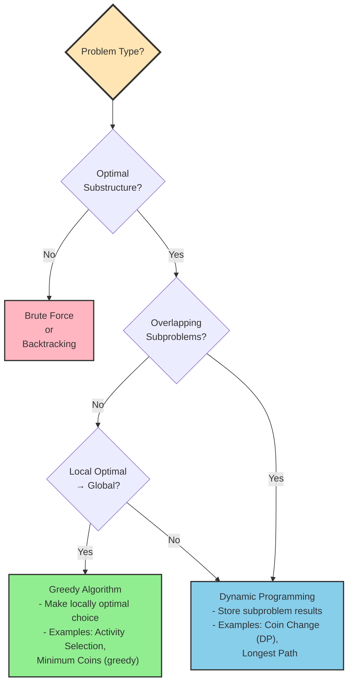

# Chapter 12: Dynamic Programming

## 12.1 Problem Statement & Motivation

Many problems have **exponential** naive complexity because a straightforward recursion recomputes the same subproblems over and over: Fibonacci is O(2ⁿ), and brute-force Longest Common Subsequence, Coin Change, and Knapsack are all exponential.

Dynamic Programming (DP) optimizes such recursive solutions by storing subproblem results, transforming exponential time into polynomial time (often O(n²) or O(n³)). The trade is space for time.

Use DP when a problem has **optimal substructure** (its optimal solution is built from optimal solutions to subproblems) *and* **overlapping subproblems** (the same subproblems recur). Typical goals are optimization (min/max) or counting. If subproblems don't overlap, prefer divide & conquer; if a locally optimal choice is provably globally optimal, prefer greedy; if there is no optimal substructure, DP does not apply.

Real-world uses include sequence alignment (bioinformatics), resource allocation (knapsack variants), constrained shortest paths, text processing (edit distance, LCS), optimal game strategy, and compiler code generation.

## 12.2 Conceptual Overview

Dynamic Programming solves a complex problem by breaking it into simpler subproblems, solving each once, and reusing the results. Think of a jigsaw puzzle: subproblems are pieces, optimal substructure means each piece fits optimally with its neighbors, memoization means you never re-try a placement you've already worked out, and tabulation means you assemble the solution systematically from the bottom up.

Three principles underpin every DP solution:

1. **Optimal Substructure**: the optimal solution contains optimal solutions to its subproblems.
2. **Overlapping Subproblems**: the same subproblems are solved repeatedly in the naive recursion.
3. **Memoization/Tabulation**: store subproblem results to avoid redundant work.

| Approach | Time | Space | When to Use |
|----------|------|-------|-------------|
| Brute Force | Exponential | O(n) | Tiny inputs |
| Plain Recursion | Exponential | O(n) | Clear recursive structure, no overlap |
| Memoization | Polynomial | O(n) | Top-down |
| Tabulation | Polynomial | O(n) | Bottom-up |

## 12.3 Abstract Model & Invariants

A DP problem can be modeled as a **state space** (subproblems, each identified by a state `S`), a **transition** `f(S) → {S₁,…,Sₖ}` mapping a state to the subproblems it depends on, **base cases** (terminal states with known values), and a **memo table** `M: S → value`.

### Core Invariants

**Invariant 1 — Optimal Substructure.**
```
OPT(S) = combine(OPT(S₁), OPT(S₂), ..., OPT(Sₖ))
```
The optimal solution for `S` is composed from optimal solutions to the subproblems it depends on. For Fibonacci, `F(n) = F(n-1) + F(n-2)` with `F(0)=0, F(1)=1`.

**Invariant 2 — Overlapping Subproblems.** Any state `S` that appears multiple times in the recursion tree is computed at most once; all later accesses read `M[S]`. `F(3)` recurs many times in the tree for `F(5)`; memoization computes it once.

**Invariant 3 — Memoization Consistency.** Once `M[S]` is set it holds the correct value for `S` and never changes; if it is unset it will be computed before use.

**Invariant 4 — Base Case Correctness.** Every base case is defined, has a known value, is reachable, and terminates the recursion (no infinite loops).

### Assumptions

1. The problem decomposes into smaller subproblems.
2. Each state has a unique, unambiguous representation.
3. The state space is finite (or bounded).
4. Transitions are deterministic.
5. For optimization, the objective is well-defined.

### State and Transition

The state captures exactly the information needed to identify a subproblem. Common encodings: `(i, j)` for grid or two-string problems, `(i, remaining)` for knapsack, `(mask, last)` for TSP.

The transition graph must be **acyclic** (no infinite recursion), **well-founded** (all paths reach base cases), and **complete** (all needed subproblems are considered). This model defines correctness independent of any implementation.

## 12.4 Operations & Interface

DP is a technique, not a data structure, but its solutions support a small conceptual interface:

| Operation | Description | Precondition | Postcondition |
|-----------|-------------|--------------|---------------|
| `solve(state)` | Compute optimal value for a state | State valid and reachable | Returns optimal value |
| `memoize(state, value)` | Cache a computed result | Value is optimal for state | `memo[state] = value` |
| `lookup(state)` | Retrieve a cached result | State valid | Returns cached value or MISS |
| `initialize()` | Set up base cases | Problem well-defined | Base cases stored |
| `reconstruct(state)` | Build the actual solution, not just its value | State has been solved | Returns the solution |

Top-down (memoization) revolves around `lookup`/`memoize`; bottom-up (tabulation) revolves around `initialize` then filling the table in dependency order. Both guarantee correctness, completeness, that each subproblem is solved at most once, and termination (finite state space, acyclic dependencies).

## 12.5 Time & Space Complexity

| DP Pattern | Time | Space | Notes |
|------------|------|-------|-------|
| 1D Linear | O(n) | O(n) | O(1) if only last k values needed |
| 2D Grid | O(m×n) | O(m×n) | O(min(m,n)) with rolling array |
| Subsequence (two seqs) | O(m×n) | O(m×n) | Lengths m, n |
| Knapsack | O(n×W) | O(n×W) | n items, capacity W; O(W) optimized |
| Interval | O(n³) | O(n²) | Intervals of length n |
| State Machine | O(n×k) | O(n×k) | n positions, k states |

Memoization costs O(unique_states × cost_per_state) time and O(unique_states) plus O(depth) recursion stack. Tabulation costs O(total_states × cost_per_state) with no recursion overhead. Amortized, each unique state is O(1) after its first computation (assuming constant-time transitions).

The classic problems specialize this table:

| Problem | Naive | Memo/Tab | Space-Optimized |
|---------|-------|----------|-----------------|
| Fibonacci | O(2ⁿ) | O(n) | O(1) |
| LCS | O(2^(m+n)) | O(m×n) | O(min(m,n)) |
| 0/1 Knapsack | O(2ⁿ) | O(n×W) | O(W) |

Space optimizations trade capability for footprint: a rolling array (O(m×n) → O(n)) or variable reduction (O(n) → O(1)) removes the ability to easily reconstruct the solution path; bitmask state compression keeps O(2ⁿ) states but shrinks the per-state constant.

## 12.6 Pseudocode: Generic Patterns

The two canonical shapes below are language-neutral templates; every concrete algorithm in this chapter is an instance of one of them.

**Memoization (top-down):**
```
FUNCTION solve(state):
    IF state is base case: RETURN base_value
    IF memo[state] exists:  RETURN memo[state]
    result ← identity
    FOR EACH subproblem S that state depends on:
        result ← combine(result, solve(S))
    memo[state] ← result
    RETURN result
```

**Tabulation (bottom-up):**
```
FUNCTION solve():
    INITIALIZE dp with base cases
    FOR EACH state in dependency order:
        result ← identity
        FOR EACH subproblem S that state depends on:
            result ← combine(result, dp[S])
        dp[state] ← result
    RETURN dp[target]
```

## 12.7 Implementation (Reference Language: C++)

### 12.7.1 Fibonacci — The Classic Example

The naive recursion is the canonical illustration of overlapping subproblems:

```cpp
#include <iostream>
#include <vector>
#include <unordered_map>
using namespace std;

// Naive recursive Fibonacci - O(2^n) time
long long fibonacciNaive(int n) {
    if (n <= 1) return n;
    return fibonacciNaive(n - 1) + fibonacciNaive(n - 2);
}
```

The recursion tree for `fibonacci(5)` shows the waste:

```
                    fibonacci(5)
                   /            \
          fibonacci(4)          fibonacci(3)
         /          \           /          \
  fibonacci(3)  fibonacci(2)  fibonacci(2)  fibonacci(1)
   /      \      /      \      /      \
fib(2)  fib(1) fib(1) fib(0) fib(1) fib(0)
 /   \
fib(1) fib(0)
```

`fibonacci(3)` is computed twice, `fibonacci(2)` three times, `fibonacci(1)` five times, and this redundancy grows exponentially: `fibonacci(40)` makes ~1 trillion calls. Each call is O(1) work but there are O(2ⁿ) of them; recursion depth (and stack space) is O(n).

**Memoization (top-down)** caches each subproblem so it is computed once, collapsing O(2ⁿ) to O(n) while keeping the natural recursive shape and only computing states that are actually needed:

```cpp
// Memoized Fibonacci - O(n) time
long long fibonacciMemo(int n, unordered_map<int, long long>& memo) {
    if (n <= 1) return n;
    if (memo.find(n) != memo.end()) return memo[n];
    memo[n] = fibonacciMemo(n - 1, memo) + fibonacciMemo(n - 2, memo);
    return memo[n];
}

long long fibonacciMemo(int n) {
    unordered_map<int, long long> memo;
    return fibonacciMemo(n, memo);
}
```

**Tabulation (bottom-up)** builds the answer iteratively from the base cases, avoiding recursion (and stack-overflow risk) entirely and giving a predictable, cache-friendly access pattern:

```cpp
// Tabulated Fibonacci - O(n) time, O(n) space
long long fibonacciTab(int n) {
    if (n <= 1) return n;
    vector<long long> dp(n + 1);
    dp[0] = 0;
    dp[1] = 1;
    for (int i = 2; i <= n; i++) dp[i] = dp[i - 1] + dp[i - 2];
    return dp[n];
}

// Space-optimized - O(n) time, O(1) space
long long fibonacciOptimized(int n) {
    if (n <= 1) return n;
    long long prev2 = 0, prev1 = 1, current = 0;
    for (int i = 2; i <= n; i++) {
        current = prev1 + prev2;
        prev2 = prev1;
        prev1 = current;
    }
    return current;
}
```

Memoization and tabulation are the two faces of DP: top-down recurses from the problem toward base cases and is easiest to derive from a recursive solution; bottom-up iterates from base cases toward the problem, computes every state, and is easier to space-optimize and typically faster due to better cache behavior (see §12.10).

## 12.8 Correctness Argument

The implementations preserve the invariants of §12.3.

**Optimal substructure.** In memoization each recursive call solves its subproblem optimally before the `combine` step (`max`, `min`, `+`) merges them; base cases are optimal by definition. In tabulation, states are filled in dependency order, so every state is computed from already-optimal predecessors. For Fibonacci, `F(n)=F(n-1)+F(n-2)` is optimal whenever its two predecessors are.

**Overlapping subproblems.** The `if memo[state] exists` guard (top-down) and the ordered single pass (bottom-up) both ensure each state is computed exactly once. For LCS, `(i,j)` is reachable from `(i-1,j)` and `(i,j-1)`; either strategy computes it once.

**Consistency.** A state is written after it is computed and never mutated afterward, so lookups are stable.

**Termination.** The state space is finite (Fibonacci: `n+1` states; LCS: `(m+1)(n+1)`; Knapsack: `(n+1)(W+1)`) and dependencies are acyclic — each state depends only on strictly "smaller" states — so progress toward base cases is guaranteed.

Edge/base cases anchor the recurrence: Fibonacci returns `n` for `n≤1`; LCS returns 0 when either index is 0; Coin Change treats `amount=0` as 0 coins and `amount<0` as impossible; Knapsack returns 0 when out of items or capacity. In 2D problems the first row and column are initialized explicitly to avoid negative-index access.

## 12.9 Edge Cases & Failure Modes

**Empty and tiny inputs.** Guard array/string DP before indexing:

```cpp
// House Robber
if (nums.empty()) return 0;
if (nums.size() == 1) return nums[0];
// LCS
if (text1.empty() || text2.empty()) return 0;
```
Accessing `nums[1]` when `size()==1`, or `text1[0]` on an empty string, is undefined behavior.

**Zero and negative values.** For Coin Change, `amount==0` is the base case (0 coins) and `amount<0` means impossible; forgetting the negative check can cause infinite recursion. Knapsack assumes non-negative weights — a negative weight makes `dp[capacity - weight]` index past `capacity` and corrupt results, so validate inputs.

**Integer overflow.** DP accumulates values (large Fibonacci numbers, combinatorial path counts, big knapsack sums). Use `long long`, and check against limits when results may exceed the type's range.

**Memory.** Deep recursion in memoization can overflow the call stack (typically 1–8 MB); prefer tabulation for large `n`. Conversely, large 2D tables (e.g. `dp[10000][10000]`) can exhaust the heap; use rolling arrays or memoize only the reachable subset.

**Invalid transitions.** Bounds-check before reading predecessors:

```cpp
if (i > 0) result = max(result, dp[i-1][j] + value);
```

The recurring failure patterns are off-by-one indexing (`dp[n]` vs `dp[n-1]`), missing base-case initialization, uninitialized first row/column in 2D DP, and negative-index access.

## 12.10 Performance & System Considerations

DP performance on real hardware is dominated by memory behavior, not by the abstract operation count.

**Cache locality — tabulation vs memoization.** Tabulation walks the table sequentially (`dp[i][j]` in row-major order), which the prefetcher loves; memoization jumps around the recursion tree and, with a hash-map memo, incurs unpredictable cache misses. In practice tabulation is often 2–3× faster than memoization on large problems: a cache miss costs ~100–300 cycles, and sequential access is roughly 10× faster than random access. When memoizing, prefer a flat array over a hash map, and store 2D tables row-major to match row-wise iteration.

Shrinking the footprint helps twice over: a rolling array (O(m×n) → O(n)) not only saves memory but keeps the working set in cache, raising the hit rate.

**Stack vs heap.** Recursion uses the (small, ~1–8 MB) call stack and risks overflow at depth; iteration puts the table on the heap (bounded by system memory) with no overflow risk. Pre-allocate the table once rather than growing it repeatedly.

**Branch prediction.** The `if (s1[i-1]==s2[j-1])` test in tight LCS/edit-distance loops is a branch: well-predicted it costs ~1 cycle, mispredicted ~10–20. Where the domain is small, branchless code or lookup tables can help; otherwise order conditions to favor the common case.

**Concurrency.** Tabulation can sometimes be parallelized across rows when dependencies allow (e.g. an `#pragma omp parallel for` over the outer loop of a computation whose cells depend only on earlier rows), but you must respect the dependency structure. Memoization is hard to parallelize: a shared memo table needs synchronization, and lock contention can dominate.

**NUMA (advanced).** On NUMA systems, local memory access is ~100 ns versus ~200–300 ns remote. Allocate a DP table on the node that will process it (e.g. via first-touch or `numa_alloc_local()`).

**Out-of-core (advanced).** Tables too large for RAM force chunked/on-disk or distributed processing; disk I/O is ~1000× slower than memory, so this changes the algorithm's design, not just its constants.

Practical guidance: prefer tabulation for large problems, keep memory layout row-major, pre-allocate, apply space optimization, choose `int` vs `long long` deliberately, and profile before optimizing.

## 12.11 Variants & Extensions

**Memoization vs tabulation.** Choose memoization for a natural recursive structure or when only a subset of states is reachable; choose tabulation when all states are needed anyway, when you want cache locality or space optimization, or to avoid stack overflow.

**Space optimizations.** A *rolling array* reduces 2D DP to O(n) when the current row depends only on the previous one (Unique Paths, Edit Distance), at the cost of easy path reconstruction. *Variable reduction* takes 1D DP to O(1) by keeping only the needed previous values (Fibonacci, Climbing Stairs). *State compression* encodes sets as bitmasks (TSP, subset DP), bounded by ~32–64 bits.

**Problem variants.** 0/1 Knapsack uses each item at most once; unbounded knapsack allows unlimited copies; fractional knapsack is solved greedily, not by DP. Problems may ask for an optimal value, a *count* of ways, or a *reconstructed* solution. Dimensionality ranges from 1D (Fibonacci) to 2D (LCS, grids) to multi-dimensional (3D knapsack, TSP).

**Advanced patterns.** *Interval DP* processes ranges `[i,j]` by increasing length (Matrix Chain, Burst Balloons). *State-machine DP* tracks distinct states and transitions (Buy/Sell Stock). *Digit DP* processes numbers digit by digit to count values with a property.

## 12.12 Real-World Implementations

DP is problem-specific, so standard libraries rarely ship a generic DP, but the technique underlies many production algorithms.

**String and sequence algorithms.** Edit distance (Levenshtein) and LCS power `difflib`/`Levenshtein` in Python and Apache Commons `StringUtils` in Java (C++ typically rolls its own). Bioinformatics sequence alignment — Needleman–Wunsch (global) and Smith–Waterman (local), both in Biopython's `Bio.pairwise2` — is 2D DP over a scoring matrix.

**Compilers.** Common-subexpression elimination is DP-style caching of repeated computations; some functional languages memoize pure functions automatically. Instruction scheduling and register allocation use DP-based optimization over dependency structures.

**Databases.** Join-order optimization in PostgreSQL and MySQL is DP over subsets of tables (state = set of tables joined so far), minimizing intermediate result size. Query-plan caching is memoization of plans keyed by normalized query structure.

**Game AI and RL.** Chess/Go engines memoize board positions in transposition tables (Stockfish, AlphaZero). Reinforcement-learning value iteration is tabulation over states via the Bellman equation.

**Text processing.** Unix `diff` and Git use LCS-based diffing; spell checkers rank candidates by edit distance, often combined with a trie.

Real systems weigh space against time (often choosing space-optimized DP to fit memory), sometimes accept approximate DP for very large inputs, and must decide cache-eviction policy and how to update a table when input changes incrementally.

## 12.13 Common Pitfalls & Interview Traps

**"DP is just memoization."** DP requires *optimal substructure*, not merely overlapping subproblems; tabulation is equally DP. Tree traversal has no overlap and is plain recursion, not DP.

**"All optimization problems are DP."** Greedy solves Activity Selection; divide & conquer solves Merge Sort. DP is needed only when both optimal substructure and overlapping subproblems are present (e.g. general Coin Change).

**"Memoization always speeds things up."** It adds lookup overhead; without real overlap it only slows the code, and tabulation may win on cache locality regardless.

**Recurring bugs.** Assuming non-negative input (a Coin Change missing `if (amount<0) return -1`); off-by-one loop bounds and out-of-range predecessor access; and forgetting to initialize base cases:

```cpp
vector<int> dp(n + 1);
// BUG: dp[0], dp[1] left uninitialized before the loop reads them
for (int i = 2; i <= n; i++) dp[i] = dp[i-1] + dp[i-2];
```

**Interview gotchas.** *"Optimize the space?"* — acknowledge the rolling-array/variable reductions and their trade-off (losing easy reconstruction). *"Time complexity?"* — for 2D DP it is O(m×n), not O(n²); count unique states × work per state, including data-structure costs. *"Reconstruct the solution?"* — store parent pointers or backtrack through the table rather than returning only the value. *"Reuse items unlimited times?"* — that switches 0/1 knapsack (`dp[i-1][w-wt]`) to unbounded (`dp[w-wt]`, same row).

To debug: print the table, verify base cases, hand-trace a small example, confirm the recurrence matches the problem, and test empty/single-element/all-equal inputs.

## 12.15 Classic DP Problems

### 1. Climbing Stairs

You can climb 1 or 2 steps at a time; count the ways to climb `n` steps. The recurrence is `dp[i] = dp[i-1] + dp[i-2]` (Fibonacci-shaped), so O(1) space suffices:

```cpp
int climbStairsOptimized(int n) {
    if (n <= 2) return n;
    int prev2 = 1;  // ways to reach step 1
    int prev1 = 2;  // ways to reach step 2
    int current = 0;
    for (int i = 3; i <= n; i++) {
        current = prev1 + prev2;
        prev2 = prev1;
        prev1 = current;
    }
    return current;
}
```

### 2. House Robber

Maximize the loot without robbing two adjacent houses: at each house, either skip it (`dp[i-1]`) or rob it (`dp[i-2] + nums[i]`).

```cpp
// Tabulation
int rob(vector<int>& nums) {
    if (nums.empty()) return 0;
    if (nums.size() == 1) return nums[0];
    vector<int> dp(nums.size());
    dp[0] = nums[0];
    dp[1] = max(nums[0], nums[1]);
    for (int i = 2; i < nums.size(); i++)
        dp[i] = max(dp[i - 1], dp[i - 2] + nums[i]);
    return dp[nums.size() - 1];
}

// Space-optimized O(1)
int robOptimized(vector<int>& nums) {
    if (nums.empty()) return 0;
    int prev2 = 0, prev1 = nums[0];
    for (int i = 1; i < nums.size(); i++) {
        int current = max(prev1, prev2 + nums[i]);
        prev2 = prev1;
        prev1 = current;
    }
    return prev1;
}
```

### 3. Longest Common Subsequence (LCS)

Find the length of the longest subsequence common to two strings. If the current characters match, extend the diagonal; otherwise take the better of dropping one character from either string.

```cpp
int longestCommonSubsequence(string text1, string text2) {
    int m = text1.length(), n = text2.length();
    vector<vector<int>> dp(m + 1, vector<int>(n + 1, 0));
    for (int i = 1; i <= m; i++)
        for (int j = 1; j <= n; j++)
            if (text1[i - 1] == text2[j - 1])
                dp[i][j] = 1 + dp[i - 1][j - 1];
            else
                dp[i][j] = max(dp[i - 1][j], dp[i][j - 1]);
    return dp[m][n];
}
```

To recover the actual subsequence (not just its length), keep the full table and backtrack from `(m, n)`:

```cpp
string getLCS(string text1, string text2) {
    int m = text1.length(), n = text2.length();
    vector<vector<int>> dp(m + 1, vector<int>(n + 1, 0));
    for (int i = 1; i <= m; i++)
        for (int j = 1; j <= n; j++)
            dp[i][j] = (text1[i - 1] == text2[j - 1])
                ? 1 + dp[i - 1][j - 1]
                : max(dp[i - 1][j], dp[i][j - 1]);

    string lcs = "";
    int i = m, j = n;
    while (i > 0 && j > 0) {
        if (text1[i - 1] == text2[j - 1]) { lcs = text1[i - 1] + lcs; i--; j--; }
        else if (dp[i - 1][j] > dp[i][j - 1]) i--;
        else j--;
    }
    return lcs;
}
```

### 4. Edit Distance (Levenshtein)

Minimum insert/delete/replace operations to turn `word1` into `word2`. Base cases: converting to/from the empty string costs the string's length. On a mismatch, take the cheapest of delete, insert, or replace.

```cpp
int minDistance(string word1, string word2) {
    int m = word1.length(), n = word2.length();
    vector<vector<int>> dp(m + 1, vector<int>(n + 1, 0));
    for (int i = 0; i <= m; i++) dp[i][0] = i;  // i deletions
    for (int j = 0; j <= n; j++) dp[0][j] = j;  // j insertions
    for (int i = 1; i <= m; i++)
        for (int j = 1; j <= n; j++)
            if (word1[i - 1] == word2[j - 1])
                dp[i][j] = dp[i - 1][j - 1];
            else
                dp[i][j] = 1 + min({dp[i - 1][j],      // delete
                                    dp[i][j - 1],      // insert
                                    dp[i - 1][j - 1]}); // replace
    return dp[m][n];
}
```

Since each row depends only on the previous one, a rolling array cuts space to O(min(m,n)):

```cpp
int minDistanceOptimized(string word1, string word2) {
    if (word1.length() < word2.length()) swap(word1, word2);
    int m = word1.length(), n = word2.length();
    vector<int> prev(n + 1), curr(n + 1);
    for (int j = 0; j <= n; j++) prev[j] = j;
    for (int i = 1; i <= m; i++) {
        curr[0] = i;
        for (int j = 1; j <= n; j++)
            curr[j] = (word1[i - 1] == word2[j - 1])
                ? prev[j - 1]
                : 1 + min({prev[j], curr[j - 1], prev[j - 1]});
        prev = curr;
    }
    return prev[n];
}
```

### 5. Coin Change

Fewest coins to form `amount`; `dp[i]` is the minimum for sub-amount `i`, seeded to an impossible sentinel.

```cpp
// Minimum coins
int coinChange(vector<int>& coins, int amount) {
    vector<int> dp(amount + 1, amount + 1);  // sentinel > any real answer
    dp[0] = 0;
    for (int i = 1; i <= amount; i++)
        for (int coin : coins)
            if (coin <= i)
                dp[i] = min(dp[i], dp[i - coin] + 1);
    return dp[amount] > amount ? -1 : dp[amount];
}

// Count the number of ways to make change
int coinChangeWays(vector<int>& coins, int amount) {
    vector<int> dp(amount + 1, 0);
    dp[0] = 1;
    for (int coin : coins)          // coins outer loop → combinations, not permutations
        for (int i = coin; i <= amount; i++)
            dp[i] += dp[i - coin];
    return dp[amount];
}
```

### 6. Longest Increasing Subsequence (LIS)

`dp[i]` is the LIS length ending at `i`. The O(n²) DP is straightforward; a patience-sorting variant with binary search achieves O(n log n).

```cpp
// O(n^2)
int lengthOfLIS(vector<int>& nums) {
    int n = nums.size();
    vector<int> dp(n, 1);
    for (int i = 1; i < n; i++)
        for (int j = 0; j < i; j++)
            if (nums[j] < nums[i])
                dp[i] = max(dp[i], dp[j] + 1);
    return *max_element(dp.begin(), dp.end());
}

// O(n log n): tails[k] = smallest possible tail of an increasing subsequence of length k+1
int lengthOfLISOptimized(vector<int>& nums) {
    vector<int> tails;
    for (int num : nums) {
        auto it = lower_bound(tails.begin(), tails.end(), num);
        if (it == tails.end()) tails.push_back(num);
        else *it = num;
    }
    return tails.size();
}
```

To reconstruct the subsequence, record a parent index whenever `dp[i]` is extended, then follow parents back from the best endpoint:

```cpp
vector<int> getLIS(vector<int>& nums) {
    int n = nums.size();
    vector<int> dp(n, 1), parent(n, -1);
    for (int i = 1; i < n; i++)
        for (int j = 0; j < i; j++)
            if (nums[j] < nums[i] && dp[j] + 1 > dp[i]) {
                dp[i] = dp[j] + 1;
                parent[i] = j;
            }
    int maxIndex = max_element(dp.begin(), dp.end()) - dp.begin();
    vector<int> lis;
    for (int cur = maxIndex; cur != -1; cur = parent[cur])
        lis.push_back(nums[cur]);
    reverse(lis.begin(), lis.end());
    return lis;
}
```

## 12.16 2D Dynamic Programming

### Unique Paths

Count paths from top-left to bottom-right of an `m×n` grid, moving only right or down: `dp[i][j] = dp[i-1][j] + dp[i][j-1]`. A rolling row gives O(n) space:

```cpp
int uniquePathsOptimized(int m, int n) {
    vector<int> prev(n, 1);
    for (int i = 1; i < m; i++)
        for (int j = 1; j < n; j++)
            prev[j] += prev[j - 1];   // prev[j] (above) + prev[j-1] (left, already updated)
    return prev[n - 1];
}
```

With obstacles, a blocked cell contributes zero paths:

```cpp
int uniquePathsWithObstacles(vector<vector<int>>& obstacleGrid) {
    int m = obstacleGrid.size(), n = obstacleGrid[0].size();
    vector<vector<int>> dp(m, vector<int>(n, 0));
    dp[0][0] = obstacleGrid[0][0] == 0 ? 1 : 0;
    for (int i = 1; i < m; i++)
        dp[i][0] = (obstacleGrid[i][0] == 0 && dp[i - 1][0] == 1) ? 1 : 0;
    for (int j = 1; j < n; j++)
        dp[0][j] = (obstacleGrid[0][j] == 0 && dp[0][j - 1] == 1) ? 1 : 0;
    for (int i = 1; i < m; i++)
        for (int j = 1; j < n; j++)
            if (obstacleGrid[i][j] == 0)
                dp[i][j] = dp[i - 1][j] + dp[i][j - 1];
    return dp[m - 1][n - 1];
}
```

### Minimum Path Sum in a Triangle

Find the minimum root-to-bottom path sum, filling from the bottom row up. The rolling-array version reuses the last row in place:

```cpp
int minimumTotalOptimized(vector<vector<int>>& triangle) {
    int n = triangle.size();
    vector<int> dp(triangle[n - 1]);           // start from the bottom row
    for (int i = n - 2; i >= 0; i--)
        for (int j = 0; j <= i; j++)
            dp[j] = triangle[i][j] + min(dp[j], dp[j + 1]);
    return dp[0];
}
```

## 12.17 Backtracking with Memoization

Backtracking explores solutions incrementally and abandons partial ones that cannot lead to a valid completion. When the same *state* (as opposed to the same path) recurs, memoization turns exponential search into polynomial DP. The key is choosing a state key that captures everything relevant to the remaining decisions — and only that, so distinct paths reaching the same state share a cached result.

Subset Sum is a clean example: the state is `(index, target)`, and both the "include" and "exclude" branches recurse into strictly smaller states.

```cpp
class SubsetSumSolver {
    vector<int> numbers;
    unordered_map<string, bool> memo;   // key = "index,target"

    bool canMakeSumMemo(int index, int target) {
        if (target == 0) return true;
        if (index >= (int)numbers.size() || target < 0) return false;

        string key = to_string(index) + "," + to_string(target);
        auto it = memo.find(key);
        if (it != memo.end()) return it->second;

        bool result = canMakeSumMemo(index + 1, target - numbers[index]) // include
                   || canMakeSumMemo(index + 1, target);                 // exclude
        memo[key] = result;
        return result;
    }
public:
    SubsetSumSolver(const vector<int>& nums) : numbers(nums) {}
    bool canMakeSum(int target) { return canMakeSumMemo(0, target); }
};
```

The same shape extends to multiple constraints — a 3D knapsack keys its memo on `(index, remainingWeight, remainingVolume)`:

```cpp
class Knapsack3D {
    unordered_map<string, int> memo;
    string key(int i, int w, int v) {
        return to_string(i) + "," + to_string(w) + "," + to_string(v);
    }
    int solve(int index, int w, int v, const vector<int>& wt,
              const vector<int>& val, const vector<int>& vol) {
        if (index >= (int)wt.size() || w < 0 || v < 0) return 0;
        string k = key(index, w, v);
        auto it = memo.find(k);
        if (it != memo.end()) return it->second;

        int notTake = solve(index + 1, w, v, wt, val, vol);
        int take = 0;
        if (wt[index] <= w && vol[index] <= v)
            take = val[index] + solve(index + 1, w - wt[index], v - vol[index], wt, val, vol);

        return memo[k] = max(notTake, take);
    }
public:
    int knapsack(vector<int>& wt, vector<int>& val, vector<int>& vol, int maxW, int maxV) {
        return solve(0, maxW, maxV, wt, val, vol);
    }
};
```

The lesson is state design, not the backtracking mechanics: a good key collapses the search space; a key that encodes an entire path (e.g. a full board layout) never repeats and so memoizes nothing.

## 12.18 Ten Must-Know DP Patterns

Most DP interview problems are variations on a handful of patterns. Recognizing the pattern gives you the recurrence, and the recurrence gives you the code. Each pattern below lists its signature, its recurrence, and a representative implementation.

### Pattern 1: 1D DP (Linear)

The answer at position `i` depends on a constant number of earlier positions. Signal words: "ways to reach", "max/min up to `i`". Time O(n), space O(n) or O(1). Climbing Stairs (`dp[i]=dp[i-1]+dp[i-2]`) and House Robber (`dp[i]=max(dp[i-1], dp[i-2]+nums[i])`) — both shown in §12.15 — are the canonical examples.

### Pattern 2: 2D Grid DP

State `dp[i][j]` depends on adjacent cells, usually top and left. Signal words: "grid", "matrix", "path". Time O(m×n), space O(m×n) or O(min(m,n)).

```cpp
// LeetCode 64: Minimum Path Sum
int minPathSum(vector<vector<int>>& grid) {
    int m = grid.size(), n = grid[0].size();
    vector<vector<int>> dp(m, vector<int>(n));
    dp[0][0] = grid[0][0];
    for (int j = 1; j < n; j++) dp[0][j] = dp[0][j - 1] + grid[0][j];
    for (int i = 1; i < m; i++) dp[i][0] = dp[i - 1][0] + grid[i][0];
    for (int i = 1; i < m; i++)
        for (int j = 1; j < n; j++)
            dp[i][j] = grid[i][j] + min(dp[i - 1][j], dp[i][j - 1]);
    return dp[m - 1][n - 1];
}
```

### Pattern 3: Knapsack (Pick or Skip)

At each item, decide take or skip — the mental model for most DP. Signal words: "subset", "partition", "can you make sum X". The 1D optimization iterates capacity **backwards** so each item is used at most once.

```cpp
// 0/1 Knapsack, O(capacity) space
int knapsackOptimized(vector<int>& weights, vector<int>& values, int capacity) {
    vector<int> dp(capacity + 1, 0);
    for (int i = 0; i < (int)weights.size(); i++)
        for (int w = capacity; w >= weights[i]; w--)   // backwards → 0/1 semantics
            dp[w] = max(dp[w], dp[w - weights[i]] + values[i]);
    return dp[capacity];
}

// LeetCode 416: Partition Equal Subset Sum (subset sum to totalSum/2)
bool canPartition(vector<int>& nums) {
    int totalSum = accumulate(nums.begin(), nums.end(), 0);
    if (totalSum % 2 != 0) return false;
    int target = totalSum / 2;
    vector<bool> dp(target + 1, false);
    dp[0] = true;
    for (int num : nums)
        for (int sum = target; sum >= num; sum--)
            dp[sum] = dp[sum] || dp[sum - num];
    return dp[target];
}
```

### Pattern 4: Longest Subsequence / Subarray

Compare the current element against earlier ones to extend a run. Signal words: "longest", "increasing", "common". One sequence → 1D (LIS, O(n²) or O(n log n)); two sequences → 2D (LCS, O(m×n)). Both are implemented in §12.15.

### Pattern 5: Interval DP

Solve small ranges and combine them into larger ones, iterating by interval **length**. Signal words: "range", "split", "parenthesize". Usually O(n³).

```cpp
// LeetCode 312: Burst Balloons — dp[i][j] over balloon k burst LAST in [i,j]
int maxCoins(vector<int>& nums) {
    int n = nums.size();
    vector<int> balloons(n + 2, 1);
    for (int i = 0; i < n; i++) balloons[i + 1] = nums[i];
    vector<vector<int>> dp(n + 2, vector<int>(n + 2, 0));
    for (int len = 1; len <= n; len++)
        for (int i = 1; i <= n - len + 1; i++) {
            int j = i + len - 1;
            for (int k = i; k <= j; k++) {
                int coins = balloons[i - 1] * balloons[k] * balloons[j + 1]
                          + dp[i][k - 1] + dp[k + 1][j];
                dp[i][j] = max(dp[i][j], coins);
            }
        }
    return dp[1][n];
}
```

Matrix Chain Multiplication shares this structure — `dp[i][j]` is the minimum scalar multiplications to multiply matrices `i..j`:

```cpp
int matrixChainOrder(vector<int>& p) {   // p.size() == numMatrices + 1
    int n = p.size() - 1;
    vector<vector<int>> dp(n, vector<int>(n, 0));
    for (int len = 2; len <= n; len++)
        for (int i = 0; i + len - 1 < n; i++) {
            int j = i + len - 1;
            dp[i][j] = INT_MAX;
            for (int k = i; k < j; k++)
                dp[i][j] = min(dp[i][j],
                               dp[i][k] + dp[k + 1][j] + p[i] * p[k + 1] * p[j + 1]);
        }
    return dp[0][n - 1];
}
```

### Pattern 6: DP on Strings

Two indices `dp[i][j]` compare two strings, deciding to match or apply an edit. Signal words: "edit", "match", "transform". Time O(m×n). Edit Distance is in §12.15; regular-expression matching is the same idea with `.`/`*` transitions:

```cpp
// LeetCode 10: Regular Expression Matching
bool isMatch(string s, string p) {
    int m = s.length(), n = p.length();
    vector<vector<bool>> dp(m + 1, vector<bool>(n + 1, false));
    dp[0][0] = true;
    for (int j = 2; j <= n; j++)                 // patterns like a*, a*b* matching ""
        if (p[j - 1] == '*') dp[0][j] = dp[0][j - 2];
    for (int i = 1; i <= m; i++)
        for (int j = 1; j <= n; j++) {
            if (p[j - 1] == '*') {
                dp[i][j] = dp[i][j - 2];         // '*' matches zero of preceding
                if (p[j - 2] == '.' || p[j - 2] == s[i - 1])
                    dp[i][j] = dp[i][j] || dp[i - 1][j];  // or one/more
            } else if (p[j - 1] == '.' || p[j - 1] == s[i - 1]) {
                dp[i][j] = dp[i - 1][j - 1];
            }
        }
    return dp[m][n];
}
```

### Pattern 7: DP on Trees

Post-order DFS returns DP values from children that the parent combines. Signal words: "tree", "subtree". Time O(n), space O(h). House Robber III returns `{rob, notRob}` per node:

```cpp
struct TreeNode { int val; TreeNode *left, *right; TreeNode(int x): val(x), left(nullptr), right(nullptr) {} };

pair<int,int> robHelper(TreeNode* root) {          // {rob this node, don't rob this node}
    if (!root) return {0, 0};
    auto l = robHelper(root->left);
    auto r = robHelper(root->right);
    int rob = root->val + l.second + r.second;      // rob node → children must be skipped
    int notRob = max(l.first, l.second) + max(r.first, r.second);
    return {rob, notRob};
}
int rob(TreeNode* root) {
    auto res = robHelper(root);
    return max(res.first, res.second);
}
```

### Pattern 8: DP on Graphs (DAG)

On a directed acyclic graph, process nodes in topological order and relax edges. Signal words: "DAG", "topological", "prerequisites". Time O(V+E).

```cpp
// Longest path from a source in a weighted DAG
vector<int> longestPathDAG(int n, vector<vector<pair<int,int>>>& graph, int source) {
    vector<int> inDeg(n, 0);
    for (int u = 0; u < n; u++)
        for (auto [v, w] : graph[u]) inDeg[v]++;
    queue<int> q;
    for (int i = 0; i < n; i++) if (inDeg[i] == 0) q.push(i);
    vector<int> topo;
    while (!q.empty()) {
        int u = q.front(); q.pop(); topo.push_back(u);
        for (auto [v, w] : graph[u]) if (--inDeg[v] == 0) q.push(v);
    }
    vector<int> dp(n, INT_MIN);
    dp[source] = 0;
    for (int u : topo)
        if (dp[u] != INT_MIN)
            for (auto [v, w] : graph[u])
                dp[v] = max(dp[v], dp[u] + w);
    return dp;
}
```

### Pattern 9: Bitmask DP

Encode a set of elements as the bits of an integer. Signal words: "subset", "visited", "all cities". Time typically O(2ⁿ·n), space O(2ⁿ). The Traveling Salesman Problem keys on `dp[mask][last]` = min cost to have visited `mask`, ending at `last`:

```cpp
int tsp(vector<vector<int>>& dist) {
    int n = dist.size(), maskLimit = 1 << n;
    vector<vector<int>> dp(maskLimit, vector<int>(n, INT_MAX));
    dp[1][0] = 0;                                   // start at city 0
    for (int mask = 1; mask < maskLimit; mask++)
        for (int last = 0; last < n; last++) {
            if (!(mask & (1 << last)) || dp[mask][last] == INT_MAX) continue;
            for (int next = 0; next < n; next++) {
                if (mask & (1 << next)) continue;
                int nm = mask | (1 << next);
                dp[nm][next] = min(dp[nm][next], dp[mask][last] + dist[last][next]);
            }
        }
    int result = INT_MAX, full = maskLimit - 1;
    for (int last = 1; last < n; last++)
        if (dp[full][last] != INT_MAX)
            result = min(result, dp[full][last] + dist[last][0]);
    return result;
}
```

### Pattern 10: State Machine DP

Track discrete states (holding/not holding, transactions used) and their transitions. Signal words: "buy/sell", "hold", "cooldown". The stock-with-cooldown problem cycles through hold → sold → rest:

```cpp
// LeetCode 309: Buy/Sell with Cooldown, O(1) space
int maxProfit(vector<int>& prices) {
    int hold = INT_MIN, sold = 0, rest = 0;
    for (int price : prices) {
        int prevHold = hold, prevSold = sold, prevRest = rest;
        hold = max(prevHold, prevRest - price);   // keep holding, or buy from rest
        sold = prevHold + price;                  // sell today
        rest = max(prevRest, prevSold);           // stay resting, or exit cooldown
    }
    return max(sold, rest);
}
```

At-most-k transactions generalizes this by tracking a buy/sell pair per transaction (for k=2: `buy1, sell1, buy2, sell2`).

### Pattern Recognition Guide

| Pattern | Key Indicator | State | Time | Examples |
|---------|--------------|-------|------|----------|
| 1D | "ways to reach", "max up to i" | 1D | O(n) | Climbing Stairs, House Robber |
| 2D Grid | "grid", "path" | 2D | O(m×n) | Unique Paths, Min Path Sum |
| Knapsack | "subset", "take or skip" | 2D/1D | O(n×W) | 0/1 Knapsack, Subset Sum |
| Subsequence | "longest", "common" | 1D/2D | O(n²)/O(m×n) | LIS, LCS |
| Interval | "range", "split" | 2D | O(n³) | Burst Balloons, Matrix Chain |
| String | "edit", "match" | 2D | O(m×n) | Edit Distance, Regex |
| Tree | "tree", "subtree" | return values | O(n) | House Robber III |
| DAG | "topological", "prerequisite" | 1D | O(V+E) | Longest Path |
| Bitmask | "visited", "all cities" | bitmask | O(2ⁿ·n) | TSP |
| State Machine | "buy/sell", "hold" | pos × state | O(n×k) | Stock problems |

The workflow: identify keywords → match a pattern → write the recurrence → implement with memoization or tabulation → space-optimize if asked.

## 12.19 DP vs Recursion vs Greedy



Plain recursion solves subproblems independently and may recompute them; DP stores results. Greedy commits to a locally optimal choice and never reconsiders; DP explores all possibilities to guarantee a global optimum. Coin Change captures the distinction: greedy works for some coin systems (e.g. US denominations) but fails for others, whereas DP is always optimal.

| Approach | When | Time | Space | Examples |
|----------|------|------|-------|----------|
| Recursion | Recursive structure, no overlap | Exponential | O(n) stack | Tree traversal |
| Memoization | Overlap, top-down | Polynomial | O(n)+O(n) memo | Fibonacci, LCS |
| Tabulation | Overlap, bottom-up | Polynomial | O(n)–O(n²) | Fibonacci, LCS |
| Greedy | Local → global optimal | Polynomial | O(1)–O(n) | Activity Selection, Dijkstra |
| DP | Overlap + optimal substructure | Polynomial | O(n)–O(n²) | Coin Change, LIS, Knapsack |

## 12.20 Space Optimization Techniques

**Rolling array.** When the current row depends only on the previous one, collapse a 2D table to one (or two) rows — Unique Paths and Edit Distance in §12.15–12.16 both use this to reach O(n) space.

**Variable reduction.** When only the last few values matter, drop the array entirely. Fibonacci and Climbing Stairs keep just two scalars for O(1) space.

**State compression.** Encode sets as bitmask integers so an exponential set of states fits in an array indexed by the mask — see the TSP implementation in Pattern 9 (§12.18), which keys `dp[mask][last]`.

**Interval reuse.** In interval DP, process by increasing length so only the current length's results are live at once.

## 12.21 Additional Classic DP Problems

### Longest Palindromic Subsequence

`dp[i][j]` is the longest palindromic subsequence of `s[i..j]`. Fill by increasing length; matching ends add 2 to the inner range. The rolling-array form uses O(n) space:

```cpp
int longestPalindromeSubseqOptimized(string s) {
    int n = s.length();
    vector<int> prev(n, 0), curr(n, 0);
    for (int i = n - 1; i >= 0; i--) {
        curr[i] = 1;                                // single character
        for (int j = i + 1; j < n; j++)
            curr[j] = (s[i] == s[j]) ? 2 + prev[j - 1]
                                     : max(prev[j], curr[j - 1]);
        prev = curr;
    }
    return curr[n - 1];
}
```

### Word Break

Can `s` be segmented into dictionary words? `dp[i]` is true if `s[0..i-1]` is segmentable. Iterating over word lengths keeps the inner loop bounded by the dictionary rather than the string:

```cpp
bool wordBreak(string s, vector<string>& wordDict) {
    int n = s.length();
    unordered_set<string> words(wordDict.begin(), wordDict.end());
    vector<bool> dp(n + 1, false);
    dp[0] = true;
    for (int i = 1; i <= n; i++)
        for (int j = 0; j < i; j++)
            if (dp[j] && words.count(s.substr(j, i - j))) { dp[i] = true; break; }
    return dp[n];
}
```

## 12.22 Knapsack Variants

The 0/1 knapsack (§12.18, Pattern 3) has two important siblings. **Unbounded knapsack** allows unlimited copies of each item; the capacity loop runs **forward**, so an item's own updated value can be reused:

```cpp
int unboundedKnapsack(vector<int>& weights, vector<int>& values, int capacity) {
    vector<int> dp(capacity + 1, 0);
    for (int w = 1; w <= capacity; w++)
        for (int i = 0; i < (int)weights.size(); i++)
            if (weights[i] <= w)
                dp[w] = max(dp[w], dp[w - weights[i]] + values[i]);
    return dp[capacity];
}
```

**Subset Sum** — is there a subset summing to `target`? — is the boolean specialization of 0/1 knapsack (the `canPartition` in Pattern 3 is exactly this with `target = totalSum/2`):

```cpp
bool subsetSum(vector<int>& nums, int target) {
    vector<bool> dp(target + 1, false);
    dp[0] = true;
    for (int num : nums)
        for (int j = target; j >= num; j--)   // backwards → each item once
            dp[j] = dp[j] || dp[j - num];
    return dp[target];
}
```

The forward-vs-backward capacity loop is the single line that separates unbounded from 0/1 semantics.

## 12.23 Key Takeaways

1. DP breaks a problem into subproblems, solves each once, and reuses the results, turning exponential recursion into polynomial time.
2. Memoization (top-down) caches recursive results; tabulation (bottom-up) fills a table in dependency order.
3. DP applies exactly when a problem has both **optimal substructure** and **overlapping subproblems**.
4. Space optimization — rolling arrays, variable reduction, bitmasks — often cuts memory by an order of magnitude, and a smaller footprint improves cache behavior (§12.10).
5. Most problems reduce to one of ten patterns; recognizing the pattern yields the recurrence.

## 12.24 Practice Problems

Grouped by the pattern they exercise; implement each with both memoization and tabulation, then space-optimize.

- **1D / linear:** Maximum Subarray (Kadane), Decode Ways, Jump Game II.
- **Knapsack family:** Target Sum, Coin Change II (count ways), Partition to K Equal Sum Subsets.
- **Subsequence / string:** Longest Palindromic Subsequence, Distinct Subsequences, Interleaving String.
- **Grid / interval:** Dungeon Game, Palindrome Partitioning II, Matrix Chain Multiplication.
- **State machine / bitmask:** Best Time to Buy/Sell Stock IV, Traveling Salesman, Shortest Path Visiting All Nodes.

For each, first identify the pattern (§12.18), then write the recurrence before any code.

## 12.25 Summary

Dynamic Programming transforms exponential-time recursive solutions into polynomial-time algorithms by identifying overlapping subproblems and storing their solutions. Mastery comes from recognizing the underlying patterns rather than memorizing individual solutions: start from Fibonacci, internalize the memoization/tabulation duality, and work up through the 2D, knapsack, interval, string, tree, graph, bitmask, and state-machine patterns. On real hardware, the decisive factors are cache locality and memory footprint — which is why bottom-up tabulation with space optimization usually outperforms an equivalent top-down memoization despite identical asymptotic complexity.
