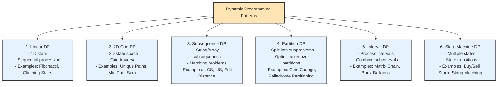
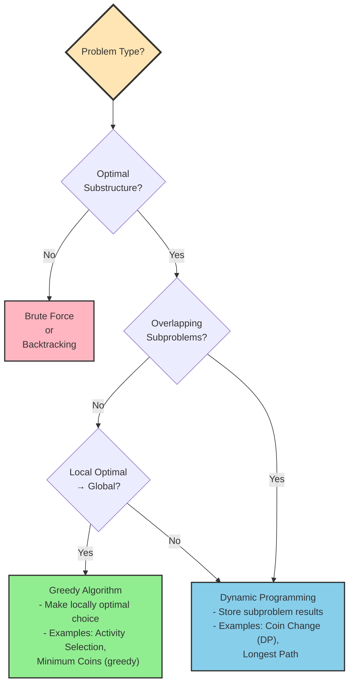

# Chapter 12: Dynamic Programming

## 12.1 Problem Statement & Motivation

### What Problem Does Dynamic Programming Solve?

Many problems have **exponential time complexity** when solved naively:

- **Fibonacci Sequence**: Naive recursion is O(2^n)
- **Longest Common Subsequence**: Brute force is exponential
- **Coin Change**: Trying all combinations is exponential
- **Knapsack Problem**: Checking all subsets is exponential

**Naive Approaches and Their Limitations**:

- **Brute Force**: Try all possibilities → exponential time
- **Recursion**: Natural but recalculates same subproblems → exponential time
- **Greedy**: Fast but doesn't always work → incorrect results

**The Dynamic Programming Solution**: DP optimizes recursive solutions by storing results of subproblems, transforming exponential time to polynomial time (often O(n²) or O(n³)).

### When to Use Dynamic Programming

✅ **Use DP when**:
- Problem has optimal substructure (optimal solution contains optimal subproblem solutions)
- Problem has overlapping subproblems (same subproblems solved multiple times)
- Need to optimize (minimize/maximize) or count possibilities
- Brute force would be exponential

✅ **Real-world applications**:
- Sequence alignment (bioinformatics)
- Resource allocation (knapsack variants)
- Path finding (shortest paths with constraints)
- Text processing (edit distance, longest common subsequence)
- Game theory (optimal strategies)
- Compiler optimization (code generation)

### When NOT to Use Dynamic Programming

❌ **Avoid DP when**:
- No overlapping subproblems (use divide & conquer)
- Greedy algorithm works (simpler and faster)
- Problem doesn't have optimal substructure
- Space constraints are severe (DP often uses O(n) or O(n²) space)

**Key Trade-off**: DP trades space for time, storing subproblem results to avoid recalculation.

## 12.2 Conceptual Overview

**Dynamic Programming (DP)** is a powerful algorithmic technique for solving complex problems by breaking them down into simpler subproblems. It's particularly effective for optimization problems where we need to find the best solution among many possible solutions.

### Intuitive Explanation

Think of DP like solving a jigsaw puzzle:
- **Subproblems**: Individual puzzle pieces
- **Optimal Substructure**: Each piece fits optimally with adjacent pieces
- **Memoization**: Remember where each piece goes (don't try same placement twice)
- **Tabulation**: Build solution systematically from bottom up

### Key Principles of Dynamic Programming

1. **Optimal Substructure**: The optimal solution to a problem contains optimal solutions to its subproblems
2. **Overlapping Subproblems**: The same subproblems are solved multiple times in a recursive approach
3. **Memoization/Tabulation**: Store results of subproblems to avoid redundant calculations

### DP vs. Other Approaches

| Approach | Time Complexity | Space Complexity | When to Use |
|----------|----------------|------------------|-------------|
| Brute Force | Exponential | O(n) | Small input sizes |
| Recursion | Exponential | O(n) | Clear recursive structure |
| Memoization | Reduced | O(n) | Top-down approach |
| Tabulation | Reduced | O(n) | Bottom-up approach |

## 12.3 Abstract Model & Invariants ⭐ (Mandatory)

**Purpose**: Define correctness independent of implementation.

### Abstract Representation

Dynamic Programming problems can be abstracted as:

1. **State Space**: A set of subproblems, each identified by a state `S`
2. **State Transition**: A function `f(S) → S'` that defines how to compute a state from previous states
3. **Base Cases**: Terminal states with known solutions
4. **Memoization Table**: A mapping `M: S → value` that stores computed results

### Core Invariants

For any DP solution to be correct, the following invariants must hold:

#### Invariant 1: Optimal Substructure
```
For any state S, if OPT(S) is the optimal solution for S, then:
OPT(S) = combine(OPT(S₁), OPT(S₂), ..., OPT(Sₖ))
where S₁, S₂, ..., Sₖ are the subproblems that S depends on.
```

**Meaning**: The optimal solution to a problem contains optimal solutions to its subproblems.

**Example (Fibonacci)**:
- State: `F(n)` represents Fibonacci number at position n
- Invariant: `F(n) = F(n-1) + F(n-2)` where `F(0) = 0` and `F(1) = 1`
- The optimal solution for `F(n)` depends on optimal solutions for `F(n-1)` and `F(n-2)`

#### Invariant 2: Overlapping Subproblems
```
For any state S that appears multiple times in the recursion tree:
M[S] is computed at most once, and all subsequent accesses retrieve M[S].
```

**Meaning**: The same subproblems are solved multiple times, and memoization ensures each is solved only once.

**Example (Fibonacci)**:
- `F(3)` appears multiple times in the recursion tree for `F(5)`
- Memoization ensures `F(3)` is computed once and reused

#### Invariant 3: Memoization Consistency
```
For any state S:
- If M[S] exists, it contains the correct optimal value for S
- If M[S] doesn't exist, it will be computed before use
- Once computed, M[S] remains valid for the duration of the algorithm
```

**Meaning**: The memoization table always contains correct, up-to-date values.

#### Invariant 4: Base Case Correctness
```
For all base cases B:
- B is defined and has a known optimal value
- B is reachable from any valid initial state
- B terminates the recursion (no infinite loops)
```

**Meaning**: Base cases are well-defined and provide termination conditions.

### Assumptions

1. **Problem Decomposition**: The problem can be decomposed into smaller subproblems
2. **State Uniqueness**: Each state has a unique representation (no ambiguity)
3. **Finite State Space**: The number of distinct states is finite (or bounded)
4. **Deterministic Transitions**: State transitions are deterministic (same input → same output)
5. **Monotonicity** (for optimization): The objective function is well-defined and can be optimized

### State Representation

The abstract state for a DP problem typically includes:

- **Problem Parameters**: Input size, constraints, indices
- **Subproblem Identifier**: Which subproblem is being solved
- **Context**: Any additional information needed to solve the subproblem

**Example States**:
- `(i, j)` for 2D grid problems (position in grid)
- `(i, remaining)` for knapsack problems (item index, remaining capacity)
- `(i, j)` for string problems (indices in two strings)
- `(mask, last)` for TSP (visited cities mask, last city)

### Transition Function

The abstract transition function defines how states relate:

```
f: State → Set of States
f(S) = {S₁, S₂, ..., Sₖ} where each Sᵢ is a subproblem that S depends on
```

**Properties**:
- **Acyclic**: No cycles in the dependency graph (prevents infinite recursion)
- **Well-founded**: All paths eventually reach base cases
- **Complete**: All necessary subproblems are considered

This abstract model provides the intellectual backbone for understanding DP correctness, independent of any specific implementation language or data structure.

## 12.4 Operations & Interface

**Purpose**: Define what operations are supported in DP solutions.

While Dynamic Programming is a technique rather than a data structure, DP solutions support the following conceptual operations:

| Operation | Description | Precondition | Postcondition |
|-----------|-------------|--------------|---------------|
| `solve(state)` | Compute optimal solution for a given state | State is valid and reachable | Returns optimal value for state |
| `memoize(state, value)` | Store computed result for a state | State is valid, value is optimal | State is cached in memoization table |
| `lookup(state)` | Retrieve cached result for a state | State may or may not be in cache | Returns cached value if exists, else indicates miss |
| `initialize()` | Set up base cases and initial state | Problem is well-defined | Base cases are stored, initial state is ready |
| `reconstruct(state)` | Build actual solution from state values | State has been solved | Returns the actual solution (not just value) |

### Memoization Interface

For memoization-based DP (top-down):

```
MEMOIZE(state, value):
  Precondition: state is valid, value is optimal for state
  Postcondition: memo[state] = value
  
LOOKUP(state):
  Precondition: state is valid
  Postcondition: returns memo[state] if exists, else returns MISS
```

### Tabulation Interface

For tabulation-based DP (bottom-up):

```
INITIALIZE():
  Precondition: problem is well-defined
  Postcondition: dp[base_cases] are set, dp table is ready
  
FILL_TABLE():
  Precondition: base cases are initialized
  Postcondition: dp[target_state] contains optimal solution
```

### Behavioral Guarantees

1. **Correctness**: The solution returned is optimal (or correct for counting problems)
2. **Completeness**: All necessary subproblems are considered
3. **Efficiency**: Each subproblem is solved at most once (memoization) or exactly once (tabulation)
4. **Termination**: The algorithm always terminates (finite state space, acyclic dependencies)

## 12.5 Time & Space Complexity

**Purpose**: Make trade-offs explicit.

### General Complexity Analysis

| DP Pattern | Time Complexity | Space Complexity | Notes |
|------------|----------------|------------------|-------|
| **1D Linear DP** | O(n) | O(n) | Can optimize to O(1) if only need last k values |
| **2D Grid DP** | O(m×n) | O(m×n) | Can optimize to O(min(m,n)) with rolling array |
| **Subsequence DP** | O(m×n) | O(m×n) | For two sequences of length m and n |
| **Knapsack DP** | O(n×W) | O(n×W) | n items, W capacity; can optimize to O(W) |
| **Interval DP** | O(n³) | O(n²) | For intervals of length n |
| **State Machine DP** | O(n×k) | O(n×k) | n positions, k states |
| **Memoization (Top-Down)** | O(unique_states × cost_per_state) | O(unique_states) + O(depth) | Includes recursion stack |
| **Tabulation (Bottom-Up)** | O(total_states × cost_per_state) | O(total_states) | No recursion overhead |

### Detailed Analysis by Problem Type

#### Fibonacci Sequence

| Approach | Time | Space | Amortized |
|----------|------|-------|-----------|
| Naive Recursion | O(2ⁿ) | O(n) | N/A |
| Memoization | O(n) | O(n) + O(n) stack | O(1) per call after first |
| Tabulation | O(n) | O(n) | O(1) per iteration |
| Space-Optimized | O(n) | O(1) | O(1) per iteration |

#### Longest Common Subsequence (LCS)

| Approach | Time | Space | Notes |
|----------|------|-------|-------|
| Naive Recursion | O(2^(m+n)) | O(m+n) | Exponential |
| Memoization | O(m×n) | O(m×n) | Each state computed once |
| Tabulation | O(m×n) | O(m×n) | All states computed |
| Space-Optimized | O(m×n) | O(min(m,n)) | Only need previous row |

#### 0/1 Knapsack

| Approach | Time | Space | Notes |
|----------|------|-------|-------|
| Naive Recursion | O(2ⁿ) | O(n) | Try all subsets |
| Memoization | O(n×W) | O(n×W) | n items, W capacity |
| Tabulation | O(n×W) | O(n×W) | All states computed |
| Space-Optimized | O(n×W) | O(W) | Only need previous row |

### Space Optimization Trade-offs

| Optimization | Space Reduction | Trade-off |
|--------------|----------------|-----------|
| Rolling Array | O(m×n) → O(n) | Cannot reconstruct path easily |
| Variable Optimization | O(n) → O(1) | Lose access to all intermediate values |
| State Compression | O(2ⁿ) → O(2ⁿ) with better constants | More complex state encoding |

### Amortized Analysis

For memoization:
- **First call**: O(cost to compute state)
- **Subsequent calls**: O(1) lookup
- **Amortized**: O(1) per unique state

For tabulation:
- **Each state**: O(1) computation (assuming constant-time transitions)
- **Total**: O(number of states)

## 12.6 Pseudocode (Language-Neutral) ⭐ (Mandatory)

**Purpose**: Bridge theory → implementation.

**Rules**: No language syntax, no pointers/templates, focus on logic only.

### Generic DP Memoization Pattern

```
FUNCTION solve_with_memoization(state):
    IF state is base case:
        RETURN base_case_value
    
    IF memo[state] exists:
        RETURN memo[state]
    
    result ← compute from subproblems
    FOR EACH subproblem S that state depends on:
        sub_result ← solve_with_memoization(S)
        result ← combine(result, sub_result)
    
    memo[state] ← result
    RETURN result
END FUNCTION
```

### Generic DP Tabulation Pattern

```
FUNCTION solve_with_tabulation():
    INITIALIZE dp table with base cases
    
    FOR EACH state in dependency order (bottom-up):
        IF state is base case:
            CONTINUE
        
        result ← initial value
        FOR EACH subproblem S that state depends on:
            sub_result ← dp[S]
            result ← combine(result, sub_result)
        
        dp[state] ← result
    
    RETURN dp[target_state]
END FUNCTION
```

### Fibonacci - Memoization

```
FUNCTION fibonacci_memo(n, memo):
    IF n ≤ 1:
        RETURN n
    
    IF memo[n] is set:
        RETURN memo[n]
    
    result ← fibonacci_memo(n-1, memo) + fibonacci_memo(n-2, memo)
    memo[n] ← result
    RETURN result
END FUNCTION

FUNCTION fibonacci(n):
    memo ← empty map
    RETURN fibonacci_memo(n, memo)
END FUNCTION
```

### Fibonacci - Tabulation

```
FUNCTION fibonacci_tab(n):
    IF n ≤ 1:
        RETURN n
    
    dp ← array of size n+1
    dp[0] ← 0
    dp[1] ← 1
    
    FOR i FROM 2 TO n:
        dp[i] ← dp[i-1] + dp[i-2]
    
    RETURN dp[n]
END FUNCTION
```

### Longest Common Subsequence (LCS)

```
FUNCTION lcs_memo(s1, s2, i, j, memo):
    IF i = 0 OR j = 0:
        RETURN 0
    
    IF memo[i][j] is set:
        RETURN memo[i][j]
    
    IF s1[i-1] = s2[j-1]:
        result ← 1 + lcs_memo(s1, s2, i-1, j-1, memo)
    ELSE:
        result ← MAX(
            lcs_memo(s1, s2, i-1, j, memo),
            lcs_memo(s1, s2, i, j-1, memo)
        )
    
    memo[i][j] ← result
    RETURN result
END FUNCTION
```

```
FUNCTION lcs_tab(s1, s2):
    m ← length of s1
    n ← length of s2
    dp ← 2D array of size (m+1) × (n+1), initialized to 0
    
    FOR i FROM 1 TO m:
        FOR j FROM 1 TO n:
            IF s1[i-1] = s2[j-1]:
                dp[i][j] ← 1 + dp[i-1][j-1]
            ELSE:
                dp[i][j] ← MAX(dp[i-1][j], dp[i][j-1])
    
    RETURN dp[m][n]
END FUNCTION
```

### Coin Change

```
FUNCTION coin_change_memo(coins, amount, memo):
    IF amount = 0:
        RETURN 0
    
    IF amount < 0:
        RETURN infinity (impossible)
    
    IF memo[amount] is set:
        RETURN memo[amount]
    
    min_coins ← infinity
    FOR EACH coin IN coins:
        result ← coin_change_memo(coins, amount - coin, memo)
        IF result ≠ infinity:
            min_coins ← MIN(min_coins, result + 1)
    
    IF min_coins = infinity:
        memo[amount] ← -1
    ELSE:
        memo[amount] ← min_coins
    
    RETURN memo[amount]
END FUNCTION
```

```
FUNCTION coin_change_tab(coins, amount):
    dp ← array of size (amount+1), initialized to infinity
    dp[0] ← 0
    
    FOR i FROM 1 TO amount:
        FOR EACH coin IN coins:
            IF coin ≤ i:
                dp[i] ← MIN(dp[i], dp[i - coin] + 1)
    
    IF dp[amount] = infinity:
        RETURN -1
    ELSE:
        RETURN dp[amount]
END FUNCTION
```

### 0/1 Knapsack

```
FUNCTION knapsack_memo(weights, values, capacity, index, memo):
    IF index < 0 OR capacity ≤ 0:
        RETURN 0
    
    IF memo[index][capacity] is set:
        RETURN memo[index][capacity]
    
    not_take ← knapsack_memo(weights, values, capacity, index-1, memo)
    
    take ← 0
    IF weights[index] ≤ capacity:
        take ← values[index] + knapsack_memo(
            weights, values, capacity - weights[index], index-1, memo
        )
    
    result ← MAX(not_take, take)
    memo[index][capacity] ← result
    RETURN result
END FUNCTION
```

```
FUNCTION knapsack_tab(weights, values, capacity):
    n ← number of items
    dp ← 2D array of size (n+1) × (capacity+1), initialized to 0
    
    FOR i FROM 1 TO n:
        FOR w FROM 1 TO capacity:
            IF weights[i-1] ≤ w:
                dp[i][w] ← MAX(
                    dp[i-1][w],
                    dp[i-1][w - weights[i-1]] + values[i-1]
                )
            ELSE:
                dp[i][w] ← dp[i-1][w]
    
    RETURN dp[n][capacity]
END FUNCTION
```

### Unique Paths (2D Grid)

```
FUNCTION unique_paths_tab(m, n):
    dp ← 2D array of size m × n, initialized to 1
    
    FOR i FROM 1 TO m-1:
        FOR j FROM 1 TO n-1:
            dp[i][j] ← dp[i-1][j] + dp[i][j-1]
    
    RETURN dp[m-1][n-1]
END FUNCTION
```

This pseudocode should be readable by any engineer, regardless of their programming language background.

## 12.7 Implementation (Reference Language: C++) ⭐

**Note to Reader**: This section provides concrete C++ implementations. The correctness relies on the invariants defined in Section 12.3 and the pseudocode in Section 12.6.

### 12.7.1 Fibonacci Sequence - The Classic Example

### Naive Recursive Approach
```cpp
#include <iostream>
#include <vector>
#include <unordered_map>
#include <chrono>
using namespace std;

// Naive recursive Fibonacci - O(2^n) time complexity
long long fibonacciNaive(int n) {
    if (n <= 1) {
        return n;
    }
    return fibonacciNaive(n - 1) + fibonacciNaive(n - 2);
}

// Example: fibonacciNaive(40) takes several seconds
```

#### Understanding the Problem: Recursion Tree Analysis

The naive recursive approach suffers from **exponential time complexity** because it recalculates the same subproblems repeatedly. Let's visualize this with a recursion tree for `fibonacci(5)`:

```
                    fibonacci(5)
                   /            \
          fibonacci(4)          fibonacci(3)
         /          \           /          \
  fibonacci(3)  fibonacci(2)  fibonacci(2)  fibonacci(1)
   /      \      /      \      /      \
fib(2)  fib(1) fib(1) fib(0) fib(1) fib(0)
 /   \
fib(1) fib(0)
```

**Observations from the recursion tree:**

1. **Redundant Calculations**: Notice that `fibonacci(3)` is calculated **2 times**, `fibonacci(2)` is calculated **3 times**, and `fibonacci(1)` is calculated **5 times**. This redundancy grows exponentially with larger inputs.

2. **Exponential Growth**: For `fibonacci(n)`, the number of function calls is approximately O(2^n). This means:
   - `fibonacci(20)` makes ~1 million calls
   - `fibonacci(30)` makes ~1 billion calls
   - `fibonacci(40)` makes ~1 trillion calls

3. **Time Complexity**: Each function call does O(1) work, but there are exponentially many calls, resulting in O(2^n) total time complexity.

4. **Space Complexity**: The maximum depth of recursion is O(n), so space complexity is O(n) for the call stack.

**The Solution**: Memoization eliminates this redundancy by storing results of subproblems. With memoization, each subproblem (like `fibonacci(3)`) is calculated only **once**, and subsequent calls simply retrieve the cached result. This reduces time complexity from O(2^n) to O(n).

### Memoization Approach (Top-Down)

**Why Memoization?** The naive recursive approach recalculates the same subproblems multiple times. For example, when computing `fibonacci(5)`, we calculate `fibonacci(3)` multiple times. Memoization stores the results of subproblems in a cache (memo table) so that when we encounter the same subproblem again, we can simply look up the result instead of recalculating it. This transforms the exponential time complexity O(2^n) to linear O(n) time complexity.

**Key Benefits:**
- **Eliminates Redundant Calculations**: Each subproblem is solved only once
- **Top-Down Approach**: Starts from the problem and breaks it down (natural recursive thinking)
- **Lazy Evaluation**: Only computes subproblems that are actually needed
- **Easy to Implement**: Minimal changes to recursive code (just add memoization check)

```cpp
// Memoized Fibonacci - O(n) time complexity
long long fibonacciMemo(int n, unordered_map<int, long long>& memo) {
    if (n <= 1) {
        return n;
    }
    
    if (memo.find(n) != memo.end()) {
        return memo[n];
    }
    
    memo[n] = fibonacciMemo(n - 1, memo) + fibonacciMemo(n - 2, memo);
    return memo[n];
}

long long fibonacciMemo(int n) {
    unordered_map<int, long long> memo;
    return fibonacciMemo(n, memo);
}

// Alternative with vector
long long fibonacciMemoVector(int n, vector<long long>& memo) {
    if (n <= 1) {
        return n;
    }
    
    if (memo[n] != -1) {
        return memo[n];
    }
    
    memo[n] = fibonacciMemoVector(n - 1, memo) + fibonacciMemoVector(n - 2, memo);
    return memo[n];
}

long long fibonacciMemoVector(int n) {
    vector<long long> memo(n + 1, -1);
    return fibonacciMemoVector(n, memo);
}
```

### Tabulation Approach (Bottom-Up)

**Why Tabulation?** While memoization solves the redundancy problem, it still uses recursion which can lead to stack overflow for very large inputs. Tabulation (bottom-up approach) builds the solution iteratively from the base cases upward, eliminating the need for recursion entirely.

**Key Advantages of Tabulation:**

1. **No Recursion Overhead**: Iterative approach avoids function call overhead and potential stack overflow
2. **Better Space Optimization**: Can often optimize space by only keeping necessary values (e.g., only last two values for Fibonacci)
3. **Predictable Memory Access**: Iterative access patterns are more cache-friendly than recursive calls
4. **Easier to Understand**: Some find iterative bottom-up approach more intuitive
5. **No Function Call Stack**: Eliminates risk of stack overflow for deep recursions

**Comparison: Memoization vs Tabulation**

| Aspect | Memoization (Top-Down) | Tabulation (Bottom-Up) |
|--------|----------------------|----------------------|
| Approach | Recursive | Iterative |
| Direction | Problem → Base Cases | Base Cases → Problem |
| Stack Usage | Uses call stack | No call stack |
| Space | O(n) for memo + O(n) stack | O(n) for table (can optimize) |
| Computation | Only computes needed subproblems | Computes all subproblems |
| Implementation | Easier to convert from recursion | Requires understanding of dependencies |

**When to Use Tabulation:**
- When recursion depth might cause stack overflow
- When you need to optimize space further
- When all subproblems need to be computed anyway
- When iterative approach is more natural for the problem

```cpp
// Tabulated Fibonacci - O(n) time, O(n) space
long long fibonacciTab(int n) {
    if (n <= 1) {
        return n;
    }
    
    vector<long long> dp(n + 1);
    dp[0] = 0;
    dp[1] = 1;
    
    for (int i = 2; i <= n; i++) {
        dp[i] = dp[i - 1] + dp[i - 2];
    }
    
    return dp[n];
}

// Space-optimized Fibonacci - O(n) time, O(1) space
long long fibonacciOptimized(int n) {
    if (n <= 1) {
        return n;
    }
    
    long long prev2 = 0;  // F(n-2)
    long long prev1 = 1;  // F(n-1)
    long long current;    // F(n)
    
    for (int i = 2; i <= n; i++) {
        current = prev1 + prev2;
        prev2 = prev1;
        prev1 = current;
    }
    
    return current;
}
```

### Performance Comparison

To see a practical comparison of all Fibonacci approaches (Naive Recursive, Memoization, Tabulation, and Space-Optimized), run the performance comparison example:

```bash
cd examples/dynamic_programming
g++ -std=c++17 -O2 -o fibonacci_comparison fibonacci_performance_comparison.cpp
./fibonacci_comparison
```

This example demonstrates:
- **Exponential time complexity** of the naive recursive approach
- **Linear time complexity** of memoization and tabulation
- **Space optimization** benefits
- **Actual performance measurements** for different input sizes

The code is available in `examples/dynamic_programming/fibonacci_performance_comparison.cpp`.

## 12.8 Correctness Argument

**Purpose**: Explain why the implementation works.

### Invariant Preservation

The DP implementations preserve the core invariants defined in Section 12.3:

#### 1. Optimal Substructure Invariant

**For Memoization**:
- Each recursive call solves a subproblem optimally before combining results
- The `combine` operation (e.g., `max`, `min`, `+`) preserves optimality
- Base cases provide optimal solutions for terminal states

**For Tabulation**:
- States are processed in dependency order (bottom-up)
- Each state is computed from previously computed optimal subproblems
- The recurrence relation ensures optimal combination of subproblem solutions

**Example (Fibonacci)**:
- `F(n) = F(n-1) + F(n-2)` where `F(0) = 0` and `F(1) = 1` are optimal base cases
- If `F(n-1)` and `F(n-2)` are computed optimally, then `F(n)` is optimal
- This holds by mathematical definition of Fibonacci numbers

#### 2. Overlapping Subproblems Invariant

**For Memoization**:
- The `if (memo[state] exists)` check ensures each state is computed at most once
- Subsequent accesses retrieve the cached value
- This eliminates redundant calculations

**For Tabulation**:
- Each state in the DP table is computed exactly once
- The iteration order ensures dependencies are resolved before use
- No redundant calculations occur

**Example (LCS)**:
- State `(i, j)` may be reached via multiple paths: `(i-1, j)` → `(i, j)` or `(i, j-1)` → `(i, j)`
- Memoization ensures `(i, j)` is computed once and reused
- Tabulation computes `(i, j)` once in the correct order

#### 3. Memoization Consistency Invariant

**Guarantees**:
- Once `memo[state]` is set, it contains the correct optimal value
- The value never changes during the algorithm's execution
- Lookups always return consistent results

**Why this holds**:
- States are computed before being stored
- No state is modified after computation
- The memoization table is read-only after initialization (for tabulation)

### Edge Case Handling

#### Base Cases

**Fibonacci**:
- `n ≤ 1`: Returns `n` directly (correct by definition)
- Prevents negative indices and handles `F(0)` and `F(1)` correctly

**LCS**:
- `i = 0 OR j = 0`: Returns `0` (empty string has no common subsequence)
- Prevents array out-of-bounds and handles empty string cases

**Coin Change**:
- `amount = 0`: Returns `0` (no coins needed)
- `amount < 0`: Returns `-1` (impossible, handled in recursion)
- Prevents infinite loops and handles impossible cases

#### Boundary Conditions

**2D Grid Problems**:
- First row and column are initialized correctly
- Prevents accessing `dp[-1][j]` or `dp[i][-1]`
- Handles `1×1` grids correctly

**Knapsack**:
- `capacity ≤ 0`: Returns `0` (no value can be obtained)
- `index < 0`: Returns `0` (no items left)
- Prevents negative capacities and handles empty item sets

### Termination Guarantee

**Why the algorithm terminates**:

1. **Finite State Space**: The number of distinct states is bounded
   - Fibonacci: `n+1` states (0 to n)
   - LCS: `(m+1)×(n+1)` states
   - Knapsack: `(n+1)×(W+1)` states

2. **Acyclic Dependencies**: The dependency graph has no cycles
   - States only depend on "smaller" states (by some ordering)
   - Base cases have no dependencies
   - This ensures progress toward base cases

3. **Well-founded Ordering**: States are ordered such that dependencies come first
   - For tabulation: iteration order respects dependencies
   - For memoization: recursion depth is bounded by state space size

**Example (Fibonacci)**:
- States: `{0, 1, 2, ..., n}`
- Dependencies: `F(i)` depends on `F(i-1)` and `F(i-2)` where `i-1 < i` and `i-2 < i`
- Ordering: `0 < 1 < 2 < ... < n`
- Termination: Always reaches base cases `F(0)` or `F(1)`

### Informal Proof Sketch

**For optimization problems**:

1. **Base Case Correctness**: Base cases are optimal by definition or trivial verification
2. **Inductive Step**: If all subproblems are solved optimally, then the current problem is solved optimally
3. **Combination Correctness**: The `combine` operation (max, min, sum) preserves optimality
4. **Completeness**: All necessary subproblems are considered

**For counting problems**:

1. **Base Case Correctness**: Base cases count correctly (usually 0 or 1)
2. **Counting Principle**: The recurrence correctly counts all possibilities
3. **No Double Counting**: The state representation ensures each solution is counted once
4. **Completeness**: All valid solutions are considered

This correctness argument provides engineers with confidence that their DP implementations work correctly.

## 12.9 Edge Cases & Failure Modes

**Purpose**: Build defensive thinking.

### Empty Input Cases

#### Empty Arrays/Lists

**Problem**: Many DP problems work with arrays or sequences.

**Edge Cases**:
- Empty array `[]`
- Array with single element `[x]`
- Array with two elements `[x, y]`

**Handling**:
```cpp
// Example: House Robber
if (nums.empty()) return 0;
if (nums.size() == 1) return nums[0];
// Normal DP for size >= 2
```

**Failure Mode**: Accessing `nums[1]` when `nums.size() == 1` causes out-of-bounds error.

#### Empty Strings

**Problem**: String DP problems (LCS, Edit Distance) work with strings.

**Edge Cases**:
- Empty string `""`
- Single character `"a"`
- Identical strings `"abc"` and `"abc"`

**Handling**:
```cpp
// Example: LCS
if (text1.empty() || text2.empty()) return 0;
// Normal DP for non-empty strings
```

**Failure Mode**: Accessing `text1[0]` when `text1.empty()` causes undefined behavior.

### Zero and Negative Values

#### Zero Amount/Sum

**Problem**: Problems like Coin Change, Subset Sum work with target values.

**Edge Cases**:
- Target is `0` (usually means "no coins needed" or "empty subset")
- Target is negative (usually means "impossible")

**Handling**:
```cpp
// Example: Coin Change
if (amount == 0) return 0;
if (amount < 0) return -1; // or handle in recursion
```

**Failure Mode**: Infinite loop if negative values are not handled, or incorrect result if `0` is not handled as base case.

#### Negative Weights/Values

**Problem**: Knapsack and similar problems assume non-negative weights/values.

**Edge Cases**:
- Negative weights (may cause array out-of-bounds)
- Negative values (may cause incorrect optimization)
- Zero weights/values (may cause division by zero or incorrect results)

**Handling**:
```cpp
// Validate input
for (int w : weights) {
    if (w < 0) throw invalid_argument("Negative weights not allowed");
}
```

**Failure Mode**: Negative weights can cause accessing `dp[capacity - weight]` where `capacity - weight > capacity`, leading to incorrect results.

### Integer Overflow

**Problem**: DP solutions often accumulate values that can exceed integer limits.

**Edge Cases**:
- Large Fibonacci numbers (exceed `INT_MAX` or `LONG_MAX`)
- Large path counts (combinatorial explosion)
- Large sums in knapsack problems

**Handling**:
```cpp
// Use larger integer types
long long fibonacci(int n) { ... }

// Check for overflow
if (result > INT_MAX) throw overflow_error("Result too large");
```

**Failure Mode**: Integer overflow causes incorrect results or undefined behavior.

### Memory Issues

#### Stack Overflow (Memoization)

**Problem**: Deep recursion in memoization can cause stack overflow.

**Edge Cases**:
- Very large `n` in Fibonacci (recursion depth = n)
- Deeply nested problems

**Handling**:
- Use tabulation instead of memoization for large inputs
- Increase stack size (system-dependent)
- Use iterative approach

**Failure Mode**: Stack overflow crashes the program.

#### Memory Exhaustion (Tabulation)

**Problem**: Large DP tables can exhaust available memory.

**Edge Cases**:
- Very large 2D tables (e.g., `dp[10000][10000]`)
- Multiple large DP tables in the same program

**Handling**:
- Use space optimization (rolling arrays, variable optimization)
- Process in chunks if possible
- Use memoization if only a subset of states is needed

**Failure Mode**: Out-of-memory error or system slowdown.

### Degenerate Inputs

#### Single Element

**Problem**: Many problems assume multiple elements.

**Edge Cases**:
- Array with one element
- String with one character
- Grid with one cell

**Handling**:
```cpp
if (nums.size() == 1) return nums[0]; // or appropriate base case
```

#### All Same Values

**Problem**: Problems may assume variation in input.

**Edge Cases**:
- All zeros `[0, 0, 0, 0]`
- All same values `[5, 5, 5, 5]`
- Sorted arrays (ascending or descending)

**Handling**: Usually handled correctly by DP, but may have performance implications.

### Invalid State Transitions

**Problem**: State transitions may access invalid states.

**Edge Cases**:
- Accessing `dp[i-1]` when `i = 0`
- Accessing `dp[i][j-1]` when `j = 0`
- Accessing `dp[mask ^ (1<<k)]` when `k` is out of range

**Handling**:
```cpp
// Check bounds before accessing
if (i > 0) {
    result = max(result, dp[i-1][j] + value);
}
```

**Failure Mode**: Array out-of-bounds access causes undefined behavior or crashes.

### Common Failure Patterns

1. **Off-by-One Errors**: Accessing `dp[n]` instead of `dp[n-1]` or vice versa
2. **Base Case Missing**: Forgetting to handle `n=0` or `n=1` cases
3. **Initialization Errors**: Not initializing base cases correctly
4. **Boundary Conditions**: Not handling first row/column in 2D DP
5. **Negative Index Access**: Not checking for negative values before array access

This section maps directly to production bugs and helps engineers write robust DP code.

## 12.10 Performance & System Considerations ⭐ (Differentiator)

**Purpose**: Connect algorithms to real machines.

### Cache Locality

#### Tabulation vs Memoization

**Tabulation (Bottom-Up)**:
- **Better Cache Locality**: Iterates through memory sequentially
- **Predictable Access Pattern**: `dp[i][j]` accesses are predictable
- **Prefetching Friendly**: CPU can prefetch next elements
- **Example**: 2D grid DP with row-major order has excellent cache performance

**Memoization (Top-Down)**:
- **Worse Cache Locality**: Recursive calls may access memory non-sequentially
- **Unpredictable Access**: Depends on recursion pattern
- **Cache Misses**: Hash table lookups can cause cache misses
- **Mitigation**: Use arrays instead of hash maps when possible

**Performance Impact**:
- Tabulation can be 2-3x faster than memoization for large problems
- Cache misses can add 100-300 cycles per miss
- Sequential access is ~10x faster than random access

#### Memory Layout Optimization

**2D Arrays**:
```cpp
// Row-major order (better for row-wise iteration)
vector<vector<int>> dp(m, vector<int>(n));

// Column-major order (better for column-wise iteration)
// Usually not needed in C++ (row-major is default)
```

**Space-Optimized DP**:
- Rolling arrays reduce memory footprint
- Smaller memory footprint → better cache utilization
- Example: `O(m×n)` → `O(n)` space improves cache hit rate

### Memory Allocation

#### Stack vs Heap

**Memoization (Recursion)**:
- Uses call stack (limited, typically 1-8 MB)
- Stack overflow risk for deep recursion
- Fast allocation/deallocation

**Tabulation (Iteration)**:
- Uses heap for DP table (larger, limited by system memory)
- No stack overflow risk
- Slower allocation but amortized

**Recommendation**: Use tabulation for large problems to avoid stack overflow.

#### Memory Fragmentation

**Problem**: Large DP tables can cause memory fragmentation.

**Mitigation**:
- Pre-allocate DP table once
- Use `reserve()` for vectors
- Consider memory pools for repeated allocations

**Example**:
```cpp
vector<vector<int>> dp;
dp.reserve(m);  // Pre-allocate rows
for (int i = 0; i < m; i++) {
    dp[i].reserve(n);  // Pre-allocate columns
}
```

### Branch Prediction

#### Conditional Statements

**Problem**: `if` statements in tight loops can hurt performance.

**Example**:
```cpp
// Branch in inner loop
for (int i = 1; i <= m; i++) {
    for (int j = 1; j <= n; j++) {
        if (s1[i-1] == s2[j-1]) {  // Branch prediction
            dp[i][j] = dp[i-1][j-1] + 1;
        } else {
            dp[i][j] = max(dp[i-1][j], dp[i][j-1]);
        }
    }
}
```

**Optimization**:
- Use branchless code when possible
- Reorder conditions to favor common cases
- Use lookup tables for small domains

**Impact**: Well-predicted branches cost ~1 cycle, mispredicted branches cost ~10-20 cycles.

### Concurrency Implications

#### Parallelization Opportunities

**Tabulation**:
- **Row-wise Parallelization**: Different rows can be computed in parallel (with care)
- **Dependency Constraints**: Must respect state dependencies
- **Example**: In some 2D DP, rows can be processed in parallel if dependencies allow

**Memoization**:
- **Harder to Parallelize**: Recursive structure makes parallelization difficult
- **Race Conditions**: Multiple threads accessing memo table need synchronization
- **Lock Contention**: Can become bottleneck

**Example (Parallel LCS - Row-wise)**:
```cpp
// Can parallelize outer loop if dependencies allow
#pragma omp parallel for
for (int i = 1; i <= m; i++) {
    for (int j = 1; j <= n; j++) {
        // Compute dp[i][j]
    }
}
```

**Challenges**:
- Must ensure dependencies are satisfied
- Synchronization overhead
- Load balancing

### NUMA Considerations (Advanced)

**Problem**: On NUMA systems, memory access time depends on location.

**Impact**:
- Local memory access: ~100 ns
- Remote memory access: ~200-300 ns

**Mitigation**:
- Allocate DP table on the NUMA node that will use it
- Use `numa_alloc_local()` for local allocation
- Consider data layout for NUMA affinity

### Disk/Network Effects (Advanced)

**Problem**: Very large DP tables may not fit in memory.

**Solutions**:
- **Out-of-Core Algorithms**: Process in chunks, store intermediate results on disk
- **Distributed DP**: Partition problem across multiple machines
- **Streaming Algorithms**: Process data in streams when possible

**Trade-offs**:
- Disk I/O is ~1000x slower than memory access
- Network communication adds latency
- Complexity increases significantly

### Practical Recommendations

1. **Use Tabulation for Large Problems**: Better cache locality, no stack overflow risk
2. **Optimize Memory Layout**: Row-major for row-wise iteration
3. **Pre-allocate Memory**: Avoid repeated allocations
4. **Consider Space Optimization**: Rolling arrays reduce memory and improve cache
5. **Profile Before Optimizing**: Measure actual performance, don't guess
6. **Use Appropriate Data Types**: `int` vs `long long` based on problem constraints

This section connects DP algorithms to real system performance, making the book valuable for engineers working on production systems.

## 12.11 Variants & Extensions

**Purpose**: Show evolution and alternatives.

### Memoization vs Tabulation

**When to Use Memoization (Top-Down)**:
- Natural recursive structure
- Only a subset of states is needed
- Problem has many unreachable states
- Easier to implement from recursive solution

**When to Use Tabulation (Bottom-Up)**:
- Need to compute all states anyway
- Want better cache locality
- Avoiding stack overflow risk
- Need space optimization (easier with iteration)

### Space Optimization Variants

#### Rolling Array Technique
- **2D DP → 1D**: Reduce `O(m×n)` to `O(n)` space
- **Trade-off**: Cannot easily reconstruct solution path
- **Example**: Unique Paths, Edit Distance

#### Variable Optimization
- **1D DP → O(1)**: Only keep necessary previous values
- **Trade-off**: Lose access to all intermediate values
- **Example**: Fibonacci, Climbing Stairs

#### State Compression
- **Bit Masks**: Represent sets as bit masks
- **Trade-off**: Limited by number of bits (typically 32-64)
- **Example**: Traveling Salesman Problem, Subset DP

### Problem Variants

#### Unbounded vs 0/1 Knapsack
- **0/1 Knapsack**: Each item can be used at most once
- **Unbounded Knapsack**: Items can be used unlimited times
- **Fractional Knapsack**: Greedy algorithm works (not DP)

#### Counting vs Optimization
- **Optimization**: Find optimal value (min/max)
- **Counting**: Count number of ways/possibilities
- **Reconstruction**: Build actual solution (not just value)

#### 1D vs 2D vs Multi-Dimensional
- **1D DP**: Linear problems (Fibonacci, Climbing Stairs)
- **2D DP**: Grid or two-sequence problems (LCS, Unique Paths)
- **Multi-Dimensional**: Multiple constraints (3D Knapsack, TSP)

### Advanced DP Patterns

#### Interval DP
- **Characteristic**: Process intervals `[i, j]`
- **Iteration**: By interval length
- **Examples**: Matrix Chain Multiplication, Burst Balloons, Palindrome Partitioning

#### State Machine DP
- **Characteristic**: Multiple states with transitions
- **Modeling**: States represent different conditions
- **Examples**: Buy/Sell Stock, String Matching with States

#### Digit DP
- **Characteristic**: Process numbers digit by digit
- **Application**: Count numbers with certain properties
- **Examples**: Count numbers with no consecutive digits, Count palindromic numbers

### When to Choose Which Variant

| Problem Characteristic | Recommended Approach |
|------------------------|---------------------|
| Small state space, natural recursion | Memoization |
| Large state space, need all states | Tabulation |
| Memory constraints | Space-optimized tabulation |
| Need solution reconstruction | Full DP table (no space optimization) |
| Only need final value | Space-optimized |
| Multiple constraints | Multi-dimensional DP |
| Interval-based problems | Interval DP |
| State transitions | State Machine DP |

## 12.12 Real-World Implementations

**Purpose**: Ground theory in practice.

### Standard Library Equivalents

While most standard libraries don't provide generic DP implementations (since DP is problem-specific), several algorithms use DP concepts:

#### String Algorithms

**Edit Distance (Levenshtein)**:
- **Python**: `difflib.SequenceMatcher`, `Levenshtein` library
- **C++**: Custom implementation (no standard library)
- **Java**: Apache Commons `StringUtils.getLevenshteinDistance()`

**Longest Common Subsequence**:
- **Python**: `difflib.SequenceMatcher.get_matching_blocks()`
- **C++**: Custom implementation
- **Java**: Apache Commons `StringUtils.getCommonSubsequence()`

#### Sequence Alignment (Bioinformatics)

**Needleman-Wunsch Algorithm**:
- **Python**: `Bio.pairwise2` (Biopython)
- **C++**: Custom or specialized libraries
- **Design Choice**: Uses 2D DP table for global alignment

**Smith-Waterman Algorithm**:
- **Python**: `Bio.pairwise2` (Biopython)
- **Design Choice**: Similar to Needleman-Wunsch but for local alignment

### Compiler Optimizations

#### Memoization in Compilers

**Function Memoization**:
- Some functional languages (Haskell, OCaml) automatically memoize pure functions
- **Trade-off**: Space vs time, when to memoize

**Common Subexpression Elimination (CSE)**:
- Similar to DP: avoid recomputing same expressions
- **Implementation**: Compiler identifies and caches repeated computations

#### Dynamic Programming in Code Generation

**Instruction Scheduling**:
- Optimize instruction order for pipeline efficiency
- **DP Approach**: Model as optimization problem with dependencies

**Register Allocation**:
- Graph coloring with DP-based heuristics
- **Challenge**: Balance register usage vs spill cost

### Database Query Optimization

#### Join Order Optimization

**Problem**: Find optimal order to join tables
- **DP Approach**: Consider all possible join orders
- **State**: Set of tables joined so far
- **Transition**: Add one more table
- **Optimization**: Minimize intermediate result size

**Real Systems**: PostgreSQL, MySQL use DP-based join ordering

#### Query Plan Caching

**Memoization Concept**: Cache query plans for similar queries
- **State**: Query structure (normalized)
- **Value**: Optimal execution plan
- **Benefit**: Avoid recomputing plans for repeated queries

### Game Theory and AI

#### Minimax with Memoization (Alpha-Beta Pruning)

**Chess/Checkers Engines**:
- **DP Concept**: Memoize game states to avoid recomputation
- **State**: Board position
- **Value**: Best move evaluation
- **Example**: Stockfish, AlphaZero use transposition tables (memoization)

#### Reinforcement Learning

**Value Iteration**:
- **DP Concept**: Iteratively compute optimal values (like tabulation)
- **State**: Environment state
- **Value**: Expected future reward
- **Algorithm**: Bellman equation (DP recurrence)

### Text Processing

#### Diff Algorithms

**Unix `diff`**:
- Uses DP for longest common subsequence
- **Application**: File comparison, version control

**Git Merge Algorithms**:
- Use DP-based diff algorithms
- **Challenge**: Handle three-way merges efficiently

#### Spell Checkers

**Edit Distance**:
- Find closest matching words
- **DP Approach**: Compute edit distance to dictionary words
- **Optimization**: Use trie + DP for faster lookup

### Notable Trade-offs in Real Systems

1. **Space vs Time**: Real systems often choose space optimization to fit in memory
2. **Approximation**: Sometimes use approximate DP for very large problems
3. **Caching Strategy**: When to evict memoized results (LRU, LFU)
4. **Parallelization**: How to parallelize DP for multi-core systems
5. **Incremental Updates**: How to update DP table when input changes slightly

This section shows how DP concepts appear in production systems, making the theory immediately applicable.

## 12.13 Common Pitfalls & Interview Traps

**Purpose**: Prevent common mistakes.

### Misconceptions

#### 1. "DP is Just Memoization"

**Misconception**: DP = adding memoization to recursion

**Reality**: 
- DP requires **optimal substructure** (not just overlapping subproblems)
- Some problems have overlapping subproblems but no optimal substructure (not DP)
- Tabulation is also DP (not just memoization)

**Example**: 
- Fibonacci has overlapping subproblems → DP works
- Tree traversal has no overlapping subproblems → Not DP (just recursion)

#### 2. "All Optimization Problems Use DP"

**Misconception**: If it's optimization, use DP

**Reality**:
- Greedy algorithms work for many optimization problems
- Divide & conquer works when no overlapping subproblems
- DP is only needed when both optimal substructure AND overlapping subproblems exist

**Example**:
- Activity Selection → Greedy (not DP)
- Merge Sort → Divide & Conquer (not DP)
- Coin Change → DP (optimal substructure + overlapping subproblems)

#### 3. "Memoization Always Improves Performance"

**Misconception**: Adding memoization always makes code faster

**Reality**:
- Memoization adds overhead (hash table lookups)
- If subproblems don't overlap much, memoization can be slower
- Tabulation may be faster due to better cache locality

**Example**:
- Fibonacci with memoization: Good (many overlapping subproblems)
- Tree traversal with memoization: Bad (no overlapping, just overhead)

### Bad Assumptions

#### 1. Assuming Non-Negative Inputs

**Pitfall**: Not handling negative values

**Example**:
```cpp
// WRONG: Assumes non-negative
int coinChange(vector<int>& coins, int amount) {
    if (amount == 0) return 0;
    // Missing: if (amount < 0) return -1;
    // ...
}
```

**Fix**: Always validate input and handle edge cases

#### 2. Off-by-One Errors

**Pitfall**: Incorrect array indexing

**Example**:
```cpp
// WRONG: Off-by-one
for (int i = 0; i <= n; i++) {  // Should be i < n
    dp[i] = ...
}

// WRONG: Accessing out of bounds
dp[i] = dp[i-1] + dp[i-2];  // Missing check for i >= 2
```

**Fix**: Carefully check array bounds and loop conditions

#### 3. Forgetting Base Cases

**Pitfall**: Not initializing base cases

**Example**:
```cpp
// WRONG: Missing base case initialization
vector<int> dp(n + 1);
// Missing: dp[0] = 0; dp[1] = 1;
for (int i = 2; i <= n; i++) {
    dp[i] = dp[i-1] + dp[i-2];  // dp[0] and dp[1] are uninitialized!
}
```

**Fix**: Always initialize base cases explicitly

### Interview Gotchas

#### 1. "Can You Optimize the Space?"

**Trap**: Interviewer asks after you give O(n²) space solution

**Response Strategy**:
1. Acknowledge: "Yes, we can optimize to O(n) using rolling array"
2. Explain trade-off: "But we lose ability to reconstruct the solution"
3. Implement if time permits

**Common Optimizations**:
- 2D → 1D (rolling array)
- 1D → O(1) (variable optimization)
- Full table → memoization (if only subset needed)

#### 2. "What's the Time Complexity?"

**Trap**: Easy to miscount, especially with nested loops

**Common Mistakes**:
- Saying O(n²) for 2D DP when it's actually O(m×n)
- Forgetting to account for inner loop operations
- Not considering memoization lookup cost

**Correct Analysis**:
- Count unique states
- Count operations per state
- Account for data structure operations (hash lookup, array access)

#### 3. "Can You Reconstruct the Solution?"

**Trap**: You solved for the value, but interviewer wants the actual solution

**Example**: 
- LCS: Found length is 3, but what's the actual subsequence?
- Knapsack: Found max value, but which items to take?

**Solution Strategy**:
- Store parent/backtracking information
- Reconstruct by following parent pointers
- Or use the DP table to backtrack

#### 4. "What If We Can Use Each Coin Multiple Times?"

**Trap**: Changes 0/1 knapsack to unbounded knapsack

**Key Difference**:
- 0/1: `dp[i][w] = max(dp[i-1][w], dp[i-1][w-weight[i]] + value[i])`
- Unbounded: `dp[w] = max(dp[w], dp[w-weight[i]] + value[i])` (no `i-1`)

**Response**: Recognize the pattern change and adjust recurrence

### Common Implementation Errors

#### 1. Wrong Recurrence Relation

**Error**: Incorrectly combining subproblems

**Example**:
```cpp
// WRONG: Adding instead of taking max
dp[i] = dp[i-1] + dp[i-2];  // For problems that need max

// CORRECT:
dp[i] = max(dp[i-1], dp[i-2] + value[i]);
```

**Fix**: Carefully think about what the recurrence should be

#### 2. Incorrect State Representation

**Error**: State doesn't capture all necessary information

**Example**:
```cpp
// WRONG: Missing information
dp[i] = ...  // For knapsack, need both item index AND capacity

// CORRECT:
dp[i][w] = ...  // Need 2D state
```

**Fix**: Ensure state uniquely identifies the subproblem

#### 3. Wrong Iteration Order

**Error**: Processing states before dependencies are ready

**Example**:
```cpp
// WRONG: Accessing dp[i-1] before it's computed
for (int i = 0; i < n; i++) {
    dp[i] = dp[i-1] + ...;  // dp[i-1] not ready when i=0
}

// CORRECT: Process in dependency order
for (int i = 1; i < n; i++) {
    dp[i] = dp[i-1] + ...;  // dp[i-1] already computed
}
```

**Fix**: Understand dependencies and iterate in correct order

### Debugging Tips

1. **Print DP Table**: Visualize the table to see if values are correct
2. **Check Base Cases**: Verify base cases are set correctly
3. **Trace Example**: Manually trace through a small example
4. **Verify Recurrence**: Make sure recurrence matches problem logic
5. **Test Edge Cases**: Empty input, single element, all same values

This section helps engineers avoid common mistakes and succeed in interviews.

## 12.15 Classic DP Problems

### 1. Climbing Stairs

**Problem**: You can climb 1 or 2 steps at a time. How many ways can you climb n steps?

```cpp
// Recursive approach
int climbStairsRecursive(int n) {
    if (n <= 2) {
        return n;
    }
    return climbStairsRecursive(n - 1) + climbStairsRecursive(n - 2);
}

// DP approach
int climbStairs(int n) {
    if (n <= 2) {
        return n;
    }
    
    vector<int> dp(n + 1);
    dp[1] = 1;
    dp[2] = 2;
    
    for (int i = 3; i <= n; i++) {
        dp[i] = dp[i - 1] + dp[i - 2];
    }
    
    return dp[n];
}

// Space-optimized
int climbStairsOptimized(int n) {
    if (n <= 2) {
        return n;
    }
    
    int prev2 = 1;  // ways to reach step 1
    int prev1 = 2;  // ways to reach step 2
    int current;
    
    for (int i = 3; i <= n; i++) {
        current = prev1 + prev2;
        prev2 = prev1;
        prev1 = current;
    }
    
    return current;
}
```

### 2. House Robber

**Problem**: Rob houses to maximize money, but can't rob adjacent houses.

```cpp
// Recursive approach
int robRecursive(vector<int>& nums, int index) {
    if (index >= nums.size()) {
        return 0;
    }
    
    // Two choices: rob current house or skip it
    return max(nums[index] + robRecursive(nums, index + 2),
               robRecursive(nums, index + 1));
}

// Memoization approach
int robMemo(vector<int>& nums, int index, vector<int>& memo) {
    if (index >= nums.size()) {
        return 0;
    }
    
    if (memo[index] != -1) {
        return memo[index];
    }
    
    memo[index] = max(nums[index] + robMemo(nums, index + 2, memo),
                      robMemo(nums, index + 1, memo));
    return memo[index];
}

int robMemo(vector<int>& nums) {
    vector<int> memo(nums.size(), -1);
    return robMemo(nums, 0, memo);
}

// Tabulation approach
int rob(vector<int>& nums) {
    if (nums.empty()) {
        return 0;
    }
    if (nums.size() == 1) {
        return nums[0];
    }
    
    vector<int> dp(nums.size());
    dp[0] = nums[0];
    dp[1] = max(nums[0], nums[1]);
    
    for (int i = 2; i < nums.size(); i++) {
        dp[i] = max(dp[i - 1], dp[i - 2] + nums[i]);
    }
    
    return dp[nums.size() - 1];
}

// Space-optimized
int robOptimized(vector<int>& nums) {
    if (nums.empty()) {
        return 0;
    }
    
    int prev2 = 0;  // max money from houses 0 to i-2
    int prev1 = nums[0];  // max money from houses 0 to i-1
    
    for (int i = 1; i < nums.size(); i++) {
        int current = max(prev1, prev2 + nums[i]);
        prev2 = prev1;
        prev1 = current;
    }
    
    return prev1;
}
```

### 3. Longest Common Subsequence (LCS)

**Problem**: Find the length of the longest subsequence common to two strings.

```cpp
// Recursive approach
int lcsRecursive(string& s1, string& s2, int i, int j) {
    if (i == 0 || j == 0) {
        return 0;
    }
    
    if (s1[i - 1] == s2[j - 1]) {
        return 1 + lcsRecursive(s1, s2, i - 1, j - 1);
    } else {
        return max(lcsRecursive(s1, s2, i - 1, j),
                   lcsRecursive(s1, s2, i, j - 1));
    }
}

// DP approach
int longestCommonSubsequence(string text1, string text2) {
    int m = text1.length();
    int n = text2.length();
    
    vector<vector<int>> dp(m + 1, vector<int>(n + 1, 0));
    
    for (int i = 1; i <= m; i++) {
        for (int j = 1; j <= n; j++) {
            if (text1[i - 1] == text2[j - 1]) {
                dp[i][j] = 1 + dp[i - 1][j - 1];
            } else {
                dp[i][j] = max(dp[i - 1][j], dp[i][j - 1]);
            }
        }
    }
    
    return dp[m][n];
}

// Function to get the actual LCS string
string getLCS(string text1, string text2) {
    int m = text1.length();
    int n = text2.length();
    
    vector<vector<int>> dp(m + 1, vector<int>(n + 1, 0));
    
    // Fill DP table
    for (int i = 1; i <= m; i++) {
        for (int j = 1; j <= n; j++) {
            if (text1[i - 1] == text2[j - 1]) {
                dp[i][j] = 1 + dp[i - 1][j - 1];
            } else {
                dp[i][j] = max(dp[i - 1][j], dp[i][j - 1]);
            }
        }
    }
    
    // Backtrack to find LCS
    string lcs = "";
    int i = m, j = n;
    
    while (i > 0 && j > 0) {
        if (text1[i - 1] == text2[j - 1]) {
            lcs = text1[i - 1] + lcs;
            i--;
            j--;
        } else if (dp[i - 1][j] > dp[i][j - 1]) {
            i--;
        } else {
            j--;
        }
    }
    
    return lcs;
}
```

### 4. Edit Distance (Levenshtein Distance)

**Problem**: Find minimum operations to convert string1 to string2.

```cpp
int minDistance(string word1, string word2) {
    int m = word1.length();
    int n = word2.length();
    
    vector<vector<int>> dp(m + 1, vector<int>(n + 1, 0));
    
    // Initialize base cases
    for (int i = 0; i <= m; i++) {
        dp[i][0] = i;  // i deletions
    }
    for (int j = 0; j <= n; j++) {
        dp[0][j] = j;  // j insertions
    }
    
    for (int i = 1; i <= m; i++) {
        for (int j = 1; j <= n; j++) {
            if (word1[i - 1] == word2[j - 1]) {
                dp[i][j] = dp[i - 1][j - 1];  // No operation needed
            } else {
                dp[i][j] = 1 + min({
                    dp[i - 1][j],      // Delete from word1
                    dp[i][j - 1],      // Insert into word1
                    dp[i - 1][j - 1]   // Replace in word1
                });
            }
        }
    }
    
    return dp[m][n];
}

// Space-optimized version
int minDistanceOptimized(string word1, string word2) {
    int m = word1.length();
    int n = word2.length();
    
    if (m < n) {
        swap(word1, word2);
        swap(m, n);
    }
    
    vector<int> prev(n + 1), curr(n + 1);
    
    // Initialize first row
    for (int j = 0; j <= n; j++) {
        prev[j] = j;
    }
    
    for (int i = 1; i <= m; i++) {
        curr[0] = i;
        
        for (int j = 1; j <= n; j++) {
            if (word1[i - 1] == word2[j - 1]) {
                curr[j] = prev[j - 1];
            } else {
                curr[j] = 1 + min({prev[j], curr[j - 1], prev[j - 1]});
            }
        }
        
        prev = curr;
    }
    
    return prev[n];
}
```

### 5. Coin Change

**Problem**: Find minimum number of coins needed to make a given amount.

```cpp
// Recursive approach
int coinChangeRecursive(vector<int>& coins, int amount) {
    if (amount == 0) return 0;
    if (amount < 0) return -1;
    
    int minCoins = INT_MAX;
    for (int coin : coins) {
        int result = coinChangeRecursive(coins, amount - coin);
        if (result != -1) {
            minCoins = min(minCoins, result + 1);
        }
    }
    
    return (minCoins == INT_MAX) ? -1 : minCoins;
}

// DP approach
int coinChange(vector<int>& coins, int amount) {
    vector<int> dp(amount + 1, amount + 1);  // Initialize with impossible value
    dp[0] = 0;  // Base case: 0 coins needed for amount 0
    
    for (int i = 1; i <= amount; i++) {
        for (int coin : coins) {
            if (coin <= i) {
                dp[i] = min(dp[i], dp[i - coin] + 1);
            }
        }
    }
    
    return dp[amount] > amount ? -1 : dp[amount];
}

// Count number of ways to make change
int coinChangeWays(vector<int>& coins, int amount) {
    vector<int> dp(amount + 1, 0);
    dp[0] = 1;  // One way to make amount 0
    
    for (int coin : coins) {
        for (int i = coin; i <= amount; i++) {
            dp[i] += dp[i - coin];
        }
    }
    
    return dp[amount];
}
```

### 6. Longest Increasing Subsequence (LIS)

**Problem**: Find the length of the longest increasing subsequence.

```cpp
// O(n²) DP approach
int lengthOfLIS(vector<int>& nums) {
    int n = nums.size();
    vector<int> dp(n, 1);  // Each element is a subsequence of length 1
    
    for (int i = 1; i < n; i++) {
        for (int j = 0; j < i; j++) {
            if (nums[j] < nums[i]) {
                dp[i] = max(dp[i], dp[j] + 1);
            }
        }
    }
    
    return *max_element(dp.begin(), dp.end());
}

// O(n log n) approach using binary search
int lengthOfLISOptimized(vector<int>& nums) {
    vector<int> tails;
    
    for (int num : nums) {
        auto it = lower_bound(tails.begin(), tails.end(), num);
        
        if (it == tails.end()) {
            tails.push_back(num);
        } else {
            *it = num;
        }
    }
    
    return tails.size();
}

// Function to get the actual LIS
vector<int> getLIS(vector<int>& nums) {
    int n = nums.size();
    vector<int> dp(n, 1);
    vector<int> parent(n, -1);
    
    for (int i = 1; i < n; i++) {
        for (int j = 0; j < i; j++) {
            if (nums[j] < nums[i] && dp[j] + 1 > dp[i]) {
                dp[i] = dp[j] + 1;
                parent[i] = j;
            }
        }
    }
    
    // Find the end of longest subsequence
    int maxLength = 0;
    int maxIndex = 0;
    for (int i = 0; i < n; i++) {
        if (dp[i] > maxLength) {
            maxLength = dp[i];
            maxIndex = i;
        }
    }
    
    // Reconstruct the subsequence
    vector<int> lis;
    int current = maxIndex;
    while (current != -1) {
        lis.push_back(nums[current]);
        current = parent[current];
    }
    
    reverse(lis.begin(), lis.end());
    return lis;
}
```

## 12.16 2D Dynamic Programming

### Unique Paths

**Problem**: Find number of unique paths from top-left to bottom-right of a grid.

```cpp
int uniquePaths(int m, int n) {
    vector<vector<int>> dp(m, vector<int>(n, 1));
    
    for (int i = 1; i < m; i++) {
        for (int j = 1; j < n; j++) {
            dp[i][j] = dp[i - 1][j] + dp[i][j - 1];
        }
    }
    
    return dp[m - 1][n - 1];
}

// Space-optimized version
int uniquePathsOptimized(int m, int n) {
    vector<int> prev(n, 1);
    
    for (int i = 1; i < m; i++) {
        for (int j = 1; j < n; j++) {
            prev[j] += prev[j - 1];
        }
    }
    
    return prev[n - 1];
}

// With obstacles
int uniquePathsWithObstacles(vector<vector<int>>& obstacleGrid) {
    int m = obstacleGrid.size();
    int n = obstacleGrid[0].size();
    
    vector<vector<int>> dp(m, vector<int>(n, 0));
    
    // Initialize first row and column
    dp[0][0] = obstacleGrid[0][0] == 0 ? 1 : 0;
    
    for (int i = 1; i < m; i++) {
        dp[i][0] = (obstacleGrid[i][0] == 0 && dp[i - 1][0] == 1) ? 1 : 0;
    }
    
    for (int j = 1; j < n; j++) {
        dp[0][j] = (obstacleGrid[0][j] == 0 && dp[0][j - 1] == 1) ? 1 : 0;
    }
    
    for (int i = 1; i < m; i++) {
        for (int j = 1; j < n; j++) {
            if (obstacleGrid[i][j] == 0) {
                dp[i][j] = dp[i - 1][j] + dp[i][j - 1];
            }
        }
    }
    
    return dp[m - 1][n - 1];
}
```

### Maximum Path Sum

**Problem**: Find maximum path sum in a triangle.

```cpp
int minimumTotal(vector<vector<int>>& triangle) {
    int n = triangle.size();
    vector<vector<int>> dp(n, vector<int>(n));
    
    // Initialize bottom row
    for (int j = 0; j < n; j++) {
        dp[n - 1][j] = triangle[n - 1][j];
    }
    
    // Fill from bottom to top
    for (int i = n - 2; i >= 0; i--) {
        for (int j = 0; j <= i; j++) {
            dp[i][j] = triangle[i][j] + min(dp[i + 1][j], dp[i + 1][j + 1]);
        }
    }
    
    return dp[0][0];
}

// Space-optimized
int minimumTotalOptimized(vector<vector<int>>& triangle) {
    int n = triangle.size();
    vector<int> dp(triangle[n - 1]);
    
    for (int i = n - 2; i >= 0; i--) {
        for (int j = 0; j <= i; j++) {
            dp[j] = triangle[i][j] + min(dp[j], dp[j + 1]);
        }
    }
    
    return dp[0];
}
```

## 12.17 Backtracking with Memoization

**Note**: While backtracking is a distinct algorithmic technique, it often benefits from memoization to avoid redundant state exploration. This section shows how backtracking problems can be optimized using DP techniques.

### 12.5.1 Understanding Backtracking in DP Context

Backtracking systematically explores all possible solutions by building solutions incrementally and abandoning partial solutions that cannot lead to a complete solution. When combined with memoization, backtracking becomes a powerful tool for solving complex DP problems.

#### Core Concept

Backtracking with memoization combines:
- **Systematic Exploration**: Try all possible choices at each step
- **Pruning**: Abandon paths that cannot lead to optimal solutions
- **Memoization**: Cache results to avoid redundant calculations
- **State Space Reduction**: Use constraints to limit the search space

#### When to Use Backtracking with Memoization

- **Combinatorial Problems**: Finding all possible combinations or permutations
- **Constraint Satisfaction**: Problems with multiple constraints
- **Decision Trees**: Problems that can be represented as decision trees
- **Optimization with Constraints**: Finding optimal solutions under constraints

### 12.5.2 Memoization Techniques and Implementation

#### Basic Memoization Pattern

```cpp
#include <iostream>
#include <vector>
#include <unordered_map>
#include <string>
using namespace std;

// Basic memoization template
template<typename Func>
class Memoizer {
private:
    unordered_map<string, int> cache;
    Func func;
    
public:
    Memoizer(Func f) : func(f) {}
    
    int operator()(const vector<int>& params) {
        string key = createKey(params);
        
        if (cache.find(key) != cache.end()) {
            return cache[key];
        }
        
        int result = func(params);
        cache[key] = result;
        return result;
    }
    
private:
    string createKey(const vector<int>& params) {
        string key = "";
        for (int param : params) {
            key += to_string(param) + ",";
        }
        return key;
    }
};
```

#### Advanced Memoization with State Compression

```cpp
// State compression for efficient memoization
class StateCompressor {
private:
    unordered_map<long long, int> cache;
    
public:
    long long compressState(const vector<int>& state) {
        long long compressed = 0;
        for (int i = 0; i < state.size(); i++) {
            compressed = compressed * 1000 + state[i];
        }
        return compressed;
    }
    
    int getMemoized(long long state) {
        return cache.find(state) != cache.end() ? cache[state] : -1;
    }
    
    void setMemoized(long long state, int value) {
        cache[state] = value;
    }
};
```

### 12.5.3 Classic Backtracking Problems with Memoization

#### N-Queens Problem with Memoization

```cpp
class NQueensSolver {
private:
    int n;
    vector<vector<int>> board;
    unordered_map<string, int> memo;
    
    string createBoardKey() {
        string key = "";
        for (int i = 0; i < n; i++) {
            for (int j = 0; j < n; j++) {
                key += to_string(board[i][j]);
            }
        }
        return key;
    }
    
    bool isSafe(int row, int col) {
        // Check column
        for (int i = 0; i < row; i++) {
            if (board[i][col] == 1) return false;
        }
        
        // Check diagonal
        for (int i = row, j = col; i >= 0 && j >= 0; i--, j--) {
            if (board[i][j] == 1) return false;
        }
        
        // Check anti-diagonal
        for (int i = row, j = col; i >= 0 && j < n; i--, j++) {
            if (board[i][j] == 1) return false;
        }
        
        return true;
    }
    
public:
    NQueensSolver(int n) : n(n), board(n, vector<int>(n, 0)) {}
    
    int solveWithMemoization(int row = 0) {
        if (row == n) {
            return 1; // Found a valid solution
        }
        
        string key = createBoardKey() + "," + to_string(row);
        if (memo.find(key) != memo.end()) {
            return memo[key];
        }
        
        int solutions = 0;
        for (int col = 0; col < n; col++) {
            if (isSafe(row, col)) {
                board[row][col] = 1;
                solutions += solveWithMemoization(row + 1);
                board[row][col] = 0; // Backtrack
            }
        }
        
        memo[key] = solutions;
        return solutions;
    }
    
    void printSolutions() {
        cout << "Total solutions for " << n << "-Queens: " 
             << solveWithMemoization() << endl;
    }
};
```

#### Subset Sum with Memoization

```cpp
class SubsetSumSolver {
private:
    vector<int> numbers;
    unordered_map<string, bool> memo;
    
    string createKey(int index, int target) {
        return to_string(index) + "," + to_string(target);
    }
    
public:
    SubsetSumSolver(const vector<int>& nums) : numbers(nums) {}
    
    bool canMakeSum(int target) {
        return canMakeSumMemo(0, target);
    }
    
private:
    bool canMakeSumMemo(int index, int target) {
        if (target == 0) return true;
        if (index >= numbers.size() || target < 0) return false;
        
        string key = createKey(index, target);
        if (memo.find(key) != memo.end()) {
            return memo[key];
        }
        
        // Try including current number
        bool include = canMakeSumMemo(index + 1, target - numbers[index]);
        
        // Try excluding current number
        bool exclude = canMakeSumMemo(index + 1, target);
        
        bool result = include || exclude;
        memo[key] = result;
        return result;
    }
    
public:
    vector<vector<int>> getAllSubsets(int target) {
        vector<vector<int>> result;
        vector<int> current;
        getAllSubsetsHelper(0, target, current, result);
        return result;
    }
    
private:
    void getAllSubsetsHelper(int index, int target, vector<int>& current, 
                           vector<vector<int>>& result) {
        if (target == 0) {
            result.push_back(current);
            return;
        }
        
        if (index >= numbers.size() || target < 0) return;
        
        // Include current number
        current.push_back(numbers[index]);
        getAllSubsetsHelper(index + 1, target - numbers[index], current, result);
        current.pop_back();
        
        // Exclude current number
        getAllSubsetsHelper(index + 1, target, current, result);
    }
};
```

### 12.5.4 Advanced Memoization Patterns

#### Multi-Dimensional Memoization

```cpp
class MultiDimMemoization {
private:
    unordered_map<string, int> memo;
    
    string createKey(const vector<int>& dimensions) {
        string key = "";
        for (int dim : dimensions) {
            key += to_string(dim) + ",";
        }
        return key;
    }
    
public:
    int knapsack3D(vector<int>& weights, vector<int>& values, 
                   vector<int>& volumes, int maxWeight, int maxVolume) {
        return knapsack3DMemo(0, maxWeight, maxVolume, weights, values, volumes);
    }
    
private:
    int knapsack3DMemo(int index, int remainingWeight, int remainingVolume,
                      const vector<int>& weights, const vector<int>& values,
                      const vector<int>& volumes) {
        if (index >= weights.size() || remainingWeight < 0 || remainingVolume < 0) {
            return 0;
        }
        
        vector<int> state = {index, remainingWeight, remainingVolume};
        string key = createKey(state);
        
        if (memo.find(key) != memo.end()) {
            return memo[key];
        }
        
        // Don't take current item
        int notTake = knapsack3DMemo(index + 1, remainingWeight, remainingVolume,
                                   weights, values, volumes);
        
        // Take current item
        int take = 0;
        if (weights[index] <= remainingWeight && volumes[index] <= remainingVolume) {
            take = values[index] + knapsack3DMemo(index + 1, 
                                                remainingWeight - weights[index],
                                                remainingVolume - volumes[index],
                                                weights, values, volumes);
        }
        
        int result = max(notTake, take);
        memo[key] = result;
        return result;
    }
};
```

## 12.18 Comprehensive DP Patterns Taxonomy

Understanding DP patterns helps recognize when to apply dynamic programming and which approach to use.

### DP Patterns Overview



### Pattern 1: Linear DP

**Characteristics**:
- 1D state space: `dp[i]` represents solution up to position `i`
- Sequential processing: Process elements one by one
- Simple recurrence: Usually depends on previous 1-2 states

**Examples**: Fibonacci, Climbing Stairs, House Robber

```cpp
// Example: Climbing Stairs
int climbStairs(int n) {
    if (n <= 2) return n;
    
    int prev2 = 1;  // dp[0]
    int prev1 = 2;  // dp[1]
    
    for (int i = 3; i <= n; i++) {
        int current = prev1 + prev2;  // dp[i] = dp[i-1] + dp[i-2]
        prev2 = prev1;
        prev1 = current;
    }
    
    return prev1;
}
```

### Pattern 2: 2D Grid DP

**Characteristics**:
- 2D state space: `dp[i][j]` represents solution at grid position `(i, j)`
- Grid traversal: Fill grid row by row or column by column
- Adjacent dependencies: Usually depends on top and left cells

**Examples**: Unique Paths, Minimum Path Sum, Maximal Square

```cpp
// Example: Unique Paths (already covered in 12.4)
// dp[i][j] = number of ways to reach (i, j)
// dp[i][j] = dp[i-1][j] + dp[i][j-1]
```

### Pattern 3: Subsequence DP

**Characteristics**:
- String/Array subsequences: Work with subsequences (not necessarily contiguous)
- Matching problems: Compare two sequences
- Two pointers: Usually `dp[i][j]` compares positions `i` and `j`

**Examples**: LCS, LIS, Edit Distance, Longest Palindromic Subsequence

```cpp
// Example: Longest Common Subsequence (already covered)
// dp[i][j] = LCS of s1[0..i-1] and s2[0..j-1]
```

### Pattern 4: Partition DP

**Characteristics**:
- Split into subproblems: Divide problem into partitions
- Optimization: Find optimal way to partition
- Multiple choices: Try different partition points

**Examples**: Coin Change, Palindrome Partitioning, Word Break

```cpp
// Example: Coin Change
int coinChange(vector<int>& coins, int amount) {
    vector<int> dp(amount + 1, amount + 1);
    dp[0] = 0;
    
    for (int i = 1; i <= amount; i++) {
        for (int coin : coins) {
            if (coin <= i) {
                dp[i] = min(dp[i], dp[i - coin] + 1);
            }
        }
    }
    
    return dp[amount] > amount ? -1 : dp[amount];
}
```

### Pattern 5: Interval DP

**Characteristics**:
- Process intervals: Work with ranges `[i, j]`
- Combine subintervals: Combine solutions from smaller intervals
- Length-based: Usually iterate by interval length

**Examples**: Matrix Chain Multiplication, Burst Balloons, Palindrome Partitioning II

```cpp
// Example: Matrix Chain Multiplication
int matrixChainOrder(vector<int>& p) {
    int n = p.size() - 1;
    vector<vector<int>> dp(n, vector<int>(n, 0));
    
    // l is chain length
    for (int l = 2; l <= n; l++) {
        for (int i = 0; i < n - l + 1; i++) {
            int j = i + l - 1;
            dp[i][j] = INT_MAX;
            
            for (int k = i; k < j; k++) {
                int cost = dp[i][k] + dp[k+1][j] + p[i]*p[k+1]*p[j+1];
                dp[i][j] = min(dp[i][j], cost);
            }
        }
    }
    
    return dp[0][n-1];
}
```

### Pattern 6: State Machine DP

**Characteristics**:
- Multiple states: Problem has distinct states (e.g., holding stock, not holding)
- State transitions: Move between states based on actions
- State tracking: `dp[i][state]` = solution at position `i` in state `state`

**Examples**: Best Time to Buy/Sell Stock, House Robber II, Decode Ways

```cpp
// Example: Best Time to Buy and Sell Stock with Cooldown
int maxProfit(vector<int>& prices) {
    int n = prices.size();
    if (n <= 1) return 0;
    
    // States: 0 = hold, 1 = sold (cooldown), 2 = can buy
    vector<vector<int>> dp(n, vector<int>(3, 0));
    
    dp[0][0] = -prices[0];  // Hold: bought on day 0
    dp[0][1] = 0;            // Sold: can't sell on day 0
    dp[0][2] = 0;            // Can buy: no action on day 0
    
    for (int i = 1; i < n; i++) {
        // Hold: max of (continue holding, buy today)
        dp[i][0] = max(dp[i-1][0], dp[i-1][2] - prices[i]);
        
        // Sold: sold today (was holding)
        dp[i][1] = dp[i-1][0] + prices[i];
        
        // Can buy: max of (continue can buy, end cooldown)
        dp[i][2] = max(dp[i-1][2], dp[i-1][1]);
    }
    
    return max({dp[n-1][0], dp[n-1][1], dp[n-1][2]});
}
```

## 12.19 DP vs Recursion vs Greedy

### When to Use Each Approach



### Comparison Table

| Approach | When to Use | Time Complexity | Space Complexity | Examples |
|----------|-------------|----------------|------------------|----------|
| **Recursion** | Clear recursive structure, no overlapping subproblems | Exponential | O(n) stack | Tree traversal, factorial |
| **Memoization** | Overlapping subproblems, top-down thinking | Polynomial | O(n) + O(n) memo | Fibonacci, LCS (memoized) |
| **Tabulation** | Overlapping subproblems, bottom-up approach | Polynomial | O(n) or O(n²) | Fibonacci, LCS (tabulated) |
| **Greedy** | Local optimal → global optimal, no overlapping | Polynomial | O(1) to O(n) | Activity Selection, Dijkstra |
| **DP** | Overlapping subproblems, optimal substructure | Polynomial | O(n) to O(n²) | Coin Change, LIS, Knapsack |

### Key Differences

**Recursion vs DP**:
- **Recursion**: Solves subproblems independently, may recalculate
- **DP**: Stores results, avoids recalculation

**Greedy vs DP**:
- **Greedy**: Makes locally optimal choice, doesn't reconsider
- **DP**: Explores all possibilities, finds globally optimal

**Example: Coin Change**
- **Greedy**: Works for some coin systems (e.g., US coins), fails for others
- **DP**: Always finds optimal solution for any coin system

## 12.20 Space Optimization Techniques

### Technique 1: Rolling Array

**Concept**: For 2D DP where current row only depends on previous row, use 1D array.

```cpp
// Before: O(m×n) space
vector<vector<int>> dp(m, vector<int>(n));

// After: O(n) space (rolling array)
vector<int> prev(n);
vector<int> curr(n);

for (int i = 0; i < m; i++) {
    for (int j = 0; j < n; j++) {
        // Calculate curr[j] using prev
    }
    prev = curr;  // Roll over
}
```

**Example: Unique Paths**
```cpp
// Space-optimized from O(m×n) to O(n)
int uniquePathsOptimized(int m, int n) {
    vector<int> prev(n, 1);
    
    for (int i = 1; i < m; i++) {
        vector<int> curr(n, 1);
        for (int j = 1; j < n; j++) {
            curr[j] = prev[j] + curr[j - 1];
        }
        prev = curr;
    }
    
    return prev[n - 1];
}
```

### Technique 2: State Compression

**Concept**: Use bit masks to represent states, reducing space from O(2^n) to O(2^n) but with better constants.

```cpp
// Example: Traveling Salesman Problem (TSP)
int tsp(vector<vector<int>>& dist) {
    int n = dist.size();
    int maskLimit = 1 << n;
    
    // dp[mask][last] = min cost to visit cities in mask, ending at last
    vector<vector<int>> dp(maskLimit, vector<int>(n, INT_MAX));
    
    // Base case: starting from city 0
    dp[1][0] = 0;
    
    for (int mask = 1; mask < maskLimit; mask++) {
        for (int last = 0; last < n; last++) {
            if (!(mask & (1 << last))) continue;  // last not in mask
            if (dp[mask][last] == INT_MAX) continue;
            
            for (int next = 0; next < n; next++) {
                if (mask & (1 << next)) continue;  // already visited
                
                int newMask = mask | (1 << next);
                dp[newMask][next] = min(dp[newMask][next], 
                                       dp[mask][last] + dist[last][next]);
            }
        }
    }
    
    // Return to starting city
    int result = INT_MAX;
    int fullMask = maskLimit - 1;
    for (int last = 1; last < n; last++) {
        result = min(result, dp[fullMask][last] + dist[last][0]);
    }
    
    return result;
}
```

### Technique 3: Variable Optimization

**Concept**: For linear DP, only keep necessary previous states.

```cpp
// Fibonacci: Only need last 2 values
// Before: O(n) space
vector<long long> dp(n + 1);

// After: O(1) space
long long prev2 = 0, prev1 = 1;
for (int i = 2; i <= n; i++) {
    long long curr = prev1 + prev2;
    prev2 = prev1;
    prev1 = curr;
}
```

### Technique 4: Sliding Window for Intervals

**Concept**: For interval DP, process by length and reuse arrays.

```cpp
// Matrix Chain: Process by chain length
// Only need current length, can reuse previous
```

## 12.21 Additional Classic DP Problems

### Problem 1: Edit Distance (Levenshtein Distance)

**Already covered in section 12.3.4**

### Problem 2: Longest Palindromic Subsequence

**Problem**: Find the length of the longest palindromic subsequence in a string.

```cpp
int longestPalindromeSubseq(string s) {
    int n = s.length();
    vector<vector<int>> dp(n, vector<int>(n, 0));
    
    // Base case: single character is palindrome of length 1
    for (int i = 0; i < n; i++) {
        dp[i][i] = 1;
    }
    
    // Fill for lengths 2 to n
    for (int len = 2; len <= n; len++) {
        for (int i = 0; i <= n - len; i++) {
            int j = i + len - 1;
            
            if (s[i] == s[j]) {
                // Characters match: add 2 to inner subsequence
                dp[i][j] = 2 + (len > 2 ? dp[i + 1][j - 1] : 0);
            } else {
                // Characters don't match: take max of excluding either
                dp[i][j] = max(dp[i + 1][j], dp[i][j - 1]);
            }
        }
    }
    
    return dp[0][n - 1];
}

// Space-optimized version
int longestPalindromeSubseqOptimized(string s) {
    int n = s.length();
    vector<int> prev(n, 0);
    vector<int> curr(n, 0);
    
    for (int i = n - 1; i >= 0; i--) {
        curr[i] = 1;  // Single character
        for (int j = i + 1; j < n; j++) {
            if (s[i] == s[j]) {
                curr[j] = 2 + prev[j - 1];
            } else {
                curr[j] = max(prev[j], curr[j - 1]);
            }
        }
        prev = curr;
    }
    
    return curr[n - 1];
}
```

### Problem 3: Word Break

**Problem**: Determine if a string can be segmented into space-separated words from a dictionary.

```cpp
bool wordBreak(string s, vector<string>& wordDict) {
    int n = s.length();
    unordered_set<string> wordSet(wordDict.begin(), wordDict.end());
    
    // dp[i] = can s[0..i-1] be segmented?
    vector<bool> dp(n + 1, false);
    dp[0] = true;  // Empty string can always be segmented
    
    for (int i = 1; i <= n; i++) {
        for (int j = 0; j < i; j++) {
            // Check if s[0..j-1] can be segmented (dp[j])
            // and s[j..i-1] is in dictionary
            if (dp[j] && wordSet.find(s.substr(j, i - j)) != wordSet.end()) {
                dp[i] = true;
                break;
            }
        }
    }
    
    return dp[n];
}

// Optimized: Check word lengths instead of all positions
bool wordBreakOptimized(string s, vector<string>& wordDict) {
    int n = s.length();
    unordered_set<string> wordSet(wordDict.begin(), wordDict.end());
    vector<bool> dp(n + 1, false);
    dp[0] = true;
    
    for (int i = 1; i <= n; i++) {
        for (const string& word : wordDict) {
            int len = word.length();
            if (i >= len && dp[i - len] && 
                s.substr(i - len, len) == word) {
                dp[i] = true;
                break;
            }
        }
    }
    
    return dp[n];
}
```

## 12.22 DP Patterns and Techniques (Continued)

### Pattern 7: 0/1 Knapsack

**Problem**: Maximize value with weight constraint.

```cpp
int knapsack(vector<int>& weights, vector<int>& values, int capacity) {
    int n = weights.size();
    vector<vector<int>> dp(n + 1, vector<int>(capacity + 1, 0));
    
    for (int i = 1; i <= n; i++) {
        for (int w = 1; w <= capacity; w++) {
            if (weights[i - 1] <= w) {
                dp[i][w] = max(dp[i - 1][w],
                               dp[i - 1][w - weights[i - 1]] + values[i - 1]);
            } else {
                dp[i][w] = dp[i - 1][w];
            }
        }
    }
    
    return dp[n][capacity];
}

// Space-optimized (1D array)
int knapsackOptimized(vector<int>& weights, vector<int>& values, int capacity) {
    vector<int> dp(capacity + 1, 0);
    
    for (int i = 0; i < weights.size(); i++) {
        for (int w = capacity; w >= weights[i]; w--) {
            dp[w] = max(dp[w], dp[w - weights[i]] + values[i]);
        }
    }
    
    return dp[capacity];
}
```

### Pattern 2: Unbounded Knapsack

**Problem**: Items can be used unlimited times.

```cpp
int unboundedKnapsack(vector<int>& weights, vector<int>& values, int capacity) {
    vector<int> dp(capacity + 1, 0);
    
    for (int w = 1; w <= capacity; w++) {
        for (int i = 0; i < weights.size(); i++) {
            if (weights[i] <= w) {
                dp[w] = max(dp[w], dp[w - weights[i]] + values[i]);
            }
        }
    }
    
    return dp[capacity];
}
```

### Pattern 3: Subset Sum

**Problem**: Check if subset with given sum exists.

```cpp
bool subsetSum(vector<int>& nums, int target) {
    int n = nums.size();
    vector<vector<bool>> dp(n + 1, vector<bool>(target + 1, false));
    
    // Base case: sum 0 is always possible
    for (int i = 0; i <= n; i++) {
        dp[i][0] = true;
    }
    
    for (int i = 1; i <= n; i++) {
        for (int j = 1; j <= target; j++) {
            if (nums[i - 1] <= j) {
                dp[i][j] = dp[i - 1][j] || dp[i - 1][j - nums[i - 1]];
            } else {
                dp[i][j] = dp[i - 1][j];
            }
        }
    }
    
    return dp[n][target];
}
```

## 12.23 Performance Analysis and Optimization

### Time and Space Complexity

| Problem Type | Time Complexity | Space Complexity | Optimization |
|--------------|----------------|------------------|--------------|
| 1D DP | O(n) | O(n) | O(1) with variables |
| 2D DP | O(m×n) | O(m×n) | O(min(m,n)) with 1D array |
| Knapsack | O(n×W) | O(n×W) | O(W) with 1D array |
| LCS | O(m×n) | O(m×n) | O(min(m,n)) |

### Optimization Techniques

1. **Space Optimization**: Reduce space complexity by reusing arrays
2. **State Optimization**: Reduce number of states needed
3. **Memoization vs Tabulation**: Choose based on problem characteristics
4. **Bottom-up vs Top-down**: Consider recursion depth and memory usage

## 12.24 Key Takeaways

1. **Dynamic Programming** solves complex problems by breaking them into simpler subproblems
2. **Memoization** stores results to avoid redundant calculations
3. **Tabulation** builds solutions bottom-up from base cases
4. **Optimal substructure** and **overlapping subproblems** are key characteristics
5. **Space optimization** can significantly reduce memory usage
6. **Pattern recognition** helps identify DP problems quickly

## 12.25 Practice Problems

### Easy Level Problems

#### Problem 1: Generate Parentheses
**Description**: Given n pairs of parentheses, generate all combinations of well-formed parentheses.

**Example**:
- Input: n = 3
- Output: ["((()))", "(()())", "(())()", "()(())", "()()()"]

**Key Concepts**: Backtracking, constraint satisfaction, string generation

#### Problem 2: Letter Combinations of a Phone Number
**Description**: Given a string containing digits from 2-9, return all possible letter combinations that the number could represent.

**Example**:
- Input: "23"
- Output: ["ad", "ae", "af", "bd", "be", "bf", "cd", "ce", "cf"]

**Key Concepts**: Backtracking, string manipulation, mapping

#### Problem 3: Subsets
**Description**: Given an integer array nums, return all possible subsets (the power set).

**Example**:
- Input: nums = [1,2,3]
- Output: [[], [1], [2], [1,2], [3], [1,3], [2,3], [1,2,3]]

**Key Concepts**: Backtracking, subset generation, bit manipulation

### Medium Level Problems

#### Problem 4: Permutations
**Description**: Given an array nums of distinct integers, return all possible permutations.

**Example**:
- Input: nums = [1,2,3]
- Output: [[1,2,3], [1,3,2], [2,1,3], [2,3,1], [3,1,2], [3,2,1]]

**Key Concepts**: Backtracking, permutation generation, state management

#### Problem 5: Combination Sum
**Description**: Given an array of distinct integers and a target, return all unique combinations where the numbers sum to target.

**Example**:
- Input: candidates = [2,3,6,7], target = 7
- Output: [[2,2,3], [7]]

**Key Concepts**: Backtracking, combination generation, pruning

#### Problem 6: Word Search
**Description**: Given a 2D board and a word, find if the word exists in the grid.

**Example**:
- Input: board = [["A","B","C","E"],["S","F","C","S"],["A","D","E","E"]], word = "ABCCED"
- Output: true

**Key Concepts**: Backtracking, 2D grid traversal, path finding

#### Problem 7: Palindrome Partitioning
**Description**: Given a string s, partition s such that every substring of the partition is a palindrome.

**Example**:
- Input: s = "aab"
- Output: [["a","a","b"], ["aa","b"]]

**Key Concepts**: Backtracking, palindrome checking, string partitioning

### Hard Level Problems

#### Problem 8: N-Queens
**Description**: Place n queens on an n×n chessboard such that no two queens attack each other.

**Example**:
- Input: n = 4
- Output: [[".Q..","...Q","Q...","..Q."], ["..Q.","Q...","...Q",".Q.."]]

**Key Concepts**: Backtracking, constraint satisfaction, 2D board problems

#### Problem 9: Sudoku Solver
**Description**: Write a program to solve a Sudoku puzzle by filling the empty cells.

**Example**:
- Input: 9×9 grid with some cells filled
- Output: Complete valid Sudoku solution

**Key Concepts**: Backtracking, constraint propagation, 2D grid problems

#### Problem 10: Word Ladder II
**Description**: Given two words and a dictionary, find all shortest transformation sequences from beginWord to endWord.

**Example**:
- Input: beginWord = "hit", endWord = "cog", wordList = ["hot","dot","dog","lot","log","cog"]
- Output: [["hit","hot","dot","dog","cog"], ["hit","hot","lot","log","cog"]]

**Key Concepts**: Backtracking, graph traversal, shortest path, BFS + DFS

#### Problem 11: Expression Add Operators
**Description**: Given a string num and a target, add binary operators (+, -, *) to make the expression evaluate to the target.

**Example**:
- Input: num = "123", target = 6
- Output: ["1+2+3", "1*2*3"]

**Key Concepts**: Backtracking, expression evaluation, operator precedence

#### Problem 12: Restore IP Addresses
**Description**: Given a string containing only digits, restore it by returning all possible valid IP address combinations.

**Example**:
- Input: s = "25525511135"
- Output: ["255.255.11.135", "255.255.111.35"]

**Key Concepts**: Backtracking, string validation, IP address formatting

### Advanced Problems

#### Problem 13: Word Pattern II
**Description**: Given a pattern and a string, determine if the string matches the pattern using backtracking.

**Example**:
- Input: pattern = "abab", str = "redblueredblue"
- Output: true

**Key Concepts**: Backtracking, pattern matching, bijection mapping

#### Problem 14: Remove Invalid Parentheses
**Description**: Remove the minimum number of invalid parentheses to make the input string valid.

**Example**:
- Input: s = "()())()"
- Output: ["()()()", "(())()"]

**Key Concepts**: Backtracking, string manipulation, optimization

#### Problem 15: Android Unlock Patterns
**Description**: Given Android 9-dot lock screen, count the number of valid unlock patterns of length m to n.

**Example**:
- Input: m = 1, n = 1
- Output: 9

**Key Concepts**: Backtracking, constraint satisfaction, counting problems

### Problem-Solving Strategies

#### 1. **Identify the Problem Type**
- **Combinatorial Generation**: Subsets, permutations, combinations
- **Constraint Satisfaction**: N-Queens, Sudoku, word problems
- **Path Finding**: Word search, maze problems
- **Optimization**: Remove invalid parentheses, expression evaluation

#### 2. **Choose the Right Approach**
- **Pure Backtracking**: When you need to explore all possibilities
- **Backtracking + Memoization**: When there are overlapping subproblems
- **Backtracking + Pruning**: When you can eliminate impossible paths early
- **Backtracking + Heuristics**: When you can guide the search intelligently

#### 3. **Implementation Tips**
- **State Management**: Keep track of current state and choices made
- **Pruning**: Eliminate impossible paths as early as possible
- **Base Cases**: Define clear termination conditions
- **Backtracking**: Undo changes when returning from recursive calls

#### 4. **Optimization Techniques**
- **Memoization**: Cache results to avoid redundant calculations
- **Constraint Propagation**: Use constraints to reduce search space
- **Heuristic Ordering**: Try most promising choices first
- **Early Termination**: Stop when solution is found (if only one needed)

## 12.26 Exercises

1. Implement a DP solution for the "Maximum Subarray" problem (Kadane's algorithm).
2. Solve the "Word Break" problem using DP.
3. Implement DP for "Longest Palindromic Subsequence".
4. Create a DP solution for "Matrix Chain Multiplication".
5. Solve the "Target Sum" problem using DP.

## 12.27 Summary

Dynamic Programming is a powerful technique that transforms exponential-time recursive solutions into polynomial-time algorithms. By identifying overlapping subproblems and storing their solutions, DP provides efficient solutions to many optimization problems. Understanding the core principles, recognizing DP patterns, and mastering optimization techniques are essential skills for solving complex algorithmic challenges.

The key to mastering DP is practice and pattern recognition. Start with simple problems like Fibonacci and gradually work your way up to more complex problems involving 2D DP and advanced patterns. Remember that DP is not just about memorizing solutions but understanding the underlying principles that make it work.
