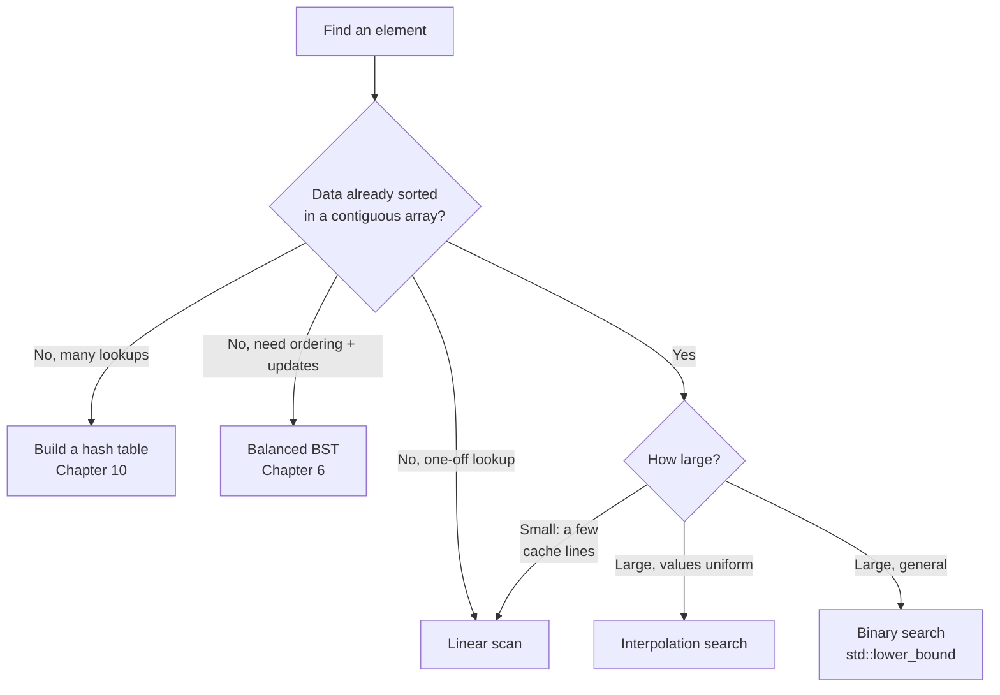

# Chapter 13: Searching Algorithms

Searching is the operation you perform more than any other, and most of the time you never think about it — you call `map.find(key)` or `set.contains(x)` and move on. That is the first and most important lesson of this chapter: **the search algorithm you get is almost always decided by the data structure you already chose.** A hash table gives you `O(1)` lookup, a balanced tree `O(log n)`, an unsorted array `O(n)`, and none of those is a decision you make at search time — it was made back when you picked the container.

So the genuinely interesting question is narrower than "how do I search?" It is: *given a sorted array in memory, how do I find an element in it fast?* That is where the famous algorithm lives — binary search — and it is also where the systems reality bites hardest, because binary search is `O(log n)` and yet, for the sizes that dominate real programs, a dumb linear scan often beats it. This chapter is mostly about that tension.

## Linear search: the baseline you keep underestimating

Linear search walks the array from front to back and stops when it finds the target. It needs nothing from the data — no ordering, no preprocessing — and it is the only option for an unsorted collection.

```cpp
int linearSearch(const std::vector<int>& a, int target) {
    for (std::size_t i = 0; i < a.size(); ++i)
        if (a[i] == target) return static_cast<int>(i);
    return -1;   // not found
}
```

`O(n)`, `O(1)` space, nothing clever. The instinct is to treat it as the algorithm you use when you don't know better. That instinct is wrong often enough to be dangerous.

Look at what this loop does to the machine. It walks memory in a straight line, one element after the next. The hardware prefetcher sees that pattern instantly and streams the next cache lines in before you ask for them. Every comparison is against data that is already in L1. The branch — "did we find it?" — is taken almost never until the very end, so the branch predictor is right almost every time. This loop runs at close to the memory bandwidth of the machine, and on a contiguous `std::vector` that is *fast*. Hold onto that; it is the whole argument of the next two sections.

## Binary search: the workhorse, and its famous bug

If the array is sorted, you can do exponentially better. Binary search checks the middle element, and because the array is ordered, that one comparison tells you which half the target must be in. Throw the other half away and repeat. Each step halves the search space, so you finish in `O(log n)` comparisons — about 20 for a million elements, 30 for a billion.

```cpp
// Search the inclusive range [lo, hi].
int binarySearch(const std::vector<int>& a, int target, int lo, int hi) {
    while (lo <= hi) {
        int mid = lo + (hi - lo) / 2;      // NOT (lo + hi) / 2 — see below
        if (a[mid] == target) return mid;
        if (a[mid] < target)  lo = mid + 1;
        else                  hi = mid - 1;
    }
    return -1;   // not found
}

int binarySearch(const std::vector<int>& a, int target) {
    return binarySearch(a, target, 0, static_cast<int>(a.size()) - 1);
}
```

Two details in that loop are where nearly every buggy binary search goes wrong.

**The overflow.** Writing `mid = (lo + hi) / 2` is the natural, obvious, and wrong way to find the midpoint. When `lo` and `hi` are both large, `lo + hi` overflows a signed 32-bit `int` and becomes negative; `a[mid]` then indexes out of bounds and you get a crash or garbage. This is not a hypothetical — it is one of the most famous bugs in the field. It sat undetected in the Java standard library's binary search (and in Jon Bentley's *Programming Pearls*, the book that popularized the algorithm) for roughly two decades before anyone hit an array big enough to trigger it. The fix is to compute the offset from `lo` instead: `lo + (hi - lo) / 2` can never overflow, because `hi - lo` is smaller than `hi`. Write it that way every time.

**The boundaries.** The loop condition is `lo <= hi`, not `lo < hi`, because the range is *inclusive* on both ends — when `lo == hi` there is still one unchecked element and you must look at it. The updates are `mid + 1` and `mid - 1`, never plain `mid`, because `a[mid]` was already compared and excluded; leaving it in the range is the classic way to write an infinite loop. Inclusive bounds with `<=` and `±1` updates form one self-consistent convention. The next section uses a different one — half-open bounds — and the two must never be mixed.

## When binary search loses

Here is the sentence that separates the textbook from the machine: **binary search is `O(log n)`, and for small arrays it is frequently slower than the `O(n)` linear scan it is supposed to beat.**

The reason is everything binary search does that linear search doesn't. It jumps — mid, then a quarter, then an eighth — landing on addresses scattered across the array. The prefetcher cannot predict where you'll go next, so each probe into a large array risks a cache miss that costs 100–300 cycles while the CPU sits idle. And the branch at each step ("go left or go right?") is, on random data, a coin flip — precisely the input a branch predictor cannot learn, so it mispredicts about half the time and eats a ~15-cycle pipeline flush on each miss. Binary search does fewer comparisons, but it makes each one expensive.

Linear search does the opposite. More comparisons, but each is nearly free: sequential access the prefetcher loves, and a branch that's almost always correctly predicted. For a small array — say a few dozen `int`s sitting in one or two cache lines — the scan finishes before binary search has paid for its first cache miss. The crossover point depends on your hardware and element size, but it is routinely in the tens-to-low-hundreds of elements. Below it, *just scan the vector.*

This is the constant-factor lesson from [Chapter 2](02-complexity-analysis.md) in its sharpest form: two algorithms in different Big-O classes, and the "worse" one wins across the whole range of sizes that most code actually touches. It is also why [arrays](03-basic-data-structures.md) remain the default container — contiguous memory turns the naive algorithm into the fast one. If you want binary search's asymptotics *and* good cache behavior on large data, that is a real engineering problem with real solutions (a branch-free binary search, or an Eytzinger/BFS memory layout that makes the probes cache-friendly), but the first move is almost always simpler: reach for `std::lower_bound`, and don't hand-roll a search on an array small enough to scan.

## Bounds: first, last, count, and insertion point

Plain binary search returns *some* index holding the target; with duplicates you usually want more — the first match, the last, how many, or where a new value would go. All of these fall out of two primitives, `lowerBound` and `upperBound`, and you should learn them as the real binary search. Note the convention shift: these use a **half-open** range `[lo, hi)` and the loop condition `lo < hi`, with `hi = mid` (not `mid - 1`) because `hi` is one past the range and was never a candidate.

```cpp
// First index i with a[i] >= target.  (This is std::lower_bound.)
int lowerBound(const std::vector<int>& a, int target) {
    int lo = 0, hi = static_cast<int>(a.size());   // half-open [lo, hi)
    while (lo < hi) {
        int mid = lo + (hi - lo) / 2;
        if (a[mid] < target) lo = mid + 1;
        else                 hi = mid;
    }
    return lo;
}

// First index i with a[i] > target.  (This is std::upper_bound.)
int upperBound(const std::vector<int>& a, int target) {
    int lo = 0, hi = static_cast<int>(a.size());
    while (lo < hi) {
        int mid = lo + (hi - lo) / 2;
        if (a[mid] <= target) lo = mid + 1;   // the only change: <= instead of <
        else                  hi = mid;
    }
    return lo;
}
```

The two functions differ by a single character — `<` versus `<=` — and that character is the whole idea. `lowerBound` stops at the first element *not less than* the target; `upperBound` stops at the first element *strictly greater*. From them everything else is arithmetic:

- **First occurrence:** `int lb = lowerBound(a, t); return (lb < (int)a.size() && a[lb] == t) ? lb : -1;`
- **Last occurrence:** `upperBound(a, t) - 1` (when it holds the target).
- **Count of a value:** `upperBound(a, t) - lowerBound(a, t)`.
- **Insertion point** that keeps the array sorted: `lowerBound(a, t)` — exactly what `std::vector::insert` wants.

In production code, don't write these — call `std::lower_bound` and `std::upper_bound` from `<algorithm>`. They are correct, overflow-free, and work on any sorted random-access range. Write them by hand once, to understand the `<`-versus-`<=` boundary in your bones, and then let the standard library carry it.

## Searching a rotated array

One binary-search variant is worth seeing because it shows the technique generalizes past "plain sorted." A sorted array that has been rotated at some pivot — `[6, 7, 8, 1, 2, 3, 4]` — is no longer globally ordered, but at any midpoint *at least one half is still sorted*. Check which half that is, and you can decide where the target lives and keep halving.

```cpp
int searchRotated(const std::vector<int>& a, int target) {
    int lo = 0, hi = static_cast<int>(a.size()) - 1;
    while (lo <= hi) {
        int mid = lo + (hi - lo) / 2;
        if (a[mid] == target) return mid;
        if (a[lo] <= a[mid]) {                          // left half is sorted
            if (target >= a[lo] && target < a[mid]) hi = mid - 1;
            else                                    lo = mid + 1;
        } else {                                        // right half is sorted
            if (target > a[mid] && target <= a[hi]) lo = mid + 1;
            else                                    hi = mid - 1;
        }
    }
    return -1;
}
```

Still `O(log n)`. This is the search inside a data structure that stores a sorted sequence with a movable start point, and a favorite interview question.

## Three specialized searches on sorted arrays

Between linear and binary search sit a few algorithms tuned for narrower situations. Reach for them rarely, but know they exist.

**Jump search** — `O(√n)`. Step forward in fixed hops of `√n`, and once you overshoot the target, linear-scan the last block. It only ever moves forward, which is its one real advantage: on storage where seeking backward is expensive (tape, some sequential media), forward-only access matters.

```cpp
int jumpSearch(const std::vector<int>& a, int target) {
    int n = static_cast<int>(a.size());
    if (n == 0) return -1;
    int step = std::max(1, static_cast<int>(std::sqrt(n)));
    int prev = 0;
    while (a[std::min(step, n) - 1] < target) {   // find the block that may hold target
        prev = step;
        step += static_cast<int>(std::sqrt(n));
        if (prev >= n) return -1;
    }
    for (int i = prev; i < std::min(step, n); ++i) // linear scan within the block
        if (a[i] == target) return i;
    return -1;
}
```

**Exponential search** — `O(log i)`, where `i` is the target's position. Double an index until you bracket the target, then binary-search that bracket. It shines on *unbounded* or effectively unknown-length sorted input (a stream, an API you can index but not measure), and when the target is likely near the front, because it never looks further than twice as far as it needs to.

```cpp
int exponentialSearch(const std::vector<int>& a, int target) {
    int n = static_cast<int>(a.size());
    if (n == 0) return -1;
    if (a[0] == target) return 0;
    int i = 1;
    while (i < n && a[i] < target) i *= 2;         // bracket the target in [i/2, i]
    return binarySearch(a, target, i / 2, std::min(i, n - 1));
}
```

**Interpolation search** — `O(log log n)` on *uniformly distributed* data, but `O(n)` when the distribution is skewed. Instead of always probing the middle, it guesses where the target should be by linear interpolation, the way you open a phone book near the back for "Wilson." The guess is only as good as the uniformity assumption, so this is a bet, not a default.

```cpp
int interpolationSearch(const std::vector<int>& a, int target) {
    int lo = 0, hi = static_cast<int>(a.size()) - 1;
    while (lo <= hi && target >= a[lo] && target <= a[hi]) {
        if (a[lo] == a[hi])                                   // flat range: no interpolation
            return a[lo] == target ? lo : -1;                 // (also guards divide-by-zero)
        // 64-bit product so (target - a[lo]) * (hi - lo) can't overflow an int
        long long span = static_cast<long long>(target - a[lo]) * (hi - lo);
        int pos = lo + static_cast<int>(span / (a[hi] - a[lo]));
        if (a[pos] == target) return pos;
        if (a[pos] < target)  lo = pos + 1;
        else                  hi = pos - 1;
    }
    return -1;
}
```

Two bugs that this version fixes and the naive version doesn't: dividing by `a[hi] - a[lo]` blows up when the range is flat (all equal), and the integer product `(target - a[lo]) * (hi - lo)` overflows on large arrays — hence the `a[lo] == a[hi]` guard and the `long long`.

## Ternary search: for peaks, not for lookups

Ternary search splits the range into thirds. On a *sorted* array that is strictly worse than binary search — more comparisons per step for the same `log` depth — so don't use it there. Its real job is finding the extremum of a **unimodal** sequence (one that rises then falls). Compare two interior points; the smaller side can't contain the peak, so discard it.

```cpp
// a is unimodal (increases, then decreases). Returns the index of the maximum.
int findPeak(const std::vector<int>& a) {
    int lo = 0, hi = static_cast<int>(a.size()) - 1;
    while (hi - lo > 2) {
        int m1 = lo + (hi - lo) / 3;
        int m2 = hi - (hi - lo) / 3;
        if (a[m1] < a[m2]) lo = m1;   // peak is to the right of m1
        else               hi = m2;   // peak is to the left of m2
    }
    int best = lo;
    for (int i = lo + 1; i <= hi; ++i)
        if (a[i] > a[best]) best = i;
    return best;
}
```

The same idea works on continuous functions and shows up in optimization ("search on the answer") more than in plain element lookup.

## Searching structures that aren't sorted arrays

When the data doesn't live in a sorted array, the search comes packaged with the structure — the point made at the top of the chapter, now concrete:

- **Hash tables** ([Chapter 10](10-hash-tables-and-hashing.md)) — `O(1)` average lookup, `O(n)` worst case under adversarial collisions, no ordering. In C++ this is `std::unordered_map::find` / `std::unordered_set::count`. If you do many lookups and don't need order, this is the answer, and its cost was paid at insert time.
- **Binary search trees** ([Chapter 6](06-trees-and-binary-trees.md)) — `O(log n)` on a balanced tree, `O(n)` on a degenerate one, while keeping elements ordered so you also get range queries and in-order traversal. `std::map` / `std::set` are balanced trees underneath.
- **Strings** — substring search (naive, Boyer–Moore, KMP) is its own subject with its own hardware trade-offs; it has a dedicated treatment in [Chapter 7](07-string-search-algorithms.md).
- **Tries and segment trees** ([Chapter 14](14-advanced-data-structures.md)) — prefix search and range queries respectively, when exact-match lookup isn't what you need.

## Choosing a search



The decision is dominated by two questions, and neither is "which search algorithm is fastest in the abstract." First: **what structure is the data in already?** If it's a hash table or a tree, the search is chosen for you. If it's an unsorted array you'll query once, scan it — building an index to search a list a single time never pays off. Second, if it *is* a sorted array: **how big?** Small means scan; large means `std::lower_bound`; large-and-provably-uniform means interpolation is worth a benchmark. Sorting an unsorted array just to binary-search it costs `O(n log n)` (see [Chapter 9](09-sorting-algorithms.md)) and only pays back across many later searches.

Every complexity table below is real, but the table is the least important thing in this chapter. Measure on your data and your hardware before you trust any row of it — the constant factors, not the exponents, usually decide.

| Algorithm | Best | Average | Worst | Space | Requires |
|-----------|------|---------|-------|-------|----------|
| Linear search | O(1) | O(n) | O(n) | O(1) | nothing |
| Binary search | O(1) | O(log n) | O(log n) | O(1) | sorted array |
| Jump search | O(1) | O(√n) | O(√n) | O(1) | sorted array |
| Exponential search | O(1) | O(log i) | O(log n) | O(1) | sorted array |
| Interpolation search | O(1) | O(log log n) | O(n) | O(1) | sorted + uniform |
| Ternary search (peak) | O(1) | O(log n) | O(log n) | O(1) | unimodal |
| Hash lookup | O(1) | O(1) | O(n) | O(n) | hash table |
| BST lookup | O(1) | O(log n) | O(n) | O(1) | search tree |

## Exercises

1. Given a sorted array with duplicates, return the first and last index of a target using only `lowerBound` and `upperBound`. Confirm the count is `last - first + 1`.
2. Find the minimum of a rotated sorted array in `O(log n)`, then extend `searchRotated` to arrays that may contain duplicates. What is the worst-case complexity now, and why?
3. Compute the integer square root of `n` with binary search on the answer, no floating point.
4. Benchmark `linearSearch` against `binarySearch` on sorted `int` arrays of size 8, 32, 128, 512, and 4096. Find your machine's crossover point and explain it in terms of cache lines and branch prediction.
5. Search a row- and column-sorted 2D matrix in `O(m + n)` by starting from a corner. Why does starting from the middle not help here?
6. Implement search in an *unbounded* sorted stream you can index but not measure, using exponential search to bracket the target first.

## Summary

The search algorithm is usually a consequence of the container, so the real leverage is in the container choice — hash table, tree, or sorted array — made long before you search. On a sorted array, binary search is the default, but write its midpoint as `lo + (hi - lo) / 2` to dodge the overflow bug, keep your boundary convention (`<=` with inclusive bounds, `<` with half-open) internally consistent, and learn `lowerBound`/`upperBound` as the version that actually handles duplicates. Above all, remember that `O(log n)` is not a promise of speed: for the small, contiguous arrays that fill real programs, a linear scan of a `std::vector` beats a clever search, because on real hardware the constant factor is the whole game.
