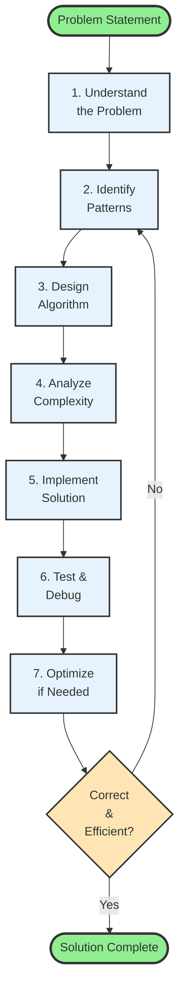
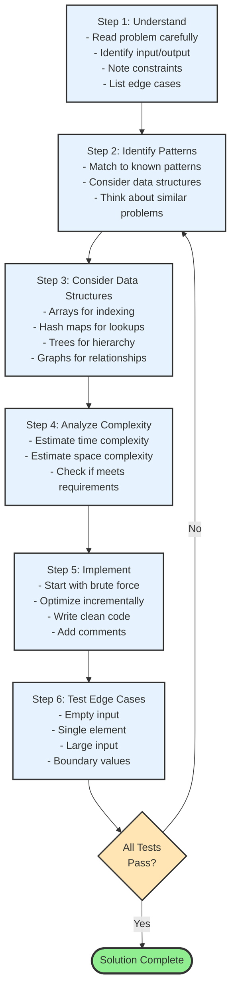
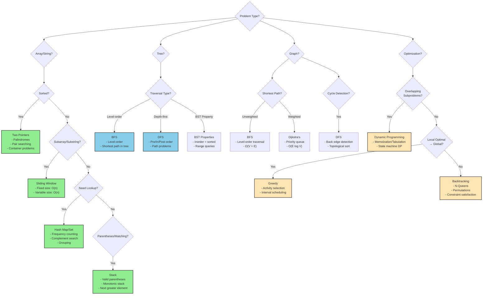

# Chapter 15: Problem Solving Strategies and Practice

## Table of Contents

- [15.1 Introduction to Problem-Solving Methodology](#introduction-to-problem-solving-methodology)
  - [The Problem-Solving Process](#the-problem-solving-process)
- [15.2 Comprehensive Problem-Solving Framework](#comprehensive-problem-solving-framework)
  - [Step-by-Step Framework](#step-by-step-framework)
  - [Step 1: Understand the Problem](#step-1-understand-the-problem)
  - [Step 2: Identify Patterns](#step-2-identify-patterns)
  - [Step 3: Consider Data Structures](#step-3-consider-data-structures)
  - [Step 4: Analyze Complexity](#step-4-analyze-complexity)
  - [Step 5: Implement](#step-5-implement)
  - [Step 6: Test Edge Cases](#step-6-test-edge-cases)
  - [Example: Two Sum Problem](#example-two-sum-problem)
- [15.3 Comprehensive Pattern Recognition Guide](#comprehensive-pattern-recognition-guide)
  - [Pattern Recognition Decision Tree](#pattern-recognition-decision-tree)
  - [Pattern 1: Two Pointers](#pattern-1-two-pointers)
  - [Pattern 2: Sliding Window](#pattern-2-sliding-window)
  - [Pattern 3: Fast/Slow Pointers](#pattern-3-fastslow-pointers)
  - [Pattern 4: Hash Map/Set](#pattern-4-hash-mapset)
  - [Pattern 5: Stack](#pattern-5-stack)
  - [Pattern 6: DFS (Depth-First Search)](#pattern-6-dfs-depth-first-search)
  - [Pattern 7: BFS (Breadth-First Search)](#pattern-7-bfs-breadth-first-search)
  - [Pattern 8: Binary Search](#pattern-8-binary-search)
  - [Pattern 9: Dynamic Programming](#pattern-9-dynamic-programming)
  - [Pattern 10: Greedy](#pattern-10-greedy)
- [15.4 Common Problem Patterns (Detailed Examples)](#common-problem-patterns-detailed-examples)
  - [Pattern 1: Two Pointers](#pattern-1-two-pointers)
  - [Pattern 2: Sliding Window](#pattern-2-sliding-window)
  - [Pattern 3: Hash Map/Set](#pattern-3-hash-mapset)
  - [Pattern 4: Stack](#pattern-4-stack)
  - [Pattern 5: Tree Traversal](#pattern-5-tree-traversal)
  - [Pattern 6: Dynamic Programming](#pattern-6-dynamic-programming)
- [15.4 Algorithm Design Techniques](#algorithm-design-techniques)
  - [Technique 1: Divide and Conquer](#technique-1-divide-and-conquer)
  - [Technique 2: Greedy Algorithm](#technique-2-greedy-algorithm)
  - [Technique 3: Backtracking](#technique-3-backtracking)
- [15.5 Problem-Solving Strategies by Category](#problem-solving-strategies-by-category)
  - [Array Problems](#array-problems)
  - [String Problems](#string-problems)
  - [Tree Problems](#tree-problems)
  - [Graph Problems](#graph-problems)
- [15.6 Debugging and Testing Strategies](#debugging-and-testing-strategies)
  - [Systematic Debugging Approach](#systematic-debugging-approach)
  - [Unit Testing Framework](#unit-testing-framework)
- [15.7 Comprehensive Interview Strategies](#comprehensive-interview-strategies)
  - [Interview Communication Framework](#interview-communication-framework)
  - [Technical Interview Strategy](#technical-interview-strategy)
  - [Interview Time Management](#interview-time-management)
  - [Common Interview Patterns by Company](#common-interview-patterns-by-company)
  - [Behavioral Questions Integration](#behavioral-questions-integration)
- [15.8 Common Pitfalls and How to Avoid Them](#common-pitfalls-and-how-to-avoid-them)
  - [Pitfall 1: Off-by-One Errors](#pitfall-1-off-by-one-errors)
  - [Pitfall 2: Integer Overflow](#pitfall-2-integer-overflow)
  - [Pitfall 3: Null/Empty Input](#pitfall-3-nullempty-input)
  - [Pitfall 4: Modifying Input When Not Allowed](#pitfall-4-modifying-input-when-not-allowed)
  - [Pitfall 5: Forgetting to Handle Duplicates](#pitfall-5-forgetting-to-handle-duplicates)
  - [Pitfall 6: Incorrect Base Cases in Recursion](#pitfall-6-incorrect-base-cases-in-recursion)
  - [Pitfall 7: Not Backtracking Properly](#pitfall-7-not-backtracking-properly)
  - [Pitfall 8: Wrong Data Structure Choice](#pitfall-8-wrong-data-structure-choice)
- [15.8 Competitive Programming Tips](#competitive-programming-tips)
  - [Contest Strategy](#contest-strategy)
  - [Common Pitfalls](#common-pitfalls)
- [15.9 Practice Resources and Recommendations](#practice-resources-and-recommendations)
  - [Online Platforms](#online-platforms)
  - [Recommended Practice Schedule](#recommended-practice-schedule)
  - [Problem Selection Strategy](#problem-selection-strategy)
- [15.10 Key Takeaways](#key-takeaways)
- [15.11 Final Thoughts](#final-thoughts)
- [15.12 Summary](#summary)


## 15.1 Introduction to Problem-Solving Methodology

Problem-solving in computer science is both an art and a science. While technical knowledge is essential, the ability to approach problems systematically and creatively is equally important. This chapter provides a comprehensive framework for tackling algorithmic problems, from initial analysis to implementation and optimization.



### The Problem-Solving Process

1. **Understand the Problem**
2. **Identify Patterns and Constraints**
3. **Design the Algorithm**
4. **Analyze Complexity**
5. **Implement the Solution**
6. **Test and Debug**
7. **Optimize if Necessary**

## 15.2 Comprehensive Problem-Solving Framework

This framework provides a systematic approach to solving any algorithmic problem.

### Step-by-Step Framework



### Step 1: Understand the Problem

**Key Questions to Ask**:

Before writing any code, ensure you fully understand:

1. **Input Format**: What does the input look like?
2. **Output Format**: What should the output be?
3. **Constraints**: What are the size limits and value ranges?
4. **Edge Cases**: What are the special cases to consider?
5. **Examples**: Do the provided examples make sense?

**Clarifying Questions Checklist**:
- [ ] What is the input format? (Array, string, tree, graph?)
- [ ] What is the expected output format?
- [ ] What are the size constraints? (n ≤ 10³, 10⁶, etc.)
- [ ] Are there any value constraints? (positive, negative, zero?)
- [ ] What edge cases should I consider?
  - [ ] Empty input
  - [ ] Single element
  - [ ] All same elements
  - [ ] Already sorted/reversed
  - [ ] Duplicates
  - [ ] Negative numbers
  - [ ] Zero values
- [ ] Are there any special requirements? (in-place, no extra space, etc.)

### Step 2: Identify Patterns

**Pattern Recognition Checklist**:
- [ ] Is the array sorted? → Two pointers, binary search
- [ ] Need to find subarray/substring? → Sliding window
- [ ] Need fast lookups? → Hash map/set
- [ ] Matching/balancing problems? → Stack
- [ ] Tree/graph structure? → DFS/BFS
- [ ] Optimization with overlapping subproblems? → DP
- [ ] Local optimal → global optimal? → Greedy
- [ ] Need to explore all possibilities? → Backtracking

### Step 3: Consider Data Structures

**Data Structure Selection Guide**:

| Need | Data Structure | Why |
|------|----------------|-----|
| Fast random access | Array/Vector | O(1) indexing |
| Fast lookups | Hash Map/Set | O(1) average |
| Maintain order | Ordered Map/Set | O(log n) operations |
| LIFO operations | Stack | Natural for matching |
| FIFO operations | Queue | Natural for BFS |
| Priority operations | Priority Queue | Heap-based |
| Hierarchical data | Tree | Natural structure |
| Relationships | Graph | Adjacency list/matrix |

### Step 4: Analyze Complexity

**Complexity Analysis Checklist**:
- [ ] What is the time complexity?
- [ ] What is the space complexity?
- [ ] Does it meet the problem constraints?
- [ ] Can I optimize further?
- [ ] Are there trade-offs to consider?

### Step 5: Implement

**Implementation Best Practices**:
1. **Start with Brute Force**: Get a working solution first
2. **Optimize Incrementally**: Improve step by step
3. **Write Clean Code**: Meaningful names, clear logic
4. **Add Comments**: Explain complex logic
5. **Handle Edge Cases**: Check for empty/null inputs

### Step 6: Test Edge Cases

**Edge Case Checklist**:
- [ ] Empty input (empty array, null pointer)
- [ ] Single element
- [ ] Two elements
- [ ] All same elements
- [ ] Already sorted (ascending/descending)
- [ ] Large input (at constraint limits)
- [ ] Boundary values (min/max integers)
- [ ] Negative numbers
- [ ] Zero values
- [ ] Duplicates

### Example: Two Sum Problem

**Problem Statement**: Given an array of integers and a target sum, find two numbers that add up to the target.

```cpp
// Step 1: Understand the problem
// Input: [2, 7, 11, 15], target = 9
// Output: [0, 1] (indices of 2 and 7)
// Constraints: Exactly one solution exists

// Step 2: Clarify requirements
// - Return indices, not values
// - Cannot use same element twice
// - Assume exactly one solution exists
```

## 15.3 Comprehensive Pattern Recognition Guide

Recognizing patterns is the key to efficient problem-solving. This guide helps you identify which pattern to use based on problem characteristics.

### Pattern Recognition Decision Tree



### Pattern 1: Two Pointers

**When to Use**:
- Sorted arrays → Two pointers from ends
- Palindromes → Compare characters from both ends
- Pair searching → Find pairs that meet criteria
- Container problems → Maximize area/volume

**Key Characteristics**:
- Array is sorted (or can be sorted)
- Looking for pairs or triplets
- Need to compare elements from different positions

**Examples**:
- Valid Palindrome
- Two Sum (sorted array)
- Container With Most Water
- 3Sum, 4Sum

### Pattern 2: Sliding Window

**When to Use**:
- Subarray/substring problems
- Fixed window size: Maximum sum of subarray of size k
- Variable window size: Longest substring without repeating characters
- Need to maintain a window of elements

**Key Characteristics**:
- Working with contiguous subarrays/substrings
- Window size is fixed or needs to be optimized
- Need to efficiently update window as it slides

**Examples**:
- Maximum Sum Subarray of Size K
- Longest Substring Without Repeating Characters
- Minimum Window Substring
- Longest Repeating Character Replacement

### Pattern 3: Fast/Slow Pointers

**When to Use**:
- Cycle detection in linked lists
- Finding middle of linked list
- Finding kth element from end
- Palindrome in linked list

**Key Characteristics**:
- Linked list problems
- Need to traverse at different speeds
- One pointer moves faster than the other

**Examples**:
- Linked List Cycle
- Middle of Linked List
- Remove Nth Node From End
- Palindrome Linked List

### Pattern 4: Hash Map/Set

**When to Use**:
- Frequency counting
- Fast lookups (O(1))
- Complement searching (Two Sum pattern)
- Grouping/partitioning problems

**Key Characteristics**:
- Need O(1) lookups
- Counting occurrences
- Finding complements or pairs
- Grouping by some property

**Examples**:
- Two Sum
- Group Anagrams
- Longest Consecutive Sequence
- Subarray Sum Equals K

### Pattern 5: Stack

**When to Use**:
- Matching brackets/parentheses
- Monotonic stack problems
- Next greater/smaller element
- Expression evaluation

**Key Characteristics**:
- LIFO (Last In First Out) needed
- Need to match or pair elements
- Monotonic property (increasing/decreasing)

**Examples**:
- Valid Parentheses
- Next Greater Element
- Largest Rectangle in Histogram
- Daily Temperatures

### Pattern 6: DFS (Depth-First Search)

**When to Use**:
- Tree/graph traversal
- Backtracking problems
- Path finding
- Connected components

**Key Characteristics**:
- Explore as deep as possible before backtracking
- Recursive or iterative with stack
- Natural for tree problems

**Examples**:
- Tree Traversal (Pre/In/Post order)
- Path Sum
- Number of Islands
- Clone Graph

### Pattern 7: BFS (Breadth-First Search)

**When to Use**:
- Shortest path in unweighted graphs
- Level-order traversal
- Minimum steps problems
- Level-by-level processing

**Key Characteristics**:
- Explore level by level
- Use queue for processing
- Guarantees shortest path (unweighted)

**Examples**:
- Binary Tree Level Order Traversal
- Shortest Path in Binary Matrix
- Word Ladder
- Rotting Oranges

### Pattern 8: Binary Search

**When to Use**:
- Sorted data
- Search space reduction
- Optimization problems (find minimum/maximum)
- Finding boundaries

**Key Characteristics**:
- Data is sorted (or can be sorted)
- Need to find target or optimize value
- Can eliminate half of search space each step

**Examples**:
- Binary Search
- Search in Rotated Sorted Array
- Find Peak Element
- Search for a Range

### Pattern 9: Dynamic Programming

**When to Use**:
- Overlapping subproblems
- Optimal substructure
- Optimization problems
- Counting problems

**Key Characteristics**:
- Problem can be broken into subproblems
- Subproblems overlap (same subproblem appears multiple times)
- Need optimal solution

**Examples**:
- Fibonacci
- Climbing Stairs
- Longest Common Subsequence
- Coin Change

### Pattern 10: Greedy

**When to Use**:
- Local optimal choice leads to global optimum
- Interval scheduling
- Activity selection
- Minimum cost problems

**Key Characteristics**:
- Make locally optimal choice at each step
- Greedy choice property holds
- Optimal substructure

**Examples**:
- Activity Selection
- Minimum Number of Coins
- Interval Scheduling
- Fractional Knapsack

## 15.4 Common Problem Patterns (Detailed Examples)

### Pattern 1: Two Pointers

**When to Use**: Sorted arrays, palindromes, pair searching

```cpp
// Example: Valid Palindrome
bool isPalindrome(string s) {
    int left = 0;
    int right = s.length() - 1;
    
    while (left < right) {
        // Skip non-alphanumeric characters
        while (left < right && !isalnum(s[left])) {
            left++;
        }
        while (left < right && !isalnum(s[right])) {
            right--;
        }
        
        if (tolower(s[left]) != tolower(s[right])) {
            return false;
        }
        
        left++;
        right--;
    }
    
    return true;
}

// Example: Container With Most Water
int maxArea(vector<int>& height) {
    int left = 0;
    int right = height.size() - 1;
    int maxArea = 0;
    
    while (left < right) {
        int currentArea = min(height[left], height[right]) * (right - left);
        maxArea = max(maxArea, currentArea);
        
        if (height[left] < height[right]) {
            left++;
        } else {
            right--;
        }
    }
    
    return maxArea;
}
```

### Pattern 2: Sliding Window

**When to Use**: Subarray/substring problems with fixed or variable window size

```cpp
// Example: Maximum Sum of Subarray of Size K
int maxSumSubarray(vector<int>& nums, int k) {
    int maxSum = 0;
    int windowSum = 0;
    
    // Calculate sum of first window
    for (int i = 0; i < k; i++) {
        windowSum += nums[i];
    }
    
    maxSum = windowSum;
    
    // Slide the window
    for (int i = k; i < nums.size(); i++) {
        windowSum = windowSum - nums[i - k] + nums[i];
        maxSum = max(maxSum, windowSum);
    }
    
    return maxSum;
}

// Example: Longest Substring Without Repeating Characters
int lengthOfLongestSubstring(string s) {
    unordered_set<char> charSet;
    int left = 0;
    int maxLength = 0;
    
    for (int right = 0; right < s.length(); right++) {
        while (charSet.find(s[right]) != charSet.end()) {
            charSet.erase(s[left]);
            left++;
        }
        
        charSet.insert(s[right]);
        maxLength = max(maxLength, right - left + 1);
    }
    
    return maxLength;
}
```

**Example: Maximum Subarray Sum with Distinct Elements**

Given an integer array `nums` and an integer `k`, find the maximum subarray sum of all subarrays that meet:
- The length of the subarray is `k`
- All elements of the subarray are distinct

Return the maximum subarray sum. If no subarray meets the conditions, return 0.

```cpp
class Solution {
public:
    long long maximumSubarraySum(vector<int>& nums, int k) {
        const int n = nums.size();
        unordered_map<int, int> cache;  // Track frequency of elements in window
        int left = 0;
        int right = 0;
        long long sum = 0;
        long long max_sum = 0;
        int uniqs = k;  // Track how many unique elements we still need
        
        while (right < n) {
            const int num = nums[right];
            
            // If this element is new in the window, decrement uniqs counter
            if (cache[num] == 0) {
                uniqs--;  // One more unique element found
            }
            cache[num]++;
            sum += num;
            
            // Shrink window if it exceeds size k
            while (right - left + 1 > k) {
                sum -= nums[left];
                cache[nums[left]]--;
                if (cache[nums[left]] == 0) {
                    uniqs++;  // Lost a unique element
                }
                left++;
            }
            
            // Check if current window is valid (size k and all distinct)
            if (right - left + 1 == k && uniqs == 0) {
                max_sum = max(max_sum, sum);
            }
            
            right++;
        }
        
        return max_sum;
    }
};
```

**Key Insights**:
- **Fixed window size**: Maintain window of exactly size `k` by shrinking when `right - left + 1 > k`
- **Distinctness tracking**: Use hash map `cache` to count frequencies; `uniqs` counter tracks how many unique elements we still need (starts at `k`, decreases as we find unique elements)
- **Window maintenance**: 
  - When adding element: if `cache[num] == 0`, it's new → decrement `uniqs`
  - When removing element: if `cache[nums[left]]` becomes 0, we lost a unique element → increment `uniqs`
- **Valid window check**: Window is valid when size equals `k` AND `uniqs == 0` (meaning we have exactly `k` distinct elements)

**Example Walkthrough**:
```
nums = [1, 5, 4, 2, 9, 9, 9], k = 3

right=0: num=1, cache[1]=0 → uniqs=2, sum=1, window=[1] (size=1)
right=1: num=5, cache[5]=0 → uniqs=1, sum=6, window=[1,5] (size=2)
right=2: num=4, cache[4]=0 → uniqs=0, sum=10, window=[1,5,4] (size=3, uniqs=0) ✓
         max_sum = max(0, 10) = 10
right=3: num=2, cache[2]=0 → uniqs=-1, sum=12, window=[1,5,4,2] (size=4 > k)
         Shrink: remove nums[0]=1 → sum=11, uniqs=0, window=[5,4,2] (size=3, uniqs=0) ✓
         max_sum = max(10, 11) = 11
right=4: num=9, cache[9]=0 → uniqs=-1, sum=20, window=[5,4,2,9] (size=4 > k)
         Shrink: remove nums[1]=5 → sum=15, uniqs=1, window=[4,2,9] (size=3, uniqs=1) ✗
right=5: num=9, cache[9]=1 → uniqs=1, sum=24, window=[4,2,9,9] (size=4 > k)
         Shrink: remove nums[2]=4 → sum=20, uniqs=1, window=[2,9,9] (size=3, uniqs=1) ✗
right=6: num=9, cache[9]=2 → uniqs=1, sum=29, window=[2,9,9,9] (size=4 > k)
         Shrink: remove nums[3]=2 → sum=27, uniqs=2, window=[9,9,9] (size=3, uniqs=2) ✗

Result: 11
```

**Time Complexity**: O(n) - each element visited at most twice (once by `right`, once by `left`)
**Space Complexity**: O(k) - hash map stores at most `k` distinct elements

### Pattern 3: Hash Map/Set

**When to Use**: Frequency counting, lookups, complement searching

```cpp
// Example: Two Sum (Hash Map approach)
vector<int> twoSum(vector<int>& nums, int target) {
    unordered_map<int, int> numMap;
    
    for (int i = 0; i < nums.size(); i++) {
        int complement = target - nums[i];
        
        if (numMap.find(complement) != numMap.end()) {
            return {numMap[complement], i};
        }
        
        numMap[nums[i]] = i;
    }
    
    return {};
}

// Example: Group Anagrams
vector<vector<string>> groupAnagrams(vector<string>& strs) {
    unordered_map<string, vector<string>> anagramGroups;
    
    for (const string& str : strs) {
        string sortedStr = str;
        sort(sortedStr.begin(), sortedStr.end());
        anagramGroups[sortedStr].push_back(str);
    }
    
    vector<vector<string>> result;
    for (const auto& pair : anagramGroups) {
        result.push_back(pair.second);
    }
    
    return result;
}
```

### Pattern 4: Stack

**When to Use**: Matching brackets, monotonic problems, next greater element

```cpp
// Example: Valid Parentheses
bool isValid(string s) {
    stack<char> stk;
    unordered_map<char, char> mapping = {
        {')', '('},
        {'}', '{'},
        {']', '['}
    };
    
    for (char c : s) {
        if (mapping.find(c) != mapping.end()) {
            if (stk.empty() || stk.top() != mapping[c]) {
                return false;
            }
            stk.pop();
        } else {
            stk.push(c);
        }
    }
    
    return stk.empty();
}

// Example: Next Greater Element
vector<int> nextGreaterElement(vector<int>& nums) {
    int n = nums.size();
    vector<int> result(n, -1);
    stack<int> stk;
    
    for (int i = 0; i < n; i++) {
        while (!stk.empty() && nums[stk.top()] < nums[i]) {
            result[stk.top()] = nums[i];
            stk.pop();
        }
        stk.push(i);
    }
    
    return result;
}
```

### Pattern 5: Tree Traversal

**When to Use**: Tree problems, hierarchical data

```cpp
// Example: Maximum Depth of Binary Tree
int maxDepth(TreeNode* root) {
    if (!root) {
        return 0;
    }
    
    return 1 + max(maxDepth(root->left), maxDepth(root->right));
}

// Example: Binary Tree Level Order Traversal
vector<vector<int>> levelOrder(TreeNode* root) {
    vector<vector<int>> result;
    if (!root) return result;
    
    queue<TreeNode*> q;
    q.push(root);
    
    while (!q.empty()) {
        int levelSize = q.size();
        vector<int> currentLevel;
        
        for (int i = 0; i < levelSize; i++) {
            TreeNode* node = q.front();
            q.pop();
            
            currentLevel.push_back(node->val);
            
            if (node->left) q.push(node->left);
            if (node->right) q.push(node->right);
        }
        
        result.push_back(currentLevel);
    }
    
    return result;
}
```

### Pattern 6: Dynamic Programming

**When to Use**: Optimization problems, counting problems, problems with overlapping subproblems

```cpp
// Example: Climbing Stairs
int climbStairs(int n) {
    if (n <= 2) return n;
    
    int prev2 = 1;
    int prev1 = 2;
    
    for (int i = 3; i <= n; i++) {
        int current = prev1 + prev2;
        prev2 = prev1;
        prev1 = current;
    }
    
    return prev1;
}

// Example: House Robber
int rob(vector<int>& nums) {
    if (nums.empty()) return 0;
    if (nums.size() == 1) return nums[0];
    
    int prev2 = nums[0];
    int prev1 = max(nums[0], nums[1]);
    
    for (int i = 2; i < nums.size(); i++) {
        int current = max(prev1, prev2 + nums[i]);
        prev2 = prev1;
        prev1 = current;
    }
    
    return prev1;
}
```

## 15.4 Algorithm Design Techniques

### Technique 1: Divide and Conquer

Break the problem into smaller subproblems, solve them recursively, and combine the results.

```cpp
// Example: Merge Sort
void mergeSort(vector<int>& arr, int left, int right) {
    if (left < right) {
        int mid = left + (right - left) / 2;
        
        mergeSort(arr, left, mid);
        mergeSort(arr, mid + 1, right);
        merge(arr, left, mid, right);
    }
}

// Example: Binary Search
int binarySearch(vector<int>& nums, int target) {
    int left = 0;
    int right = nums.size() - 1;
    
    while (left <= right) {
        int mid = left + (right - left) / 2;
        
        if (nums[mid] == target) {
            return mid;
        } else if (nums[mid] < target) {
            left = mid + 1;
        } else {
            right = mid - 1;
        }
    }
    
    return -1;
}
```

### Technique 2: Greedy Algorithm

Make locally optimal choices at each step in the hope of finding a global optimum.

```cpp
// Example: Activity Selection Problem
struct Activity {
    int start, finish;
};

bool compareActivities(const Activity& a, const Activity& b) {
    return a.finish < b.finish;
}

vector<Activity> selectActivities(vector<Activity>& activities) {
    sort(activities.begin(), activities.end(), compareActivities);
    
    vector<Activity> selected;
    selected.push_back(activities[0]);
    
    int lastFinish = activities[0].finish;
    
    for (int i = 1; i < activities.size(); i++) {
        if (activities[i].start >= lastFinish) {
            selected.push_back(activities[i]);
            lastFinish = activities[i].finish;
        }
    }
    
    return selected;
}

// Example: Minimum Number of Coins
int minCoins(vector<int>& coins, int amount) {
    sort(coins.begin(), coins.end(), greater<int>());
    
    int count = 0;
    for (int coin : coins) {
        while (amount >= coin) {
            amount -= coin;
            count++;
        }
    }
    
    return (amount == 0) ? count : -1;
}
```

### Technique 3: Backtracking

Systematically explore all possible solutions by trying different choices and undoing them if they don't lead to a solution.

```cpp
// Example: N-Queens Problem
class NQueens {
private:
    vector<vector<string>> solutions;
    
    bool isValid(vector<string>& board, int row, int col, int n) {
        // Check column
        for (int i = 0; i < row; i++) {
            if (board[i][col] == 'Q') return false;
        }
        
        // Check diagonal
        for (int i = row - 1, j = col - 1; i >= 0 && j >= 0; i--, j--) {
            if (board[i][j] == 'Q') return false;
        }
        
        for (int i = row - 1, j = col + 1; i >= 0 && j < n; i--, j++) {
            if (board[i][j] == 'Q') return false;
        }
        
        return true;
    }
    
    void solve(vector<string>& board, int row, int n) {
        if (row == n) {
            solutions.push_back(board);
            return;
        }
        
        for (int col = 0; col < n; col++) {
            if (isValid(board, row, col, n)) {
                board[row][col] = 'Q';
                solve(board, row + 1, n);
                board[row][col] = '.';
            }
        }
    }
    
public:
    vector<vector<string>> solveNQueens(int n) {
        vector<string> board(n, string(n, '.'));
        solve(board, 0, n);
        return solutions;
    }
};

// Example: Generate Parentheses
vector<string> generateParenthesis(int n) {
    vector<string> result;
    generateParenthesisHelper("", 0, 0, n, result);
    return result;
}

void generateParenthesisHelper(string current, int open, int close, int n, vector<string>& result) {
    if (current.length() == 2 * n) {
        result.push_back(current);
        return;
    }
    
    if (open < n) {
        generateParenthesisHelper(current + "(", open + 1, close, n, result);
    }
    
    if (close < open) {
        generateParenthesisHelper(current + ")", open, close + 1, n, result);
    }
}
```

## 15.5 Problem-Solving Strategies by Category

### Array Problems

1. **Sorting**: Often the first step
2. **Two Pointers**: For sorted arrays or pair problems
3. **Sliding Window**: For subarray problems
4. **Hash Map**: For lookups and frequency counting

```cpp
// Example: 3Sum
vector<vector<int>> threeSum(vector<int>& nums) {
    vector<vector<int>> result;
    sort(nums.begin(), nums.end());
    
    for (int i = 0; i < nums.size() - 2; i++) {
        if (i > 0 && nums[i] == nums[i - 1]) continue; // Skip duplicates
        
        int left = i + 1;
        int right = nums.size() - 1;
        
        while (left < right) {
            int sum = nums[i] + nums[left] + nums[right];
            
            if (sum == 0) {
                result.push_back({nums[i], nums[left], nums[right]});
                
                // Skip duplicates
                while (left < right && nums[left] == nums[left + 1]) left++;
                while (left < right && nums[right] == nums[right - 1]) right--;
                
                left++;
                right--;
            } else if (sum < 0) {
                left++;
            } else {
                right--;
            }
        }
    }
    
    return result;
}
```

### String Problems

1. **Character Frequency**: Use hash maps
2. **Pattern Matching**: Consider KMP or rolling hash
3. **Palindrome**: Two pointers from ends
4. **Anagram**: Sort or use character counting

```cpp
// Example: Longest Palindromic Substring
string longestPalindrome(string s) {
    if (s.empty()) return "";
    
    int start = 0;
    int maxLength = 1;
    
    for (int i = 0; i < s.length(); i++) {
        // Check for odd-length palindromes
        int left = i, right = i;
        while (left >= 0 && right < s.length() && s[left] == s[right]) {
            if (right - left + 1 > maxLength) {
                start = left;
                maxLength = right - left + 1;
            }
            left--;
            right++;
        }
        
        // Check for even-length palindromes
        left = i;
        right = i + 1;
        while (left >= 0 && right < s.length() && s[left] == s[right]) {
            if (right - left + 1 > maxLength) {
                start = left;
                maxLength = right - left + 1;
            }
            left--;
            right++;
        }
    }
    
    return s.substr(start, maxLength);
}
```

### Tree Problems

1. **Traversal**: Preorder, inorder, postorder, level-order
2. **Recursion**: Natural fit for tree problems
3. **BFS/DFS**: For path and level problems
4. **BST Properties**: Use inorder traversal for sorted order

```cpp
// Example: Lowest Common Ancestor
TreeNode* lowestCommonAncestor(TreeNode* root, TreeNode* p, TreeNode* q) {
    if (!root || root == p || root == q) {
        return root;
    }
    
    TreeNode* left = lowestCommonAncestor(root->left, p, q);
    TreeNode* right = lowestCommonAncestor(root->right, p, q);
    
    if (left && right) {
        return root;
    }
    
    return left ? left : right;
}
```

### Graph Problems

1. **BFS**: For shortest path in unweighted graphs
2. **DFS**: For connectivity and cycle detection
3. **Union-Find**: For connectivity problems
4. **Topological Sort**: For dependency problems

```cpp
// Example: Course Schedule (Cycle Detection)
bool canFinish(int numCourses, vector<vector<int>>& prerequisites) {
    vector<vector<int>> graph(numCourses);
    vector<int> inDegree(numCourses, 0);
    
    // Build graph and calculate in-degrees
    for (const auto& prereq : prerequisites) {
        graph[prereq[1]].push_back(prereq[0]);
        inDegree[prereq[0]]++;
    }
    
    // Find nodes with no incoming edges
    queue<int> q;
    for (int i = 0; i < numCourses; i++) {
        if (inDegree[i] == 0) {
            q.push(i);
        }
    }
    
    int completed = 0;
    while (!q.empty()) {
        int course = q.front();
        q.pop();
        completed++;
        
        for (int nextCourse : graph[course]) {
            inDegree[nextCourse]--;
            if (inDegree[nextCourse] == 0) {
                q.push(nextCourse);
            }
        }
    }
    
    return completed == numCourses;
}
```

## 15.6 Debugging and Testing Strategies

### Systematic Debugging Approach

1. **Reproduce the Bug**: Create a minimal test case
2. **Add Print Statements**: Trace execution flow
3. **Check Edge Cases**: Empty inputs, single elements, etc.
4. **Verify Logic**: Step through the algorithm manually
5. **Test with Different Inputs**: Various sizes and patterns

```cpp
// Example: Debug helper function
void debugPrint(vector<int>& arr, string message) {
    cout << message << ": ";
    for (int num : arr) {
        cout << num << " ";
    }
    cout << endl;
}

// Example: Test case generator
vector<vector<int>> generateTestCases() {
    return {
        {},                           // Empty array
        {1},                          // Single element
        {1, 2},                       // Two elements
        {2, 1},                       // Two elements (reversed)
        {1, 2, 3, 4, 5},              // Sorted array
        {5, 4, 3, 2, 1},              // Reverse sorted
        {3, 1, 4, 1, 5, 9, 2, 6},    // Random array
        {1, 1, 1, 1, 1},              // All same elements
        {-1, -2, -3, -4, -5}         // Negative numbers
    };
}
```

### Unit Testing Framework

A simple test framework can help verify solutions. Key features include:
- Assertion functions to compare expected vs actual results
- Clear test output indicating pass/fail status
- Ability to run multiple test cases systematically

Testing helps catch bugs early and verify correctness before optimization.

## 15.7 Comprehensive Interview Strategies

### Interview Communication Framework

**The STAR Method for Algorithm Problems**:
- **Situation**: Understand the problem context
- **Task**: Identify what needs to be solved
- **Action**: Design and implement the solution
- **Result**: Verify correctness and analyze complexity

### Technical Interview Strategy

#### 1. Clarifying Questions (2-3 minutes)

**Always Ask**:
- "Can you clarify the input format?"
- "What should I return if the input is empty?"
- "Are there any constraints I should know about?"
- "Can you walk me through the example?"
- "Should I handle edge cases like duplicates/negatives?"

**Example Dialogue**:
```
Interviewer: "Find two numbers that add up to target."
You: "Just to clarify:
      - Should I return indices or values?
      - Can I use the same element twice?
      - Is the array sorted?
      - What if no solution exists?"
```

#### 2. Think Out Loud (Throughout)

**What to Say**:
- "I'm thinking about using a hash map because..."
- "The brute force would be O(n²), but I can optimize to O(n) by..."
- "Let me trace through this example to verify..."
- "I need to handle the edge case where..."

**Why It Matters**:
- Shows your thought process
- Helps interviewer understand your approach
- Allows course correction if needed
- Demonstrates problem-solving skills

#### 3. Start Simple, Then Optimize

**Progression**:
1. **Brute Force**: "The naive approach would be..."
2. **Identify Bottleneck**: "The issue is..."
3. **Optimize**: "I can improve this by..."
4. **Verify**: "This reduces complexity from O(n²) to O(n)"

**Example**:
```cpp
// Step 1: Brute Force
// "I could check every pair - that's O(n²)"

// Step 2: Optimize
// "I can use a hash map to store seen numbers - that's O(n)"
```

#### 4. Write Clean Code

**Code Quality Checklist**:
- [ ] Meaningful variable names (`left`, `right`, not `i`, `j`)
- [ ] Clear function names (`findTwoSum`, not `solve`)
- [ ] Comments for complex logic
- [ ] Consistent formatting
- [ ] Handle edge cases explicitly

#### 5. Test Your Solution

**Testing Protocol**:
1. **Walk through example**: Trace with provided example
2. **Test edge cases**: Empty, single element, etc.
3. **Verify correctness**: Check logic step by step
4. **Check complexity**: Confirm time/space complexity

### Interview Time Management

```mermaid
gantt
    title 45-Minute Interview Breakdown
    dateFormat X
    axisFormat %M min
    
    section Understanding
    Clarify Problem    :0, 3
    section Design
    Design Algorithm   :3, 10
    section Implementation
    Write Code         :13, 20
    section Testing
    Test & Debug       :33, 5
    section Optimization
    Optimize           :38, 5
    section Discussion
    Discuss Solution   :43, 2
```



**Recommended Time Allocation**:
- **0-3 minutes**: Understand and clarify the problem
- **3-10 minutes**: Design the algorithm (think, discuss, draw)
- **10-30 minutes**: Implement the solution
- **30-35 minutes**: Test and debug
- **35-40 minutes**: Optimize if time permits
- **40-45 minutes**: Discuss solution, complexity, trade-offs

### Common Interview Patterns by Company

**Google/Facebook/Meta**:
- Heavy on algorithms and data structures
- System design for senior roles
- Focus on optimization and scalability

**Amazon**:
- Object-oriented design
- Behavioral questions (STAR method)
- Focus on customer obsession

**Microsoft**:
- Problem-solving approach
- Code quality and testing
- Focus on edge cases

**Apple**:
- Deep technical knowledge
- System-level understanding
- Focus on user experience

### Behavioral Questions Integration

**How to Connect Technical to Behavioral**:

**Example**: "Tell me about a time you optimized code"
- **Situation**: "I had a function that was too slow"
- **Task**: "Needed to reduce time complexity"
- **Action**: "I identified the bottleneck, applied [algorithm/DS], reduced from O(n²) to O(n)"
- **Result**: "Performance improved by X%, learned about [concept]"

## 15.8 Common Pitfalls and How to Avoid Them

### Pitfall 1: Off-by-One Errors

**Common Mistakes**:
```cpp
// WRONG: Off by one
for (int i = 0; i <= arr.size(); i++) {  // Should be <
    // Access arr[i] - out of bounds!
}

// CORRECT
for (int i = 0; i < arr.size(); i++) {
    // Safe access
}
```

**How to Avoid**:
- Use `i < size` not `i <= size`
- Be careful with `size - 1` vs `size`
- Test with small arrays (size 1, 2)

### Pitfall 2: Integer Overflow

**Common Mistakes**:
```cpp
// WRONG: Overflow for large numbers
int sum = 0;
for (int x : largeArray) {
    sum += x;  // May overflow!
}

// CORRECT: Use long long
long long sum = 0;
for (int x : largeArray) {
    sum += x;
}
```

**How to Avoid**:
- Use `long long` for sums/products
- Check constraints before choosing data type
- Consider `unsigned` for non-negative values

### Pitfall 3: Null/Empty Input

**Common Mistakes**:
```cpp
// WRONG: Doesn't handle empty
int maxElement(vector<int>& arr) {
    int max = arr[0];  // Crashes if empty!
    // ...
}

// CORRECT: Check first
int maxElement(vector<int>& arr) {
    if (arr.empty()) {
        throw invalid_argument("Array is empty");
    }
    int max = arr[0];
    // ...
}
```

**How to Avoid**:
- Always check for empty/null inputs
- Handle edge cases explicitly
- Return appropriate values (null, -1, empty result)

### Pitfall 4: Modifying Input When Not Allowed

**Common Mistakes**:
```cpp
// WRONG: Modifies input
vector<int> process(const vector<int>& nums) {
    sort(nums.begin(), nums.end());  // Error: const!
    // ...
}

// CORRECT: Create copy
vector<int> process(const vector<int>& nums) {
    vector<int> sorted = nums;
    sort(sorted.begin(), sorted.end());
    // ...
}
```

**How to Avoid**:
- Check if input is const
- Create copies when needed
- Use const references when possible

### Pitfall 5: Forgetting to Handle Duplicates

**Common Mistakes**:
```cpp
// WRONG: May return duplicates
vector<vector<int>> findPairs(vector<int>& nums, int target) {
    // Doesn't skip duplicates
    // ...
}

// CORRECT: Skip duplicates
vector<vector<int>> findPairs(vector<int>& nums, int target) {
    sort(nums.begin(), nums.end());
    // Skip duplicates explicitly
    // ...
}
```

**How to Avoid**:
- Always consider duplicate handling
- Sort and skip when needed
- Use sets when uniqueness matters

### Pitfall 6: Incorrect Base Cases in Recursion

**Common Mistakes**:
```cpp
// WRONG: Missing or incorrect base case
int factorial(int n) {
    return n * factorial(n - 1);  // Infinite recursion!
}

// CORRECT: Proper base case
int factorial(int n) {
    if (n <= 1) return 1;  // Base case
    return n * factorial(n - 1);
}
```

**How to Avoid**:
- Always define base case first
- Test with smallest inputs (0, 1)
- Ensure progress toward base case

### Pitfall 7: Not Backtracking Properly

**Common Mistakes**:
```cpp
// WRONG: Doesn't undo choice
void backtrack(vector<int>& path) {
    if (complete(path)) {
        result.push_back(path);
        return;
    }
    path.push_back(choice);
    backtrack(path);
    // Missing: path.pop_back();
}
```

**How to Avoid**:
- Always undo changes after recursive call
- Use the backtracking template
- Test with small examples

### Pitfall 8: Wrong Data Structure Choice

**Common Mistakes**:
```cpp
// WRONG: Using vector for frequent lookups
vector<int> data;
if (find(data.begin(), data.end(), target) != data.end()) {  // O(n)
    // ...
}

// CORRECT: Use set for O(log n) or unordered_set for O(1)
unordered_set<int> data;
if (data.find(target) != data.end()) {  // O(1)
    // ...
}
```

**How to Avoid**:
- Analyze operation frequencies
- Choose DS based on most common operations
- Consider time vs space trade-offs

## 15.8 Competitive Programming Tips

### Contest Strategy

1. **Read All Problems**: Get an overview before starting
2. **Solve Easy Problems First**: Build confidence and points
3. **Time Management**: Don't get stuck on one problem
4. **Debug Efficiently**: Use print statements and test cases
5. **Submit Early**: Get partial points even if solution isn't perfect

### Common Pitfalls

1. **Integer Overflow**: Use long long when necessary
2. **Array Bounds**: Check array indices carefully
3. **Edge Cases**: Handle empty inputs, single elements
4. **Off-by-One Errors**: Be careful with loop boundaries
5. **Memory Limits**: Optimize space usage for large inputs

## 15.9 Practice Resources and Recommendations

### Online Platforms

1. **LeetCode**: Comprehensive problem collection with discussions
2. **HackerRank**: Structured learning paths and contests
3. **Codeforces**: Competitive programming contests
4. **AtCoder**: High-quality contests and problems
5. **GeeksforGeeks**: Tutorials and practice problems

### Recommended Practice Schedule

**Week 1-2**: Arrays and Strings (20 problems)
**Week 3-4**: Linked Lists and Stacks/Queues (15 problems)
**Week 5-6**: Trees and Graphs (20 problems)
**Week 7-8**: Dynamic Programming (15 problems)
**Week 9-10**: Greedy and Backtracking (10 problems)

### Problem Selection Strategy

1. **Start with Easy Problems**: Build confidence
2. **Focus on Patterns**: Master common problem types
3. **Practice Consistently**: Solve 2-3 problems daily
4. **Review Solutions**: Learn from others' approaches
5. **Mock Interviews**: Practice explaining solutions

## 15.10 Key Takeaways

1. **Systematic Approach**: Follow a consistent problem-solving methodology
2. **Pattern Recognition**: Learn to identify common algorithmic patterns
3. **Practice Regularly**: Consistent practice improves problem-solving skills
4. **Understand Trade-offs**: Consider time vs. space complexity
5. **Test Thoroughly**: Always verify your solutions with test cases
6. **Learn from Mistakes**: Analyze failed attempts to improve

## 15.11 Final Thoughts

Mastering data structures and algorithms is a journey that requires dedication, practice, and continuous learning. The key to success is not memorizing solutions but understanding the underlying principles and developing the ability to recognize patterns and apply appropriate techniques.

Remember that:
- **Every expert was once a beginner**
- **Consistent practice beats sporadic cramming**
- **Understanding beats memorization**
- **Failure is part of the learning process**
- **Problem-solving is a skill that improves with practice**

The knowledge and skills you've gained from this book provide a solid foundation for tackling algorithmic challenges in interviews, competitive programming, and real-world software development. Continue practicing, stay curious, and never stop learning.

## 15.12 Summary

This final chapter has provided a comprehensive framework for approaching algorithmic problems systematically. From understanding problem patterns to implementing solutions and debugging effectively, the strategies outlined here will serve you well in technical interviews and competitive programming. Remember that mastery comes through consistent practice and a willingness to learn from both successes and failures.

The journey of learning data structures and algorithms is ongoing. As technology evolves and new problems emerge, your foundation in these fundamental concepts will continue to serve you well. Keep practicing, stay curious, and apply these techniques to solve real-world problems.

Good luck with your algorithmic journey!
