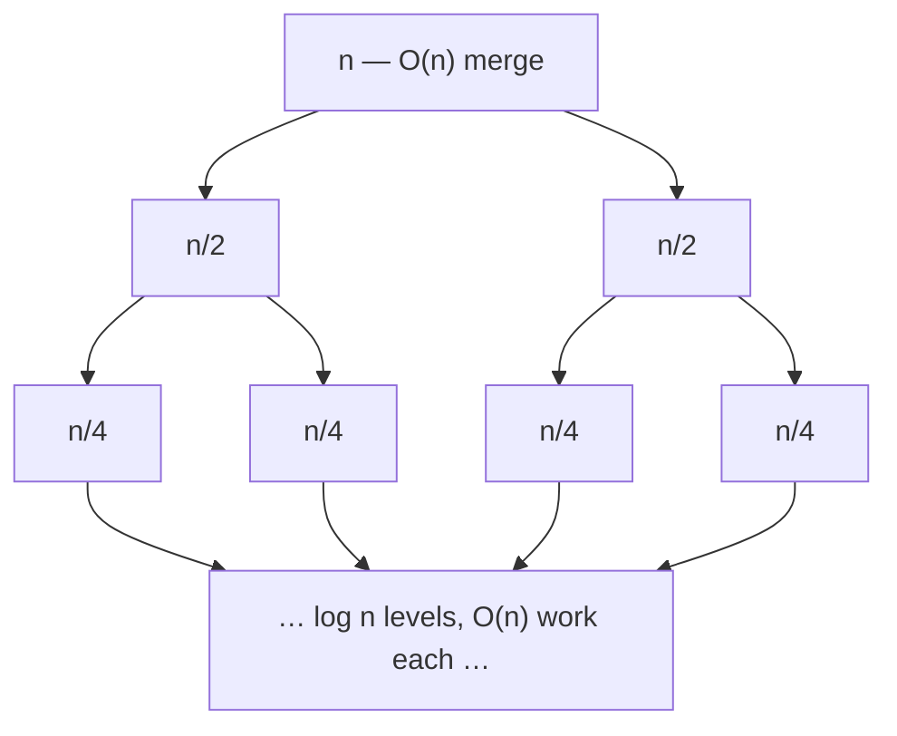

# Chapter 17: Divide and Conquer

Most of this book is about *structures* — arrays, trees, hash tables — and the way they lay
themselves out in memory. This chapter is about a *strategy*, and it is the one strategy whose
payoff shows up twice: once in the asymptotics, where splitting a problem in half turns `O(n²)`
into `O(n log n)`, and once on the hardware, where that same recursive split — almost by
accident — produces the most cache-friendly memory access pattern you can write. That second
payoff is the one other books skip, and it is the reason this chapter exists.

The idea is three moves:

1. **Divide** the problem into smaller instances of the same problem.
2. **Conquer** each one by recursing, until the pieces are small enough to solve outright.
3. **Combine** the sub-answers into an answer for the whole.

The art is entirely in steps 1 and 3. If dividing is trivial and combining is cheap, you get an
elegant `O(n log n)` algorithm; if combining costs as much as the naive method, you have gained
nothing. Everything below is a study in where that line falls.

What divide and conquer is *not* is dynamic programming. Both break a problem into subproblems,
but D&C subproblems are **independent** — the left half of an array knows nothing about the right
half — so there is nothing to memoize and the pieces can run in parallel. DP exists precisely
because *its* subproblems overlap. When you find yourself solving the same subproblem twice, you
have left this chapter and entered that one.

## The recurrence is the algorithm

You cannot reason about a divide-and-conquer algorithm without writing its **recurrence** — the
cost of a problem expressed in terms of its subproblems. [Chapter 2](02-complexity-analysis.md)
introduced the shape; here it earns its keep. Every algorithm in this chapter fits the template

```
T(n) = a · T(n/b) + f(n)
```

where `a` is the number of subproblems you recurse on, `b` is the factor by which each shrinks,
and `f(n)` is the cost of the divide-and-combine work at this level. Merge sort splits into two
halves and merges them in linear time, so `a = 2`, `b = 2`, `f(n) = n`:

```
T(n) = 2·T(n/2) + O(n)
```

You can *see* why that solves to `O(n log n)` by drawing the recursion tree. Each level does
`O(n)` total work — the top merges `n` elements, the next level merges two halves of `n/2`, and
so on — and there are `log₂ n` levels before the pieces reach size 1:



`O(n)` per level × `log n` levels = `O(n log n)`. That picture — total work per level, times the
number of levels — is the whole intuition. The Master Theorem just turns it into a formula so you
don't have to draw the tree every time.

## The Master Theorem

Given `T(n) = a·T(n/b) + f(n)` with `a ≥ 1` and `b > 1`, the answer is decided by a race between
two quantities: the number of leaves in the recursion tree, `n^(log_b a)`, and the per-call work
`f(n)`. Whichever grows faster dominates.

- **Case 1 — leaves win.** If `f(n) = O(n^(log_b a − ε))` for some `ε > 0`, then
  `T(n) = Θ(n^(log_b a))`. The work is dominated by the exponentially many base cases at the
  bottom of the tree.
- **Case 2 — a tie.** If `f(n) = Θ(n^(log_b a))`, then `T(n) = Θ(n^(log_b a) · log n)`. Every
  level does the same total work, and there are `log n` of them. Merge sort lives here.
- **Case 3 — the root wins.** If `f(n) = Ω(n^(log_b a + ε))` for some `ε > 0` *and*
  `a·f(n/b) ≤ c·f(n)` for some `c < 1` (the regularity condition), then `T(n) = Θ(f(n))`. The
  top-level combine cost swamps everything beneath it.

Watch it decide the algorithms in this chapter:

| Algorithm | Recurrence | `log_b a` | vs. `f(n)` | Result |
|-----------|-----------|-----------|-----------|--------|
| Binary search | `T(n) = T(n/2) + O(1)` | 0 | tie (`n⁰`) | `Θ(log n)` |
| Merge sort | `T(n) = 2T(n/2) + O(n)` | 1 | tie (`n¹`) | `Θ(n log n)` |
| Quickselect (avg) | `T(n) = T(n/2) + O(n)` | 0 | root wins | `Θ(n)` |
| Karatsuba | `T(n) = 3T(n/2) + O(n)` | ≈1.585 | leaves win | `Θ(n^1.585)` |
| Recursive matmul | `T(n) = 8T(n/2) + O(n²)` | 3 | leaves win | `Θ(n³)` |
| Strassen | `T(n) = 7T(n/2) + O(n²)` | ≈2.807 | leaves win | `Θ(n^2.807)` |

The Master Theorem does not cover every recurrence — it needs equal-sized subproblems and a
well-behaved `f(n)` — but it covers the ones that matter here, and it makes the design lever
obvious: to beat a bound, you either shrink `a` (Karatsuba trades a multiply for additions to
drop from 4 to 3; Strassen from 8 to 7) or you cheapen `f(n)`.

## Merge sort: the canonical split

Merge sort is the algorithm the recurrence was drawn for. Split the array at the midpoint, sort
each half recursively, then merge the two sorted halves in one linear pass. The merge is the whole
trick: walking two sorted runs with two fingers and emitting the smaller element is `O(n)`, and it
is what buys the `n log n`.

```cpp
#include <vector>
using std::vector;

void merge(vector<int>& a, int lo, int mid, int hi) {
    vector<int> buf;
    buf.reserve(hi - lo + 1);
    int i = lo, j = mid + 1;
    while (i <= mid && j <= hi)               // two fingers, emit the smaller
        buf.push_back(a[i] <= a[j] ? a[i++] : a[j++]);
    while (i <= mid) buf.push_back(a[i++]);   // drain the leftovers
    while (j <= hi)  buf.push_back(a[j++]);
    for (int k = 0; k < (int)buf.size(); ++k)
        a[lo + k] = buf[k];
}

void mergeSort(vector<int>& a, int lo, int hi) {
    if (lo >= hi) return;                      // base case: 0 or 1 element
    int mid = lo + (hi - lo) / 2;              // not (lo+hi)/2 — that can overflow
    mergeSort(a, lo, mid);
    mergeSort(a, mid + 1, hi);
    merge(a, lo, mid, hi);
}

void mergeSort(vector<int>& a) {
    if (!a.empty()) mergeSort(a, 0, (int)a.size() - 1);
}
```

```python
def merge(a, lo, mid, hi):
    buf = []
    i, j = lo, mid + 1
    while i <= mid and j <= hi:                # two fingers, emit the smaller
        if a[i] <= a[j]:
            buf.append(a[i]); i += 1
        else:
            buf.append(a[j]); j += 1
    while i <= mid:                            # drain the leftovers
        buf.append(a[i]); i += 1
    while j <= hi:
        buf.append(a[j]); j += 1
    for k in range(len(buf)):
        a[lo + k] = buf[k]


def merge_sort(a, lo=None, hi=None):
    if lo is None:                            # top-level call over the whole array
        if a:
            merge_sort(a, 0, len(a) - 1)
        return
    if lo >= hi:                              # base case: 0 or 1 element
        return
    mid = lo + (hi - lo) // 2                 # not (lo+hi)//2 — matches the C++ convention
    merge_sort(a, lo, mid)
    merge_sort(a, mid + 1, hi)
    merge(a, lo, mid, hi)
```

Two details here are the most common bugs in the whole chapter. The midpoint is
`lo + (hi - lo) / 2`, never `(lo + hi) / 2`: the latter overflows a 32-bit `int` once the indices
grow large — a bug that sat undetected in the JDK's binary search for nine years. And the wrapper
guards `a.empty()`, because `a.size()` is unsigned, so `a.size() - 1` on an empty vector wraps to a
gigantic value. Merge sort's `O(n log n)` is worst-case, not just average — every level does the
same work regardless of input — which makes it the sort of choice when you cannot tolerate
quicksort's `O(n²)` tail. It pays for that guarantee with `O(n)` auxiliary memory for the merge
buffer.

## Quicksort and quickselect: recurse toward the pivot

Quicksort inverts merge sort's balance of effort. Merge sort does trivial dividing and hard
combining; quicksort does hard dividing (the partition) and *no* combining at all. Partition picks
a pivot and rearranges the array so everything smaller sits left of it and everything larger sits
right; the pivot is now in its final position, and the two sides are sorted independently with
nothing left to merge.

```cpp
#include <random>
#include <algorithm>
using std::vector;

int partition(vector<int>& a, int lo, int hi) {
    static std::mt19937 rng{std::random_device{}()};   // seeded ONCE, not per call
    std::uniform_int_distribution<int> pick(lo, hi);
    std::swap(a[pick(rng)], a[hi]);                     // random pivot → expected n log n
    int pivot = a[hi], i = lo - 1;
    for (int j = lo; j < hi; ++j)
        if (a[j] < pivot) std::swap(a[++i], a[j]);
    std::swap(a[i + 1], a[hi]);
    return i + 1;                                       // pivot's final index
}

void quickSort(vector<int>& a, int lo, int hi) {
    if (lo >= hi) return;
    int p = partition(a, lo, hi);
    quickSort(a, lo, p - 1);
    quickSort(a, p + 1, hi);
}
```

```python
import random

def partition(a, lo, hi):
    r = random.randint(lo, hi)          # random pivot → expected n log n
    a[r], a[hi] = a[hi], a[r]
    pivot, i = a[hi], lo - 1
    for j in range(lo, hi):
        if a[j] < pivot:
            i += 1
            a[i], a[j] = a[j], a[i]
    a[i + 1], a[hi] = a[hi], a[i + 1]
    return i + 1                        # pivot's final index


def quick_sort(a, lo, hi):
    if lo >= hi:
        return
    p = partition(a, lo, hi)
    quick_sort(a, lo, p - 1)
    quick_sort(a, p + 1, hi)
```

The randomization is not decoration. With a fixed pivot (say, always the last element), an already
sorted array drives partition into its `O(n²)` worst case — the single most common way quicksort
blows up in production. A uniformly random pivot makes that worst case astronomically unlikely
regardless of input, which is why the seed lives in a `static` generator initialized once. Re-seed
from the clock *inside* `partition` and every call within the same millisecond gets the same
"random" pivot — no randomization at all.

The same partition gives you **quickselect**, the classic example of recursing into only *one*
side. To find the k-th smallest element you do not need to sort both halves — only the half that
contains rank `k`:

```cpp
// k is 0-indexed: k == 0 is the minimum. Expected O(n).
int quickselect(vector<int>& a, int lo, int hi, int k) {
    if (lo == hi) return a[lo];
    int p = partition(a, lo, hi);
    if (k == p) return a[p];
    return (k < p) ? quickselect(a, lo, p - 1, k)
                   : quickselect(a, p + 1, hi, k);
}
```

```python
# k is 0-indexed: k == 0 is the minimum. Expected O(n).
def quickselect(a, lo, hi, k):
    if lo == hi:
        return a[lo]
    p = partition(a, lo, hi)
    if k == p:
        return a[p]
    return quickselect(a, lo, p - 1, k) if k < p else quickselect(a, p + 1, hi, k)
```

Recursing into one half instead of two changes the recurrence from `2T(n/2)` to `T(n/2)`, and the
Master Theorem's Case 3 collapses it from `O(n log n)` to `O(n)` expected. This is `std::nth_element`,
and it is how you find a median, or the top-k, without paying to sort everything you don't care
about.

## Binary search and fast exponentiation: `a = 1`

The leanest divide-and-conquer algorithms discard subproblems entirely. Binary search
(covered in full in [Chapter 13](13-searching-algorithms.md)) inspects the middle element and recurses
into *one* half, giving `T(n) = T(n/2) + O(1) = O(log n)`. Fast exponentiation applies the same
halving to arithmetic: `xⁿ = (x^(n/2))²`, squaring one recursively computed result instead of
multiplying `x` by itself `n` times.

```cpp
double power(double x, long long n) {
    if (n == 0) return 1.0;
    if (n < 0)  return 1.0 / power(x, -n);   // long long so -INT_MIN can't overflow
    double half = power(x, n / 2);
    return (n % 2 == 0) ? half * half : half * half * x;
}
```

```python
def power(x, n):
    if n == 0:
        return 1.0
    if n < 0:
        return 1.0 / power(x, -n)
    half = power(x, n // 2)
    return half * half if n % 2 == 0 else half * half * x
```

Taking `n` as `long long` matters: negating the most negative 32-bit `int` overflows, so a naive
`int` version corrupts on `power(x, INT_MIN)`. The recurrence `T(n) = T(n/2) + O(1)` is binary
search's, and the cost is `O(log n)` multiplications — the same trick that makes modular
exponentiation, and therefore RSA, tractable.

## Maximum subarray: the combine step does the work

Some problems divide trivially but hide their difficulty in the combine. The maximum-subarray
problem — find the contiguous slice with the largest sum — splits into left and right halves, but
the best subarray might straddle the midpoint, belonging to neither. So the combine step has real
work: find the best subarray *ending* at the midpoint and the best one *starting* just after it,
and glue them.

```cpp
#include <climits>
#include <algorithm>
using std::vector; using std::max;

int maxCrossing(const vector<int>& a, int lo, int mid, int hi) {
    int sum = 0, left = INT_MIN;
    for (int i = mid; i >= lo; --i) { sum += a[i]; left = max(left, sum); }
    sum = 0; int right = INT_MIN;
    for (int i = mid + 1; i <= hi; ++i) { sum += a[i]; right = max(right, sum); }
    return left + right;                       // must use at least one element each side
}

int maxSubarray(const vector<int>& a, int lo, int hi) {
    if (lo == hi) return a[lo];
    int mid = lo + (hi - lo) / 2;
    return max({ maxSubarray(a, lo, mid),
                 maxSubarray(a, mid + 1, hi),
                 maxCrossing(a, lo, mid, hi) });
}
```

```python
def max_crossing(a, lo, mid, hi):
    s, left = 0, float("-inf")
    for i in range(mid, lo - 1, -1):
        s += a[i]; left = max(left, s)
    s, right = 0, float("-inf")
    for i in range(mid + 1, hi + 1):
        s += a[i]; right = max(right, s)
    return left + right                        # must use at least one element each side


def max_subarray(a, lo, hi):
    if lo == hi:
        return a[lo]
    mid = lo + (hi - lo) // 2
    return max(max_subarray(a, lo, mid),
               max_subarray(a, mid + 1, hi),
               max_crossing(a, lo, mid, hi))
```

The linear crossing scan makes `f(n) = O(n)`, so `T(n) = 2T(n/2) + O(n) = O(n log n)`. In practice
you would reach for Kadane's algorithm, which solves this in one `O(n)` pass. The D&C version earns
its place as a teaching case: the cleanest illustration of a combine step that is neither free nor
trivial, and the crossing-sum pattern generalizes to problems Kadane cannot touch — segment trees
answer range-max queries with exactly this decomposition.

## Counting inversions: piggyback on the merge

A merge already knows more than it tells you. When you merge two sorted halves and take an element
from the *right* before the left half is exhausted, that right element was smaller than every
remaining left element — that is, it was out of order with all of them. Counting those events
counts the array's **inversions** (pairs `i < j` with `a[i] > a[j]`), a measure of how unsorted
the data is, for free during a merge sort.

```cpp
long long mergeCount(vector<int>& a, int lo, int mid, int hi) {
    vector<int> buf; buf.reserve(hi - lo + 1);
    int i = lo, j = mid + 1;
    long long inv = 0;
    while (i <= mid && j <= hi) {
        if (a[i] <= a[j]) buf.push_back(a[i++]);
        else { buf.push_back(a[j++]); inv += mid - i + 1; }  // left[i..mid] all beat a[j]
    }
    while (i <= mid) buf.push_back(a[i++]);
    while (j <= hi)  buf.push_back(a[j++]);
    for (int k = 0; k < (int)buf.size(); ++k) a[lo + k] = buf[k];
    return inv;
}

long long countInversions(vector<int>& a, int lo, int hi) {
    if (lo >= hi) return 0;
    int mid = lo + (hi - lo) / 2;
    return countInversions(a, lo, mid)
         + countInversions(a, mid + 1, hi)
         + mergeCount(a, lo, mid, hi);
}
```

```python
def merge_count(a, lo, mid, hi):
    buf = []
    i, j = lo, mid + 1
    inv = 0
    while i <= mid and j <= hi:
        if a[i] <= a[j]:
            buf.append(a[i]); i += 1
        else:
            buf.append(a[j]); j += 1
            inv += mid - i + 1                # left[i..mid] all beat a[j]
    while i <= mid:
        buf.append(a[i]); i += 1
    while j <= hi:
        buf.append(a[j]); j += 1
    for k in range(len(buf)):
        a[lo + k] = buf[k]
    return inv


def count_inversions(a, lo, hi):
    if lo >= hi:
        return 0
    mid = lo + (hi - lo) // 2
    return (count_inversions(a, lo, mid)
            + count_inversions(a, mid + 1, hi)
            + merge_count(a, lo, mid, hi))
```

The count is `long long` on purpose: a reversed array of `n` elements has `n(n−1)/2` inversions,
which overflows a 32-bit `int` before `n` reaches 100,000. The brute-force count is `O(n²)`;
riding the merge makes it `O(n log n)` at no extra asymptotic cost.

## Closest pair of points: geometry in `O(n log n)`

Given `n` points in the plane, the closest pair is trivially found in `O(n²)` by checking all
pairs. Divide and conquer beats it. Sort by x, split at the median x into left and right halves,
and recursively find the closest pair in each; let `d` be the smaller of the two distances. The
only pairs left to check are those straddling the dividing line — but any such pair closer than
`d` must lie within a vertical strip of width `2d` around the line. The geometric miracle is that
within that strip, sorted by y, each point can have at most a constant number of neighbors closer
than `d`, so the strip check is linear, not quadratic.

```cpp
#include <vector>
#include <algorithm>
#include <cmath>
#include <limits>
using std::vector; using std::min; using std::sort;

struct Point { double x, y; };

double dist(const Point& p, const Point& q) {
    double dx = p.x - q.x, dy = p.y - q.y;
    return std::sqrt(dx * dx + dy * dy);
}

double closest(vector<Point>& pts, int lo, int hi) {
    if (hi - lo <= 3) {                        // small: brute force
        double d = std::numeric_limits<double>::max();
        for (int i = lo; i <= hi; ++i)
            for (int j = i + 1; j <= hi; ++j)
                d = min(d, dist(pts[i], pts[j]));
        return d;
    }
    int mid = lo + (hi - lo) / 2;
    double midX = pts[mid].x;
    double d = min(closest(pts, lo, mid), closest(pts, mid + 1, hi));

    vector<Point> strip;                       // points within d of the divider
    for (int i = lo; i <= hi; ++i)
        if (std::abs(pts[i].x - midX) < d) strip.push_back(pts[i]);
    sort(strip.begin(), strip.end(),
         [](const Point& a, const Point& b) { return a.y < b.y; });

    for (size_t i = 0; i < strip.size(); ++i)
        for (size_t j = i + 1; j < strip.size() && strip[j].y - strip[i].y < d; ++j)
            d = min(d, dist(strip[i], strip[j]));
    return d;
}

double closestPair(vector<Point>& pts) {
    sort(pts.begin(), pts.end(),
         [](const Point& a, const Point& b) { return a.x < b.x; });
    return closest(pts, 0, (int)pts.size() - 1);
}
```

```python
import math

class Point:
    def __init__(self, x, y):
        self.x = x
        self.y = y


def dist(p, q):
    dx, dy = p.x - q.x, p.y - q.y
    return math.sqrt(dx * dx + dy * dy)


def closest(pts, lo, hi):
    if hi - lo <= 3:                          # small: brute force
        d = float("inf")
        for i in range(lo, hi + 1):
            for j in range(i + 1, hi + 1):
                d = min(d, dist(pts[i], pts[j]))
        return d
    mid = lo + (hi - lo) // 2
    mid_x = pts[mid].x
    d = min(closest(pts, lo, mid), closest(pts, mid + 1, hi))

    strip = [pts[i] for i in range(lo, hi + 1)    # points within d of the divider
             if abs(pts[i].x - mid_x) < d]
    strip.sort(key=lambda p: p.y)

    for i in range(len(strip)):
        j = i + 1
        while j < len(strip) and strip[j].y - strip[i].y < d:
            d = min(d, dist(strip[i], strip[j]))
            j += 1
    return d


def closest_pair(pts):
    pts.sort(key=lambda p: p.x)
    return closest(pts, 0, len(pts) - 1)
```

Re-sorting the strip by y at every level makes `f(n) = O(n log n)` and the whole thing
`O(n log² n)`. Carrying a y-sorted copy through the recursion (merging it like merge sort, instead
of re-sorting) drops `f(n)` to `O(n)` and the algorithm to the optimal `O(n log n)` — a good
exercise, and a reminder that where you spend the combine budget is the entire game.

## The systems payoff: divide and conquer is cache-oblivious

Here is the claim that makes this chapter belong in *this* book. The recursive structure that
gives divide and conquer its clean asymptotics *also*, with no extra effort, gives it excellent
cache behavior — and it does so **without knowing the size of the cache**. Algorithms with that
property are called **cache-oblivious**, and matrix multiplication is the cleanest demonstration.

Recall from [Chapter 2](02-complexity-analysis.md) that the memory hierarchy, not the flop count,
usually decides who wins. The textbook triple loop is the perfect victim:

```cpp
// Naive: C = A·B, three nested loops. O(n³) flops — and O(n³) cache misses.
for (int i = 0; i < n; ++i)
    for (int j = 0; j < n; ++j)
        for (int k = 0; k < n; ++k)
            C[i][j] += A[i][k] * B[k][j];   // B[k][j] strides down a column
```

The flops are unavoidable, but the memory pattern is a disaster. The inner loop walks `B` *down a
column* — `B[0][j]`, `B[1][j]`, `B[2][j]` — and in row-major storage those elements are `n`
floats apart. Once `n` is large enough that a matrix row no longer fits in cache, every single
access to `B` is a cache miss. The algorithm is `O(n³)` in flops but also `O(n³)` in cache misses,
and on real hardware the misses are what you feel.

Now split each matrix into four quadrants and recurse. An `n×n` product becomes eight
`(n/2)×(n/2)` products, combined by adding quadrant results:

```
⎡C₁₁ C₁₂⎤   ⎡A₁₁ A₁₂⎤ ⎡B₁₁ B₁₂⎤     C₁₁ = A₁₁B₁₁ + A₁₂B₂₁
⎢       ⎥ = ⎢       ⎥ ⎢       ⎥     C₁₂ = A₁₁B₁₂ + A₁₂B₂₂
⎣C₂₁ C₂₂⎦   ⎣A₂₁ A₂₂⎦ ⎣B₂₁ B₂₂⎦     C₂₁ = A₂₁B₁₁ + A₂₂B₂₁
                                     C₂₂ = A₂₁B₁₂ + A₂₂B₂₂
```

```cpp
// C += A·B over n×n submatrices at the given (row, col) offsets.
// C must be zero-initialized by the caller; n a power of two.
void matmul(const vector<vector<double>>& A, int ar, int ac,
            const vector<vector<double>>& B, int br, int bc,
            vector<vector<double>>& C, int cr, int cc, int n) {
    if (n <= 64) {                             // base block: fits in cache
        for (int i = 0; i < n; ++i)
            for (int k = 0; k < n; ++k) {      // ikj order: unit stride on B and C
                double aik = A[ar + i][ac + k];
                for (int j = 0; j < n; ++j)
                    C[cr + i][cc + j] += aik * B[br + k][bc + j];
            }
        return;
    }
    int h = n / 2;
    matmul(A, ar,   ac,   B, br,   bc,   C, cr,   cc,   h); // C₁₁ += A₁₁B₁₁
    matmul(A, ar,   ac+h, B, br+h, bc,   C, cr,   cc,   h); // C₁₁ += A₁₂B₂₁
    matmul(A, ar,   ac,   B, br,   bc+h, C, cr,   cc+h, h); // C₁₂ += A₁₁B₁₂
    matmul(A, ar,   ac+h, B, br+h, bc+h, C, cr,   cc+h, h); // C₁₂ += A₁₂B₂₂
    matmul(A, ar+h, ac,   B, br,   bc,   C, cr+h, cc,   h); // C₂₁ += A₂₁B₁₁
    matmul(A, ar+h, ac+h, B, br+h, bc,   C, cr+h, cc,   h); // C₂₁ += A₂₂B₂₁
    matmul(A, ar+h, ac,   B, br,   bc+h, C, cr+h, cc+h, h); // C₂₂ += A₂₁B₁₂
    matmul(A, ar+h, ac+h, B, br+h, bc+h, C, cr+h, cc+h, h); // C₂₂ += A₂₂B₂₂
}
```

The flop count is identical: `T(n) = 8T(n/2) + O(n²) = O(n³)` by the Master Theorem, exactly the
triple loop. But the *cache misses* are not identical. As the recursion descends, the submatrices
shrink; the moment three blocks fit together in cache — which happens automatically at some level,
whatever the cache size is — every operation below that point is a hit. The analysis gives
`O(n³ / (B√M))` misses for a cache of `M` words with `B`-word lines, versus the triple loop's
`O(n³)`. That `√M` in the denominator is a large constant on real hardware, and it is *free*: the
code never mentions `M`, `B`, or the cache at all. It merely recurses, and the recursion tiles the
computation into cache-sized blocks on its own. This is why the block size `64` in the base case is
a soft tuning knob, not a correctness parameter — get it wrong and you lose a little; the algorithm
still works.

This is the general lesson, and the reason divide and conquer matters to systems programmers as
much as to algorithm designers: **a recursive split localizes memory access.** Each subproblem
touches a contiguous, shrinking region, so temporal and spatial locality fall out of the structure.
Cache-oblivious versions of sorting (funnelsort), matrix transposition, and the FFT all exploit
this, and it is how high-performance libraries stay fast across CPUs with wildly different cache
sizes without being retuned for each one.

## Strassen: buy asymptotics with algebra

The recursive multiply above does eight sub-multiplies because that is how many products the
definition contains. Strassen's insight (1969) was that with a clever set of additions you can
compute the same four output quadrants from only **seven** sub-multiplies — trading one expensive
recursive multiplication for a handful of cheap matrix additions. The seven products are

```
M₁ = (A₁₁ + A₂₂)(B₁₁ + B₂₂)     M₅ = (A₁₁ + A₁₂) B₂₂
M₂ = (A₂₁ + A₂₂) B₁₁            M₆ = (A₂₁ − A₁₁)(B₁₁ + B₁₂)
M₃ = A₁₁ (B₁₂ − B₂₂)            M₇ = (A₁₂ − A₂₂)(B₂₁ + B₂₂)
M₄ = A₂₂ (B₂₁ − B₁₁)
```
```
C₁₁ = M₁ + M₄ − M₅ + M₇    C₁₂ = M₃ + M₅
C₂₁ = M₂ + M₄              C₂₂ = M₁ − M₂ + M₃ + M₆
```

Dropping `a` from 8 to 7 changes the exponent from `log₂8 = 3` to `log₂7 ≈ 2.807`:
`T(n) = 7T(n/2) + O(n²) = O(n^2.807)`. Asymptotically it wins, and it is the ancestor of every
sub-cubic multiplication algorithm since. In practice Strassen's larger constant factor and its
poorer numerical stability mean production BLAS libraries reach for it only for very large matrices,
and often prefer the cache-oblivious recursive multiply above — the same quadrant split, minus the
algebra — precisely because its memory behavior is so good. The exponent is not the whole story;
the cache is the rest of it.

## Karatsuba: the same trick on integers

Multiplying two `n`-digit integers the schoolbook way is `O(n²)`. Karatsuba applies Strassen's
"trade a multiply for additions" idea to arithmetic. Split each number around the middle digit:
`x = a·10^m + b`, `y = c·10^m + d`. The naive expansion needs four products (`ac`, `ad`, `bc`,
`bd`); Karatsuba computes the middle term `ad + bc` as `(a+b)(c+d) − ac − bd`, needing only
**three** recursive multiplications.

```cpp
int digits(long long v)  { int d = 0; do { ++d; v /= 10; } while (v); return d; }
long long pow10(int e)   { long long p = 1; while (e--) p *= 10; return p; }

// Illustrative: values small enough not to overflow long long.
// Real big-integer libraries apply the identical split to arrays of limbs.
long long karatsuba(long long x, long long y) {
    if (x < 10 || y < 10) return x * y;                 // base case: one digit
    int m = std::max(digits(x), digits(y)) / 2;
    long long p = pow10(m);
    long long a = x / p, b = x % p;                     // x = a·10^m + b
    long long c = y / p, d = y % p;                     // y = c·10^m + d
    long long ac = karatsuba(a, c);
    long long bd = karatsuba(b, d);
    long long mid = karatsuba(a + b, c + d) - ac - bd;  // = ad + bc, one multiply
    return ac * p * p + mid * p + bd;
}
```

```python
def digits(v):
    d = 0
    while True:
        d += 1
        v //= 10
        if v == 0:
            break
    return d


def pow10(e):
    p = 1
    for _ in range(e):
        p *= 10
    return p


# Illustrative: the identical split applies to arrays of limbs in real libraries.
def karatsuba(x, y):
    if x < 10 or y < 10:                             # base case: one digit
        return x * y
    m = max(digits(x), digits(y)) // 2
    p = pow10(m)
    a, b = x // p, x % p                             # x = a·10^m + b
    c, d = y // p, y % p                             # y = c·10^m + d
    ac = karatsuba(a, c)
    bd = karatsuba(b, d)
    mid = karatsuba(a + b, c + d) - ac - bd          # = ad + bc, one multiply
    return ac * p * p + mid * p + bd
```

Three sub-multiplies give `T(n) = 3T(n/2) + O(n) = O(n^1.585)` — Master Theorem Case 1, leaves
winning. GMP and every serious bignum library use this (and, for truly enormous operands, an
FFT-based multiply at `O(n log n)`) beneath the RSA and elliptic-curve arithmetic your TLS
handshakes depend on. The `long long` version here is a teaching model; swap the digit splits for
limb-array splits and it is production big-integer multiplication.

## A quick tour of the rest

Divide and conquer is a pattern more than a fixed algorithm, and once you see the split-and-combine
shape you find it everywhere:

- **Majority element** — the element appearing more than `n/2` times. If a majority exists in the
  whole, it is the majority of the left half or the right half, so recurse on both and reconcile
  the two candidates with a linear count: `T(n) = 2T(n/2) + O(n) = O(n log n)`. (Boyer–Moore voting
  beats it at `O(n)`, but the D&C version needs no cleverness to see.)
- **Fast Fourier Transform** — multiply two degree-`n` polynomials in `O(n log n)` instead of
  `O(n²)`. The FFT splits a polynomial into its even- and odd-power coefficients, evaluates each
  half at the roots of unity, and combines them — a textbook `2T(n/2) + O(n)`. It is the engine
  behind signal processing, image compression, and the fastest known large-integer multiply.
- **Tree algorithms** are divide and conquer by construction: a result for a node is combined from
  results for its subtrees. Height, subtree sums, and most tree DP are this pattern in disguise.

## When it fits, and when it doesn't

Reach for divide and conquer when the problem splits into independent subproblems of the same kind
and the combine is cheaper than solving from scratch. Walk away when the subproblems overlap — that
is dynamic programming, and D&C will redo exponential amounts of work — or when combining costs as
much as the brute force, which buys you nothing but recursion overhead.

Three correctness hazards recur often enough to name. Compute the midpoint as
`lo + (hi - lo) / 2`, never `(lo + hi) / 2`, or large indices overflow. Make every recursive call
*strictly* shrink the problem, with a base case that catches the smallest pieces, or you recurse
forever. And watch the accumulators: an inversion count or a large sum overflows a 32-bit `int`
long before the array is — reach for `long long`.

The systems takeaways are shorter still. A balanced split costs `O(log n)` of stack, which is why
tuned quicksort recurses into the smaller partition first, and why an unbalanced split risks both
`O(n²)` time and stack overflow. Independent subproblems parallelize almost for free — fork the two
halves onto separate cores — which is why merge sort and quicksort are the backbone of parallel
sorting libraries. And the recursive split is cache-oblivious: it tiles memory access into
shrinking, local regions without being told the cache size, the property that keeps these
algorithms fast on hardware their authors never saw.

## Exercises

1. Implement bottom-up (iterative) merge sort. Why does it have the same `O(n log n)` bound but a
   different constant factor and cache profile than the recursive version?
2. Modify quickselect to return the k smallest elements, not just the k-th. What is the cost?
3. Improve the closest-pair algorithm to `O(n log n)` by threading a y-sorted order through the
   recursion instead of re-sorting each strip.
4. Benchmark the naive triple-loop matrix multiply against the recursive `matmul` above for
   `n = 1024`. Measure both wall-clock time and cache misses (`perf stat`), and explain the gap.
5. Implement `power` for modular exponentiation (`xⁿ mod p`) and use it to test primality with
   Fermat's little theorem.
6. Solve "Different Ways to Add Parentheses": given an arithmetic expression, compute every result
   reachable by different parenthesizations, splitting the string at each operator.
7. Solve the Skyline problem by divide and conquer — split the buildings, solve each half, and
   merge the two skylines like merge sort merges two sorted runs.
