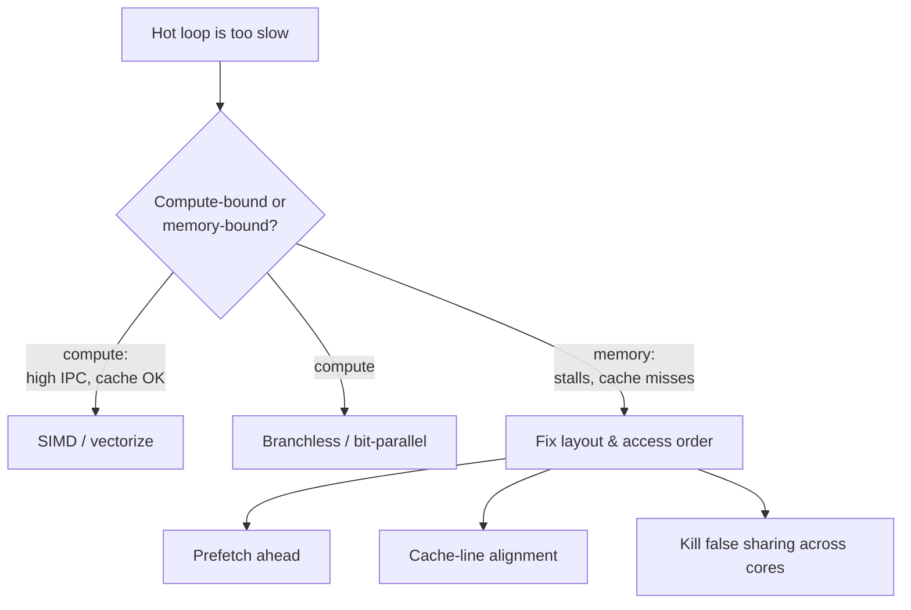

# Advanced Topics and Modern Optimizations

## Why this chapter exists

Every algorithm in the preceding chapters was analyzed against an imaginary machine: one
instruction at a time, every memory access equally cheap, every branch free. That model is what
Big-O measures, and [Chapter 2](https://data-structures-on-systems.vercel.app/chapters/complexity-analysis) already warned you it hides the two
things that decide real performance. A modern CPU violates the model in four ways that matter here:

- It executes **one instruction across many data lanes at once** (SIMD).
- It **speculates past branches**, and pays 15-20 cycles when it guesses wrong.
- It reads memory in **64-byte cache lines** through a tiered hierarchy where a miss costs
  100x a hit ([Chapter 5](https://data-structures-on-systems.vercel.app/chapters/memory-hierarchy)).
- It has **many cores** that fight over those cache lines.

This chapter is about closing the gap between the textbook algorithm and the machine it runs on. We
use exact string search — the algorithms of [Chapter 9](https://data-structures-on-systems.vercel.app/chapters/string-search-algorithms) — as the
running example, because it is simple enough to fit in your head and stresses every one of those
four hardware realities. The techniques (vectorization, branchless code, bit-parallelism,
cache-line alignment, prefetching) transfer directly to hashing, sorting, parsing, and any hot loop
you will ever profile.

The single most useful habit this chapter can give you is knowing which lever to pull. Profile
first, then:



Pulling the SIMD lever on a memory-bound loop wins you nothing — the cores were already idle,
waiting on RAM. Knowing which world you are in is most of the battle.

## Optimal-hash q-gram matching

Rabin-Karp (Chapter 9) hashes a window of text and compares it to the pattern's hash. Its weakness
is collisions: two different windows can share a hash, forcing an expensive character-by-character
verification that usually fails. The **optimal-hash** family removes collisions by construction.

The idea: instead of hashing the whole window, index the pattern by its **q-grams** (substrings of
length `q`) and pick the smallest `q` at which every q-gram of the pattern is *unique*. Once
q-grams are unique, a matching q-gram pins the alignment exactly — there is nothing to disambiguate
— so verification almost never runs, and a *non*-matching q-gram lets you skip `q` positions at
once.

**Pattern `"ABCD"`.** At `q = 2` the q-grams `"AB"`, `"BC"`, `"CD"` are all distinct, so `q = 2` is
optimal. Searching `"XYZABCDEF"`, you read a 2-byte window, and any window not in `{AB, BC, CD}`
(like `"XY"` or `"ZA"`) means no alignment here — jump ahead by 2 rather than 1.

```cpp
#include <string>
#include <vector>
#include <unordered_map>

class OptimalHashMatcher {
    std::string pattern_;
    int q_;
    std::unordered_map<std::string, int> pos_;   // q-gram -> its index in the pattern

    // Smallest q at which every q-gram of the pattern is unique.
    int findOptimalQ() const {
        int m = (int)pattern_.size();
        for (int q = 1; q <= m; ++q) {
            std::unordered_map<std::string, int> seen;
            bool unique = true;
            for (int i = 0; i + q <= m; ++i)
                if (seen[pattern_.substr(i, q)]++ > 0) { unique = false; break; }
            if (unique) return q;
        }
        return m;   // pattern is all one repeated character
    }

public:
    explicit OptimalHashMatcher(std::string pattern) : pattern_(std::move(pattern)) {
        q_ = findOptimalQ();
        for (int i = 0; i + q_ <= (int)pattern_.size(); ++i)
            pos_[pattern_.substr(i, q_)] = i;
    }

    std::vector<int> search(const std::string& text) const {
        std::vector<int> matches;
        int n = (int)text.size(), m = (int)pattern_.size();
        if (m == 0 || n < m) return matches;

        int i = 0;
        while (i <= n - m) {
            std::string gram = text.substr(i, q_);
            auto it = pos_.find(gram);
            if (it != pos_.end() && it->second == 0) {   // aligns pattern start here
                if (text.compare(i, m, pattern_) == 0) matches.push_back(i);
                ++i;
            } else {
                i += q_;                                  // no q-gram at this window: skip q
            }
        }
        return matches;
    }
};
```

The `substr` allocations above are for clarity; a production version hashes the q-gram in place
with a rolling hash and never allocates. **Complexity:** with unique q-grams and random text the
scan is sublinear on average (roughly `O(n/q)` windows examined); the worst case is still `O(nm)`
on adversarial, highly repetitive input. A common refinement, **elongated q-grams**, does the
opposite of `findOptimalQ` — it picks the *largest* `q` that keeps q-grams unique, trading a bigger
index for longer skips.

## SIMD: one instruction, thirty-two comparisons

Character-by-character comparison wastes a 256-bit-wide machine one byte at a time. A single AVX2
instruction compares 32 bytes against 32 bytes and hands you a 32-bit mask of which lanes matched.
The winning pattern for search is **filter, then verify**: use SIMD to reject almost every position
cheaply, and run the expensive full comparison only on the handful of survivors.

The classic trick (Wojciech Muła's `sse4-strstr`) broadcasts the pattern's **first and last** byte,
compares both against 32 text positions at once, and only inspects the middle where *both* ends
already agree. On real text, first-and-last agreeing by chance is rare, so verification almost never
runs.

```cpp
#include <immintrin.h>   // AVX2; compile with -mavx2
#include <cstring>
#include <cstdint>
#include <string>
#include <vector>

// All occurrences of pat in txt, filtered by AVX2 and verified with memcmp.
std::vector<int> simd_search(const std::string& txt, const std::string& pat) {
    std::vector<int> out;
    const int n = (int)txt.size(), m = (int)pat.size();
    if (m == 0 || n < m) return out;

    const __m256i first = _mm256_set1_epi8(pat.front());
    const __m256i last  = _mm256_set1_epi8(pat.back());

    int i = 0;
    // Need to load 32 bytes at i and at i+m-1, both in bounds.
    for (; i + 32 + m - 1 <= n; i += 32) {
        __m256i bf = _mm256_loadu_si256((const __m256i*)(txt.data() + i));
        __m256i bl = _mm256_loadu_si256((const __m256i*)(txt.data() + i + m - 1));
        __m256i eq = _mm256_and_si256(_mm256_cmpeq_epi8(first, bf),
                                      _mm256_cmpeq_epi8(last,  bl));
        uint32_t mask = _mm256_movemask_epi8(eq);     // bit b set => candidate at i+b
        while (mask) {
            int b = __builtin_ctz(mask);              // lowest candidate offset
            if (std::memcmp(txt.data() + i + b, pat.data(), m) == 0)
                out.push_back(i + b);
            mask &= mask - 1;                          // clear that bit, keep going
        }
    }
    for (; i <= n - m; ++i)                            // scalar tail
        if (std::memcmp(txt.data() + i, pat.data(), m) == 0)
            out.push_back(i);
    return out;
}
```

Two details are load-bearing and are where hand-written SIMD usually goes wrong:

- **The tail.** The vector loop stops when a 32-byte load would run past the buffer; the scalar loop
  finishes the last few positions. Forget this and you get an out-of-bounds read that a fuzzer will
  find on day one.
- **Unaligned loads.** `_mm256_loadu_si256` (the `u` is for unaligned) is mandatory here — text
  positions are not 32-byte aligned. Using the aligned `_mm256_load_si256` on this pointer is
  undefined behavior and faults.

`__builtin_ctz` finds the next set bit and `mask &= mask - 1` clears the lowest set bit — the
standard idiom for iterating a bitmask, which we reuse in the next section. This filter-then-verify
shape is exactly how a modern `memchr`, `std::string::find`, and JSON/HTTP parsers scan for
delimiters. The lesson generalizes: **whenever a hot loop tests one element at a time, ask whether
one instruction could test a whole cache line's worth at once.**

## Branchless code and branch prediction

A mispredicted branch costs 15-20 cycles while the pipeline refills. A branch the CPU predicts
correctly is nearly free. The difference between the two is not the `if` — it is whether the
*outcome is predictable*. A data-dependent branch that goes each way about half the time,
unpredictably, is the worst case.

The canonical demonstration: sum the elements of an array that exceed a threshold. On a **sorted**
array the branch flips exactly once and the predictor is right ~100% of the time. On a **shuffled**
array with the same values it flips randomly and mispredicts ~50% of the time — the identical code
runs several times slower purely because of branch prediction.

```cpp
#include <vector>

// Branchy: on random data the compare mispredicts ~50% of the time.
long sum_over_branchy(const std::vector<int>& v, int t) {
    long sum = 0;
    for (int x : v)
        if (x >= t) sum += x;
    return sum;
}

// Branchless: fold the condition into a mask. No branch => nothing to mispredict.
long sum_over_branchless(const std::vector<int>& v, int t) {
    long sum = 0;
    for (int x : v) {
        long take = -(long)(x >= t);   // (x>=t) is 0 or 1  ->  0x0 or 0xFFFF...F
        sum += x & take;               // keep x, or add zero
    }
    return sum;
}
```

`-(long)(x >= t)` turns the boolean into a full-width mask — all-zeros or all-ones — and `x & take`
adds either `x` or `0` with no control flow. The compiler emits a `cmov` or a masked add instead of
a jump, so there is no branch to predict. This is the same maneuver SIMD makes structural: a vector
compare *is* a branchless mask across 32 lanes.

Branchless is not a free win. It always does the work of both sides, so if a branch is *predictable*
(an error path taken 0.001% of the time), leave it branchy — the predictor makes it free and
branchless would force you to compute the unused side every iteration. Reach for branchless only
when profiling shows a hot, genuinely unpredictable branch.

> **Failure mode.** People "optimize" cold, predictable branches into branchless code and make
> things slower, because they paid to compute both sides and the predictor was already handling the
> branch for free. Measure the misprediction rate (`perf stat -e branch-misses`) before you reach
> for this.

## Bit-parallelism: the whole comparison in one word

SIMD widens comparison to 32 bytes; **bit-parallelism** does something subtler — it encodes the
entire matching *state machine* in the bits of a single machine word and advances it with a couple
of arithmetic ops per character. The **Shift-And** algorithm keeps a bitmask where bit `j` means
"the pattern's first `j+1` characters match the text ending here." Each new character shifts the
mask left (extend every partial match by one) and ANDs in a per-character mask (keep only the
matches the new character actually continues).

```cpp
#include <string>
#include <vector>
#include <cstdint>

// Shift-And: exact search for patterns up to 64 characters, branch-free inner loop.
std::vector<int> shift_and_search(const std::string& txt, const std::string& pat) {
    std::vector<int> out;
    const int n = (int)txt.size(), m = (int)pat.size();
    if (m == 0 || m > 64 || n < m) return out;

    uint64_t mask[256] = {0};                 // mask[c] bit j set  <=>  pat[j] == c
    for (int j = 0; j < m; ++j)
        mask[(unsigned char)pat[j]] |= (1ULL << j);

    const uint64_t match_bit = 1ULL << (m - 1);
    uint64_t state = 0;
    for (int i = 0; i < n; ++i) {
        state = ((state << 1) | 1ULL) & mask[(unsigned char)txt[i]];
        if (state & match_bit) out.push_back(i - m + 1);
    }
    return out;
}
```

The inner loop is three operations, no data-dependent branch, and touches only a 256-entry table
that lives in L1. For patterns up to the word width (64 here) it is genuinely fast and, more
importantly, it extends cleanly to problems plain comparison cannot: allow one mismatch (Shift-And
with a small ladder of states) or add wildcards and character classes, and you have the engine
inside `grep`-style matchers and simple regex evaluators. The ceiling is the word size — beyond 64
characters you chain multiple words, and the constant factor grows.

## Scan order and skipping: Boyer-Moore-Horspool

The naive scanner tests the pattern left-to-right and advances one position on a mismatch. Two
independent ideas make it dramatically faster in practice: **scan from the right**, and **skip by
more than one** when you mismatch. Boyer-Moore-Horspool — the practical, easy-to-get-right member of
the Boyer-Moore family — does both with a single bad-character table.

The insight: after aligning the pattern, look at the text character sitting under the *last*
position of the window. If that character does not appear in the pattern at all, no alignment that
covers it can match, so you can shift the whole pattern past it in one jump.

```cpp
#include <array>
#include <string>
#include <vector>

std::vector<int> horspool_search(const std::string& txt, const std::string& pat) {
    std::vector<int> out;
    const int n = (int)txt.size(), m = (int)pat.size();
    if (m == 0 || n < m) return out;

    // shift[c] = distance to move when the window's last byte is c.
    std::array<int, 256> shift;
    shift.fill(m);
    for (int i = 0; i < m - 1; ++i)                    // last char deliberately excluded
        shift[(unsigned char)pat[i]] = m - 1 - i;

    int i = 0;
    while (i <= n - m) {
        int j = m - 1;
        while (j >= 0 && txt[i + j] == pat[j]) --j;    // compare right-to-left
        if (j < 0) out.push_back(i);
        i += shift[(unsigned char)txt[i + m - 1]];     // always >= 1, so no infinite loop
    }
    return out;
}
```

On English text or DNA the average shift is close to `m`, giving strongly sublinear behavior — the
longer the pattern, the *faster* the search, which is the counterintuitive hallmark of the
Boyer-Moore family. The worst case remains `O(nm)` on pathological input (e.g., searching `"aaaa"`
in `"aaaa...a"`), which full Boyer-Moore's good-suffix rule bounds to `O(n)` at the cost of a second
table.

The scan-*order* idea generalizes further. The **Reverse Colussi** algorithm precomputes an order
that tests the pattern's most-discriminating positions first, maximizing the chance of an early
mismatch. It is more intricate to implement correctly than Horspool and rarely worth it in practice
— Horspool's simplicity and cache behavior usually win — but it makes the principle explicit: *the
order in which you compare is itself a tunable parameter.*

## False sharing: when alignment is a correctness-adjacent bug

Now we cross from single-core to many-core. Suppose you parallelize a search by giving each thread a
chunk of text and a private match counter. The counters are logically independent, so there should
be no contention — yet the parallel version can run *slower* than single-threaded. The culprit is
**false sharing** ([Chapter 5](https://data-structures-on-systems.vercel.app/chapters/memory-hierarchy#false-sharing-and-cache-coherency)).

Cache coherency operates at cache-line granularity, not variable granularity. If two threads'
counters land in the same 64-byte line, every increment by one core invalidates the line in the
other's cache. The cores ping-pong exclusive ownership of that line back and forth across the
interconnect, turning independent writes into a serialized, latency-bound crawl. Nothing is shared
in your source; everything is shared in the cache.

The fix is to pad each thread's data onto its own cache line:

```cpp
#include <atomic>
#include <new>          // std::hardware_destructive_interference_size (C++17)
#include <cstddef>

#ifdef __cpp_lib_hardware_interference_size
constexpr std::size_t kLine = std::hardware_destructive_interference_size;
#else
constexpr std::size_t kLine = 64;   // the common x86/ARM cache-line size
#endif

// BAD: eight of these pack into one 64-byte line -> false sharing between threads.
struct Counter { std::atomic<long> n{0}; };

// GOOD: each counter owns a full cache line; neighbors never invalidate it.
struct alignas(kLine) PaddedCounter {
    std::atomic<long> n{0};
    char pad[kLine - sizeof(std::atomic<long>)];
};
```

`alignas` guarantees each `PaddedCounter` starts on a line boundary, and the padding guarantees the
next one starts on the next line. The trade is memory: you burn ~56 bytes of padding per counter to
buy back the interconnect. That is almost always worth it for hot, per-thread accumulators, and
almost never worth it for cold or read-mostly data.

> **Failure mode.** False sharing is invisible in the source and in single-threaded profiles — the
> code is correct and fast until you add threads, then throughput collapses and *worsens* with more
> cores. `perf c2c` (cache-to-cache) is the tool that names the offending line.

## Prefetching: hiding the miss you cannot avoid

Sequential scans ([SIMD: one instruction, thirty-two comparisons](#simd-one-instruction-thirty-two-comparisons), [Scan order and skipping: Boyer-Moore-Horspool](#scan-order-and-skipping-boyer-moore-horspool)) are cache-friendly because the hardware prefetcher sees the stride
and fetches ahead automatically. The hard case is **random** access — probing a hash table, chasing
pointers, gathering through an index array — where the CPU cannot predict the next address and
stalls ~200 cycles on each miss.

When *you* know the address before you need it, you can issue a **software prefetch** to start the
fetch early and overlap it with useful work. The pattern is to run a fixed distance ahead of the
loop body:

```cpp
#include <vector>

// Gather-sum through a random index array, prefetching PF iterations ahead.
long gather_sum(const std::vector<int>& data, const std::vector<int>& idx) {
    long sum = 0;
    const int n = (int)idx.size();
    constexpr int PF = 16;              // prefetch distance: tune to hide ~200 cycles
    for (int i = 0; i < n; ++i) {
        if (i + PF < n)
            __builtin_prefetch(&data[idx[i + PF]], /*rw=*/0, /*locality=*/3);
        sum += data[idx[i]];            // this load would otherwise stall on a miss
    }
    return sum;
}
```

`__builtin_prefetch(addr, 0, 3)` requests a read (`0`) with high temporal locality (`3`, keep it in
all cache levels); the intrinsic form is `_mm_prefetch(addr, _MM_HINT_T0)`. The distance `PF` is the
one knob: too small and the data has not arrived when you need it; too large and you evict it before
use, or prefetch past the end. There is no substitute for measuring — sweep `PF` over `{4, 8, 16,
32}` and keep the winner for your access pattern and hardware.

Prefetching is a scalpel, not a hammer. The hardware prefetcher already handles sequential and
simple strided access, so prefetching those does nothing. Software prefetch earns its keep only on
irregular access where you can compute the address ahead of the use — and if you can *restructure*
the algorithm to be sequential instead (see [Chapter 5](https://data-structures-on-systems.vercel.app/chapters/memory-hierarchy)
on SoA layouts and blocking), that beats prefetching every time.

## GPU acceleration: throughput over latency

A CPU minimizes the latency of one task; a GPU maximizes the throughput of thousands. For exact
search over a large corpus, that maps naturally onto the hardware: give each of tens of thousands of
threads a starting position and let them all test in parallel. The **CUSMART** project did exactly
this, porting 64 SMART string-matching algorithms to CUDA and reporting 10-25x throughput over an
8-core CPU on large texts.

The kernel is embarrassingly simple — the engineering is all in the memory movement. One correctness
detail trips up newcomers: **a CUDA `__global__` kernel must be a free function, not a class member.**

```cpp
#include <cuda_runtime.h>

// Each thread tests a grid-strided set of start positions.
__global__ void match_kernel(const char* text, const char* pat,
                             int n, int m, int* out, int* count) {
    int start = blockIdx.x * blockDim.x + threadIdx.x;
    int stride = blockDim.x * gridDim.x;
    for (int i = start; i + m <= n; i += stride) {
        bool hit = true;
        for (int j = 0; j < m; ++j)
            if (text[i + j] != pat[j]) { hit = false; break; }
        if (hit) out[atomicAdd(count, 1)] = i;   // atomic bump reserves an output slot
    }
}

std::vector<int> gpu_search(const std::string& txt, const std::string& pat) {
    int n = (int)txt.size(), m = (int)pat.size();
    if (m == 0 || n < m) return {};

    char *d_txt, *d_pat; int *d_out, *d_count;
    cudaMalloc(&d_txt, n);           cudaMalloc(&d_pat, m);
    cudaMalloc(&d_out, n * sizeof(int));   cudaMalloc(&d_count, sizeof(int));
    cudaMemcpy(d_txt, txt.data(), n, cudaMemcpyHostToDevice);
    cudaMemcpy(d_pat, pat.data(), m, cudaMemcpyHostToDevice);
    cudaMemset(d_count, 0, sizeof(int));

    int block = 256, grid = (n + block - 1) / block;
    match_kernel<<<grid, block>>>(d_txt, d_pat, n, m, d_out, d_count);
    cudaDeviceSynchronize();

    int count = 0;
    cudaMemcpy(&count, d_count, sizeof(int), cudaMemcpyDeviceToHost);
    std::vector<int> out(count);
    if (count) cudaMemcpy(out.data(), d_out, count * sizeof(int), cudaMemcpyDeviceToHost);
    cudaFree(d_txt); cudaFree(d_pat); cudaFree(d_out); cudaFree(d_count);
    return out;                       // note: positions are unordered; sort if needed
}
```

Two caveats decide whether this is a win. First, the **PCIe transfer** of text host-to-device often
costs more than the search itself — the GPU only pays off when the corpus already lives on the
device or is reused across many patterns (intrusion detection scanning millions of packets against
thousands of signatures is the textbook fit). Second, **thread divergence**: when threads in a warp
take different branches (some verifying, some not), the warp serializes them, so the raw core count
overstates real throughput. GPUs win at scale and lose at small inputs; the CPU SIMD path of [SIMD: one instruction, thirty-two comparisons](#simd-one-instruction-thirty-two-comparisons)
is the right tool for anything that fits in cache.

## Quantum matching: a reality check

Grover's algorithm searches an unstructured space of `n` items in `O(√n)` oracle queries versus the
classical `O(n)`, and string matching can be phrased as finding a position where an oracle reports a
match — so in principle it offers a quadratic speedup. It is worth understanding the shape of the
claim, and worth being honest about the practice.

The speedup is in *query* count against a black-box oracle, not wall-clock time on data you already
hold in memory. Building the oracle still has to encode the text and pattern into quantum state,
and today's hardware has too few qubits and too high an error rate to run it on inputs where the
classical algorithm is not instant. For the foreseeable future, quantum string matching is a
theory-of-computation result, not an engineering tool. The bit-parallel and SIMD techniques in this
chapter are where the real, shippable speedups live.

## Measuring it honestly

Every claim in this chapter is a claim about a specific machine, and the only way to trust one is to
measure it on yours. Theoretical complexity does not capture cache behavior, branch prediction, or
memory bandwidth — the very effects these optimizations target — so the benchmark *is* the analysis.
A few rules that keep numbers honest:

- **Warm up, then measure many iterations** with a high-resolution clock; report the median, not the
  mean (one OS hiccup wrecks a mean).
- **Defeat the optimizer.** A benchmark whose result is unused is legally deleted; consume the output
  (e.g., feed it to a volatile sink) or the compiler will "optimize" your loop to nothing.
- **Use hardware counters,** not just wall-clock: `perf stat` reports IPC, cache misses, and
  branch-misses, which tell you *why* a number moved — the difference between [Branchless code and branch prediction](#branchless-code-and-branch-prediction)'s branchy and
  branchless loops shows up as a branch-miss delta, not a mystery.
- **Test realistic data.** Match rate, alphabet size, and pattern length swing these algorithms by
  an order of magnitude; a benchmark on random bytes tells you little about your logs or your genome.

[Chapter 21](https://data-structures-on-systems.vercel.app/chapters/benchmarking-and-load-testing) develops this into a full methodology, and the
book's online edition runs several of these comparisons live in your browser so you can watch the
gap open on your own CPU.

## Summary

The through-line of this chapter is a single shift in perspective: stop treating the CPU as the
abstract machine of Big-O and start treating it as the wide, speculative, cache-tiered, many-core
device it actually is.

- **Match the lever to the bottleneck.** SIMD and branchless code fix compute-bound loops; layout,
  prefetching, and killing false sharing fix memory-bound ones. Profile before you choose.
- **Filter, then verify** is the master pattern for scanning — SIMD ([SIMD: one instruction, thirty-two comparisons](#simd-one-instruction-thirty-two-comparisons)), q-gram skipping
  ([Optimal-hash q-gram matching](#optimal-hash-q-gram-matching)), and Horspool ([Scan order and skipping: Boyer-Moore-Horspool](#scan-order-and-skipping-boyer-moore-horspool)) are all the same idea: reject the many cheaply, examine the few
  carefully.
- **Predictability beats cleverness** at the branch level; **one instruction beats one byte** at the
  data level; and **one writer per cache line** is the rule that keeps parallel code from
  collapsing.
- **Exotic hardware has a narrow window.** GPUs win only when data already lives on the device and
  amortizes the transfer; quantum matching is not yet an engineering option. The durable wins are the
  hardware-aware techniques you can apply on the machine already on your desk.

## References and further reading

**Optimal-hash and q-gram matching**
- Lecroq, T. (2007). "Fast exact string matching algorithms." *Information Processing Letters*,
  102(6), 229-235.
- Karp, R. M., & Rabin, M. O. (1987). "Efficient randomized pattern-matching algorithms." *IBM J.
  Res. Dev.*, 31(2), 249-260.

**SIMD and bit-parallelism**
- Muła, W. "SIMD-friendly algorithms for substring searching." (`0x80.pl`) — the first/last-byte
  filter used in [SIMD: one instruction, thirty-two comparisons](#simd-one-instruction-thirty-two-comparisons).
- Baeza-Yates, R., & Gonnet, G. (1992). "A new approach to text searching." *CACM*, 35(10), 74-82 —
  the Shift-Or/Shift-And family.
- Navarro, G., & Raffinot, M. (2002). *Flexible Pattern Matching in Strings.* Cambridge University
  Press — the definitive treatment of bit-parallel matching.

**Scan order and skipping**
- Horspool, R. N. (1980). "Practical fast searching in strings." *Software: Practice and
  Experience*, 10(6), 501-506.
- Boyer, R. S., & Moore, J. S. (1977). "A fast string searching algorithm." *CACM*, 20(10), 762-772.
- Colussi, L. (1991). "Correctness and efficiency of pattern matching algorithms." *Information and
  Computation*, 95(2), 225-251.

**Hardware-aware optimization**
- Drepper, U. (2007). "What every programmer should know about memory." — the canonical treatment of
  caches, false sharing, and prefetching.
- Frigo, M., et al. (1999). "Cache-oblivious algorithms." *FOCS*, 285-297.
- Fog, A. *Optimizing software in C++* and the *Instruction Tables* — branch prediction, `cmov`, and
  intrinsic latencies.

**GPU and quantum**
- Kouzinopoulos, C. S., & Margaritis, K. G. (2015). "String matching on a multicore GPU using CUDA."
  *PPAM*, 241-250 — the CUSMART results.
- Grover, L. K. (1996). "A fast quantum mechanical algorithm for database search." *STOC*, 212-219.
- Montanaro, A. (2016). "Quantum pattern matching fast on average." *Algorithmica*, 77(1), 16-39.
