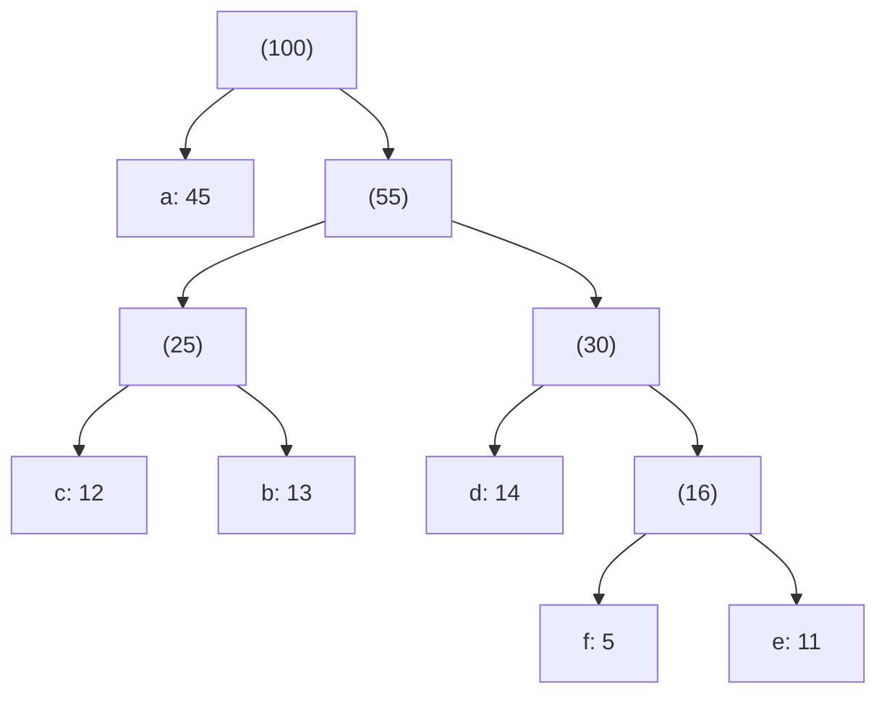

# Greedy Algorithms

A greedy algorithm is the most optimistic strategy in the book: at every step it grabs whatever looks best right now and never looks back. No branching, no backtracking, no table of subproblems — just a sequence of committed local decisions. When that optimism is justified, greedy is the cheapest way to an optimal answer you will ever find: usually a sort plus a single pass, `O(n log n)` and a few lines of code. When it isn't justified, greedy fails silently, returning a plausible-looking answer that is simply wrong.

So the whole subject reduces to one question, and this chapter is organized around it: **when is a locally optimal choice provably globally optimal?** Get that right and greedy is a scalpel. Get it wrong and you have shipped a bug that only surfaces on inputs you didn't test. The discipline here isn't writing the loop — the loop is trivial — it's the proof that the loop is allowed to exist.

## The shape of every greedy algorithm

Strip away the specifics and every greedy algorithm has the same skeleton: impose an order on the choices, then walk that order once, taking each choice that stays feasible.

```
sort or heap-order the candidates by the greedy criterion
for each candidate in that order:
    if taking it keeps the partial solution feasible:
        take it
```

That's it. The activity scheduler, Huffman's encoder, Kruskal's MST builder, and Dijkstra's shortest-path search are all this loop with a different ordering criterion and a different feasibility test. What separates a correct greedy algorithm from a wrong one is never the loop — it's whether the ordering criterion has been *proven* to lead to a global optimum.

Two properties, together, are what make that proof possible:

- **The greedy-choice property.** There exists an optimal solution that includes the very first choice greedy makes. You are never forced to give up optimality by taking the greedy pick — it's always *safe*.
- **Optimal substructure.** After you commit that choice, what remains is a smaller instance of the same problem, and an optimal solution to the remainder plus your choice is optimal overall.

If both hold, induction finishes the job: the first greedy choice is safe, the rest of the problem is the same problem, so by induction the whole run is optimal. If either fails, greedy has no right to be correct, and you almost certainly want [dynamic programming](https://data-structures-on-systems.vercel.app/chapters/dynamic-programming) instead — which considers *all* choices at each step precisely because no single local choice is safe.

The workhorse tool for proving the greedy-choice property is the **exchange argument**, and it's worth learning once because it recurs across every problem below: take any optimal solution, show that you can swap the greedy choice in for whatever it did first *without making the solution worse*, and you've proven the greedy choice belongs to some optimal solution. We'll do it concretely in a moment.

## Interval scheduling: the exchange argument in the flesh

You have a set of jobs, each with a start and finish time, and one machine. You can run any set of jobs whose intervals don't overlap. Maximize how many you run. This is the *activity selection* problem, and it is the cleanest place to see why greedy works.

The tempting criteria are wrong in instructive ways. Pick the *shortest* jobs first and a single short job wedged across two long ones can block a better pair. Pick the *earliest-starting* jobs and one job that starts early but runs all day sinks you. The criterion that works is **earliest finish time**: always take the compatible job that frees the machine soonest.

The intuition: finishing early leaves the most room for everything after. The proof is the exchange argument. Let `a` be the job with the earliest finish time overall, and let `S` be any optimal schedule. If `S` already contains `a`, done. If not, look at the first job `S` runs, call it `a'`. Because `a` finishes no later than `a'` and `a` is compatible with everything after `a'`, we can swap `a'` out and `a` in. The result is still a valid schedule with the *same* number of jobs — still optimal — and now it contains the greedy choice. The greedy choice is safe. Optimal substructure is immediate: once `a` is fixed, the problem is "schedule the jobs that start after `a` finishes," the identical problem on a smaller set. Induction does the rest.

```cpp
#include <vector>
#include <algorithm>
#include <climits>

struct Interval {
    int start;
    int finish;
};

std::vector<Interval> scheduleMax(std::vector<Interval> jobs) {
    std::sort(jobs.begin(), jobs.end(),
              [](const Interval& a, const Interval& b) {
                  return a.finish < b.finish;
              });

    std::vector<Interval> chosen;
    int lastFinish = INT_MIN;              // nothing scheduled yet
    for (const Interval& j : jobs) {
        if (j.start >= lastFinish) {       // compatible with the last pick
            chosen.push_back(j);
            lastFinish = j.finish;
        }
    }
    return chosen;
}
```

```python
def schedule_max(jobs):
    # each job is a (start, finish) tuple
    jobs.sort(key=lambda j: j[1])          # sort by finish time

    chosen = []
    last_finish = float('-inf')            # nothing scheduled yet
    for start, finish in jobs:
        if start >= last_finish:           # compatible with the last pick
            chosen.append((start, finish))
            last_finish = finish
    return chosen
```

```java
class Interval {
    int start, finish;
    Interval(int start, int finish) { this.start = start; this.finish = finish; }
}

static List<Interval> scheduleMax(List<Interval> jobs) {
    jobs.sort((a, b) -> Integer.compare(a.finish, b.finish));  // sort by finish time

    List<Interval> chosen = new ArrayList<>();
    int lastFinish = Integer.MIN_VALUE;        // nothing scheduled yet
    for (Interval j : jobs) {
        if (j.start >= lastFinish) {           // compatible with the last pick
            chosen.add(j);
            lastFinish = j.finish;
        }
    }
    return chosen;
}
```

```go
type Interval struct {
    start, finish int
}

func scheduleMax(jobs []Interval) []Interval {
    sort.Slice(jobs, func(i, j int) bool { // sort by finish time
        return jobs[i].finish < jobs[j].finish
    })

    var chosen []Interval
    lastFinish := math.MinInt // nothing scheduled yet
    for _, j := range jobs {
        if j.start >= lastFinish { // compatible with the last pick
            chosen = append(chosen, j)
            lastFinish = j.finish
        }
    }
    return chosen
}
```

The sort is `O(n log n)` and dominates; the scan is `O(n)`. Note the loop never dereferences an out-of-range element the way a "grab `jobs[0]` first" formulation would — an empty input simply returns an empty schedule. This same skeleton, with the feasibility test swapped, solves "minimum number of rooms to hold every meeting" and "fewest intervals to remove so none overlap." Sort by finish, sweep once.

## Fractional knapsack: greedy works, and its twin where it doesn't

You have a knapsack of capacity `W` and items with a weight and a value, and — crucially — you may take *fractions* of an item. Maximize total value. The greedy criterion is **value density**: sort by value-per-unit-weight and fill greedily, taking a fraction of the last item that overflows.

```cpp
struct Item {
    double weight;
    double value;
};

double fractionalKnapsack(std::vector<Item> items, double capacity) {
    std::sort(items.begin(), items.end(),
              [](const Item& a, const Item& b) {
                  return a.value / a.weight > b.value / b.weight;
              });

    double total = 0.0;
    for (const Item& it : items) {
        if (capacity <= 0) break;
        double take = std::min(it.weight, capacity);   // whole item or a slice
        total += take * (it.value / it.weight);
        capacity -= take;
    }
    return total;
}
```

```python
def fractional_knapsack(items, capacity):
    # each item is a (weight, value) tuple
    items.sort(key=lambda it: it[1] / it[0], reverse=True)

    total = 0.0
    for weight, value in items:
        if capacity <= 0:
            break
        take = min(weight, capacity)       # whole item or a slice
        total += take * (value / weight)
        capacity -= take
    return total
```

```java
class Item {
    double weight, value;
    Item(double weight, double value) { this.weight = weight; this.value = value; }
}

static double fractionalKnapsack(List<Item> items, double capacity) {
    items.sort((a, b) -> Double.compare(b.value / b.weight, a.value / a.weight));

    double total = 0.0;
    for (Item it : items) {
        if (capacity <= 0) break;
        double take = Math.min(it.weight, capacity);   // whole item or a slice
        total += take * (it.value / it.weight);
        capacity -= take;
    }
    return total;
}
```

```go
type Item struct {
    weight, value float64
}

func fractionalKnapsack(items []Item, capacity float64) float64 {
    sort.Slice(items, func(i, j int) bool {
        return items[i].value/items[i].weight > items[j].value/items[j].weight
    })

    total := 0.0
    for _, it := range items {
        if capacity <= 0 {
            break
        }
        take := math.Min(it.weight, capacity) // whole item or a slice
        total += take * (it.value / it.weight)
        capacity -= take
    }
    return total
}
```

The exchange argument again: if a solution ever puts weight into a lower-density item while a higher-density item is available and not fully used, swap a sliver of the low for the high. Value goes up (or stays equal), weight is unchanged. So a fully-greedy fill is optimal. Because we can take arbitrary fractions, there's always a sliver to swap, and the argument never gets stuck.

That last sentence is the whole difference between this problem and its famous twin. In **0-1 knapsack** each item is all-or-nothing, and greedy by density breaks:

```cpp
// items: (value 60, weight 10), (value 100, weight 20), (value 120, weight 30)
// capacity 50, densities 6.0, 5.0, 4.0
//
// greedy by density: take item 1 (60), then item 2 (100) -> weight 30,
//   item 3 needs 30, only 20 left -> total 160
// optimal:           skip item 1, take items 2 and 3      -> total 220
```

The indivisibility is the killer. Taking the densest item first commits 10 units of capacity that would have been better spent as part of the 2+3 combination, and because you can't take a fraction of anything, there's no sliver to swap back — the exchange argument dies. No local criterion is safe, so 0-1 knapsack belongs to [dynamic programming](https://data-structures-on-systems.vercel.app/chapters/dynamic-programming), which weighs every subset implicitly. The tell is general: **when a choice is indivisible and blocks a strictly better combination, greedy fails and DP is the fallback.**

## Huffman coding: greedy as the engine of compression

Every time a file is gzipped, a PNG is written, or an HTTP/2 header block is packed, a greedy algorithm is running underneath. Huffman coding builds an optimal *prefix-free* code: frequent symbols get short bit-strings, rare ones get long, and no code is a prefix of another, so the decoder never needs delimiters.

The greedy insight is a bottom-up merge. The two *least* frequent symbols will sit deepest in the code tree — they can afford the longest codes — so pair them under a new node whose frequency is their sum, drop that node back into the pool, and repeat until one tree remains. A min-heap keyed on frequency makes "the two least frequent" an `O(log n)` operation, so building the tree over `n` symbols is `O(n log n)`.



Reading left-branch-0, right-branch-1 from the root gives each leaf its code: `a` (the most frequent) lands at depth 1 with a single bit, while the rare `f` sits deep. That inverse relationship between frequency and code length is exactly what minimizes total encoded size.

```cpp
#include <queue>
#include <vector>
#include <unordered_map>
#include <string>

struct Node {
    int freq;
    char sym;          // meaningful only in leaves
    Node* left;
    Node* right;
};

struct Greater {
    bool operator()(const Node* a, const Node* b) const {
        return a->freq > b->freq;   // min-heap: smallest freq on top
    }
};

Node* buildHuffman(const std::unordered_map<char, int>& freqs) {
    std::priority_queue<Node*, std::vector<Node*>, Greater> pq;
    for (const auto& [sym, f] : freqs)
        pq.push(new Node{f, sym, nullptr, nullptr});

    while (pq.size() > 1) {
        Node* l = pq.top(); pq.pop();
        Node* r = pq.top(); pq.pop();
        pq.push(new Node{l->freq + r->freq, '\0', l, r});
    }
    return pq.top();   // root
}

void buildCodes(const Node* n, const std::string& code,
                std::unordered_map<char, std::string>& out) {
    if (!n) return;
    if (!n->left && !n->right) {
        // a lone symbol still needs one bit, not the empty string
        out[n->sym] = code.empty() ? "0" : code;
        return;
    }
    buildCodes(n->left,  code + "0", out);
    buildCodes(n->right, code + "1", out);
}
```

```python
import heapq

class Node:
    def __init__(self, freq, sym=None, left=None, right=None):
        self.freq = freq
        self.sym = sym          # meaningful only in leaves
        self.left = left
        self.right = right

    def __lt__(self, other):    # min-heap: smallest freq on top
        return self.freq < other.freq

def build_huffman(freqs):
    pq = [Node(f, sym) for sym, f in freqs.items()]
    heapq.heapify(pq)

    while len(pq) > 1:
        l = heapq.heappop(pq)
        r = heapq.heappop(pq)
        heapq.heappush(pq, Node(l.freq + r.freq, None, l, r))
    return pq[0]   # root

def build_codes(n, code, out):
    if not n:
        return
    if not n.left and not n.right:
        # a lone symbol still needs one bit, not the empty string
        out[n.sym] = code if code else "0"
        return
    build_codes(n.left, code + "0", out)
    build_codes(n.right, code + "1", out)
```

```java
class Node {
    int freq;
    char sym;          // meaningful only in leaves
    Node left, right;
    Node(int freq, char sym, Node left, Node right) {
        this.freq = freq; this.sym = sym; this.left = left; this.right = right;
    }
}

static Node buildHuffman(Map<Character, Integer> freqs) {
    PriorityQueue<Node> pq = new PriorityQueue<>((a, b) -> a.freq - b.freq); // min-heap
    for (Map.Entry<Character, Integer> e : freqs.entrySet())
        pq.add(new Node(e.getValue(), e.getKey(), null, null));

    while (pq.size() > 1) {
        Node l = pq.poll();
        Node r = pq.poll();
        pq.add(new Node(l.freq + r.freq, '\0', l, r));
    }
    return pq.peek();   // root
}

static void buildCodes(Node n, String code, Map<Character, String> out) {
    if (n == null) return;
    if (n.left == null && n.right == null) {
        // a lone symbol still needs one bit, not the empty string
        out.put(n.sym, code.isEmpty() ? "0" : code);
        return;
    }
    buildCodes(n.left,  code + "0", out);
    buildCodes(n.right, code + "1", out);
}
```

```go
type Node struct {
    freq        int
    sym         byte // meaningful only in leaves
    left, right *Node
}

// minHeap orders nodes by frequency (smallest on top).
type minHeap []*Node

func (h minHeap) Len() int           { return len(h) }
func (h minHeap) Less(i, j int) bool { return h[i].freq < h[j].freq }
func (h minHeap) Swap(i, j int)      { h[i], h[j] = h[j], h[i] }
func (h *minHeap) Push(x any)        { *h = append(*h, x.(*Node)) }
func (h *minHeap) Pop() any {
    old := *h
    n := len(old)
    item := old[n-1]
    *h = old[:n-1]
    return item
}

func buildHuffman(freqs map[byte]int) *Node {
    pq := &minHeap{}
    for sym, f := range freqs {
        heap.Push(pq, &Node{freq: f, sym: sym})
    }
    for pq.Len() > 1 {
        l := heap.Pop(pq).(*Node)
        r := heap.Pop(pq).(*Node)
        heap.Push(pq, &Node{freq: l.freq + r.freq, left: l, right: r})
    }
    return (*pq)[0] // root
}

func buildCodes(n *Node, code string, out map[byte]string) {
    if n == nil {
        return
    }
    if n.left == nil && n.right == nil {
        // a lone symbol still needs one bit, not the empty string
        if code == "" {
            code = "0"
        }
        out[n.sym] = code
        return
    }
    buildCodes(n.left, code+"0", out)
    buildCodes(n.right, code+"1", out)
}
```

The correctness proof is again an exchange argument, run on tree depth: swapping the two lowest-frequency symbols down to the deepest level never increases the weighted path length, so greedy's merge is safe at every step. The one edge case worth guarding — a text with a single distinct character — is why `buildCodes` hands out `"0"` instead of an empty code: an empty code encodes nothing.

## Greedy on graphs: Dijkstra and the MST

Two of the most-used graph algorithms in production are greedy, and seeing *why* sharpens the intuition for the whole family. Both are covered in depth in [Chapter 13](https://data-structures-on-systems.vercel.app/chapters/graphs); here we care about the greedy argument.

**Dijkstra's shortest paths.** Repeatedly pull the unvisited vertex with the smallest tentative distance from a min-heap, finalize it, and relax its edges. The greedy claim is that the closest unvisited vertex already has its *final* shortest distance — nothing discovered later can improve it. That claim holds only because edge weights are non-negative: a detour through some farther vertex can never come back cheaper. Make one edge negative and the claim collapses — a longer-looking path can undercut a shorter one — which is exactly why negative weights force you off Dijkstra and onto Bellman-Ford. The greedy-choice property has a *precondition*, and non-negativity is it.

**Minimum spanning tree.** Kruskal's algorithm sorts every edge by weight and adds each one that doesn't create a cycle, using a [union-find](https://data-structures-on-systems.vercel.app/chapters/advanced-data-structures) structure to test connectivity in near-constant time. Its correctness rests on the **cut property**: for any partition of the vertices into two sides, the cheapest edge crossing the partition belongs to some MST. That's a graph-flavored exchange argument — if an MST used a pricier crossing edge, swap in the cheapest one and the tree gets no heavier. Kruskal never adds a cycle-forming edge, so every edge it takes is the cheapest crossing some cut it hasn't yet spanned. Prim's algorithm is the same principle grown from a single vertex outward, always taking the cheapest edge leaving the tree built so far.

```cpp
// Kruskal's MST — the greedy heart, assuming a DSU (union-find) type.
struct Edge { int u, v, weight; };

int kruskalMST(std::vector<Edge> edges, int n) {
    std::sort(edges.begin(), edges.end(),
              [](const Edge& a, const Edge& b) { return a.weight < b.weight; });

    DSU dsu(n);
    int total = 0;
    for (const Edge& e : edges) {
        if (dsu.find(e.u) != dsu.find(e.v)) {   // adding e keeps it a forest
            dsu.unite(e.u, e.v);
            total += e.weight;
        }
    }
    return total;
}
```

```python
# Kruskal's MST -- the greedy heart, assuming a DSU (union-find) type.
def kruskal_mst(edges, n):
    # each edge is a (u, v, weight) tuple
    edges.sort(key=lambda e: e[2])

    dsu = DSU(n)
    total = 0
    for u, v, weight in edges:
        if dsu.find(u) != dsu.find(v):     # adding e keeps it a forest
            dsu.unite(u, v)
            total += weight
    return total
```

```java
// Kruskal's MST -- the greedy heart, assuming a DSU (union-find) type.
class Edge { int u, v, weight; }

static int kruskalMST(List<Edge> edges, int n) {
    edges.sort((a, b) -> Integer.compare(a.weight, b.weight));

    DSU dsu = new DSU(n);
    int total = 0;
    for (Edge e : edges) {
        if (dsu.find(e.u) != dsu.find(e.v)) {   // adding e keeps it a forest
            dsu.unite(e.u, e.v);
            total += e.weight;
        }
    }
    return total;
}
```

```go
// Kruskal's MST -- the greedy heart, assuming a DSU (union-find) type.
type Edge struct {
    u, v, weight int
}

func kruskalMST(edges []Edge, n int) int {
    sort.Slice(edges, func(i, j int) bool {
        return edges[i].weight < edges[j].weight
    })

    dsu := NewDSU(n)
    total := 0
    for _, e := range edges {
        if dsu.find(e.u) != dsu.find(e.v) { // adding e keeps it a forest
            dsu.unite(e.u, e.v)
            total += e.weight
        }
    }
    return total
}
```

The MST is the deepest case in this chapter of greedy being *provably* optimal — and that's not a coincidence. The set of forests of a graph forms a **matroid**, and there's a theorem that says the greedy algorithm is optimal for *any* problem whose feasible sets form a matroid. Matroids are the abstract answer to "when is greedy safe": they capture exactly the exchange structure the arguments above keep exploiting. You rarely need to invoke the theorem by name, but it's the reason MST, activity selection, and a whole class of scheduling problems all bow to the same simple loop.

## Where greedy fails, and how to smell it coming

Greedy's failures share a signature: a local choice that looks best in isolation forecloses a globally better arrangement, and no later move can undo the damage. Three canonical traps:

**Non-canonical coin change.** "Make an amount with the fewest coins" is the textbook greedy — take the largest coin that fits, repeat — and for real currency systems (US coins 1, 5, 10, 25) it's optimal, because each denomination is a clean multiple of the arrangement below it. Change the denominations and it breaks:

```cpp
// coins {1, 3, 4}, amount 6
// greedy:  4 + 1 + 1  = 3 coins
// optimal: 3 + 3      = 2 coins
```

Grabbing the 4 leaves a remainder of 2 that only two 1s can fill; the optimum ignores the biggest coin entirely. Whether greedy works here depends on the denominations being *canonical* — a property you'd have to prove — so arbitrary coin systems go to DP.

**Negative-weight shortest paths.** As above, Dijkstra's greedy finality assumption needs non-negative edges. Violate the precondition and you need Bellman-Ford's relax-everything approach.

**0-1 knapsack and its combinatorial cousins.** Indivisible choices with capacity constraints, as we saw — no safe local criterion exists.

The pattern behind all three: **greedy is safe when today's best choice never poisons tomorrow's options.** When choices are interdependent, when a resource is indivisible, or when a hidden precondition (canonical coins, non-negative edges) fails, the safety evaporates and you reach for DP, which pays more compute to keep every option alive.

## Where greedy lives in systems

The greedy loop is quietly everywhere real systems make fast decisions under load:

- **CPU and task schedulers.** Shortest-job-first, earliest-deadline-first, and priority scheduling are greedy criteria over a ready queue — a heap of runnable tasks, popped by the scheduling policy. Earliest-deadline-first is provably optimal for meeting deadlines on one processor, and it's the interval-scheduling exchange argument wearing a kernel's clothes.
- **Load balancers.** "Least-connections" and "least-response-time" routing are greedy: send each request to the backend that looks cheapest right now. It's not globally optimal — a burst can pile onto one server — but it's `O(1)` per request and good enough, the classic greedy trade of a proof for speed.
- **Compression and serialization.** Huffman (and its cousin, arithmetic coding's frequency model) sits inside gzip, zlib, PNG, JPEG, and HTTP/2's HPACK header compression.
- **Network routing and MST-shaped problems.** Broadcast trees, clustering, and network design lean on Prim/Kruskal-style greedy construction.

The lesson these share with the theory: production systems often reach for greedy *knowing* it isn't globally optimal, because a provably-optimal scheduler that takes milliseconds per decision is worse than a greedy one that takes microseconds and is usually right. Greedy's cheapness is a feature even when its optimality is only approximate.

## Proving your own greedy algorithm

When you invent a greedy algorithm, the loop is the easy 10%. The proof is the job, and it has a template:

1. **State the greedy choice precisely** — the exact ordering criterion.
2. **Prove the greedy-choice property by exchange.** Take any optimal solution; show you can transform it to include your first choice without making it worse. This is where most wrong greedy criteria die — you try to construct the swap and can't.
3. **Prove optimal substructure.** Show that after the choice, what remains is the same problem on a smaller instance.
4. **Close by induction.** Safe first choice plus identical subproblem gives optimality for the whole run.

If step 2 won't go through, that is not a gap in your cleverness — it's usually the algorithm telling you the greedy-choice property is false. The fastest way to find that out is to hunt for a small counterexample (the `{1,3,4}` coins, the three-item knapsack). A greedy algorithm you can't prove correct is a greedy algorithm you can't trust, and the honest move is to fall back to DP.

## Engineering judgment

- **Reach for greedy first on optimization problems — but only ship it with a proof or a hard counterexample.** The exchange argument is the test. If you can't make the swap go through, assume greedy is wrong.
- **The sort is usually the bill.** Most greedy algorithms are `O(n log n)` dominated by the initial sort; the greedy pass itself is linear. Where the criterion changes as you go (Huffman, Prim, Dijkstra), a heap replaces the sort at the same asymptotic cost and stays cache-friendly because it's array-backed.
- **When indivisibility, interdependence, or a broken precondition shows up, switch to DP.** 0-1 knapsack, arbitrary coin systems, and negative-weight paths are the recurring tells.
- **Systems use greedy for its cheapness, not its guarantees.** Load balancers and schedulers accept "usually optimal, always fast" on purpose. Know which regime you're in.

## Interview checklist

**Say this, not that.** "Greedy takes the best local choice" is the shallow answer. The deep one: "Greedy is correct only when the greedy-choice property holds — some optimal solution contains the greedy pick — which you prove with an exchange argument. Absent that proof, greedy is a guess, and problems with indivisible or interdependent choices need DP."

**The problems interviewers use to test it**
- **Interval scheduling** (activity selection, meeting rooms, non-overlapping intervals) — sort by finish time, sweep once.
- **Fractional vs. 0-1 knapsack** — knowing *why* fractions make greedy safe and indivisibility breaks it is the entire point of the question.
- **Huffman / optimal merge** — the least-frequent-first heap merge.
- **Jump Game, Gas Station, Partition Labels** — each has a one-line greedy invariant hiding behind a wordy prompt.

**Common mistakes**
- Assuming greedy is optimal without an exchange argument — the single most common wrong answer.
- Choosing the wrong criterion (shortest interval instead of earliest finish; largest coin in a non-canonical system).
- Running Dijkstra on a graph with negative edges, or greedy 0-1 knapsack by density.
- Forgetting the single-symbol edge case in Huffman (an empty code encodes nothing).

## Summary

Greedy algorithms trade the completeness of dynamic programming for speed and simplicity, and the trade pays off exactly when a locally optimal choice is provably globally optimal — when the greedy-choice property and optimal substructure both hold. The exchange argument is the tool that proves it, matroids are the deep reason it sometimes works, and DP is the fallback when it doesn't. Interval scheduling, fractional knapsack, Huffman coding, Dijkstra, and the MST are the canonical wins; 0-1 knapsack, non-canonical coin change, and negative-weight paths are the canonical failures — and the line between them is always the same question: does today's best choice ever poison tomorrow's options?
