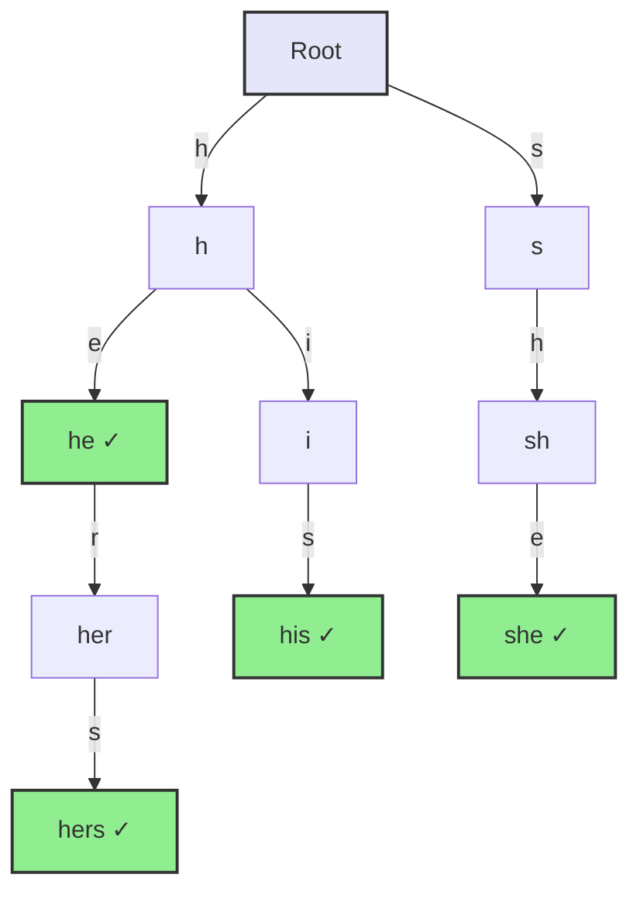
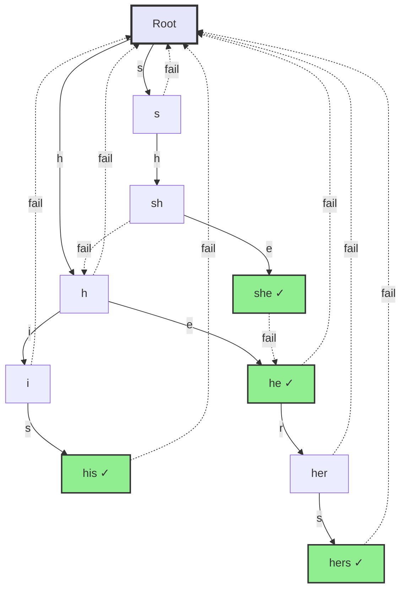

# String Search Algorithms

Finding a pattern inside a text is one of the oldest and most-run operations in computing — every Ctrl+F, every `grep`, every intrusion-detection rule, every genome aligner is a string search underneath. And like sorting and searching before it, the naive way is obvious, correct, and quadratic: slide the pattern along the text and, at each of the `n` positions, compare up to `m` characters. That `O(n·m)` is fine until it isn't, and the whole field of clever algorithms exists to buy back that factor.

The trade they all make is the same one: **spend a little time preprocessing the pattern (or the text) so the search itself can skip work the naive scan repeats.** KMP and the Z-algorithm build a small table from the pattern so the text pointer never backs up. Boyer-Moore builds tables so it can leap forward by whole pattern-lengths at a time. Rabin-Karp hashes windows so most positions are rejected with one integer compare. Aho-Corasick compiles many patterns into one automaton so a single pass finds them all. Preprocessing costs `O(m)` time and space; the payoff is a search that runs in `O(n+m)` or, for Boyer-Moore, often *sublinear* in practice.

That payoff is not free and not always worth it. For a one-off search in a small string, the naive scan wins outright — it has no setup cost and its sequential, left-to-right memory access is exactly what the hardware prefetcher and branch predictor want (the same constant-factor lesson that makes linear search beat binary search on small arrays in [Chapter 15](https://data-structures-on-systems.vercel.app/chapters/searching-algorithms)). Reach for a preprocessing algorithm when the text is large, the search is performance-critical, or the same pattern — or many patterns — is searched repeatedly. Throughout, `n` is the text length and `m` the pattern length; a match is a position `i` where `text[i..i+m-1]` equals the pattern.

Here is the field. The shape matters more than any individual cell:

| Algorithm | Best | Average | Worst | Space | Preprocess |
|-----------|------|---------|-------|-------|------------|
| Naive | `O(n)` | `O(n·m)` | `O(n·m)` | `O(1)` | none |
| Rabin-Karp | `O(n+m)` | `O(n+m)` | `O(n·m)` | `O(1)` | `O(m)` |
| KMP | `O(n+m)` | `O(n+m)` | `O(n+m)` | `O(m)` | `O(m)` |
| Boyer-Moore | `O(n/m)` | `O(n)` | `O(n·m)` | `O(m)` | `O(m)` |
| Z-Algorithm | `O(n+m)` | `O(n+m)` | `O(n+m)` | `O(n+m)` | `O(m)` |
| Aho-Corasick | `O(n+z)` | `O(n+z)` | `O(n+z)` | `O(m)` | `O(m)` |

`z` is the total number of matches reported (it only appears for Aho-Corasick, which finds all occurrences of all patterns). Every algorithm below reports the same matches; they differ only in how much work they waste getting there.

## Naive search: the baseline

Slide the pattern across every valid starting position and compare character by character, bailing out at the first mismatch. It examines every position from `0` to `n-m` exactly once, so it never misses a match and never reports a false one — correctness is not the problem, speed is.

```cpp
#include <string>
#include <vector>
using namespace std;

// O(n*m) worst case, O(1) extra space.
vector<int> naiveSearch(const string& text, const string& pattern) {
    vector<int> matches;
    int n = text.length();
    int m = pattern.length();

    for (int i = 0; i <= n - m; i++) {   // n - m < 0 short-circuits the loop
        int j;
        for (j = 0; j < m; j++) {
            if (text[i + j] != pattern[j]) break;
        }
        if (j == m) matches.push_back(i);   // full pattern matched
    }
    return matches;
}
```

```python
# O(n*m) worst case, O(1) extra space.
def naive_search(text, pattern):
    matches = []
    n, m = len(text), len(pattern)
    for i in range(n - m + 1):        # empty range if n - m < 0
        j = 0
        while j < m:
            if text[i + j] != pattern[j]:
                break
            j += 1
        if j == m:                    # full pattern matched
            matches.append(i)
    return matches
```

```java
import java.util.ArrayList;
import java.util.List;

// O(n*m) worst case, O(1) extra space.
class Naive {
    static List<Integer> naiveSearch(String text, String pattern) {
        List<Integer> matches = new ArrayList<>();
        int n = text.length();
        int m = pattern.length();

        for (int i = 0; i <= n - m; i++) {   // n - m < 0 short-circuits the loop
            int j;
            for (j = 0; j < m; j++) {
                if (text.charAt(i + j) != pattern.charAt(j)) break;
            }
            if (j == m) matches.add(i);   // full pattern matched
        }
        return matches;
    }
}
```

```go
// O(n*m) worst case, O(1) extra space.
func naiveSearch(text, pattern string) []int {
	var matches []int
	n, m := len(text), len(pattern)

	for i := 0; i <= n-m; i++ { // n - m < 0 short-circuits the loop
		j := 0
		for ; j < m; j++ {
			if text[i+j] != pattern[j] {
				break
			}
		}
		if j == m { // full pattern matched
			matches = append(matches, i)
		}
	}
	return matches
}
```

The waste is easiest to see on a pathological input. Searching `"ABABCABAB"` in `"ABABCABABDABABCABAB"`, position 0 matches all nine characters, position 1 fails on the first, position 2 matches four before failing on the `C` — and every one of those partial matches is thrown away. When the next position is checked, the algorithm has already compared some of those same characters and simply forgets. That amnesia is what KMP fixes.

```
Text:    A B A B C A B A B D A B A B C A B A B
Pattern: A B A B C A B A B                       match at 0
             ✗ (B≠A)                             fail at 1
                 ✓✓✓✓✗ (C≠A)                     fail at 2
           ...
                     A B A B C A B A B           match at 5
                               A B A B C A B A B match at 10
```

The best case is `O(n)` — a first-character mismatch at every position — and the worst is `O(n·m)`, classically a pattern like `"AAAAB"` against `"AAAA...A"`, where each position matches `m-1` characters before failing. Good for small texts, short patterns, and single searches where preprocessing wouldn't earn its keep.

## Rabin-Karp: search by hash

Rabin-Karp turns character comparison into integer comparison. Hash the pattern once, hash each `m`-character window of the text, and only when two hashes collide do you fall back to a character-by-character check. If the hash function is any good, collisions are rare, so almost every non-matching window is dismissed with a single integer compare.

The trick that makes it fast is the **rolling hash**: the hash of the window at position `i` is computed from the hash at `i-1` in `O(1)`, by subtracting the departing character's contribution and folding in the arriving one — no need to rescan the whole window. That is what keeps the search at `O(n+m)` on average instead of `O(n·m)`.

```cpp
#include <string>
#include <vector>
using namespace std;

class RabinKarp {
private:
    static const int BASE = 256;         // treat text as base-256 digits
    static const int MOD  = 1000000007;  // a large prime keeps collisions rare
    long long power;                     // BASE^(m-1) mod MOD, for the rolling update

    long long calculateHash(const string& str, int length) {
        long long hash = 0;
        for (int i = 0; i < length; i++)
            hash = (hash * BASE + str[i]) % MOD;
        return hash;
    }

    // Drop oldChar's contribution, fold in newChar. O(1).
    long long recalculateHash(long long oldHash, char oldChar, char newChar) {
        long long newHash = (oldHash - oldChar * power % MOD + MOD) % MOD;
        return (newHash * BASE + newChar) % MOD;
    }

public:
    vector<int> search(const string& text, const string& pattern) {
        vector<int> matches;
        int n = text.length();
        int m = pattern.length();
        if (m == 0 || m > n) return matches;

        // Precompute BASE^(m-1) mod MOD modularly — never floating-point pow().
        power = 1;
        for (int i = 0; i < m - 1; i++) power = (power * BASE) % MOD;

        long long patternHash = calculateHash(pattern, m);
        long long textHash    = calculateHash(text, m);

        for (int i = 0; i <= n - m; i++) {
            // Verify on every hash hit — a hash match is necessary, not sufficient.
            if (patternHash == textHash && text.compare(i, m, pattern) == 0)
                matches.push_back(i);
            if (i < n - m)
                textHash = recalculateHash(textHash, text[i], text[i + m]);
        }
        return matches;
    }
};
```

```python
class RabinKarp:
    BASE = 256          # treat text as base-256 digits
    MOD = 1000000007    # a large prime keeps collisions rare

    def _calculate_hash(self, s, length):
        h = 0
        for i in range(length):
            h = (h * self.BASE + ord(s[i])) % self.MOD
        return h

    # Drop old_char's contribution, fold in new_char. O(1).
    def _recalculate_hash(self, old_hash, old_char, new_char):
        new_hash = (old_hash - ord(old_char) * self.power % self.MOD + self.MOD) % self.MOD
        return (new_hash * self.BASE + ord(new_char)) % self.MOD

    def search(self, text, pattern):
        matches = []
        n, m = len(text), len(pattern)
        if m == 0 or m > n:
            return matches

        # Precompute BASE^(m-1) mod MOD modularly — never floating-point pow().
        self.power = 1
        for _ in range(m - 1):
            self.power = (self.power * self.BASE) % self.MOD

        pattern_hash = self._calculate_hash(pattern, m)
        text_hash = self._calculate_hash(text, m)

        for i in range(n - m + 1):
            # Verify on every hash hit — a hash match is necessary, not sufficient.
            if pattern_hash == text_hash and text[i:i + m] == pattern:
                matches.append(i)
            if i < n - m:
                text_hash = self._recalculate_hash(text_hash, text[i], text[i + m])
        return matches
```

```java
import java.util.ArrayList;
import java.util.List;

class RabinKarp {
    private static final int BASE = 256;         // treat text as base-256 digits
    private static final int MOD  = 1000000007;  // a large prime keeps collisions rare
    private long power;                          // BASE^(m-1) mod MOD, for the rolling update

    private long calculateHash(String str, int length) {
        long hash = 0;
        for (int i = 0; i < length; i++)
            hash = (hash * BASE + str.charAt(i)) % MOD;
        return hash;
    }

    // Drop oldChar's contribution, fold in newChar. O(1).
    private long recalculateHash(long oldHash, char oldChar, char newChar) {
        long newHash = (oldHash - oldChar * power % MOD + MOD) % MOD;
        return (newHash * BASE + newChar) % MOD;
    }

    public List<Integer> search(String text, String pattern) {
        List<Integer> matches = new ArrayList<>();
        int n = text.length();
        int m = pattern.length();
        if (m == 0 || m > n) return matches;

        // Precompute BASE^(m-1) mod MOD modularly — never floating-point pow().
        power = 1;
        for (int i = 0; i < m - 1; i++) power = (power * BASE) % MOD;

        long patternHash = calculateHash(pattern, m);
        long textHash    = calculateHash(text, m);

        for (int i = 0; i <= n - m; i++) {
            // Verify on every hash hit — a hash match is necessary, not sufficient.
            if (patternHash == textHash && text.regionMatches(i, pattern, 0, m))
                matches.add(i);
            if (i < n - m)
                textHash = recalculateHash(textHash, text.charAt(i), text.charAt(i + m));
        }
        return matches;
    }
}
```

```go
const (
	base = 256        // treat text as base-256 digits
	mod  = 1000000007 // a large prime keeps collisions rare
)

type RabinKarp struct {
	power int64 // BASE^(m-1) mod MOD, for the rolling update
}

func (rk *RabinKarp) calculateHash(s string, length int) int64 {
	var hash int64
	for i := 0; i < length; i++ {
		hash = (hash*base + int64(s[i])) % mod
	}
	return hash
}

// Drop oldChar's contribution, fold in newChar. O(1).
func (rk *RabinKarp) recalculateHash(oldHash int64, oldChar, newChar byte) int64 {
	newHash := (oldHash - int64(oldChar)*rk.power%mod + mod) % mod
	return (newHash*base + int64(newChar)) % mod
}

func (rk *RabinKarp) search(text, pattern string) []int {
	var matches []int
	n, m := len(text), len(pattern)
	if m == 0 || m > n {
		return matches
	}

	// Precompute BASE^(m-1) mod MOD modularly — never floating-point pow().
	rk.power = 1
	for i := 0; i < m-1; i++ {
		rk.power = (rk.power * base) % mod
	}

	patternHash := rk.calculateHash(pattern, m)
	textHash := rk.calculateHash(text, m)

	for i := 0; i <= n-m; i++ {
		// Verify on every hash hit — a hash match is necessary, not sufficient.
		if patternHash == textHash && text[i:i+m] == pattern {
			matches = append(matches, i)
		}
		if i < n-m {
			textHash = rk.recalculateHash(textHash, text[i], text[i+m])
		}
	}
	return matches
}
```

Two details are load-bearing. The modulus is applied at every step so the hash never overflows, and `power` is built by repeated modular multiplication rather than `pow()` — floating-point would lose the low bits that make the hash meaningful. And the verification step is not optional: distinct strings *can* share a hash, so a hash hit only tells you where to look, never that you've found a match. Skip the verify and you get false positives; that verify is also why a flood of collisions degrades the worst case to `O(n·m)`. Rabin-Karp shines when the same rolling-hash machinery serves many patterns at once (hash them all, look each window up in a set) or streams over unbounded input.

## Knuth-Morris-Pratt: never back up the text

KMP is the direct cure for naive search's amnesia. When a mismatch happens after some characters have matched, KMP already knows those text characters — they equal a prefix of the pattern — so instead of restarting, it slides the pattern forward by just enough to reuse the longest prefix that's still viable, and the **text pointer never moves backward.** That single guarantee is what pins the search at `O(n)`.

The knowledge lives in the **LPS array** (Longest proper Prefix which is also a Suffix). `lps[i]` is the length of the longest proper prefix of `pattern[0..i]` that is also a suffix of it — precisely the length KMP can keep after a mismatch just past position `i`. For `"ABABCABAB"`:

```
Pattern: A B A B C A B A B
Index:   0 1 2 3 4 5 6 7 8
LPS:     0 0 1 2 0 1 2 3 4
```

Reading it: `A` and `AB` have no proper prefix that's also a suffix (0); `ABA` repeats `A` (1); `ABAB` repeats `AB` (2); the `C` in `ABABC` breaks the run back to 0; then `ABAB` re-accumulates to 4 by the end. On a mismatch at pattern position `j`, KMP resets `j` to `lps[j-1]` and keeps the text pointer fixed — the already-matched prefix is preserved for free.

```
Text:    A B A B D A B A C D A B A B C A B A B
Pattern: A B A B C                             mismatch at j=4 → j = lps[3] = 2
             A B A B C                         mismatch at j=2 → j = lps[1] = 0
                 ...text pointer only ever advances...
                     A B A B C A B A B         match at 10
```

Building the LPS array is itself KMP applied to the pattern against itself, which is why preprocessing is `O(m)`.

```cpp
#include <string>
#include <vector>
using namespace std;

class KMP {
private:
    vector<int> buildLPS(const string& pattern) {
        int m = pattern.length();
        vector<int> lps(m, 0);
        int len = 0;   // length of the current longest prefix-suffix
        int i = 1;
        while (i < m) {
            if (pattern[i] == pattern[len]) {
                lps[i++] = ++len;
            } else if (len != 0) {
                len = lps[len - 1];   // fall back, don't advance i
            } else {
                lps[i++] = 0;
            }
        }
        return lps;
    }

public:
    vector<int> search(const string& text, const string& pattern) {
        vector<int> matches;
        int n = text.length();
        int m = pattern.length();
        if (m == 0) return matches;

        vector<int> lps = buildLPS(pattern);
        int i = 0;   // text index — never decreases
        int j = 0;   // pattern index

        while (i < n) {
            if (pattern[j] == text[i]) { i++; j++; }

            if (j == m) {
                matches.push_back(i - j);
                j = lps[j - 1];                       // keep scanning for overlaps
            } else if (i < n && pattern[j] != text[i]) {
                if (j != 0) j = lps[j - 1];
                else        i++;
            }
        }
        return matches;
    }
};
```

```python
class KMP:
    def _build_lps(self, pattern):
        m = len(pattern)
        lps = [0] * m
        length = 0    # length of the current longest prefix-suffix
        i = 1
        while i < m:
            if pattern[i] == pattern[length]:
                length += 1
                lps[i] = length
                i += 1
            elif length != 0:
                length = lps[length - 1]    # fall back, don't advance i
            else:
                lps[i] = 0
                i += 1
        return lps

    def search(self, text, pattern):
        matches = []
        n, m = len(text), len(pattern)
        if m == 0:
            return matches

        lps = self._build_lps(pattern)
        i = 0    # text index — never decreases
        j = 0    # pattern index

        while i < n:
            if pattern[j] == text[i]:
                i += 1
                j += 1

            if j == m:
                matches.append(i - j)
                j = lps[j - 1]                       # keep scanning for overlaps
            elif i < n and pattern[j] != text[i]:
                if j != 0:
                    j = lps[j - 1]
                else:
                    i += 1
        return matches
```

```java
import java.util.ArrayList;
import java.util.List;

class KMP {
    private int[] buildLPS(String pattern) {
        int m = pattern.length();
        int[] lps = new int[m];
        int len = 0;   // length of the current longest prefix-suffix
        int i = 1;
        while (i < m) {
            if (pattern.charAt(i) == pattern.charAt(len)) {
                lps[i++] = ++len;
            } else if (len != 0) {
                len = lps[len - 1];   // fall back, don't advance i
            } else {
                lps[i++] = 0;
            }
        }
        return lps;
    }

    public List<Integer> search(String text, String pattern) {
        List<Integer> matches = new ArrayList<>();
        int n = text.length();
        int m = pattern.length();
        if (m == 0) return matches;

        int[] lps = buildLPS(pattern);
        int i = 0;   // text index — never decreases
        int j = 0;   // pattern index

        while (i < n) {
            if (pattern.charAt(j) == text.charAt(i)) { i++; j++; }

            if (j == m) {
                matches.add(i - j);
                j = lps[j - 1];                       // keep scanning for overlaps
            } else if (i < n && pattern.charAt(j) != text.charAt(i)) {
                if (j != 0) j = lps[j - 1];
                else        i++;
            }
        }
        return matches;
    }
}
```

```go
type KMP struct{}

func (k *KMP) buildLPS(pattern string) []int {
	m := len(pattern)
	lps := make([]int, m)
	length := 0 // length of the current longest prefix-suffix
	i := 1
	for i < m {
		if pattern[i] == pattern[length] {
			length++
			lps[i] = length
			i++
		} else if length != 0 {
			length = lps[length-1] // fall back, don't advance i
		} else {
			lps[i] = 0
			i++
		}
	}
	return lps
}

func (k *KMP) search(text, pattern string) []int {
	var matches []int
	n, m := len(text), len(pattern)
	if m == 0 {
		return matches
	}

	lps := k.buildLPS(pattern)
	i := 0 // text index — never decreases
	j := 0 // pattern index

	for i < n {
		if pattern[j] == text[i] {
			i++
			j++
		}

		if j == m {
			matches = append(matches, i-j)
			j = lps[j-1] // keep scanning for overlaps
		} else if i < n && pattern[j] != text[i] {
			if j != 0 {
				j = lps[j-1]
			} else {
				i++
			}
		}
	}
	return matches
}
```

Guaranteed `O(n+m)` with no worst case to fear and only `O(m)` space, KMP is the reliable general-purpose choice: text-editor find, log scanning, DNA matching — anywhere a single pattern is searched under a bound you can promise.

## Boyer-Moore: match right-to-left and leap

Boyer-Moore is usually the fastest string search in practice, and its trick is counterintuitive: it compares the pattern to the text **right to left**. When the rightmost characters mismatch early, it learns enough to skip the pattern forward by many positions at once — so on large texts with large alphabets it examines only a fraction of the characters, approaching `O(n/m)`.

The workhorse heuristic is the **bad-character rule**. On a mismatch, look at the offending text character and shift the pattern so that character's *last* occurrence in the pattern lines up under it. If the character doesn't occur in the pattern at all, jump the whole pattern past it. A precomputed table gives each byte's last index in the pattern:

```
Pattern: T A T G T G          Bad-character table:
Index:   0 1 2 3 4 5            T → 4,  A → 1,  G → 5,  (all others → -1)
```

Searching `"TATGTG"` in `"GCAATGCCTATGTGACC"`: at alignment 0 the last two characters match before `text[3]='A'` mismatches `pattern[3]='G'`, shifting by `max(1, 3 - table['A']) = 2`; at the next alignment `text[7]='C'` mismatches and, since `C` is absent from the pattern, the whole pattern jumps past it; the alignment at position 8 then matches all six characters right-to-left.

```cpp
#include <string>
#include <vector>
#include <algorithm>
using namespace std;

class BoyerMoore {
private:
    // Last index at which each byte occurs in the pattern (-1 if absent).
    vector<int> buildBadCharTable(const string& pattern) {
        vector<int> badChar(256, -1);
        for (int i = 0; i < (int)pattern.length(); i++)
            badChar[(unsigned char)pattern[i]] = i;   // cast: no negative index on non-ASCII
        return badChar;
    }

public:
    // Bad-character heuristic only. The good-suffix rule can be layered on for a
    // guaranteed better worst case; it is omitted here for clarity.
    vector<int> search(const string& text, const string& pattern) {
        vector<int> matches;
        int n = text.length();
        int m = pattern.length();
        if (m == 0 || m > n) return matches;

        vector<int> badChar = buildBadCharTable(pattern);
        int s = 0;   // current alignment of pattern against text

        while (s <= n - m) {
            int j = m - 1;
            while (j >= 0 && pattern[j] == text[s + j]) j--;   // right to left

            if (j < 0) {
                matches.push_back(s);
                s += (s + m < n) ? m - badChar[(unsigned char)text[s + m]] : 1;
            } else {
                s += max(1, j - badChar[(unsigned char)text[s + j]]);
            }
        }
        return matches;
    }
};
```

```python
class BoyerMoore:
    # Last index at which each byte occurs in the pattern (-1 if absent).
    def _build_bad_char_table(self, pattern):
        bad_char = [-1] * 256
        for i, c in enumerate(pattern):
            bad_char[ord(c)] = i
        return bad_char

    # Bad-character heuristic only. The good-suffix rule can be layered on for a
    # guaranteed better worst case; it is omitted here for clarity.
    def search(self, text, pattern):
        matches = []
        n, m = len(text), len(pattern)
        if m == 0 or m > n:
            return matches

        bad_char = self._build_bad_char_table(pattern)
        s = 0    # current alignment of pattern against text

        while s <= n - m:
            j = m - 1
            while j >= 0 and pattern[j] == text[s + j]:   # right to left
                j -= 1

            if j < 0:
                matches.append(s)
                s += (m - bad_char[ord(text[s + m])]) if s + m < n else 1
            else:
                s += max(1, j - bad_char[ord(text[s + j])])
        return matches
```

```java
import java.util.ArrayList;
import java.util.Arrays;
import java.util.List;

class BoyerMoore {
    // Last index at which each byte occurs in the pattern (-1 if absent).
    private int[] buildBadCharTable(String pattern) {
        int[] badChar = new int[256];
        Arrays.fill(badChar, -1);
        for (int i = 0; i < pattern.length(); i++)
            badChar[pattern.charAt(i) & 0xFF] = i;   // mask: no negative index on non-ASCII
        return badChar;
    }

    // Bad-character heuristic only. The good-suffix rule can be layered on for a
    // guaranteed better worst case; it is omitted here for clarity.
    public List<Integer> search(String text, String pattern) {
        List<Integer> matches = new ArrayList<>();
        int n = text.length();
        int m = pattern.length();
        if (m == 0 || m > n) return matches;

        int[] badChar = buildBadCharTable(pattern);
        int s = 0;   // current alignment of pattern against text

        while (s <= n - m) {
            int j = m - 1;
            while (j >= 0 && pattern.charAt(j) == text.charAt(s + j)) j--;   // right to left

            if (j < 0) {
                matches.add(s);
                s += (s + m < n) ? m - badChar[text.charAt(s + m) & 0xFF] : 1;
            } else {
                s += Math.max(1, j - badChar[text.charAt(s + j) & 0xFF]);
            }
        }
        return matches;
    }
}
```

```go
type BoyerMoore struct{}

// Last index at which each byte occurs in the pattern (-1 if absent).
func (bm *BoyerMoore) buildBadCharTable(pattern string) [256]int {
	var badChar [256]int
	for i := range badChar {
		badChar[i] = -1
	}
	for i := 0; i < len(pattern); i++ {
		badChar[pattern[i]] = i
	}
	return badChar
}

// Bad-character heuristic only. The good-suffix rule can be layered on for a
// guaranteed better worst case; it is omitted here for clarity.
func (bm *BoyerMoore) search(text, pattern string) []int {
	var matches []int
	n, m := len(text), len(pattern)
	if m == 0 || m > n {
		return matches
	}

	badChar := bm.buildBadCharTable(pattern)
	s := 0 // current alignment of pattern against text

	for s <= n-m {
		j := m - 1
		for j >= 0 && pattern[j] == text[s+j] { // right to left
			j--
		}

		if j < 0 {
			matches = append(matches, s)
			if s+m < n {
				s += m - badChar[text[s+m]]
			} else {
				s++
			}
		} else {
			shift := j - badChar[text[s+j]]
			if shift < 1 {
				shift = 1
			}
			s += shift
		}
	}
	return matches
}
```

The `max(1, ...)` matters: the bad-character rule can compute a non-positive shift (when the matching character sits to the *right* of the mismatch in the pattern), and forcing at least one step forward is what keeps the loop from stalling. Full Boyer-Moore adds a second heuristic, the **good-suffix rule** — when a suffix of the pattern matched before the mismatch, shift to realign that suffix elsewhere in the pattern — which bounds the worst case below the bad-character rule's `O(n·m)`. The bad-character rule alone is what production tools lean on, and it weakens on small alphabets (DNA's four letters mean the mismatched character usually appears nearby, so shifts stay small) while excelling on large ones. This is the algorithm behind `grep`, `ripgrep`, and `ag`.

## The Z-algorithm: one array, many uses

The Z-algorithm reframes matching. For a string `s`, `z[i]` is the length of the longest substring starting at `i` that is also a prefix of `s`. Concatenate `pattern + '$' + text` — with a separator `$` that appears in neither — and any position in the text portion whose Z-value equals `m` marks a full occurrence of the pattern. The Z-array is built in one linear pass by maintaining the rightmost `[l, r]` "Z-box" already computed and reusing it to bootstrap later positions instead of recomparing from scratch.

```cpp
#include <string>
#include <vector>
#include <algorithm>
using namespace std;

class ZAlgorithm {
private:
    vector<int> buildZArray(const string& str) {
        int n = str.length();
        vector<int> z(n, 0);
        int l = 0, r = 0;                     // current rightmost Z-box [l, r]
        for (int i = 1; i < n; i++) {
            if (i <= r) z[i] = min(r - i + 1, z[i - l]);   // reuse prior work
            while (i + z[i] < n && str[z[i]] == str[i + z[i]]) z[i]++;
            if (i + z[i] - 1 > r) { l = i; r = i + z[i] - 1; }
        }
        return z;
    }

public:
    vector<int> search(const string& text, const string& pattern) {
        vector<int> matches;
        int m = pattern.length();
        if (m == 0) return matches;

        string combined = pattern + '$' + text;    // '$' must be outside the alphabet
        vector<int> z = buildZArray(combined);

        for (int i = m + 1; i < (int)combined.length(); i++)
            if (z[i] == m) matches.push_back(i - m - 1);   // map back to text index
        return matches;
    }
};
```

```python
class ZAlgorithm:
    def _build_z_array(self, s):
        n = len(s)
        z = [0] * n
        l = r = 0                             # current rightmost Z-box [l, r]
        for i in range(1, n):
            if i <= r:
                z[i] = min(r - i + 1, z[i - l])   # reuse prior work
            while i + z[i] < n and s[z[i]] == s[i + z[i]]:
                z[i] += 1
            if i + z[i] - 1 > r:
                l, r = i, i + z[i] - 1
        return z

    def search(self, text, pattern):
        matches = []
        m = len(pattern)
        if m == 0:
            return matches

        combined = pattern + '$' + text    # '$' must be outside the alphabet
        z = self._build_z_array(combined)

        for i in range(m + 1, len(combined)):
            if z[i] == m:
                matches.append(i - m - 1)   # map back to text index
        return matches
```

```java
import java.util.ArrayList;
import java.util.List;

class ZAlgorithm {
    private int[] buildZArray(String str) {
        int n = str.length();
        int[] z = new int[n];
        int l = 0, r = 0;                     // current rightmost Z-box [l, r]
        for (int i = 1; i < n; i++) {
            if (i <= r) z[i] = Math.min(r - i + 1, z[i - l]);   // reuse prior work
            while (i + z[i] < n && str.charAt(z[i]) == str.charAt(i + z[i])) z[i]++;
            if (i + z[i] - 1 > r) { l = i; r = i + z[i] - 1; }
        }
        return z;
    }

    public List<Integer> search(String text, String pattern) {
        List<Integer> matches = new ArrayList<>();
        int m = pattern.length();
        if (m == 0) return matches;

        String combined = pattern + '$' + text;    // '$' must be outside the alphabet
        int[] z = buildZArray(combined);

        for (int i = m + 1; i < combined.length(); i++)
            if (z[i] == m) matches.add(i - m - 1);   // map back to text index
        return matches;
    }
}
```

```go
type ZAlgorithm struct{}

func (za *ZAlgorithm) buildZArray(s string) []int {
	n := len(s)
	z := make([]int, n)
	l, r := 0, 0 // current rightmost Z-box [l, r]
	for i := 1; i < n; i++ {
		if i <= r {
			z[i] = min(r-i+1, z[i-l]) // reuse prior work
		}
		for i+z[i] < n && s[z[i]] == s[i+z[i]] {
			z[i]++
		}
		if i+z[i]-1 > r {
			l, r = i, i+z[i]-1
		}
	}
	return z
}

func (za *ZAlgorithm) search(text, pattern string) []int {
	var matches []int
	m := len(pattern)
	if m == 0 {
		return matches
	}

	combined := pattern + "$" + text // '$' must be outside the alphabet
	z := za.buildZArray(combined)

	for i := m + 1; i < len(combined); i++ {
		if z[i] == m {
			matches = append(matches, i-m-1) // map back to text index
		}
	}
	return matches
}
```

It matches KMP's `O(n+m)` guarantee, but costs `O(n+m)` space for the array over the combined string. Reach for it when you want the Z-array itself — for string periodicity, longest-common-prefix queries, or the kind of derived quantities that show up in competitive programming — rather than for plain search, where KMP's smaller footprint usually wins.

## Aho-Corasick: all patterns in one pass

Everything so far searches for one pattern. When you need to find *many* — thousands of virus signatures, a keyword blocklist, a set of intrusion rules — running a single-pattern search once per pattern is wasteful. Aho-Corasick compiles the whole pattern set into one automaton and finds every occurrence of every pattern in a single `O(n + z)` pass over the text, where `z` is the number of matches.

It starts as a trie of all patterns: each node is a prefix, each root-to-node path spells one, and nodes marking a complete pattern are the outputs.



The automaton comes from adding **failure links** — the multi-pattern generalization of KMP's LPS. For a node spelling string `s`, its failure link points to the node for the longest proper suffix of `s` that is also a prefix of some pattern. On a mismatch, follow failure links (never lengthening the match) until a transition exists or you reach the root, so the text pointer never backs up. Failure links are built breadth-first, and each node inherits its failure target's outputs so that a single state can report several patterns ending at once.



Note `sh`'s failure link to `h` and `she`'s to `he`: when matching `she`, the automaton "knows" it has also just matched the suffix `he`, so scanning text like `"she"` reports both `she` and `he` without a second pass.

```cpp
#include <string>
#include <vector>
#include <queue>
#include <unordered_map>
using namespace std;

class AhoCorasick {
private:
    struct TrieNode {
        unordered_map<char, TrieNode*> children;
        TrieNode* failure = nullptr;
        vector<int> output;   // indices of patterns ending here
    };

    TrieNode* root;
    vector<string> patterns;

    void buildTrie() {
        root = new TrieNode();
        for (int i = 0; i < (int)patterns.size(); i++) {
            TrieNode* cur = root;
            for (char c : patterns[i]) {
                if (!cur->children.count(c)) cur->children[c] = new TrieNode();
                cur = cur->children[c];
            }
            cur->output.push_back(i);
        }
    }

    void buildFailureLinks() {
        queue<TrieNode*> q;
        for (auto& [c, child] : root->children) { child->failure = root; q.push(child); }

        while (!q.empty()) {
            TrieNode* cur = q.front(); q.pop();
            for (auto& [c, child] : cur->children) {
                q.push(child);
                TrieNode* f = cur->failure;
                while (f != nullptr && !f->children.count(c)) f = f->failure;
                child->failure = (f != nullptr) ? f->children[c] : root;
                // inherit the failure target's matches
                child->output.insert(child->output.end(),
                                     child->failure->output.begin(),
                                     child->failure->output.end());
            }
        }
    }

public:
    AhoCorasick(const vector<string>& pats) : patterns(pats) {
        buildTrie();
        buildFailureLinks();
    }

    // Maps each pattern to the start positions where it occurs.
    unordered_map<string, vector<int>> search(const string& text) {
        unordered_map<string, vector<int>> results;
        TrieNode* cur = root;

        for (int i = 0; i < (int)text.length(); i++) {
            char c = text[i];
            while (cur != nullptr && !cur->children.count(c)) cur = cur->failure;
            cur = (cur != nullptr) ? cur->children[c] : root;

            for (int idx : cur->output) {
                int start = i - (int)patterns[idx].length() + 1;
                results[patterns[idx]].push_back(start);
            }
        }
        return results;
    }
};
```

```python
from collections import deque


class AhoCorasick:
    class _TrieNode:
        def __init__(self):
            self.children = {}
            self.failure = None
            self.output = []   # indices of patterns ending here

    def __init__(self, patterns):
        self.patterns = patterns
        self._build_trie()
        self._build_failure_links()

    def _build_trie(self):
        self.root = self._TrieNode()
        for i, pattern in enumerate(self.patterns):
            cur = self.root
            for c in pattern:
                if c not in cur.children:
                    cur.children[c] = self._TrieNode()
                cur = cur.children[c]
            cur.output.append(i)

    def _build_failure_links(self):
        q = deque()
        for child in self.root.children.values():
            child.failure = self.root
            q.append(child)

        while q:
            cur = q.popleft()
            for c, child in cur.children.items():
                q.append(child)
                f = cur.failure
                while f is not None and c not in f.children:
                    f = f.failure
                child.failure = f.children[c] if f is not None else self.root
                # inherit the failure target's matches
                child.output.extend(child.failure.output)

    # Maps each pattern to the start positions where it occurs.
    def search(self, text):
        results = {}
        cur = self.root

        for i, c in enumerate(text):
            while cur is not None and c not in cur.children:
                cur = cur.failure
            cur = cur.children[c] if cur is not None else self.root

            for idx in cur.output:
                start = i - len(self.patterns[idx]) + 1
                results.setdefault(self.patterns[idx], []).append(start)
        return results
```

```java
import java.util.ArrayDeque;
import java.util.ArrayList;
import java.util.HashMap;
import java.util.List;
import java.util.Map;
import java.util.Queue;

class AhoCorasick {
    private static class TrieNode {
        Map<Character, TrieNode> children = new HashMap<>();
        TrieNode failure = null;
        List<Integer> output = new ArrayList<>();   // indices of patterns ending here
    }

    private TrieNode root;
    private List<String> patterns;

    public AhoCorasick(List<String> patterns) {
        this.patterns = patterns;
        buildTrie();
        buildFailureLinks();
    }

    private void buildTrie() {
        root = new TrieNode();
        for (int i = 0; i < patterns.size(); i++) {
            TrieNode cur = root;
            for (char c : patterns.get(i).toCharArray()) {
                cur.children.putIfAbsent(c, new TrieNode());
                cur = cur.children.get(c);
            }
            cur.output.add(i);
        }
    }

    private void buildFailureLinks() {
        Queue<TrieNode> q = new ArrayDeque<>();
        for (TrieNode child : root.children.values()) { child.failure = root; q.add(child); }

        while (!q.isEmpty()) {
            TrieNode cur = q.poll();
            for (Map.Entry<Character, TrieNode> e : cur.children.entrySet()) {
                char c = e.getKey();
                TrieNode child = e.getValue();
                q.add(child);
                TrieNode f = cur.failure;
                while (f != null && !f.children.containsKey(c)) f = f.failure;
                child.failure = (f != null) ? f.children.get(c) : root;
                // inherit the failure target's matches
                child.output.addAll(child.failure.output);
            }
        }
    }

    // Maps each pattern to the start positions where it occurs.
    public Map<String, List<Integer>> search(String text) {
        Map<String, List<Integer>> results = new HashMap<>();
        TrieNode cur = root;

        for (int i = 0; i < text.length(); i++) {
            char c = text.charAt(i);
            while (cur != null && !cur.children.containsKey(c)) cur = cur.failure;
            cur = (cur != null) ? cur.children.get(c) : root;

            for (int idx : cur.output) {
                int start = i - patterns.get(idx).length() + 1;
                results.computeIfAbsent(patterns.get(idx), k -> new ArrayList<>()).add(start);
            }
        }
        return results;
    }
}
```

```go
type trieNode struct {
	children map[byte]*trieNode
	failure  *trieNode
	output   []int // indices of patterns ending here
}

type AhoCorasick struct {
	root     *trieNode
	patterns []string
}

func NewAhoCorasick(patterns []string) *AhoCorasick {
	ac := &AhoCorasick{patterns: patterns}
	ac.buildTrie()
	ac.buildFailureLinks()
	return ac
}

func (ac *AhoCorasick) buildTrie() {
	ac.root = &trieNode{children: map[byte]*trieNode{}}
	for i, pattern := range ac.patterns {
		cur := ac.root
		for j := 0; j < len(pattern); j++ {
			c := pattern[j]
			if cur.children[c] == nil {
				cur.children[c] = &trieNode{children: map[byte]*trieNode{}}
			}
			cur = cur.children[c]
		}
		cur.output = append(cur.output, i)
	}
}

func (ac *AhoCorasick) buildFailureLinks() {
	queue := []*trieNode{}
	for _, child := range ac.root.children {
		child.failure = ac.root
		queue = append(queue, child)
	}

	for len(queue) > 0 {
		cur := queue[0]
		queue = queue[1:]
		for c, child := range cur.children {
			queue = append(queue, child)
			f := cur.failure
			for f != nil {
				if _, ok := f.children[c]; ok {
					break
				}
				f = f.failure
			}
			if f != nil {
				child.failure = f.children[c]
			} else {
				child.failure = ac.root
			}
			// inherit the failure target's matches
			child.output = append(child.output, child.failure.output...)
		}
	}
}

// Maps each pattern to the start positions where it occurs.
func (ac *AhoCorasick) search(text string) map[string][]int {
	results := map[string][]int{}
	cur := ac.root

	for i := 0; i < len(text); i++ {
		c := text[i]
		for cur != nil {
			if _, ok := cur.children[c]; ok {
				break
			}
			cur = cur.failure
		}
		if cur != nil {
			cur = cur.children[c]
		} else {
			cur = ac.root
		}

		for _, idx := range cur.output {
			start := i - len(ac.patterns[idx]) + 1
			results[ac.patterns[idx]] = append(results[ac.patterns[idx]], start)
		}
	}
	return results
}
```

Tracing `"shers"`: `s`→`sh`→`she` (report `she` at 0, and via its inherited output, `he`), then `r` has no edge so failure links walk `she`→`he`→root, and `s` restarts. Preprocessing is `O(m)` in the total pattern length; the search is `O(n + z)` regardless of how many patterns there are — which is exactly why intrusion detectors (Snort, Suricata), virus scanners, and content filters are built on it. (This follows the construction at [cp-algorithms.com](https://cp-algorithms.com/string/aho_corasick.html).) Note the trie nodes are heap-allocated; production code would own them with an arena or `unique_ptr` and free them on destruction.

## Choosing an algorithm

The picture collapses to a few decisions. **Single one-off search, small input?** Naive — no setup, cache-friendly, done. **One pattern searched repeatedly, need a hard bound?** KMP — guaranteed `O(n+m)`, no degradation, modest memory. **Large text, large alphabet, long pattern?** Boyer-Moore — sublinear in practice, the reason `grep` and `ripgrep` are fast. **Many patterns at once?** Aho-Corasick if the pattern set is fixed and large; Rabin-Karp if patterns arrive dynamically or you're streaming and a rolling hash fits naturally. **Need the Z-array's byproducts** (periodicity, prefix structure)? The Z-algorithm. Rabin-Karp's collision-driven `O(n·m)` worst case and Boyer-Moore's pathological `O(n·m)` are real but rare; KMP, the Z-algorithm, and Aho-Corasick carry no such asterisk.

## Systems view: cache, branches, and parallelism

The complexity table hides which of these algorithms the hardware actually likes. Naive and KMP walk the text strictly forward, one character after the next — the access pattern the prefetcher streams ahead of and the branch predictor learns, so each comparison is nearly free even though there are many of them. Boyer-Moore does fewer comparisons but scans each window right-to-left and jumps between alignments, a less prefetch-friendly pattern that still wins on large inputs because it touches so few characters overall. Rabin-Karp's rolling hash is a tight arithmetic loop, but its verification branch mispredicts whenever a real match or a collision appears. The preprocessing tables are small — KMP's LPS is `O(m)`, Boyer-Moore's bad-character table is a fixed 256 ints — and stay resident in L1 during the search, so their cost is amortized away almost immediately.

Two production levers matter most. First, **parallelism is nearly free** because the search phase is stateless once preprocessing is done: split the text into chunks across threads, search each independently, and merge the results. The one correctness catch is chunk boundaries — a match can straddle two chunks — so overlap adjacent chunks by `m - 1` characters and no match is lost. Second, **the preprocessed data must be immutable and shared read-only** across those threads; if the LPS array, bad-character table, or Aho-Corasick automaton could change mid-search, every thread's correctness argument collapses. Build once, freeze, share. Rabin-Karp needs the same discipline for its rolling hash: each thread must own its hash state, never share a mutable accumulator. These are the concurrency invariants from [Chapter 4](https://data-structures-on-systems.vercel.app/chapters/concurrency-fundamentals) (see Section 3.5.3) applied to search: what must never be observed half-updated is the preprocessed pattern data and the growing result set. In practice, use a thread pool over text chunks and a lock-free or per-thread result buffer rather than hand-rolling synchronization (Section 3.5.10).

## Exercises

1. Make any of these searches case-insensitive without copying the text — fold case in the comparison, and think about what that does to Boyer-Moore's bad-character table.
2. Modify KMP to report only non-overlapping occurrences. Which line changes, and why is it `j = 0` rather than `j = lps[j-1]`?
3. Use two rolling hashes (Rabin-Karp) to find the longest common substring of two strings by binary-searching the length.
4. Extend naive search to support a single-character wildcard `?` that matches any character.
5. Find all anagrams of a pattern in a text in `O(n)` using a sliding frequency window — no sorting.

The next chapter turns from finding elements to ordering them: [Chapter 11, Sorting Algorithms](https://data-structures-on-systems.vercel.app/chapters/sorting-algorithms), where the same theme returns — the algorithm Big-O prefers and the algorithm the machine prefers are rarely the same one.
