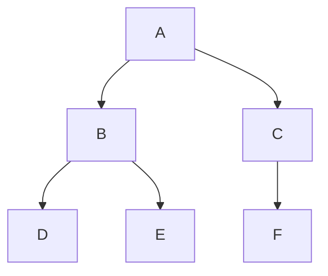
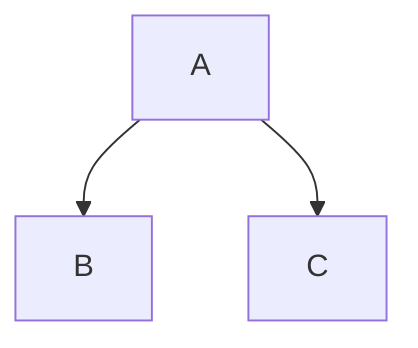
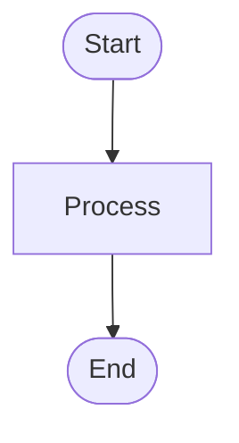

# Diagram Migration Guide

This guide helps you migrate existing ASCII diagrams to Mermaid format for better digital rendering.

## Quick Reference

### Before (ASCII)
````markdown
```
    A
   / \
  B   C
 / \   \
D   E   F
```
````

### After (Mermaid)
````markdown

````

## Migration Checklist

- [x] Chapter 11 - DFS diagrams (partial)
- [x] Diagram templates created
- [x] Tooling documentation created
- [ ] Chapter 11 - BFS diagrams (complete)
- [ ] Chapter 11 - Dijkstra diagrams
- [ ] Chapter 6 - Tree diagrams
- [ ] Chapter 12 - DP diagrams
- [ ] Other chapters

## Step-by-Step Migration Process

### 1. Identify Diagrams to Convert

Look for:
- ASCII art trees/graphs
- Text-based flowcharts
- Step-by-step visualizations

### 2. Choose Appropriate Template

Refer to `diagram-templates.md` for:
- Tree diagrams
- Graph diagrams
- Flowcharts
- Sequence diagrams

### 3. Convert Using Template

1. Copy template from `diagram-templates.md`
2. Customize for your specific diagram
3. Test on Mermaid Live Editor
4. Replace ASCII version

### 4. Test Rendering

- Preview in VS Code
- Check on GitHub
- Verify PDF output (if applicable)

### 5. Update Documentation

- Remove old ASCII comments
- Add Mermaid code
- Update any references

## Common Conversions

### Binary Tree
**ASCII:**
```
    A
   / \
  B   C
```

**Mermaid:**


### Graph with States
**ASCII:**
```
A* (visited) --> B (unvisited)
```

**Mermaid:**


### Flowchart
**ASCII:**
```
Start -> Process -> End
```

**Mermaid:**


## Tips

1. **Start Small**: Convert one chapter first
2. **Test Frequently**: Check rendering after each conversion
3. **Use Templates**: Don't reinvent the wheel
4. **Keep ASCII as Fallback**: For complex diagrams, consider keeping both
5. **Document Changes**: Note which diagrams were converted

## Resources

- **Templates**: `docs/diagram-templates.md`
- **Tooling**: `docs/diagram-tooling-setup.md`
- **Mermaid Docs**: https://mermaid.js.org/

