# Diagram Templates for Data Structures Book

This document provides reusable Mermaid diagram templates for different types of visualizations used throughout the book.

## Table of Contents
1. [Tree Diagrams](#tree-diagrams)
2. [Graph Diagrams](#graph-diagrams)
3. [Flowcharts](#flowcharts)
4. [Sequence Diagrams](#sequence-diagrams)
5. [State Diagrams](#state-diagrams)
6. [Memory Layout Diagrams](#memory-layout-diagrams)
7. [Algorithm Step-by-Step](#algorithm-step-by-step)

## Tree Diagrams

### Binary Tree (Basic)
````markdown
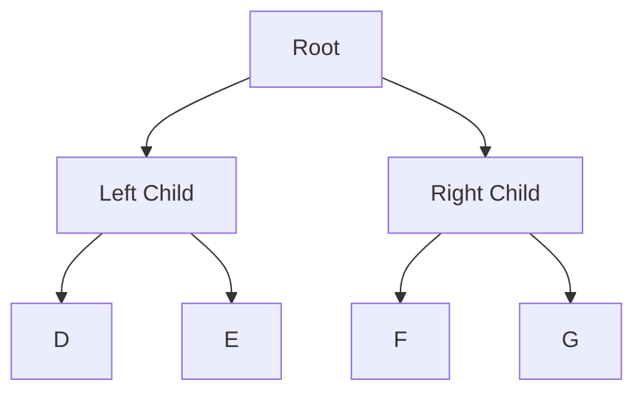
````

### Binary Search Tree (BST)
````markdown
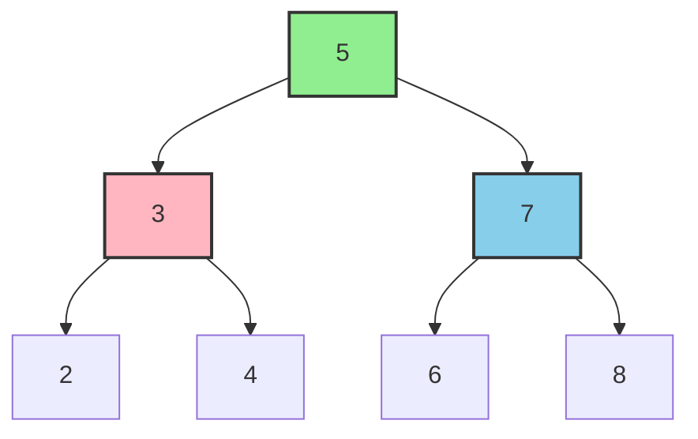
````

### Tree Traversal (Preorder, Inorder, Postorder)
````markdown
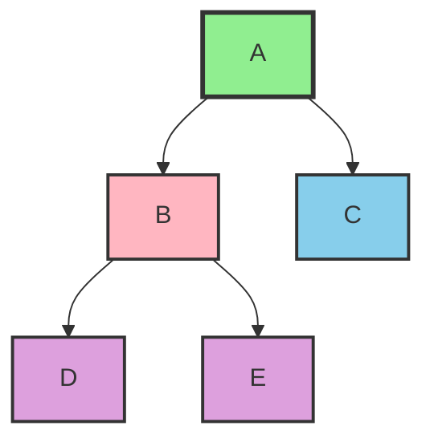
````

## Graph Diagrams

### Undirected Graph
````markdown
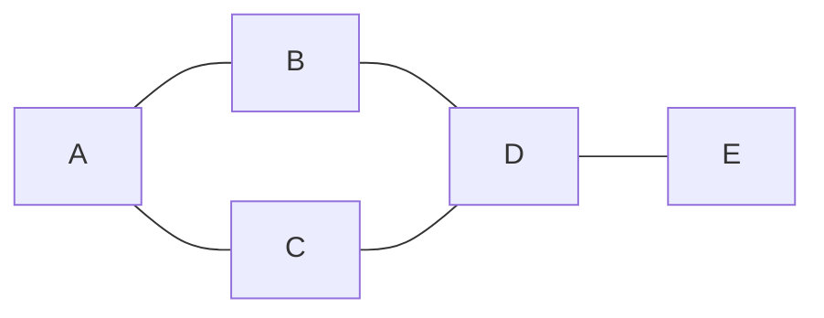
````

### Directed Graph (Digraph)
````markdown
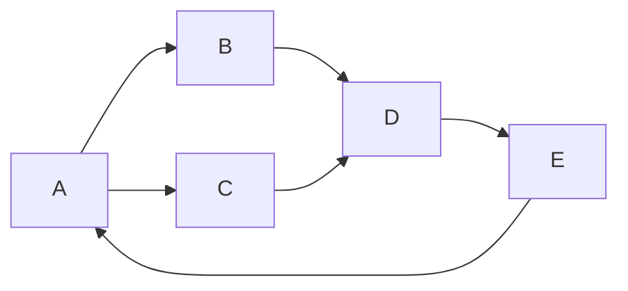
````

### Weighted Graph
````markdown
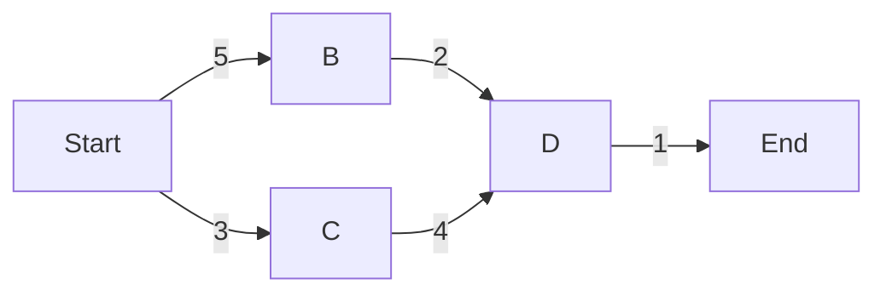
````

### Graph with Visited/Unvisited States
````markdown
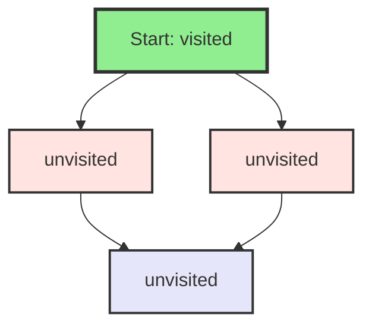
````

### DFS Traversal Visualization
````markdown
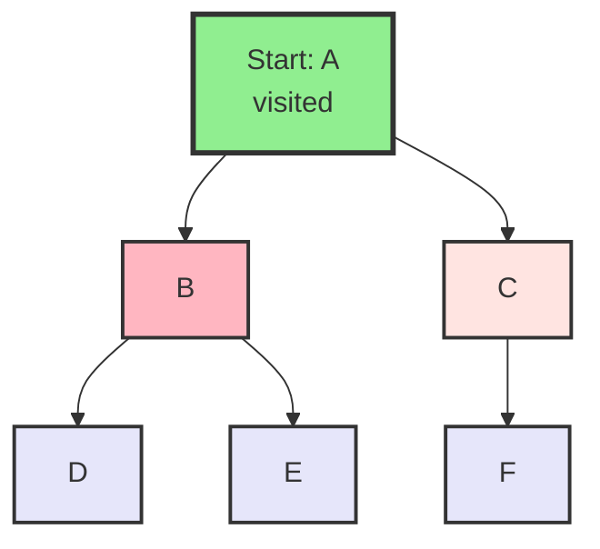
````

### BFS Level-by-Level
````markdown
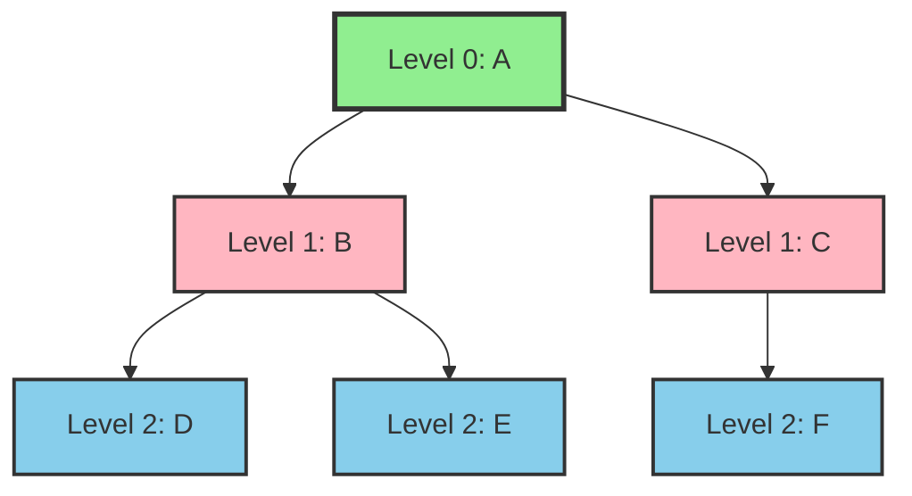
````

## Flowcharts

### Algorithm Flowchart (General)
````markdown
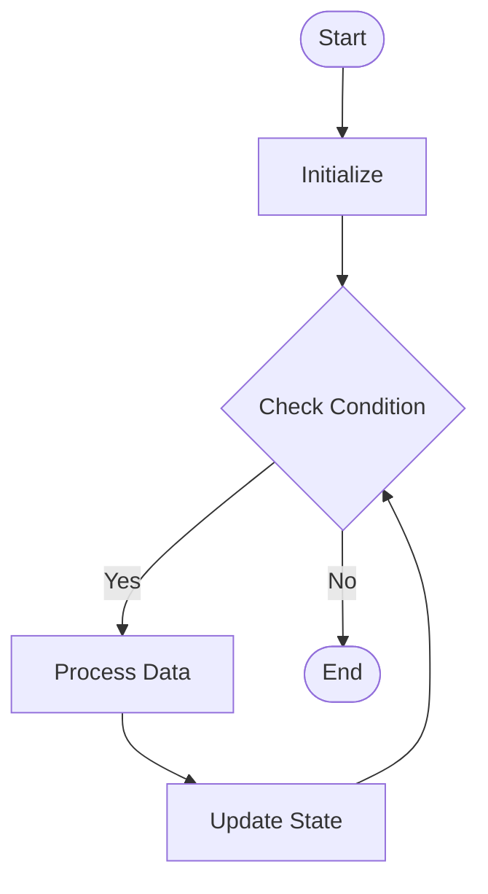
````

### Dijkstra's Algorithm Flowchart
````markdown
```mermaid
flowchart TD
    Start([Start]) --> Init[Initialize distances<br/>dist[start] = 0]
    Init --> PQ[Add start to priority queue]
    PQ --> Select[Select node with min distance]
    Select --> Check{All nodes visited?}
    Check -->|No| Update[Update distances to neighbors]
    Update --> PQ
    Check -->|Yes| End([End])
```
````

### Sorting Algorithm Flowchart
````markdown
```mermaid
flowchart TD
    Start([Start]) --> Input[Input: Array]
    Input --> Loop1[For i = 0 to n-1]
    Loop1 --> Loop2[For j = 0 to n-i-1]
    Loop2 --> Compare{arr[j] > arr[j+1]?}
    Compare -->|Yes| Swap[Swap arr[j] and arr[j+1]]
    Compare -->|No| Next
    Swap --> Next[Next iteration]
    Next --> Check{All iterations done?}
    Check -->|No| Loop2
    Check -->|Yes| End([End: Sorted Array])
```
````

## Sequence Diagrams

### Algorithm Execution Sequence
````markdown
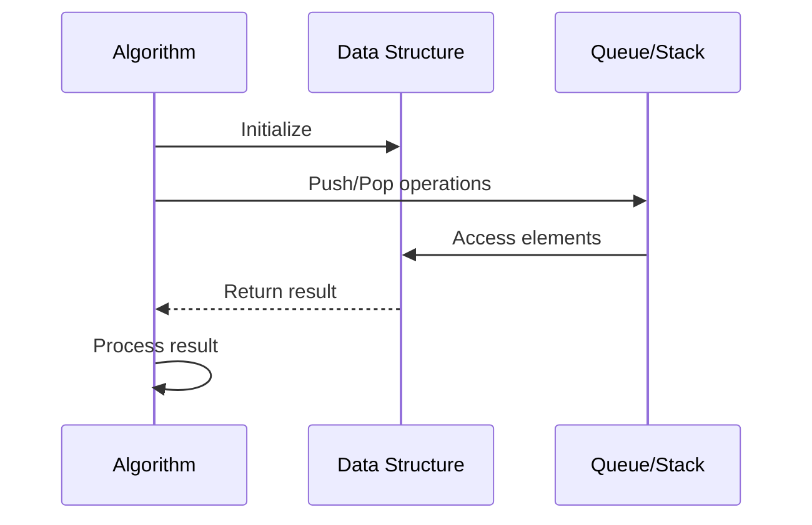
````

### DFS Execution Sequence
````markdown
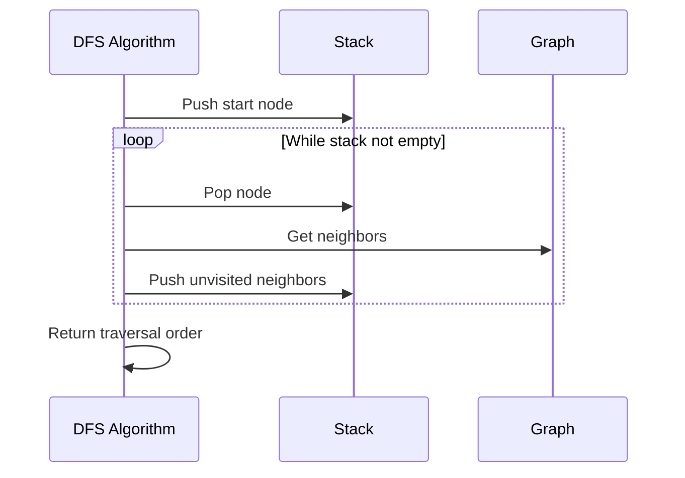
````

## State Diagrams

### Data Structure State Transitions
````markdown
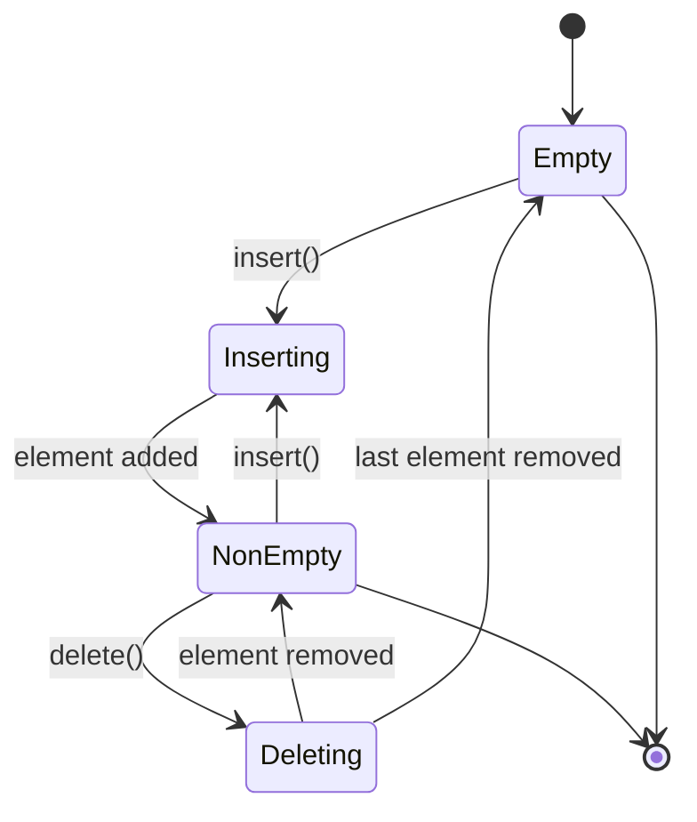
````

### Algorithm State Machine
````markdown
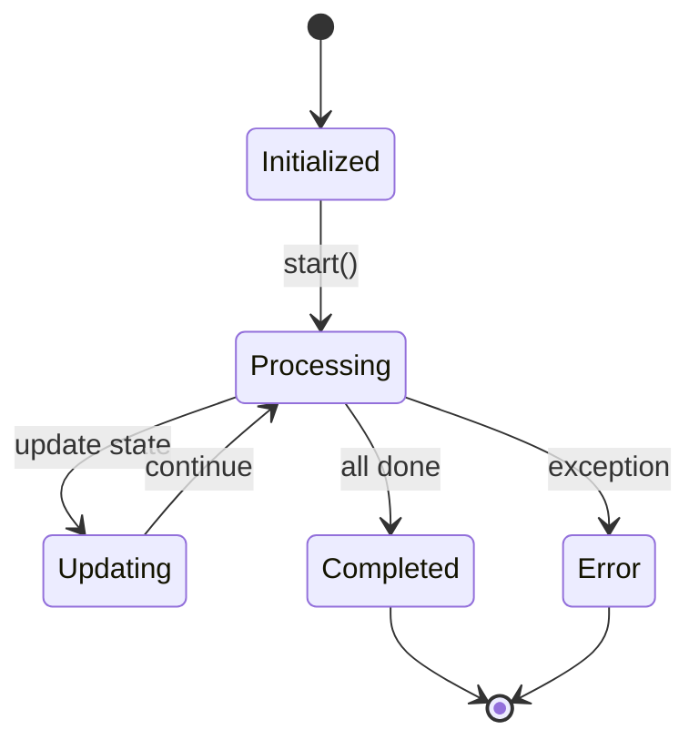
````

## Memory Layout Diagrams

### Array Memory Layout
````markdown
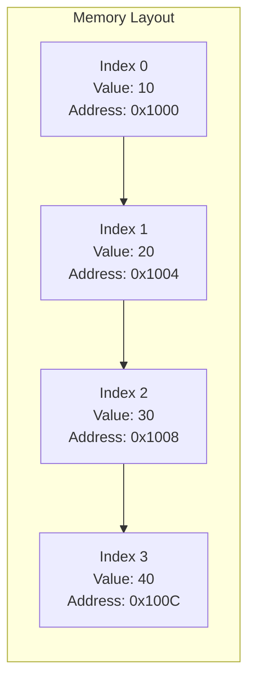
````

### Linked List Memory Layout
````markdown
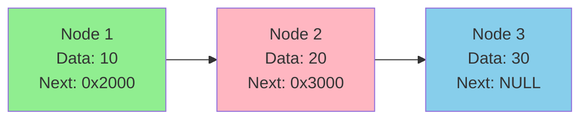
````

## Algorithm Step-by-Step

### Step-by-Step with States
````markdown
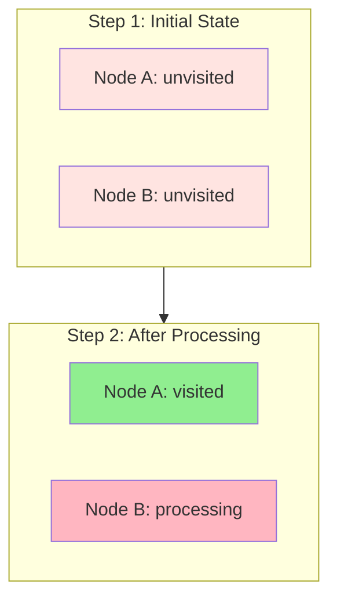
````

### Distance Updates (Dijkstra's)
````markdown
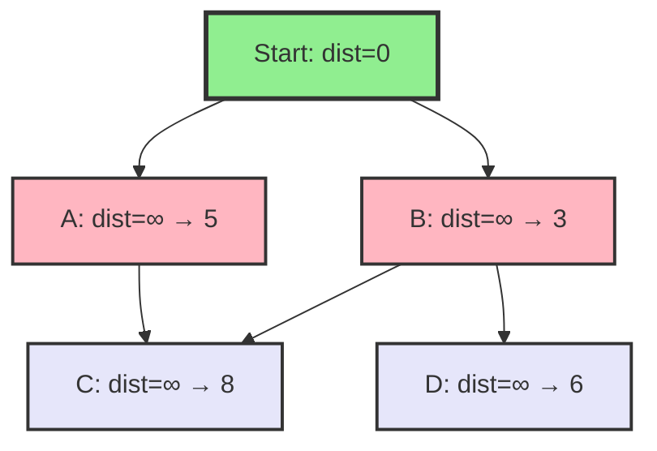
````

## Color Coding Guide

### Standard Color Scheme
- **Green (#90EE90)**: Visited/Processed/Completed
- **Pink (#FFB6C1)**: Currently Processing/Active
- **Light Blue (#87CEEB)**: Next to Process/Queued
- **Lavender (#E6E6FA)**: Unvisited/Unprocessed
- **Light Pink (#FFE4E1)**: Initial/Default State

### Usage Examples
```markdown
# Visited node
style A fill:#90EE90,stroke:#333,stroke-width:3px

# Currently processing
style B fill:#FFB6C1,stroke:#333,stroke-width:2px

# Next in queue
style C fill:#87CEEB,stroke:#333,stroke-width:2px

# Unvisited
style D fill:#E6E6FA,stroke:#333,stroke-width:2px
```

## Tips for Creating Diagrams

1. **Keep it Simple**: Don't overcrowd diagrams with too much information
2. **Use Colors Consistently**: Follow the color coding guide
3. **Add Labels**: Use node labels to show state information
4. **Show Progression**: Use multiple diagrams for step-by-step algorithms
5. **Test Rendering**: Always check how diagrams render on GitHub

## Tools for Diagram Creation

- **Mermaid Live Editor**: https://mermaid.live/ (for testing)
- **GitHub**: Native Mermaid support in Markdown
- **VS Code**: Mermaid preview extensions
- **Pandoc**: For PDF generation with Mermaid support


