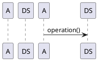
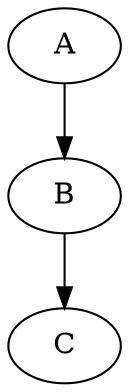
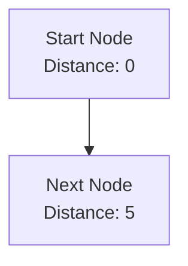
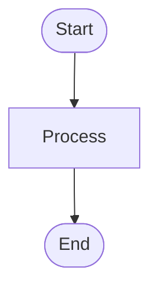
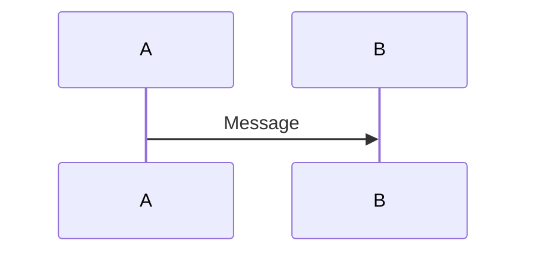
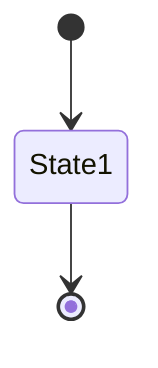
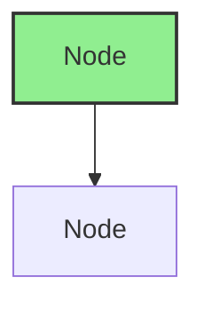

# Diagram Tooling Setup Guide

This guide explains how to set up tools for creating, previewing, and converting diagrams in the Data Structures book.

## Overview

The book uses **Mermaid** as the primary diagramming language because:
- ✅ Text-based (version control friendly)
- ✅ Renders natively on GitHub
- ✅ Works with PDF generation tools
- ✅ Free and open source
- ✅ Supports graphs, trees, flowcharts, and more

## Quick Start

### Option 1: GitHub Native Support (Easiest)

GitHub automatically renders Mermaid diagrams in Markdown files. No setup required!

Just use:
````markdown

````

**Pros:**
- Zero setup
- Works immediately
- Perfect for GitHub-hosted content

**Cons:**
- Only works on GitHub
- No local preview

### Option 2: VS Code with Mermaid Extension (Recommended for Development)

**Installation:**
1. Install VS Code: https://code.visualstudio.com/
2. Install Mermaid Preview extension:
   - Open VS Code
   - Go to Extensions (Cmd+Shift+X / Ctrl+Shift+X)
   - Search for "Markdown Preview Mermaid Support"
   - Install by Matt Bierner

**Usage:**
1. Open any `.md` file
2. Press `Cmd+Shift+V` (Mac) or `Ctrl+Shift+V` (Windows/Linux)
3. Mermaid diagrams will render in preview

**Alternative Extensions:**
- "Mermaid Preview" by vstirbu
- "Markdown Preview Enhanced" by Yiyi Wang (includes Mermaid + more)

### Option 3: Mermaid Live Editor (For Testing)

**Website:** https://mermaid.live/

**Usage:**
1. Go to https://mermaid.live/
2. Paste your Mermaid code
3. See live preview
4. Export as PNG/SVG if needed

**Best for:**
- Testing diagram syntax
- Creating standalone diagrams
- Exporting images

## PDF Generation Setup

### Using Pandoc with Mermaid Filter

**Prerequisites:**
- Node.js and npm installed
- Pandoc installed

**Step 1: Install Mermaid CLI**
```bash
npm install -g @mermaid-js/mermaid-cli
```

**Step 2: Install Pandoc**
```bash
# macOS
brew install pandoc

# Ubuntu/Debian
sudo apt-get install pandoc

# Windows
# Download from https://pandoc.org/installing.html
```

**Step 3: Install Mermaid Filter for Pandoc**
```bash
npm install -g mermaid-filter
```

**Step 4: Convert Markdown to PDF**
```bash
pandoc book.md -o book.pdf --filter mermaid-filter
```

### Alternative: Using md-to-pdf with Mermaid

**Installation:**
```bash
npm install -g md-to-pdf
```

**Usage:**
```bash
md-to-pdf book.md --mermaid
```

## Local Development Workflow

### Recommended Setup

1. **VS Code** with Mermaid Preview extension
   - For editing and previewing

2. **Mermaid Live Editor**
   - For testing complex diagrams

3. **GitHub**
   - For final rendering and hosting

### Workflow Steps

1. **Create/Edit Diagram:**
   ```markdown
   ```mermaid
   graph TD
       A --> B
   ```
   ```

2. **Preview Locally:**
   - Use VS Code preview (Cmd+Shift+V)
   - Or use Mermaid Live Editor

3. **Test on GitHub:**
   - Commit and push
   - View on GitHub to verify rendering

4. **Generate PDF (if needed):**
   ```bash
   pandoc chapters/*.md -o book.pdf --filter mermaid-filter
   ```

## Advanced Tools

### PlantUML (For Sequence Diagrams)

**When to Use:**
- Complex sequence diagrams
- Algorithm step-by-step execution
- State machines

**Installation:**
```bash
# macOS
brew install plantuml

# Or use Docker
docker run -d -p 8080:8080 plantuml/plantuml-server:jetty
```

**Usage:**
````markdown

````

### Graphviz (For Complex Graphs)

**When to Use:**
- Very complex graph layouts
- Precise control over node positioning
- Large graphs

**Installation:**
```bash
# macOS
brew install graphviz

# Ubuntu/Debian
sudo apt-get install graphviz
```

**Usage:**
````markdown

````

**Note:** Graphviz requires external rendering. Use online tools like:
- https://dreampuf.github.io/GraphvizOnline/
- Or render locally: `dot -Tpng graph.dot -o graph.png`

## Diagram Validation

### Check Mermaid Syntax

**Online Validator:**
- https://mermaid.live/ (shows errors)

**CLI Validation:**
```bash
# Install Mermaid CLI
npm install -g @mermaid-js/mermaid-cli

# Validate a file
mmdc -i diagram.mmd -o /dev/null
```

### Common Syntax Errors

1. **Missing closing backticks:**
   ```markdown
   ```mermaid  ❌ Missing closing ```
   graph TD
       A --> B
   ```

2. **Invalid node syntax:**
   ```mermaid
   A[Label]  ✅ Correct
   A(Label)  ✅ Also correct
   A Label   ❌ Missing brackets
   ```

3. **Invalid edge syntax:**
   ```mermaid
   A --> B   ✅ Correct
   A -> B    ✅ Also correct
   A - B     ❌ Invalid
   ```

## Best Practices

### 1. Keep Diagrams Simple
- Don't overcrowd with too many nodes
- Use subgraphs for complex structures
- Break large diagrams into multiple smaller ones

### 2. Use Consistent Styling
- Follow the color scheme from `diagram-templates.md`
- Use consistent node shapes
- Maintain uniform edge styles

### 3. Add Meaningful Labels


### 4. Test Before Committing
- Always preview locally
- Check rendering on GitHub
- Verify PDF output if generating PDFs

### 5. Version Control
- Keep diagrams in Markdown (text-based)
- Don't commit generated images unless necessary
- Use `.gitignore` for generated files

## Troubleshooting

### Diagrams Not Rendering on GitHub

**Check:**
1. Syntax is correct (test on mermaid.live)
2. Using triple backticks with `mermaid` language tag
3. No special characters breaking the syntax

### PDF Generation Issues

**Common Problems:**
1. **Mermaid filter not found:**
   ```bash
   npm install -g mermaid-filter
   ```

2. **Pandoc version too old:**
   ```bash
   # Update pandoc
   brew upgrade pandoc  # macOS
   ```

3. **Missing dependencies:**
   ```bash
   npm install -g @mermaid-js/mermaid-cli
   ```

### VS Code Preview Not Working

**Solutions:**
1. Install/update Mermaid extension
2. Reload VS Code window (Cmd+R / Ctrl+R)
3. Check extension is enabled
4. Try alternative extension

## Resources

### Documentation
- **Mermaid Docs:** https://mermaid.js.org/
- **Mermaid Syntax:** https://mermaid.js.org/intro/syntax-reference.html
- **Pandoc Docs:** https://pandoc.org/MANUAL.html

### Tools
- **Mermaid Live Editor:** https://mermaid.live/
- **Graphviz Online:** https://dreampuf.github.io/GraphvizOnline/
- **PlantUML Online:** http://www.plantuml.com/plantuml/

### Examples
- **Mermaid Examples:** https://mermaid.js.org/ecosystem/tutorials.html
- **Book Templates:** See `docs/diagram-templates.md`

## Quick Reference

### Common Mermaid Syntax

**Graph:**


**Flowchart:**


**Sequence:**


**State:**


### Styling


## Next Steps

1. **Install VS Code extension** for local preview
2. **Test a diagram** using the templates
3. **Convert one chapter** as a proof of concept
4. **Set up PDF generation** if needed
5. **Create a workflow** that works for you

For diagram templates, see `docs/diagram-templates.md`.

