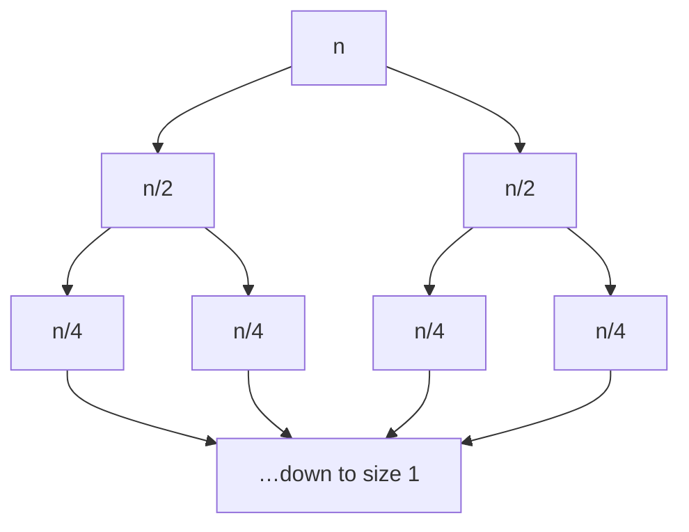

import Compare from '../../components/bench/Compare';

Complexity analysis answers one question: as the input grows, how does the cost grow with
it? That question matters enormously, and Big-O notation is the right tool for it. But Big-O
was designed to throw away two things — the constant factor and the cost of touching
memory — and on real hardware those two things routinely decide which algorithm wins. This
chapter teaches Big-O, and then teaches exactly what it hides, because you need both to make
good decisions.

## Big-O in one page

Big-O describes the **growth rate** of an algorithm's cost as the input size `n` grows,
ignoring constant factors and lower-order terms. Formally, `f(n) = O(g(n))` if `f(n) ≤ c·g(n)`
for some constant `c` and all `n` past some threshold. Informally: *what does the cost curve
look like as `n` heads toward infinity?*

| Notation | Name | Example operation |
|----------|------|-------------------|
| O(1) | Constant | Array index, hash lookup (average) |
| O(log n) | Logarithmic | Binary search, balanced-tree lookup |
| O(n) | Linear | Scanning an array |
| O(n log n) | Linearithmic | Merge sort, heap sort, `std::sort` |
| O(n²) | Quadratic | Nested loop over all pairs |
| O(2ⁿ) | Exponential | Generating every subset |

The distances between these rows are staggering. At `n = 1,000,000`, a log n algorithm does
about 20 units of work, a linear one does a million, and a quadratic one does a trillion —
the difference between instant and *next week*. That is why growth rate is the first thing to
reason about, and why the rest of this book cares about it.

The mechanics are worth knowing and quick to state:

- **Drop constants.** `O(2n)` is `O(n)`. Big-O is about shape, not scale.
- **Drop lower-order terms.** `O(n² + n)` is `O(n²)`. The fastest-growing term wins as `n → ∞`.
- **Sequential work adds; nested work multiplies.** Two loops one after another are `O(a + b)`;
  one loop inside another is `O(a × b)`.

```cpp
// O(n): work proportional to the array length
long sum(const std::vector<int>& a) {
    long total = 0;
    for (int x : a) total += x;   // n iterations, O(1) each
    return total;
}

// O(n²): for each element, look at every other element
void allPairs(const std::vector<int>& a) {
    for (size_t i = 0; i < a.size(); ++i)
        for (size_t j = i + 1; j < a.size(); ++j)
            consider(a[i], a[j]);  // n(n-1)/2 pairs → O(n²)
}
```

That is genuinely most of the notation. The interesting part — the part most books skip — is
what happens when two algorithms land in the *same* Big-O class, because that is where real
engineering decisions actually live, and Big-O has just told you it cannot help.

## What Big-O throws away, part 1: the constant factor

Here is the sentence that trips up most people who learned Big-O from a textbook: **two
algorithms that are both `O(n)` can differ in speed by 10×, 100×, or more.** Big-O says they
scale the same way. It says nothing about how much work each unit of that scaling costs.

Consider two loops over the same array. Both touch every element exactly once. Both are `O(n)`.
One adds each value into a running total; the other runs each value through a hash function
first. Same number of iterations, same growth curve — but one does one operation per element
and the other does fifteen.

<Compare
  client:visible
  bench="constantFactor"
  title="Two O(n) loops over the same array"
  blurb="The left loop sums each value; the right loop hashes each value before combining it. Both make one pass, both are O(n). The array is small enough to sit in cache, so this measures pure work-per-element — the constant Big-O discards."
  seconds={4}
  caption="for the same element count and the same O(n) — the work per element is the only difference"
/>

That gap is the **constant factor**, and Big-O deletes it by definition. In an interview, "it's
`O(n)`" is the right answer. In production, the constant factor is often the entire story:

- `std::sort` is `O(n log n)` and beats a hand-written `O(n)` bucket sort on most real inputs,
  because its constant is tiny and the bucket sort's is not.
- A linear scan of a small array beats a binary search on it, even though binary search is
  `O(log n)` and the scan is `O(n)` — the scan's inner loop is a handful of instructions with
  no branch misprediction, and for small `n` that wins outright.
- Reading a value from L1 cache and reading one from main memory are both `O(1)`. One is about
  a hundred times slower than the other, which brings us to the second thing Big-O hides.

## What Big-O throws away, part 2: where the data lives

Big-O's founding assumption is that every memory access costs the same. That was roughly true
in 1975. It has been false for thirty years. A modern CPU can execute a few hundred
instructions in the time it takes to fetch one value from main memory, so processors keep small,
fast caches in front of the big, slow RAM — and whether your data is in cache or not is
invisible to Big-O, because a cache hit and a cache miss are both "one array access," both `O(1)`.

The classic demonstration is the array versus the linked list. Both store `n` elements. Walking
either is `O(n)` — one dereference per element. But an array's elements are laid out
contiguously, so the CPU's prefetcher sees the sequential pattern and fetches the next cache
line before you ask for it. A linked list's nodes are scattered wherever the allocator put them,
so every `node->next` is a jump to an unpredictable address — a cache miss the hardware cannot
hide.

<Compare
  client:visible
  bench="arrayVsList"
  title="Walking an array vs. walking a linked list"
  blurb="The same 32 MiB of elements, visited once each. Contiguous (as a std::vector stores them) versus scattered across memory (as a std::list does). Identical element count, identical O(n), identical one-dereference-per-element."
  seconds={4}
  unit="ns per element"
/>

Same asymptotic complexity, and on most machines a 10–50× difference in wall-clock time. This
is why `std::vector` is the right default container and `std::list` almost never is, despite
the linked list's theoretically attractive `O(1)` insertion. It is also why the chapter that
this book is really about — [the memory hierarchy](/chapters/memory-hierarchy) — measures your
machine's cache in detail. For now the lesson is narrow and important: **when two algorithms
have the same Big-O, the one with the better memory-access pattern usually wins, and Big-O
cannot see the difference.**

## Analyzing time complexity

With the caveats in place, here is how you actually determine an algorithm's Big-O. You count
how the number of operations grows, keeping only the dominant term.

**A single loop over the input is `O(n)`.** **Nested loops over the input multiply** — two
levels give `O(n²)`, three give `O(n³)`. **Halving the search space each step is `O(log n)`** —
the signature of binary search:

```cpp
int binarySearch(const std::vector<int>& a, int target) {
    int lo = 0, hi = static_cast<int>(a.size()) - 1;
    while (lo <= hi) {
        int mid = lo + (hi - lo) / 2;   // avoids lo+hi overflow
        if (a[mid] == target) return mid;
        if (a[mid] < target) lo = mid + 1;
        else                 hi = mid - 1;
    }
    return -1;
}
// Each step discards half the remaining range: O(log n).
```

For **recursive** algorithms, write a recurrence — the cost of a problem in terms of its
subproblems — and solve it. Merge sort splits the array in two, sorts each half, and merges the
results in linear time:

```cpp
void mergeSort(std::vector<int>& a, int lo, int hi) {
    if (lo >= hi) return;
    int mid = lo + (hi - lo) / 2;
    mergeSort(a, lo, mid);        // T(n/2)
    mergeSort(a, mid + 1, hi);    // T(n/2)
    merge(a, lo, mid, hi);        // O(n) to merge
}
// Recurrence: T(n) = 2·T(n/2) + O(n)
```

You can *see* why that recurrence solves to `O(n log n)` by drawing the recursion tree. Each
level does `O(n)` total work (the merges), and there are `log n` levels (you can only halve `n`
that many times before reaching size 1):



`O(n)` work per level × `log n` levels = `O(n log n)`. This picture generalizes: it is the
intuition behind the Master Theorem, which Chapter 17 makes precise.

## Space complexity works the same way

Space complexity measures **auxiliary memory** — extra space beyond the input — as a function
of `n`. A loop using a few variables is `O(1)`; allocating a copy of the input is `O(n)`; a 2D
table is `O(n²)`.

One source is easy to miss: **the call stack**. Each pending recursive call holds a frame, so a
recursion `n` deep uses `O(n)` stack space even if it allocates nothing itself. Merge sort's
`O(n log n)` time comes with `O(n)` auxiliary space for the merge buffers plus `O(log n)` stack;
an in-place iterative algorithm might do the same work in `O(1)` space. That tension — spend
memory to save time, or vice versa — is the **space-time tradeoff**, and it appears constantly:

| Problem | Time-optimized | Space-optimized |
|---------|----------------|-----------------|
| Detect duplicates | `O(n)` time, `O(n)` space (hash set) | `O(n log n)` time, `O(1)` space (sort first) |
| Fibonacci | `O(n)` time, `O(n)` space (memoize) | `O(n)` time, `O(1)` space (two rolling variables) |

## Best, average, and worst case

An algorithm's cost often depends on the *particular* input, not just its size, so we
distinguish three cases. **Worst case** (the `O` you usually quote) is the ceiling — the most
work any input of size `n` can force. **Average case** is the expected cost over typical inputs.
**Best case** is the floor.

Quicksort is the standard example: `O(n log n)` on average when pivots split the array roughly
in half, but `O(n²)` in the worst case when every pivot is the smallest or largest element (a
sorted array, with a naive pivot choice). Which number you care about depends on your setting —
a real-time system that must never stutter budgets for the worst case; a batch job that runs
overnight cares about the average.

There is a subtler idea here too. **Amortized analysis** asks for the average cost per operation
across a *sequence*, when occasional expensive operations are paid for by many cheap ones — and,
unlike average-case analysis, it assumes nothing about the input distribution. The dynamic array
(`std::vector`) is the canonical case: `push_back` is `O(1)` until the buffer fills, then it
doubles capacity and copies everything, an `O(n)` operation. But doubling means those `O(n)`
copies happen only at sizes 1, 2, 4, 8, …, so across `n` pushes the total copying work is `2n`,
and the **amortized** cost per `push_back` is `O(1)`. The occasional expensive resize is spread
across all the cheap insertions that preceded it.

## Engineering judgment: when the theory bends

Everything above is true and useful. Here is how experienced engineers actually apply it, which
is not by mechanically preferring the smaller Big-O.

**For small `n`, growth rate barely matters.** If `n` is always under a hundred — a config list,
a game's entities, the columns of a table — an `O(n²)` loop runs in microseconds and is often
clearer than the `O(n log n)` alternative. Insertion sort is `O(n²)`, yet essentially every
production sort (including `std::sort`) switches *to* insertion sort for subarrays below ~16
elements, because below that size its tiny constant beats quicksort's overhead. The asymptotically
worse algorithm is the correct engineering choice.

**Know where the crossover is.** The right question is rarely "which has smaller Big-O" but "at
my actual `n`, which is faster?" Two curves that cross at `n = 5,000` make the answer depend
entirely on whether your inputs are usually larger or smaller than that — and the only way to
know is to measure, which is what [Chapter 19](/chapters/benchmarking-and-load-testing) is about.

**The constant factor and the memory pattern are not footnotes.** As the two benchmarks above
showed, they can be the whole difference between two same-Big-O algorithms. "It's `O(n)`" ends
the interview answer; it begins the production analysis.

## Complexity mistakes interviewers love

A short catalog of hidden costs, because these are where the confident wrong answer usually
happens — someone quotes the Big-O of the code they *wrote* and misses the Big-O of the calls
they *made*:

| The code | Looks like | Actually is | Why |
|----------|-----------|-------------|-----|
| `v.insert(v.begin(), x)` | `O(1)` | `O(n)` | Every later element shifts right |
| `v.erase(v.begin())` | `O(1)` | `O(n)` | Same shift, leftward |
| `s += c` in a loop | `O(n)` | up to `O(n²)` | Each append may reallocate and copy |
| `find(v.begin(), v.end(), x)` in a loop | `O(n)` | `O(n²)` | A linear scan hidden inside a linear loop |
| `unordered_map` lookup | `O(1)` | `O(n)` worst case | Hash collisions can degrade every bucket to a list |

The through-line: **a library call is not free just because it is one line of your code.** The
complexity of a function includes the complexity of everything it calls. When you analyze a
loop, look at what each line inside it actually costs — especially container mutations and
searches, which are the usual culprits.

## Takeaways

- **Big-O measures growth rate**, dropping constants and lower-order terms — the right tool for
  reasoning about scale, and the first thing to get right.
- **It deliberately hides the constant factor.** Two `O(n)` algorithms can be 10× or 100× apart;
  you measured it above.
- **It deliberately hides the memory hierarchy.** A cache hit and a cache miss are both `O(1)`,
  and the difference between them decides array-vs-list, which you also measured above.
- **Between two algorithms in the same complexity class** — where most real decisions live — the
  constant factor and the memory-access pattern break the tie, and only measurement settles it.
- **Watch for hidden complexity** in library calls, especially container inserts, erases, string
  appends, and searches inside loops.

Next, [arrays and strings](/chapters/basic-data-structures) — the contiguous, cache-friendly
foundation that most fast data structures are quietly built on, and the first place the memory
lessons here start paying off.
