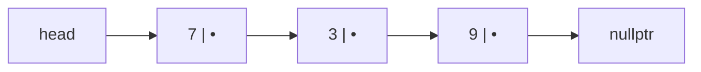

import Compare from '../../components/bench/Compare';
import InProduction from '../../components/InProduction.astro';
import InterviewChecklist from '../../components/InterviewChecklist.astro';
import CppProblem from '../../components/problem/CppProblem';
import { reverseList } from '../../lib/problems';

The last chapter ended on the [array](/chapters/basic-data-structures)'s one genuine weakness:
because its elements are packed contiguously, inserting or deleting anywhere but the end means
shifting everything after it — an O(n) memmove. If your workload is insert-in-the-middle heavy,
that's the wall you hit.

The linked list exists to knock that wall down. Its entire reason for being is to make insertion
and deletion O(1): instead of one contiguous block, it scatters each element into its own
independently-allocated node and threads the nodes together with pointers. To splice a new element
in, you rewrite a couple of pointers — no shifting, no memmove, no matter how big the list is.

That's the promise. The catch is that it pays for it with the one thing that made arrays fast, and
the whole point of this chapter is to measure exactly what that costs. Spoiler: on real hardware the
bill is so steep that the linked list is almost never the right answer — which is itself one of the
most useful things a systems engineer can internalize.

## How it works

A node is the whole idea: a value plus a pointer to the next node.

```cpp
template <typename T>
struct Node {
    T value;
    Node<T>* next;   // nullptr marks the end
};
```

You hold a `head` pointer to the first node; follow `next` until it's `nullptr` and you've walked
the list. That's a **singly linked list**. A **doubly linked list** adds a `prev` pointer to each
node so you can walk backward too and delete a node given only a handle to it — the price is a
second pointer's worth of memory per element.



The superpower is the splice. **Given a pointer to a node, inserting or deleting next to it is
O(1)** — you rewrite `next` (and `prev`), touch nothing else, and every other node keeps its
address:

```cpp
// insert `n` after node `p` — O(1), no shifting
n->next = p->next;
p->next = n;
```

The catch hides in three words: *given a pointer to a node*. A linked list has **no random access**.
There is no `base + i × size` arithmetic to jump to element `i`; the only way to reach it is to
start at `head` and follow `next` `i` times. So finding anything is O(n), and the O(1) splice only
helps once you're already holding the node. That single asymmetry — cheap to edit, expensive to
find — governs everything about when a linked list is and isn't useful.

## The hardware cost: the pointer chase

Here is where the theory meets the machine, and where the linked list's promise quietly falls apart.

Walk an array and you touch memory in a straight, predictable line. The CPU's prefetcher sees the
pattern and streams the next cache line in before you ask for it; almost every access is a cache hit.
The array is the memory system's best case.

Walk a linked list and every step is a leap into the dark. Each node was allocated separately,
whenever it happened to be inserted, so it lives at some unrelated address on the heap. Following
`next` means dereferencing a pointer to an address the CPU could not have predicted — so the
prefetcher can't help, and each hop is very likely a **cache miss**: a ~100-cycle stall waiting for
main memory. This is the **pointer chase**, and you pay it once per node, for the entire length of
the list.

Both walks are O(n) and do one dereference per element. Big-O says they're identical. Watch what the
hardware actually does — the same elements, visited once each, contiguous in a `std::vector` versus
scattered across the heap in a `std::list`:

<Compare
  client:visible
  bench="arrayVsList"
  title="Walking an array vs. walking a linked list"
  blurb="The same elements, visited once each: contiguous in memory (a std::vector) versus scattered across the heap and linked by pointers (a std::list). Identical element count, identical O(n), identical one-dereference-per-element."
  seconds={4}
  unit="ns per element"
/>

Same asymptotic complexity, and often **30–50× apart**. Nothing in that gap is algorithmic — it is
entirely cache misses. The array's traversal keeps the prefetcher fed; the list's traversal stalls
on main memory at nearly every node. This is the concrete, measurable reason `std::list` is almost
never the right choice, and why "linked lists are O(1) to insert" is one of the most misleading true
statements in the field: the O(1) is real, and it's swamped by the constant factor the moment you
have to *reach* the insertion point.

It gets worse in aggregate. Every node also carries the memory overhead of its pointer(s) — 8 bytes
for singly, 16 for doubly — plus per-node allocator bookkeeping, so a list of small values can use
2–3× the memory of the equivalent array, which means fewer elements per cache line and *more* misses.
The array wasn't just faster to walk; it was denser to begin with.

## Engineering judgment: when a linked list actually wins

The list is not useless — it's *specialized*. It wins in exactly the situations where its one real
strength applies and its cache penalty doesn't dominate:

- **You already hold node handles and need O(1) splice without disturbing anything else.** The
  canonical case is an **LRU cache**: a doubly linked list of entries in recency order, plus a hash
  map from key to node. On a hit you unlink the node and move it to the front in O(1); on eviction
  you drop the tail in O(1). You never *search* the list — the hash map hands you the node — so you
  pay the splice cost and skip the traversal cost entirely.
- **You need stable addresses.** A `std::vector` invalidates every pointer and iterator into it when
  it reallocates on growth. Linked-list nodes never move, so pointers to them stay valid for the
  node's whole life. If other data structures hold references to your elements, that stability can be
  worth more than cache behavior.
- **You want an intrusive list.** Embed the `next`/`prev` pointers *inside* the element's own struct
  rather than in a separate node. Now the same object can live on several lists at once, splicing
  requires no allocation, and there's no separate node to cache-miss on. This is how systems code
  actually uses linked lists — see the kernel below.

Outside of those, the rule is blunt and it's the lesson to carry out of this chapter: **default to a
`std::vector`.** The array's cache win almost always beats the list's O(1)-insert win, even for
workloads that look insert-heavy on paper — because "insert in the middle" first requires "find the
middle," and finding is where the list bleeds. *Vector versus list: it's almost always vector.*

## Where this actually lives

When linked lists do show up in production, it's overwhelmingly the intrusive, handle-in-hand form
above — not the "list of ints" from a textbook.

<InProduction>
- **The Linux kernel's `list_head`** — the kernel is stitched together with intrusive doubly-linked lists. A `struct list_head` is embedded inside processes, files, timers, and thousands of other objects, so the same object threads onto multiple lists with no allocation and O(1) splicing. It's the single most-used data structure in the kernel.
- **LRU caches** — a doubly linked list (recency order) paired with a hash map (key → node) gives O(1) lookup, O(1) promote-on-hit, and O(1) evict-the-tail. It's the standard cache eviction structure; Redis approximates it with sampling to avoid even the list's per-entry pointer overhead.
- **Free lists in memory allocators** — an allocator tracks its pool of unused blocks as a linked list, often threading each free block's `next` pointer *through the free memory itself*. Allocation pops the head, freeing pushes onto it — both O(1), no metadata array required.
- **Adjacency lists for graphs** — a sparse graph stores each vertex's neighbors as a list, giving O(V + E) space instead of the O(V²) an adjacency matrix would waste. The next few chapters lean on this representation constantly.
- **OS scheduler queues** — the ready and blocked queues that a scheduler moves threads between are intrusive lists: moving a thread from "blocked" to "ready" is an O(1) unlink-and-relink, with no copying of the thread's state.
</InProduction>

Notice the pattern: every one of these holds the node directly and never traverses to find it. That
is the only shape in which the linked list's O(1) splice pays off.

## Try it: reverse a linked list

The definitive linked-list exercise, and it's pure pointer rewiring: walk the list and flip each
node's `next` to point at the node before it. The one habit that makes or breaks it — save `next`
into a temporary *before* you overwrite it, or you lose the rest of the list. No cache tricks here,
just careful pointer bookkeeping. Fill in `reverseList` and run the tests.

<CppProblem client:visible starter={reverseList.starter} harness={reverseList.harness} prelude={reverseList.prelude} />

## Interview checklist

<InterviewChecklist>
**Say this, not that.** "Linked lists are O(1) insert" is a trap answer. The full one: "O(1) insert
or delete *given a node handle* — but O(n) to find anything, no random access, and a cache miss per
node on traversal, so in practice a `std::vector` beats it for almost everything. It earns its keep
only when you already hold the node: intrusive lists, LRU eviction, stable addresses."

**The techniques interviewers are really testing**
- **Reverse a linked list** — the iterative three-pointer rewire (`prev`, `curr`, `next`). Save
  `next` *before* you overwrite `curr->next`, or you lose the rest of the list. This is the canonical
  pointer-manipulation question.
  ```cpp
  Node* reverse(Node* head) {
      Node* prev = nullptr;
      while (head) {
          Node* next = head->next;   // save before rewiring
          head->next = prev;
          prev = head;
          head = next;
      }
      return prev;                   // new head
  }
  ```
- **Fast and slow pointers (Floyd's).** One pointer hops one node, the other two. They test a whole
  family of problems: **cycle detection** (if fast ever meets slow, there's a loop), and **find the
  middle** (when fast hits the end, slow is at the midpoint) in a single pass with O(1) space.
- **Merge two sorted lists.** Use a **dummy head** node so you never special-case the empty result,
  splice the smaller front node each step, then attach the leftover tail. O(n + m), O(1) extra.
- **Why you can't binary-search a linked list.** Binary search needs O(1) random access to jump to
  the midpoint; a list makes that jump O(n), which collapses the whole method back to O(n). Knowing
  *why* is the point — it's the array's superpower stated in the negative.
- **The dummy-head trick.** A throwaway node before the real head kills the "what if I'm deleting or
  inserting at the head?" edge case across reversal, merging, and removal problems. Reach for it by
  default.

**Common mistakes**
- Losing the `next` pointer during reversal — overwrite `curr->next` before saving it and you've
  severed and leaked the tail.
- Not handling the head as a special case — deleting or inserting at position 0 without a dummy head.
- Off-by-one in fast/slow — starting both at `head` versus `head->next`, or looping on `fast &&
  fast->next` versus `fast->next && fast->next->next`, flips which of two middle nodes you land on and
  whether you handle even-length lists correctly.
</InterviewChecklist>

## Takeaways

- The linked list exists to make **insertion and deletion O(1)** by scattering elements into
  pointer-linked nodes instead of one contiguous block — solving the array's one weakness.
- It pays for that with the array's superpower: **no random access** (finding anything is O(n)) and
  a **cache miss per node** on traversal, because each node lives at an unpredictable heap address the
  prefetcher can't anticipate.
- You measured the result: same O(n), **often 30–50× slower** than an array walk, entirely from cache
  misses. This is why `std::list` is almost never the right choice.
- A linked list wins only when you **already hold the node** and need O(1) splice without moving or
  invalidating anything else — **intrusive lists** (the Linux kernel), **LRU caches**, allocator free
  lists, adjacency lists. Otherwise: **default to `std::vector`**.

Next, [stacks and queues](/chapters/stacks-and-queues) — the two most useful restrictions you can put
on a sequence.
