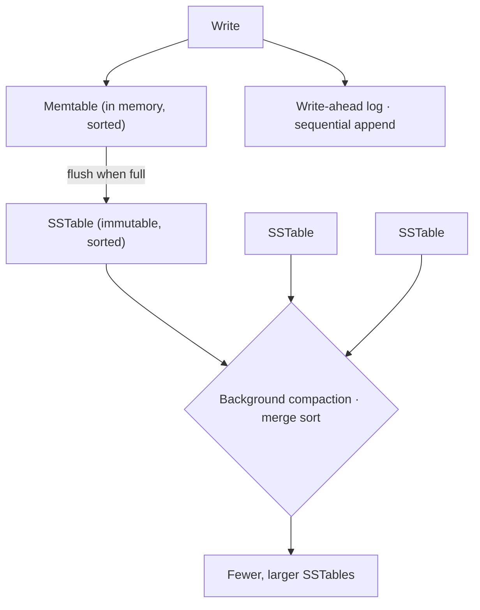

import InProduction from '../../components/InProduction.astro';
import InterviewChecklist from '../../components/InterviewChecklist.astro';

The [B-tree](/chapters/b-trees) is the right answer for reads. It keeps data ordered, answers point
lookups in a few shallow, cache-friendly steps, and streams ranges from its linked leaves. But it
has a weakness we flagged and left open: **writes**. Every insert must find its leaf and update it in
place, and once your data is larger than memory, those leaf updates are random writes scattered
across the disk. Storage hardware — spinning disks especially, but even SSDs — is dramatically
slower at random writes than sequential ones. A database ingesting a firehose of writes spends its
life seeking, and the B-tree's great read structure becomes a write bottleneck.

The log-structured merge tree begins from a single, almost stubborn idea: **never do a random write.**
Everything the disk sees should be a sequential append, because that is the one thing storage is
fast at. Getting from that constraint to a working, still-fast-to-read database is the whole design,
and it is one of the most influential ideas in modern systems — the reason a generation of
write-optimized databases exists.

## How you write without writing in place

If you can't update data in place, you have to do three things: buffer writes in memory, flush them
to disk in sorted batches, and clean up the mess later in the background.

**Writes go to memory first.** A new write lands in an in-memory sorted structure — the *memtable*,
usually a balanced tree or skip list — and, for durability, is also appended to a write-ahead log
(itself a sequential append). The write returns immediately. It never touched the main data on disk.

**Full memtables flush to immutable files.** When the memtable fills, it is written out, in one
sequential pass, as a sorted file on disk called an *SSTable* (sorted string table). Crucially the
file is **immutable** — once written it is never modified. A newer write to the same key doesn't edit
the old file; it just lives in a newer memtable and, eventually, a newer SSTable. Deletes are the
same trick: you append a *tombstone* marker rather than going back to erase anything.

**Background compaction merges the files.** Over time you accumulate many SSTables, and a key might
appear in several of them. A background process periodically merges sorted SSTables into fewer, larger
ones — a merge sort of already-sorted files — discarding superseded values and tombstones as it goes.
This *compaction* is where the "merge" in the name comes from, and it too writes sequentially.

Every arrow that touches disk is a sequential write. That is the payoff: an LSM tree absorbs writes
at close to the disk's sequential speed, far above what a B-tree's random leaf updates allow.

## What it costs: reads and write amplification

There is no free lunch, and the LSM tree's trade is the mirror image of the B-tree's. A read now has
to check multiple places — the memtable, then potentially several SSTables from newest to oldest —
because the value could be in any of them. Left naive that would be slow, so LSM engines lean on two
things you've already met in this book: a **[Bloom filter](/chapters/advanced-data-structures)** per
SSTable to skip files that definitely don't contain the key, and the fact that each SSTable is
**sorted** so it can be binary-searched or indexed with a sparse B-tree-like block index. Reads are
slower than a B-tree's, but with these aids, acceptably so.

The other cost is **write amplification**: because compaction rewrites data multiple times as it
merges levels, a single logical write may be physically written several times over its life. LSM
engineering is largely the art of tuning compaction to balance three amplifications — write (how many
times data is rewritten), read (how many files a lookup checks), and space (how much dead data
lingers before it's compacted away). Different databases pick different points on that triangle, and
picking well for a workload is a real operational skill.

The clean way to hold the whole trade in your head: **a B-tree optimizes reads and pays on writes; an
LSM tree optimizes writes and pays on reads.** Which one a database chooses tells you what workload
its designers cared about most.

<InProduction>
- **RocksDB and LevelDB** — the canonical embedded LSM engines. RocksDB (Facebook's fork of Google's LevelDB) is the storage layer inside an enormous amount of infrastructure: it backs Kafka Streams' state stores, CockroachDB, TiKV, and countless internal databases.
- **Cassandra and ScyllaDB** — wide-column stores built for write-heavy, always-on workloads; their SSTable-and-compaction storage is a direct, canonical LSM implementation.
- **HBase and Google Bigtable** — Bigtable's design paper is where much of this vocabulary (SSTable, memtable, compaction) entered wide use; HBase is its open-source lineage.
- **Search engines** — Lucene, under OpenSearch and Elasticsearch, is LSM-shaped: indexing buffers documents in memory, flushes **immutable segments** to disk, and a background merge process compacts small segments into larger ones. A "force merge" is compaction by another name. The write path of a search cluster is this chapter.
</InProduction>

## The end of the line: when one machine isn't enough

Follow the arc this book has walked. An [array](/chapters/basic-data-structures) gave contiguous
speed but slow middle-inserts; a [linked list](/chapters/linked-lists) fixed inserts but lost the
cache; a [hash table](/chapters/hash-tables-and-hashing) gave `O(1)` lookup but lost order; a
[tree](/chapters/trees-and-binary-trees) restored order at `O(log n)`; a [B-tree](/chapters/b-trees)
made that fast on real storage; and an LSM tree made *writing* fast at scale. Each structure exists
because the previous one hit a wall.

The LSM tree hits the last wall this book will name: a single machine. However well one node ingests
writes, eventually the data, the traffic, or the required durability exceeds what one machine can
hold. The response is to spread the data across many machines — and to decide *which* machine owns
which key, you reach back to the very first idea in the [hash-tables](/chapters/hash-tables-and-hashing)
chapter. `hash(key) % N` picks a node; **consistent hashing** lets `N` change without reshuffling the
world. The storage engine on each node is very often an LSM tree; the routing layer that binds them
into one logical database is consistent hashing. That is how systems like Cassandra, DynamoDB, and
distributed search clusters are built — a hash table of machines, each running a log-structured merge
tree. The data structures you started with, all the way down, are the ones running the largest systems
in the world.

<InterviewChecklist>
**Say this, not that.** "An LSM tree is a write-optimized data structure" is the headline; the substance is: "It never updates in place — writes buffer in an in-memory memtable, flush to immutable sorted SSTables, and a background compaction merges them. That turns random writes into sequential ones, which is why it beats a B-tree on write-heavy workloads, at the cost of slower reads and write amplification."

**Concepts to be ready for**
- LSM vs B-tree: the write/read trade, and how to choose based on the workload's read/write ratio.
- The write path: memtable + write-ahead log → SSTable flush → compaction. Be able to draw it.
- How reads stay fast despite checking many files: Bloom filters to skip SSTables, plus sorted/indexed SSTables.
- The three amplifications (write, read, space) and that compaction strategy trades between them.
- How deletes work without in-place edits (tombstones), and why compaction is what finally reclaims the space.

**Where it shows up**
- "Design a write-heavy key-value store / time-series database / metrics system" — LSM is the expected storage answer.
- "How does Cassandra / RocksDB / Elasticsearch store data?" — memtable, SSTables, compaction.
</InterviewChecklist>

## Takeaways

- A **B-tree scatters random writes** across disk; an **LSM tree turns every write into a sequential append**, which storage hardware is far faster at — the core trade of the whole design.
- It works by never updating in place: **memtable → immutable sorted SSTables → background compaction**, with tombstones for deletes.
- The cost is **slower reads** (mitigated by Bloom filters and sorted SSTables) and **write amplification** from repeated compaction — a triangle of write/read/space amplification you tune per workload.
- It is the storage engine behind **RocksDB, Cassandra, HBase, and the write path of search engines** — and when one machine isn't enough, an LSM tree per node plus **consistent hashing** across nodes is how the largest data systems are built.

You've now followed data structures from a single contiguous array all the way to a distributed
database. Return to [the full contents](/chapters) to go deeper on any structure along the way — every
one of them is somewhere inside the systems you use every day.
