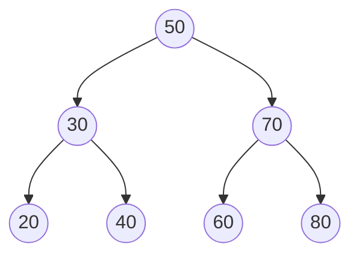
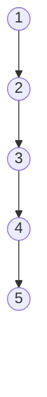
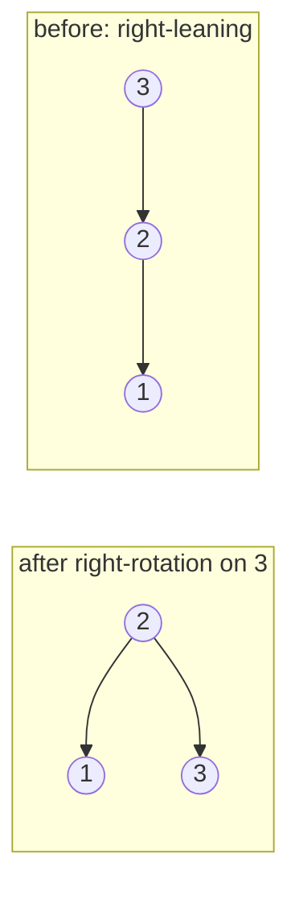

import InProduction from '../../components/InProduction.astro';
import InterviewChecklist from '../../components/InterviewChecklist.astro';
import AlgoViz from '../../components/problem/AlgoViz';
import { bstTrace } from '../../lib/traces';

The [hash table](/chapters/hash-tables-and-hashing) bought you O(1) lookup, and it charged a
price you may not have noticed at the time: it threw away order. Ask a hash table for the
smallest key, or every key between 100 and 200, or the next key after this one, and it has no
answer — its whole design is to scatter keys so that neighbors in value-space land nowhere near
each other in memory. That scattering *is* the O(1). It is also why sorted iteration, range
queries, and min/max are simply not questions a hash table can answer.

An array can answer them — if it's sorted. Sort an array and you get O(log n) binary search,
sorted iteration for free, and range queries by finding the endpoints. But now every insert has
to shift elements to keep the order: O(n). So an array gives you ordering *or* fast insert, never
both. You are forced to choose.

The binary search tree refuses the choice. It keeps data in sorted order *and* supports search,
insert, and delete all in O(log n) — no shifting, no rehashing, order preserved through every
mutation. That combination — **ordered data with logarithmic everything** — is the reason the
structure exists, and it is the one thing neither of the structures before it could give you.
**This chapter is about how a tree delivers that, where the O(log n) quietly breaks, and why the
systems that need ordered lookup at scale — databases — don't actually use binary trees at all.**

## The one idea: the ordering invariant

A binary search tree is a binary tree — every node has at most a left child and a right child —
with one rule enforced at every node:

> Everything in the left subtree is **less than** the node. Everything in the right subtree is
> **greater than** it.

That single invariant, holding recursively at every node, is the entire structure. Here is a
balanced BST over seven keys:



Search falls straight out of the invariant. To find a key, start at the root and compare: if the
target is smaller, the answer can only be to the left, so go left; if larger, go right; if equal,
you're done. Every comparison discards an entire subtree. In a balanced tree that halves the
remaining nodes each step — O(log n), the same "throw away half" logic as binary search, but on a
structure you can also insert into cheaply.

```cpp
Node* search(Node* node, int key) {
    while (node) {
        if (key == node->data) return node;   // found it
        node = key < node->data ? node->left   // answer is left
                                : node->right;  // answer is right
    }
    return nullptr;                             // fell off the tree: absent
}
```

Insert follows the exact same walk: descend as if searching, and when you fall off the bottom,
that empty spot is precisely where the key belongs. Hang a new node there and the invariant still
holds. Delete is the only fiddly one — removing a node with two children means promoting its
**in-order successor** (the smallest key in its right subtree) into the gap so ordering survives.

The payoff of the invariant is the part hash tables can't touch. Walk the tree **left, node,
right** — an in-order traversal — and you visit the keys in *sorted order*, every time:

```cpp
void inorder(Node* node) {
    if (!node) return;
    inorder(node->left);            // everything smaller, first
    std::cout << node->data << ' '; // then this node
    inorder(node->right);           // then everything larger
}
```

That's why the tree can do the things the hash table couldn't. Sorted iteration is just an
in-order walk. Min is "keep going left"; max is "keep going right." A range query — every key in
`[lo, hi]` — is an in-order walk that prunes subtrees entirely outside the range. None of these
cost more than they should, and none are even expressible on a hash table.

Watch the invariant do the work: every comparison discards a whole subtree, so an insert or a
lookup follows one root-to-leaf path instead of scanning. That is the halving — the same idea as
binary search, now over a structure you can also mutate cheaply.

<AlgoViz client:visible kind="bst" steps={bstTrace} title="Watch it run: insert and search in a BST" />

## The balance problem: where O(log n) breaks

Everything above assumed the tree was *balanced* — short and bushy, roughly log₂(n) levels deep.
Nothing so far guarantees that. The tree's shape is decided entirely by the order keys arrive,
and one arrival order breaks it completely: **sorted input.**

Insert 1, 2, 3, 4, 5 into an empty BST in order. Each key is larger than everything before it, so
each one goes right, then right, then right:



That is not a tree in any useful sense. It is a linked list wearing tree pointers. Search is now
O(n), insert is O(n), and the whole O(log n) promise is gone — destroyed by the single most
common input pattern in the real world, already-sorted data. A BST that doesn't defend against
this is a performance bug waiting for its trigger.

The fix is **self-balancing trees**, which detect lopsidedness during insert and delete and
correct it with **rotations** — local, O(1) pointer rewirings that lift a deep subtree up and
push a shallow one down, preserving the ordering invariant while shortening the tree. A rotation
is just this:



Same three keys, same in-order reading (1, 2, 3), but two levels instead of three. Apply
rotations systematically and you can hold the tree's height at O(log n) no matter what order keys
arrive. You do not need to memorize the exact rebalancing rules — the two families that matter in
practice are worth knowing by name:

- **AVL trees** keep strict balance (subtree heights differ by at most 1). Shorter trees, faster
  lookups, but more rotations on every write.
- **Red-black trees** keep a looser balance using node colors and a black-height rule. Slightly
  taller, but fewer rotations per write — a better all-round trade for mixed read/write workloads.

Red-black trees are the ones you actually use, usually without knowing it: they are what back
C++'s `std::map` and `std::set`, and Java's `TreeMap` and `TreeSet`. When you reach for an
*ordered* map, you are reaching for a red-black tree.

## A hardware foreshadow: O(log n) is not the same as fast

Here is the uncomfortable part, and it is the book's whole thesis in miniature. A balanced BST is
O(log n), and O(log n) is supposed to be fast. On real hardware, it often isn't — and Big-O
cannot see why.

Walk a binary tree and each level does almost no work: one comparison, then follow a pointer to a
child. But that child was allocated whenever it was inserted, so it lives at some unpredictable
address on the heap. Following the pointer is very likely a **cache miss** — the CPU stalls for
~100 cycles fetching a line from main memory, and the *only* useful thing on that line is one
key and two more pointers. So you pay a full cache miss to make one comparison, then do it again
at the next level, and the next.

And there are a lot of levels. For a million keys, log₂(n) is about 20 — twenty potential cache
misses, twenty stalls, to find one key. The structure is doing the asymptotically right number of
comparisons and the practically wrong number of memory accesses. One key per cache line, one
cache miss per level, is close to the worst access pattern the memory system has — the exact
opposite of the [array](/chapters/basic-data-structures) the prefetcher was built to love.

This is precisely why disk- and cache-aware systems abandon the binary tree. If a cache miss buys
you only one comparison, the fix is to make each node hold *hundreds* of keys — one wide node per
cache line (or per disk page), so a single memory fetch resolves many comparisons and the tree
becomes shallow enough to bottom out in three or four levels instead of twenty. That structure is
the **B-tree**, and it is what actually indexes every database you've used. The next chapter
measures a B-tree beating a binary tree by roughly 8× on the same keys — not by changing the
Big-O, which is identical, but purely from cache behavior.

## Where this actually lives

Trees show up in two distinct roles: as **ordered maps** (the balanced-BST story above) and as
**hierarchy** (anything with a genuine parent-child shape). Both are everywhere.

<InProduction>
- **`std::map`, `std::set`, Java `TreeMap` / `TreeSet`** — the ordered associative containers in these standard libraries are red-black trees. You get O(log n) lookup *plus* sorted iteration, `lower_bound`/`upper_bound` range queries, and floor/ceiling — the exact operations a hash map can't do.
- **Linux process scheduling** — the Completely Fair Scheduler (CFS) keeps runnable tasks in a red-black tree keyed by each task's virtual runtime. "Who runs next" is just "leftmost node," and inserting a woken task is O(log n). Ordered structure, chosen for a hot kernel path.
- **Interval and range trees** — augmented BSTs that answer "which stored intervals overlap this one?" in O(log n + k). They power collision detection, calendar/booking conflict checks, and genomic range queries.
- **Compilers and query planners** — a parsed program or SQL statement *is* a tree: the abstract syntax tree and the query plan. Optimizers rewrite them by walking and transforming subtrees.
- **The DOM** — every web page is a tree of nodes, and every `querySelector`, layout pass, and style resolution is a tree traversal. The most-manipulated data structure on Earth is a tree.
- **Heaps** — a *different* tree (a complete binary tree, usually stored in a flat array, ordered by the heap property rather than the BST invariant) that gives O(1) min/max and O(log n) insert/extract. It's the engine inside priority queues, Dijkstra's algorithm, event simulators, and OS schedulers.
- **NOT database indexes.** This is the one everyone gets wrong: the B-tree index in MySQL, PostgreSQL, SQLite, and essentially every storage engine is a tree, but it is emphatically **not a binary tree** — it's a wide, shallow B-tree built for the cache and disk. That's the entire subject of the [next chapter](/chapters/b-trees).
</InProduction>

## Engineering judgment: reach for a tree when…

- **You need lookup by key *and* order at the same time.** Sorted iteration, range queries, "next key after X," min/max, floor/ceiling — an ordered map (`std::map`) answers all of these in O(log n). A hash map answers none of them.
- **Reach for a hash map instead when you only need exact-key lookup.** If you never ask an ordered question, the hash map's O(1) beats the tree's O(log n) *and* its cache behavior — no contest.
- **Reach for a B-tree (the next chapter) when the data is large or on disk.** Once `n` is big enough that the ~20 cache misses per binary-tree lookup dominate, a wide, shallow tree wins decisively. This is why it, not a BST, is what databases index with.
- **When you do use a BST, make sure it's a balanced one.** Never hand-roll a plain BST and feed it sorted data — you'll get a linked list. Use the standard library's red-black tree, which is balanced for you.

## Interview checklist

<InterviewChecklist>
**Say this, not that.** "Tree operations are O(log n)" is the trap. The full answer: "O(log n) *if the tree is balanced* — a plain BST degrades to O(n) on sorted input because it becomes a linked list. That's why self-balancing trees (red-black, AVL) exist, and why `std::map` is one."

**The traversals — know all four cold**
- **In-order** (left, node, right): yields **sorted order** on a BST. This is the single most-tested tree fact — be ready to explain *why* it's sorted (the invariant guarantees left < node < right at every step).
- **Pre-order** (node, left, right): serialization, copying a tree, prefix expressions.
- **Post-order** (left, right, node): freeing a tree, computing heights bottom-up, postfix expressions.
- **Level-order / BFS** (a queue, level by level): shortest path to a leaf, right-side view, zigzag, "process the tree one level at a time."

**Problems that are really "walk a tree"**
- **Validate a BST** — the classic wrong answer checks only `left < node < right` locally; the correct one passes down a `(min, max)` range, or does an in-order walk and checks it's strictly increasing.
- **Lowest common ancestor** — in a plain binary tree, recurse and return the node where the two targets split; in a *BST*, exploit the ordering and just descend until the values straddle the current node.
- **Height and diameter** — both fall out of one post-order pass returning subtree heights.

**Common mistakes**
- Assuming the BST is balanced. State the assumption or reach for a balanced tree; the interviewer is often probing exactly this.
- Mishandling duplicate keys — decide up front whether they go left, right, or are rejected, and be consistent.
- Recursion depth: a skewed tree can be `n` levels deep and **overflow the call stack**. On adversarial or unbalanced input, use an explicit stack (iterative traversal) instead of recursion.
</InterviewChecklist>

## Takeaways

- A binary search tree exists to give you **ordering and O(log n) simultaneously** — the range queries and sorted iteration a [hash table](/chapters/hash-tables-and-hashing) threw away, without the O(n) inserts a sorted array would cost.
- The whole structure is **one invariant** (left < node < right, everywhere), and the payoff is that an **in-order traversal yields sorted order**.
- **Balance is not free.** A plain BST degrades to a linked list — O(n) — on sorted input; self-balancing trees (red-black, AVL) restore O(log n) via O(1) rotations, and red-black trees are what back `std::map` and Java's `TreeMap`.
- O(log n) is **not the same as fast on real hardware**: a binary tree pays a cache miss per level, ~20 of them for a million keys. That is why disk- and cache-aware systems use wide, shallow B-trees instead.

Next, [B-trees](/chapters/b-trees) — where making each node wide enough to fill a cache line turns the same O(log n) into an ~8× speedup, and you finally see why every database index is built this way.
